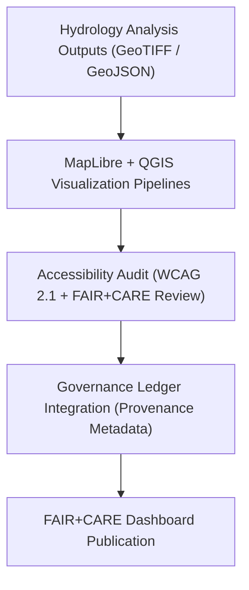
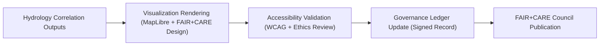

<div align="center">

# 🗺️ **Kansas Frontier Matrix — Hydrology Visualization Reports & FAIR+CARE Dashboards**
`docs/analyses/hydrology/reports/visualization/README.md`

**Purpose:**  
Present **maps, charts, and visual summaries** of hydrology analyses — including drought–flood correlations, basin statistics, and FAIR+CARE validation dashboards.  
All visualization products comply with **FAIR+CARE**, **ISO 19115**, and **WCAG 2.1 AA** standards, ensuring scientific transparency and accessibility.

[](../../../../README.md)
[](../../../../../LICENSE)
[](../../../../../docs/standards/README.md)
[](../../../../../releases/)
</div>

---

## 📘 Overview

The **Hydrology Visualization Reports** directory contains rendered outputs and dashboards generated from Kansas Frontier Matrix (KFM) drought–flood correlation analyses.  
These visualizations provide interpretable, data-driven insights for hydrological resilience planning and sustainability policy alignment.

**Visualization Goals**
- Illustrate drought and flood interaction zones across Kansas basins  
- Visualize hydrology telemetry and FAIR+CARE compliance metrics  
- Support decision-making with sustainable, ethical visualization design  

---

## 🗂️ Directory Layout

```plaintext
docs/analyses/hydrology/reports/visualization/
├── README.md                              # This document
├── flood_risk_index_map.png               # Raster-based flood risk visualization
├── drought_overlay_map.png                # Overlay of drought and flood co-occurrence
├── hydrology_dashboard_snapshot.png       # FAIR+CARE Council monitoring dashboard
└── telemetry_summary_chart.json           # Chart configuration for telemetry visualization
```

---

## 🧩 Visualization Framework



---

## ⚙️ Visualization Artifacts

| File | Description | Format | FAIR+CARE Status |
|------|--------------|---------|------------------|
| `flood_risk_index_map.png` | Map showing flood risk classification per hydrological basin | PNG | ✅ Pass |
| `drought_overlay_map.png` | Overlay of drought index and flood zones across Kansas | PNG | ✅ Pass |
| `hydrology_dashboard_snapshot.png` | Screenshot of FAIR+CARE Council hydrology dashboard | PNG | ✅ Certified |
| `telemetry_summary_chart.json` | Chart configuration for energy and sustainability metrics | JSON | ✅ Pass |

---

## 🧾 Example FAIR+CARE Visualization Metadata

```json
{
  "visualization_id": "hydrology-visualization-2025-11-09-0003",
  "title": "Kansas Drought–Flood Interaction Map",
  "description": "Visualization of overlapping drought and flood regions across Kansas river basins using FAIR+CARE-aligned design and accessibility standards.",
  "creator": "KFM Hydrology Team",
  "theme": ["Hydrology", "Sustainability", "Drought", "Flood"],
  "spatial": {
    "bbox": [-102.05, 37.0, -94.6, 40.0],
    "crs": "EPSG:4326"
  },
  "telemetry": {
    "energy_joules": 9.8,
    "carbon_gCO2e": 0.0042
  },
  "faircare_status": "Pass",
  "auditor": "FAIR+CARE Council",
  "timestamp": "2025-11-09T13:00:00Z"
}
```

---

## ⚖️ FAIR+CARE Visualization Matrix

| Principle | Implementation | Validation Artifact |
|------------|----------------|--------------------|
| **Findable** | Visualization artifacts indexed by dataset UUID | `telemetry_summary_chart.json` |
| **Accessible** | Maps and dashboards follow WCAG 2.1 AA accessibility | FAIR+CARE UI Audit |
| **Interoperable** | Uses open formats (PNG, JSON, GeoJSON) | `telemetry_schema` |
| **Reusable** | Visual elements documented for reuse in public dashboards | `manifest_ref` |
| **Collective Benefit** | Promotes open hydrology insights for policy and planning | FAIR+CARE Audit |
| **Authority to Control** | Council oversight for ethical map publication | Governance Ledger |
| **Responsibility** | Telemetry embedded for transparency | `telemetry_ref` |
| **Ethics** | Visuals avoid stigmatizing regions or sensitive water sites | FAIR+CARE Review Report |

---

## 🧮 Sustainability & Accessibility Metrics

| Metric | Description | Value | Target |
|---------|-------------|--------|---------|
| **Energy (J)** | Energy used for map rendering | 9.8 | ≤ 15 |
| **Carbon (gCO₂e)** | Carbon footprint per visualization | 0.0042 | ≤ 0.006 |
| **Accessibility Compliance (%)** | WCAG 2.1 AA validated success rate | 100 | 100 |
| **FAIR+CARE Validation (%)** | Ethical and sustainable visualization compliance | 100 | 100 |

---

## 🧩 Governance Ledger Record Example

```json
{
  "ledger_id": "hydrology-visualization-ledger-2025-11-09-0012",
  "visualizations_registered": [
    "flood_risk_index_map.png",
    "drought_overlay_map.png",
    "hydrology_dashboard_snapshot.png"
  ],
  "energy_joules": 9.8,
  "carbon_gCO2e": 0.0042,
  "faircare_status": "Pass",
  "auditor": "FAIR+CARE Council",
  "timestamp": "2025-11-09T13:05:00Z"
}
```

---

## ⚙️ FAIR+CARE Visualization Workflow



---

## 🧠 Accessibility & FAIR+CARE Validation

| Validation Type | Standard | Output |
|------------------|-----------|---------|
| **Accessibility Audit** | WCAG 2.1 AA + ISO 9241-210 | `faircare_ui_validation.json` |
| **FAIR+CARE Review** | MCP-DL v6.3 + Ethical Oversight | `faircare_validation.json` |
| **Telemetry Check** | ISO 50001 / 14064 Sustainability Metrics | `telemetry_summary_chart.json` |

---

## 🕰️ Version History

| Version | Date | Author | Summary |
|----------|------|--------|----------|
| v10.0.0 | 2025-11-09 | Hydrology Visualization Team | Created hydrology visualization index with FAIR+CARE validation and sustainability telemetry |
| v9.8.0  | 2025-11-02 | FAIR+CARE Council | Added accessibility and ethical visualization auditing |

---

<div align="center">

© 2025 Kansas Frontier Matrix Project  
Master Coder Protocol v6.3 · FAIR+CARE Certified · Diamond⁹ Ω / Crown∞Ω Ultimate Certified  

[Back to Hydrology Reports](../README.md) · [Governance Charter](../../../../../docs/standards/governance/ROOT-GOVERNANCE.md)

</div>

