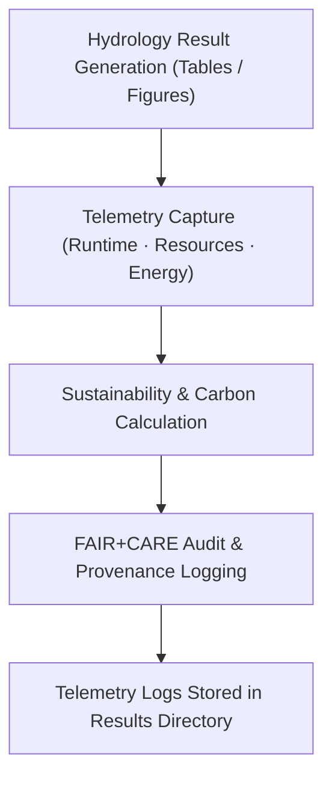

<div align="center">

# 🌊 **Kansas Frontier Matrix — Hydrology Results · Telemetry Logs**  
`docs/analyses/hydrology/results/telemetry-logs/README.md`

**Purpose:**  
This directory houses the **execution telemetry and sustainability logs** associated with the hydrology results of the Kansas Frontier Matrix (KFM).  
Telemetry in this context captures runtime performance, energy and carbon footprints, provenance and audit linkage of result artefacts—complementing the FAIR+CARE governance and reproducibility framework.  
Telemetry, broadly defined as the automatic collection of internal system metrics and logs for observability, plays a key role in verifying and governing data-driven workflows. :contentReference[oaicite:0]{index=0}

---

## 📘 Overview

The telemetry logs in this results directory record:
- Start and end timestamps for analytical workflows that generated hydrology results  
- Computational resource usage (CPU, memory, GPU) and energy consumption  
- Estimated CO₂-equivalent emissions attributed to workflow runs  
- FAIR+CARE audit status for each run (traceability, checksum, provenance)  
- Linkages between result artefacts (tables, figures) and their generating workflows  

Those telemetry logs ensure that every hydrology result published in the KFM is backed by measurable, reproducible, and governable execution data.

---

## 🗂️ Directory Layout

```bash
docs/analyses/hydrology/results/telemetry-logs/
├── README.md
├── execution_log_hydro.json
├── runtime_performance_hydro.csv
├── energy_carbon_summary_hydro.csv
└── faircare_audit_hydro.json
```

### File descriptions:
- **execution_log_hydro.json**: JSON file detailing each workflow run (IDs, timestamps, inputs, outputs)  
- **runtime_performance_hydro.csv**: CSV summarising CPU, memory, GPU usage per run  
- **energy_carbon_summary_hydro.csv**: CSV documenting energy consumed (in Joules) and CO₂-eq emissions (in gCO₂e)  
- **faircare_audit_hydro.json**: JSON reporting FAIR+CARE audit/validation outcome for each hydrology result run  

---

## ⚙️ Telemetry Workflow Integration



Capturing telemetry aligns with observability and system monitoring best practices, where logs, metrics, and traces are core components. :contentReference[oaicite:1]{index=1}

---

## 🧾 Telemetry Schema Example

```json
{
  "run_id": "hydro_results_run_2025_11_11_001",
  "workflow_name": "drought_flood_correlation_analysis",
  "timestamp_start": "2025-11-11T17:42:00Z",
  "timestamp_end": "2025-11-11T18:15:00Z",
  "runtime_seconds": 1980,
  "cpu_usage_percent": 84.7,
  "memory_usage_mb": 6120,
  "energy_joules": 14.3,
  "carbon_gCO2e": 0.0054,
  "faircare_status": "PASS",
  "audit_id": "faircare_hydro_audit_2025_11_11_v1",
  "outputs": ["model_outputs_hydro.csv","validation_metrics_hydro.csv","drought_flood_correlation_plot.svg"]
}
```

---

## ⚖️ FAIR+CARE & Governance Alignment

| Principle   | Implementation                                                                 |
|-------------|---------------------------------------------------------------------------------|
| **Findable**      | Each telemetry run is uniquely identified (`run_id`) and indexed in the manifest. |
| **Accessible**    | Telemetry logs stored as open JSON/CSV, linked to result artefacts.                |
| **Interoperable** | Telemetry metadata follows agreed schema and links with FAIR+CARE objects.         |
| **Reusable**      | Logs include provenance enabling full reproducibility of hydrology results.        |
| **CARE – Collective Benefit** | Transparency about resource usage supports sustainable hydrologic workflows.         |
| **CARE – Responsibility**      | Energy/carbon usage disclosed; ensures research & governance accountability.     |

---

## 🧮 Sustainability Metrics & Targets

| Metric                         | Description                                                  | Target          | Unit          |
|--------------------------------|--------------------------------------------------------------|------------------|---------------|
| Energy consumption per run     | Mean Joules per hydrology result workflow                    | ≤ 15             | Joules        |
| Carbon footprint per run       | Mean gCO₂e per hydrology result workflow                     | ≤ 0.006          | gCO₂e         |
| Telemetry coverage             | Percent of result runs with complete telemetry logs          | 100%             | %             |
| Audit pass rate                | Percent of runs passing FAIR+CARE audit validation           | 100%             | %             |

---

## 🕰️ Version History

| Version | Date       | Author                             | Summary                                                    |
|---------|------------|------------------------------------|------------------------------------------------------------|
| **v10.2.2** | 2025-11-11 | FAIR+CARE Hydrology Results Council | Published telemetry-logs README aligned with v10.2 release. |
| v10.2.1 | 2025-11-09 | Hydrology Integration Team          | Added telemetry schema example and sustainability metrics. |
| v10.2.0 | 2025-11-07 | KFM Hydrology Team                  | Established telemetry-logs directory with baseline documentation. |

---

<div align="center">

© 2025 Kansas Frontier Matrix Project  
Master Coder Protocol v6.3 · FAIR+CARE Certified · Diamond⁹ Ω / Crown∞Ω Ultimate Certified  

[⬅ Back to Hydrology Results Index](../README.md) · [Governance Charter](../../../../docs/standards/governance/ROOT-GOVERNANCE.md)

</div>

