<div align="center">

# 🌊 **Kansas Frontier Matrix — Hydrology Results · Telemetry Logs**  
`docs/analyses/hydrology/results/telemetry-logs/README.md`

**Purpose:**  
This directory houses the **execution telemetry and sustainability logs** associated with the hydrology results of the Kansas Frontier Matrix (KFM).  
Telemetry captures runtime performance, energy and carbon footprints, provenance, and audit linkage of hydrology result artefacts—ensuring traceability under **FAIR+CARE** and **MCP-DL v6.3** reproducibility governance.

[](../../../../README.md)  
[](../../../../../docs/standards/faircare.md)  
[](../../../../../LICENSE)  
[](../../../../../releases/v10.2.0/manifest.zip)

</div>

---

## 📘 Overview

Telemetry logs record the lifecycle of each hydrological workflow—capturing parameters, execution context, and sustainability indicators such as energy and carbon use.  
These records enable validation of FAIR+CARE compliance and ensure every figure, table, and analysis in the hydrology domain is fully reproducible and ethically governed.

---

## 🗂️ Directory Layout

```bash
docs/analyses/hydrology/results/telemetry-logs/
├── README.md                       # This file
├── execution_log_hydro.json         # Detailed record of workflow runs and parameters
├── runtime_performance_hydro.csv    # CPU/memory/GPU usage metrics per execution
├── energy_carbon_summary_hydro.csv  # Energy and CO₂ equivalent metrics
└── faircare_audit_hydro.json        # FAIR+CARE audit outcomes for each run
```

---

## ⚙️ Telemetry Workflow Integration

```mermaid
flowchart TD
    A["Hydrology Result Generation (Tables · Figures)"]
    --> B["Telemetry Capture (Runtime · Resources · Energy)"]
    B --> C["Sustainability & Carbon Accounting"]
    C --> D["FAIR+CARE Audit & Provenance Logging"]
    D --> E["Telemetry Logs Archived in Results Directory"]
```



Telemetry collection follows the observability triad—logs, metrics, and traces—aligned with OpenTelemetry principles for transparent scientific computing.

---

## 🧾 Telemetry Schema Example

```json
{
  "run_id": "hydro_results_run_2025_11_11_001",
  "workflow_name": "drought_flood_correlation_analysis",
  "timestamp_start": "2025-11-11T17:42:00Z",
  "timestamp_end": "2025-11-11T18:15:00Z",
  "runtime_seconds": 1980,
  "cpu_usage_percent": 84.7,
  "memory_usage_mb": 6120,
  "energy_joules": 14.3,
  "carbon_gCO2e": 0.0054,
  "faircare_status": "PASS",
  "audit_id": "faircare_hydro_audit_2025_11_11_v1",
  "outputs": [
    "model_outputs_hydro.csv",
    "validation_metrics_hydro.csv",
    "drought_flood_correlation_plot.svg"
  ]
}
```

---

## ⚖️ FAIR+CARE & Governance Alignment

| Principle | Implementation |
|------------|----------------|
| **Findable** | Telemetry runs uniquely identified and indexed in manifest. |
| **Accessible** | JSON/CSV logs openly accessible and linked to hydrology artefacts. |
| **Interoperable** | Schema aligns with MCP telemetry and ISO 14064 energy standards. |
| **Reusable** | Provenance and audit data enable full re-execution of workflows. |
| **CARE – Collective Benefit** | Transparency about computational resources supports sustainable research. |
| **CARE – Responsibility** | Carbon and energy metrics disclosed; accountability ensured. |

---

## 🧮 Sustainability Metrics

| Metric | Description | Value | Target | Unit |
|---------|-------------|--------|---------|------|
| **Energy (J)** | Mean energy per hydrology result workflow | 14.3 | ≤ 15 | Joules |
| **Carbon (gCO₂e)** | CO₂ equivalent per result workflow | 0.0054 | ≤ 0.006 | gCO₂e |
| **Telemetry Coverage (%)** | Workflows with full telemetry and provenance | 100 | ≥ 95 | % |
| **Audit Pass Rate (%)** | FAIR+CARE validation success | 100 | 100 | % |

---

## 🕰️ Version History

| Version | Date | Author | Summary |
|----------|------|---------|----------|
| **v10.2.2** | 2025-11-11 | FAIR+CARE Hydrology Results Council | Updated telemetry-logs README; fixed layout and structure alignment. |
| **v10.2.1** | 2025-11-09 | Hydrology Integration Team | Added telemetry schema and sustainability table. |
| **v10.2.0** | 2025-11-07 | KFM Hydrology Team | Created base telemetry-logs directory and documentation. |

---

<div align="center">

© 2025 Kansas Frontier Matrix Project  
Master Coder Protocol v6.3 · FAIR+CARE Certified · Diamond⁹ Ω / Crown∞Ω Ultimate Certified  

[⬅ Back to Hydrology Results Index](../README.md) · [Governance Charter](../../../../docs/standards/governance/ROOT-GOVERNANCE.md)

</div>
