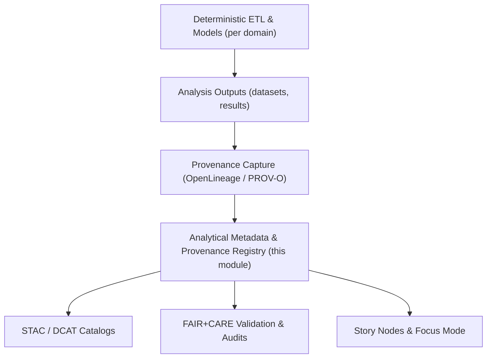

<div align="center">

# 📚 **Kansas Frontier Matrix — Analytical Metadata & Provenance Registry**  
`docs/analyses/metadata/README.md`

**Purpose:**  
Provide a centralized registry for all **metadata, provenance, and validation summaries** linked to analytical outputs within the **Kansas Frontier Matrix (KFM)**.  
Ensure that all cross-domain and domain-specific analyses maintain **FAIR+CARE compliance**, full **traceability**, and **NASA-grade reproducibility** under **Master Coder Protocol v6.3**.

[](../../../README.md)  
[](../../standards/README.md)  
[](../../../LICENSE)  
[](../../../releases/)

</div>

---

## 📘 Overview

The **Analytical Metadata & Provenance Registry** acts as the **master index** for KFM analytical outputs:

- Analytical provenance tracking (e.g., `analysis-index.json`),  
- FAIR+CARE validation results (e.g., `validation-summary.md`),  
- Provenance schemas and metadata standards,  
- Linkages between `datasets/`, `methods/`, and `results/` across all analysis domains.

This registry ensures:

- **Consistent metadata governance**,  
- **Complete lineage** for all computational workflows, and  
- Alignment with **FAIR+CARE** and **MCP-DL v6.3**.

It is the primary entry point for:

- Discovering what analyses exist,  
- Understanding how they were produced, and  
- Verifying that they are ethically and technically safe to reuse.

---

## 🗂️ Directory Layout

### Documentation & registry files

```text
📁 docs/
└── 📁 analyses/
    └── 📁 metadata/
        ├── 📄 README.md                          # This file (Analytical Metadata & Provenance Registry)
        ├── 🧾 analysis-index.json                # Machine-readable index of analyses & their metadata
        ├── 🧾 provenance-schema.json             # Standardized provenance field definitions (JSON Schema)
        ├── 📄 validation-summary.md              # Quarterly FAIR+CARE validation summary across domains
        └── 📁 audit-reports/                     # Governance and compliance artifacts
            ├── 🧾 faircare-audit-Q4-2025.json
            ├── 📄 provenance-validation.log
            └── 📄 governance-review-summary.md
```

### Related data and provenance artifacts (conceptual)

```text
📁 dist/
├── 📁 provenance/
│   ├── 🧾 prov-<analysis-id>.jsonld              # PROV-O bundles per analysis
│   └── 🧾 prov-dataset-<dataset-id>.jsonld       # Dataset-specific provenance
└── 📁 audit/
    ├── 🧾 faircare-validation.json               # Aggregated audit results
    └── 🧾 metadata-validation-summary.json       # Metadata completeness & schema checks

📁 schemas/
└── 📁 telemetry/
    └── 🧾 analyses-metadata-v1.json              # Telemetry schema for registry-related metrics
```

---

## 🧭 Context

KFM’s analytical stack spans multiple domains (hydrology, ecology, climatology, history, land use, energy, etc.). Each domain produces:

- **Datasets** (raw, processed, derived),  
- **Methods** (models, workflows, notebooks),  
- **Results** (figures, dashboards, Story Nodes).

Without a cross-cutting metadata and provenance layer, it would be impossible to:

- Audit analyses for FAIR+CARE compliance,  
- Reproduce results reliably,  
- Safely compose multi-domain stories in Focus Mode.

The **Analytical Metadata & Provenance Registry**:

- Provides a **single, structured registry** of analyses and their provenance,  
- Binds together **STAC/DCAT catalogs** with PROV-O provenance,  
- Powers dashboards and governance audits through **telemetry exports**.

---

## 🧱 Architecture

### Registry role in the KFM pipeline



**Key responsibilities of the registry:**

- **Indexing** — provide `analysis-index.json` as a machine-readable map of analyses and their metadata.  
- **Schema standardization** — define mandatory provenance and metadata fields via `provenance-schema.json`.  
- **Validation integration** — store quarterly FAIR+CARE and metadata validation reports.  
- **Cross-domain linkage** — connect analyses across domains by IDs, datasets, and Story Nodes.

All analytical pipelines are expected to **emit records** that can be registered here, either directly or via generation scripts that conform to the schema.

---

## 📦 Data & Metadata

### Core components

| File / Folder              | Description                                                                 | Format        |
|----------------------------|-----------------------------------------------------------------------------|---------------|
| `analysis-index.json`      | Central listing of analyses, datasets, methods, and links to telemetry.    | JSON          |
| `provenance-schema.json`   | JSON Schema for mandatory provenance & metadata attributes.                | JSON Schema   |
| `validation-summary.md`    | Aggregated FAIR+CARE validation metrics across all analysis domains.       | Markdown      |
| `audit-reports/`           | Quarterly FAIR+CARE audits, governance notes, validation logs.             | JSON / MD     |

### Example analysis index record

```json
{
  "analysis_id": "crossdomain_carbonwater_v10",
  "title": "Carbon–Water Cycles Integration Analysis",
  "domain": ["Hydrology", "Ecology", "Climatology"],
  "datasets": [
    "hydrology_climate_merge.csv",
    "carbon_flux_observations.nc",
    "eco_hydro_biodiversity.geojson"
  ],
  "methods": [
    "carbon-water-modeling.md",
    "ai-multivariate-models.md"
  ],
  "results": [
    "carbon-water-summary.md",
    "correlation-matrix.png"
  ],
  "provenance": "docs/analyses/cross-domain/datasets/provenance/hydrology_climate_provenance.json",
  "faircare_score": 97.2,
  "validated_by": ["FAIR+CARE Council", "Data Standards Committee"],
  "last_validated": "2025-11-09"
}
```

### Provenance schema (summary)

Key fields expected in provenance records (see `provenance-schema.json` for details):

| Field            | Type     | Description                                         |
|------------------|----------|-----------------------------------------------------|
| `provenance_id`  | String   | Unique identifier for the provenance record.       |
| `source`         | Array    | Origin datasets and institutions.                  |
| `processing`     | Object   | Transformations, tools, workflow scripts.          |
| `license`        | String   | Usage license (CC-BY, CC0, restricted, etc.).     |
| `faircare`       | Object   | Ethical, consent, and CARE-related metadata.       |
| `validation`     | Object   | Audit results and FAIR+CARE score.                 |
| `links`          | Object   | STAC/DCAT IDs, Story Node IDs, telemetry references.|

These fields must be:

- **JSON-LD compatible**,  
- Mappable into **PROV-O** and **DCAT** representations, and  
- Sufficient to reconstruct the full analysis lineage.

---

## 🌐 STAC, DCAT & PROV Alignment

The registry does not replace catalogs; it **coordinates them**:

- **STAC**
  - Dataset-level spatial-temporal descriptors and assets live in STAC Collections and Items.  
  - Registry entries **reference** those Items via IDs/URLs, not raw paths.

- **DCAT**
  - High-level dataset descriptions for external discovery.  
  - Registry entries link analyses to DCAT Datasets and Distributions.

- **PROV-O**
  - Detailed provenance graphs for entities, activities, and agents.  
  - The registry indexes where PROV bundles live (`dist/provenance/...`) and how they relate to analyses.

All analytical metadata must be:

- Able to be **expressed as or linked to** STAC/DCAT/PROV entities.  
- Compatible with the KFM OpenLineage / CI lineage standard (see lineage docs).

---

## 🧪 Validation & CI/CD

### CI workflows (conceptual)

The registry integrates with dedicated CI workflows, typically under `.github/workflows/`, such as:

| Workflow                   | Purpose                                                    | Output Artifact                                    |
|----------------------------|------------------------------------------------------------|---------------------------------------------------|
| `metadata-validation.yml`  | Check metadata completeness & schema conformity.           | `reports/metadata/validation-summary.json`        |
| `faircare-audit.yml`      | Confirm analyses & datasets have consent/ethical approval. | `reports/data/faircare-validation.json`           |
| `telemetry-export.yml`    | Export registry statistics & audits to telemetry.          | `releases/v11.2.4/analyses-metadata-telemetry.json` |
| `provenance-verify.yml`   | Verify dataset lineage & reproducibility paths.            | `reports/data/provenance-summary.json`            |

### Quarterly FAIR+CARE metrics (example)

```text
📊 Excerpt from validation-summary.md
```

| Domain                  | FAIR+CARE Score | Provenance Coverage | Consent Compliance | Validation Date |
|-------------------------|-----------------|---------------------|--------------------|-----------------|
| **Hydrology**           | 97.3%           | 100%                | 100%               | 2025-11-09      |
| **Climatology**         | 96.8%           | 100%                | 100%               | 2025-11-09      |
| **Ecology**             | 98.1%           | 100%                | 100%               | 2025-11-09      |
| **Geology**             | 95.9%           | 99%                 | 100%               | 2025-11-09      |
| **Historical / Land Use** | 97.5%        | 100%                | 100%               | 2025-11-09      |

These values are **summaries**; underlying runs must be traceable to specific:

- CI workflows,  
- PROV bundles, and  
- Telemetry entries.

---

## 🧠 Story Node & Focus Mode Integration

The registry is a **core dependency** for Story Nodes and Focus Mode:

- Story Nodes reference:
  - Analyses by `analysis_id`,  
  - Datasets by STAC/DCAT IDs,  
  - Provenance bundles by `provenance_id`.

- Focus Mode relies on:
  - Registry metadata to **surface relevant analyses** for a selected place/time,  
  - FAIR+CARE and provenance indicators to show **trust levels**,  
  - Links to validation summaries and audits when users need detail.

Patterns:

- Each Story Node should include:
  - A list of `analysis_id`s from `analysis-index.json`,  
  - A pointer to domain-level validation in `validation-summary.md`,  
  - A quick view of FAIR+CARE scores.

- Focus Mode should be able to:
  - Filter analyses by **domain**, **time period**, **FAIR+CARE score**, and **provenance coverage**,  
  - Traverse from a Story Node → analysis → provenance → raw data.

---

## ⚖ FAIR+CARE & Governance

### FAIR & CARE matrix

| FAIR Principle | Implementation                                                                 | CARE Principle        | Implementation                                                                 |
|----------------|-------------------------------------------------------------------------------|-----------------------|-------------------------------------------------------------------------------|
| **Findable**   | Metadata indexed by persistent IDs, STAC/DCAT references, and registry search.| **Collective Benefit**| Registry promotes equitable sharing of validated analysis outcomes.           |
| **Accessible** | Registry and schemas published under CC-BY 4.0 where possible.               | **Authority to Control** | Metadata for culturally sensitive datasets governed by appropriate councils. |
| **Interoperable** | Follows ISO 19115, DCAT 3.0, JSON-LD, PROV-O, and KFM ontologies.        | **Responsibility**    | Consent and ethics fields are mandatory for sensitive datasets.              |
| **Reusable**   | Contains full lineage, version control, and linkage to licenses.             | **Ethics**            | Prevents uncontextualized or harmful reuse of sensitive analyses.            |

Governance responsibilities:

- The **FAIR+CARE Data Governance Council** owns:
  - The provenance schema,  
  - The validation summary structure,  
  - Acceptance criteria for registry entries.

- Domain teams are responsible for:
  - Emitting correct metadata and provenance,  
  - Responding to audit findings and remediation tasks.

---

## 🕰️ Version History

| Version  | Date       | Author / Steward               | Summary                                                                 |
|----------|------------|--------------------------------|-------------------------------------------------------------------------|
| v11.2.4  | 2025-12-07 | FAIR+CARE Data Governance Council | Aligned registry with KFM-MDP v11.2.4; added CI/telemetry integration & Story Node hooks. |
| v10.0.0  | 2025-11-10 | FAIR+CARE Data Governance Council | Established unified analytical metadata registry with provenance schema and validation summary integration. |

---

<div align="center">

**Kansas Frontier Matrix (KFM v11)**  

[📊 Analyses Overview](../README.md) · [📚 Standards & Governance](../../standards/README.md) · [⚖️ Root Governance](../../standards/governance/ROOT-GOVERNANCE.md)

</div>
