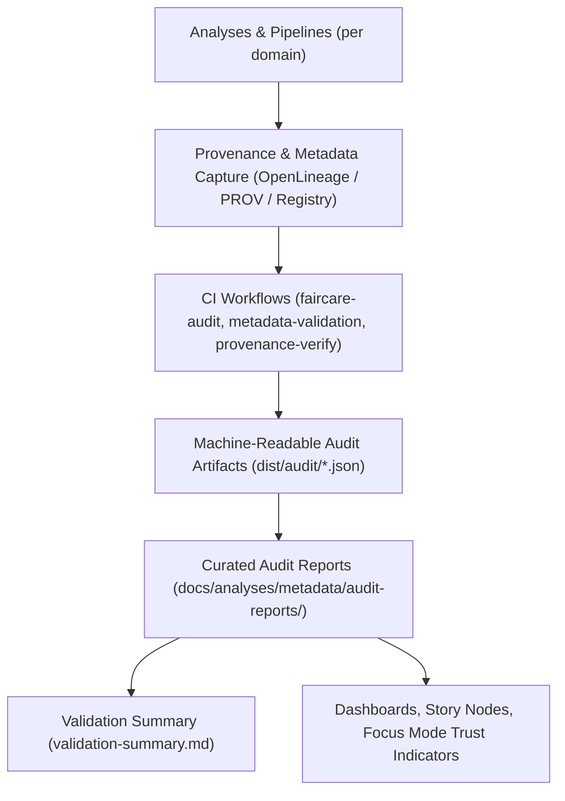

<div align="center">

# 🧾 **Kansas Frontier Matrix — Analytical Audit Reports**  
`docs/analyses/metadata/audit-reports/README.md`

**Purpose:**  
Document the structure, procedures, and governance standards for all **FAIR+CARE audit reports, provenance validations, and data ethics reviews** associated with KFM analytical workflows.  
These reports form the **governance backbone** of the Kansas Frontier Matrix (KFM), ensuring all analyses meet reproducibility, consent, and ethical data management benchmarks.

[](../../../../README.md)  
[](../../../standards/README.md)  
[](../../../../LICENSE)  
[](../../../../releases/)

</div>

---

## 📘 Overview

The **Analytical Audit Reports Directory** maintains verified records of:

- **FAIR+CARE audits** and ethical reviews of analyses and datasets,  
- **Provenance and metadata validation outcomes**,  
- **Quarterly and annual compliance summaries**,  
- **Governance council notes** and Indigenous Data Governance Board (IDGB) approvals where applicable.

All files in this directory are designed to be both **machine-readable** and **human-readable**, enabling:

- Continuous governance transparency,  
- Traceable decision-making, and  
- Strong alignment between CI validation pipelines and formal governance.

This README describes:

- How audit artifacts are organized,  
- What structure each audit file must follow, and  
- How these artifacts are consumed by other KFM modules (registry, telemetry, Story Nodes, Focus Mode).

---

## 🗂️ Directory Layout

### Audit reports module

```text
📁 docs/
└── 📁 analyses/
    └── 📁 metadata/
        ├── 📄 README.md                          # Analytical Metadata & Provenance Registry overview
        ├── 🧾 analysis-index.json                # Registry of analyses & metadata
        ├── 🧾 provenance-schema.json             # Provenance schema (JSON Schema)
        ├── 📄 validation-summary.md              # Quarterly validation summary
        └── 📁 audit-reports/
            ├── 📄 README.md                      # ← This file (audit reports guide)
            ├── 🧾 faircare-audit-Q4-2025.json    # FAIR+CARE compliance results (example)
            ├── 📄 provenance-validation.log      # Provenance schema validation log (human-readable or plain text)
            ├── 📄 governance-review-summary.md   # Quarterly narrative governance summary
            └── 🧾 cross-validation-dashboard.json# Aggregated validation results for dashboards/CI
```

### Machine-readable audit artifacts (conceptual)

```text
📁 dist/
└── 📁 audit/
    ├── 🧾 faircare-validation.json               # Consolidated FAIR+CARE metrics from CI
    ├── 🧾 metadata-validation-summary.json       # Metadata completeness & schema checks
    └── 🧾 provenance-summary.json                # Provenance integrity & reproducibility checks
```

---

## 🧭 Context

Audit reports are the **formal evidence** that KFM’s analytical workflows:

- Respect FAIR+CARE principles,  
- Obey licensing, consent, and sovereignty constraints,  
- Maintain reproducibility and provenance standards.

They sit at the junction of:

- **CI & automation** — validation workflows that run whenever analyses or pipelines change, and  
- **Human governance** — FAIR+CARE Council and IDGB reviews, including narrative justifications and dissenting opinions when relevant.

This directory:

- Provides a **stable home** for audit outputs that must be preserved across releases,  
- Links CI-produced JSON artifacts with human-readable governance summaries,  
- Feeds higher-level summaries (e.g., `validation-summary.md`) and dashboards.

---

## 🧱 Architecture

### Audit generation & consumption flow



Roles:

- **CI workflows** produce structured JSON artifacts describing audit outcomes.  
- This directory curates **stable snapshots and governance narratives** corresponding to those artifacts.  
- Other modules (registry, Focus Mode, dashboards) **read from both** machine-readable and human-readable sides.

---

## 📦 Data & Metadata

### Audit report types

| File Type                    | Purpose                                                            | Format      | Primary Source Workflow        |
|------------------------------|--------------------------------------------------------------------|------------|--------------------------------|
| `faircare-audit-*.json`      | FAIR+CARE compliance metrics for datasets and analyses.           | JSON       | `faircare-audit.yml`          |
| `provenance-validation.log`  | Human-readable log for provenance schema validation.              | Text / MD  | `provenance-verify.yml`       |
| `governance-review-summary.md` | Narrative summary of quarterly governance reviews.              | Markdown   | Governance Secretariat         |
| `cross-validation-dashboard.json` | Aggregated validation metrics across pipelines & domains.   | JSON       | `metadata-validation.yml`     |

### Example FAIR+CARE audit record

```json
{
  "audit_id": "FAIRCARE-Q4-2025-001",
  "domain": "Cross-Domain Analyses",
  "audit_date": "2025-11-09",
  "audited_entities": 24,
  "compliance_summary": {
    "FAIR_compliance": 96.8,
    "CARE_compliance": 97.5,
    "Provenance_completeness": 100,
    "Consent_verification": 100
  },
  "issues_found": [
    {
      "id": "LULC-2025-04",
      "description": "One raster dataset lacked explicit consent metadata; corrected by IDGB review."
    }
  ],
  "validated_by": [
    "FAIR+CARE Governance Council",
    "Indigenous Data Governance Board",
    "KFM Data Standards Committee"
  ],
  "report_url": "docs/analyses/metadata/audit-reports/faircare-audit-Q4-2025.json"
}
```

This structure must:

- Conform to the relevant JSON Schema (if defined),  
- Be linked from `analysis-index.json` and/or `validation-summary.md` when summarizing results,  
- Be referenced in telemetry as part of the analyses-metadata audit metrics.

---

## 🌐 STAC, DCAT & PROV Alignment

Audit reports themselves are **not** STAC or DCAT catalogs, but they must:

- Reference **STAC Items and Collections** by ID or URL when they audit dataset-level behavior,  
- Reference **DCAT Datasets and Distributions** when discussing accessibility, licensing, or reuse,  
- Link to **PROV-O bundles** (`dist/provenance/*.jsonld`) that describe analytic activities and agents.

Patterns:

- `faircare-audit-*.json` should include:
  - STAC IDs for audited geospatial datasets,  
  - DCAT dataset identifiers for non-spatial datasets,  
  - PROV IDs (`provenance_id`) for underlying provenance records.

- `governance-review-summary.md` should:
  - Mention critical STAC/DCAT/PROV identifiers when discussing specific findings,  
  - Avoid vague references like “a certain dataset” where identifiers can safely be used.

---

## 🧪 Validation & CI/CD

### Governance validation workflows

| Workflow                   | Function                                                        | Output Artifact                                      |
|----------------------------|-----------------------------------------------------------------|------------------------------------------------------|
| `faircare-audit.yml`      | Run FAIR+CARE compliance checks across domains & analyses.      | `dist/audit/faircare-validation.json`               |
| `metadata-validation.yml` | Confirm schema compliance for audit reports & registry entries. | `dist/audit/metadata-validation-summary.json`       |
| `provenance-verify.yml`   | Validate provenance chain integrity and PROV-O correctness.     | `dist/audit/provenance-summary.json`                |
| `telemetry-export.yml`    | Publish audit metrics to telemetry & dashboards.                | `releases/v11.2.4/analyses-metadata-audit-telemetry.json` |

Audit files in this directory must:

- Be **CI-validated** against their schemas (if JSON) or structural rules (if Markdown),  
- Include sufficient metadata (timestamps, IDs, sign-offs) for governance review,  
- Be **versioned** and not silently overwritten without Version History updates.

### Governance metrics dashboard (example: Q4 2025)

| Metric                       | Q4 2025 Target           | Achieved | Verified By                     |
|------------------------------|--------------------------|----------|---------------------------------|
| FAIR+CARE Compliance         | ≥ 95%                    | 97.3%    | FAIR+CARE Council               |
| Provenance Completeness      | 100%                     | 100%     | Data Standards Committee        |
| Consent Verification         | 100% for cultural data   | 100%     | IDGB                            |
| Governance Transparency Index| ≥ 90%                    | 93%      | Governance Secretariat          |
| Report Accessibility         | ≥ 95%                    | 98%      | FAIR+CARE Portal Audit          |

Actual values must be drawn from the latest CI and governance artifacts, not edited arbitrarily.

---

## 🧠 Story Node & Focus Mode Integration

Audit reports influence how **trust** is displayed in Story Nodes and Focus Mode:

- Story Nodes can:
  - Link to specific `audit_id` records,  
  - Display whether underlying analyses have passed FAIR+CARE and provenance checks,  
  - Show excerpts from `governance-review-summary.md` where context is important.

- Focus Mode can:
  - Use audit metrics to **color-code trust indicators**,  
  - Filter out analyses or views that are under review or non-compliant,  
  - Provide drill-down from a narrative to:
    - Registry entries (`analysis-index.json`),  
    - PROV bundles,  
    - Audit reports in this directory.

The audit-reports directory therefore acts as a **back-end trust ledger** for front-end experiences.

---

## ⚖ FAIR+CARE & Governance

### FAIR & CARE mapping for audit reports

| FAIR Principle | Implementation                                                                 | CARE Principle        | Implementation                                                                 |
|----------------|-------------------------------------------------------------------------------|-----------------------|-------------------------------------------------------------------------------|
| **Findable**   | Each audit is indexed via IDs and referenced in manifests and telemetry.      | **Collective Benefit**| Reports promote data ethics & governance literacy across KFM teams.          |
| **Accessible** | Non-sensitive audit reports published under CC-BY 4.0; restricted ones flagged. | **Authority to Control** | Indigenous data governance approvals and restrictions encoded in audit records. |
| **Interoperable** | Structured JSON/MD outputs suitable for CI/CD and dashboards.            | **Responsibility**    | Auditors document rationale; ambiguous decisions require written justification. |
| **Reusable**   | Audit files are versioned with timestamps and checksums.                      | **Ethics**            | Prevents misuse or selective interpretation of governance results.           |

The **FAIR+CARE Data Governance Council** is responsible for:

- Approving the structure and content of this directory,  
- Ensuring alignment with root governance documents,  
- Triggering remediation work when audit findings indicate systemic issues.

---

## 🕰️ Version History

| Version  | Date       | Author / Steward                    | Summary                                                                 |
|----------|------------|-------------------------------------|-------------------------------------------------------------------------|
| v11.2.4  | 2025-12-07 | FAIR+CARE Data Governance Council   | Aligned audit reports README with KFM-MDP v11.2.4; added CI/telemetry and Story Node integration. |
| v10.0.0  | 2025-11-10 | FAIR+CARE Data Governance Council   | Created centralized audit reports documentation for FAIR+CARE, provenance, and validation logs.   |

---

<div align="center">

**Kansas Frontier Matrix (KFM v11)**  

[📚 Metadata & Provenance Registry](../README.md) · [📊 Validation Summary](../validation-summary.md) · [⚖️ Root Governance](../../../standards/governance/ROOT-GOVERNANCE.md)

</div>
