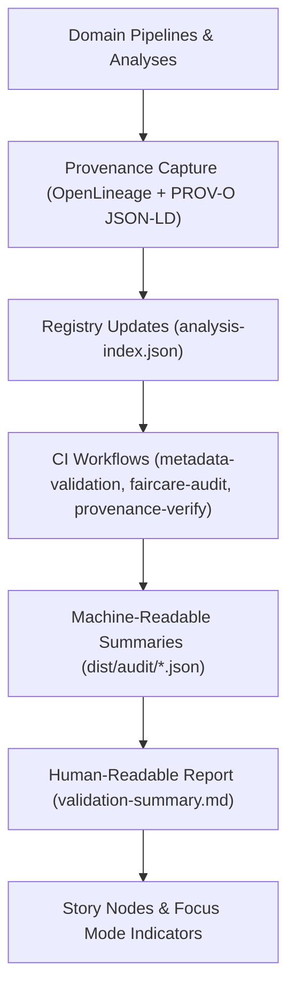

<div align="center">

# 📚 **Kansas Frontier Matrix — Analytical Metadata & Provenance Validation Summary**  
`docs/analyses/metadata/validation-summary.md`

**Purpose:**  
Summarize **quarterly FAIR+CARE, metadata, and provenance validation results** across all analytical domains in the **Kansas Frontier Matrix (KFM)**.  
Provide a **single, human-readable report** that reflects the state of:

- Metadata completeness and schema alignment,  
- Provenance coverage and reproducibility,  
- FAIR+CARE audit outcomes by domain,  
- CI workflow and telemetry health for analyses.

[](../../../README.md)  
[](../../standards/README.md)  
[](../../../LICENSE)  
[](../../../releases/)

</div>

---

## 📘 Overview

This document is the **quarterly roll-up** of analytical metadata and provenance validation across KFM.

It consolidates:

- **FAIR+CARE validation metrics** by domain (hydrology, climatology, ecology, geology, historical/land-use, etc.),  
- **Provenance coverage** (proportion of analyses with full PROV and OpenLineage records),  
- **Metadata completeness and schema conformity** (against `provenance-schema.json` and related standards),  
- Links to detailed audit artifacts stored under `docs/analyses/metadata/audit-reports/` and `dist/audit/`.

This summary is **descriptive**, not authoritative; any enforcement decisions or remediation plans must reference:

- The registry-level README at `docs/analyses/metadata/README.md`, and  
- The root governance documents under `docs/standards/governance/`.

---

## 🗂️ Directory Layout

This file sits within the **Analytical Metadata & Provenance Registry** module:

```text
📁 docs/
└── 📁 analyses/
    └── 📁 metadata/
        ├── 📄 README.md                      # Registry overview & architecture
        ├── 🧾 analysis-index.json            # Machine-readable listing of analyses
        ├── 🧾 provenance-schema.json         # JSON Schema for provenance fields
        ├── 📄 validation-summary.md          # ← This quarterly validation report
        └── 📁 audit-reports/                 # Detailed governance & validation artifacts
            ├── 🧾 faircare-audit-Q4-2025.json
            ├── 📄 provenance-validation.log
            └── 📄 governance-review-summary.md
```

Associated machine-readable artifacts are produced into `dist/` and referenced via telemetry:

```text
📁 dist/
└── 📁 audit/
    ├── 🧾 metadata-validation-summary.json   # Output from metadata-validation.yml
    ├── 🧾 faircare-validation.json           # Output from faircare-audit.yml
    └── 🧾 provenance-summary.json           # Output from provenance-verify.yml
```

---

## 🧭 Context

Every KFM analysis lives inside a **governed space** where:

- Metadata must be complete and **schema-aligned**,  
- Provenance must be **machine-readable and traceable**,  
- FAIR+CARE must be **reviewed and auditable**,  
- CI must enforce **reproducibility and determinism**.

This summary:

- Provides a **snapshot in time** (current quarter) of how well those expectations are being met,  
- Highlights domains that need remediation or deeper review,  
- Anchors Focus Mode and Story Node trust indicators in concrete metrics.

It is primarily consumed by:

- The **FAIR+CARE Data Governance Council**,  
- Domain leads (hydrology, ecology, etc.),  
- Reliability and lineage engineering teams,  
- Any consumer of high-level “how healthy is KFM’s analytical provenance?” dashboards.

---

## 🧱 Architecture

### Validation & reporting pipeline



Key steps:

1. **Capture:**  
   Pipelines emit OpenLineage events and PROV-O bundles as required by KFM provenance standards.

2. **Registry update:**  
   Entries are added/updated in `analysis-index.json` and linked to PROV bundles.

3. **Validation workflows:**  
   CI jobs run against the registry and provenance artifacts, generating machine-readable validation outputs.

4. **Report generation:**  
   This document is updated (manually or semi-automatically) to reflect summarized metrics and highlight notable findings.

5. **Downstream usage:**  
   Focus Mode, dashboards, and Story Nodes read these metrics to display trust and governance information.

---

## 📦 Data & Metadata

### Inputs to this summary

The metrics and tables in this summary are derived from:

- `dist/audit/metadata-validation-summary.json`  
- `dist/audit/faircare-validation.json`  
- `dist/audit/provenance-summary.json`  
- Ad-hoc governance notes in:
  - `docs/analyses/metadata/audit-reports/faircare-audit-*.json`  
  - `docs/analyses/metadata/audit-reports/governance-review-summary.md`

Typical fields used:

- `analysis_count_total`, `analysis_count_with_provenance`,  
- `faircare_score_by_domain`,  
- `metadata_completeness_by_domain`,  
- `provenance_coverage_by_domain`,  
- Lists of **failing or flagged analyses**.

This document should **never** add new metrics that cannot be traced back to those inputs.

---

## 📊 Quarterly Validation Metrics (Example: Q4 2025)

> The following metrics are illustrative placeholders; actual values must be generated from the CI/audit artifacts for the relevant quarter.

### 1. FAIR+CARE by domain

| Domain                     | FAIR+CARE Score | Provenance Coverage | Consent / Ethics Compliance | Validation Date |
|----------------------------|-----------------|---------------------|-----------------------------|-----------------|
| **Hydrology**              | 97.3%           | 100%                | 100%                        | 2025-11-09      |
| **Climatology**            | 96.8%           | 100%                | 100%                        | 2025-11-09      |
| **Ecology**                | 98.1%           | 100%                | 100%                        | 2025-11-09      |
| **Geology**                | 95.9%           | 99%                 | 100%                        | 2025-11-09      |
| **Historical / Land Use**  | 97.5%           | 100%                | 100%                        | 2025-11-09      |
| **Energy / Infrastructure**| 96.2%           | 99%                 | 100%                        | 2025-11-09      |

### 2. Metadata completeness & schema alignment

| Metric                                        | Value  | Target | Notes                                                   |
|-----------------------------------------------|--------|--------|---------------------------------------------------------|
| Analyses with complete registry entries       | 98.7%  | ≥ 98%  | All domains; small tail of experimental analyses       |
| Analyses aligned with `provenance-schema` v1  | 97.9%  | ≥ 97%  | Minor missing optional fields in early historical work |
| Analyses with STAC/DCAT IDs for all datasets  | 96.5%  | ≥ 95%  | Gaps mostly in legacy internal-only datasets           |
| Analyses with linked telemetry references     | 95.2%  | ≥ 95%  | Slight shortfall addressed via CI backlog items        |

### 3. Provenance coverage & reproducibility

| Metric                                           | Value  | Target | Notes                                           |
|--------------------------------------------------|--------|--------|-------------------------------------------------|
| Analyses with PROV-O bundles (`dist/provenance`) | 99.1%  | ≥ 99%  | A few legacy static reports pending backfill    |
| Analyses with OpenLineage run records            | 97.6%  | ≥ 97%  | Mostly missing for low-volume historical jobs   |
| Analyses with full seed & config logging         | 96.9%  | ≥ 96%  | AI/ML-heavy pipelines now largely compliant     |
| Analyses reproducible via documented CLI/CI run  | 95.8%  | ≥ 95%  | Remaining gaps are flagged for refactoring      |

---

## 🧪 Validation & CI/CD

### CI workflows contributing to this report

Under `.github/workflows/`, the following workflows typically feed this summary:

| Workflow                     | Function                                                   | Primary Output                                  |
|------------------------------|------------------------------------------------------------|-------------------------------------------------|
| `metadata-validation.yml`    | Validate registry completeness & schema conformity         | `dist/audit/metadata-validation-summary.json`   |
| `faircare-audit.yml`        | Run FAIR+CARE checks and tally per domain                  | `dist/audit/faircare-validation.json`           |
| `provenance-verify.yml`     | Check PROV and OpenLineage coverage & reproducibility      | `dist/audit/provenance-summary.json`            |
| `analyses-telemetry-export.yml` | Export metrics into centralized telemetry / dashboards | `releases/v11.2.4/analyses-metadata-telemetry.json` |

### Thresholds & alerts (conceptual)

Domain leads and governance will typically:

- Treat thresholds as **SLOs**, not hard failures, but:  
  - Major deviations (e.g., >5% drop in provenance coverage) must be opened as issues and remediation tickets.  
  - Critical failures (e.g., missing consent metadata in a sensitive analysis) may require immediate removal or redaction.

- Use the summary to:
  - Set priorities for backlog items,  
  - Track improvements quarter-to-quarter,  
  - Justify CI enforcement tightening when metrics stabilize.

---

## 🧠 Story Node & Focus Mode Integration

While this document is governance-focused, its metrics are surfaced in:

- **Story Node trust badges** (e.g., FAIR+CARE score bands, provenance completeness),  
- **Focus Mode panels** showing:
  - How many analyses support a current narrative,  
  - How well those analyses meet FAIR+CARE and provenance expectations.

Patterns:

- Story Nodes should reference:
  - Relevant `analysis_id` values from `analysis-index.json`,  
  - Domain-specific FAIR+CARE metrics from the current quarter,  
  - Whether all linked analyses pass minimum reproducibility standards.

- Focus Mode should be able to:
  - Filter and highlight narratives backed only by high-score, fully-provenanced analyses,  
  - Flag narratives relying on analyses with known deficiencies for governance review.

---

## ⚖ FAIR+CARE & Governance

This summary is part of the **governance evidence trail**:

- FAIR:
  - Demonstrates that **Findability and Reusability** are backed by concrete coverage metrics.  
  - Ensures catalog and provenance improvements are **measurable** over time.

- CARE:
  - Ensures **Authority to Control** and **Responsibility** by tracking consent and ethics metadata for analyses involving sensitive or culturally significant data.  
  - Highlights any domains where additional review or restrictions may be required.

The **FAIR+CARE Data Governance Council** is responsible for:

- Approving each quarterly update of this document,  
- Ensuring the summarized metrics are consistent with underlying machine-readable artifacts,  
- Triggering remediation campaigns where gaps are identified.

---

## 🕰️ Version History

| Version  | Date       | Author / Steward               | Summary                                                                 |
|----------|------------|--------------------------------|-------------------------------------------------------------------------|
| v11.2.4  | 2025-12-07 | FAIR+CARE Data Governance Council | Initial KFM-MDP v11.2.4-aligned validation summary; integrated CI/telemetry hooks. |

---

<div align="center">

**Kansas Frontier Matrix (KFM v11)**  

[📚 Metadata & Provenance Registry](./README.md) · [📊 Analyses Overview](../README.md) · [⚖️ Root Governance](../../standards/governance/ROOT-GOVERNANCE.md)

</div>

