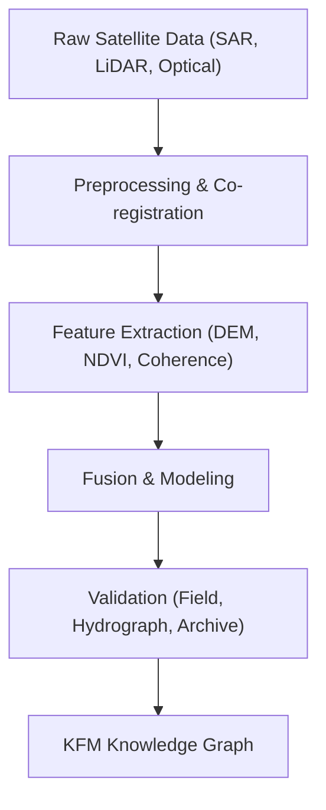

<div align="center">

# 🛰️ **Kansas Frontier Matrix — Remote Sensing Analyses Index**
`docs/analyses/remote-sensing/README.md`

**Purpose:**  
Central hub for **Remote Sensing analytical modules** within the Kansas Frontier Matrix (KFM).  
This layer integrates multispectral, radar, and LiDAR datasets for environmental, archaeological, and hydrological modeling across Kansas.

[](../../../../docs/)  
[](../../../../LICENSE)  
[](../../../../docs/standards/fairstandards.md)  
[](../../../../releases/v10.1.0/)
</div>

---

## 📘 Overview

Remote Sensing within KFM bridges **Earth Observation data** and **historical landscape interpretation**.  
By combining optical, radar, and LiDAR modalities, these analyses uncover both modern and lost terrain dynamics — from crop cycles and erosion to ancestral homesteads and vanished waterways.

The modules hosted here contribute to:
- High-precision elevation and moisture modeling.  
- Hydrological inference and watershed behavior mapping.  
- Land-cover transitions and vegetation stress detection.  
- Archaeological feature discovery beneath cultivation or sedimentation.  
- Cross-validation with climate, soil, and archival datasets in the KFM graph.

---

## 🗂️ Directory Layout
```
docs/
└── analyses/
    └── remote-sensing/
        ├── sar-lidar-fusion/        # SAR + LiDAR all-weather surface fusion
        ├── multispectral/           # Sentinel-2, Landsat, NAIP spectral indices
        ├── time-series/             # Temporal NDVI, coherence, deformation tracking
        ├── change-detection/        # Historical satellite & aerial comparison
        ├── validation/              # Field data and geospatial crosschecks
        └── README.md                # This index file
```

---

## 🧩 Core Analytical Modules

| Module | Description | Primary Outputs |
|:--|:--|:--|
| **SAR + LiDAR Fusion** | Merges Sentinel-1 radar and USGS LiDAR DEMs to map moisture, relief, and archaeological traces. | Hillshades, coherence rasters, fusion tiles |
| **Multispectral Analysis** | Processes Sentinel-2/Landsat imagery to extract NDVI, NDWI, and NBR indices. | Vegetation and water anomaly maps |
| **Time-Series Monitoring** | Tracks landscape evolution, flood cycles, or drought stress through radar/optical composites. | Temporal stacks, anomaly timelines |
| **Change Detection** | Compares multi-epoch imagery to detect land use shifts or floodplain migration. | Raster deltas, per-pixel change metrics |
| **Validation & QA** | Integrates GPS field surveys and hydrological ground truthing for calibration. | Validation reports and telemetry metrics |

---

## ⚙️ Analytical Workflow Integration



---

## 🧾 FAIR + CARE Alignment

| Principle | Implementation |
|:--|:--|
| **Findable** | STAC/DCAT metadata indexed in KFM registry |
| **Accessible** | Public via Focus Mode and MapLibre layers |
| **Interoperable** | GeoTIFF, NetCDF, and PostGIS-ready formats |
| **Reusable** | CC-BY 4.0, fully documented workflows |
| **Collective Benefit** | Supports Tribal heritage and environmental resilience |
| **Authority to Control** | Governance-ledger access management |
| **Responsibility** | Data ethics compliance under FAIR+CARE Council |
| **Ethics** | Transparency in derivation and interpretive scope |

---

## ⚖️ Governance Integration
All modules adhere to **KFM Data Governance Framework v4.2**:  
- Provenance captured via SPDX and STAC manifests.  
- Validation reports linked to FAIR+CARE audits.  
- Telemetry streams to the Focus Mode dashboard for real-time QA metrics.

---

## 🕰️ Version History

| Version | Date | Author | Summary |
|:--|:--|:--|:--|
| v10.1.0 | 2025-11-11 | AI Architect (assistant) | Created remote sensing analyses index; aligned with Platinum Template v7.1 |

---

<div align="center">

© 2025 Kansas Frontier Matrix — Master Coder Protocol v6.3 · FAIR+CARE Certified · Diamond⁹ Ω / Crown∞ Ω Ultimate Certified  
[Back to Analyses Index](../) · [Governance Charter](../../../../docs/standards/governance/ROOT-GOVERNANCE.md)
</div>

