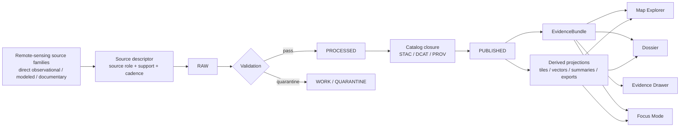

<!-- [KFM_META_BLOCK_V2]
doc_id: kfm://doc/<NEEDS_VERIFICATION_UUID>
title: Kansas Frontier Matrix — Remote Sensing Analyses
type: standard
version: v1
status: draft
owners: <NEEDS_VERIFICATION>
created: YYYY-MM-DD
updated: YYYY-MM-DD
policy_label: <NEEDS_VERIFICATION>
related: [<NEEDS_VERIFICATION: ../README.md>, <NEEDS_VERIFICATION: ./validation/README.md>, <NEEDS_VERIFICATION: ./multispectral/README.md>, <NEEDS_VERIFICATION: ./change-detection/README.md>]
tags: [kfm, remote-sensing, geospatial, evidence]
notes: [Current-session workspace evidence was PDF-only; repo tree, owners, dates, and child-path existence require verification.]
[/KFM_META_BLOCK_V2] -->

# Kansas Frontier Matrix — Remote Sensing Analyses

Evidence-aware index and operating guide for remote-sensing analysis docs, artifacts, and publication burdens in KFM.

> [!IMPORTANT]
> **Status:** experimental  
> **Owners:** `<NEEDS_VERIFICATION>`  
> **Current posture:** doctrine-grounded, repo-shape unverified.  
> This README is written from KFM doctrinal and technical source documents, but the mounted workspace in this session did **not** expose a live repository tree. Treat directory layout, child links, owners, dates, and adjacent file paths below as **NEEDS VERIFICATION** unless and until they are confirmed in-repo.


**Quick jump:** [Scope](#scope) · [Repo fit](#repo-fit) · [Accepted inputs](#accepted-inputs) · [Exclusions](#exclusions) · [Directory tree](#directory-tree) · [Quickstart](#quickstart) · [Analysis workflow](#analysis-workflow) · [Analysis lanes](#analysis-lanes) · [Minimum evidence and metadata](#minimum-evidence-and-metadata) · [Publication and review gates](#publication-and-review-gates) · [FAQ](#faq) · [Appendix](#appendix)

---

## Scope

This directory should define, organize, and review **remote-sensing analysis documentation** for Kansas Frontier Matrix in a way that stays faithful to KFM’s evidence posture:

- remote sensing is treated as **measurement**, not just backdrop imagery
- remote-sensing outputs stay **downstream of source onboarding, validation, catalog closure, release, and correction**
- imagery, indices, classifications, forecasts, and summaries do **not** become sovereign truth merely because they render well
- place and time stay coequal throughout the workflow
- public-facing use stays **trust-visible**, with evidence, freshness, review state, and policy context inspectable at point of use

### Reading posture

| Aspect | Status | What that means here |
|---|---|---|
| KFM truth path, trust membrane, authoritative-vs-derived split, 2D-first shell | **CONFIRMED** | Doctrinally grounded in the March 2026 KFM corpus |
| Remote sensing as routine GIS input, not a separate universe | **CONFIRMED** | This README treats imagery as one governed input into GIS/analysis/publication workflows |
| Hydrology-supporting remote sensing as a high-priority first slice | **CONFIRMED** | The corpus repeatedly favors hydrology as a public-safe, time-rich thin slice |
| Child docs such as `validation/`, `multispectral/`, `change-detection/` | **HISTORICAL CONTINUITY / NEEDS VERIFICATION** | These names appear in historical project documentation fragments, but were not re-verified in the mounted repo |
| Directory layout, owners, dates, neighboring README files, and relative links | **UNKNOWN / NEEDS VERIFICATION** | The repo tree was not directly visible in this session |

[Back to top](#kansas-frontier-matrix--remote-sensing-analyses)

---

## Repo fit

**Path:** `docs/analyses/remote-sensing/README.md`

### Upstream and downstream fit

| Relationship | Candidate link | Verification status |
|---|---|---|
| Upstream | [Analyses index](../README.md) | **NEEDS VERIFICATION** |
| Upstream | [Docs root](../../../README.md) | **NEEDS VERIFICATION** |
| Downstream | [Validation & QA](./validation/README.md) | **HISTORICAL CONTINUITY / NEEDS VERIFICATION** |
| Downstream | [Multispectral](./multispectral/README.md) | **HISTORICAL CONTINUITY / NEEDS VERIFICATION** |
| Downstream | [Change detection](./change-detection/README.md) | **HISTORICAL CONTINUITY / NEEDS VERIFICATION** |
| Downstream | `./time-series/README.md` | **PROPOSED / NEEDS VERIFICATION** |

### Role in the repo

This README should act as the **directory contract** for remote-sensing analysis docs. It should help contributors answer:

- what belongs in this directory
- what does **not** belong here
- what minimum evidence and metadata must accompany a remote-sensing analysis
- how remote-sensing docs connect to validation, publication, correction, dossier, and evidence surfaces
- how to keep image-derived outputs from bluffing certainty

[Back to top](#kansas-frontier-matrix--remote-sensing-analyses)

---

## Accepted inputs

This directory should accept documentation and analysis artifacts such as:

- release-backed remote-sensing analysis docs
- sensor- or product-specific method notes
- image-derived metrics, indices, and classification summaries
- change-detection and time-series interpretation docs
- validation and quality-assurance writeups
- uncertainty notes, drift notes, and modeled-output disclosures
- EvidenceBundle-linked summaries for published analyses
- public-safe visual outputs that remain attached to provenance, time basis, and review state

Typical inputs may reference, when relevant:

- multispectral imagery
- thermal imagery and land-surface-temperature products
- vegetation or moisture indices
- DEM- or stereo-derived terrain/building-support products
- change-detection comparisons
- temporal stacks and seasonal trend analyses
- supporting vector/tabular layers used in interpretation

---

## Exclusions

This directory should **not** be used for:

- raw unpublished imagery dumps
- source-onboarding contracts for ingest itself
- undocumented notebooks treated as authority
- uncited narrative summaries
- direct-to-public truth claims without inspectable evidence
- route inventories, API implementation details, or deployment manifests
- precision-sensitive outputs that have not passed public-safe review
- screenshots or story-ready visuals without method, time scope, and release context
- model outputs that omit uncertainty or fail to label themselves as modeled / assimilated / forecast material

**Put these elsewhere instead:**

- raw source landing and validation intake -> source/onboarding or ingestion layers
- policy bundles and decision grammar -> policy / contract layers
- API route classes and response contracts -> governed API docs
- release manifests, rollback, and correction runbooks -> publication / release runbooks
- implementation proof objects -> contracts, fixtures, tests, and release evidence packs

> [!WARNING]
> A remote-sensing image, index, forecast, or classifier output is **not** automatically authoritative truth. In KFM it remains governed by source role, support, lineage, policy, release state, and correction visibility.

[Back to top](#kansas-frontier-matrix--remote-sensing-analyses)

---

## Directory tree

```text
docs/
└── analyses/
    └── remote-sensing/
        ├── README.md
        ├── validation/              # historical continuity; NEEDS VERIFICATION
        │   └── README.md
        ├── multispectral/           # historical continuity; NEEDS VERIFICATION
        │   └── README.md
        ├── change-detection/        # historical continuity; NEEDS VERIFICATION
        │   └── README.md
        └── time-series/             # PROPOSED starter lane; NEEDS VERIFICATION
            └── README.md
```

> [!NOTE]
> The tree above is a **doctrine-aligned starter topology**, not a confirmed repo listing. Only the target path for this task was given directly.

[Back to top](#kansas-frontier-matrix--remote-sensing-analyses)

---

## Quickstart

Use this checklist when creating or revising a remote-sensing analysis doc in this directory.

1. State the **question**, **place scope**, **time scope**, and intended audience.
2. Name the **source role** for every key input:
   - direct observational / instrumented
   - modeled / assimilated
   - documentary / archival
   - statutory / administrative
   - community-contributed
   - mirror / discovery
3. Record the image/product basis:
   - sensor or product family
   - acquisition date or interval
   - support / resolution
   - CRS / reprojection notes
4. Document preprocessing and method:
   - cloud masking or scene selection
   - radiometric / emissivity / atmospheric assumptions
   - classification, thresholding, interpolation, or aggregation choices
5. Add validation and uncertainty:
   - reference data, sample design, confusion matrix, or cross-checks
   - known blind spots, snapshot bias, or temporal limitations
6. Mark any output that is **modeled**, **derived**, **generalized**, **partial**, or **stale-visible**.
7. Link the analysis to its release/evidence context:
   - EvidenceBundle or equivalent
   - release/correction linkage
   - public-safe precision posture
8. Check that the final doc can be read without quietly overstating implementation or certainty.

### Minimum child-doc starter shape

```md
# <Analysis title>

One-sentence purpose.

## Source basis
## Spatial and temporal scope
## Inputs
## Method
## Validation
## Uncertainty and limits
## Artifacts and downstream surfaces
## Publication burden
## Open verification items
```

[Back to top](#kansas-frontier-matrix--remote-sensing-analyses)

---

## Analysis workflow

Remote sensing in KFM should follow the same governed path as other evidence-bearing material.


```mermaid
flowchart LR
    A[Remote-sensing source families<br/>direct observational / modeled / documentary] --> B[Source descriptor<br/>source role + support + cadence]
    B --> C[RAW]
    C --> D{Validation}
    D -->|pass| E[PROCESSED]
    D -->|quarantine| Q[WORK / QUARANTINE]
    E --> F[Catalog closure<br/>STAC / DCAT / PROV]
    F --> G[PUBLISHED]
    G --> H[EvidenceBundle]
    G --> I[Derived projections<br/>tiles / vectors / summaries / exports]
    H --> J[Map Explorer]
    H --> K[Dossier]
    H --> L[Evidence Drawer]
    H --> M[Focus Mode]
    I --> J
    I --> K
    I --> M
```

### Why this matters

A remote-sensing artifact becomes usable in KFM **only after** it is:

- scoped
- validated
- cataloged
- published
- reconstructible through evidence
- safe for the requested audience and surface

That keeps the system from treating visually fluent outputs as if they were self-authenticating.

[Back to top](#kansas-frontier-matrix--remote-sensing-analyses)

---

## Analysis lanes

| Lane | What it covers | Minimum burden | Status in this README |
|---|---|---|---|
| Hydrology-supporting remote sensing | flood extent, water presence, reservoir/wetness context, watershed-supporting imagery products | public-safe precision, strong place/time semantics, release linkage, uncertainty | **CONFIRMED priority** |
| Multispectral | band combinations, indices, composites, land-cover-supporting products | sensor/product basis, bands/formulas, preprocessing, support, limitations | **HISTORICAL CONTINUITY / NEEDS VERIFICATION** |
| Change detection | before/after comparisons, temporal deltas, disturbance detection | explicit time windows, normalization basis, false-change risks, correction path | **HISTORICAL CONTINUITY / NEEDS VERIFICATION** |
| Time-series | seasonality, persistent trends, phenology-like or interval work | cadence, gaps, smoothing choices, snapshot-bias note, uncertainty | **PROPOSED / NEEDS VERIFICATION** |
| Validation & QA | accuracy assessment, reference samples, drift checks, withheld comparisons | method transparency, metrics, thresholds, failure notes, residual uncertainty | **HISTORICAL CONTINUITY / NEEDS VERIFICATION** |
| Urban thermal & greenery | LST, NDVI, LCZ-like or urban-environment indicators | overpass time, emissivity/temperature method, aggregation rules, heterogeneity note | **CONFIRMED pattern** |
| Built-form / terrain-supporting | DEM/stereo/building-height support products used in interpretation | surface type, derivation rules, scale limits, intended use | **CONFIRMED pattern** |

### Working rule

Remote-sensing lanes here are **analysis lanes**, not sovereign publication classes. A lane helps organize methods and burdens; it does not bypass policy, source-role handling, or release review.

[Back to top](#kansas-frontier-matrix--remote-sensing-analyses)

---

## Minimum evidence and metadata

| Required element | Why it is mandatory here |
|---|---|
| Question and decision context | Keeps the analysis tied to a real claim or review task |
| Place scope | Prevents vague scene-level summaries with unclear geography |
| Time scope | Prevents snapshot bias and hidden temporal drift |
| Source role | Distinguishes measured, modeled, archival, and derived material |
| Sensor / product basis | Makes the observational surface inspectable |
| Acquisition date or interval | Remote sensing is time-bearing; date is not optional |
| Support / resolution / grain | Prevents scale abuse and false precision |
| CRS / georeferencing notes | Keeps transformations and alignment legible |
| Preprocessing notes | Cloud masking, reprojection, emissivity, calibration, mosaicking, and scene selection all change meaning |
| Method / classification assumptions | Thresholds, models, indices, and grouping logic must be visible |
| Validation approach | Accuracy, cross-checks, or at least stated limits must be inspectable |
| Uncertainty / limitations | LST-at-overpass, coarse thermal resolution, partial coverage, weak training data, or aggregation artifacts must be explicit |
| Modeled / derived labeling | Forecasts, interpolations, classifications, and scenario-like outputs must say so |
| Evidence / release / correction linkage | Prevents detached visuals and stale summaries from becoming free-floating truth |
| Public-safe precision posture | Needed wherever exact location, vulnerable assets, or sensitivity may matter |

### Remote-sensing-specific cautions

| Risk | What to disclose |
|---|---|
| Snapshot bias | Why one date or overpass does not stand for a full process |
| Aggregation loss | What fine-resolution heterogeneity disappears when summarizing to wards, counties, or service areas |
| False precision | Why geocoded, resampled, or classified outputs may look exact while remaining approximate |
| Modeled output drift | Which parts are inferred, forecast, interpolated, or threshold-derived |
| Scale mismatch | Why a dataset may be fine for screening but unfit for parcel-scale or legal use |
| Derived-layer drift | Whether published vectors, tiles, or summaries were rebuilt from a known release scope |

[Back to top](#kansas-frontier-matrix--remote-sensing-analyses)

---

## Publication and review gates

> [!CAUTION]
> Nothing in this directory should let a derived image product, classifier output, or summary layer silently replace canonical evidence.

### Definition of done

- [ ] The doc states a clear place and time scope.
- [ ] Every major input has a declared source role.
- [ ] Acquisition date or temporal interval is recorded.
- [ ] Support / resolution / grain is recorded.
- [ ] CRS or georeferencing assumptions are stated.
- [ ] Method choices are visible enough to review.
- [ ] Validation is attached or limitations are stated plainly.
- [ ] Modeled / assimilated / forecast / interpolated outputs are labeled in-place.
- [ ] Public-safe precision has been considered.
- [ ] Evidence linkage is one hop away, not buried.
- [ ] Release / correction context is visible or explicitly marked missing.
- [ ] The doc does not claim repo implementation that was not verified.

### Review gates

| Gate | Pass condition |
|---|---|
| Evidence gate | The analysis can be traced to inspectable source and release context |
| Method gate | A reviewer can tell what was measured, derived, classified, or modeled |
| Time gate | The doc exposes date/interval rather than burying it |
| Validation gate | Accuracy, uncertainty, or limits are not omitted |
| Policy gate | Precision, rights, and sensitivity are safe for the intended surface |
| Surface gate | The doc does not bluff certainty through visuals alone |
| Correction gate | If later superseded, narrowed, generalized, or withdrawn, lineage can remain visible |

### Negative outcomes are valid outcomes

Remote-sensing material in KFM should be allowed to end in:

- **ANSWER** — sufficient evidence and policy-safe release basis
- **ABSTAIN** — evidence exists but cannot support a safe claim
- **DENY** — policy or sensitivity blocks the requested use
- **ERROR** — the request or evidence path failed structurally

That behavior is part of trust, not a defect.

[Back to top](#kansas-frontier-matrix--remote-sensing-analyses)

---

## FAQ

### Why is remote sensing not treated as a separate universe?

Because in KFM it is a governed input to a broader GIS and publication workflow. It becomes useful only when its date, support, method, lineage, and interpretation burden are documented and linked to evidence-bearing downstream surfaces.

### What belongs here instead of source-onboarding contracts?

Analysis-facing documentation belongs here: method notes, change-detection writeups, validation pages, uncertainty notes, and lane indexes. Intake contracts, source descriptors, and raw landing procedures belong upstream in source/onboarding and ingestion layers.

### When must modeled output be labeled?

Whenever a result is forecast, interpolated, threshold-derived, index-based, classified, scenario-like, or otherwise not a direct observation. If it helps a reader make a claim, it needs visible labeling.

### Is 3D a default presentation mode for remote-sensing outputs?

No. KFM remains 2D-first. Use 3D only when it carries real explanatory burden that 2D cannot, and keep it on the same evidence, audit, release, and correction rules as every other surface.

### Can a notebook count as the authoritative record?

Not by itself. Notebooks can support exploration, prototyping, and method communication, but authoritative use requires governed publication context, evidence linkage, and review-bearing artifacts.

[Back to top](#kansas-frontier-matrix--remote-sensing-analyses)

---

## Appendix

<details>
<summary><strong>Suggested child-doc contract</strong></summary>

### Recommended section order for child analysis docs

1. Purpose  
2. Source basis  
3. Place and time scope  
4. Inputs  
5. Method  
6. Validation  
7. Uncertainty and failure modes  
8. Artifacts and surfaces  
9. Review / publication burden  
10. Open verification items

### Compact method registry fields

| Field | Example shape |
|---|---|
| Analysis family | `multispectral`, `change-detection`, `time-series`, `thermal`, `validation` |
| Sensor/product | `Landsat 7 ETM+`, `Sentinel-2`, `stereo DEM support` |
| Temporal basis | single overpass / seasonal stack / multi-year series |
| Spatial support | pixel size + aggregation unit |
| Key transforms | masking, reprojection, emissivity correction, normalization |
| Output class | direct observation / derived metric / classified product / modeled output |
| Validation mode | reference samples / cross-source comparison / field verification / declared limitation |
| Release linkage | release id / evidence bundle ref / correction note |

</details>

<details>
<summary><strong>Historical continuity note</strong></summary>

Late-2025 project documentation fragments referenced child paths such as:

- `docs/analyses/remote-sensing/validation/README.md`
- `docs/analyses/remote-sensing/multispectral/README.md`
- `docs/analyses/remote-sensing/change-detection/README.md`

This README treats those names as **continuity hints only**. Their current existence, contents, and exact placement in the live repo still require verification.

</details>

<details>
<summary><strong>Verification backlog for this README</strong></summary>

- Confirm owners, doc id, created/updated dates, and policy label.
- Confirm whether the parent `analyses` README exists and what it is called.
- Confirm whether `validation`, `multispectral`, `change-detection`, and `time-series` child docs exist.
- Confirm local badge/boilerplate style expected by neighboring docs.
- Confirm whether hydrology-supporting remote-sensing docs already exist elsewhere and should be linked here.
- Confirm whether this directory is meant to be an index-only surface or also a methods-policy contract surface.

</details>

[Back to top](#kansas-frontier-matrix--remote-sensing-analyses)
