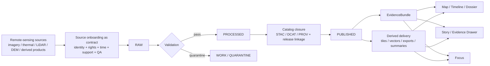

<!-- [KFM_META_BLOCK_V2]
doc_id: kfm://doc/<NEEDS_VERIFICATION_UUID>
title: Kansas Frontier Matrix — Remote Sensing Analyses
type: standard
version: v1
status: draft
owners: <NEEDS_VERIFICATION>
created: <NEEDS_VERIFICATION_YYYY-MM-DD>
updated: <NEEDS_VERIFICATION_YYYY-MM-DD>
policy_label: <NEEDS_VERIFICATION>
related: [<NEEDS_VERIFICATION: ../README.md>, <NEEDS_VERIFICATION: ./validation/README.md>, <NEEDS_VERIFICATION: ./multispectral/README.md>, <NEEDS_VERIFICATION: ./change-detection/README.md>]
tags: [kfm, remote-sensing, geospatial, evidence]
notes: [Current-session mounted workspace exposed PDFs rather than a live repo tree; target path, owners, dates, and child-path existence require in-repo verification before commit.]
[/KFM_META_BLOCK_V2] -->

# Kansas Frontier Matrix — Remote Sensing Analyses

Evidence-aware index and operating guide for remote-sensing analysis docs, methods, and publication burdens in KFM.

> [!IMPORTANT]
> **Status:** experimental *(NEEDS VERIFICATION against repo conventions)*  
> **Owners:** `<NEEDS_VERIFICATION>`  
> **Repo fit:** target path `docs/analyses/remote-sensing/README.md` *(task target; live repo topology not reverified in this session)*  
> **Current posture:** doctrine-grounded; workspace topology unverified beyond mounted PDFs.  
> This README is revised from the March 2026 KFM corpus and the provided draft, but the mounted workspace in this run did **not** expose a live repository tree. Treat sibling paths, dates, owners, and local doc-style assumptions below as **NEEDS VERIFICATION** until confirmed in-repo.


**Quick jump:** [Scope](#scope) · [Repo fit](#repo-fit) · [Accepted inputs](#accepted-inputs) · [Exclusions](#exclusions) · [Directory tree](#directory-tree) · [Quickstart](#quickstart) · [Usage and workflow](#usage-and-workflow) · [Analysis lanes](#analysis-lanes) · [Minimum evidence and metadata](#minimum-evidence-and-metadata) · [Publication and review gates](#publication-and-review-gates) · [FAQ](#faq) · [Appendix](#appendix)

---

## Scope

This directory should define and organize **remote-sensing analysis documentation** for Kansas Frontier Matrix in a way that stays faithful to KFM’s core laws:

- remote sensing is treated as **measurement**, not merely as visually persuasive imagery
- imagery, indices, classifications, terrain derivatives, and summaries stay **downstream of** source admission, validation, catalog closure, release, and correction
- **place and time are coequal**; acquisition date or interval is never optional context
- derived, corrected, or modeled outputs stay **visibly labeled** as such
- consequential outputs should remain **one hop away from evidence drill-through**

### Reading posture

| Reading point | Status | What that means here |
|---|---|---|
| Truth path, trust membrane, authoritative-vs-derived split, fail-closed posture | **CONFIRMED** | This README treats remote-sensing work as part of KFM’s governed evidence system, not as a sidecar image workflow |
| Evidence Drawer and Focus as trust-visible downstream surfaces | **CONFIRMED** | Remote-sensing claims here are written to support evidence drill-through, not detached story-first prose |
| Hydrology-supporting remote sensing as the preferred first proof lane | **CONFIRMED** | Water/flood/terrain-supporting work is treated as the most operationally legible first slice |
| Multispectral, thermal, change-detection, terrain/LiDAR, and QA as core analysis families | **CONFIRMED** | These are method families supported by the corpus, whether or not separate child directories currently exist |
| Target path and sibling README links | **NEEDS VERIFICATION** | The task points to this README and candidate child links, but their live repo presence was not re-checked in this session |
| Owners, dates, doc UUID, policy label, neighboring doc style | **UNKNOWN / NEEDS VERIFICATION** | The mounted workspace exposed PDFs rather than a live checked-out repo |

[Back to top](#kansas-frontier-matrix--remote-sensing-analyses)

---

## Repo fit

**Path:** `docs/analyses/remote-sensing/README.md`

### Upstream and downstream fit

| Relationship | Candidate link | Verification status |
|---|---|---|
| Upstream | [Analyses index](../README.md) | **NEEDS VERIFICATION** |
| Downstream | [Validation](./validation/README.md) | **NEEDS VERIFICATION** |
| Downstream | [Multispectral](./multispectral/README.md) | **NEEDS VERIFICATION** |
| Downstream | [Change detection](./change-detection/README.md) | **NEEDS VERIFICATION** |

### Role in the repo

This README should act as the **directory contract** for remote-sensing analysis docs. Contributors should be able to use it to answer four practical questions:

1. What belongs in this directory?
2. What does **not** belong here?
3. What minimum evidence and metadata must accompany a remote-sensing analysis?
4. What publication, review, and correction burdens apply before a remote-sensing output is allowed to behave like trust-bearing KFM material?

> [!NOTE]
> The path above is the target path for this task. The mounted workspace did not expose a live repo tree, so the surrounding directory shape remains to be confirmed before commit.

[Back to top](#kansas-frontier-matrix--remote-sensing-analyses)

---

## Accepted inputs

This directory should accept analysis-facing documentation such as:

- remote-sensing lane README files and method indexes
- sensor- or product-specific method notes
- analysis pages for multispectral, thermal, terrain, or change-detection work
- validation and QA writeups
- uncertainty, drift, or limitation notes
- release-backed summaries that stay linked to evidence and publication state
- public-safe figures or exports that still preserve source role, time basis, and review context

Typical materials here may reference:

- multispectral imagery and band-derived indices
- thermal imagery and land-surface-temperature products
- DEM, LiDAR, 3DEP, and terrain-derived context
- change-detection comparisons and temporal stacks
- hydrology-supporting remote-sensing products such as flood extent, water presence, wetness, or terrain support
- supporting vector or tabular layers used in interpretation

---

## Exclusions

| Does **not** belong here | Put it with |
|---|---|
| Raw unpublished scene dumps, buckets, or landing artifacts | source-onboarding / intake / ingestion layers |
| SourceDescriptor-like intake contracts | contracts / source admission layers |
| Policy bundles and decision grammar | policy / contract layers |
| API route definitions, DTOs, or deployment manifests | governed API / app / delivery docs |
| Notebook-only outputs treated as authority | exploratory or work layers until governed release exists |
| Public-facing visuals with no method, time basis, or evidence route | release-pack or story surfaces only after review burden is met |
| Precision-sensitive outputs lacking rights/sensitivity review | steward or restricted review paths |
| Unlabeled modeled, corrected, or assimilated outputs | analysis only after explicit modeled/derived labeling is added |

> [!WARNING]
> A remote-sensing image, index, classification, forecast, or terrain derivative is **not** automatically authoritative truth. In KFM it remains governed by source role, support, time basis, lineage, policy posture, release state, and correction visibility.

[Back to top](#kansas-frontier-matrix--remote-sensing-analyses)

---

## Directory tree

```text
docs/
└── analyses/
    └── remote-sensing/
        ├── README.md
        ├── validation/         # candidate child path from task metadata; NEEDS VERIFICATION
        │   └── README.md
        ├── multispectral/      # candidate child path from task metadata; NEEDS VERIFICATION
        │   └── README.md
        └── change-detection/   # candidate child path from task metadata; NEEDS VERIFICATION
            └── README.md
```

> [!NOTE]
> The tree above is a **task-target topology**, not a confirmed repo listing. The only directly known file path in this session is the target README itself.

[Back to top](#kansas-frontier-matrix--remote-sensing-analyses)

---

## Quickstart

Use this checklist when creating or revising a remote-sensing analysis doc in this directory.

1. State the **question**, **place scope**, **time scope**, and intended surface.
2. Name the **source role** for every major input:
   - direct observational
   - interpreted
   - modeled / assimilated
   - documentary / archival
   - derived analytical product
3. Record the sensor or product basis:
   - mission / product family
   - acquisition date or interval
   - support / resolution / grain
   - CRS / datum / reprojection notes
   - QA fields or scene-quality filters used
4. Document preprocessing and analytic method:
   - band selection / formulas / thresholds
   - masking, mosaicking, or reprojection
   - emissivity / temperature assumptions where relevant
   - classification, change-detection, aggregation, or normalization choices
5. Add validation and limitation material:
   - ground truthing or field verification
   - reference samples, confusion matrix, or cross-source checks
   - known blind spots, snapshot bias, or class confusion
6. Mark anything that is **modeled**, **corrected**, **generalized**, **partial**, **stale-visible**, or **derived**.
7. Link the analysis to release/evidence context:
   - release or dataset version
   - catalog closure / outward metadata
   - EvidenceBundle or equivalent support object
   - correction or supersession linkage if applicable
8. Check that the final page can be read without quietly overstating certainty, support, or implementation.

### Starter child-doc contract

```md
# <Analysis title>

One-sentence purpose.

## Source basis
## Place and time scope
## Inputs
## Method
## Validation
## Uncertainty and limits
## Artifacts and downstream surfaces
## Publication burden
## Open verification items
```

[Back to top](#kansas-frontier-matrix--remote-sensing-analyses)

---

## Usage and workflow

Use this directory for analysis-facing remote-sensing documentation **after** you can answer four questions clearly:

- What was measured?
- When was it measured or derived?
- At what support or resolution?
- Under which release, evidence, and correction context will a reader encounter it?

### Workflow diagram


```mermaid
flowchart LR
    A[Remote-sensing sources<br/>imagery / thermal / LiDAR / DEM / derived products] --> B[Source onboarding as contract<br/>identity + rights + time + support + QA]
    B --> C[RAW]
    C --> D{Validation}
    D -->|pass| E[PROCESSED]
    D -->|quarantine| Q[WORK / QUARANTINE]
    E --> F[Catalog closure<br/>STAC / DCAT / PROV + release linkage]
    F --> G[PUBLISHED]
    G --> H[EvidenceBundle]
    G --> I[Derived delivery<br/>tiles / vectors / exports / summaries]
    H --> J[Map / Timeline / Dossier]
    H --> K[Story / Evidence Drawer]
    H --> L[Focus]
    I --> J
    I --> K
    I --> L
```

### Working rule

A remote-sensing output becomes trust-bearing in KFM **only after** it is scoped, validated, catalog-closed, released, and reconstructible through evidence. The visual fluency of a raster or composite does not lower that burden.

[Back to top](#kansas-frontier-matrix--remote-sensing-analyses)

---

## Analysis lanes

| Lane | Typical material | Minimum disclosure | Current stance here |
|---|---|---|---|
| Hydrology-supporting remote sensing | flood extent, water presence, wetness context, terrain support, reservoir/watershed imagery context | acquisition date, support, masking/scene selection, observed-vs-derived posture, QA, correction path | **CONFIRMED priority** |
| Multispectral and band-derived indices | composites, NDVI/NDWI/NBR, burn or moisture indicators, land-cover support | bands/formulas, scaling, cloud/QA filtering, seasonality, limitations | **CONFIRMED method family**; child path **NEEDS VERIFICATION** |
| Thermal / LST / greenery | land-surface temperature, thermal IR, greenery/greenness context, urban heat indicators | overpass time, emissivity/temperature method, aggregation rules, heterogeneity limits | **CONFIRMED method family** |
| Change detection and temporal stacks | before/after comparisons, temporal deltas, disturbance detection, interval-aware remote-sensing summaries | time windows, normalization basis, false-change risks, update/correction path | **CONFIRMED method family**; child path **NEEDS VERIFICATION** |
| Terrain / LiDAR / elevation-derived context | DEM/3DEP/LiDAR/NAIP support, slope, flow accumulation, watershed or corridor reasoning, surface context | bare-earth vs top-of-surface distinction, derivative chain, support limits, CRS/vertical assumptions | **CONFIRMED method family** |
| Validation & QA | confusion matrices, reference samples, field verification, class-error analysis, cross-source checks | sample design, metrics, unresolved uncertainty, class-specific failure modes | **CONFIRMED requirement** |

> [!NOTE]
> These are **analysis lanes**, not sovereign publication classes. A lane organizes methods and burdens; it does not bypass KFM policy, release, or evidence requirements.

[Back to top](#kansas-frontier-matrix--remote-sensing-analyses)

---

## Minimum evidence and metadata

| Required element | Why it is mandatory here |
|---|---|
| Question and decision context | Keeps the analysis tied to a real review task instead of decorative imagery use |
| Place scope | Prevents vague scene summaries with unclear geography |
| Time scope | Remote sensing is time-bearing; acquisition date or interval is not optional |
| Source role | Distinguishes direct observation, interpretation, modeling, and derived projection |
| Sensor / mission / product basis | Makes the observational surface inspectable |
| Mission semantics and QA fields | Prevents treating every scene or product as equal-quality evidence |
| Bands / index formulas / temperature method | Keeps spectral meaning and derivation visible |
| Support / resolution / grain | Prevents scale abuse and false precision |
| CRS / datum / transformation notes | Keeps reprojection and georeferencing consequences legible |
| Preprocessing notes | Cloud masking, mosaicking, emissivity assumptions, reprojection, resampling, and scene selection all change meaning |
| Method / classification assumptions | Thresholds, models, and class definitions must be reviewable |
| Validation approach | Ground truthing, field checks, reference samples, or explicit limits must be visible |
| Uncertainty / limitations | Snapshot bias, cloud limits, class confusion, coarse thermal support, and weak training data must not be hidden |
| Modeled / corrected / derived labeling | Forecasts, corrected sensors, classifications, indices, or assimilated products must say so in-place |
| Release / catalog / evidence linkage | Prevents detached images and summaries from behaving like free-floating truth |
| Public-safe precision posture | Needed wherever exact location, vulnerable assets, or sensitivity may matter |

### Remote-sensing-specific cautions

| Risk | What to disclose |
|---|---|
| Snapshot bias | Why one overpass, one composite, or one seasonal window is not the whole process |
| False precision | Why visually sharp imagery may still be approximate, resampled, or class-derived |
| Scale mismatch | Why a product may be valid for screening but not parcel-scale or legal use |
| Unvalidated classification | Which classes are most likely to be confused and what that means for interpretation |
| Derived-layer drift | Whether a published vector, tile, or summary was rebuilt from a known release scope |
| Modeled-output drift | Which parts are forecast, interpolated, corrected, or otherwise not direct observation |
| Bare-earth vs top-of-surface confusion | Whether terrain products are DEM, DSM, DTM, LiDAR-derived surface, or something else |

> [!CAUTION]
> A beautiful composite, heat map, or classified raster is still a claim-bearing derived object. If acquisition time, source role, QA basis, derivation, or validation is missing, the output is not ready for consequential publication.

[Back to top](#kansas-frontier-matrix--remote-sensing-analyses)

---

## Publication and review gates

### Definition of done

- [ ] The page states a clear place and time scope.
- [ ] Each major input has a declared source role.
- [ ] Sensor / mission / product basis is recorded.
- [ ] Acquisition date or temporal interval is visible.
- [ ] Support / resolution / grain is stated.
- [ ] CRS / datum / transformation assumptions are stated.
- [ ] Preprocessing and method choices are visible enough to review.
- [ ] Validation is attached, or limitations are stated plainly.
- [ ] Modeled / corrected / assimilated / derived outputs are labeled in-place.
- [ ] Release and evidence linkage are one hop away, not buried.
- [ ] Public-safe precision has been considered.
- [ ] The page does not claim repo implementation that was not reverified in this session.

### Review gates

| Gate | Pass condition |
|---|---|
| Evidence gate | The analysis can be traced to inspectable source and release context |
| Method gate | A reviewer can tell what was measured, derived, corrected, classified, or modeled |
| Time gate | Acquisition date or interval is exposed rather than buried |
| Validation gate | Accuracy, uncertainty, or stated limits are visible |
| Policy gate | Rights, sensitivity, precision, and allowed surface are safe for the intended audience |
| Surface gate | The page does not bluff certainty through visuals alone |
| Correction gate | If later superseded, narrowed, generalized, or withdrawn, lineage can remain visible |

### Negative outcomes are valid outcomes

Remote-sensing work in KFM should be allowed to end in:

- **ANSWER / RELEASED VIEW** — sufficient support and policy-safe release basis
- **ABSTAIN** — evidence exists, but not enough for a safe scoped claim
- **DENY** — policy, rights, or sensitivity blocks the requested use
- **ERROR** — the request or evidence path failed structurally
- **STALE-VISIBLE / GENERALIZED / SUPERSEDED** — the material remains visible, but its state is explicit

That behavior is part of trust, not a defect.

[Back to top](#kansas-frontier-matrix--remote-sensing-analyses)

---

## FAQ

### Why is remote sensing not treated as a separate universe?

Because in KFM it is a governed input to a broader GIS, publication, and evidence workflow. It becomes useful only when its acquisition time, support, method, lineage, and interpretation burden are documented and inspectable.

### What belongs here instead of source-onboarding contracts?

Analysis-facing docs belong here: method notes, multispectral/thermal/change-detection pages, QA writeups, limitation notes, and lane indexes. Intake contracts, raw landing procedures, and source descriptors belong upstream in source-admission and ingestion layers.

### When must modeled output be labeled?

Whenever a result is forecast, corrected, assimilated, threshold-derived, index-based, classified, or otherwise not a direct observation. If a reader could treat it as evidence, the label must be visible.

### Is 3D the default presentation mode for remote-sensing outputs?

No. KFM remains 2D-first. Use 3D only when it carries a real explanatory burden and keep it on the same evidence, audit, release, and correction rules as every other surface.

### Can a notebook count as the authoritative record?

Not by itself. Notebooks may support exploration, prototyping, and method communication, but authoritative use requires governed release context, evidence linkage, and review-bearing artifacts.

[Back to top](#kansas-frontier-matrix--remote-sensing-analyses)

---

## Appendix

<details>
<summary><strong>Suggested child-doc field registry</strong></summary>

| Field | Example shape |
|---|---|
| Analysis family | `multispectral`, `thermal`, `change-detection`, `terrain`, `validation` |
| Sensor / product | `Landsat 8/9`, `Sentinel-2`, `Landsat thermal`, `USGS 3DEP DEM`, `NAIP` |
| Temporal basis | single overpass / seasonal composite / before-after / interval stack |
| Spatial support | pixel size + aggregation unit |
| Key transforms | masking, reprojection, emissivity correction, normalization, mosaicking |
| Output class | direct observation / derived metric / classified product / modeled output |
| Validation mode | field verification / reference samples / cross-source comparison / declared limitation |
| Release linkage | dataset version / catalog closure / evidence bundle / correction notice |

</details>

<details>
<summary><strong>Recommended review questions</strong></summary>

1. Is the source role explicit for every consequential layer?
2. Could a reader identify the acquisition date or interval in under ten seconds?
3. Are band meaning, index formula, or thermal method visible?
4. Is the output being asked to speak beyond its support or temporal basis?
5. Are validation and uncertainty proportional to the claim being made?
6. Could the page survive evidence drill-through without surprise?

</details>

<details>
<summary><strong>Verification backlog for this README</strong></summary>

- Confirm owners, doc UUID, created/updated dates, and policy label.
- Confirm whether the parent analyses index exists at `../README.md`.
- Confirm whether `validation/`, `multispectral/`, and `change-detection/` exist as child docs here.
- Confirm local badge, metadata, and README style used by neighboring docs.
- Confirm whether this page should stay index-only or also function as a methods-policy contract surface.
- Confirm whether any hydrology-supporting remote-sensing pages already exist elsewhere and should be linked directly.

</details>

[Back to top](#kansas-frontier-matrix--remote-sensing-analyses)
