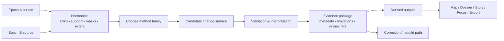

<!-- [KFM_META_BLOCK_V2]
doc_id: kfm://doc/<NEEDS-UUID>
title: Kansas Frontier Matrix — Remote Sensing Change Detection
type: standard
version: v1
status: draft
owners: <NEEDS OWNER>
created: <YYYY-MM-DD>
updated: <YYYY-MM-DD>
policy_label: <NEEDS POLICY LABEL>
related: [<NEEDS-VERIFIED-RELATED-PATHS>]
tags: [kfm, remote-sensing, change-detection]
notes: [Current-session evidence was PDF-only; repo topology, owners, and local paths require verification.]
[/KFM_META_BLOCK_V2] -->

# Kansas Frontier Matrix — Remote Sensing Change Detection

Evidence-first guidance for detecting, validating, interpreting, and publishing spatial change without letting derivative maps or summaries quietly become sovereign truth.

> [!IMPORTANT]
> This README is grounded in attached KFM and geospatial source documents, but the mounted repository tree was not directly visible in the current session. Any local path, sibling-doc link, owner, or child-directory reference below is explicitly marked **INFERRED**, **PROPOSED**, or **NEEDS VERIFICATION** where appropriate.

## Impact

**Status:** `draft`  
**Owners:** `NEEDS VERIFICATION`  
**Path:** `docs/analyses/remote-sensing/change-detection/README.md`


**Quick jump:** [Scope](#scope) · [Repo fit](#repo-fit) · [Inputs](#inputs) · [Exclusions](#exclusions) · [Quickstart](#quickstart) · [Usage](#usage) · [Workflow diagram](#workflow-diagram) · [Tables](#tables) · [Definition of done](#definition-of-done) · [FAQ](#faq) · [Appendix](#appendix)

### Status labels used in this file

| Label | Meaning here |
|---|---|
| **CONFIRMED** | Supported by attached doctrine or other session-visible source material. |
| **INFERRED** | Strong doctrinal completion that fits KFM architecture, but is not mounted repo fact. |
| **PROPOSED** | Recommended local structure, workflow, or file placement for this directory. |
| **NEEDS VERIFICATION** | Repo-specific detail not directly proven in the current session. |

## Scope

This directory README defines the **working contract** for change-detection analysis inside KFM’s remote-sensing layer.

In this context, **change detection** means disciplined comparison across time for features or conditions such as hydrology, vegetation, land cover, settlement growth, thermal stress, flood extent, erosion, or infrastructure change. The emphasis is not just on producing a delta surface, but on making the comparison basis, dates, preprocessing, uncertainty, and evidence trail inspectable.

This README does **not** replace KFM’s higher-order doctrine for the truth path, publication law, correction law, or trust-visible shell behavior. It narrows those rules into a change-detection-specific operating surface.

## Repo fit

| Item | Value |
|---|---|
| **Current path** | `docs/analyses/remote-sensing/change-detection/README.md` |
| **Upstream** | [`../README.md`](../README.md) — remote-sensing analyses index (**INFERRED**, **NEEDS VERIFICATION**) |
| **Adjacent** | [`../multispectral/README.md`](../multispectral/README.md), [`../time-series/README.md`](../time-series/README.md), [`../validation/README.md`](../validation/README.md) (**INFERRED sibling modules**, **NEEDS VERIFICATION**) |
| **Downstream** | [`./methods/`](./methods/), [`./results/`](./results/), [`./reports/`](./reports/), [`./governance.md`](./governance.md) (**PROPOSED local structure**, **NEEDS VERIFICATION**) |
| **Primary repo role** | Describe how change-detection work is framed, documented, reviewed, and handed off inside KFM. |
| **Downstream influence** | Method notes, validation reports, derived raster/vector outputs, story/export preparation, and Focus/Drawer-ready evidence packaging. |
| **Upstream dependency** | KFM doctrine for evidence, publication, correction, rights/sensitivity, and trust-visible UI. |

## Inputs

Accepted inputs for this directory include the following:

| Accepted input | What belongs here |
|---|---|
| **Multi-epoch imagery** | Optical, SAR, thermal, aerial, orthophoto, DEM/DSM-difference, or other time-separated remotely sensed surfaces. |
| **Derived analytical rasters** | Classified land cover, water masks, burn severity, thermal surfaces, NDVI/NBR/NDWI deltas, coherence products, or other promoted analytical intermediates. |
| **AOI and mask geometry** | Study areas, exclusion masks, cloud/shadow masks, waterbody masks, or comparison extents. |
| **Acquisition and processing metadata** | Sensor, date/time, support, CRS/datum, radiometric or classification assumptions, preprocessing notes. |
| **Validation material** | Field points, interpreted control samples, authoritative comparison layers, photo logs, steward review notes. |
| **Evidence references** | EvidenceBundle links, release references, validation reports, correction references, or other KFM trust objects. |

## Exclusions

This README should **not** become a catch-all for nearby work.

| Exclusion | Put it here instead | Status |
|---|---|---|
| **Raw source onboarding, fetch logic, or ingest mechanics** | Source onboarding / ingest documentation owned above this analysis layer | **CONFIRMED doctrine**, local path **NEEDS VERIFICATION** |
| **Generic spectral-index documentation** | [`../multispectral/README.md`](../multispectral/README.md) | **INFERRED** |
| **Long-horizon monitoring or dense temporal stacks** | [`../time-series/README.md`](../time-series/README.md) | **INFERRED** |
| **Field-survey and accuracy protocol detail** | [`../validation/README.md`](../validation/README.md) | **INFERRED** |
| **Public narrative packaging or civic story copy** | Story/export surface docs higher in the repo | **CONFIRMED doctrine**, local path **NEEDS VERIFICATION** |
| **Core publication/correction law** | KFM canonical doctrine and release/correction runbooks | **CONFIRMED doctrine** |

## Directory tree

```text
docs/
└── analyses/
    └── remote-sensing/
        └── change-detection/
            ├── README.md          # This file
            ├── methods/           # PROPOSED: method notes, thresholds, parameter docs
            ├── results/           # PROPOSED: derived figures, maps, tables, approved outputs
            ├── reports/           # PROPOSED: validation, interpretation, and review memos
            └── governance.md      # PROPOSED: rights, sensitivity, precision, release notes
```

> [!NOTE]
> The child structure above is a **PROPOSED** working shape, not a claimed mounted directory listing.

## Quickstart

Use this directory when the core question is not “what does this sensor measure?” but rather **“what changed, compared to what, under which assumptions, and how confident are we?”**

1. **State the decision question first.**  
   Define the phenomenon of interest: flood extent, vegetation loss, channel migration, urban growth, burn scar, thermal change, or something else.

2. **Declare the comparison basis.**  
   Choose one explicitly:
   - `map_to_map`
   - `image_to_image`
   - `class_transition`
   - `object_based`
   - `time_series_handoff`

3. **Register both epochs clearly.**  
   Record source, acquisition date/time, sensor or product family, support/resolution, and masking assumptions.

4. **Harmonize before comparing.**  
   Review CRS, datum, extent, resampling, pixel support, cloud/shadow handling, classification schema, and any threshold logic.

5. **Generate a candidate change surface.**  
   Produce the smallest useful derived output first, not the most decorative one.

6. **Validate and interpret.**  
   Use field points, interpreted samples, authoritative references, or steward review. Separate “signal” from “artifact.”

7. **Package evidence before public exposure.**  
   The output is not ready for broader KFM surfaces until its dates, assumptions, uncertainty, and evidence references are visible.

### Illustrative comparison scaffold

```yaml
change_detection_run:
  question: "<what changed?>"
  comparison_basis: "map_to_map | image_to_image | class_transition | object_based | time_series_handoff"
  epoch_a:
    source: "<sensor/product>"
    acquired_at: "<timestamp>"
    support: "<resolution/support>"
  epoch_b:
    source: "<sensor/product>"
    acquired_at: "<timestamp>"
    support: "<resolution/support>"
  harmonization:
    crs_review: "<done>"
    masks_review: "<done>"
    preprocessing_notes: "<required>"
  validation:
    method: "<field|interpreted|authoritative reference>"
    limitations: "<required>"
  release_scope: "<candidate | promoted>"
```

## Usage

### Discrete two-date comparison

Use this when the analysis compares two chosen moments or short windows in time.

Typical examples:
- before/after flood extent
- burn scar emergence
- vegetation gain/loss
- shoreline or channel movement
- urban expansion between selected years

This is often the most legible starting point, but it is also the easiest place to create **false change** if dates, support, or preprocessing differ in hidden ways.

### Map-to-map or class-transition comparison

Use this when both epochs are already classified, segmented, or otherwise interpreted into classes or objects.

This family is useful for:
- land-cover transition matrices
- wet/dry class changes
- built/non-built transitions
- feature presence/absence comparison

The main risk is **classification drift**: the “change” may reflect different class logic, training data, or thresholding rather than genuine landscape change.

### Image-to-image analytical differencing

Use this when the change signal lives in spectral, thermal, radar, or elevation values rather than in an already classified map.

This family is useful for:
- vegetation stress or recovery
- thermal anomaly comparison
- coherence change
- DEM subtraction
- moisture or water-surface change

This can preserve more nuance than map-to-map comparison, but it demands tighter control over radiometry, masks, and support.

### Hydrology and hazard review

KFM doctrine explicitly favors **hydrology as the preferred first thin slice** because it is public-safe, place/time-rich, and operationally legible. This README is broader than hydrology alone, but hydrologic change is the clearest lane for early, disciplined use:
- flood extent comparison
- reservoir stage-area change
- channel migration
- watershed disturbance
- wetland gain/loss

Use this directory to keep hydrologic change products from drifting into “pretty flood maps” without date, support, uncertainty, and evidence state.

### Monitoring handoff

When the same phenomenon needs many dates, rolling thresholds, or continuous interpretation, the work may no longer belong here alone.

A good rule of thumb:
- **selected epochs** → this directory
- **dense temporal behavior** → time-series / monitoring
- **field truth and scoring discipline** → validation

> [!WARNING]
> A change surface is not self-authenticating. Differences in sensor family, acquisition season, cloud treatment, pixel support, resampling, class definitions, or threshold logic can produce visible “change” that is really workflow drift.

## Workflow diagram



## Tables

### Method matrix

| Method family | Best for | Typical strengths | Common failure mode | Typical outputs |
|---|---|---|---|---|
| **Map-to-map** | Comparing two already classified products | Easy to explain; strong for category transitions | Different class logic creates fake change | Transition grids, gain/loss rasters, polygons |
| **Image-to-image** | Spectral, thermal, radar, or elevation change | Preserves more signal; useful before heavy categorization | Date/support/radiometry mismatch | Delta rasters, thresholded anomalies, summary stats |
| **Class-transition** | Land-cover or land-use change across stable classes | Strong for reporting and policy summaries | Training data drift or class collapse | Transition matrix, class-change map, area totals |
| **Object-based** | Feature-level change such as waterbodies, buildings, parcels, patches | Better feature semantics than per-pixel alone | Segmentation differences create unstable objects | Change objects, counts, object attributes |
| **Time-series handoff** | Many dates, ongoing monitoring, repeated events | Reduces snapshot bias; can evolve toward monitoring | Overloading this directory with monitoring logic | Change flags, anomaly timelines, handoff memo |

### Minimum metadata and evidence fields

| Field | Why it matters |
|---|---|
| **Comparison basis** | Without this, reviewers cannot tell what “change” actually means. |
| **Epoch A / Epoch B acquisition date** | Time is part of the claim, not decoration. |
| **Source sensor or product lineage** | Sensor family affects comparability. |
| **CRS / datum / support** | Spatial mismatch can create false movement or false area change. |
| **Preprocessing notes** | Cloud masks, atmospheric correction, coregistration, resampling, and filtering materially affect output. |
| **Thresholds or class logic** | Needed to distinguish measured change from analyst choice. |
| **AOI and masks** | Declares what was and was not eligible for comparison. |
| **Validation method** | Field points, interpreted samples, or reference surfaces should be explicit. |
| **Known limitations** | Public-facing explanation should not erase uncertainty. |
| **Rights / sensitivity / precision posture** | Exact locations and sensitive ecological or heritage areas may require generalization or restricted handling. |
| **Release scope / correction link** | Derived outputs must stay tied to release and correction lineage. |

### Output classes and KFM posture

| Output | Primary role | Default KFM posture |
|---|---|---|
| **Change raster or vectorized change polygons** | Analytical result | **Derived** until explicitly packaged and released under governed evidence flow |
| **Summary charts / area tables** | Human-readable reporting | **Derived convenience surface** |
| **Map tiles / thumbnails / preview images** | Delivery and browsing | **Derived convenience surface** |
| **Validation report** | Review and confidence support | Trust-bearing support object |
| **Evidence bundle or equivalent support pack** | Inspectable provenance at point of use | Trust-bearing support object |
| **Focus / story explanation** | Narrative or bounded synthesis | Must remain downstream of evidence and review state |
| **Correction note / rebuild note** | Visible lineage under change | Trust-bearing operational object |

## Definition of done

A change-detection deliverable in this directory is ready for handoff only when all of the following are true:

- [ ] The comparison basis is explicit.
- [ ] Both epochs have visible source identity and acquisition time.
- [ ] CRS, support, extent, and mask decisions are recorded.
- [ ] Method rationale and threshold or class logic are documented.
- [ ] Validation method and limitations are attached.
- [ ] The output can be traced to evidence and release context.
- [ ] Rights, sensitivity, and precision posture have been reviewed.
- [ ] Story / Focus / export surfaces can show dates and uncertainty without bluffing.
- [ ] A correction or rebuild path has been identified.
- [ ] The deliverable does not overclaim beyond what the inputs support.

## FAQ

### How is change detection different from time-series monitoring?

Change detection usually compares selected epochs or bounded windows. Time-series monitoring keeps a longitudinal view over many observations and is often the better home once the work stops being “compare these dates” and becomes “track this phenomenon continuously.”

### Can I compare data from different sensors?

Yes, but only if the harmonization logic is made explicit. Different sensors, support, radiometry, or class schemes can create visible deltas that are methodological rather than environmental.

### Is NDVI differencing enough?

Sometimes. It can be useful for vegetation questions, but it is not a universal proxy for all change. Use a method that matches the phenomenon, not the one that is simply easiest to compute.

### When does a change map become publishable in KFM?

Not when it looks persuasive. It becomes publishable only when its comparison basis, dates, assumptions, uncertainty, and evidence linkage are explicit enough for downstream surfaces to remain honest.

### Does this README assume specific scripts or mounted folders?

No. Any local command, automation path, sibling module name, or child folder beyond this file is marked where it is not directly proven in the current session.

## Appendix

<details>
<summary>Glossary, review cues, and illustrative handoff bundle</summary>

### Compact glossary

| Term | Working meaning |
|---|---|
| **Epoch** | One comparison moment or bounded acquisition window. |
| **Support** | The effective ground meaning of a pixel or feature, not just nominal resolution. |
| **False change** | Apparent change caused by workflow differences rather than real-world change. |
| **Co-registration** | Spatial alignment of two or more datasets before comparison. |
| **Snapshot bias** | Mistaking one date or one pair of dates for a whole temporal story. |
| **Stale surface** | A still-visible derivative output whose freshness basis is no longer adequate. |

### Review cues

Ask these before approving any outward-facing result:

1. Is the comparison really like-for-like?
2. Are the dates close enough in seasonality and acquisition conditions?
3. Does the method detect the phenomenon of interest, or just contrast?
4. Can a reviewer trace the result back to source epochs and preprocessing?
5. Would a user understand the uncertainty from the surface alone?

### Illustrative handoff bundle

The structure below is illustrative and not a claimed mounted repo artifact.

```text
change-detection-handoff/
├── comparison_basis.md
├── epoch_a_metadata.json
├── epoch_b_metadata.json
├── harmonization_notes.md
├── change_surface.tif
├── validation_report.md
├── evidence_links.md
└── release_or_correction_notes.md
```

</details>

[Back to top](#kansas-frontier-matrix--remote-sensing-change-detection)
