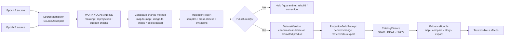

<!-- [KFM_META_BLOCK_V2]
doc_id: kfm://doc/<NEEDS-UUID>
title: Kansas Frontier Matrix — Remote Sensing Change Detection
type: standard
version: v1
status: draft
owners: <NEEDS OWNER>
created: <YYYY-MM-DD>
updated: <YYYY-MM-DD>
policy_label: <NEEDS POLICY LABEL>
related: [<NEEDS-VERIFIED-RELATED-PATHS>]
tags: [kfm, remote-sensing, change-detection]
notes: [Grounded in the March 2026 KFM PDF corpus; a historical Dec 2025 in-corpus draft names this file path, but current repo topology, owners, and local links still require verification.]
[/KFM_META_BLOCK_V2] -->

# Kansas Frontier Matrix — Remote Sensing Change Detection

Evidence-first guidance for detecting, validating, interpreting, and publishing spatial change without letting derivative maps or summaries quietly become sovereign truth.

> [!IMPORTANT]
> This README is grounded in the March 2026 KFM PDF corpus and preserves continuity with an older in-corpus draft that named this file path. The mounted repository tree was not directly visible in the current session, so current owners, sibling-doc links, child directories, and implementation depth remain **INFERRED**, **PROPOSED**, or **NEEDS VERIFICATION** where marked.

## Impact

**Status:** `experimental`  
**Owners:** `NEEDS VERIFICATION`  
**Path:** `docs/analyses/remote-sensing/change-detection/README.md`  
**Role:** directory README / working contract for change-detection analysis


**Quick jump:** [Scope](#scope) · [Repo fit](#repo-fit) · [Inputs](#inputs) · [Exclusions](#exclusions) · [Quickstart](#quickstart) · [Usage](#usage) · [Workflow diagram](#workflow-diagram) · [Tables](#tables) · [Definition of done](#definition-of-done) · [FAQ](#faq) · [Appendix](#appendix)

### Status labels used in this file

| Label | Meaning here |
|---|---|
| **CONFIRMED** | Supported by attached doctrine or other session-visible source material. |
| **INFERRED** | Strong doctrinal completion that fits KFM architecture, but is not mounted-repo fact in this session. |
| **PROPOSED** | Recommended local structure, workflow, or file placement for this directory. |
| **NEEDS VERIFICATION** | Repo-specific detail not directly proven in the current session. |

## Scope

This directory README defines the **working contract** for change-detection analysis inside KFM’s remote-sensing layer.

In this context, **change detection** means disciplined comparison across time for features or conditions such as hydrology, vegetation, land cover, settlement growth, thermal stress, flood extent, erosion, or infrastructure change. The emphasis is not just on producing a delta surface, but on making the comparison basis, dates, preprocessing, support, uncertainty, and evidence trail inspectable.

This README does **not** replace KFM’s higher-order doctrine for the truth path, publication law, correction law, or trust-visible shell behavior. It narrows those rules into a change-detection-specific operating surface.

> [!NOTE]
> March 2026 KFM doctrine explicitly names **vegetation-change packaging** as an active Kansas data-gap closure item. This README therefore treats change-detection packaging as a real backlog candidate, not decorative analytical prose.

## Repo fit

| Item | Value |
|---|---|
| **Current path** | `docs/analyses/remote-sensing/change-detection/README.md` (**historical draft evidence**, current mount **NEEDS VERIFICATION**) |
| **Historical continuity** | A prior in-corpus draft already named this exact file path and role; this version rebuilds it against the March 2026 doctrine rather than treating the older draft as current repo proof. |
| **Upstream** | [`../README.md`](../README.md) — remote-sensing analyses index (**INFERRED from historical draft continuity**, **NEEDS VERIFICATION**) |
| **Downstream** | [`./methods/`](./methods/), [`./results/`](./results/), [`./reports/`](./reports/), [`./governance.md`](./governance.md) (**PROPOSED starter structure**) |
| **Primary repo role** | Describe how change-detection work is framed, documented, reviewed, and handed off inside KFM. |
| **Upstream dependency** | KFM doctrine for evidence, publication, correction, rights/sensitivity, verification, and trust-visible UI behavior. |
| **Downstream consumers** | Compare views, map layers, dossier/story surfaces, Evidence Drawer payloads, and exports (**INFERRED doctrinal consumers**, current wiring **NEEDS VERIFICATION**) |

## Inputs

Accepted inputs for this directory include the following:

| Accepted input | What belongs here |
|---|---|
| **Multi-epoch imagery** | Optical, SAR, thermal, aerial, orthophoto, DEM/DSM-difference, or other time-separated remotely sensed surfaces. |
| **Derived analytical rasters** | Classified land cover, water masks, burn severity, thermal surfaces, NDVI/NBR/NDWI deltas, coherence products, or other analytical intermediates. |
| **AOI and mask geometry** | Study areas, exclusion masks, cloud/shadow masks, waterbody masks, training/validation extents, or comparison footprints. |
| **Acquisition and processing metadata** | Sensor or product family, acquisition date/time, support/resolution, CRS/datum, radiometric assumptions, classification logic, resampling, masking, and preprocessing notes. |
| **Validation material** | Field points, interpreted control samples, authoritative comparison layers, photo logs, steward review notes, or conflict notes. |
| **Evidence references** | EvidenceBundle links, release references, validation reports, correction references, or other KFM trust objects. |

## Exclusions

This README should **not** become a catch-all for nearby work.

| Exclusion | Put it here instead | Status |
|---|---|---|
| **Raw source onboarding, fetch logic, or ingest mechanics** | Source onboarding / ingest documentation above this analysis layer | **CONFIRMED doctrine**, local path **NEEDS VERIFICATION** |
| **Generic spectral-index explanation** | Remote-sensing index or multispectral reference docs upstream | **INFERRED**, local path **NEEDS VERIFICATION** |
| **Dense monitoring and long-horizon temporal stacks** | Time-series / monitoring docs or a dedicated monitoring lane | **INFERRED** |
| **Field protocol detail and scoring methodology** | Validation / ground-truth documentation | **INFERRED** |
| **Public narrative packaging or civic story copy** | Story/export surface docs and publication runbooks | **CONFIRMED doctrine**, local path **NEEDS VERIFICATION** |
| **Core publication, correction, or policy law** | KFM canonical doctrine and release/correction runbooks | **CONFIRMED doctrine** |
| **Model cards, forecasting, or simulation doctrine** | Model/runtime and scenario documentation | **CONFIRMED doctrine**, local path **NEEDS VERIFICATION** |

## Directory tree

```text
docs/
└── analyses/
    └── remote-sensing/
        └── change-detection/
            ├── README.md          # This file
            ├── methods/           # PROPOSED: method notes, thresholds, parameter docs
            ├── results/           # PROPOSED: derived figures, maps, tables, approved outputs
            ├── reports/           # PROPOSED: validation, interpretation, and review memos
            └── governance.md      # PROPOSED: rights, sensitivity, precision, and release notes
```

> [!NOTE]
> The child structure above is a **PROPOSED** working shape, not a claimed mounted directory listing.

## Quickstart

Use this directory when the core question is not “what does this sensor measure?” but rather:

**What changed, compared to what, under which assumptions, with what support, and how confidently can KFM expose that change downstream?**

1. **State the decision question first.**  
   Define the phenomenon of interest: flood extent, vegetation loss, channel migration, urban growth, burn scar, thermal change, shoreline movement, or something else.

2. **Declare the comparison basis.**  
   Choose one explicitly:
   - `map_to_map`
   - `image_to_image`
   - `class_transition`
   - `object_based`
   - `time_series_handoff`

3. **Register both epochs clearly.**  
   Record source, acquisition date/time, sensor or product family, support/resolution, CRS/datum, masking assumptions, and any rights or sensitivity notes.

4. **Harmonize before comparing.**  
   Review CRS, datum, extent, resampling, pixel support, cloud/shadow handling, seasonal comparability, classification schema, and threshold logic.

5. **Generate the smallest useful candidate change surface.**  
   Produce the least elaborate product that can answer the question honestly before moving to summaries, tiles, or story-facing assets.

6. **Validate and interpret.**  
   Use field points, interpreted samples, authoritative references, steward review, or conflict notes. Separate “signal” from “artifact.”

7. **Package the release-linked evidence.**  
   A change surface does not become outward-facing KFM material just because it renders well. Dates, assumptions, uncertainty, and evidence linkage must be visible enough for downstream surfaces to remain honest.

> [!IMPORTANT]
> In KFM, corroboration is more than “two files say roughly the same thing.” Before claiming confirmation, check source independence, identity alignment, spatial support compatibility, temporal support compatibility, method and unit comparability, and explicit conflict handling.

### Illustrative comparison scaffold

```yaml
change_detection_run:
  question: "<what changed?>"
  comparison_basis: "map_to_map | image_to_image | class_transition | object_based | time_series_handoff"
  epoch_a:
    source: "<sensor/product>"
    acquired_at: "<timestamp>"
    support: "<resolution/support>"
    crs: "<required>"
  epoch_b:
    source: "<sensor/product>"
    acquired_at: "<timestamp>"
    support: "<resolution/support>"
    crs: "<required>"
  harmonization:
    masks_review: "<done>"
    seasonal_review: "<done>"
    reprojection_or_resampling: "<required if used>"
    preprocessing_notes: "<required>"
  validation:
    method: "<field|interpreted|authoritative reference|review>"
    limitations: "<required>"
  release_linkage:
    dataset_version: "<required before outward release>"
    projection_build_receipt: "<required for derived change map/export>"
    evidence_bundle: "<required for claim-bearing surface>"
```

## Usage

### Discrete two-date comparison

Use this when the analysis compares two chosen moments or short windows in time.

Typical examples:
- before/after flood extent
- burn scar emergence
- vegetation gain/loss
- shoreline or channel movement
- urban expansion between selected years

This is often the most legible starting point, but it is also the easiest place to create **false change** if dates, support, or preprocessing differ in hidden ways.

### Map-to-map or class-transition comparison

Use this when both epochs are already classified, segmented, or otherwise interpreted into classes or objects.

This family is useful for:
- land-cover transition matrices
- wet/dry class changes
- built/non-built transitions
- feature presence/absence comparison

A simple map-to-map result can be extremely readable — for example, a binary or ternary raster where values encode loss, no change, and gain — but it is also fragile. If the two dates, class logic, or training assumptions drift, the change output will inherit that drift.

### Image-to-image analytical differencing

Use this when the change signal lives in spectral, thermal, radar, or elevation values rather than in an already classified map.

This family is useful for:
- vegetation stress or recovery
- thermal anomaly comparison
- coherence change
- DEM subtraction
- moisture or water-surface change

This can preserve more nuance than map-to-map comparison, but it demands tighter control over radiometry, masks, co-registration, support, and temporal comparability.

### Hydrology and hazard review

KFM doctrine explicitly favors **hydrology as the preferred first thin slice** because it is public-safe, place/time-rich, and operationally legible. This README is broader than hydrology alone, but hydrologic change remains the clearest early lane for disciplined, governed use:
- flood extent comparison
- reservoir stage-area change
- channel migration
- watershed disturbance
- wetland gain/loss

Use this directory to keep hydrologic change products from drifting into “persuasive flood maps” without date, support, uncertainty, and evidence state.

### Monitoring handoff

When the same phenomenon needs many dates, rolling thresholds, or continuous interpretation, the work may no longer belong here alone.

A good rule of thumb:
- **selected epochs** → this directory
- **dense temporal behavior** → time-series / monitoring
- **field truth and scoring discipline** → validation

> [!WARNING]
> A change surface is not self-authenticating. Different sensor families, acquisition seasons, masking choices, georegistration quality, pixel support, resampling, class definitions, or threshold logic can all create visible “change” that is really workflow drift.

## Workflow diagram



> [!IMPORTANT]
> In KFM terms, a candidate change raster or polygon layer stays **derived** until it is tied to release-linked metadata, evidence packaging, and visible correction behavior.

## Tables

### Method family matrix

| Method family | Best for | Typical strengths | Common failure mode | Typical outputs |
|---|---|---|---|---|
| **Map-to-map** | Comparing two already classified products | Easy to explain; strong for category transitions | Different class logic creates fake change | Transition grids, gain/loss rasters, polygons |
| **Image-to-image** | Spectral, thermal, radar, or elevation change | Preserves more signal; useful before heavy categorization | Date/support/radiometry mismatch | Delta rasters, thresholded anomalies, summary stats |
| **Class-transition** | Land-cover or land-use change across stable classes | Strong for reporting and policy summaries | Training data drift or class collapse | Transition matrix, class-change map, area totals |
| **Object-based** | Feature-level change such as waterbodies, buildings, parcels, or patches | Better feature semantics than per-pixel alone | Segmentation differences create unstable objects | Change objects, counts, object attributes |
| **Time-series handoff** | Many dates, ongoing monitoring, repeated events | Reduces snapshot bias; can evolve toward monitoring | Overloading this directory with monitoring logic | Change flags, anomaly timelines, handoff memo |

### Minimum metadata and evidence fields

| Field | Why it matters |
|---|---|
| **Comparison basis** | Without this, reviewers cannot tell what “change” actually means. |
| **Epoch A / Epoch B acquisition date** | Time is part of the claim, not decoration. |
| **Valid time / issue time / correction time** | KFM treats time semantics explicitly; do not collapse observation time and publication time. |
| **Source sensor or product lineage** | Sensor family affects comparability. |
| **CRS / datum / support / resampling** | Spatial mismatch can create false movement, false area change, or silent support drift. |
| **AOI and masks** | Declares what was and was not eligible for comparison. |
| **Preprocessing notes** | Cloud masks, atmospheric correction, co-registration, filtering, and classification assumptions materially affect output. |
| **Thresholds or class logic** | Needed to distinguish measured change from analyst choice. |
| **Validation method** | Field points, interpreted samples, or authoritative comparison surfaces should be explicit. |
| **Known limitations** | Public-facing explanation should not erase uncertainty. |
| **Rights / sensitivity / precision posture** | Exact locations and sensitive ecological or heritage areas may require generalization, restricted handling, or withholding. |
| **Release linkage / correction linkage** | Derived outputs must stay tied to release and correction lineage. |

### Governed handoff object matrix

| Object family | Change-detection role | Typical contents | Status in this README |
|---|---|---|---|
| **SourceDescriptor** | Declares the intake contract for imagery or derived upstream products | source identity, cadence, rights posture, time support, validation intent | **CONFIRMED doctrine**, local use **PROPOSED** |
| **ValidationReport** | Records what preprocessing and QC passed, failed, or quarantined | check list, severity, subject refs, conflict notes | **CONFIRMED doctrine**, local use **PROPOSED** |
| **DatasetVersion** | Carries the canonical candidate or promoted change product | stable ID, version ID, support, time semantics, provenance links | **CONFIRMED doctrine**, local use **PROPOSED** |
| **ProjectionBuildReceipt** | Proves a derived raster/vector/export was built from a known release scope | release ref, projection type, build time, freshness basis | **CONFIRMED doctrine**, local use **PROPOSED** |
| **CatalogClosure** | Publishes outward metadata closure for the released product | STAC / DCAT / PROV refs, identifiers, release linkage | **CONFIRMED doctrine**, local use **PROPOSED** |
| **EvidenceBundle** | Packages support for map, compare, story, export, or answer surfaces | source basis, lineage summary, preview policy, rights/sensitivity state | **CONFIRMED doctrine**, local use **PROPOSED** |
| **CorrectionNotice** | Preserves visible lineage under supersession, narrowing, or withdrawal | affected releases, rebuild refs, cause, public note | **CONFIRMED doctrine**, local use **PROPOSED** |

### Output classes and KFM posture

| Output | Primary role | Default KFM posture |
|---|---|---|
| **Change raster or vectorized change polygons** | Analytical result | **Derived** until explicitly packaged and released under governed evidence flow |
| **Transition tables / area summaries / charts** | Human-readable reporting | **Derived convenience surface** |
| **Map tiles / thumbnails / preview images** | Delivery and browsing | **Derived convenience surface** |
| **Validation report** | Review and confidence support | Trust-bearing support object |
| **Catalog closure package** | Outward discoverability and lineage | Trust-bearing closure object |
| **Evidence bundle** | Inspectable provenance at point of use | Trust-bearing support object |
| **Compare / story / export surface** | Public or steward-facing interpretation | Must remain downstream of release state and evidence packaging |
| **Correction or rebuild notice** | Visible lineage under change | Trust-bearing operational object |

## Definition of done

A change-detection deliverable in this directory is ready for handoff only when all of the following are true:

- [ ] The comparison basis is explicit.
- [ ] Both epochs have visible source identity and acquisition time.
- [ ] CRS, datum, support, extent, mask, and resampling decisions are recorded.
- [ ] Method rationale and threshold or class logic are documented.
- [ ] Validation method and limitations are attached.
- [ ] Corroboration claims, if any, have passed independence and comparability checks.
- [ ] The output can be traced to release-linked evidence and a correction path.
- [ ] Rights, sensitivity, and precision posture have been reviewed.
- [ ] Story / compare / export surfaces can show dates and uncertainty without bluffing.
- [ ] The deliverable does not overclaim beyond what the inputs support.

## FAQ

### How is change detection different from time-series monitoring?

Change detection usually compares selected epochs or bounded windows. Time-series monitoring keeps a longitudinal view over many observations and is often the better home once the work stops being “compare these dates” and becomes “track this phenomenon continuously.”

### Can I compare data from different sensors?

Yes, but only if the harmonization logic is made explicit. Different sensors, support, radiometry, geometry, or class schemes can create visible deltas that are methodological rather than environmental.

### Is NDVI differencing enough?

Sometimes. It can be useful for vegetation questions, but it is not a universal proxy for all change. Use a method that matches the phenomenon, not simply the index that is easiest to compute.

### When does a change map become publishable in KFM?

Not when it looks persuasive. It becomes publishable only when its comparison basis, dates, assumptions, uncertainty, rights posture, and evidence linkage are explicit enough for downstream surfaces to remain honest.

### Why is hydrology mentioned so often in a broader change-detection README?

Because March 2026 KFM doctrine treats hydrology as the preferred first thin slice. It is narrow enough to govern end to end, public-safe often enough to expose, and demanding enough to exercise the hard seams around time, units, release linkage, and correction.

### Does this README assume specific scripts or mounted folders?

No. Any local command, automation path, sibling module name, or child folder beyond this file is marked where it is not directly proven in the current session.

## Appendix

<details>
<summary>Glossary, review cues, and illustrative handoff bundle</summary>

### Compact glossary

| Term | Working meaning |
|---|---|
| **Epoch** | One comparison moment or bounded acquisition window. |
| **Support** | The effective ground meaning of a pixel or feature, not just nominal resolution. |
| **False change** | Apparent change caused by workflow differences rather than real-world change. |
| **Co-registration** | Spatial alignment of two or more datasets before comparison. |
| **Snapshot bias** | Mistaking one date or one pair of dates for a whole temporal story. |
| **Stale surface** | A still-visible derivative output whose freshness basis is no longer adequate. |

### Review cues

Ask these before approving any outward-facing result:

1. Is the comparison really like-for-like?
2. Are the dates close enough in seasonality and acquisition conditions?
3. Does the method detect the phenomenon of interest, or just contrast?
4. Can a reviewer trace the result back to source epochs, preprocessing, and release linkage?
5. Would a user understand the uncertainty and scope from the surface alone?

### Illustrative governed handoff bundle

The structure below is illustrative and not a claimed mounted repo artifact.

```text
change-detection-handoff/
├── source_descriptor.yaml
├── comparison_basis.md
├── epoch_a_metadata.json
├── epoch_b_metadata.json
├── harmonization_notes.md
├── validation_report.json
├── dataset_version.json
├── projection_build_receipt.json
├── catalog_closure.json
├── evidence_bundle.json
└── correction_notice.md
```

</details>

[Back to top](#kansas-frontier-matrix--remote-sensing-change-detection)
