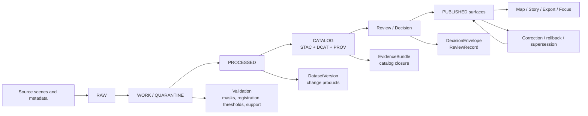

<!-- [KFM_META_BLOCK_V2]
doc_id: kfm://doc/TBD-REMOTE-SENSING-CHANGE-DETECTION-GOVERNANCE
title: Remote Sensing Change Detection Governance
type: standard
version: v1
status: draft
owners: TBD — NEEDS VERIFICATION
created: TBD-NEEDS-VERIFICATION
updated: TBD-NEEDS-VERIFICATION
policy_label: TBD — NEEDS VERIFICATION
related: [README.md, methods/, results/, reports/]
tags: [kfm, remote-sensing, change-detection, governance]
notes: [Built from attached KFM doctrinal corpus plus adjacent continuity evidence; current-session workspace verification was PDF-only, so repo ownership, schemas, workflows, and exact adjacent file presence remain NEEDS VERIFICATION.]
[/KFM_META_BLOCK_V2] -->

# Remote Sensing Change Detection Governance

Governance rules for how KFM detects, validates, publishes, and explains imagery-derived change without collapsing raw observation, derived products, and narrative output into one thing.

    

| Field | Value |
|---|---|
| **Status** | Draft |
| **Owners** | `TBD` — NEEDS VERIFICATION |
| **Evidence posture** | **CONFIRMED** doctrine · **INFERRED** lane fit · **PROPOSED** operational gates · **UNKNOWN** mounted enforcement depth |
| **Repo fit** | Governance note for the `docs/analyses/remote-sensing/change-detection/` lane; intended companion to `README.md`, `methods/`, `results/`, and `reports/`. |
| **Quick jumps** | [Scope](#scope) · [Evidence posture](#evidence-posture-used-here) · [Governance model](#governance-model) · [Method controls](#method-controls) · [Surface obligations](#trust-visible-surface-obligations) · [Release and correction](#release-and-correction) · [Definition of done](#definition-of-done) |

> [!IMPORTANT]
> This file is **governance-first**. It is not the method notebook, not the validation report, and not proof that CI gates, contract schemas, or runtime envelopes are already mounted in the repository.

> [!NOTE]
> Where current-session evidence did not expose repo files, schemas, tests, workflows, or runtime traces, this document stays normative and leaves implementation-shaped details visible as **UNKNOWN** or **NEEDS VERIFICATION** rather than smoothing them into fact.

## Scope

This document governs the **remote-sensing change-detection lane** as a publication and trust problem, not merely as an algorithm choice.

### Accepted inputs

- source scenes and scene metadata that identify **sensor, date, CRS, spatial support, and acquisition context**
- preprocessed raster products such as corrected reflectance, indices, masks, and aligned stacks
- interpreted outputs such as change masks, classified deltas, anomaly layers, or event candidates
- validation references, review notes, and release-bound evidence bundles
- story, map, export, and Focus-mode surfaces that summarize or visualize change

### Exclusions

- scratch experiments with no stable provenance
- free-form narrative claims that do not resolve to inspectable evidence
- direct publication of exact-location-sensitive outputs when generalization or withholding is required
- treating derived change products as authoritative truth by default
- undocumented thresholding, opaque model output, or “best effort” explanations that bypass evidence resolution

[Back to top](#remote-sensing-change-detection-governance)

## Evidence posture used here

| Label | How it is used in this file |
|---|---|
| **CONFIRMED** | KFM doctrine on truth path, trust membrane, authoritative-versus-derived separation, contract families, trust-visible surfaces, and fail-closed outcomes. |
| **INFERRED** | The local role of this file as the lane governance companion to the change-detection overview and adjacent directory materials. |
| **PROPOSED** | Concrete release gates, checklist structure, and artifact mapping needed to make the lane operationally governable. |
| **UNKNOWN** | Exact repo ownership, mounted schemas, CI/workflow coverage, runtime envelope examples, and current delivery topology. |
| **NEEDS VERIFICATION** | File paths, owners, policy label, adjacent doc presence, and any implementation claim not surfaced directly in this session. |

## Governance model

KFM’s remote-sensing change-detection work inherits the same governing laws as every other consequential lane:

| KFM doctrine | Remote-sensing consequence |
|---|---|
| **Canonical truth path** | Scene intake, preprocessing, candidate change products, catalog closure, and release must follow `Source edge -> RAW -> WORK / QUARANTINE -> PROCESSED -> CATALOG -> PUBLISHED`. |
| **Trust membrane** | Public maps, stories, exports, and Focus Mode must read through governed interfaces and evidence resolution, not from raw stores or ad hoc notebooks. |
| **Authoritative vs. derived separation** | A sensor scene, an index raster, a classified change mask, and a narrative summary are not the same thing. Derived layers stay derived unless explicitly promoted. |
| **Place and time coequal** | Every outward claim about “change” must name both geography and time basis. |
| **2D first; 3D conditional** | 3D scene work for this lane is burden-bearing and cannot bypass the same evidence, sensitivity, and correction rules. |
| **Negative outcomes are valid** | The lane must support hold, quarantine, deny, abstain, stale-visible, generalized, superseded, withdrawn, and error states without bluffing confidence. |

### Lane object model

| Object class | What it is | What it is **not allowed** to claim by itself |
|---|---|---|
| **Observed input** | Raw or minimally transformed sensor acquisition and its metadata | Final interpretation of what changed |
| **Derived measurement** | Reflectance product, DEM derivative, mask, index, or co-registered stack | Causal explanation or public-safe narrative by default |
| **Interpreted output** | Classified land-cover delta, anomaly map, event candidate, or thresholded surface | Authoritative truth without validation, support semantics, and release state |
| **Narrative surface** | Map annotation, dossier statement, story excerpt, Focus response | Evidence-independent truth |
| **Published KFM claim** | A released, evidence-resolvable outward statement | A convenient summary detached from EvidenceBundle and release context |

## Lane lifecycle at a glance

## Lifecycle gates

| Phase | Must be explicit before promotion | Minimum proof objects | Fail-closed triggers |
|---|---|---|---|
| **Admission** | source identity, sensor/source family, access pattern, spatial frame, time semantics, rights posture, publication intent | SourceDescriptor, IngestReceipt | unknown rights, unresolved source identity, missing support semantics |
| **Preprocessing** | cloud/shadow strategy, co-registration basis, atmospheric/radiometric handling, resampling rules, nodata handling | ValidationReport, transform receipts | untracked reprojection, missing masks, unbounded resampling drift, schema or unit mismatch |
| **Change derivation** | method family, threshold/classification assumptions, temporal basis, uncertainty handling, modeled-vs-observed distinction | DatasetVersion, method notes, deterministic run evidence | seasonal mismatch ignored, misregistration unresolved, classification assumptions hidden |
| **Validation** | reference basis, comparison logic, known limitations, support alignment, review outcome | ValidationReport, EvidenceBundle members | no reference basis, incompatible support/time comparison, poor-quality outputs promoted silently |
| **Catalog closure** | outward metadata closure and lineage linkage | CatalogClosure, STAC/DCAT/PROV refs | missing closure, broken outward lineage, missing release linkage |
| **Publication** | review state, obligations, release scope, correction path, access posture | DecisionEnvelope, ReviewRecord, ReleaseManifest / proof pack | unpublished review state, inaccessible evidence path, unresolved sensitivity or exact-location burden |
| **Runtime explanation** | citation verification, scope echo, surface state, audit linkage | EvidenceBundle, RuntimeResponseEnvelope | uncited answer, stale-visible state hidden, no audit trail, narrative outruns evidence |
| **Correction** | visible supersession, withdrawal, narrowing, or replacement behavior | CorrectionNotice, rebuild refs | silent overwrite, erased history, unchanged public surface after known error |

[Back to top](#remote-sensing-change-detection-governance)

## Method controls

Remote-sensing governance in KFM is not only about whether a method is technically plausible. It is about whether the method’s **support, time basis, assumptions, and uncertainty** are visible enough to survive publication.

### 1. Measurement, not backdrop

Imagery in this lane is treated as a measurement source. It should not be used as mere visual scenery once the product makes consequential claims.

### 2. Time basis is load-bearing

A change claim must name:

- source acquisition dates or temporal window
- whether the comparison is **two-date**, **multi-epoch**, or **time-series**
- whether the claim is seasonal, event-based, long-horizon, or anomaly-based
- whether the output is snapshot, trend, break, or forecast-like modeled surface

### 3. Common false-change risks must stay visible

At minimum, the lane should explicitly guard against:

- seasonal variation and phenology drift
- cloud and shadow contamination
- scene misregistration
- radiometric or atmospheric inconsistency
- illumination differences
- support mismatch across sensors or resolutions
- thresholding or classification drift across releases

### 4. Aggregation can hide the real pattern

Administrative or summary-unit rollups should not erase within-unit heterogeneity. If a release aggregates raster or per-pixel change into counties, watersheds, parcels, or other units, the aggregation basis and information loss should remain visible.

### 5. Validation is part of the claim, not an appendix

Validation belongs in the lane’s governable surface, not only in offline notebooks. A published change surface should be tied to known references, quality notes, and limitation statements.

### Method family fit

| Method family | Strong use | Governance caution |
|---|---|---|
| **Two-date differencing** | abrupt, long-lived changes with comparable scenes | easy to overstate if seasonal or radiometric differences are not controlled |
| **Post-classification comparison** | categorical change narratives across periods | classification errors can compound if class models differ or label provenance is weak |
| **Time-series / break detection** | subtle, slow, or repeated change over longer periods | requires clear cadence, gap handling, and trend-vs-event distinction |
| **Anomaly surfaces** | drought, flood, burn, or episodic stress interpretation | anomaly != cause; keep modeled status and uncertainty visible |
| **Model-assisted interpretation** | ranking, candidate generation, bounded synthesis | may assist review, but may not become sovereign truth |

> [!CAUTION]
> “Detected change” is not automatically “real-world confirmed change.” In KFM, the distance between a spectral delta and a public-facing claim must be bridged by provenance, support semantics, validation, and review.

## Rights, sensitivity, and exact-location handling

This lane is not automatically public-safe just because many imagery sources are public.

### Minimum rules

- If a change product is linked to sensitive ecological monitoring, tribal land context, archaeological inference, or any exact-location-sensitive layer, the output must carry the relevant CARE or policy state.
- Generalized and precise representations must not be silently mixed.
- Story, export, and Focus surfaces must preserve the same sensitivity posture as the underlying release.
- Rights and redistribution terms must remain visible at release time, not inferred from convenience.

### Sensitive output patterns that require deliberate handling

| Pattern | Required posture |
|---|---|
| Ecological site disturbance or habitat-related change near sensitive locations | generalized or withheld by default unless a policy-safe precision class exists |
| Tribal, culturally sensitive, or heritage-adjacent change interpretation | preserve context, provenance, and review; avoid flattening narrative complexity into “damage score” shorthand |
| Cross-source fused products that inherit restricted inputs | strongest applicable rights/sensitivity rule governs the outward artifact |
| Public-facing before/after imagery that could expose sensitive coordinates | preview-safe cropping, generalization, or withholding |

## Trust-visible surface obligations

KFM doctrine treats interface work as part of the evidence chain. This lane therefore owes different trust signals to different surfaces.

| Surface | This lane must expose |
|---|---|
| **Map** | visible time scope, layer state, freshness, and route to evidence |
| **Timeline / compare** | comparison basis, as-of rules, and explicit temporal anchor |
| **Story surface** | dates, evidence-linked excerpts, review/correction state, and perspective labels where interpretation is human-authored |
| **Evidence Drawer** | EvidenceBundle members, transform summary, release state, preview limits, and sensitivity posture |
| **Focus Mode** | scoped retrieval basis, citation verification, audit reference, and `ANSWER / ABSTAIN / DENY / ERROR` outcome only |
| **Export** | release scope, evidence linkage, preview policy, correction linkage, and any generalization state |
| **Controlled 3D** | the same evidence, policy, review, freshness, and correction signals as 2D; no spectacle exemption |

### Focus Mode rule for this lane

Focus Mode may summarize **how an area changed** only when the surface can reconstruct that statement from released scope and citation-checked evidence. If the evidence path is partial, stale, conflicted, or policy-blocked, the correct output is a visible negative state rather than fluent prose.

[Back to top](#remote-sensing-change-detection-governance)

## Minimum proof objects for this lane

The exact mounted filenames remain **UNKNOWN** in this session, but the lane should align to the KFM contract family model below.

| Proof object | Why this lane needs it |
|---|---|
| **SourceDescriptor** | to declare sensor/source identity, access, cadence, rights, support, time semantics, and modeled-vs-observed posture |
| **IngestReceipt** | to prove a fetch/landing event occurred for source scenes or source metadata |
| **ValidationReport** | to record mask, registration, schema, unit, and quality results |
| **DatasetVersion** | to carry an authoritative candidate or promoted change product with stable ID and time/support semantics |
| **CatalogClosure** | to tie outward STAC/DCAT/PROV closure to a releaseable lane object |
| **DecisionEnvelope** | to express policy outcome, obligations, and audit linkage machine-readably |
| **ReviewRecord** | to capture approval, denial, escalation, or review notes where needed |
| **EvidenceBundle** | to package support for a map layer, story statement, export preview, or Focus answer |
| **RuntimeResponseEnvelope** | to make runtime outcomes accountable, especially for Focus Mode |
| **CorrectionNotice** | to preserve visible lineage when a change product is superseded, generalized, or withdrawn |

## Release and correction

### Publish only when

- the change product has a stable release candidate identity
- validation results are attached and legible
- outward metadata closure is complete enough to resolve evidence
- rights and sensitivity posture are explicit
- any required review has completed
- the public surface can express freshness, scope, and correction state

### Do not publish when

- the evidence path is unresolved
- temporal support is ambiguous
- sensitivity or exact-location risk lacks a safe public representation
- validation is missing, incompatible, or failed
- the lane would force Focus, Story, or Map surfaces to bluff certainty

### Correction behavior

A corrected change product should not quietly overwrite the previous one. At minimum, the outward surface should preserve one of the following visible states:

- **superseded**
- **generalized**
- **stale-visible**
- **withdrawn**
- **partial**
- **denied**
- **abstained**
- **error**

## Definition of done

- [ ] source identity, support, time semantics, and rights posture are explicit
- [ ] preprocessing assumptions are documented and reproducible
- [ ] change method and threshold/classification assumptions are visible
- [ ] validation basis is attached
- [ ] STAC/DCAT/PROV closure is present for outward artifacts
- [ ] EvidenceBundle path is resolvable for consequential claims
- [ ] Focus/Story/Map surfaces can show freshness, review state, and correction state
- [ ] exact-location and CARE-sensitive cases have visible handling rules
- [ ] negative outcomes are supported as first-class surface states
- [ ] correction path exists for supersession, narrowing, or withdrawal

## Open verification items

| Item | Current status |
|---|---|
| Exact owners for this file | **UNKNOWN** |
| Exact `policy_label` for this lane | **UNKNOWN** |
| Mounted adjacent files and directories | **NEEDS VERIFICATION** |
| Contract schema filenames and validator commands | **UNKNOWN** |
| Active CI/workflow enforcement for this lane | **UNKNOWN** |
| RuntimeResponseEnvelope examples for Focus Mode in this lane | **UNKNOWN** |
| Direct repo proof for any `src/pipelines/etl/remote-sensing/` path | **NEEDS VERIFICATION** |
| Release proof packs or correction drills for this lane | **UNKNOWN** |

<strong>Appendix — lane authoring stance</strong>

### What this file should help reviewers ask

1. What is the raw observation here?
2. What is the derived measurement?
3. What is the interpreted output?
4. What is the outward-facing claim?
5. Can the outward-facing claim be reconstructed from released evidence?
6. If not, does the lane clearly quarantine, abstain, deny, or generalize?

### Neighboring docs this file is expected to complement

- `README.md` for lane overview and purpose
- `methods/` for algorithmic and workflow detail
- `results/` for generated outputs
- `reports/` for validation and accuracy material

### Deliberate omissions

This file does **not** pin exact schema paths, CI jobs, runtime endpoints, ownership maps, or release-manifest locations as current repo fact, because those were not directly surfaced in the mounted workspace during this session.

