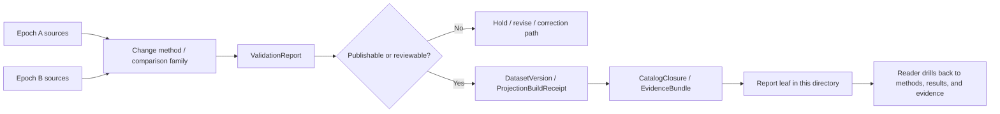

# Kansas Frontier Matrix — Change Detection Reports

Governed report lane for validation, interpretation, release, and correction-facing writeups attached to remote-sensing change-detection work.

> [!NOTE]
> **Status:** experimental  
> **Doc status:** draft  
> **Owners:** @bartytime4life  
>      
> **Quick jumps:** [Scope](#scope) · [Repo fit](#repo-fit) · [Accepted inputs](#accepted-inputs) · [Exclusions](#exclusions) · [Current verified snapshot](#current-verified-snapshot) · [Directory tree](#directory-tree) · [Quickstart](#quickstart) · [Usage](#usage) · [Diagram](#diagram) · [Reference tables](#reference-tables) · [Task list](#task-list--definition-of-done) · [FAQ](#faq) · [Appendix](#appendix)  
> **Repo fit:** `docs/analyses/remote-sensing/change-detection/reports/` → upstream: [`../README.md`](../README.md), [`../../README.md`](../../README.md), [`../../../README.md`](../../../README.md), [`../../../../reports/README.md`](../../../../reports/README.md), [`../../../../README.md`](../../../../README.md) · adjacent lanes: [`../methods/README.md`](../methods/README.md), [`../results/README.md`](../results/README.md), [`../governance.md`](../governance.md)

> [!IMPORTANT]
> This directory is a **downstream report surface**. Files here may explain, compare, summarize, or review change-detection outputs, but they do **not** replace canonical result assets, validation objects, release-linked evidence, or correction records.

> [!WARNING]
> The current public snapshot for this directory is still shallow. Treat any report inventory beyond what is explicitly enumerated below as **NEEDS VERIFICATION** until mounted repository inspection or direct file enumeration proves otherwise.

## Scope

Change detection in KFM is not screenshot comparison. It is disciplined comparison across **time**, **support**, **preprocessing state**, and **evidence route**.

This directory is for human-readable report artifacts that help a maintainer, reviewer, or downstream reader answer questions such as:

- what changed
- between which epochs or windows
- under what comparison basis
- with which visible limits, caveats, and uncertainty
- with what release, correction, or review posture

Use this lane for:

- validation summaries tied to candidate or released change surfaces
- interpretation memos that explain observed patterns without claiming new source truth
- review-facing notes for stewardship, release, or correction decisions
- release- or correction-facing briefs that summarize meaning for humans
- compact figure/table notes that make change outputs easier to inspect and route

This directory is **not** the owner of raw remote-sensing inputs, canonical result assets, method specifications, policy bundles, or workflow logic.

## Repo fit

| Path | Role | Relationship |
| --- | --- | --- |
| [`../../../../README.md`](../../../../README.md) | docs subtree hub | broader documentation posture and local conventions |
| [`../../../README.md`](../../../README.md) | analyses index | parent entry point for analysis lanes |
| [`../../README.md`](../../README.md) | remote-sensing lane | remote-sensing doctrine, scope, and analysis conventions |
| [`../README.md`](../README.md) | change-detection lane | immediate parent lane for change-detection method and evidence posture |
| [`../../../../reports/README.md`](../../../../reports/README.md) | cross-cutting reports contract | report-lane expectations and trust posture |
| [`../methods/README.md`](../methods/README.md) | sibling method lane | method families, preprocessing choices, thresholds, and workflow details |
| [`../results/README.md`](../results/README.md) | sibling results lane | derived outputs, result assets, and release-facing materials |
| [`../governance.md`](../governance.md) | sibling governance note | local policy, review, or interpretation constraints when that lane matures |
| `./` | this directory | review-facing change-detection report leaves |

## Accepted inputs

Place material here when it is primarily a **report artifact** rather than a method, result, or policy source.

Accepted inputs include:

- validation summaries for change rasters, vectors, masks, or class-transition outputs
- interpretation memos that stay explicitly downstream of evidence and release objects
- compare-ready figure and table notes with traceable evidence links
- review summaries used during publication, correction, supersession, or withdrawal work
- short stewardship briefs that explain why a change output is publishable, generalized, stale-visible, or not publishable
- small derivative companions such as compact CSV or JSON summaries when they only support a report and do not become the canonical result

## Exclusions

Do **not** place the following here:

- raw imagery, scene dumps, source metadata exports, or uncontrolled evidence bundles
- canonical result assets or released change outputs → route to [`../results/README.md`](../results/README.md)
- method notes, threshold logic, preprocessing recipes, or comparison-family guidance → route to [`../methods/README.md`](../methods/README.md)
- policy bundles, release gates, or review logic that belong to governance materials → route to [`../governance.md`](../governance.md) or the broader docs lanes
- contracts, schemas, fixtures, workflow code, or CI logic
- copied source text or screenshot-heavy notes with no evidence route
- unsupported claims that a result is released, authoritative, corrected, or publishable when the evidence route does not prove that state
- precise sensitive coordinates or figures that should instead be generalized, withheld, or reviewed before public placement

## Current verified snapshot

The table below reflects the **current verified public snapshot** for this local lane and its directly related siblings.

| Item | Status | Note |
| --- | --- | --- |
| `docs/analyses/remote-sensing/change-detection/reports/README.md` | **CONFIRMED** | Current file exists and was placeholder-only before this rewrite |
| `docs/analyses/remote-sensing/change-detection/README.md` | **CONFIRMED** | Parent lane exists and already defines change-detection doctrine and governed handoff objects |
| `docs/analyses/remote-sensing/change-detection/methods/README.md` | **CONFIRMED** | Sibling method lane exists as a local placeholder |
| `docs/analyses/remote-sensing/change-detection/results/README.md` | **CONFIRMED** | Sibling results lane exists as a local placeholder |
| `docs/analyses/remote-sensing/change-detection/governance.md` | **CONFIRMED** | Local governance stub exists |
| Additional report leaves in this directory | **NEEDS VERIFICATION** | Not directly enumerated in the current public snapshot |

## Directory tree

The tree below reflects the current verified local shape and directly related siblings. It intentionally does **not** imply a deeper report inventory than what is presently verified.

```text
docs/
└── analyses/
    └── remote-sensing/
        └── change-detection/
            ├── README.md
            ├── governance.md
            ├── methods/
            │   └── README.md
            ├── results/
            │   └── README.md
            └── reports/
                └── README.md
```

## Quickstart

Inspect the local lane before adding or revising a report:

```bash
sed -n '1,220p' docs/analyses/remote-sensing/change-detection/README.md
sed -n '1,220p' docs/analyses/remote-sensing/README.md
sed -n '1,220p' docs/reports/README.md
ls docs/analyses/remote-sensing/change-detection/reports
```

Start a new report from a narrow, reviewable shell:

```md
# <Report title>

One-line purpose for this report.

> [!NOTE]
> **Status:** draft|review|published|superseded|withdrawn
> **Comparison basis:** <two-date|time-series|class-transition|threshold test|other>
> **Epochs:** <Epoch A date/range> → <Epoch B date/range>
> **Release basis:** <DatasetVersion / ProjectionBuildReceipt / CatalogClosure / NEEDS VERIFICATION>
> **Evidence route:** <relative links to methods, results, or evidence objects>
> **Sensitivity posture:** public|generalized|restricted|NEEDS VERIFICATION
> **Derived status:** descriptive|interpretive|review-facing summary over change-detection evidence

## What this report does
## Inputs and evidence route
## Findings
## Limits and uncertainty
## Review / correction state
```

> [!CAUTION]
> If a report cannot clearly name its **comparison basis**, **epochs**, and **evidence route**, it is not ready for this directory.

## Usage

### Add a report leaf

1. Choose a narrow report class such as validation summary, interpretation memo, or correction brief.
2. Name the file by scope and review window, not by a vague topic alone.
3. State the comparison basis explicitly: two-date, time-series, class-transition, threshold test, or other.
4. Link upward to the relevant change-detection context in [`../README.md`](../README.md).
5. Link sideways to the method and result lanes when those materials exist.
6. Keep figures and tables public-safe, reproducible, and subordinate to the evidence route.
7. Mark uncertainty as **NEEDS VERIFICATION** instead of implying stable release state.
8. Update this README if the directory inventory or routing conventions materially change.

### Update this README

Update this file when any of the following changes:

- the verified report inventory in this directory changes
- sibling lanes gain real content and need tighter routing
- a stable report filename pattern is adopted
- report classes in this lane become more specific or better evidenced
- release, correction, or review expectations change in a way that affects readers of this directory

## Diagram



## Reference tables

### Report classes and required linkage

| Report class | Use when | Must link to | Should not replace |
| --- | --- | --- | --- |
| Validation summary | You need to summarize QA, comparator results, thresholds, or acceptance logic for a change output | `ValidationReport` plus the relevant result or versioned output | raw QA logs, fixtures, or full method specs |
| Interpretation memo | You need to explain a spatial or temporal pattern visible in a change output | evidence route, result asset, and release-linked context | canonical raster/vector outputs |
| Review memo | A steward or reviewer needs a human-readable decision aid | the governing evidence route and local change-detection context | policy bundle or release manifest |
| Release / correction brief | A result needs a concise human summary of publication, supersession, correction, or withdrawal meaning | release-linked artifact and correction path where relevant | the root changelog or dataset metadata |
| Public-safe figure note | A figure or compact table needs enough context to remain legible in review or publication | the source report or result asset it explains | the underlying result or evidence objects |

### Minimum trust cues for consequential reports

| Cue | Minimum expectation |
| --- | --- |
| Comparison basis | Say whether the report is two-date, time-series, class-transition, threshold-based, or another comparison family |
| Epochs / windows | Name the exact dates or ranges being compared |
| Evidence route | Link to methods, results, or other evidence objects rather than relying on screenshots alone |
| Release basis | State whether the report summarizes candidate work, a released output, a correction path, or **NEEDS VERIFICATION** |
| Derived status | Make it clear whether the report is descriptive, interpretive, or review-facing |
| Sensitivity posture | Declare `public`, `generalized`, `restricted`, or `NEEDS VERIFICATION` |
| Outcome state | Keep report state visible: `draft`, `review`, `published`, `superseded`, or `withdrawn` |

### Outcome states used in this directory

| State | Meaning here |
| --- | --- |
| **draft** | Authoring in progress; not yet ready to represent a settled review posture |
| **review** | Under active technical or stewardship review |
| **published** | Tied to a release-linked evidence route and safe to treat as a current report surface |
| **superseded** | Replaced by a newer report or correction-facing artifact |
| **withdrawn** | Kept for lineage, but no longer active for interpretation or publication |
| **NEEDS VERIFICATION** | Current evidence is not strong enough to make a stronger claim |

## Task list & definition of done

Before merging a new report leaf or a major README update, confirm the following:

- [ ] The file name states the report scope and review window clearly.
- [ ] The report has a one-line purpose immediately below the H1.
- [ ] Comparison basis and epochs are explicit.
- [ ] The report links to methods, results, or release-linked evidence instead of acting as a shadow source of truth.
- [ ] Figures and tables are public-safe and not the only evidence route.
- [ ] The report distinguishes direct observation from interpretation.
- [ ] Correction or supersession state is visible where relevant.
- [ ] This README was updated if the verified inventory or routing boundary changed.

A report entry is complete when it helps a reader inspect change-detection meaning **without** confusing the report with the authoritative result, the validation object, or the release decision.

## FAQ

### Are reports in this directory authoritative?

No. They are downstream, human-readable surfaces that help interpret, review, or explain change-detection work. Canonical truth remains in the governed evidence and result path.

### Can I place raw imagery or full evidence dumps here?

No. This lane is for report artifacts, not source dumps or canonical assets.

### Does a comparison figure count as enough evidence by itself?

No. A figure can support a report, but it should not be the only route back to what was compared, when it was compared, and under which method or release basis.

### Where should method details live?

Route method-heavy detail to [`../methods/README.md`](../methods/README.md).

### Where should released outputs live?

Route canonical or release-facing outputs to [`../results/README.md`](../results/README.md).

### When should I open a correction brief?

Open one when an earlier report or interpretation needs visible clarification, supersession, generalization, or withdrawal.

## Appendix

<details>
<summary><strong>Illustrative starter filenames (PROPOSED)</strong></summary>

These are examples only. They are **not** a claim that these files already exist.

- `2026-04-vegetation-change-validation-summary.md`
- `2026-04-riparian-shift-interpretation-memo.md`
- `2026-04-release-window-correction-brief.md`
- `2026-04-two-date-change-review-memo.md`

</details>

<details>
<summary><strong>Reviewer prompts for change-detection reports</strong></summary>

Use these prompts during review:

- Are the compared epochs acquisition-compatible enough to support the claim being made?
- Is the apparent change plausible, or could it be preprocessing, masking, classification, or support mismatch?
- Does the report point to a real evidence route, or only to presentation artifacts?
- Is uncertainty visible where interpretation goes beyond direct observation?
- Does the report stay downstream of governed outputs, or has it started to behave like a shadow release object?

</details>

[Back to top](#kansas-frontier-matrix--change-detection-reports)
