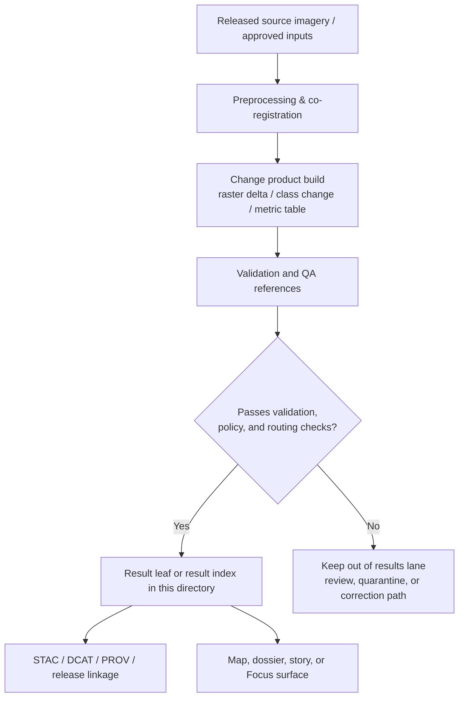

<!-- [KFM_META_BLOCK_V2]
doc_id: kfm://doc/<uuid-needs-verification>
title: Kansas Frontier Matrix — Remote Sensing Change Detection Results
type: standard
version: v1
status: draft
owners: NEEDS VERIFICATION
created: YYYY-MM-DD
updated: YYYY-MM-DD
policy_label: NEEDS VERIFICATION
related: [../README.md, ../../README.md, ../../validation/README.md, ../methods/, ../reports/, ../governance.md]
tags: [kfm, remote-sensing, change-detection, results]
notes: [Placeholders remain until mounted repo metadata, owners, policy label, and local file inventory are directly verified.]
[/KFM_META_BLOCK_V2] -->

# Kansas Frontier Matrix — Remote Sensing Change Detection Results

Directory index and routing surface for change-detection figures, tables, and summary leaves that stay one hop from method, validation, and lineage evidence.

> [!NOTE]
> **Status:** experimental *(treat as experimental until the local `results/` inventory is directly verified)*  
> **Owners:** NEEDS VERIFICATION  
>      
> **Quick jumps:** [Scope](#scope) · [Repo fit](#repo-fit) · [Accepted inputs](#accepted-inputs) · [Exclusions](#exclusions) · [Current verified snapshot](#current-verified-snapshot) · [Directory tree](#directory-tree) · [Quickstart](#quickstart) · [Usage](#usage) · [Diagram](#diagram) · [Result types & minimum evidence](#result-types--minimum-evidence) · [Task list / Definition of done](#task-list--definition-of-done) · [FAQ](#faq) · [Appendix](#appendix)  
> **Repo fit:** `docs/analyses/remote-sensing/change-detection/results/` → upstream: [`../README.md`](../README.md), [`../../README.md`](../../README.md), [`../../validation/README.md`](../../validation/README.md), [`../methods/`](../methods/), [`../reports/`](../reports/), [`../governance.md`](../governance.md) · downstream: result leaves or release-scoped summaries in this directory (**NEEDS VERIFICATION**)

> [!IMPORTANT]
> This directory is a **results lane**. It should hold stable, reviewable change-detection outputs and routing context — not raw scene dumps, not a second methods manual, and not a catch-all scratchpad for exploratory screenshots.

> [!WARNING]
> Current-session evidence is document-heavy rather than repo-tree-heavy. The parent module documents this directory, but the mounted inventory of leaf files under `results/` was not directly surfaced here. This README therefore prioritizes routing, evidence burden, and review boundaries over unverified file claims.

> [!TIP]
> Prefer small, result-scoped leaves with explicit area, time window, support, validation, and lineage over one giant omnibus results page.

## Scope

This directory is where change-detection work becomes easy to route, review, and publish safely **when the evidence and policy state allow it**.

Result pages here describe **derived projections**, not sovereign truth objects. They should always route back to the released evidence, method notes, and validation context that make the result meaningful.

Use this directory for:

- named figure plates or map views derived from stable change runs
- summary tables or metric sheets for bounded areas and time windows
- short result leaves that explain one result family and route readers to deeper method and QA material
- narrative summaries intended for map, dossier, story, export, or Focus surfaces once their evidence and policy state are explicit

Use the labels **CONFIRMED**, **INFERRED**, **PROPOSED**, **UNKNOWN**, and **NEEDS VERIFICATION** inside result leaves whenever precision matters.

## Repo fit

| Path | Role | Relationship |
| --- | --- | --- |
| `docs/analyses/remote-sensing/README.md` | remote-sensing subtree hub | parent context for all remote-sensing lanes |
| `docs/analyses/remote-sensing/change-detection/README.md` | module overview | owner of change-detection scope, datasets, and high-level workflow |
| `docs/analyses/remote-sensing/change-detection/results/README.md` | this file | routing surface for result leaves in this directory |
| `docs/analyses/remote-sensing/change-detection/methods/` | method detail lane | use when the question is algorithm, preprocessing, model choice, or parameter logic |
| `docs/analyses/remote-sensing/change-detection/reports/` | report lane | use for validation, accuracy, and review artifacts |
| `docs/analyses/remote-sensing/change-detection/governance.md` | ethics / reproducibility lane | use for rights, sensitivity, correction, and governance notes |

## Accepted inputs

Put material here when it is primarily a **result surface** or **result explanation**:

- figure pages for raster deltas, before/after views, or area-of-interest change plates
- tables summarizing per-class area change, pixel counts, or time-window metrics
- result pages that explain one stable change product and link back to its method and validation context
- exported summary graphics or narrative blocks intended for map, dossier, story, or Focus surfaces
- release-scoped result indexes that gather several stable leaves in one bounded family

## Exclusions

Do **not** place the following here:

- raw scene downloads, scratch rasters, ad hoc screenshots, or temporary notebooks
- algorithm walkthroughs, preprocessing decisions, model notes, or parameter logs → [`../methods/`](../methods/)
- validation reports, confusion matrices, RMSE tables, or QA diagnostics → [`../reports/`](../reports/) and [`../../validation/README.md`](../../validation/README.md)
- broad module scope, dataset overview, or lane-level doctrine → [`../README.md`](../README.md)
- unsupported claims that a result is published, validated, or Focus-ready when current evidence does not prove that state
- unlabeled “before/after” images without time window, support, and source lineage

## Current verified snapshot

| Status | What current-session evidence actually supports |
| --- | --- |
| **CONFIRMED** | The parent change-detection module names this directory as the place for **generated figures, tables, and summaries**. |
| **CONFIRMED** | The module’s named outputs are **raster deltas** and **per-pixel change metrics**. |
| **CONFIRMED** | The module is framed around Kansas change detection using multi-temporal imagery, with Landsat, Sentinel-2, Kansas NAIP, historic aerial/topographic sources, and MODIS/VIIRS listed as input families. |
| **CONFIRMED** | The surrounding lane expects STAC/DCAT registration, graph linkage, SHA256-based reproducibility, and PROV-style lineage on change outputs. |
| **CONFIRMED** | Validation expectations for remote-sensing outputs include checksum checks, STAC validation, projection/metadata checks, accuracy assessment, and spatial/temporal consistency checks. |
| **NEEDS VERIFICATION** | The actual leaf pages currently present in this directory, the live owners, exact schema filenames, and the mounted CI/doc gates for this specific lane. |

## Directory tree

```text
docs/
└── analyses/
    └── remote-sensing/
        ├── README.md
        └── change-detection/
            ├── README.md
            ├── methods/
            ├── results/
            │   └── README.md
            ├── reports/
            └── governance.md
```

## Quickstart

When adding a new result leaf, start from a narrow, evidence-first shape:

```md
# <Result title>

One-line purpose for the specific change-detection result.

## Result window
- Area of interest:
- Time window:
- Support / unit of analysis:
- Result type: raster delta | summary table | figure plate | narrative summary

## Evidence basis
- Source scenes / datasets:
- Method reference:
- Validation reference:
- STAC / DCAT / PROV / release refs:
- Sensitivity / generalization notes:

## What this result says
- CONFIRMED:
- INFERRED:
- PROPOSED:
- NEEDS VERIFICATION:

## Surface notes
- Focus / story suitability:
- Correction / replacement posture:
```

## Usage

### Add a result leaf

1. Pick one stable result family, area of interest, or release window.
2. State the time basis explicitly. Change without time is not legible.
3. Link to the owning method and validation materials instead of duplicating them.
4. Record the support of the result: pixel, class area, polygon, scene pair, county-period table, or other declared grain.
5. Mark uncertainty, masking, or generalization instead of smoothing it away.
6. Update this README when the directory gains a stable leaf inventory or a settled subdivision pattern.

### Update this README

Update this file when any of the following changes:

- the verified file inventory under `results/` changes
- the owners or metadata placeholders are resolved
- a stable naming pattern for result leaves is agreed
- adjacent method / report / governance docs change the routing boundary
- the lane gains enough depth that a registry table or appendix needs expansion

## Diagram



## Result types & minimum evidence

| Result form | Belongs here when… | Minimum evidence burden |
| --- | --- | --- |
| **Figure plate / map view** | the image is a stable, named output rather than a scratch screenshot | AOI, time window, source datasets, method link, validation link, sensitivity note |
| **Summary table** | the table is meant to be read or cited as a result | units, support, aggregation logic, time basis, source version, validation link |
| **Raster delta / classified change page** | the page explains one output surface or one release-scoped family | dataset/version refs, lineage pointers, result semantics, uncertainty or masking notes |
| **Narrative result summary** | the prose is bounded to released or reviewable evidence | explicit evidence refs, no unsupported causal claims, policy-aware wording, correction path |
| **Result index** | several leaves belong to one stable release, AOI, or theme | inventory table, leaf links, shared provenance/release notes, clearly bounded scope |

### Minimum evidence bundle for every result leaf

| Must be present | Why it matters |
| --- | --- |
| **Area of interest + temporal window** | change claims collapse without place and time |
| **Declared support / unit** | pixel, scene pair, polygon, table grain, or class area changes interpretation |
| **Source dataset/version references** | prevents “before/after” visuals from becoming uncited spectacle |
| **Method pointer** | keeps the results lane from silently owning algorithm detail |
| **Validation pointer** | results must remain reviewable, not just attractive |
| **Lineage / release refs** | KFM treats outward values as governed publication events |
| **Sensitivity / generalization note** | safe delivery depends on explicit risk handling |
| **Correction posture** | replacement, supersession, or withdrawal must remain visible |

## Task list / Definition of done

- [ ] The leaf or summary is about a bounded result, not the whole change-detection program.
- [ ] Place, time window, and support are explicit.
- [ ] Method material is linked, not duplicated.
- [ ] Validation material is linked, not implied.
- [ ] STAC/DCAT/PROV or equivalent lineage refs are present, or clearly marked **NEEDS VERIFICATION**.
- [ ] Any uncertainty, masking, or sensitivity handling is visible.
- [ ] The page does not overstate publication, review, or Focus readiness.
- [ ] This README is updated if the directory’s verified inventory or conventions change.

## FAQ

### Does every result need its own page?

No. Use one page per stable result family, release window, or clearly bounded area/theme. Split only when the routing or evidence burden becomes easier to review that way.

### Can draft screenshots live here?

Not by default. If the image is still exploratory, undocumented, or missing lineage, keep it out of this results lane until it has stable routing and evidence notes.

### What if a result is informative but not fully validated yet?

Keep the uncertainty visible. Link the best available review context and mark the unresolved parts **NEEDS VERIFICATION** instead of presenting the result as settled.

## Appendix

<details>
<summary><strong>Suggested naming patterns</strong></summary>

Use names that make the result easy to route in Git and on GitHub:

- `<theme>-<aoi>-<start>-<end>.md`
- `<release-or-run-id>-summary.md`
- `<county-or-basin>-change-metrics.md`
- `<dataset-pair>-delta-notes.md`

Avoid names like `final.md`, `new-results.md`, or `before-after.md`.
</details>

<details>
<summary><strong>Recommended result-leaf add-ons</strong></summary>

Good candidates when the mounted repo confirms the surrounding artifacts exist:

- a small “source scenes” table
- a compact legend / class-meaning table
- a short uncertainty block
- a link row for STAC, DCAT, PROV, validation, and correction notices
- one image plus one interpretation paragraph instead of a long screenshot dump

</details>

[Back to top](#kansas-frontier-matrix--remote-sensing-change-detection-results)
