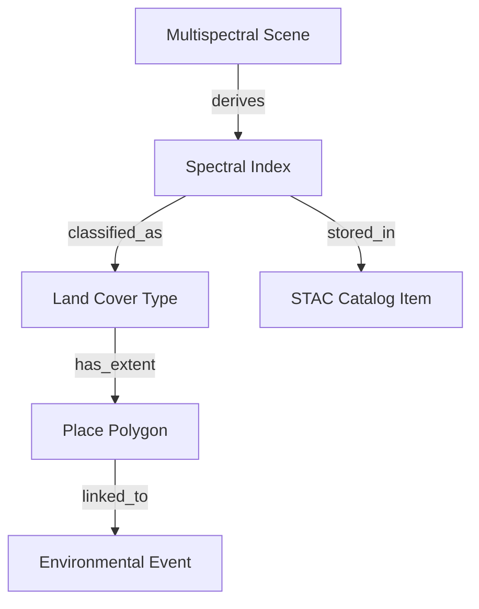

<div align="center">

# 🌈 **Kansas Frontier Matrix — Multispectral Analysis Overview**  
`docs/analyses/remote-sensing/multispectral/README.md`

**Purpose:**  
Provide an overview of KFM’s multispectral image analysis methods—covering spectral indices, band composites, and AI-based spectral classification pipelines that reveal Kansas’s land cover, vegetation, and surface processes through time.

[](../../../standards/markdown_rules.md)
[](../../../../LICENSE)
[]()
[]()
[]()

</div>

---

## 📚 Overview

The **Multispectral Analysis module** within the Kansas Frontier Matrix (KFM) performs quantitative analysis of reflectance data captured by multispectral sensors such as Landsat, Sentinel-2, and MODIS.  
It serves as the foundation for KFM’s environmental monitoring, vegetation mapping, and long-term change detection layers.

This analysis combines raw spectral bands into derived indices and composites, then stores results in reproducible, georeferenced formats. All outputs are indexed through KFM’s **STAC v1.0** catalog and semantically linked to the Neo4j knowledge graph under `(:Dataset:SpectralIndex)` nodes.

---

## 🛰️ Data Sources and Spectral Inputs

| Sensor / Mission | Spatial Resolution | Key Bands Used | Temporal Coverage | Source |
|------------------|--------------------|----------------|-------------------|--------|
| **Landsat 5–9 OLI/TM** | 30 m | Blue, Green, Red, NIR, SWIR1/2 | 1984–present | [USGS EarthExplorer](https://earthexplorer.usgs.gov/) |
| **Sentinel-2 MSI** | 10–20 m | 13 multispectral bands (visible–SWIR) | 2015–present | [Copernicus Open Hub](https://scihub.copernicus.eu/) |
| **MODIS Terra/Aqua** | 250–500 m | Bands 1–7 | 2000–present | [NASA LP DAAC](https://lpdaac.usgs.gov/) |
| **NAIP Orthophotos** | 1 m | RGB + NIR | 2003–present | [USDA Geospatial Data Gateway](https://gdg.sc.egov.usda.gov/) |

All imagery undergoes atmospheric correction, reprojection (EPSG:4326), and clipping to the Kansas spatial extent. STAC metadata documents instrument, acquisition date, processing level, and checksum integrity.

---

## ⚙️ Processing Workflow

### 1. Preprocessing
- **Atmospheric Correction:** LaSRC (Landsat) / Sen2Cor (Sentinel) applied to generate surface reflectance.  
- **Cloud Masking:** Fmask or QA60 bitmask filtering for cloud and shadow removal.  
- **Band Normalization:** Radiometric harmonization across sensors using pseudo-invariant features.  
- **Resampling:** All images rescaled to a common 30 m grid to allow pixel-level comparison.

### 2. Spectral Index Computation
Key spectral indices generated by the ETL pipeline include:

| Index | Formula | Description |
|--------|----------|-------------|
| **NDVI** | (NIR − Red) / (NIR + Red) | Vegetation greenness and biomass. |
| **NDWI** | (Green − NIR) / (Green + NIR) | Surface water detection and moisture mapping. |
| **NDBI** | (SWIR − NIR) / (SWIR + NIR) | Built-up area and urban growth mapping. |
| **SAVI** | ((NIR − Red) / (NIR + Red + L)) × (1 + L) | Vegetation index corrected for soil brightness. |
| **BAI** | 1 / ((0.1 − Red)² + (0.06 − NIR)²) | Burned area index for fire detection. |

Results are saved as GeoTIFF/COG files under `data/processed/remote-sensing/multispectral/indices/` and cross-registered in `data/stac/remote-sensing/multispectral.json`.

### 3. Composite Generation
- **True Color (RGB 4-3-2):** Visual rendering for interpretability.  
- **False Color (NIR 5-4-3):** Vegetation enhancement composites.  
- **SWIR-Enhanced (7-5-3):** Soil, burn scar, and urban mapping.  
- **Temporal Composites:** Annual max NDVI mosaics and seasonal median reflectance layers generated via Python + GDAL stack scripts.

### 4. Machine Learning Classification
A Random Forest classifier and a U-Net segmentation network are trained on labeled land cover samples (from NLCD + manual annotations).  
Output land cover maps are produced per epoch (1984–2025) and stored as COG rasters, feeding the KFM’s **change detection** module.

---

## 🧠 AI Integration and Graph Linking

The processed indices and composites generate **graph-linked features** in Neo4j:



These links enable Focus Mode to contextualize environmental shifts—e.g., showing that NDVI decline in western Kansas correlates with recorded drought events or land use changes.

---

## 🌍 Integration with KFM Ecosystem

- **ETL Pipeline:** Defined in `src/pipelines/etl/remote-sensing/multispectral_etl.py`, using GDAL, Rasterio, and Numpy for processing.  
- **AI/ML Models:** Configured via `src/pipelines/ai/models/landcover_classification.py`.  
- **Metadata:** Each spectral dataset described through STAC + DCAT JSON with provenance links and checksum validation.  
- **Focus Mode:** Enables spectral summaries for any region (e.g., average NDVI trend across a county from 1985–2025).  
- **Visualization:** Accessible in the web frontend under the **“Spectral Layers”** panel, which allows users to toggle between NDVI, NDWI, and composite imagery.

---

## 🧪 FAIR+CARE and Reproducibility Standards

- **FAIR Compliance:** All data assets have STAC-compliant metadata and SPDX license tags.  
- **CARE Principles:** Sensitive ecological zones (e.g., tribal lands, private conservation areas) masked or access-controlled.  
- **MCP Alignment:** Every ETL run is logged with SHA256 checksum, environment file, and algorithm version in `/reports/self-validation/multispectral-log.json`.  
- **Reproducibility:** Reprocessing can be triggered via:
  ```bash
  make etl-multispectral
  make validate-stac
  make docs-validate
  ```
- **Audit Trail:** Neo4j nodes contain `prov:wasGeneratedBy` relationships referencing pipeline commits and model versions.

---

## 📂 Directory Layout

```
docs/analyses/remote-sensing/multispectral/
├── README.md                     # This file
├── methods/                      # Detailed spectral index and AI model notes
├── results/                      # Analytical outputs, validation tables, charts
├── reports/                      # Spectral accuracy, classification metrics
└── governance.md                 # Data ethics, reproducibility, CARE compliance
```

---

## 🧾 Version History

| Version | Date | Author | Description | Commit |
|----------|------|---------|--------------|---------|
| v10.2.2 | 2025-11-12 | KFM FAIR+CARE Council | Initial release documenting multispectral analysis workflow and AI linkage. | `<latest-commit-hash>` |
| v10.0.0 | 2025-10-05 | KFM Core Dev Team | Migrated remote-sensing module to monorepo; added spectral index automation. | `<hash>` |

---

<p align="center"><b>End of File — docs/analyses/remote-sensing/multispectral/README.md</b></p>