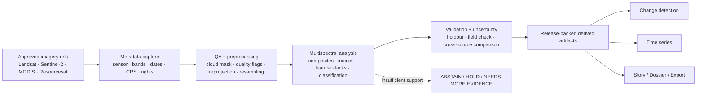

<!-- [KFM_META_BLOCK_V2]
doc_id: kfm://doc/<DOC_ID-NEEDS-VERIFICATION>
title: Kansas Frontier Matrix — Multispectral Analysis
type: standard
version: v1
status: draft
owners: <OWNERS-NEEDS-VERIFICATION>
created: <YYYY-MM-DD-NEEDS-VERIFICATION>
updated: <YYYY-MM-DD-NEEDS-VERIFICATION>
policy_label: <POLICY_LABEL-NEEDS-VERIFICATION>
related: [../../README.md, ../README.md, ../change-detection/, ../time-series/, ../validation/, ../../../contracts/, ../../../schemas/, ../../../policy/]
tags: [kfm, remote-sensing, multispectral, analysis]
notes: [path confirmed via live repo tree; owners, dates, policy label, and module-local internals need checkout verification]
[/KFM_META_BLOCK_V2] -->

# Kansas Frontier Matrix — Multispectral Analysis

Governed working index for optical multi-band remote-sensing analysis, derived products, and downstream reuse in KFM.

> **Status:** experimental — path and surrounding repo context are live-verified; module-local internals still need checkout confirmation  
> **Owners:** `<OWNERS-NEEDS-VERIFICATION>`  
>        
> **Quick jumps:** [Scope](#scope) · [Repo fit](#repo-fit) · [Inputs](#inputs) · [Exclusions](#exclusions) · [Directory tree](#directory-tree) · [Quickstart](#quickstart) · [Usage](#usage) · [Diagram](#diagram) · [Reference tables](#reference-tables) · [Task list](#task-list) · [FAQ](#faq) · [Appendix](#appendix)  
> **Evidence posture:** repo path and parent documentation pattern are **CONFIRMED**; module-local substructure, owners, and workflow hooks below are a mix of **INFERRED**, **PROPOSED**, and **NEEDS VERIFICATION**.

> [!IMPORTANT]
> The current live checkout confirmed the `docs/analyses/remote-sensing/` lane and its `multispectral/` directory, but this session did not expose the current contents of this folder. Treat any module-local tree, workflow, or registry described below as **INFERRED starter structure** unless and until it is checked against the mounted checkout.

## Scope

This module is the KFM working surface for multispectral remote-sensing analysis: optical or closely coupled multi-band imagery used to build composites, indices, masks, classifications, and feature stacks that can later feed change detection, time series work, dossiers, stories, and governed exports.

**CONFIRMED**

- `docs/analyses/` module READMEs are expected to carry purpose and scope, input links, output families, method and parameter summaries, validation and uncertainty, sensitivity and rights posture, provenance and release links, and downstream reuse rules.
- KFM treats derived analytical layers as subordinate to authoritative truth. This folder is therefore for interpretable, traceable analysis outputs, not sovereign truth.
- Multispectral work is only useful when the analysis keeps acquisition date, spectral meaning, quality handling, and classification assumptions visible.

**INFERRED**

- This folder should be the optical-band entry point for single-window composites, spectral indices, and multispectral classifications before adjacent modules consume those outputs.
- The most useful role of this README is not to duplicate textbook remote sensing, but to standardize what maintainers need to know to review, reuse, challenge, or republish a multispectral result.

## Repo fit

| Item | Value |
| --- | --- |
| Path | `docs/analyses/remote-sensing/multispectral/README.md` |
| Upstream | [`../../README.md`](../../README.md) · [`../README.md`](../README.md) |
| Adjacent analysis lanes | [`../change-detection/`](../change-detection/) · [`../time-series/`](../time-series/) · [`../validation/`](../validation/) |
| Cross-cutting surfaces | [`../../../contracts/`](../../../contracts/) · [`../../../schemas/`](../../../schemas/) · [`../../../policy/`](../../../policy/) |
| Primary job | Keep multispectral work reviewable, bounded, and reusable without letting derived imagery products quietly become canonical truth. |

### What belongs here

- Sensor-scoped multispectral analysis notes for collections such as Landsat, Sentinel-2, MODIS, Resourcesat, NAIP, or other documented optical multi-band sources.
- Band selections, composite recipes, QA masks, cloud or saturation handling, reprojection or resampling notes, and spectral feature engineering.
- Derived raster or feature outputs such as indices, class rasters, sampled feature tables, and per-feature summaries produced from multispectral imagery.
- Validation, uncertainty, and downstream handoff notes for later change, time, or publication surfaces.

### What this file should help a reviewer answer

1. What sensor or collection was used?
2. Which bands and quality flags mattered?
3. What preprocessing changed the signal?
4. What derived artifact was produced?
5. How was it checked, limited, and handed downstream?

## Inputs

| Accepted input | Why it belongs here | Minimum note to record |
| --- | --- | --- |
| Released or admissible imagery references | Keeps analysis tied to a known source and date window | Collection or asset ID, provider, acquisition window |
| Band selections and spectral meaning | Multispectral interpretation depends on the bands used | Band list, wavelength meaning, intended use |
| QA and masking rules | Cloud, haze, saturation, and no-data handling materially affect interpretation | QA band(s), mask logic, exclusion notes |
| Composite or mosaicking logic | Different compositing rules produce different analytical surfaces | Reducer, temporal window, tie-break rules |
| Spectral indices or feature stacks | Common multispectral outputs are derived band-math products | Formula, units, normalization, threshold notes |
| Classification or segmentation setup | Many multispectral workflows end in labels or masks | Training source, class schema, model or rule family |
| Validation material | KFM requires visible uncertainty, not polished confidence | Reference data, holdout logic, error summary |
| Downstream reuse links | Multispectral work is often an input to later modules | Consumer module, release linkage, caveats |

## Exclusions

| Excluded from this folder | Why excluded | Put it where instead |
| --- | --- | --- |
| Raw ingest packages, source descriptors, or canonical dataset-version artifacts | Those are truth-path and contract objects, not analysis notes | Source/data/contracts surfaces |
| SAR-only or LiDAR-only workflows | Different signal physics and quality rules apply | Dedicated modality-specific analysis surface |
| Hyperspectral-first workflows | This module is for multispectral practice, not broad-band hyperspectral exploitation | Separate hyperspectral lane if admitted |
| Long-horizon change products | Comparative change needs explicit chronology and comparison logic | [`../change-detection/`](../change-detection/) or [`../time-series/`](../time-series/) |
| Story, dossier, or export-ready public artifacts | Publication happens downstream of analysis | Story / dossier / export surfaces |
| Free-standing AI summaries without evidence links | KFM requires retrieve-cite-verify or abstain | Do not admit until evidence-linked and policy-checked |

> [!NOTE]
> Thermal, radar, or fused products may be referenced here when they are clearly subordinate inputs to a multispectral package, but this folder should not become a catch-all for every remote-sensing mode.

## Directory tree

### Confirmed parent context

```text
docs/analyses/remote-sensing/
├── README.md
├── change-detection/
├── multispectral/
├── time-series/
└── validation/
```

### INFERRED starter shape for this module

```text
docs/analyses/remote-sensing/multispectral/
├── README.md
├── methods/
├── datasets/
├── notebooks/
├── results/
└── validation/
```

Use the second tree as a reviewable starter shape only after checkout verification.

## Quickstart

1. Start from an imagery reference, not an orphan raster file.
2. Record sensor, bands, acquisition window, spatial resolution, CRS, and QA fields before interpretation.
3. Document preprocessing openly: masking, scaling, reprojection, resampling, compositing, clipping.
4. Name every derived artifact in a way that makes its method legible.
5. Attach validation, uncertainty, rights, and downstream reuse notes before treating the output as review-ready.

### Illustrative module record

```yaml
analysis_id: <ANALYSIS_ID-NEEDS-VERIFICATION>
scope:
  place: <PLACE>
  time_window: <START>/<END>
input_imagery:
  - sensor: Sentinel-2 MSI
    collection_or_asset: <COLLECTION-ID>
    bands: [B2, B3, B4, B8]
    qa_bands: [QA60]
    nominal_resolution_m: 10
preprocess:
  cloud_mask: <METHOD>
  reprojection: <CRS-OR-NATIVE>
  resampling: <METHOD>
  compositing: <MEDIAN|BEST_PIXEL|OTHER>
derived_outputs:
  - name: ndvi_composite
    type: raster
    formula: "(NIR - Red) / (NIR + Red)"
validation:
  approach: <HOLDOUT|FIELD_CHECK|CROSS_SOURCE>
  notes: <SHORT-SUMMARY>
rights_and_sensitivity:
  policy_posture: <PUBLIC|RESTRICTED|NEEDS-REVIEW>
downstream_links:
  - ../change-detection/
  - ../validation/
```

## Usage

### Common work types

| Work type | Typical inputs | Typical outputs | Typical downstream use |
| --- | --- | --- | --- |
| Band-aware visualization | Landsat, Sentinel-2, MODIS, Resourcesat, NAIP | True-color or false-color composites | Review, interpretation, story support |
| Spectral index generation | Red / NIR / SWIR / green combinations | NDVI-like or water / built-up / moisture indices | Thematic screening, feature engineering |
| Masking and pixel-quality control | QA bands, image metadata, cloud summaries | Cleaned imagery, validity masks, exclusion maps | Trustworthy composites and later statistics |
| Feature-stack preparation | Multiple bands plus indices | Multi-band raster stack or sampled features | Classification, regression, zonal summaries |
| Supervised or unsupervised classification | Training samples or clustering rules | Class rasters, polygons, summaries | Change detection, environmental quality, reporting |
| Per-feature sampling | Released vector features + multispectral raster | Joined tables or feature attributes | Dossiers, compare surfaces, export bundles |

### Working rules

- Prefer declared band meaning over aesthetic-looking imagery.
- Record image-level and per-pixel quality cues when available.
- Keep acquisition date visible; multispectral interpretation without time context is weak.
- Treat derived class labels as modeled outputs, not self-validating truth.
- Hand downstream modules enough context to rebuild or challenge the result.

## Diagram


```mermaid
flowchart LR
    A[Approved imagery refs<br/>Landsat · Sentinel-2 · MODIS · Resourcesat] --> B[Metadata capture<br/>sensor · bands · dates · CRS · rights]
    B --> C[QA + preprocessing<br/>cloud mask · quality flags · reprojection · resampling]
    C --> D[Multispectral analysis<br/>composites · indices · feature stacks · classification]
    D --> E[Validation + uncertainty<br/>holdout · field check · cross-source comparison]
    E --> F[Release-backed derived artifacts]
    F --> G[Change detection]
    F --> H[Time series]
    F --> I[Story / Dossier / Export]
    D -. insufficient support .-> X[ABSTAIN / HOLD / NEEDS MORE EVIDENCE]
```

## Reference tables

### Minimum recording contract for a multispectral package

| Record this | Why it matters |
| --- | --- |
| Sensor / collection / provider | Different sensors carry different band sets, revisit logic, and QA conventions |
| Acquisition date or temporal window | Remote-sensing interpretation is time-sensitive |
| Bands used and spectral meaning | The same composite can mean very different things depending on band choice |
| Nominal resolution and reprojection | Scale and resampling affect interpretation and comparability |
| QA, cloud, haze, saturation, and no-data handling | Clean-looking imagery can still be analytically unsafe |
| Composite / mosaic rule | Median, best-pixel, percentile, and single-scene outputs are not interchangeable |
| Index formulas or class schema | Derived outputs need explicit method identity |
| Validation method and uncertainty | KFM prefers cite-or-abstain over unsupported confidence |
| Rights / sensitivity posture | Some derived views may still require restriction or generalization |
| Downstream reuse targets | Keeps later change, time, and publication surfaces traceable |

### Boundary matrix

| Question | Keep it here? | Reason |
| --- | --- | --- |
| Single-window NDVI or band composite | Yes | Core multispectral analysis product |
| Cloud-mask method notes | Yes | Critical for interpretation |
| Training labels and classifier summary | Yes | Method identity belongs with the analysis |
| Year-over-year vegetation loss map | Usually no | Prefer change-detection or time-series |
| Published story chapter using the output | No | Publication surface, not analysis surface |
| Raw source admission packet | No | Truth-path onboarding object |
| SAR-only flood classification | No | Different modality and quality logic |

### Multispectral module vs adjacent remote-sensing lanes

| Lane | Best fit | Not its job |
| --- | --- | --- |
| `multispectral/` | Band-aware interpretation, indices, composites, classifications, feature stacks | Long-horizon comparative change or modality-general catch-all |
| `change-detection/` | Before/after or rolling change logic | Single-window multispectral authoring |
| `time-series/` | Temporal trajectories, monitoring, repeated observations | One-off derived surface without chronology |
| `validation/` | Accuracy, error, corroboration, and challenge records | Primary analysis narrative |

## Task list

### Definition of done

- [ ] Source imagery reference is explicit.
- [ ] Acquisition date or temporal window is explicit.
- [ ] Band list and spectral meaning are explicit.
- [ ] Resolution, CRS, reprojection, and resampling are explicit.
- [ ] QA and masking logic are explicit.
- [ ] Derived outputs have names, units, or class schema.
- [ ] Validation and uncertainty are explicit.
- [ ] Rights and sensitivity posture are explicit.
- [ ] Downstream reuse links are explicit.
- [ ] Any unresolved weaknesses are left visible, not polished away.

### Review gates for maintainers

- [ ] Does the package explain what the signal means, not just what the map looks like?
- [ ] Can a reviewer trace each derived surface back to source imagery and preprocessing?
- [ ] Would a downstream change or time-series module know how to reuse this safely?
- [ ] Are modeled labels presented as modeled labels?
- [ ] Would a public-facing surface be able to expose caveats without re-authoring the analysis?

## FAQ

### Does this folder hold raw imagery?

No. This folder is for analysis documentation and derived multispectral work, not raw source admission or canonical storage.

### Can this folder hold hyperspectral analysis?

Not as a default. Hyperspectral work should stay separate unless the repo intentionally widens this lane and updates the scope, methods, and review burden.

### Is NDVI enough as validation?

No. An index may be useful, but KFM review still expects visible method, uncertainty, and corroboration logic.

### Where should year-over-year or rolling monitoring outputs go?

Prefer [`../change-detection/`](../change-detection/) or [`../time-series/`](../time-series/) once the work becomes explicitly comparative or longitudinal.

### Are multispectral outputs authoritative truth?

No. They are derived analytical artifacts by default and must remain linked to their source imagery, method, and validation trail.

## Appendix

<details>
<summary><strong>Illustrative review questions for a multispectral package</strong></summary>

1. What physical signal is this analysis trying to make legible?
2. Which band choices make that interpretation plausible?
3. Which QA fields or masks could materially change the output?
4. What happens if the same method is applied at a different date window or resolution?
5. Is the output a screening layer, a decision-support layer, or a publication candidate?
6. What would cause this package to abstain, hold, or request more evidence?

</details>

<details>
<summary><strong>Illustrative output naming patterns</strong></summary>

- `<place>_<sensor>_<date-window>_falsecolor`
- `<place>_<sensor>_<date-window>_ndvi`
- `<place>_<sensor>_<date-window>_feature-stack`
- `<place>_<sensor>_<date-window>_landcover-v<version>`
- `<place>_<sensor>_<date-window>_qa-mask`

Use repo-verified naming conventions in preference to these placeholders once the checkout is inspected.

</details>

[Back to top](#kansas-frontier-matrix--multispectral-analysis)
