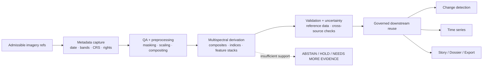

<!-- [KFM_META_BLOCK_V2]
doc_id: kfm://doc/<DOC_ID-NEEDS-VERIFICATION>
title: Kansas Frontier Matrix — Multispectral Analysis
type: standard
version: v1
status: draft
owners: <OWNERS-NEEDS-VERIFICATION>
created: <YYYY-MM-DD-NEEDS-VERIFICATION>
updated: <YYYY-MM-DD-NEEDS-VERIFICATION>
policy_label: <POLICY_LABEL-NEEDS-VERIFICATION>
related: [../../README.md, ../README.md, ../change-detection/, ../time-series/, ../validation/, ../../../contracts/, ../../../schemas/, ../../../policy/]
tags: [kfm, remote-sensing, multispectral, analysis]
notes: [Grounded in March 2026 KFM doctrine plus attached remote-sensing draft precedent; current session did not expose a mounted repo checkout, so owners, dates, policy label, exact sibling paths, and module-local internals remain needs-verification.]
[/KFM_META_BLOCK_V2] -->

# Kansas Frontier Matrix — Multispectral Analysis

Governed working index for optical multi-band remote-sensing analysis, derivative surfaces, and downstream reuse in KFM.

> **Status:** experimental  
> **Owners:** `<OWNERS-NEEDS-VERIFICATION>`  
>        
> **Quick jumps:** [Scope](#scope) · [Repo fit](#repo-fit) · [Inputs](#inputs) · [Exclusions](#exclusions) · [Directory tree](#directory-tree) · [Quickstart](#quickstart) · [Usage](#usage) · [Diagram](#diagram) · [Reference tables](#reference-tables) · [Task list](#task-list) · [FAQ](#faq) · [Appendix](#appendix)  
> **Statement labels used here:** **CONFIRMED** · **INFERRED** · **PROPOSED** · **UNKNOWN** · **NEEDS VERIFICATION**

> [!IMPORTANT]
> This README is grounded in the attached March 2026 KFM doctrinal corpus plus an attached historical remote-sensing draft that names this path and adjacent lanes. The current session did **not** expose a mounted repo checkout for this directory, so owners, dates, policy label, exact sibling files, and module-local subfolders remain **NEEDS VERIFICATION**.

## Scope

**CONFIRMED** KFM treats analytical derivatives as subordinate to authoritative truth. Multispectral outputs therefore belong here as inspectable, method-bound working products rather than as sovereign truth objects.

**CONFIRMED** Remote-sensing work is most useful when acquisition date, spectral meaning, radiometric or quality handling, and classification assumptions stay visible. Clean imagery alone is not an adequate analytical record.

**INFERRED** This lane is the optical-band entry point for:

- band-aware composites
- spectral indices
- QA masks and validity surfaces
- feature stacks for downstream comparison or modeling
- classification-ready or classification-derived products that remain visibly modeled

### What this lane is for

This folder should help a reviewer answer five practical questions quickly:

1. What source imagery or collection was used?
2. Which bands, masks, and preprocessing steps shaped the signal?
3. What derivative surface or table was produced?
4. How was it checked?
5. Where does it go next inside KFM?

> [!CAUTION]
> A visually persuasive composite is not a sufficient record. If the band choice, QA logic, date window, or modeled/not-modeled status is missing, the package is not review-ready.

## Repo fit

| Item | Value | Current evidence state |
| --- | --- | --- |
| Path | `docs/analyses/remote-sensing/multispectral/README.md` | **INFERRED** |
| Upstream | [`../../README.md`](../../README.md) · [`../README.md`](../README.md) | **INFERRED** |
| Adjacent lanes | [`../change-detection/`](../change-detection/) · [`../time-series/`](../time-series/) · [`../validation/`](../validation/) | **INFERRED** |
| Cross-cutting references | [`../../../contracts/`](../../../contracts/) · [`../../../schemas/`](../../../schemas/) · [`../../../policy/`](../../../policy/) | **INFERRED** |
| Doctrinal fit | Derived outputs stay governed, inspectable, and downstream of evidence, policy, and release state. | **CONFIRMED** |

### Upstream / downstream relationship

- **Upstream:** imagery references, metadata, masks, and source admission records should originate outside this lane.
- **This lane:** documents single-window multispectral interpretation and derivative production.
- **Downstream:** comparison, monitoring, validation, dossier, story, and export surfaces consume outputs from here only when caveats remain attached.

## Inputs

| Accepted input | Why it belongs here | Minimum record to keep |
| --- | --- | --- |
| Documented multispectral imagery references | Keeps analysis tied to source and date | collection or asset ID, provider, acquisition date or window |
| Band selections and spectral meaning | Interpretation depends on what each band represents | band list, role, intended analytical use |
| Quality and masking rules | Cloud, haze, saturation, and no-data handling can change conclusions | QA fields, mask logic, exclusion notes |
| Composite or mosaicking logic | Different reducers produce materially different surfaces | reducer, temporal window, tie-break rules |
| Derived band math | Common multispectral products are explicit transformations | formula, scaling, thresholds, normalization notes |
| Feature stacks or sampled tables | Many downstream tasks consume structured rather than raw raster outputs | fields included, sampling grain, join basis |
| Validation material | KFM expects visible uncertainty and challengeability | reference data, sampling design, summary findings |
| Release and reuse links | Prevents orphan derivatives | downstream lane, release linkage, caveats |

## Exclusions

| Do **not** keep this here | Why not | Put it where instead |
| --- | --- | --- |
| Raw ingest packages or source-admission packets | Those are truth-path onboarding artifacts, not analysis notes | source / contract / ingest surfaces |
| Long-horizon change products | Comparative logic deserves its own chronology and thresholds | [`../change-detection/`](../change-detection/) or [`../time-series/`](../time-series/) |
| Publication-ready story or export assets | Publication is downstream of analysis and review | story / dossier / export surfaces |
| Free-floating AI summaries with no evidence linkage | KFM does not admit uncited interpretation as authority | do not publish until evidence-linked and policy-checked |
| Hyperspectral-first, SAR-first, or LiDAR-first workflows | Different signal physics and review burdens apply | dedicated lane if admitted |
| Modeled labels presented as settled fact | Classification outputs remain modeled unless specifically promoted | keep modeled status visible or route to validation |

> [!NOTE]
> Thermal or fused inputs may appear in a multispectral package when they are clearly subordinate to the analysis, but they should not silently widen this lane into a catch-all remote-sensing bucket.

## Directory tree

### Attached-draft lane context

```text
docs/analyses/remote-sensing/
├── README.md
├── change-detection/
├── multispectral/
├── time-series/
└── validation/
```

### Current minimum safe assumption for this directory

```text
docs/analyses/remote-sensing/multispectral/
└── README.md
```

Additional module-local subfolders such as `methods/`, `results/`, `reports/`, or `governance.md` appeared in attached remote-sensing draft material for sibling lanes, but they are **NEEDS VERIFICATION** for this specific directory before being stated as current repo fact.

## Quickstart

1. Start from a documented imagery reference, not an orphan raster.
2. Record the acquisition window, CRS, nominal resolution, bands, and QA fields before interpretation.
3. Declare preprocessing openly: scaling, masking, clipping, reprojection, resampling, and compositing.
4. Name each derivative so its method is legible.
5. Link validation, uncertainty, and downstream reuse before treating the package as review-ready.

### Illustrative package stub

```yaml
analysis_id: <ANALYSIS_ID-NEEDS-VERIFICATION>
place: <PLACE_OR_AOI>
time_window: <START>/<END>

source_imagery:
  - collection_or_asset: <SOURCE_ID>
    provider: <PROVIDER>
    sensor: <SENSOR_NAME>
    bands: [<BAND_1>, <BAND_2>, <BAND_3>]
    qa_fields: [<QA_FIELD_1>]
    nominal_resolution_m: <RESOLUTION>

preprocess:
  scaling: <SCALE_OR_NONE>
  masking: <MASK_LOGIC>
  reprojection: <CRS_OR_NATIVE>
  resampling: <METHOD>
  compositing: <NONE|MEDIAN|BEST_PIXEL|OTHER>

derived_outputs:
  - name: <OUTPUT_NAME>
    type: <RASTER|TABLE|FEATURE_STACK>
    method: <INDEX|COMPOSITE|CLASSIFICATION|SAMPLING>
    notes: <SHORT_METHOD_NOTE>

validation:
  approach: <REFERENCE_DATA|HOLDOUT|FIELD_CHECK|CROSS_SOURCE>
  summary: <SHORT_SUMMARY>

downstream_links:
  - ../change-detection/
  - ../time-series/
  - ../validation/
```

> [!TIP]
> Keep examples here illustrative unless the repo checkout confirms specific sensors, naming templates, or contract fields.

## Usage

### Common work types

| Work type | Typical inputs | Typical outputs | Usual downstream use |
| --- | --- | --- | --- |
| Band-aware visualization | multi-band optical imagery | true-color or false-color composites | inspection, review, story support |
| Spectral index generation | selected visible / NIR / SWIR bands | vegetation, water, built-up, or moisture indices | screening, thematic context, feature engineering |
| QA and validity masking | QA bands, metadata, scene masks | cleaned composites, exclusion masks | safer statistics and later comparison |
| Feature-stack preparation | bands plus derived indices | sampled tables or stack rasters | classification, regression, zonal summaries |
| Modeled classification | training labels or rule sets plus multispectral inputs | class rasters, class summaries, labeled features | comparison, validation, reporting |
| Per-feature sampling | released vector features plus raster inputs | joined attributes or zonal summaries | dossiers, compare views, exports |

### Working rules

- Prefer spectral meaning over aesthetic appearance.
- Keep time explicit; single-date imagery without date context is weak evidence.
- Record the cost of preprocessing choices such as reprojection, resampling, and cloud removal.
- Treat class outputs as modeled outputs unless validation and release state justify stronger language.
- Route publication-ready claims through release-linked provenance, not ad hoc screenshots or orphan files.
- Mark rights, sensitivity, or geoprivacy constraints visibly when ecological, cultural, or site-level exposure could matter.

## Diagram


```mermaid
flowchart LR
    A[Admissible imagery refs] --> B[Metadata capture<br/>date · bands · CRS · rights]
    B --> C[QA + preprocessing<br/>masking · scaling · compositing]
    C --> D[Multispectral derivation<br/>composites · indices · feature stacks]
    D --> E[Validation + uncertainty<br/>reference data · cross-source checks]
    E --> F[Governed downstream reuse]
    F --> G[Change detection]
    F --> H[Time series]
    F --> I[Story / Dossier / Export]
    D -. insufficient support .-> X[ABSTAIN / HOLD / NEEDS MORE EVIDENCE]
```

## Reference tables

### Minimum recording contract

| Record this | Why it matters |
| --- | --- |
| Source collection / asset / provider | Preserves traceability to admissible evidence |
| Acquisition date or time window | Remote sensing is time-sensitive |
| Bands used and spectral meaning | Interpretation depends on the signal, not just the picture |
| Resolution and CRS | Scale and reprojection affect comparability |
| QA / cloud / no-data handling | Clean-looking imagery can still be analytically unsafe |
| Composite rule | Median, best-pixel, percentile, and single-scene outputs are not interchangeable |
| Index formula or class schema | Derivative products need explicit method identity |
| Validation method and uncertainty | KFM prefers inspectable limits over polished confidence |
| Rights / sensitivity posture | Some layers require masking, restriction, or generalization |
| Downstream handoff | Prevents later modules from guessing method context |

### Handoff matrix

| Handoff target | What this lane should pass forward |
| --- | --- |
| `change-detection/` | baseline imagery window(s), preprocessing notes, index definitions, thresholds used |
| `time-series/` | per-date derivation logic, cadence, aggregation rules, missing-data notes |
| `validation/` | truth data sources, sample design, error summaries, unresolved caveats |
| story / dossier / export surfaces | release-safe renderings, legend logic, public-facing caveats, freshness basis |

### Boundary checks

| Question | Keep it here? | Reason |
| --- | --- | --- |
| Single-window NDVI or false-color composite | Yes | Core multispectral derivative |
| Cloud-mask and saturation notes | Yes | Critical to interpretation |
| Confusion matrix for a multispectral classifier | Yes, with validation linkage | Method quality belongs with the analysis |
| Year-over-year vegetation loss map | Usually no | Prefer explicit comparative lanes |
| Public narrative chapter based on the output | No | Publication surface, not analysis lane |
| Raw source admission packet | No | Truth-path onboarding artifact |

## Task list

### Definition of done

- [ ] Source imagery is explicit.
- [ ] Acquisition date or time window is explicit.
- [ ] Bands and spectral meaning are explicit.
- [ ] CRS, resolution, and any reprojection or resampling are explicit.
- [ ] QA and masking logic are explicit.
- [ ] Derived outputs have clear method identity.
- [ ] Validation and uncertainty are visible.
- [ ] Rights and sensitivity posture are visible.
- [ ] Downstream reuse links are explicit.
- [ ] Unresolved weaknesses remain visible instead of being polished away.

### Review gates

- [ ] Can a reviewer reconstruct the derivative from source imagery and preprocessing notes?
- [ ] Does the package explain what the signal means, not just what the map looks like?
- [ ] Are modeled outputs labeled modeled?
- [ ] Would an adjacent lane know how to reuse this safely?
- [ ] Are release, policy, or sensitivity constraints visible enough for public-surface review?

## FAQ

### Does this folder hold raw imagery?

No. This lane is for multispectral analysis documentation and derivative products, not raw source admission or canonical storage.

### Are all classification products acceptable here?

Only when they stay visibly modeled and method-bound. A class raster without method, validation, or caveats is not review-ready.

### Where should longitudinal monitoring outputs go?

Prefer [`../change-detection/`](../change-detection/) or [`../time-series/`](../time-series/) once the work becomes explicitly comparative or longitudinal.

### Is a visually strong composite enough for publication?

No. Date, band meaning, QA logic, and validation context still matter.

### Are multispectral outputs authoritative truth?

Not by default. They are derivative analytical products unless a later governed promotion says otherwise.

## Appendix

<details>
<summary><strong>Illustrative review questions</strong></summary>

1. What physical signal is this package trying to make legible?
2. Which bands or derived indices make that interpretation plausible?
3. Which QA or masking choices could change the outcome materially?
4. What would change if the same method were rerun at another date window or resolution?
5. Is this a screening layer, a decision-support layer, or a publication candidate?
6. What would cause this package to hold, abstain, or request more evidence?

</details>

<details>
<summary><strong>Illustrative output naming patterns</strong></summary>

- `<place>_<sensor>_<date-window>_truecolor`
- `<place>_<sensor>_<date-window>_falsecolor`
- `<place>_<sensor>_<date-window>_<index-name>`
- `<place>_<sensor>_<date-window>_feature-stack`
- `<place>_<sensor>_<date-window>_<class-schema>-v<version>`
- `<place>_<sensor>_<date-window>_qa-mask`

Use repo-verified naming rules in preference to these placeholders once the mounted checkout is inspected.

</details>

<details>
<summary><strong>Illustrative derivative families</strong></summary>

| Family | Examples | Notes |
| --- | --- | --- |
| Composites | true-color, false-color, band ratios | Keep band order explicit |
| Indices | vegetation, water, moisture, built-up | Record formula and thresholds |
| Masks | cloud, shadow, saturation, validity | Record exclusion cost, not just logic |
| Feature stacks | bands + indices + terrain or contextual covariates | Keep provenance of non-multispectral additions explicit |
| Model-backed outputs | classifications, probability rasters, sampled predictions | Keep modeled status visible |

</details>

[Back to top](#kansas-frontier-matrix--multispectral-analysis)
