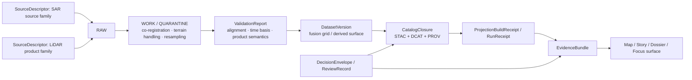

<!-- [KFM_META_BLOCK_V2]
doc_id: kfm://doc/NEEDS-VERIFICATION
title: SAR and LiDAR Fusion Methods
type: standard
version: v1
status: draft
owners: NEEDS VERIFICATION
created: YYYY-MM-DD
updated: YYYY-MM-DD
policy_label: public
related: [../README.md, ./datasets/, ./methods/, ./results/, ./validation/]
tags: [kfm, remote-sensing, sar, lidar, fusion]
notes: [Built from PDF-visible project evidence only; owners, dates, and mounted path inventory need repo verification.]
[/KFM_META_BLOCK_V2] -->

# SAR and LiDAR Fusion Methods

Weather-independent fusion guidance for combining radar and elevation evidence in KFM’s Kansas-first remote-sensing lane.

> [!NOTE]
> **Status:** experimental  
> **Owners:** NEEDS VERIFICATION  
>     
> **Quick jumps:** [Scope](#scope) · [Repo fit](#repo-fit) · [Accepted inputs](#accepted-inputs) · [Exclusions](#exclusions) · [Current verified snapshot](#current-verified-snapshot) · [Quickstart](#quickstart) · [Fusion model](#fusion-model) · [Diagram](#diagram) · [Artifacts & proof objects](#artifacts--proof-objects) · [Task list](#task-list--definition-of-done) · [FAQ](#faq)  
> **Repo fit:** `docs/analyses/remote-sensing/sar-lidar-fusion/README.md` → upstream: [`../README.md`](../README.md) · lane-local structure referenced in prior project docs: [`./datasets/`](./datasets/), [`./methods/`](./methods/), [`./results/`](./results/), [`./validation/`](./validation/)

> [!IMPORTANT]
> This README owns the **SAR/LiDAR fusion lane**, not the entire remote-sensing subtree. Keep it centered on fusion-specific sources, transforms, validation logic, proof objects, and routing into KFM trust surfaces.

> [!WARNING]
> Current-session verification for this task was **PDF-only**. No mounted repository tree, workflow YAML, tests, deployment manifests, dashboards, or runtime traces were directly inspected. Treat implementation-shaped details here as **CONFIRMED** only where the attached corpus names them directly; otherwise keep them **INFERRED**, **PROPOSED**, **UNKNOWN**, or **NEEDS VERIFICATION**.

## Scope

This lane exists to document how **Synthetic Aperture Radar (SAR)** and **LiDAR** are combined for Kansas-first analysis where neither modality is sufficient on its own. The strongest previously documented use cases in project materials are hydrology, archaeology, and land-use change interpretation.

Within KFM, this README should do four jobs well:

1. keep the lane’s purpose and routing legible
2. preserve the previously documented fusion backbone without pretending the repo implementation was re-verified
3. connect fusion work to KFM’s governed truth path and evidence objects
4. make uncertainty visible whenever the current session did not surface mounted files, tests, or runtime proof

## Repo fit

| Path | Role in this lane | Evidence posture |
| --- | --- | --- |
| `docs/analyses/remote-sensing/README.md` | parent remote-sensing index and lane router | **CONFIRMED** in project documentation |
| `docs/analyses/remote-sensing/sar-lidar-fusion/README.md` | this lane README | **CONFIRMED** as the documented target path |
| `docs/analyses/remote-sensing/sar-lidar-fusion/datasets/` | source catalogs, source notes, metadata stubs | **INFERRED** from prior lane documentation |
| `docs/analyses/remote-sensing/sar-lidar-fusion/methods/` | preprocessing, alignment, and fusion recipes | **INFERRED** from prior lane documentation |
| `docs/analyses/remote-sensing/sar-lidar-fusion/results/` | derived rasters, summaries, and interpretation notes | **INFERRED** from prior lane documentation |
| `docs/analyses/remote-sensing/sar-lidar-fusion/validation/` | corroboration, QA, and cross-check material | **INFERRED** from prior lane documentation |

KFM doctrine also makes this lane subordinate to broader system rules: the governed truth path, the trust membrane, evidence-linked publication, and a 2D-first shell where 3D is conditional rather than default spectacle.

## Accepted inputs

This directory is the right place for material that is primarily about **fusioning radar and elevation evidence**, especially when it needs to stay close to KFM’s evidence posture.

Accepted here:

- lane-specific source catalogs for SAR scenes and LiDAR products
- preprocessing notes for orbit correction, terrain correction or flattening, co-registration, resampling, and derived relief variables
- fusion recipes that explicitly combine SAR variables with LiDAR-derived structure
- validation notes tied to hydrology, field checks, archival corroboration, or other independent support
- result notes for fusion outputs that may later feed map, story, dossier, or Focus surfaces
- rights and sensitivity notes when fusion outputs could expose archaeological, ecological, or exact-location risk
- lane-local proof-object expectations such as `SourceDescriptor`, `IngestReceipt`, `ValidationReport`, `DatasetVersion`, `CatalogClosure`, `ProjectionBuildReceipt`, `EvidenceBundle`, and `RunReceipt`

## Exclusions

Do **not** place the following here:

- multispectral-only workflows such as NDVI, NDWI, or NBR extraction → route to the sibling multispectral lane
- generic time-series monitoring that is not specifically about SAR/LiDAR fusion → route to the time-series lane
- broad change-detection doctrine that does not depend on the SAR/LiDAR pairing → route to the change-detection lane
- generic validation policy for the whole remote-sensing subtree → route to the validation lane or higher governance docs
- unsupported claims that live ETL jobs, CI checks, APIs, or UI panels exist when the current session did not verify them
- sensitive exact-location interpretations that outrun rights review, steward review, or publication safety
- copied source dumps or long generic remote-sensing tutorials that are not specific to this lane

## Status vocabulary used in this file

| Label | Meaning here |
| --- | --- |
| **CONFIRMED** | Directly supported by the visible project corpus in this session |
| **INFERRED** | Strong structural completion from project evidence, but not directly re-verified in mounted repo files |
| **PROPOSED** | Recommended next shape for this lane |
| **UNKNOWN** | Not resolved strongly enough from current evidence |
| **NEEDS VERIFICATION** | Review flag for repo inventory, ownership, implementation, or runtime behavior |

## Current verified snapshot

The directly supportable snapshot for this lane is narrow but useful:

| Item | Verified state | Notes |
| --- | --- | --- |
| Exact README path | **CONFIRMED** | Prior project documentation explicitly names `docs/analyses/remote-sensing/sar-lidar-fusion/README.md` |
| Lane purpose | **CONFIRMED** | Previously documented as SAR + LiDAR fusion for hydrology, archaeology, and land-use change detection in Kansas |
| Previously documented source pair | **CONFIRMED** | Prior lane text names `Sentinel-1 GRD (VV/VH)` and `USGS LiDAR DEMs` as the example ingest pair |
| Lane-local subdirectories | **INFERRED** | `datasets/`, `methods/`, `results/`, and `validation/` appear in prior lane docs but were not re-verified in a mounted repo tree |
| Parent remote-sensing siblings | **INFERRED** | Prior project docs reference `multispectral/`, `time-series/`, `change-detection/`, and `validation/` as sibling lanes |
| Actual repo tree, workflows, tests, manifests, runtime traces | **UNKNOWN** | Current session did not surface mounted repo evidence |

## Previously documented lane backbone

The strongest earlier version of this README already described a lane-specific processing backbone. This revision keeps that backbone, but relocates it inside current KFM doctrine and makes the verification limits explicit.

| Stage | Previously documented lane expectation | Current handling in this README |
| --- | --- | --- |
| Ingest | `Sentinel-1 GRD (VV/VH)` + `USGS LiDAR DEMs` | preserved as the documented baseline, not asserted as a currently mounted connector pair |
| Preprocess | orbit correction, terrain flattening, DEM smoothing | preserved as lane-defining transform categories |
| Fusion | stack elevation, slope, `VV/VH`, and coherence-like variables | preserved as the lane’s core feature-combination idea |
| Detection | rule-based plus ML classification | kept as a possible downstream step, not claimed as a verified implementation |
| Visualization | interactive layer delivery | revised to fit KFM’s trust-visible, 2D-first shell and conditional 3D rule |

## Directory tree

```text
docs/
└── analyses/
    └── remote-sensing/
        ├── README.md                              # CONFIRMED in prior project docs
        └── sar-lidar-fusion/
            ├── README.md                          # this file
            ├── datasets/                          # INFERRED; NEEDS VERIFICATION in mounted repo
            ├── methods/                           # INFERRED; NEEDS VERIFICATION in mounted repo
            ├── results/                           # INFERRED; NEEDS VERIFICATION in mounted repo
            └── validation/                        # INFERRED; NEEDS VERIFICATION in mounted repo
```

## Quickstart

Use this when adding or revising lane material without overclaiming runtime maturity.

1. Declare the analysis question first.
   - What is the geographic scope?
   - What is the time basis?
   - Why is the SAR/LiDAR pairing necessary?

2. Name the source pair explicitly.
   - SAR source family
   - LiDAR product family
   - time support and acquisition alignment
   - rights or reuse posture

3. Record the transform chain.
   - terrain correction / flattening
   - co-registration assumptions
   - resampling or grid alignment
   - derived layers such as slope, relief, wetness proxy, or coherence proxy

4. State the output class.
   - exploratory screening
   - review-bearing candidate
   - publish candidate
   - internal-only or steward-only

5. Attach or point toward proof objects.
   - source descriptors
   - validation notes
   - dataset/version references
   - catalog closure and evidence route where available

Illustrative lane stub:

```yaml
lane: sar-lidar-fusion
area_of_interest: <watershed | county | corridor | site cluster>
time_scope: <single-date | seasonal | multi-epoch>
source_pair:
  sar:
    family: <scene family>
    support: NEEDS VERIFICATION
  lidar:
    family: <dem | point cloud | derived surface>
    support: NEEDS VERIFICATION
intended_outputs:
  - relief / slope / drainage context
  - wetness or moisture-response screening
  - anomaly candidate layer
verification:
  - hydrology cross-check
  - field or archive corroboration
  - rights / sensitivity review when exact locations matter
```

## Fusion model

### LiDAR: structure, relief, and product-class discipline

LiDAR is the structural side of this lane. In previously documented lane material it is framed as the source of topographic form: terrain relief, ditches, ridgelines, canopy-height context, and subtle anthropogenic traces.

For KFM use, that structural role needs one extra discipline statement: do not flatten all LiDAR-derived products into one thing. A bare-earth DEM, a top-of-surface model, and a point-cloud-derived classification do different jobs and carry different interpretive risks.

### SAR: moisture, roughness, and time-robust observation

SAR is the weather-independent side of this lane. In previously documented lane material it is framed as the source of moisture, roughness, flooding, erosion, and repeat-observation behavior under cloud-prone conditions.

That makes SAR particularly useful when the question is not just *what the surface is shaped like*, but *how it is responding* under wetness, saturation, seasonality, or disturbance.

### Fusion: behavior over structure

Fusion is where the lane becomes more than two inputs side by side. The point is to read behavior against structure:

- where water is likely to move, hold, or reappear
- where surface response departs from expected relief
- where subtle terrain signatures align with moisture or roughness anomalies
- where archaeological or land-use hypotheses need screening before stronger claims are made

### Why this lane matters in KFM

KFM’s broader doctrine favors **hydrology as the first real thin slice** because it is public-safe, place-rich, time-rich, and operationally legible. This lane should therefore prefer fusion outputs that strengthen hydrology and environmental interpretation before it widens into more sensitive exact-location interpretations.

## Diagram



> [!TIP]
> In KFM, the fusion product is not sovereign truth. It is a governed derived surface that stays accountable to release scope, policy posture, and evidence drill-through.

## Artifacts & proof objects

| Object family | Why it matters in this lane | Minimum expectation |
| --- | --- | --- |
| `SourceDescriptor` | declares the SAR or LiDAR intake contract | source identity, access mode, rights posture, cadence or acquisition basis, validation plan |
| `IngestReceipt` | proves a fetch and landing event occurred | source reference, fetch time, integrity checks, result pointers |
| `ValidationReport` | records alignment, semantic, and quality checks | check list, severity, reason codes, subject refs |
| `DatasetVersion` | carries the governed fusion candidate or promoted subject | stable ID, version ID, support semantics, time semantics, provenance refs |
| `CatalogClosure` | closes outward metadata and release linkage | STAC / DCAT / PROV refs, identifiers, coverage statement, release linkage |
| `ProjectionBuildReceipt` | proves a derived portrayal or delivery surface was built from a known release | release ref, surface class, build time, freshness basis |
| `EvidenceBundle` | gives any downstream claim a drill-through path | subject refs, dataset/version refs, lineage summary, rights/sensitivity state, audit linkage |
| `RunReceipt` | makes consequential automation legible when present | run ID, `spec_hash`, inputs, outputs, actor, timestamps, attestation refs |

## Usage

### Add or revise a methods note

Use `./methods/` for narrow method pages that answer:

- which SAR and LiDAR sources are being combined
- how they are aligned in space and time
- what derived layers are computed
- which parts are measured, transformed, classified, or inferred
- what product-class caveats apply

A good methods page should make it easy to distinguish:
- raw observation
- derived surface
- classification or anomaly candidate
- review-bearing interpretation

### Add or revise a result note

Use `./results/` for a result page only when the output can be described clearly and bounded by scope.

Suggested shape:

```md
## <result title>

- Scope: <AOI> / <time basis>
- Source pair: <SAR family> + <LiDAR family>
- Transform chain: <key preprocessing and derivation>
- Output class: <exploratory | review-bearing | publish candidate>
- Evidence route: <DatasetVersion / CatalogClosure / EvidenceBundle refs if available>

### Local notes
- CONFIRMED:
- INFERRED:
- PROPOSED:
- NEEDS VERIFICATION:
```

### Add or revise a validation note

Use `./validation/` when the lane needs corroboration against:

- hydrology layers or watershed behavior
- field observations
- archival or historical landscape evidence
- independent remote-sensing sources
- product-semantics checks such as DEM vs DSM vs point-cloud class

Validation notes should record failures, partial coverage, and conflict handling—not just passes.

### Update this README

Update this file when any of the following changes:

- the lane-local directory inventory is re-verified in the mounted repo
- a stable source pair becomes directly evidenced in code or schema
- proof objects for this lane become real files rather than doctrine-only expectations
- adjacent remote-sensing lane routing changes
- a publish-safe thin slice is surfaced and should replace current placeholders

## Task list / definition of done

- [ ] Meta block placeholders are replaced or consciously retained with review notes
- [ ] Status, owners, badges, quick jumps, and repo fit remain present at the top
- [ ] The lane purpose stays fusion-specific and does not collapse into generic remote-sensing prose
- [ ] Accepted inputs and exclusions are explicit
- [ ] Current verified snapshot reflects only what the session actually surfaced
- [ ] Directory tree is updated against the mounted repo before commit
- [ ] The previously documented SAR/LiDAR workflow backbone is preserved without overclaiming implementation
- [ ] At least one meaningful Mermaid diagram remains in the file
- [ ] Proof-object expectations are routed through KFM contract language
- [ ] Sensitive exact-location outputs are clearly flagged for review or generalization
- [ ] No claims about live ETL, CI, API, or UI behavior survive unless directly re-verified

[Back to top](#sar-and-lidar-fusion-methods)

## FAQ

### Why is this lane separate from multispectral analysis?

Because the analytical burden is different. Multispectral work is usually spectral-index or classification heavy; this lane is about combining radar behavior with elevation structure and keeping that fusion interpretable.

### Why does this README mention hydrology so often?

Because current KFM doctrine repeatedly treats hydrology as the preferred first governed thin slice. That makes hydrology the safest and clearest place to prove SAR/LiDAR fusion under real evidence constraints.

### Does this README prove a live fusion pipeline already exists?

No. It preserves previously documented lane intent and aligns it to current doctrine, but current-session verification did not surface a mounted repo tree, workflow inventory, or runtime proof for this lane.

### Should this lane assume 3D delivery?

No. KFM’s current doctrine is 2D-first and evidence-first. 3D belongs here only when it carries a real interpretive burden that 2D cannot meet and when it does not weaken evidence drill-through or trust visibility.

### What counts as a fusion output?

A fusion output is any derived product that depends on both modalities in a meaningful way, such as relief-aware wetness screening, drainage anomaly context, or a candidate surface for further review. Simply displaying SAR and LiDAR side by side is not enough.

<details>
<summary>Appendix — open verification backlog for this lane</summary>

### Mounted repo verification still needed

- exact lane directory inventory
- actual sibling lane file paths
- owners and maintenance responsibility
- any workflow YAML or CI gates for this lane
- any real `SourceDescriptor`, `IngestReceipt`, `ValidationReport`, `DatasetVersion`, or `EvidenceBundle` examples
- actual viewer or API integration surfaces
- actual rights/sensitivity handling for archaeology and exact-location outputs

### Terms worth keeping stable

| Term | Preferred use in this lane | Caution |
| --- | --- | --- |
| **SAR** | radar observation carrying moisture / roughness / repeat-observation value | do not flatten all backscatter behavior into one causal claim |
| **LiDAR** | structural observation family including point clouds and elevation products | distinguish DEM, DSM, DTM, and point-cloud classifications |
| **fusion** | derived interpretation using both modalities | remains derived and rebuildable unless explicitly promoted |
| **EvidenceBundle** | trust object for downstream explanation | not a pasted URL list |
| **RunReceipt** | consequential run trace when automation is involved | do not imply it exists unless surfaced |
| **ProjectionBuildReceipt** | proof that a derived delivery surface came from a known release | useful when map/tile outputs are built from release-scoped assets |

### Safe editorial rule

When this file is revised again, prefer **stronger routing and proof-object clarity** over new claims about implementation maturity.

</details>

[Back to top](#sar-and-lidar-fusion-methods)
