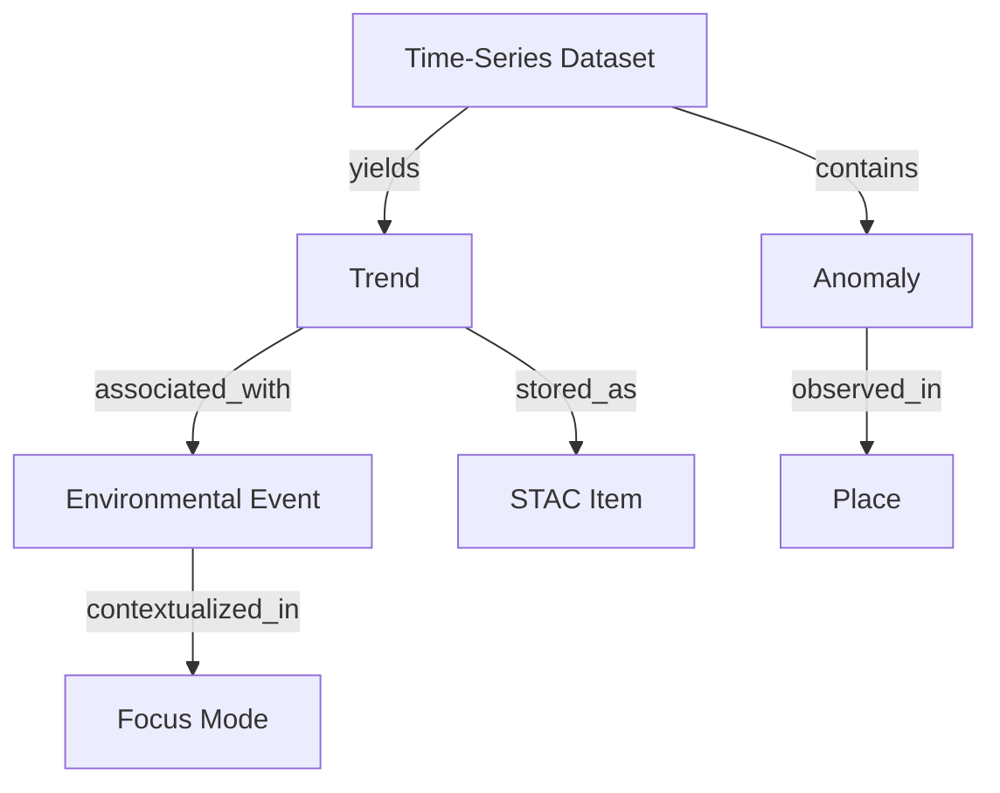

<div align="center">

# 📈 **Kansas Frontier Matrix — Remote Sensing Time-Series Analysis**  
`docs/analyses/remote-sensing/time-series/README.md`

**Purpose:**  
Describe the analytical framework, algorithms, and workflows used in the Kansas Frontier Matrix (KFM) for temporal modeling and trend analysis of satellite-derived environmental indices, enabling historical and predictive understanding of Kansas’s land surface dynamics.

[](../../../standards/markdown_rules.md)
[](../../../../LICENSE)
[]()
[]()
[]()

</div>

---

## 📚 Overview

The **Time-Series Analysis** module within KFM explores environmental change through continuous satellite observations spanning four decades (1984–present).  
By analyzing reflectance and vegetation indices (NDVI, NDWI, NBR, SAVI), this component uncovers **temporal trends, seasonal cycles, and anomalies** across Kansas’s landscapes.  
It integrates historical satellite imagery, multi-year spectral metrics, and modern AI-based forecasting to visualize both **past trends** and **future scenarios**.

This module provides the time dimension that powers:
- The **interactive timeline** in KFM’s map viewer.  
- The **Focus Mode** summaries of landscape evolution.  
- Predictive modeling for **forecasting environmental change (2030–2100)**.  

All datasets and outputs are registered via STAC v1.0 / DCAT 3.0 metadata and stored in FAIR-compliant directories under `data/processed/remote-sensing/time-series/`.

---

## 🛰️ Datasets and Sources

| Dataset | Temporal Range | Description | Source | Format |
|----------|----------------|-------------|---------|---------|
| **Landsat 5–9 OLI/TM** | 1984–present | 30 m surface reflectance data used for long-term NDVI and NDWI trends. | [USGS EROS](https://earthexplorer.usgs.gov/) | GeoTIFF / COG |
| **MODIS Terra/Aqua** | 2000–present | Daily and 16-day vegetation indices (NDVI, EVI, NBR). | [NASA LP DAAC](https://lpdaac.usgs.gov/) | HDF / NetCDF |
| **Sentinel-2 MSI** | 2015–present | 10–20 m imagery for short-term trend validation. | [Copernicus Hub](https://scihub.copernicus.eu/) | GeoTIFF |
| **NOAA Climate Data (NCEI)** | 1895–present | Drought, precipitation, and temperature anomalies for correlation with remote-sensing signals. | [NOAA NCEI](https://www.ncei.noaa.gov/) | CSV / API |
| **Kansas Mesonet** | 1980s–present | Soil moisture and surface temp records at high frequency for model validation. | [K-State Mesonet](https://mesonet.k-state.edu/) | CSV / API |

Each time series is clipped to Kansas’s boundary and harmonized temporally to a unified **annual time step** (for historical data) or **monthly time step** (for recent data).

---

## ⚙️ Workflow and Methods

### 1. Temporal Preprocessing
- **Data Harmonization:** Landsat, MODIS, and Sentinel-2 data normalized to reflectance scale and reprojected to EPSG:4326.  
- **Time Alignment:** All imagery resampled into consistent yearly composites (mean/max NDVI per pixel per year).  
- **Noise Filtering:** Use Whittaker smoother and Savitzky–Golay filters to remove cloud artifacts and short-term anomalies.  
- **Gap Filling:** Implemented using linear interpolation or model-based imputation (Kalman smoothing for NDVI gaps).

### 2. Trend and Seasonality Detection
Applied techniques:
- **BFAST (Breaks for Additive Season and Trend):** Detects abrupt structural changes (e.g., drought impact years).  
- **CCDC (Continuous Change Detection & Classification):** Identifies long-term gradual trends in vegetation and urban expansion.  
- **Harmonic Regression:** Extracts seasonal amplitude and phase shift parameters.  
- **Sen’s Slope / Mann–Kendall Test:** Quantifies monotonic trends in indices.  

Outputs are rasterized trend coefficients and break-year maps, published as COGs and cataloged in STAC.

### 3. Predictive Forecasting
- **LSTM Neural Networks:** Sequence-to-sequence models forecast NDVI and NDWI trends 5–50 years ahead (2030–2100).  
- **ARIMA / Prophet Models:** Applied at pixel and regional scales to project vegetation and surface moisture under different climate scenarios.  
- **Uncertainty Quantification:** Confidence intervals stored as additional raster bands.  
- **Scenario Integration:** Future projections linked to climate model scenarios (CMIP6 SSP245, SSP585) via metadata crosswalk.

### 4. Anomaly Analysis
The system computes standardized anomalies for each year:
```math
Z = (X_t - μ) / σ
```
where `X_t` = NDVI at time `t`, `μ` = long-term mean, `σ` = standard deviation.  
Anomalies exceeding |Z| > 2 are flagged as major deviations and linked to events (e.g., Dust Bowl analogues, droughts, floods).

---

## 🧠 Graph and Focus Mode Integration

The Neo4j knowledge graph links each detected temporal feature as a distinct node:



These graph relationships allow Focus Mode to:
- Highlight key “break years” on the interactive timeline.  
- Correlate vegetation downturns with historical drought or fire records.  
- Display predictive layers for future decades alongside past patterns.

---

## 📊 Validation & Visualization

Validation workflow:
- Cross-compare NDVI trend results with USGS NLCD land cover change data.  
- Ground-truth NDWI anomalies against Mesonet soil moisture.  
- Evaluate prediction accuracy using RMSE and R² metrics over 2015–2024 holdout samples.  

Visualization outputs:
- **Trend Maps:** Continuous slope values rendered with diverging color scales (green = increasing vegetation, brown = decline).  
- **Anomaly Heatmaps:** Highlight drought and flood years spatially.  
- **Temporal Profiles:** Interactive charts (via D3.js) display NDVI trajectories for selected regions in the web UI.

---

## 🧪 FAIR+CARE Compliance and Reproducibility

- **FAIR:** All time-series rasters and models documented with STAC/DCAT metadata and DOIs.  
- **CARE:** Sensitive ecological or tribal areas masked or generalized.  
- **MCP Provenance:** Each model training run and ETL job recorded with environment YAML, commit hash, and data lineage in `/reports/self-validation/time-series/`.  
- **Reproducibility:** Executed via:
  ```bash
  make etl-time-series
  make validate-stac
  make docs-validate
  ```
- **Audit:** Daily logs automatically pushed to `data/work/tmp/logs/remote-sensing/`.

---

## 📂 Directory Layout

```
docs/analyses/remote-sensing/time-series/
├── README.md                   # This file
├── methods/                    # Time-series algorithms, regression, ML notebooks
├── results/                    # Trend maps, anomaly rasters, temporal graphs
├── reports/                    # Validation metrics and model performance summaries
└── governance.md               # Ethical, FAIR+CARE, and reproducibility documentation
```

---

## 🧾 Version History

| Version | Date | Author | Description | Commit |
|----------|------|---------|--------------|---------|
| v10.2.2 | 2025-11-12 | KFM FAIR+CARE Council | Initial release covering full time-series analysis workflow and predictive forecasting integration. | `<latest-commit-hash>` |
| v10.0.0 | 2025-10-05 | KFM Core Dev Team | Added LSTM model integration and Focus Mode temporal linking. | `<hash>` |

---

<p align="center"><b>End of File — docs/analyses/remote-sensing/time-series/README.md</b></p>