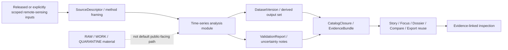

<!-- [KFM_META_BLOCK_V2]
doc_id: kfm://doc/<NEEDS-VERIFICATION>
title: Kansas Frontier Matrix — Remote Sensing Time-Series Analysis
type: standard
version: v1
status: draft
owners: @bartytime4life
created: <NEEDS-VERIFICATION>
updated: <NEEDS-VERIFICATION>
policy_label: <NEEDS-VERIFICATION>
related: [../../README.md, ../README.md, ../validation/README.md]
tags: [kfm, analyses, remote-sensing, time-series]
notes: [Path is repo-targeted from the analyses index; doc_id, dates, and policy label require mounted-repo verification.]
[/KFM_META_BLOCK_V2] -->

# Kansas Frontier Matrix — Remote Sensing Time-Series Analysis

Governed module guide for documenting time-aware remote-sensing analyses, outputs, validation burden, and downstream reuse under `docs/analyses/remote-sensing/time-series/`.

> [!IMPORTANT]
> This README describes a **derived analysis surface**, not a sovereign truth surface. Time-series products belong here only when their time basis, source basis, methods, uncertainty, and evidence linkage remain visible at the point of use.

> [!NOTE]
> Current-session evidence for this draft was **PDF-only**. The path, subtree, and sibling-file references below are therefore **repo-targeted** and **NEEDS VERIFICATION** against the mounted repository before merge.

**Status:** experimental  
**Owners:** @bartytime4life  
**Repo fit:** `docs/analyses/remote-sensing/time-series/README.md`  
**Upstream:** [`../../README.md`](../../README.md) · [`../README.md`](../README.md)  
**Downstream / companion:** [`../validation/README.md`](../validation/README.md)  
**Accepted inputs:** time-aware remote-sensing analysis notes, derived outputs, validation notes, and release-linked evidence references  
**Exclusions:** raw ingest dumps, single-date interpretation notes, UI-only proposals, policy bundles, and unsupported public claims


**Quick jumps:** [Scope](#scope) · [Repo fit](#repo-fit) · [Inputs](#inputs) · [Exclusions](#exclusions) · [Directory tree](#directory-tree) · [Quickstart](#quickstart) · [Usage](#usage) · [Diagram](#diagram) · [Tables](#tables) · [Task list](#task-list) · [FAQ](#faq) · [Appendix](#appendix)

---

## Scope

This module is for **time-aware remote-sensing analysis artifacts** and the Markdown that explains them.

In KFM terms, remote sensing enters the system as **measurement**, not decorative imagery. This directory is for work where **change through time is materially part of the claim**, not just incidental metadata on a scene.

Typical examples include:

- seasonal or phenological trajectories
- disturbance and recovery narratives
- trend fitting and breakpoint analysis
- image-collection compositing across a stated time window
- segment-based change detection
- index or classification evolution through time
- compare-ready temporal subsets used by map, dossier, story, compare, export, or Focus surfaces

> [!NOTE]
> The examples above are **method families**, not claims that those exact products are already mounted in the current repository.

### What this README should force into the open

A useful time-series entry should make five things explicit:

1. **what changed**
2. **over which time window**
3. **from which inputs**
4. **under which assumptions**
5. **with what downstream publication burden**

### Derived-by-default rule

Unless explicitly promoted through the same governed release discipline expected elsewhere in KFM, a time-series result should be treated as one of the following:

- **observed** — directly measured source content
- **derived** — computed from observed inputs by a stated rule
- **modeled** — fitted, classified, segmented, forecast, or otherwise produced by model logic
- **generalized** — reduced-precision or public-safe representation
- **blocked** — withheld due to rights, sensitivity, or publication constraints

[Back to top](#kansas-frontier-matrix--remote-sensing-time-series-analysis)

## Repo fit

| Role | Path | Relationship | Evidence status |
|---|---|---|---|
| Parent analyses index | [`../../README.md`](../../README.md) | Broader analysis-surface context and module routing | NEEDS VERIFICATION |
| Parent remote-sensing lane | [`../README.md`](../README.md) | Remote-sensing parent/sibling context | NEEDS VERIFICATION |
| Validation companion | [`../validation/README.md`](../validation/README.md) | Accuracy, uncertainty, and review burden companion | NEEDS VERIFICATION |
| This file | `./README.md` | Time-series module contract for temporal analysis work | TARGET PATH |

### Upstream expectations

This module should inherit the broader `docs/analyses/` posture:

- explicit scope
- explicit exclusions
- visible uncertainty
- stable terminology
- evidence-first writing
- no quiet drift from derived interpretation into authoritative claim

### Downstream reuse

Material documented here may feed:

- map or compare views
- dossier context panels
- story nodes
- export packages
- bounded Focus responses

But only when release state, evidence linkage, and policy posture remain visible.

### Placement rule

Use this directory when the work is **primarily temporal**.  
Do **not** place work here just because the source imagery happens to contain dates.

[Back to top](#kansas-frontier-matrix--remote-sensing-time-series-analysis)

## Inputs

### Accepted inputs

The following belong here when they are governed, documented, and analysis-relevant:

- released or explicitly scoped image collections
- documented raster stacks used for multi-date analysis
- AOI definitions and masks used in time-windowed processing
- derived indices with named formulas and support semantics
- time-series tables, plots, coefficients, or summary outputs
- validation notes tied to temporal outputs
- notebooks or scripts **only when** they are referenced as implementation aids rather than treated as truth
- figure exports that explain temporal behavior
- method notes describing cadence, compositing, masking, segmentation, or model assumptions
- links to release-bearing artifacts, catalogs, or evidence packs where available

### Minimum input spine

Every non-trivial time-series entry should declare the following:

| Field | Why it matters |
|---|---|
| Time window | Prevents snapshot ambiguity |
| Cadence / revisit basis | Explains what “series” really means |
| Sensor / platform family | Affects comparability and interpretation |
| Spatial support / resolution | Prevents over-reading fine detail |
| QA / masking strategy | Cloud, shadow, missingness, and noise matter |
| Derived band / index logic | Keeps feature engineering inspectable |
| Method / model version | Makes reruns and corrections possible |
| Validation basis | Prevents narrative-only confidence |
| Release state | Separates exploration from publication |
| Rights / sensitivity posture | Needed before outward reuse |

### KFM contract touchpoints

Where the broader KFM corpus uses contract families, a strong time-series record should be able to point back to these artifacts or their equivalent release objects.

| Contract family | Why it matters here |
|---|---|
| `SourceDescriptor` | Names the source, support, cadence, rights posture, and validation plan |
| `ValidationReport` | Shows what passed, failed, or quarantined |
| `DatasetVersion` | Stabilizes version identity, time semantics, and provenance |
| `CatalogClosure` | Links outward STAC / DCAT / PROV closure where applicable |
| `EvidenceBundle` | Makes downstream claims inspectable |
| `ReleaseManifest` / proof pack | Supports public-safe release, rollback, and correction |
| `CorrectionNotice` | Preserves supersession and narrowing instead of erasing history |

> [!WARNING]
> A sequence of pretty maps is **not** a time-series analysis record. Without time-window, method, masking, and uncertainty context, it is presentation residue.

[Back to top](#kansas-frontier-matrix--remote-sensing-time-series-analysis)

## Exclusions

This directory should **not** become a catch-all for remote-sensing material.

### Do not put these here

- raw source dumps better kept in source-edge or ingest lanes
- undocumented exploratory figures with no method note
- policy bundles, contract schemas, or CI logic as authoritative source objects
- UI feature proposals that belong in app or UX docs
- single-date image interpretation notes that are not actually temporal
- public-facing claims whose evidence path cannot be reconstructed
- exact sensitive coordinates or precise protected-site disclosures in public docs
- notebook output pasted as if it were already reviewed or released

### Put it elsewhere instead

| Content | Better home |
|---|---|
| Remote-sensing lane overview | [`../README.md`](../README.md) |
| Accuracy assessment / error characterization | [`../validation/README.md`](../validation/README.md) |
| Contracts / schemas / envelopes | Repo contract and schema surfaces |
| Story publication guidance | Story / publication docs |
| Policy bundles and reason codes | Policy surfaces |
| Raw ingest and receipts | Source / ingest / pipeline surfaces |

[Back to top](#kansas-frontier-matrix--remote-sensing-time-series-analysis)

## Directory tree

> [!NOTE]
> The tree below is a **proposed module-local shape**. It is not proof that every child path already exists in the mounted repository.

```text
docs/
└── analyses/
    └── remote-sensing/
        ├── README.md
        ├── validation/
        │   └── README.md
        └── time-series/
            ├── README.md
            ├── methods/                # method notes, algorithm writeups, parameter docs
            ├── datasets/               # dataset-specific analysis notes and release references
            ├── notebooks/              # referenced exploratory or reproducible notebooks
            ├── results/                # derived summaries, tables, temporal outputs
            ├── figures/                # plots and explanatory graphics
            └── validation/             # module-local checks if separate from lane-wide validation
```

### Layout guidance

- Keep the root README explanatory.
- Keep bulky reference material out of the top flow.
- Prefer one README per stable sub-area instead of a flat pile of ad hoc notes.
- Name subfolders by responsibility, not by tool brand.
- Do not imply that a child folder is release-bearing unless its evidence path is clear.

[Back to top](#kansas-frontier-matrix--remote-sensing-time-series-analysis)

## Quickstart

1. Start from the parent analysis rules in [`../../README.md`](../../README.md).
2. Confirm that the work is truly **time-series** and not just “remote sensing with dates.”
3. Resolve the KFM meta block at the top of this file using mounted-repo facts where available.
4. State the analysis question in one sentence.
5. Record the time window, cadence basis, sensor/input family, and masking strategy.
6. Link the work to any released dataset, catalog record, evidence pack, or proof artifact that already exists.
7. Mark each output as **observed**, **derived**, **modeled**, **generalized**, or **blocked**.
8. Add uncertainty and validation notes before polished figures.
9. Declare whether the output may feed Story, Focus, Dossier, Compare, or Export.
10. Remove or quarantine anything that implies public readiness without release-bearing evidence.

### Starter analysis header

```markdown
## Analysis snapshot

- Question:
- AOI:
- Time window:
- Cadence basis:
- Inputs:
- QA / masking:
- Method family:
- Output state:
- Validation basis:
- Release / evidence links:
- Public-safe notes:
```

### Starter checklist

- [ ] Module purpose is temporal, not generic
- [ ] Inputs are named and scoped
- [ ] Time semantics are explicit
- [ ] Method family is stated
- [ ] QA / masking is described
- [ ] Output-state labels are visible
- [ ] Validation burden is surfaced
- [ ] Reuse rules are stated
- [ ] Sensitive/public-safe handling is stated
- [ ] Meta block placeholders are resolved or intentionally left flagged

[Back to top](#kansas-frontier-matrix--remote-sensing-time-series-analysis)

## Usage

### Write this README as a contract, not a brochure

A strong child document in this module usually answers:

- What phenomenon is changing?
- What observations support that claim?
- What part is measured vs. derived vs. modeled?
- What time basis is the reader supposed to interpret?
- What are the known blind spots?
- What can downstream surfaces safely reuse?

### Recommended subsection pattern for child docs

```markdown
## Purpose
## Question
## Inputs
## Time window and cadence
## Method
## Output state
## Validation / uncertainty
## Release and evidence links
## Reuse constraints
```

### Method families that fit this module

| Method family | Best use here | Main caution |
|---|---|---|
| Seasonal / phenology summaries | Recurring annual behavior, vegetation timing, cyclical patterns | Easy to confuse seasonality with long-term change |
| Trend fitting | Direction and rate over a defined window | Sensitive to missingness, compositing, and breakpoints |
| Breakpoint / segment models | Disturbance, recovery, regime shifts | Segments are modeled outputs, not direct observation |
| Multi-date compositing | Stable before/after comparison | Composite rules can hide volatility |
| Index trajectories | NDVI, moisture, burn, thermal, or other derived signatures over time | Index meaning is context-dependent, not universal |
| Change classification | Explicit change/no-change or class transition outputs | Validation burden rises quickly |
| Multi-sensor fusion | Filling gaps or combining modalities | Cross-sensor comparability needs plain-language caveats |

### Output labeling rule

Use these labels directly in the doc when precision matters:

| Label | Meaning |
|---|---|
| **CONFIRMED** | Verified from repo-visible, release-visible, or corpus-visible evidence in scope |
| **INFERRED** | Strongly implied by the project doctrine or available evidence, but not directly verified |
| **PROPOSED** | Recommended module pattern or next-step structure |
| **UNKNOWN** | Not verified in the current session |
| **NEEDS VERIFICATION** | Should be checked before treating as authoritative or merge-ready |

[Back to top](#kansas-frontier-matrix--remote-sensing-time-series-analysis)

## Diagram


```mermaid
flowchart LR
    A["Released or explicitly scoped remote-sensing inputs"] --> B["SourceDescriptor / method framing"]
    B --> C["Time-series analysis module"]
    C --> D["DatasetVersion / derived output set"]
    C --> E["ValidationReport / uncertainty notes"]
    D --> F["CatalogClosure / EvidenceBundle"]
    E --> F
    F --> G["Story / Focus / Dossier / Compare / Export reuse"]
    G --> H["Evidence-linked inspection"]
    X["RAW / WORK / QUARANTINE material"] -. not default public-facing path .-> C
```

### Reading the diagram

- Inputs enter as scoped, described sources.
- Methods and validation are siblings, not afterthoughts.
- Derived outputs should not outrun their release state.
- Downstream reuse stays accountable only when evidence-linked inspection remains available.

[Back to top](#kansas-frontier-matrix--remote-sensing-time-series-analysis)

## Tables

### What belongs here

| Item | Belongs here? | Notes |
|---|---:|---|
| Time-windowed index comparison | Yes | Declare formula, masking, and support |
| Pixel or segment trend plots | Yes | State method, cadence, and uncertainty |
| Disturbance / recovery narrative with release links | Yes | Mark modeled vs. observed components |
| Single-date image caption | Usually no | Put it with the relevant non-temporal analysis if time is incidental |
| Raw source download log | No | Source / ingest lane |
| Policy reason-code registry | No | Policy lane |
| Story-only editorial prose with no method context | No | Story surface, with links back here if needed |

### Downstream reuse matrix

| Downstream surface | Default stance | Conditions |
|---|---|---|
| Story | Restricted | Allowed when claims are evidence-linked and release state is visible |
| Focus | Restricted | Allowed only for bounded retrieval / synthesis with citation and abstention behavior |
| Dossier | Allowed with care | Time scope, freshness, and uncertainty must remain visible |
| Compare | Strong fit | Requires explicit basis of comparison and matched support semantics |
| Export | Restricted | Needs release-safe scope, lineage, and correction linkage |
| Public map labels | Limited | Avoid overclaiming from modeled, partial, or stale outputs |

### Minimum metadata spine for time-series outputs

| Minimum artifact or field | Why it should be present |
|---|---|
| SourceDescriptor reference | Names the source and intake context |
| Time window | Prevents ambiguous interpretation |
| Validation logic or QA note | Makes screening visible |
| ValidationReport or equivalent note | Captures what passed, failed, or remained partial |
| DatasetVersion / result version | Makes supersession possible |
| STAC / DCAT / PROV closure where relevant | Supports outward discovery and lineage |
| EvidenceBundle linkage | Keeps consequential claims inspectable |
| ReleaseManifest / proof-pack reference | Supports publication, rollback, and correction logic |

### Sensor-family reminder

| Sensor / source family | Time-series strength | Interpretation caution |
|---|---|---|
| Multispectral optical | Strong for vegetation, land cover, thermal proxies, change context | Cloud, haze, seasonal mismatch |
| Radar / SAR | Strong where cloud cover is persistent; useful for flood or moisture structure | Speckle, geometry, layover, processing assumptions |
| LiDAR-derived surfaces | Strong for repeat terrain / structure comparisons when aligned carefully | Bare-earth vs. top-of-surface distinctions matter |
| Administrative or field overlays | Valuable as corroboration and grounding | Not interchangeable with remotely sensed measurement |

[Back to top](#kansas-frontier-matrix--remote-sensing-time-series-analysis)

## Task list

### Definition of done for this module

- [ ] The module purpose is explicitly temporal
- [ ] Parent and sibling links resolve
- [ ] Inputs, time scope, and cadence are named
- [ ] Methods are described in project language, not just tool-brand language
- [ ] Derived vs. modeled vs. observed states are labeled
- [ ] Validation burden is surfaced in the main flow
- [ ] Public-safe handling is stated
- [ ] At least one downstream reuse rule is explicit
- [ ] Figures do not outrun the evidence
- [ ] Open unknowns stay visible instead of being smoothed away

### Review gates

- [ ] No claim implies release readiness without evidence linkage
- [ ] No modeled output is written as direct observation
- [ ] No single-date view is misrepresented as a long-run trend
- [ ] No sensitive exact-location content is exposed without stated policy posture
- [ ] No absent repo structure is described as mounted fact
- [ ] README remains readable in GitHub without external styling

[Back to top](#kansas-frontier-matrix--remote-sensing-time-series-analysis)

## FAQ

### Does every remote-sensing result with a date belong here?

No. Use this module when the analysis is fundamentally about **change, trajectory, seasonality, segmentation, cadence, or comparison across time**.

### Can this module reference notebooks?

Yes, but notebooks are supporting implementation artifacts unless they are explicitly promoted and linked to release-bearing evidence.

### Are change-detection outputs authoritative?

Usually no. They are typically **derived** or **modeled** until promoted through the same release discipline expected elsewhere in KFM.

### Can Story or Focus quote this module directly?

Only when evidence linkage, uncertainty, and release state stay visible. A smooth visual summary is not enough.

### Can public-facing maps use these outputs?

Yes, selectively. But generalized, stale, partial, modeled, or disputed material should be labeled in place, not hidden in appendix prose.

### Does this module replace the validation companion?

No. This README should surface validation burden, but cross-cutting QA and verification method detail still belongs in the validation companion.

[Back to top](#kansas-frontier-matrix--remote-sensing-time-series-analysis)

## Appendix

<details>
<summary><strong>Suggested state vocabulary for time-series docs</strong></summary>

| State | Use in this module |
|---|---|
| Observed | Directly measured imagery or field-correlated source content |
| Derived | Computed from observed inputs by a stated rule |
| Modeled | Produced by fitted segments, classification, forecasting, or other model logic |
| Generalized | Reduced-precision or public-safe representation |
| Partial | Incomplete in time, space, quality, or coverage |
| Stale | No longer current enough for the implied use |
| Blocked | Withheld for rights, sensitivity, or publication reasons |

</details>

<details>
<summary><strong>Open verification items for this README</strong></summary>

- Exact mounted existence of every child path under `docs/analyses/remote-sensing/time-series/`
- Repo-native document ID assignment convention for the KFM meta block
- Narrower path ownership, if different from `/docs/`
- Policy label taxonomy for this specific module
- Whether module-local `validation/` should exist in addition to the lane-wide validation README
- Whether the repo already uses a more specific analysis template for child-module READMEs
- Whether adjacent remote-sensing sibling docs beyond `validation/` are current, historical, or superseded

</details>

<details>
<summary><strong>Review note on implementation certainty</strong></summary>

This README is written to be **commit-ready after verification**, not to flatten uncertainty.  
Where the current session could not prove mounted repo state, the document keeps those points marked as **INFERRED**, **PROPOSED**, **UNKNOWN**, or **NEEDS VERIFICATION**.

</details>

[Back to top](#kansas-frontier-matrix--remote-sensing-time-series-analysis)
