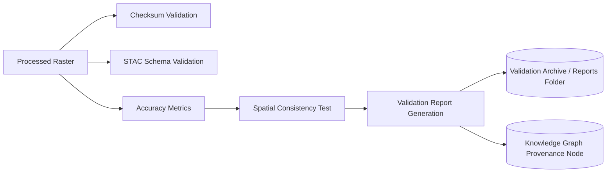

<div align="center">

# 🧪 **Kansas Frontier Matrix — Remote Sensing Validation & Quality Assurance**  
`docs/analyses/remote-sensing/validation/README.md`

**Purpose:**  
Define the methodologies, standards, and procedures used to verify accuracy, reliability, and reproducibility of all remote sensing products within the Kansas Frontier Matrix (KFM) system—ensuring that analytical outputs meet FAIR+CARE and MCP scientific-quality benchmarks.

[](../../../standards/markdown_rules.md)
[](../../../../LICENSE)
[]()
[]()
[]()

</div>

---

## 📚 Overview

The **Validation & QA module** provides a reproducible framework to assess the **accuracy, uncertainty, and integrity** of all remote sensing outputs—spanning multispectral indices, time-series trends, and change detection results.  
It implements statistical metrics, visual comparison routines, and model-based consistency checks to verify that KFM’s derived layers accurately represent Kansas’s surface and environmental conditions.

All validation results are archived under `docs/analyses/remote-sensing/validation/reports/` and are automatically included in the platform’s provenance logs and STAC metadata extensions.

---

## ⚙️ Validation Framework

### 1. Data Integrity Validation
- **Checksum Verification:** Every dataset (COG, GeoJSON, CSV) verified using SHA256 hashes; logs stored under `reports/self-validation/remote-sensing/`.  
- **STAC Schema Validation:** Each dataset’s STAC item validated with `stac-validator` and PySTAC; non-compliance triggers CI rejection.  
- **Projection & Metadata Checks:** Ensure all rasters conform to EPSG:4326, include correct CRS metadata, and list acquisition time, sensor, and processing lineage.  
- **License & Provenance Compliance:** SPDX and PROV-O annotations checked against `sbom.spdx.json` and manifest references.

### 2. Accuracy Assessment
- **Classification Accuracy:**  
  For land-cover and change detection models, confusion matrices are generated per epoch (1984–2025) with metrics:  
  - Overall Accuracy (OA)  
  - Kappa Coefficient  
  - User’s and Producer’s Accuracy per class  
  Validation uses reference samples from NLCD, Kansas GAP, or in-situ records.

- **Regression Accuracy (Continuous Indices):**  
  Evaluate time-series NDVI, NDWI, and NBR trends against in-situ or higher-resolution references using:  
  - RMSE (Root Mean Square Error)  
  - MAE (Mean Absolute Error)  
  - R² (Coefficient of Determination)

### 3. Spatial & Temporal Consistency
- **Spatial Cross-Validation:** 10-fold spatial CV splits to ensure generalization across eco-regions.  
- **Temporal Holdouts:** Partition time series into train/validation/test (e.g., 1984–2010 / 2011–2018 / 2019–2025).  
- **Consistency Metrics:**  
  - Interannual stability (NDVI variance < 0.05 in unchanging regions).  
  - Temporal continuity index (TCI) comparing overlapping sensor transitions (e.g., Landsat 7–8 crossover).

---

## 🧠 Statistical Evaluation Framework

### Core Metrics

| Metric | Formula | Purpose |
|--------|----------|----------|
| **RMSE** | √Σ(ŷ − y)² / n | Quantifies mean model error magnitude. |
| **R²** | 1 − Σ(ŷ − y)² / Σ(ȳ − y)² | Measures predictive agreement with reference. |
| **Kappa (κ)** | (Po − Pe) / (1 − Pe) | Evaluates classification reliability beyond chance. |
| **F1-score** | 2 × (Precision × Recall) / (Precision + Recall) | Combines precision and recall into one accuracy metric. |

All metrics computed automatically via the validation pipeline:  
`src/pipelines/validation/remote_sensing_validation.py`.

### QA Thresholds

| Product | Target Metric | Acceptance Criteria |
|----------|----------------|----------------------|
| Land-Cover Classification | OA ≥ 85%, κ ≥ 0.75 | Required for release |
| NDVI / NDWI Time Series | RMSE ≤ 0.05, R² ≥ 0.9 | Required for certification |
| Change Detection Maps | F1 ≥ 0.8, OA ≥ 90% | Required for publication |
| Predictive Models (LSTM/ARIMA) | R² ≥ 0.85 | Required for forecast integration |

---

## 🔬 QA Process Workflow



Outputs include:
- Validation summaries in CSV and JSON formats.  
- QA dashboards rendered in the React frontend’s “Validation Reports” view.  
- Automatic Neo4j node updates marking datasets as `VALIDATED` with a `confidence_score`.

---

## 🧭 Integration with the Knowledge Graph

The validation results feed directly into the Neo4j schema via relationships:
```mermaid
graph TD
  DS[Dataset (STAC Item)] -->|validated_by| VR[Validation Report]
  VR -->|yields| MET[Metrics Node]
  VR -->|updates| QA[QualityAssurance Tag]
  QA -->|linked_to| FM[Focus Mode Insights]
```

This ensures that every analytical dataset (NDVI, change map, or forecast) carries a **traceable confidence rating**, which informs the visual opacity or “certainty shading” in the map UI.

---

## 🧾 FAIR+CARE and MCP Alignment

- **FAIR:** Validation outputs carry standardized metadata (`validation.json` + DOI).  
- **CARE:** Ecological or sensitive land validations (e.g., tribal reservations) anonymized before publication.  
- **MCP Provenance:** Every validation run logs the script hash, parameters, and dataset lineage.  
- **Reproducibility:** Execute the validation pipeline with:
  ```bash
  make validate-remote-sensing
  make docs-validate
  ```
- **Governance:** Review and approval cycles recorded in `docs/analyses/remote-sensing/validation/governance.md`.

---

## 📂 Directory Layout

```
docs/analyses/remote-sensing/validation/
├── README.md                     # This file
├── methods/                      # QA methods, metrics definitions, and scripts
├── results/                      # Accuracy tables, confusion matrices, trend metrics
├── reports/                      # Published validation reports and summaries
└── governance.md                 # FAIR+CARE compliance and audit documentation
```

---

## 🧾 Version History

| Version | Date | Author | Description | Commit |
|----------|------|---------|--------------|---------|
| v10.2.2 | 2025-11-12 | KFM FAIR+CARE Council | Initial release of validation and QA documentation for remote sensing modules. | `<latest-commit-hash>` |
| v10.0.0 | 2025-10-05 | KFM Core Dev Team | Added automated accuracy validation and Neo4j quality linkage. | `<hash>` |

---

<p align="center"><b>End of File — docs/analyses/remote-sensing/validation/README.md</b></p>