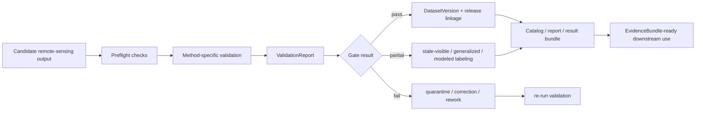

<!-- [KFM_META_BLOCK_V2]
doc_id: kfm://doc/<NEEDS-UUID>
title: Remote Sensing Validation & Quality Assurance
type: standard
version: v1
status: draft
owners: <NEEDS VERIFICATION>
created: <NEEDS VERIFICATION>
updated: <NEEDS VERIFICATION>
policy_label: <NEEDS VERIFICATION>
related: [docs/analyses/remote-sensing/README.md (NEEDS VERIFICATION), docs/analyses/remote-sensing/validation/results/README.md (PROPOSED), docs/analyses/remote-sensing/validation/governance.md (PROPOSED)]
tags: [kfm, remote-sensing, validation, qa]
notes: [Current-session workspace evidence was PDF-only; adjacent repo paths, owners, dates, and automation entrypoints need verification.]
[/KFM_META_BLOCK_V2] -->

# Remote Sensing Validation & Quality Assurance

Govern release-bearing remote-sensing outputs with explicit metrics, provenance, uncertainty, and publication-safe review.

> **Status:** experimental  
> **Owners:** `NEEDS VERIFICATION`  
> 
> 
> 
>   
> **Quick jumps:** [Scope](#scope) · [Repo fit](#repo-fit) · [Inputs](#inputs) · [Quickstart](#quickstart) · [Workflow](#workflow) · [Validation minimums](#validation-minimums) · [Artifacts](#artifact-and-traceability-model) · [Definition of done](#definition-of-done) · [FAQ](#faq)

> [!IMPORTANT]
> Current-session workspace evidence for adjacent repo files was **PDF-only**. This README keeps KFM doctrine **CONFIRMED** where the attached corpus is explicit, and marks directory layout, filenames, automation commands, and neighboring docs as **PROPOSED** or **NEEDS VERIFICATION** until the mounted repository is inspected.

> [!NOTE]
> In KFM, validation is not a cosmetic scorecard added after analysis. It is the governed step that decides whether a remote-sensing output can move from candidate artifact to public-safe release-bearing material.

## Scope

This directory is for **remote-sensing validation and quality assurance** inside KFM’s governed truth path.

It exists to make the following things inspectable before publication or downstream use:

- what was validated
- how it was validated
- which metrics and checks passed, failed, or remained partial
- what uncertainty remains
- whether the output is fit for the intended support, scale, audience, and release surface

**CONFIRMED doctrine**

- Validation is cross-cutting in KFM and belongs across intake, canonical truth, catalog/policy/review, derived delivery, and runtime trust surfaces.
- Negative outcomes are first-class: quarantine, deny, abstain, stale-visible, generalized, superseded, withdrawn, and errored states are valid governed outcomes.
- Remote-sensing outputs must remain subordinate to evidence, policy, release state, and correction lineage.

**What this README does**

- defines what belongs in this directory
- stabilizes the minimum validation bundle for remote-sensing work
- gives maintainers a readable checklist for review and release readiness
- makes room for both automated and steward-reviewed validation workflows

[↑ Back to top](#remote-sensing-validation--quality-assurance)

## Repo fit

| Item | Value |
|---|---|
| Path | `docs/analyses/remote-sensing/validation/README.md` |
| Role in repo | Directory README for validation methods, results, reports, and governance notes |
| Likely upstream | `docs/analyses/remote-sensing/README.md` **NEEDS VERIFICATION** |
| Likely downstream | `methods/`, `results/`, `reports/`, `governance.md` **PROPOSED / NEEDS VERIFICATION** |
| Primary audience | Remote-sensing engineering, science QA reviewers, release managers, governance reviewers |
| Adjacent contract families | `ValidationReport`, `DatasetVersion`, `CatalogClosure`, `ReleaseManifest` / `ReleaseProofPack`, `ProjectionBuildReceipt`, `EvidenceBundle`, `CorrectionNotice` |

### Truth labels used here

| Label | Meaning |
|---|---|
| **CONFIRMED** | Explicitly supported by the attached KFM/source corpus in the current session |
| **PROPOSED** | A doctrine-consistent starter pattern or recommended implementation shape |
| **NEEDS VERIFICATION** | Not proven in the mounted repository during this session |
| **UNKNOWN** | No reliable current-session evidence |

## Inputs

Accepted inputs for this directory include:

| Input class | What belongs here | Minimum expectation |
|---|---|---|
| Candidate remote-sensing outputs | classified rasters, change maps, NDVI/vegetation products, thermal surfaces, flood extents, forecast-like modeled surfaces | clear subject, support, time window, CRS, and provenance |
| Reference / truth material | training and testing samples, field checks, review notes, external label sources, steward annotations | source basis and method documented |
| Validation artifacts | confusion matrices, per-class metrics, threshold tables, QA summaries, validation logs | reproducible method and result context |
| Method notes | metric definitions, acceptance rules, failure thresholds, known limitations | readable, versioned, reviewable |
| Publication-readiness evidence | sensitivity checks, modeled-output labeling, generalization decisions, release notes | explicit public-safe posture |
| Correction-linked material | supersession notes, revised metrics, replacement runs | visible lineage to earlier outputs |

## Exclusions

This directory does **not** own the following by default:

| Excluded material | Why it does not belong here | Where it should go instead |
|---|---|---|
| Raw source onboarding contracts | validation is downstream of intake | source/onboarding or ingest documentation |
| Canonical release registry for the whole repo | this directory may reference releases but does not replace repo-wide release documentation | release / publication documentation |
| Public storytelling or narrative interpretation | validation supports public narrative but is not the narrative itself | story/report surfaces |
| Secrets, signed URLs, tokens, credentials | never publish operational secrets in docs or validation outputs | secret management / runtime config |
| Sensitive exact-location disclosure | public validation docs must not become a location-leak vector | generalized/public-safe surfaces with review |
| Unbounded “AI summary” text without source linkage | KFM does not admit uncited summary as truth | governed runtime with evidence-linked outputs |

## Directory tree

> [!NOTE]
> The tree below is a **starter layout** inferred from project materials. Verify against the mounted repo before treating it as final.

```text
docs/analyses/remote-sensing/validation/
├── README.md
├── methods/
│   ├── README.md
│   ├── metrics/
│   ├── scripts/
│   └── thresholds/
├── results/
│   ├── README.md
│   ├── confusion-matrices/
│   ├── metrics/
│   └── summaries/
├── reports/
│   ├── README.md
│   ├── daily/
│   └── releases/
└── governance.md
```

## Quickstart

### Minimum manual flow

1. Identify the candidate output and its intended use.
2. Confirm the candidate has source, time, support, CRS, and method context.
3. Run the validation harness or manual review path.
4. Produce a `ValidationReport`.
5. Attach or reference the candidate `DatasetVersion`.
6. Decide whether the output is:
   - releasable
   - partial/stale-visible
   - modeled-only and clearly labeled
   - quarantined for rework
7. Link downstream results to release/correction lineage.

### Starter commands

```bash
# PROPOSED / NEEDS VERIFICATION
make validate-remote-sensing
make docs-validate
```

> [!TIP]
> If these entrypoints do not exist in the mounted repo, keep the artifact model and gate logic intact, then update only the invocation layer after inspection.

## Workflow


```mermaid
flowchart LR
    A[Candidate remote-sensing output] --> B[Preflight checks]
    B --> C[Method-specific validation]
    C --> D[ValidationReport]
    D --> E{Gate result}
    E -->|pass| F[DatasetVersion + release linkage]
    E -->|partial| G[stale-visible / generalized / modeled labeling]
    E -->|fail| H[quarantine / correction / rework]
    F --> I[Catalog / report / result bundle]
    G --> I
    H --> J[re-run validation]
    I --> K[EvidenceBundle-ready downstream use]
```

### Reading rule

Validation moves **forward** through the same trust structure as publication:

`candidate -> validation -> review -> release linkage -> downstream use -> correction if needed`

It is not a sidecar.

## Validation minimums

| Check family | What to validate | Why it matters |
|---|---|---|
| Provenance | source basis, acquisition window, processing lineage, operator/reviewer context | without this, the output cannot be interpreted honestly |
| Spatial semantics | CRS, datum, projection, pixel alignment, support/resolution, extent | spatial outputs become misleading when support is unclear |
| Temporal semantics | acquisition date, composite window, seasonality, stale tolerance, as-of meaning | snapshot bias is a recurring failure mode |
| Radiometric / spectral context | cloud masking, scaling, emissivity/scaling assumptions, sensor mix, spectral meaning | remote-sensing outputs are measurements, not just pictures |
| Geometry / topology / alignment | vector validity, edge continuity, raster/vector alignment, seam handling | invalid or misaligned geometry can quietly corrupt downstream analysis |
| Reference data quality | label source, sampling logic, field checks, steward review, class balance | a metric without trustworthy reference data can be worse than no metric |
| Classification quality | confusion matrix, overall accuracy, producer’s accuracy, user/consumer accuracy, kappa, class-level error analysis | these are core release checks for labeled outputs |
| Generalization performance | train/test gap, leakage risk, spatial autocorrelation, holdout logic | prevents “good-looking” overfit models from being released |
| Aggregation discipline | unit of support, rollup logic, what heterogeneity is hidden | aggregation can suppress hotspots and local variation |
| Publication safety | modeled-output labeling, uncertainty disclosure, generalized coordinates, rights/sensitivity checks | a technically valid output can still be unsafe to publish |

## Metrics and interpretation

### Core classification metrics

| Metric | What it tells you | Minimum interpretation rule |
|---|---|---|
| Confusion matrix | where the classifier is right and wrong by class | inspect off-diagonal errors, not just the headline score |
| Overall accuracy | proportion classified correctly | useful, but insufficient on its own |
| Producer’s accuracy | how well real instances of a class were captured | check omission risk |
| User’s / consumer’s accuracy | how reliable the predicted class is | check commission risk |
| Kappa | agreement beyond chance | treat as contextual, not sovereign |
| Precision / recall / F1 | useful where class imbalance matters or workflow is not limited to raster-classification convention | document explicitly if used |

### Interpretation rules

- A strong training score with a weaker test score is a warning sign, not a success story.
- Spatial autocorrelation can make validation look stronger than it really is when training and testing data are too close.
- A high-resolution product is not automatically a high-quality product.
- A single-date product can be analytically wrong if the decision requires seasonal or multi-date context.
- A ward-, county-, or basin-level rollup can hide within-unit heterogeneity.

> [!WARNING]
> Do not publish a confident narrative from a smooth metric alone. KFM requires visible uncertainty, visible method, and visible evidence route.

## Artifact and traceability model

The table below grounds this directory in KFM’s broader artifact system.

| Artifact family | Remote-sensing use in or around this directory | Status |
|---|---|---|
| `SourceDescriptor` | declares the scene/source or upstream endpoint contract | **CONFIRMED doctrine** / usually upstream |
| `IngestReceipt` | proves fetch/landing of source material | **CONFIRMED doctrine** / usually upstream |
| `ValidationReport` | primary validation object for this directory | **CONFIRMED doctrine** |
| `DatasetVersion` | candidate or promoted output that the validation applies to | **CONFIRMED doctrine** |
| `CatalogClosure` | outward metadata/lineage closure where release-bearing publication occurs | **CONFIRMED doctrine** |
| `ReleaseManifest` / `ReleaseProofPack` | binds validation to publication readiness | **CONFIRMED doctrine** |
| `ProjectionBuildReceipt` | records derived map/tile/export builds from released scope | **CONFIRMED doctrine** |
| `EvidenceBundle` | supports downstream claim/report/export use | **CONFIRMED doctrine** |
| `RuntimeResponseEnvelope` | relevant when validation outputs are surfaced in governed runtime responses | **CONFIRMED doctrine** / often downstream |
| `CorrectionNotice` | preserves visible lineage when a validated product is replaced, generalized, or withdrawn | **CONFIRMED doctrine** |

### Remote-sensing-specific minimum bundle

For most release-bearing outputs, the smallest useful bundle is:

- candidate output reference
- method summary
- validation metrics
- reference data/source note
- uncertainty note
- public-safe publication note
- correction path

## Governance and publication

### Publication posture

Remote-sensing validation artifacts should make these states explicit in-place:

- **observed**
- **derived**
- **modeled**
- **generalized**
- **partial**
- **stale-visible**
- **withdrawn**
- **superseded**

### FAIR+CARE / sensitivity rules

| Rule | Practical consequence |
|---|---|
| Publish only public-safe or explicitly generalized scopes when precision is risky | avoid “how to locate” instructions and unnecessary precise coordinates |
| Treat ecological, archaeological, Indigenous, biodiversity, or exact-location-sensitive outputs as review-bearing | validation can pass technically and still fail publication review |
| Keep modeled outputs visibly tagged as modeled | forecast-like or inferred surfaces must not read like observations |
| Fail closed when governance status is unclear | do not silently publish because a result exists |
| Keep review and correction visible | validation does not erase later correction obligations |

### Remote-sensing honesty rules

- Document acquisition dates and composite windows.
- State when cloud cover, sensor substitution, or gap-filling changes interpretation.
- Do not flatten field observations, remote sensing, and administrative records into the same evidentiary class.
- When rollups are used, name the support unit and what fine-grained variation is lost.

## Usage

### What maintainers should add here

- new method summaries
- metric definitions and thresholds
- release-ready validation summaries
- result indexes
- links to correction or supersession notices
- reviewer guidance for recurring product families

### What maintainers should not add here

- long free-form research essays
- unlinked public storytelling
- opaque screenshots with no artifact references
- undocumented “final accuracy” claims
- secrets, tokens, or signed links

## Definition of done

A remote-sensing validation package is ready for downstream use only when all relevant gates below are satisfied.

- [ ] candidate output is identified unambiguously
- [ ] source / acquisition / processing context is recorded
- [ ] CRS, extent, support, and temporal window are documented
- [ ] method and threshold logic are readable and reviewable
- [ ] `ValidationReport` exists or is explicitly linked
- [ ] required metrics are attached
- [ ] class-level or product-level failure modes are noted
- [ ] train/test and leakage risks are addressed where applicable
- [ ] uncertainty or modeled-output status is visible
- [ ] publication-safety review is complete for the intended surface
- [ ] downstream release/correction linkage is explicit

## FAQ

### Is this directory only for land-cover classification?

No. It should also cover indices, thermal surfaces, flood extents, change products, forecast-like modeled outputs, and other remote-sensing deliverables that need governed QA before release.

### Is “high accuracy” enough for release?

No. KFM validation is broader than model scoring. A product can score well and still fail on provenance, temporal fit, CRS/support clarity, publication safety, or correction readiness.

### Can aggregated outputs hide important problems?

Yes. Electoral wards, counties, basins, and other administrative rollups can hide heterogeneity that remains visible at image resolution or local support.

### What if a result is useful but incomplete?

Use a visible trust state such as **partial** or **stale-visible** if policy allows. Do not imply completeness that the evidence does not support.

### Where should public interpretation live?

In downstream reports, stories, or governed runtime surfaces that stay linked to evidence and release state. This README is about validation, not narrative replacement.

## Appendix

<details>
<summary><strong>Starter validation bundle (compact reference)</strong></summary>

### A. Candidate package checklist

| Item | Required | Notes |
|---|---|---|
| Candidate output reference | Yes | file, asset, layer, or package ID |
| Acquisition / source window | Yes | include sensor/platform if relevant |
| CRS + support | Yes | projected/geographic meaning and resolution |
| Method note | Yes | algorithm, thresholds, composites, masks |
| Reference data note | Usually | required for supervised/classified outputs |
| Metrics bundle | Yes | confusion matrix or equivalent product checks |
| Uncertainty note | Yes | modeled, partial, stale, or known gaps |
| Reviewer note | When needed | especially for sensitive or consequential releases |
| Release / correction link | Yes | do not orphan the validation result |

### B. Product families this directory should handle well

- land-cover / class maps
- NDVI / vegetation condition
- thermal / LST products
- flood extent and water masks
- change-detection outputs
- composite imagery summaries
- forecast-like derived surfaces
- remote-sensing-backed environmental indicators

### C. Initial cleanup items after mounted repo inspection

1. Replace owner placeholders.
2. Confirm neighboring doc paths.
3. Confirm actual automation entrypoints.
4. Confirm whether `methods/`, `results/`, `reports/`, and `governance.md` already exist.
5. Replace any inferred path strings with real repo paths.
6. Add direct links to the authoritative contract/schema locations once verified.

</details>

---

[↑ Back to top](#remote-sensing-validation--quality-assurance)
