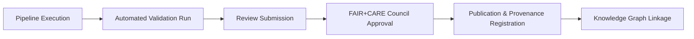

<div align="center">

# ⚖️ **Kansas Frontier Matrix — Remote Sensing Validation Governance**  
`docs/analyses/remote-sensing/validation/governance.md`

**Purpose:**  
Establish ethical, procedural, and compliance frameworks for the validation and quality-assurance processes of remote sensing modules within the Kansas Frontier Matrix (KFM), ensuring data integrity, reproducibility, and adherence to FAIR+CARE and MCP governance principles.

[](../../../standards/markdown_rules.md)
[](../../../../LICENSE)
[]()
[]()
[]()

</div>

---

## 📚 Overview

This governance file defines how **remote sensing validation** results are reviewed, approved, and archived within the Kansas Frontier Matrix.  
It ensures that all QA/QC activities—covering spectral, temporal, and change-detection validations—comply with reproducibility, ethical, and provenance standards.  

Validation governance is managed jointly by the **FAIR+CARE Council** and the **Scientific Oversight Committee (SOC)** under the Master Coder Protocol v6.3.

---

## 🧭 Governance Framework

### 1. Validation Oversight
- The **FAIR+CARE Council** oversees ethics, equity, and data-sharing compliance.  
- The **SOC** ensures scientific rigor, algorithmic accuracy, and method reproducibility.  
- Each validation cycle undergoes a **dual-review process**:  
  1. **Technical Review:** Evaluates analytical accuracy, model assumptions, and reproducibility logs.  
  2. **Ethical Review:** Evaluates CARE compliance, data sensitivity, and cultural respect for geographic layers (e.g., Indigenous territories, conservation zones).

All reviewers must sign off via the governance tracking ledger (`reports/audit/validation-governance-ledger.json`).

---

## ⚙️ Validation Lifecycle



Each stage is versioned, timestamped, and traceable via Neo4j’s `(:Governance:ValidationReview)` nodes.

### Lifecycle Phases:
1. **Execution:** Validation scripts run automatically after ETL completion.  
2. **Review:** Council members evaluate results, verifying compliance with thresholds (OA ≥ 85%, RMSE ≤ 0.05, etc.).  
3. **Approval:** Approved results assigned a digital signature and version ID.  
4. **Publication:** Validation metadata pushed to the STAC collection and `reports/self-validation/`.  
5. **Graph Linkage:** Validation provenance nodes (`prov:wasReviewedBy`, `prov:approvedBy`) appended to dataset entities.

---

## 🧩 Roles and Responsibilities

| Role | Entity | Primary Duties |
|------|---------|----------------|
| **FAIR+CARE Council** | Interdisciplinary ethics and governance board | Review CARE compliance, ensure responsible data use, approve sensitive data masking. |
| **Scientific Oversight Committee (SOC)** | KFM domain experts | Validate algorithmic correctness, verify reproducibility and QA metrics. |
| **Data Steward** | Assigned for each dataset or pipeline | Maintain validation logs, ensure STAC & DCAT metadata are accurate and up-to-date. |
| **Audit Officer** | Appointed reviewer | Conducts quarterly audits, compiles governance summary reports for transparency. |

Each role’s participation is logged and digitally signed in the **Governance Ledger**.

---

## 🧠 Compliance Protocols

### FAIR Principles
- **Findable:** Validation reports indexed in STAC with DOIs.  
- **Accessible:** Reports and scripts openly available under CC-BY 4.0.  
- **Interoperable:** Metadata conforms to STAC/DCAT specifications.  
- **Reusable:** Full provenance and parameter documentation allow independent replication.

### CARE Principles
- **Collective Benefit:** Environmental data used to advance sustainable development in Kansas.  
- **Authority to Control:** Tribal, local, or community stakeholders consulted for sensitive region data.  
- **Responsibility:** Transparency about potential environmental misinterpretation or bias.  
- **Ethics:** No ecological or cultural datasets shared without proper consent or anonymization.

### MCP Governance
- **Reproducibility:** All validation steps have corresponding logs and configuration files.  
- **Auditability:** Governance records stored in `/reports/audit/validation-governance-ledger.json`.  
- **Version Control:** All changes must be committed with traceable metadata and verified by CI pipelines.  
- **Accountability:** Every release of validated data must include named reviewers and approvers.

---

## 🛡️ Risk Management and Ethics Review

| Risk Type | Description | Mitigation |
|------------|--------------|-------------|
| **Data Misinterpretation** | Incorrect use of validation statistics or maps. | Include uncertainty bounds and disclaimers. |
| **Cultural Sensitivity** | Inclusion of tribal or sacred lands in datasets. | Require CARE Council approval and apply data masking. |
| **Environmental Misrepresentation** | Simplified or misleading graphics in the UI. | Use legend thresholds consistent with statistical significance. |
| **Reproducibility Gaps** | Missing parameter files or inconsistent validation logs. | Automated CI check enforces completeness. |

---

## 🧩 Audit & Reporting

Quarterly governance reports summarize:
- Validation cycles executed  
- Approved and rejected validations  
- Anomalies, exceptions, or reproducibility issues  
- Reviewer sign-offs and CARE compliance metrics  

Audit reports are generated by the automation pipeline and archived in:
```
reports/audit/validation/
  ├── audit-summary-Q1-2025.json
  ├── audit-summary-Q2-2025.json
  └── governance-ledger.json
```

Each audit includes:
- Dataset ID and validation hash  
- Reviewer names and credentials  
- Ethical compliance notes  
- Timestamped signature of the FAIR+CARE Council Chair

---

## 🧾 Version History

| Version | Date | Author | Description | Commit |
|----------|------|---------|--------------|---------|
| v10.2.2 | 2025-11-12 | FAIR+CARE Council | Established governance and audit structure for remote sensing validation modules. | `<latest-commit-hash>` |
| v10.0.0 | 2025-10-05 | KFM Core Dev Team | Added governance linkage between validation and Neo4j provenance nodes. | `<hash>` |

---

<p align="center"><b>End of File — docs/analyses/remote-sensing/validation/governance.md</b></p>