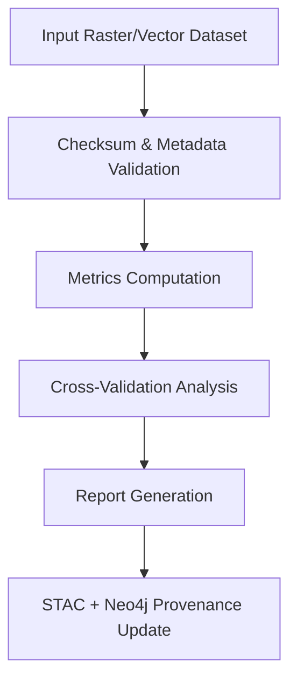
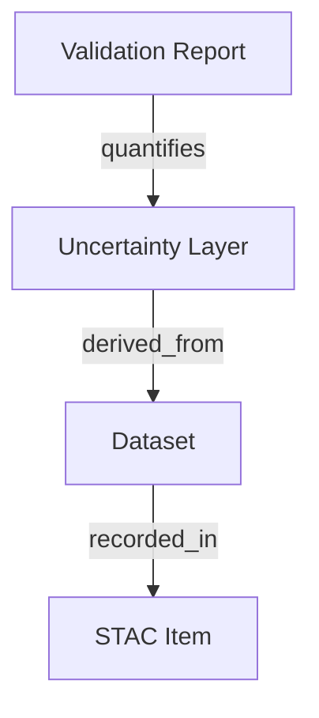

<div align="center">

# 🧩 **Kansas Frontier Matrix — Remote Sensing Validation Methods**  
`docs/analyses/remote-sensing/validation/methods/README.md`

**Purpose:**  
Detail the statistical, algorithmic, and geospatial validation methods used to evaluate remote sensing products within the Kansas Frontier Matrix (KFM), ensuring scientific accuracy, transparency, and reproducibility under MCP and FAIR+CARE standards.

[](../../../../standards/markdown_rules.md)
[](../../../../../LICENSE)
[]()
[]()
[]()

</div>

---

## 📚 Overview

This module defines the **scientific methods and algorithms** used for validation of remote sensing analyses in KFM, including change detection, multispectral, and time-series products.  
Each method follows the Master Coder Protocol’s documentation-first standard and is version-controlled, benchmarked, and accompanied by provenance data.

---

## ⚙️ Statistical Validation Framework

### 1. Classification Accuracy Metrics
Used for categorical outputs such as **land-cover maps** or **change detection masks**.

| Metric | Formula | Description | Validation Source |
|--------|----------|--------------|-------------------|
| **Overall Accuracy (OA)** | Correct / Total | Percent of pixels correctly classified. | Confusion Matrix |
| **Kappa Coefficient (κ)** | (Po − Pe) / (1 − Pe) | Measures agreement beyond chance. | Derived from cross-tabulation |
| **User’s Accuracy (UA)** | TP / (TP + FP) | Probability that a pixel labeled as class *i* actually belongs to *i*. | Class-level metric |
| **Producer’s Accuracy (PA)** | TP / (TP + FN) | Probability that a reference pixel of class *i* is correctly classified. | Class-level metric |
| **F1-Score** | 2 × (Precision × Recall) / (Precision + Recall) | Harmonic mean of precision and recall. | Balanced accuracy metric |

Validation datasets include NLCD 2019 reference polygons and Kansas GAP species-habitat overlays.

---

### 2. Continuous Variable Validation
Used for continuous outputs like **NDVI**, **NDWI**, or **surface temperature**.

| Metric | Formula | Description |
|--------|----------|-------------|
| **RMSE** | √Σ(ŷ − y)² / n | Measures magnitude of error between predicted and reference values. |
| **MAE** | Σ|ŷ − y| / n | Captures average absolute deviation. |
| **R²** | 1 − Σ(ŷ − y)² / Σ(ȳ − y)² | Evaluates correlation strength between predicted and observed values. |
| **Bias** | Σ(ŷ − y) / n | Quantifies systematic over- or underestimation. |

Reference data sources: Kansas Mesonet stations, NOAA ground observations, and regional flux tower data (AmeriFlux).

---

### 3. Spatiotemporal Consistency Tests
Applied to time-series and change detection products.

- **Temporal Stability Index (TSI):**  
  $begin:math:text$ TSI = 1 - \\frac{\\sigma_t}{\\mu_t} $end:math:text$  
  Low σ/μ ratio indicates temporal stability in non-changing regions.  
- **Sensor Transition Consistency:**  
  Compare mean NDVI differences across overlapping missions (e.g., Landsat 7 → 8 → 9) to confirm radiometric alignment (Δ < 0.02).  
- **Spatial Autocorrelation (Moran’s I):**  
  Checks spatial clustering in residuals or classification errors.  

---

## 🛰️ Sampling & Reference Data Protocols

### Sampling Strategies
1. **Stratified Random Sampling:** Ensures equal representation of all land-cover types across Kansas ecoregions.  
2. **Cluster Sampling:** Applied to multi-temporal products for dense time-series validation.  
3. **Systematic Grid Sampling:** Used for continuous data where every nth pixel is sampled.  
4. **Spatial Cross-Validation:** Divide Kansas into 10 folds by eco-region; each fold tested independently.

### Reference Data Sources
- **NLCD 2019** — land cover reference.  
- **Kansas GAP** — ecological habitat distribution.  
- **Mesonet / USGS** — continuous environmental variables.  
- **Ground Surveys & LTER** — local observation benchmarks.  

---

## 🔬 Quality Control Algorithms

### Automated QA Pipeline


- Validation computations are executed automatically via `src/pipelines/validation/remote_sensing_validation.py`.  
- All results include confidence intervals and uncertainty layers as additional raster bands.

### Threshold Criteria
| Product Type | Metric | Threshold | Status |
|---------------|---------|-----------|--------|
| Land Cover | OA ≥ 85%, κ ≥ 0.75 | Must Pass | ✅ |
| NDVI Time Series | RMSE ≤ 0.05, R² ≥ 0.9 | Must Pass | ✅ |
| Change Detection | F1 ≥ 0.8 | Must Pass | ✅ |
| Forecast Model | R² ≥ 0.85 | Recommended | ⚙️ |

---

## 🧠 Uncertainty Quantification

Uncertainty surfaces accompany all predictions as `.tif` raster bands:
- **Variance Layers:** Derived from ensemble model standard deviation.  
- **Confidence Maps:** Calculated as 1 − normalized RMSE.  
- **Propagated Error:** Combines calibration, atmospheric correction, and resampling uncertainties.

Uncertainty nodes are stored in Neo4j under the label `(:Uncertainty:ValidationOutput)` with relationships:


---

## 🧭 Reproducibility and FAIR+CARE Alignment

- **FAIR:** All metrics and reports encoded in JSON-LD with links to STAC items and DOIs.  
- **CARE:** Validation over Indigenous territories anonymized and reviewed before publication.  
- **MCP Documentation:** Each method’s parameters, formulas, and version IDs are logged in `/reports/self-validation/methods/`.  
- **CI Validation:**  
  ```bash
  make validate-remote-sensing
  make docs-validate
  ```
  Automatically re-runs QA checks and schema validation.

---

## 📂 Directory Layout

```
docs/analyses/remote-sensing/validation/methods/
├── README.md                    # This file
├── metrics/                     # JSON schemas and definitions for validation metrics
├── sampling/                    # Scripts and notes on sampling methodologies
├── algorithms/                  # Source references for implemented QA methods
└── provenance/                  # Configuration and provenance documentation
```

---

## 🧾 Version History

| Version | Date | Author | Description | Commit |
|----------|------|---------|--------------|---------|
| v10.2.2 | 2025-11-12 | KFM FAIR+CARE Council | Initial release detailing formal validation methodologies, metrics, and QA thresholds. | `<latest-commit-hash>` |
| v10.0.0 | 2025-10-05 | KFM Core Dev Team | Added standardized metric schemas and sampling protocols. | `<hash>` |

---

<p align="center"><b>End of File — docs/analyses/remote-sensing/validation/methods/README.md</b></p>