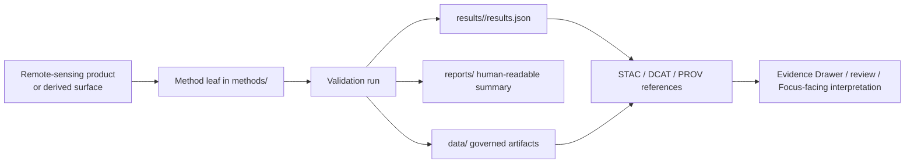

<!-- [KFM_META_BLOCK_V2]
doc_id: kfm://doc/NEEDS-VERIFICATION
title: Remote Sensing Validation Methods
type: standard
version: v1
status: draft
owners: NEEDS VERIFICATION
created: YYYY-MM-DD
updated: YYYY-MM-DD
policy_label: public
related: [../README.md, ../results/README.md, ../reports/, ../governance.md]
tags: [kfm, remote-sensing, validation, methods]
notes: [Built from attached KFM corpus and source-visible sibling docs; owners, dates, and mounted file inventory still need direct repo verification.]
[/KFM_META_BLOCK_V2] -->

# Remote Sensing Validation Methods

Method definitions, metric guidance, and validation-pattern rules for KFM remote-sensing analyses.

> [!NOTE]
> **Status:** experimental  
> **Owners:** NEEDS VERIFICATION  
>      
> **Quick jumps:** [Scope](#scope) · [Repo fit](#repo-fit) · [Accepted inputs](#accepted-inputs) · [Exclusions](#exclusions) · [Current verified snapshot](#current-verified-snapshot) · [Method families](#method-families) · [Directory tree](#directory-tree) · [Quickstart](#quickstart) · [Diagram](#diagram) · [Task list / Definition of done](#task-list--definition-of-done) · [FAQ](#faq)  
> **Repo fit:** `docs/analyses/remote-sensing/validation/methods/` → upstream: [`../README.md`](../README.md), [`../governance.md`](../governance.md) · downstream: [`../results/README.md`](../results/README.md), [`../reports/`](../reports/), governed artifacts in `data/`

> [!IMPORTANT]
> This directory should function as a **methods lane**. It is the place for how validation is defined, bounded, and interpreted. It is **not** the place for bulk result bundles, final public summaries, or free-floating governance prose.

> [!WARNING]
> Current-session verification for this task is **document-heavy and repo-light**. The attached corpus confirms the validation subtree shape and its doctrinal boundaries, but it does **not** directly prove the current mounted file inventory, owners, method notebooks, CI jobs, or schema files for this lane. Treat those as **NEEDS VERIFICATION** until the live repository tree is inspected.

## Scope

Validation methods are where KFM explains **how** a remote-sensing claim earns trust.

A good method page should let a reviewer answer four questions quickly:

1. What is being evaluated?
2. Against what reference or ground truth?
3. With which metrics and interpretation rules?
4. Under which spatial, temporal, and governance assumptions?

This lane exists to keep those answers inspectable, reusable, and reviewable without mixing them into machine-output bundles or narrative reports.

[:arrow_up: Back to top](#remote-sensing-validation-methods)

## Repo fit

| Path | Role | Relationship |
| --- | --- | --- |
| `docs/analyses/remote-sensing/validation/README.md` | validation root | parent lane for validation doctrine, routing, and subtree context |
| `docs/analyses/remote-sensing/validation/methods/README.md` | this file | directory README for method definitions and validation patterns |
| `docs/analyses/remote-sensing/validation/results/README.md` | machine-output contract | use for compact deterministic summaries, gates, manifests, and references |
| `docs/analyses/remote-sensing/validation/reports/` | human-readable reporting lane | use for reviewer-facing and publication-facing validation narratives |
| `docs/analyses/remote-sensing/validation/governance.md` | validation governance note | use when FAIR+CARE, audit, or approval-cycle detail is the main topic |
| `data/` | governed artifact home | heavy outputs, raw evidence, and promoted assets should live here and be referenced via STAC/DCAT/PROV rather than embedded in docs |

## Boundary at a glance

| Lane | Owns | Does not own |
| --- | --- | --- |
| `methods/` | validation logic, metric definitions, sampling rules, assumptions, failure modes | large result tables, release rollups, human-facing report prose |
| `results/` | small machine-readable summaries, gates, checksums, references | raw scenes, per-pixel dumps, sensitive detail, long narrative explanation |
| `reports/` | readable summaries, review interpretation, validation conclusions | low-level method registries or bulk result payloads |
| `data/` | governed heavy artifacts, promoted assets, reference datasets, evidence bundles | directory-level explanation of how methods work |

## Accepted inputs

This directory accepts concise, method-centered material such as:

- validation-method READMEs or markdown notes
- metric definitions and interpretation rules
- sampling-design notes for classification or change-detection QA
- train/test/holdout split guidance
- geospatial integrity checks such as CRS, georeferencing, alignment, masking, or topology rules
- threshold and pass/fail logic that explains how a method should be read
- method-scoped pseudocode or small examples
- pointers to related STAC/DCAT/PROV expectations when those are required for reproducing the validation path

## Exclusions

This directory is **not** the home for:

- raw imagery, raw scenes, or raw pixel exports
- large confusion matrices, large raster deltas, or bulk tabular dumps
- machine-readable result bundles that belong in [`../results/README.md`](../results/README.md)
- human-readable conclusion summaries that belong in [`../reports/`](../reports/)
- broad remote-sensing governance doctrine that belongs in [`../governance.md`](../governance.md) or higher-level manuals
- unsupported claims that a given method is already wired into CI, automated gates, Neo4j, or Focus Mode when that state is not directly verified
- secrets, signed URLs, private endpoints, or other operationally sensitive detail

## Status vocabulary

| Label | Use here |
| --- | --- |
| **CONFIRMED** | Directly supported by the attached source corpus or direct current-session inspection |
| **INFERRED** | Strong structural completion consistent with the corpus, but not directly proven in the mounted repo |
| **PROPOSED** | Recommended method shape, field, or practice not yet verified as implemented |
| **UNKNOWN** | Not verified strongly enough in the current session |
| **NEEDS VERIFICATION** | A review flag for owners, file inventory, CI wiring, schemas, or implementation claims |

## Current verified snapshot

The current source-grounded picture of this subtree is modest but useful:

- **CONFIRMED:** the remote-sensing validation subtree is described as containing `README.md`, `methods/`, `results/`, `reports/`, and `governance.md`.
- **CONFIRMED:** the sibling `results/` lane explicitly routes **method definitions** here and routes **human-readable reports** to `reports/`.
- **CONFIRMED:** governed artifacts are expected to live under `data/` and be referenced via STAC/DCAT/PROV rather than embedded in docs.
- **INFERRED:** this README should mirror the KFM directory-README pattern used elsewhere: top metadata, quick routing, clear boundaries, and explicit uncertainty.
- **NEEDS VERIFICATION:** exact method leaf names, notebooks, scripts, schemas, CI jobs, owners, and badge targets in the live repository.

## Method families

These are the main method families this lane should be ready to describe.

| Method family | Typical use | Minimum a method page should declare | Key cautions |
| --- | --- | --- | --- |
| Reference data and sampling design | Supervised classification, label QA, ground-truth comparison | reference source, sampling unit, sample selection logic, split/holdout rule, class coverage | Training data is not the same thing as truth; sampling design affects every downstream metric |
| Confusion-matrix assessment | Land-cover and categorical remote-sensing outputs | class list, confusion/error matrix basis, overall accuracy, producer’s accuracy, user’s/consumer’s accuracy, interpretation notes | Do not report only one headline number; omission and commission matter |
| Continuous-surface validation | LST, indices, continuous environmental surfaces, regression-style outputs | target variable, comparison source, temporal basis, fit/error measure, aggregation logic | A continuous surface can look smooth and still be analytically weak |
| Change-detection validation | NDVI/NDWI change maps, post-classification comparison, temporal trend or anomaly work | baseline and comparison windows, reference evidence, seasonality assumptions, algorithm/version note, minimum detectable change logic | Snapshot bias and seasonal mismatch can masquerade as real change |
| Geospatial integrity checks | CRS, resampling, masking, co-registration, geometry alignment | CRS, grid/pixel assumptions, transform chain, masking/resampling rules, tolerances | Misalignment can create “errors” that are really workflow defects |
| Provenance and reproducibility checks | Auditability and re-checks | expected run identifiers, algorithm/version naming, checksum/reference conventions, result/report linkage | Do not imply emitted manifests, receipts, or schema files unless verified |
| Governance-safe release checks | Public-safe validation publication | redaction/generalization rules, dataset sensitivity, release boundary, failure behavior | A method note should explain limits and withholds, not silently smooth them away |

## Method page design rules

| Rule | Why it matters |
| --- | --- |
| Start with the validation question, not the tool | Keeps the method tied to evidence and use context |
| Name the reference or ground-truth source explicitly | Prevents “accuracy” from floating free of its comparison basis |
| State spatial and temporal assumptions up front | Remote-sensing validation is often broken by misaligned time, scale, or CRS |
| Separate method from result | Keeps this lane durable when runs change |
| Explain failure modes | KFM treats negative outcomes as valid and inspectable, not embarrassing edge cases |
| Prefer stable terminology | Avoid drift between “validation,” “accuracy,” “quality control,” and “review” |
| Mark unverified automation claims as **NEEDS VERIFICATION** | Protects the docs from sounding more implemented than the repo evidence proves |

## Minimum fields for each method leaf

A method leaf in this directory should usually include the following fields or equivalent subsections:

| Field | Why it should be present |
| --- | --- |
| **What this method validates** | Defines the scope clearly |
| **When to use it** | Prevents the method from being over-applied |
| **Reference / ground truth** | Establishes the comparison basis |
| **Inputs and preconditions** | Makes reproduction possible |
| **Metrics** | Defines how quality is actually judged |
| **Thresholds or interpretation rules** | Converts numbers into governed meaning |
| **Spatial and temporal assumptions** | Exposes scale, CRS, and date dependencies |
| **Failure modes / limitations** | Keeps uncertainty visible |
| **Outputs and links** | Connects the method to results, reports, and governed artifacts |
| **Local notes** | Preserves CONFIRMED / INFERRED / PROPOSED / NEEDS VERIFICATION distinctions |

## Directory tree

Confirmed and source-grounded subtree shape:

```text
docs/
└── analyses/
    └── remote-sensing/
        └── validation/
            ├── README.md
            ├── methods/
            │   └── README.md
            ├── results/
            │   └── README.md
            ├── reports/
            └── governance.md
```

> [!TIP]
> The tree above is intentionally conservative. It reflects the structure described in the attached source corpus, not a fully re-verified mounted repository snapshot. Additional leaves inside `methods/` should be treated as **NEEDS VERIFICATION** until directly inspected.

## Quickstart

### Add a new method leaf

1. Create a narrowly scoped file in this directory.
2. Name the evaluated product or question explicitly.
3. Record the comparison basis before listing metrics.
4. Keep large outputs out of this directory.
5. Link to the results lane for machine-readable summaries.
6. Link to the reports lane for reviewer-facing narrative.
7. Mark any unverified automation, schema, or workflow claims as **NEEDS VERIFICATION**.

### Minimal authoring scaffold

```md
# <Method name>

One-line purpose for the method.

## What this method validates
- ...

## When to use it
- ...

## Reference / ground truth
- ...

## Inputs and preconditions
- evaluated product(s):
- spatial scope:
- temporal scope:
- CRS / grid / masking assumptions:

## Metrics
| Metric | Meaning | Threshold or interpretation |
| --- | --- | --- |
| ... | ... | ... |

## Failure modes and limitations
- ...

## Outputs and links
- machine-readable summary → `../results/README.md`
- human-readable interpretation → `../reports/`
- governed artifact references → STAC/DCAT/PROV in `data/`

## Local notes
- **CONFIRMED:**
- **INFERRED:**
- **PROPOSED:**
- **NEEDS VERIFICATION:**
```

### Update this README

Update this file when any of the following changes:

- the subtree boundary between `methods/`, `results/`, and `reports/` changes
- a new common method family becomes stable enough to name here
- local terminology drifts and needs correction
- the mounted repository reveals real owners, schemas, examples, or workflows that replace placeholders
- the live inventory of this directory becomes large enough to merit a registry table of method leaves

## Usage

### Use this directory to explain validation, not to perform it

A method page should help a maintainer or reviewer understand:

- what evidence or reference set is required
- how a metric is computed and read
- what assumptions would invalidate the result
- what a pass, warn, or fail state should mean
- where the outputs go next

### Keep machine output elsewhere

If a page starts to accumulate large tables, large raster previews, or run-by-run gate outcomes, move that material into:

- [`../results/README.md`](../results/README.md) for deterministic machine-readable summaries
- [`../reports/`](../reports/) for human-readable summaries
- governed artifact locations under `data/` for heavy outputs and referenced evidence

## Diagram


```mermaid
flowchart LR
    A[Remote-sensing product<br/>or derived surface] --> B[Method leaf in methods/]
    B --> C[Validation run]
    C --> D[results/<run_id>/results.json]
    C --> E[reports/ human-readable summary]
    C --> F[data/ governed artifacts]
    D --> G[STAC / DCAT / PROV references]
    F --> G
    G --> H[Evidence Drawer / review / Focus-facing interpretation]
```

## Suggested method notes by product type

| Product type | Common method emphasis | Typical caution |
| --- | --- | --- |
| Land-cover classification | confusion matrix, class balance, holdout design | high overall accuracy can hide weak minority-class performance |
| Change map | baseline selection, temporal comparability, seasonality, threshold logic | false change from date mismatch or algorithm drift |
| Continuous index surface | reference measurements, resampling rules, aggregation method | visually smooth output can conceal poor local validity |
| Environmental anomaly product | temporal baseline, event window, missing-data handling | anomaly logic can drift if baseline rules change quietly |
| Hybrid ML product | train/test separation, feature leakage checks, versioning | strong training performance can still indicate overfitting |

## Task list / Definition of done

A method page is ready for governed review when:

- [ ] the validation question is explicit
- [ ] the evaluated product, model, or derived surface is named
- [ ] the comparison basis or reference dataset is stated
- [ ] metrics are defined in words, not just listed
- [ ] thresholds or interpretation rules are included where they matter
- [ ] spatial and temporal assumptions are visible
- [ ] failure modes and limitations are listed
- [ ] output routing is clear (`results/`, `reports/`, `data/`)
- [ ] uncertainty labels are present where needed
- [ ] no implementation, CI, schema, or automation claim exceeds current evidence
- [ ] examples are clearly marked as illustrative when not directly sourced

## FAQ

### Should this directory store notebooks?

Method-scoped notebooks may be linked or referenced, but this lane should stay readable as documentation first. Large executed outputs should move to governed data or result/report lanes.

### Should a method page claim that a gate already runs in CI?

Only when that job, workflow, or validation path is directly verified in the current repository evidence. Otherwise mark it **NEEDS VERIFICATION**.

### Where do large confusion matrices or raster previews go?

Keep the method explanation here. Put large machine outputs in `results/` or governed `data/` locations, and point to them.

### Can a method page include pseudocode?

Yes. Keep it small, language-tagged, and clearly explanatory. Do not present illustrative pseudocode as proof of a live implementation.

### Should every method page define one universal threshold?

No. Some methods need explicit thresholds; others need interpretation guidance or context-specific review criteria. State which applies.

[:arrow_up: Back to top](#remote-sensing-validation-methods)

<details>
<summary><strong>Appendix — compact metric glossary</strong></summary>

| Metric / term | Plain-language meaning | Notes |
| --- | --- | --- |
| **Overall accuracy** | Share of all evaluated samples classified correctly | Useful, but never sufficient on its own |
| **Producer’s accuracy** | How often reference features of a class were correctly captured | Often read as a recall-style view of omission error |
| **User’s / consumer’s accuracy** | How often mapped features in a class are actually that class in the reference data | Often read as a precision-style view of commission error |
| **Kappa** | Chance-corrected agreement measure | Use as supporting context, not the only quality signal |
| **Confusion / error matrix** | Table showing correct classifications and misclassifications by class | Core structure for categorical validation |
| **PCP** | Percentage of correct prediction | Situational metric seen in model-specific predictive studies; not a substitute for fuller validation design |

</details>

<details>
<summary><strong>Appendix — review prompts for maintainers</strong></summary>

Ask these before merging or relying on a new method page:

1. Does the page explain what counts as truth or reference?
2. Would a reviewer know whether the method is valid across time, scale, and CRS?
3. Are the metrics readable without opening a notebook?
4. Does the page distinguish method logic from run output?
5. Does it say what should happen when the method fails or is only partially supported?

</details>
