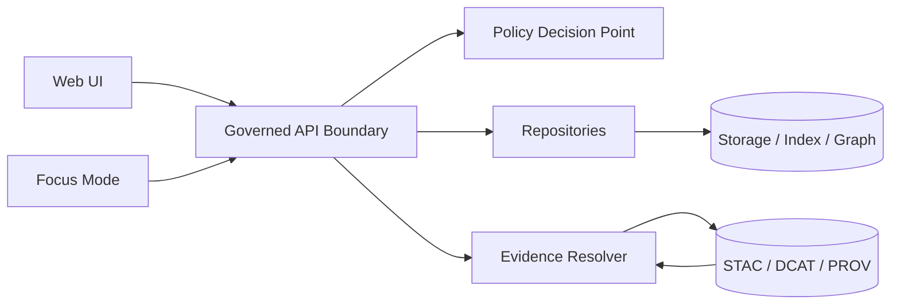

<!-- [KFM_META_BLOCK_V2]
doc_id: kfm://doc/8dc1128e-6d26-44b9-99e8-3aa98681ebe3
title: docs/api — Governed API Contracts
type: standard
version: v1
status: draft
owners: API team
created: 2026-02-24
updated: 2026-02-24
policy_label: public
related:
  - ../MASTER_GUIDE_v13.md
  - ../templates/TEMPLATE__API_CONTRACT_EXTENSION.md
  - ../../src/server/
tags: [kfm, api, contracts, governance, openapi, graphql]
notes:
  - Contract-first documentation hub for KFM’s governed APIs.
  - This file documents *contracts and policy expectations*, not implementation details.
[/KFM_META_BLOCK_V2] -->

# docs/api — Governed API Contracts

**Purpose:** Canonical documentation for KFM’s governed API boundary: **contracts**, **versioning**, **policy enforcement expectations**, and **evidence resolution**.


> NOTE  
> This directory is for **API documentation and contracts**. The **API implementation + contract definitions** live under `src/server/`.  
> If you change an endpoint, you must update the contract *and* the docs here.

---

## Quick navigation

- [What lives here](#what-lives-here)
- [Architecture and trust membrane](#architecture-and-trust-membrane)
- [Contract surfaces](#contract-surfaces)
- [Evidence resolution](#evidence-resolution)
- [Policy boundary expectations](#policy-boundary-expectations)
- [Versioning and compatibility](#versioning-and-compatibility)
- [Change process](#change-process)
- [Directory tree](#directory-tree)
- [Definition of done](#definition-of-done)

---

## What lives here

**Acceptable inputs**
- API **contracts** (OpenAPI and/or GraphQL schema) or pointers to their canonical locations.
- Endpoint documentation (purpose, inputs/outputs, error model, audit expectations).
- Compatibility notes and deprecation plans.
- Example requests/responses (sanitized; no secrets; no restricted coordinates).
- Policy notes that explain **what is enforced at the boundary** (with links to `policy/`).

**Exclusions**
- ❌ Implementation code (belongs in `src/server/`)
- ❌ Secrets, tokens, credentials, internal hostnames
- ❌ Restricted data or precise sensitive coordinates in examples
- ❌ “Undocumented behavior” that isn’t reflected in OpenAPI/GraphQL contracts

---

## Architecture and trust membrane

KFM treats the API boundary as a governed contract surface: clients do not “discover” behavior by trial and error—**the contract is the interface**.



**Key invariants**
- **Contract-first:** OpenAPI / GraphQL schema is a first-class artifact.  
- **Policy-gated:** policy checks happen *before* returning data or resolving evidence bundles.  
- **Evidence-bound:** Story/Focus claims must be traceable to resolvable evidence.

---

## Contract surfaces

| Surface | What it is | Primary artifact | Notes |
|---|---|---|---|
| REST API | Versioned REST endpoints | OpenAPI document | The OpenAPI definition is the contract. |
| GraphQL API | Optional GraphQL schema | `schema.graphql` (or equivalent) | If enabled, schema is versioned and documented here. |
| Evidence resolver | Turns citations into resolved bundles | Endpoint: `/api/v1/evidence/resolve` | **Publishing gate**: Story Nodes require resolvable citations. |

> TODO  
> Replace “Primary artifact” placeholders below once repo paths are confirmed:
> - `docs/api/openapi/v1.yaml` (or `src/server/openapi.yaml`)
> - `docs/api/graphql/schema.graphql` (or `src/server/graphql/schema.graphql`)

---

## Evidence resolution

KFM’s publishing gate requires that citations used in Story Nodes resolve through the evidence resolver.

**Publishing gate**
- All Story Node citations must resolve through:  
  `POST /api/v1/evidence/resolve`

**Story Node sidecar example (citations list)**
```json
{
  "citations": [
    { "ref": "dcat://noaa_ncei_storm_events@2026-02.abcd1234", "kind": "dcat" },
    { "ref": "prov://run/2026-02-20T12:34Z...", "kind": "prov" }
  ]
}
```

> TODO (contract requirement)  
> Document the resolver request/response schema here (and in OpenAPI):  
> - request: `citations[]`, caller context (auth), output format options  
> - response: resolved metadata + links, with policy redactions applied

---

## Policy boundary expectations

Policy enforcement points (PEPs) must exist in:
- **CI:** schema validation + policy tests block merges  
- **Runtime API:** policy checks before serving data  
- **Evidence resolver:** policy checks before resolving evidence and rendering bundles  
- **UI:** may display policy badges/notices, but UI does not decide policy

> NOTE  
> Deny-by-default is the baseline posture for sensitive/restricted materials. Any allowed public representation should be emitted as a separate generalized output (with provenance recorded).

---

## Versioning and compatibility

- **Backwards compatibility** is expected unless a version bump is declared.
- **Breaking changes** require:
  - new versioned endpoint path (or negotiation strategy), and
  - documented migration notes and sunset plan.

**Minimum rule**
- If you break the OpenAPI/GraphQL contract, you bump the API version.

---

## Change process

When adding or changing an endpoint:

1. **Write/Update the contract first**
   - OpenAPI: paths, schemas, auth, errors, audit fields
   - GraphQL (if applicable): schema changes + resolver expectations

2. **Fill out the API Contract Extension**
   - Use: `docs/templates/TEMPLATE__API_CONTRACT_EXTENSION.md`
   - Include: rationale, compatibility notes, policy impacts, evidence impacts

3. **Add/Update tests**
   - Contract tests (schema validation + golden request/response fixtures)
   - Policy tests (allow/deny fixtures for sensitive data paths and evidence resolver)

4. **Update docs**
   - This README (if structure/standards change)
   - Endpoint-level docs and examples

5. **Changelog / deprecation notes**
   - Include dates (start/end) and migration steps

---

## Directory tree

This is a recommended (not guaranteed) layout. If you add new docs, update this tree.

```text
docs/api/                                           # API docs (governed boundary + contracts + examples)
├─ README.md                                        # This file: boundary rules, versioning, and contract pointers
│
├─ openapi/                                         # OpenAPI specs by version (recommended)
│  └─ v1.yaml                                       # TODO: confirm actual location/filename
│
├─ graphql/                                         # Optional GraphQL schema(s) by version
│  └─ schema.graphql                                # TODO: confirm actual location/filename
│
├─ examples/                                        # Sanitized examples (no secrets; policy-safe)
│  ├─ rest/                                         # curl examples + request/response samples
│  └─ graphql/                                      # Query/mutation examples + response samples
│
└─ decisions/                                       # API change records (contract extensions / ADR-style notes)
   └─ YYYY-MM-DD__short_slug.md                     # One record per API change (what/why/compat impact)
```

---

## Definition of done

An API change is “done” only when:
- [ ] OpenAPI/GraphQL contract updated and validated
- [ ] Versioning decision recorded (breaking vs non-breaking)
- [ ] Policy impact assessed (esp. evidence resolver + sensitive datasets)
- [ ] Tests added/updated (contract + policy fixtures)
- [ ] Documentation updated (endpoint docs + examples)
- [ ] Any Story/Focus dependency checked (citations still resolve)
- [ ] No restricted coordinates or sensitive details leaked in examples

---

[↑ Back to top](#docsapi--governed-api-contracts)
