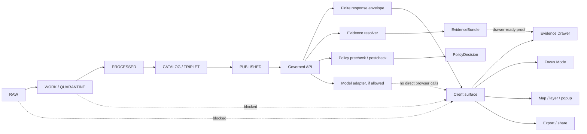

<!-- [KFM_META_BLOCK_V2]
doc_id: TODO: assign kfm://doc/<uuid>
title: Client Verification
type: standard
version: v1
status: draft
owners: TODO: verify owner
created: 2026-04-26
updated: 2026-04-26
policy_label: TODO: verify policy label
related: [docs/architecture/CLIENT_VERIFICATION.md, TODO: verify docs/architecture/README.md, TODO: verify governed API doc path, TODO: verify UI boundary doc path, TODO: verify policy gate doc path]
tags: [kfm, architecture, client-verification, governed-api, trust-membrane, evidence, policy]
notes: [Draft authored from attached KFM corpus with no mounted checkout; implementation paths, route names, schema homes, test commands, workflow names, owners, and policy label require repository verification]
[/KFM_META_BLOCK_V2] -->

# Client Verification

<p align="center">
  <strong>Verifying that KFM clients stay behind the trust membrane.</strong>
</p>

<p align="center">
  
  
  
  
  
</p>

<p align="center">
  <a href="#scope">Scope</a> ·
  <a href="#client-trust-membrane">Trust membrane</a> ·
  <a href="#verification-matrix">Verification matrix</a> ·
  <a href="#validation-plan">Validation</a> ·
  <a href="#rollback-and-correction">Rollback</a>
</p>

> [!IMPORTANT]
> This document defines the `PROPOSED` client-verification contract for KFM. It is not proof that the current repository already contains these schemas, tests, routes, workflows, or runtime gates. Verify against the mounted checkout before claiming implementation.

| Field | Value |
|---|---|
| Status | `draft` |
| Owners | `TODO: verify owner` |
| Evidence mode | `CORPUS_ONLY` draft; no mounted checkout verified during authoring |
| Repo fit | `docs/architecture/CLIENT_VERIFICATION.md` |
| Applies to | Public UI, steward UI, MapLibre shell, Evidence Drawer, Focus Mode, story/export surfaces, generated clients, diagnostics surfaces |
| Public posture | Cite-or-abstain; fail closed on unresolved evidence, rights, sensitivity, review, release, or policy state |
| Verification status | `PROPOSED`; tests and commands must be adapted to repo-native tooling |

## Scope

Client verification is the architecture and test discipline that proves KFM clients do not become ungoverned truth surfaces.

A KFM client may render, filter, navigate, submit scoped requests, display released payloads, and surface trust state. A KFM client must not bypass evidence resolution, policy gates, promotion state, release manifests, or governed API envelopes.

| This document verifies | This document does not verify |
|---|---|
| Client surfaces use governed APIs and released artifacts. | It does not prove current implementation behavior. |
| Browser/mobile/story/export paths avoid RAW, WORK, QUARANTINE, canonical stores, and direct model runtimes. | It does not replace backend policy enforcement. |
| Evidence Drawer, Focus Mode, map popups, exports, and review surfaces preserve visible trust state. | It does not authorize public release. |
| Negative states are visible and testable. | It does not define source rights, steward approvals, or live connector terms. |
| Client verification emits reviewable reports and fixtures. | It does not make generated language or rendered maps sovereign truth. |

## Source basis and status

| Source family | Role in this document | Status used here |
|---|---|---|
| KFM Components Pass 23 | Inspectable claims, cite-or-abstain, EvidenceRef/EvidenceBundle, finite envelopes, MapLibre and AI boundaries | `CORPUS-CONFIRMED doctrine`; implementation still `UNKNOWN` |
| KFM MapLibre UI Architecture | Map-first shell, Evidence Drawer, Focus Mode, trust-visible state, renderer boundary | `CONFIRMED doctrine`; realization `PROPOSED` |
| Ollama / Ubuntu guide | Model runtime behind governed API; clients must not talk directly to model runtime, canonical stores, or unpublished artifacts | `CONFIRMED doctrine`; operational wiring `PROPOSED` |
| Whole UI + Governed AI expansion | Browser/client boundary, schema-first increments, no direct RAW/WORK/QUARANTINE/canonical/model access | `LINEAGE / PROPOSED architecture` |
| Pipeline Living Manual v0.2 | Repository build order, validation posture, security/exposure posture, CI unknowns | `LINEAGE / PROPOSED plan`; current repo implementation `UNKNOWN` |

## Client trust membrane

The trust membrane is the line between normal client behavior and protected KFM truth machinery.



> [!CAUTION]
> The client is never the source of truth. A clean map, fluent Focus answer, polished story, or attractive export is only valid when it remains reconstructable to released evidence, source role, policy posture, review state, release state, and correction lineage.

## Definitions

| Term | Meaning |
|---|---|
| Client | Any browser, generated SDK, mobile surface, story player, export worker, reviewer console, diagnostic page, or script that requests or renders KFM public/steward-facing content. |
| Consequential claim | A public or steward-visible statement that asserts something about a place, time, source, event, entity, layer, model, observation, derived result, or policy-sensitive object. |
| Governed API | Backend trust boundary that applies release scope, policy, evidence resolution, response envelopes, and audit joins before returning client-consumable payloads. |
| Released payload | Payload that is eligible for client use because evidence, source role, rights, sensitivity, review, release, and policy checks have passed or produced a finite negative outcome. |
| Direct bypass | Any client path that reads RAW, WORK, QUARANTINE, canonical/internal stores, direct model runtimes, private object stores, vector indexes, graph stores, unpublished candidates, credentials, or internal service handles outside governed envelopes. |
| Verification report | A reviewable artifact recording checked clients, target classes, findings, outcomes, evidence, command/run references, and rollback guidance. |

## Verification rule

A client path is acceptable only when all required conditions are true:

1. The client request is scoped by place, time, layer, source, role, or declared operation where the surface requires scope.
2. The request goes through a governed API or a released artifact endpoint approved for client use.
3. The returned object is a finite envelope, released manifest, released layer descriptor, or drawer-ready payload.
4. Any consequential claim can resolve to EvidenceRef/EvidenceBundle or returns a safe negative state.
5. Rights, sensitivity, review, freshness, release, correction, and source-role state are visible where they affect interpretation.
6. The client cannot directly access protected lifecycle stages, canonical stores, model runtimes, credentials, or unpublished data.
7. Client telemetry, logs, screenshots, examples, and exports do not leak restricted evidence, prompts, secrets, exact sensitive geometry, or private endpoint details.

## Verification outcomes

Client verification uses finite outcomes. Do not convert an unevaluated client into a passing client.

| Outcome | Meaning | Release consequence |
|---|---|---|
| `PASS` | The checked client path satisfies the rule and has supporting test or inspection evidence. | Eligible to proceed, subject to other release gates. |
| `WARN` | The path is probably safe but has a non-blocking gap, documentation issue, or low-risk inconsistency. | Fix before publication when practical; record in verification backlog. |
| `FAIL` | The path violates a client-verification rule. | Block merge/release. |
| `BLOCKED` | The checker could not evaluate because required schema, repo, route, policy, auth, or runtime evidence was unavailable. | Treat as not releasable until resolved. |
| `UNKNOWN` | Current evidence is insufficient. | Do not claim verification. |

> [!WARNING]
> `UNKNOWN` and `BLOCKED` are not soft passes. KFM fails closed when client safety, evidence, release, policy, or sensitivity posture cannot be verified.

## Client surface inventory

| Surface | Allowed behavior | Must never do | Minimum verification |
|---|---|---|---|
| Public map shell | Render released layers and drawer-ready feature summaries. | Read RAW/WORK/QUARANTINE, canonical stores, unreviewed candidate layers, or raw source APIs as truth. | Network allowlist, layer manifest validation, drawer-link test. |
| MapLibre style/runtime | Consume released tile/style/source definitions. | Treat renderer, style JSON, or tile cache as sovereign truth. | Style source scan; released manifest and digest linkage. |
| Layer panel / legend | Display source role, policy, rights, freshness, review, sensitivity, and release cues. | Hide generalized/redacted/restricted state. | Payload fixture and accessibility check. |
| Map popup / selection summary | Show bounded claim summary and Evidence Drawer entry point. | Display unsupported claim text from arbitrary feature properties. | Claim envelope or drawer payload validation. |
| Evidence Drawer | Resolve and render evidence, source role, policy, review, freshness, release, correction, and restriction state. | Behave as optional tooltip for consequential claims. | Success, missing, stale, restricted, withdrawn, and checksum-mismatch fixtures. |
| Focus Mode | Submit scoped query to governed backend; render finite outcomes. | Act as a free-form chatbot, direct model client, or hidden evidence authority. | No-direct-model-client check; response envelope and citation coverage fixtures. |
| Story / dossier | Preserve evidence, release, correction, and policy context with narrative. | Turn narrative blocks into uncited authoritative statements. | Story payload validation and publish-deny fixture. |
| Export / share | Carry trust metadata and public-safe transforms with outward artifact. | Strip trust cues, rights, sensitivity, correction, or generalization context. | Export manifest and denial tests. |
| Review / steward surface | Role-gated inspection, diffs, obligations, decisions, and correction workflows. | Become a hidden alternative truth system with weaker rules. | Auth/role gate check, candidate-state labeling, action receipt test. |
| Diagnostics / admin | Private troubleshooting with redaction, auth, rate limits, and audit logs. | Normalize public access to secrets, debug routes, protected stores, or model endpoints. | Deny-by-default route scan and secret-leak check. |

## Network target classes

| Target class | Client status | Notes |
|---|---|---|
| Governed API | `ALLOW` when authenticated/authorized and envelope-valid | Primary client path. |
| Released tile/style/static artifact endpoint | `ALLOW` when tied to manifest, digest, source role, policy, and release state | Delivery artifact only; not truth. |
| Public documentation assets | `ALLOW` when non-sensitive | No private endpoints or secrets. |
| RAW / WORK / QUARANTINE lifecycle paths | `DENY` | Always blocked for ordinary clients. |
| Canonical database, graph store, object store, artifact tree, vector index, or cache | `DENY` unless a documented private maintenance tool is explicitly verified | Public/steward UI uses governed API instead. |
| Model runtime endpoint | `DENY` for all browser/ordinary clients | Model adapters sit behind governed API. |
| Unpublished candidate data | `DENY` for public clients; restricted steward access only when role-gated and labeled | Candidate state must be visible. |
| External live source APIs | `DENY` as public truth path unless explicitly approved as a released, policy-safe client-side source | Prefer backend source registry and release process. |
| Credentials, tokens, signed internal URLs, private endpoints | `DENY` | Never expose in client code, examples, fixtures, screenshots, telemetry, or docs. |

## Verification matrix

| Check ID | Check | Expected result | Blocking? |
|---|---|---|---|
| `CV-001` | Client route inventory exists for public, steward, review, export, story, Focus, and diagnostics surfaces. | Every client surface has owner/status/TODO placeholder. | Yes |
| `CV-002` | Browser/network scan finds no RAW/WORK/QUARANTINE/canonical/model targets. | No disallowed URLs, imports, environment references, or direct fetches. | Yes |
| `CV-003` | MapLibre styles consume only approved released sources or governed endpoints. | No raw source URLs, candidate layers, unmanifested tiles, or unmanaged external APIs. | Yes |
| `CV-004` | Every consequential popup/claim has Evidence Drawer path or safe negative state. | Drawer payload exists or response abstains/denies/errors. | Yes |
| `CV-005` | Focus Mode renders finite outcomes only. | `ANSWER`, `ABSTAIN`, `DENY`, or `ERROR`; no raw model text outside envelope. | Yes |
| `CV-006` | Citation/evidence coverage is validated before rendering answers, stories, and exports. | Unresolved citations become `ABSTAIN`, `DENY`, or `ERROR`. | Yes |
| `CV-007` | Rights, sensitivity, source role, review, freshness, release, and correction states remain visible where meaningful. | Trust cues appear in UI payload fixtures and export manifests. | Yes |
| `CV-008` | Review/steward clients are role-gated and label candidate/unpublished evidence. | Candidate state cannot masquerade as published truth. | Yes |
| `CV-009` | Client telemetry is redacted. | No raw evidence, restricted geometry, secrets, prompts, full EvidenceBundle copies, or private endpoints. | Yes |
| `CV-010` | Feature flags and kill switches default safe. | New client surfaces can be disabled without weakening evidence browsing. | Yes |
| `CV-011` | Export/share preserves trust metadata or denies. | Outward artifacts include evidence/policy/release/correction context. | Yes |
| `CV-012` | Accessibility does not hide trust state. | Keyboard and screen-reader flows expose negative states, evidence links, and policy cues. | Yes |
| `CV-013` | Docs and runbooks explain verification and rollback. | Material behavior changes update architecture docs and rollback notes. | Yes |
| `CV-014` | Local/exposed deployment boundaries are checked. | No public direct model/runtime/admin/debug route; auth/CORS/rate-limit assumptions documented. | Yes when deployment is in scope |

## Static verification strategy

Static checks should run before runtime or UI smoke tests. They are cheap, deterministic, and good at finding bypasses.

Proposed static scans:

- Client network target scan: `fetch`, `axios`, generated clients, WebSocket targets, EventSource targets, tile URLs, style URLs, environment variables, service-worker caches.
- Import boundary scan: UI code must not import internal data-store, model-runtime, RAW/WORK/QUARANTINE, pipeline, or maintenance-only modules.
- Style/source scan: MapLibre sources must point to released layer descriptors, governed tile endpoints, or approved public-safe artifacts.
- Secret scan: no tokens, private endpoints, model host URLs, signed internal URLs, or credentials in client code, fixtures, docs, screenshots, or examples.
- Fixture scan: invalid negative-state fixtures exist for unsupported, restricted, stale, missing, withdrawn, and citation-invalid responses.

```bash
# Illustrative only — NEEDS VERIFICATION against mounted repo conventions.
python tools/ci/client_verification_check.py --root .
python tools/ci/no_direct_model_client_check.py --root .
python tools/ci/no_raw_public_path_check.py --root .
python tools/validators/schema_validate.py tests/fixtures/client-verification/
```

> [!NOTE]
> Business logic should live in validators/tools, not only in workflow YAML. Workflow names, command names, package manager, and test runner remain `NEEDS VERIFICATION`.

## Runtime verification strategy

Runtime checks should use mock or fixture-backed environments before live bindings.

| Runtime test | What it proves |
|---|---|
| Network interception e2e smoke | Browser calls only allowed target classes. |
| Focus unsupported-question fixture | Missing evidence produces `ABSTAIN`, not fluent fallback. |
| Focus restricted-evidence fixture | Policy block produces `DENY` with safe explanation. |
| Drawer missing-bundle fixture | Unresolved EvidenceRef does not render as normal claim. |
| Drawer stale/withdrawn fixture | Freshness and withdrawal state are visible. |
| Export blocked fixture | Export denies when trust metadata cannot travel. |
| Layer source fixture | MapLibre renders released layer only; no raw external source call. |
| Review candidate fixture | Steward surface labels candidate/unpublished state and blocks public-like export. |
| Telemetry fixture | Restricted geometry, raw prompt, and private endpoint values are redacted. |

## Proposed report shape

The exact schema home is `NEEDS VERIFICATION`. The following shape is a proposed contract target for a future `ClientVerificationReport`.

```yaml
client_verification_report:
  schema_version: v1
  report_id: TODO
  checked_at: TODO
  repo_ref: TODO
  verifier: TODO
  evidence_mode: TODO
  overall_outcome: UNKNOWN
  checked_surfaces:
    - surface_id: public_map_shell
      surface_type: map
      owner: TODO
      outcome: UNKNOWN
      checked_targets:
        - governed_api
        - released_layer_manifest
      blocked_targets:
        - raw
        - work
        - quarantine
        - canonical_store
        - model_runtime
      findings: []
  policy:
    fail_closed: true
    public_raw_access_allowed: false
    direct_model_client_allowed: false
  artifacts:
    fixtures: []
    logs: []
    screenshots: []
    receipts: []
  rollback:
    feature_flag: TODO
    revert_ref: TODO
```

## Evidence Drawer requirements

The Evidence Drawer is the required human-facing expression of evidence resolution. It should appear one hop away from every consequential claim.

Minimum drawer payload fields:

| Field | Why it matters |
|---|---|
| `claim_ref` or `selection_ref` | Identifies what the drawer supports. |
| `evidence_bundle_ref` | Resolves support beyond a pasted URL. |
| `source_role` | Distinguishes authority, observation, model, mirror, document, derivative, or context. |
| `rights_status` | Prevents accidental redistribution. |
| `sensitivity_status` | Explains redaction, generalization, restriction, or safe stubs. |
| `review_state` | Shows draft, reviewed, promoted, stale, superseded, withdrawn, or correction state. |
| `release_state` | Confirms the payload is eligible for the current audience. |
| `freshness` | Shows recency, staleness, or temporal basis. |
| `spatial_basis` | Clarifies CRS, support, precision, generalization, or geometry transform where relevant. |
| `temporal_basis` | Clarifies valid time, as-of time, observation time, model run time, or publication time. |
| `citation_validation` | Shows whether the claim coverage passed. |
| `correction_ref` | Keeps correction lineage visible. |
| `negative_state` | Allows unavailable, denied, stale, missing, or withdrawn evidence to render honestly. |

## Focus Mode requirements

Focus Mode is a client surface, not a model surface.

Focus requests should:

- carry explicit place/time/source/layer/audience scope when needed;
- call only the governed backend;
- never call a model runtime directly;
- never send RAW, WORK, QUARANTINE, candidate, restricted, or unpublished evidence directly from the browser;
- receive a finite `RuntimeResponseEnvelope` or equivalent governed response;
- display `ANSWER`, `ABSTAIN`, `DENY`, or `ERROR`;
- keep Evidence Drawer and citation validation one hop away;
- show denial or abstain explanations safely;
- avoid raw model output, hidden chain-of-thought, or model confidence as proof.

## MapLibre-specific requirements

MapLibre is a renderer and interaction engine inside the governed shell. It is not the trust source.

MapLibre verification should check:

- style JSON sources are approved and released;
- layer definitions include or resolve to `LayerManifest` / `GeoManifest` / release metadata where applicable;
- external source URLs are not used as silent truth paths;
- source/layer config does not embed secrets or private endpoints;
- feature-state and global-state are not used to hide review, release, or sensitivity state;
- rendered tiles, PMTiles, COGs, GeoJSON, vector tiles, or cached descriptors remain delivery artifacts;
- feature click paths request drawer payloads through governed APIs rather than trusting arbitrary feature properties.

## Review and steward clients

Steward clients may reveal more detail than public clients, but they do not get weaker evidence law.

| Review concern | Requirement |
|---|---|
| Candidate evidence | Must be visibly labeled as candidate, draft, quarantined, or unpublished. |
| Approval actions | Must emit review or decision receipts where release significance exists. |
| Policy-significant actions | Must remain role-gated and auditable. |
| Corrections | Must preserve correction lineage and rollback references. |
| Sensitive geometry | Must remain exact only where role, purpose, source terms, and policy allow. |
| Public preview | Must use the same public-safe transform and trust metadata as release artifacts. |

## Validation plan

1. **Repo inventory**
   - Verify mounted checkout, branch, dirty state, package manager, UI framework, backend framework, schema home, workflow paths, existing client surfaces, and current tests.
2. **Contract inventory**
   - Locate or create schema homes for runtime envelopes, Evidence Drawer payloads, Focus responses, layer manifests, policy decisions, release manifests, and client verification reports.
3. **Fixture wave**
   - Add valid and invalid fixtures for allowed client paths, disallowed targets, negative states, sensitive locations, stale evidence, missing EvidenceBundle, withdrawn release, and direct model-call attempts.
4. **Static checks**
   - Scan client code, styles, environment config, generated clients, and docs for disallowed targets, secrets, private endpoints, and direct model runtime access.
5. **Mock runtime checks**
   - Run e2e or component tests with mock governed API responses before live source/API binding.
6. **Release dry run**
   - Confirm the client can render only released payloads and preserves evidence/policy/review/correction state through export/share.
7. **Security boundary check**
   - Verify auth, CORS, reverse proxy, VPN, rate limits, logs, model runtime isolation, and admin/debug route privacy when deployment is in scope.

## Definition of Done

- [ ] Mounted repo inventory is attached or linked.
- [ ] Client route/surface inventory exists.
- [ ] Network target allowlist and denylist are declared.
- [ ] No browser/ordinary client direct path to RAW, WORK, QUARANTINE, canonical stores, graph stores, object stores, vector indexes, model runtimes, unpublished candidates, credentials, or private endpoints.
- [ ] Evidence Drawer payload contract exists or is explicitly marked `TODO`.
- [ ] Focus response envelope contract exists or is explicitly marked `TODO`.
- [ ] Layer/style/source manifest validation exists or is explicitly marked `TODO`.
- [ ] Negative-state fixtures include `ABSTAIN`, `DENY`, and `ERROR`.
- [ ] Citation/evidence coverage is tested for consequential claims.
- [ ] Rights, sensitivity, freshness, review, release, and correction state are visible in fixtures.
- [ ] Export/share either carries trust metadata or denies.
- [ ] Review/steward surfaces are role-gated and label candidate/unpublished state.
- [ ] Telemetry and logs avoid secrets, prompts, restricted geometry, and private endpoints.
- [ ] Local/exposed deployment assumptions are verified or marked `NEEDS VERIFICATION`.
- [ ] Rollback path is documented.
- [ ] Documentation was updated with any material behavior change.

## Rollback and correction

Client-verification rollback should preserve evidence browsing and prevent unsafe exposure.

| Change type | Preferred rollback |
|---|---|
| New UI panel or route | Disable feature flag; keep existing governed browsing intact. |
| New Focus client path | Disable Focus client route/panel; leave Evidence Drawer and map layers available. |
| Bad layer/source config | Revert layer manifest; invalidate derived cache where needed; restore previous released manifest. |
| Bad schema | If unreleased, revert PR. If released, deprecate with successor schema and compatibility note. |
| Bad export/share behavior | Disable export/share surface until trust metadata travels or denial is restored. |
| Direct model/runtime exposure | Disable route, block network path, rotate exposed secrets if any, and record incident/correction. |
| Published client misinformation | Issue correction notice, preserve prior release ref, and link corrected drawer/export/story state. |

## Open verification backlog

| Item | Why it matters |
|---|---|
| Actual repo topology | Required before paths, commands, and workflows can be claimed. |
| Schema-home authority | Avoids duplicate `contracts/` vs `schemas/` truth. |
| Existing generated client strategy | Determines whether checks scan generated clients, hand-written clients, or both. |
| Current UI framework | Determines test runner and component fixture strategy. |
| Current MapLibre integration path | Determines style/source scan location. |
| Existing governed API routes | Required before route names or DTOs can be stated. |
| Existing Evidence Drawer and Focus payloads | Required before compatibility work. |
| Auth, CORS, reverse proxy, VPN, and rate-limit posture | Required before exposed-local deployment claims. |
| CODEOWNERS and branch protection | Required before enforcement claims. |
| Existing telemetry/logging | Required before redaction and privacy claims. |
| Current release/promotion artifacts | Required before export/share and release dry-run checks. |

<details>
<summary>Appendix — proposed client-verification artifact families</summary>

| Family | Proposed role |
|---|---|
| `ClientSurfaceManifest` | Declares public/steward/review/export/client surfaces and owners. |
| `ClientRouteInventory` | Lists UI routes, generated client methods, network targets, and trust requirements. |
| `NetworkTargetPolicy` | Allow/deny classes for browser and ordinary clients. |
| `ClientVerificationReport` | Records checks, outcomes, evidence, and rollback notes. |
| `EvidenceDrawerPayload` | Drawer-ready trust payload for claims and layers. |
| `RuntimeResponseEnvelope` | Finite governed response envelope for Focus and related API surfaces. |
| `LayerManifest` / `GeoManifest` | Released map delivery and artifact-integrity metadata. |
| `PolicyDecision` | Records allow/deny/abstain/error posture and obligations. |
| `ReleaseManifest` | Confirms released artifact scope and rollback target. |
| `CorrectionNotice` | Records public correction or withdrawal lineage. |

</details>
