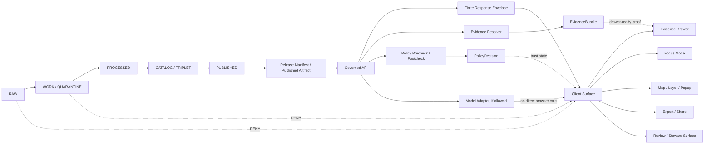

<!-- [KFM_META_BLOCK_V2]
doc_id: TODO(owner): assign kfm://doc/<uuid>
title: Client Verification
type: standard
version: v1
status: draft
owners: "OWNER_TBD — verify responsible maintainer/team"
created: 2026-04-26
updated: 2026-05-03
policy_label: "TODO(policy): verify public|restricted"
related: [docs/architecture/CLIENT_VERIFICATION.md, "TODO(path): verify docs/architecture/README.md", "TODO(path): verify governed API contract path", "TODO(path): verify UI boundary doc path", "TODO(path): verify policy gate doc path"]
tags: [kfm, architecture, client-verification, governed-api, trust-membrane, evidence, policy, ui, focus-mode, evidence-drawer]
notes: ["Revised from attached Markdown on 2026-05-03.", "UNKNOWN repo implementation depth: no mounted KFM checkout, runtime logs, workflows, dashboards, or emitted proof objects were verified during this authoring pass.", "Paths, commands, schema homes, owners, policy labels, test runners, package managers, and route names remain NEEDS VERIFICATION unless confirmed in a mounted checkout."]
[/KFM_META_BLOCK_V2] -->

# Client Verification

<p align="center">
  <strong>Verifying that KFM clients stay behind the trust membrane.</strong>
</p>

<p align="center">
  
  
  
  
  
</p>

<p align="center">
  <a href="#scope">Scope</a> ·
  <a href="#repo-fit">Repo fit</a> ·
  <a href="#evidence-basis">Evidence</a> ·
  <a href="#client-trust-membrane">Trust membrane</a> ·
  <a href="#verification-matrix">Matrix</a> ·
  <a href="#validation-plan">Validation</a> ·
  <a href="#rollback-and-correction">Rollback</a>
</p>

> [!IMPORTANT]
> This document defines a **PROPOSED** client-verification contract for KFM. It is not proof that the current repository already contains these schemas, tests, routes, workflows, enforcement hooks, dashboards, or runtime gates. Verify against a mounted checkout before claiming implementation.

| Field | Value |
|---|---|
| Status | `draft` |
| Owner | `OWNER_TBD — verify responsible maintainer/team` |
| Proposed path | `docs/architecture/CLIENT_VERIFICATION.md` |
| Evidence mode | `CORPUS_ONLY + visible workspace authoring`; mounted target repo not verified |
| Implementation depth | `UNKNOWN` until repo files, tests, workflows, manifests, logs, or emitted artifacts are inspected |
| Applies to | Public UI, steward UI, MapLibre shell, Evidence Drawer, Focus Mode, story/export surfaces, generated clients, review console, diagnostics/admin surfaces |
| Public posture | Cite-or-abstain; fail closed on unresolved evidence, rights, sensitivity, review, release, correction, freshness, or policy state |
| Verification status | `PROPOSED`; tests, commands, schema homes, and route names must be adapted to repo-native tooling |

---

## Scope

Client verification is the architecture and test discipline that proves KFM clients do not become ungoverned truth surfaces.

A KFM client may render, filter, navigate, submit scoped requests, display released payloads, and surface trust state. A KFM client must not bypass evidence resolution, policy gates, promotion state, release manifests, correction state, or governed API envelopes.

| This document verifies | This document does not verify |
|---|---|
| Client surfaces should use governed APIs and released artifacts. | It does not prove current implementation behavior. |
| Browser, mobile, story, export, generated-client, and diagnostics paths should avoid RAW, WORK, QUARANTINE, canonical stores, and direct model runtimes. | It does not replace backend policy enforcement. |
| Evidence Drawer, Focus Mode, map popups, exports, and review surfaces should preserve visible trust state. | It does not authorize public release. |
| Negative states should be visible and testable. | It does not define source rights, steward approvals, or live connector terms. |
| Client verification should emit reviewable reports and fixtures. | It does not make generated language, rendered maps, vector indexes, graph projections, or tile caches sovereign truth. |

## Repo fit

> [!NOTE]
> The proposed path is a repo-placement assumption. Confirm the actual docs tree, adjacent architecture docs, schema home, test runner, package manager, route layout, and workflow conventions before committing.

| Repo-fit question | Draft answer |
|---|---|
| Proposed file path | `docs/architecture/CLIENT_VERIFICATION.md` |
| Upstream doctrine | KFM trust membrane, governed API doctrine, MapLibre UI doctrine, governed AI doctrine, pipeline lifecycle law |
| Downstream users | UI maintainers, API maintainers, policy reviewers, release reviewers, documentation maintainers, source stewards |
| Accepted inputs | Client surface manifests, route inventories, generated client inventories, MapLibre style/source manifests, Focus/Evidence Drawer fixtures, runtime envelopes, release manifests, policy decisions, validation reports |
| Exclusions | RAW/WORK/QUARANTINE data, canonical/internal stores, source credentials, private model endpoints, unpublished candidates, unrestricted exact sensitive geometry, unreviewed public narratives |
| Adjacent docs to verify | `docs/architecture/README.md`, governed API docs, MapLibre/UI boundary docs, policy gate docs, release/promotion docs, runbooks |
| Required repo confirmation | Mounted checkout, branch/dirty state, actual owners, schema home, package manager, test runner, workflow names, route names, existing payload contracts |

## Evidence basis

| Source family | Status in this document | Supports | Limits |
|---|---|---|---|
| Attached `Pasted markdown.md` baseline | `CONFIRMED baseline` | Existing Client Verification structure, trust membrane, verification matrix, Evidence Drawer, Focus Mode, MapLibre, validation, rollback sections | Does not prove repo implementation |
| KFM Components / Pass 24 lineage | `CORPUS-CONFIRMED doctrine` | Inspectable-claim posture, artifactization, EvidenceRef/EvidenceBundle, finite envelopes, cite-or-abstain, rollback/correction families | Does not prove current repo runtime behavior |
| KFM MapLibre operating/UI manuals | `CONFIRMED doctrine / PROPOSED implementation` | Map-first shell, renderer boundary, Evidence Drawer, Focus Mode, trust-visible state, MapLibre-as-renderer-not-truth | Does not prove current UI path or package version |
| Ollama / governed AI guide | `CONFIRMED doctrine / PROPOSED realization` | Model runtime behind governed API; no direct browser/model path; finite response envelopes; citation validation; Focus as evidence-bounded surface | Does not prove model adapter wiring or runtime hardening |
| Whole UI + Governed AI expansion reports | `LINEAGE / PROPOSED architecture` | Browser/client boundary, schema-first increments, generated-client concerns, no direct RAW/WORK/QUARANTINE/canonical/model access | Does not prove current implementation |
| Pipeline Living Implementation Manual | `LINEAGE / PROPOSED plan` | Lifecycle law, validation posture, release/promotion posture, security/exposure posture, repo-unavailable truth boundary | Does not prove current CI, dashboards, or emitted artifacts |
| Implementation reference / public repo reports | `LINEAGE / NEEDS VERIFICATION` | Signals that some repo surfaces may exist and should be reconciled with doctrine | Does not replace mounted checkout inspection, runtime logs, workflow results, or branch-state evidence |

## Client trust membrane

The trust membrane is the line between normal client behavior and protected KFM truth machinery.



> [!CAUTION]
> The client is never the source of truth. A clean map, fluent Focus answer, polished story, attractive export, dashboard, screenshot, or generated summary is valid only when it remains reconstructable to released evidence, source role, policy posture, review state, release state, and correction lineage.

## Definitions

| Term | Meaning |
|---|---|
| Client | Any browser, generated SDK, mobile surface, story player, export worker, review console, diagnostics page, admin page, or script that requests or renders KFM public/steward-facing content. |
| Consequential claim | A public or steward-visible statement that asserts something about a place, time, source, event, entity, layer, model, observation, derived result, legal/policy state, or sensitivity-bearing object. |
| Governed API | Backend trust boundary that applies release scope, policy, evidence resolution, response envelopes, obligations, and audit joins before returning client-consumable payloads. |
| Released payload | Payload eligible for the current audience because evidence, source role, rights, sensitivity, review, release, and policy checks have passed or produced a finite negative outcome. |
| Direct bypass | Any client path that reads RAW, WORK, QUARANTINE, canonical/internal stores, model runtimes, private object stores, vector indexes, graph stores, unpublished candidates, credentials, or internal service handles outside governed envelopes. |
| Evidence Drawer | Human-facing trust surface that resolves a claim or selected object to evidence, source role, rights, sensitivity, review, release, freshness, correction, and negative-state information. |
| Focus Mode | Evidence-bounded synthesis surface. It submits scoped requests to a governed backend and renders finite outcomes. It is not a free-form chatbot and not a direct model client. |
| Verification report | Reviewable artifact recording checked clients, target classes, findings, outcomes, evidence, command/run references, fixtures, and rollback guidance. |

## Verification rule

A client path is acceptable only when all required conditions are true:

1. The request is scoped by place, time, layer, source, audience, role, or declared operation where the surface requires scope.
2. The request goes through a governed API or released artifact endpoint approved for that client class.
3. The returned object is a finite envelope, released manifest, released layer descriptor, or drawer-ready payload.
4. Any consequential claim resolves to EvidenceRef/EvidenceBundle or returns a safe negative state.
5. Rights, sensitivity, review, freshness, release, correction, and source-role state are visible where they affect interpretation.
6. The client cannot directly access protected lifecycle stages, canonical stores, model runtimes, credentials, unpublished candidates, or private service handles.
7. Telemetry, logs, screenshots, examples, demos, exports, and docs do not leak restricted evidence, prompts, secrets, exact sensitive geometry, signed internal URLs, or private endpoint details.
8. If verification is incomplete, the path remains `UNKNOWN` or `BLOCKED`; it must not be treated as passing.

## Verification outcomes

Client verification uses finite outcomes. Do not convert an unevaluated client into a passing client.

| Outcome | Meaning | Release consequence |
|---|---|---|
| `PASS` | The checked client path satisfies the rule and has supporting test, inspection, or runtime evidence. | Eligible to proceed, subject to other release gates. |
| `WARN` | The path is probably safe but has a non-blocking gap, documentation issue, stale fixture, or low-risk inconsistency. | Fix before publication when practical; record in verification backlog. |
| `FAIL` | The path violates a client-verification rule. | Block merge/release. |
| `BLOCKED` | The checker could not evaluate because required schema, repo, route, policy, auth, fixture, or runtime evidence was unavailable. | Treat as not releasable until resolved. |
| `UNKNOWN` | Current evidence is insufficient to classify. | Do not claim verification. |

> [!WARNING]
> `UNKNOWN` and `BLOCKED` are not soft passes. KFM fails closed when client safety, evidence, release, policy, rights, sensitivity, or exposed-local deployment posture cannot be verified.

## Client surface inventory

| Surface | Allowed behavior | Must never do | Minimum verification |
|---|---|---|---|
| Public map shell | Render released layers and drawer-ready feature summaries. | Read RAW/WORK/QUARANTINE, canonical stores, unreviewed candidates, or raw source APIs as truth. | Network allowlist, layer manifest validation, drawer-link test. |
| MapLibre style/runtime | Consume released tile/style/source definitions. | Treat renderer, style JSON, tile cache, PMTiles, COGs, GeoJSON, or vector tiles as sovereign truth. | Style/source scan; released manifest and digest linkage. |
| Layer panel / legend | Display source role, policy, rights, freshness, review, sensitivity, release, and correction cues. | Hide generalized, redacted, restricted, stale, superseded, or withdrawn state. | Payload fixture and accessibility check. |
| Map popup / selection summary | Show bounded claim summary and Evidence Drawer entry point. | Display unsupported claim text from arbitrary feature properties. | Claim envelope or drawer payload validation. |
| Evidence Drawer | Resolve and render evidence, source role, policy, review, freshness, release, correction, and restriction state. | Behave as optional decoration for consequential claims. | Success, missing, stale, restricted, withdrawn, and checksum-mismatch fixtures. |
| Focus Mode | Submit scoped query to governed backend; render finite outcomes. | Act as free-form chatbot, direct model client, hidden evidence authority, or publication authority. | No-direct-model-client check; response envelope and citation coverage fixtures. |
| Story / dossier | Preserve evidence, release, correction, and policy context with narrative. | Turn narrative blocks into uncited authoritative statements. | Story payload validation and publish-deny fixture. |
| Export / share | Carry trust metadata and public-safe transforms with outward artifact. | Strip trust cues, rights, sensitivity, correction, generalization, or source-role context. | Export manifest and denial tests. |
| Review / steward surface | Role-gated inspection, diffs, obligations, decisions, and correction workflows. | Become a hidden alternative truth system with weaker rules. | Auth/role gate check, candidate-state labeling, action receipt test. |
| Diagnostics / admin | Private troubleshooting with redaction, auth, rate limits, and audit logs. | Normalize public access to secrets, debug routes, protected stores, or model endpoints. | Deny-by-default route scan and secret-leak check. |
| Generated clients / SDKs | Call approved governed endpoints with typed envelopes. | Generate convenience methods for direct internal stores, model endpoints, or unpublished candidates. | Generated-client route inventory and denylist scan. |
| Service worker / cache | Cache released public-safe artifacts according to manifest rules. | Cache restricted evidence, private endpoints, stale candidate payloads, tokens, or raw model output. | Cache manifest and storage inspection. |

## Network target policy

| Target class | Client status | Notes |
|---|---|---|
| Governed API | `ALLOW` when authenticated/authorized and envelope-valid | Primary client path. |
| Released tile/style/static artifact endpoint | `ALLOW` when tied to manifest, digest, source role, policy, and release state | Delivery artifact only; not truth. |
| Public documentation assets | `ALLOW` when non-sensitive | No private endpoints or secrets. |
| RAW / WORK / QUARANTINE lifecycle paths | `DENY` | Always blocked for ordinary clients. |
| Canonical database, graph store, object store, artifact tree, vector index, or cache | `DENY` unless a documented private maintenance tool is explicitly verified | Public/steward UI uses governed API instead. |
| Model runtime endpoint | `DENY` for all browser/ordinary clients | Model adapters sit behind governed API. |
| Unpublished candidate data | `DENY` for public clients; restricted steward access only when role-gated and labeled | Candidate state must be visible. |
| External live source APIs | `DENY` as public truth path unless explicitly approved as a released, policy-safe client-side source | Prefer backend source registry and release process. |
| Credentials, tokens, signed internal URLs, private endpoints | `DENY` | Never expose in client code, examples, fixtures, screenshots, telemetry, docs, or generated clients. |
| Admin/debug endpoints | `DENY` for public clients; restricted private access only | Must be role-gated, logged, rate-limited, and omitted from public bundles. |

## Verification matrix

| Check ID | Check | Expected result | Blocking? |
|---|---|---|---|
| `CV-001` | Client surface inventory exists for public, steward, review, export, story, Focus, generated clients, service worker/cache, diagnostics, and admin surfaces. | Every surface has owner/status/path placeholder or verified path. | Yes |
| `CV-002` | Browser/network scan finds no RAW/WORK/QUARANTINE/canonical/model targets. | No disallowed URLs, imports, environment references, or direct fetches. | Yes |
| `CV-003` | MapLibre styles consume only approved released sources or governed endpoints. | No raw source URLs, candidate layers, unmanifested tiles, unmanaged external APIs, or embedded secrets. | Yes |
| `CV-004` | Every consequential popup/claim has Evidence Drawer path or safe negative state. | Drawer payload exists or response abstains/denies/errors. | Yes |
| `CV-005` | Focus Mode renders finite outcomes only. | `ANSWER`, `ABSTAIN`, `DENY`, or `ERROR`; no raw model text outside envelope. | Yes |
| `CV-006` | Citation/evidence coverage is validated before rendering answers, stories, and exports. | Unresolved citations become `ABSTAIN`, `DENY`, or `ERROR`. | Yes |
| `CV-007` | Rights, sensitivity, source role, review, freshness, release, and correction states remain visible where meaningful. | Trust cues appear in UI payload fixtures and export manifests. | Yes |
| `CV-008` | Review/steward clients are role-gated and label candidate/unpublished evidence. | Candidate state cannot masquerade as published truth. | Yes |
| `CV-009` | Client telemetry is redacted. | No raw evidence, restricted geometry, secrets, prompts, full EvidenceBundle copies, or private endpoints. | Yes |
| `CV-010` | Feature flags and kill switches default safe. | New client surfaces can be disabled without weakening evidence browsing. | Yes |
| `CV-011` | Export/share preserves trust metadata or denies. | Outward artifacts include evidence/policy/release/correction context. | Yes |
| `CV-012` | Accessibility does not hide trust state. | Keyboard and screen-reader flows expose negative states, evidence links, and policy cues. | Yes |
| `CV-013` | Docs and runbooks explain verification and rollback. | Material behavior changes update architecture docs and rollback notes. | Yes |
| `CV-014` | Local/exposed deployment boundaries are checked. | No public direct model/runtime/admin/debug route; auth/CORS/rate-limit assumptions documented. | Yes when deployment is in scope |
| `CV-015` | Generated clients and SDKs honor endpoint allow/deny classes. | Generated methods cannot call protected stores or direct model/runtime paths. | Yes |
| `CV-016` | Service-worker, cache, and offline paths preserve release and sensitivity rules. | No restricted/candidate/private payloads cached; stale/withdrawn state is visible. | Yes |

## Static verification strategy

Static checks should run before runtime or UI smoke tests. They are cheap, deterministic, and good at finding bypasses.

Proposed static scans:

- Client network target scan: `fetch`, generated clients, WebSocket targets, EventSource targets, tile URLs, style URLs, environment variables, service-worker caches.
- Import boundary scan: UI code must not import internal data-store, model-runtime, RAW/WORK/QUARANTINE, pipeline, or maintenance-only modules.
- Style/source scan: MapLibre sources must point to released layer descriptors, governed tile endpoints, or approved public-safe artifacts.
- Secret scan: no tokens, private endpoints, model host URLs, signed internal URLs, credentials, or debug handles in client code, fixtures, docs, screenshots, examples, or generated clients.
- Fixture scan: invalid negative-state fixtures exist for unsupported, restricted, stale, missing, withdrawn, citation-invalid, checksum-mismatch, and policy-denied responses.
- Accessibility scan: visible trust cues are also available to keyboard and screen-reader flows.

```bash
# Illustrative only — NEEDS VERIFICATION against mounted repo conventions.
# Replace paths, language runtime, package manager, and tool names with repo-native commands.
python tools/ci/client_verification_check.py --root .
python tools/ci/no_direct_model_client_check.py --root .
python tools/ci/no_raw_public_path_check.py --root .
python tools/validators/schema_validate.py tests/fixtures/client-verification/
```

> [!NOTE]
> Business logic should live in validators/tools, not only in workflow YAML. Workflow names, command names, package manager, route paths, package paths, and test runner remain `NEEDS VERIFICATION`.

## Runtime verification strategy

Runtime checks should use mock or fixture-backed environments before live bindings.

| Runtime test | What it proves |
|---|---|
| Network interception e2e smoke | Browser calls only allowed target classes. |
| Focus unsupported-question fixture | Missing evidence produces `ABSTAIN`, not fluent fallback. |
| Focus restricted-evidence fixture | Policy block produces `DENY` with safe explanation. |
| Drawer missing-bundle fixture | Unresolved EvidenceRef does not render as normal claim. |
| Drawer stale/withdrawn fixture | Freshness and withdrawal state are visible. |
| Export blocked fixture | Export denies when trust metadata cannot travel. |
| Layer source fixture | MapLibre renders released layer only; no raw external source call. |
| Review candidate fixture | Steward surface labels candidate/unpublished state and blocks public-like export. |
| Telemetry fixture | Restricted geometry, raw prompt, and private endpoint values are redacted. |
| Service-worker/cache fixture | Restricted, candidate, private, stale, or withdrawn payloads are not cached as normal public content. |
| Generated-client fixture | SDK calls only governed endpoints and typed finite envelopes. |

## Proposed contract targets

The exact schema home is `NEEDS VERIFICATION`. Do not create parallel authority between `contracts/` and `schemas/`.

### `ClientSurfaceManifest` target shape

```yaml
client_surface_manifest:
  schema_version: v1
  manifest_id: "TODO(id): assign stable manifest id"
  repo_ref: "TODO(repo): verify branch/commit/ref"
  generated_at: "TODO(date): set during verification run"
  surfaces:
    - surface_id: public_map_shell
      surface_type: map
      owner: "OWNER_TBD"
      audience: public
      status: UNKNOWN
      allowed_target_classes:
        - governed_api
        - released_artifact
      denied_target_classes:
        - raw
        - work
        - quarantine
        - canonical_store
        - graph_store
        - vector_index
        - model_runtime
        - unpublished_candidate
        - credentials
      trust_requirements:
        evidence_drawer_required: true
        finite_envelope_required: true
        trust_cues_required: true
      notes:
        - "NEEDS VERIFICATION: bind this record to actual route/component paths."
```

### `ClientVerificationReport` target shape

```yaml
client_verification_report:
  schema_version: v1
  report_id: "TODO(id): assign report id"
  checked_at: "TODO(date): set during verification run"
  repo_ref: "TODO(repo): verify branch/commit/ref"
  verifier: "OWNER_TBD"
  evidence_mode: "UNKNOWN"
  overall_outcome: UNKNOWN
  checked_surfaces:
    - surface_id: public_map_shell
      surface_type: map
      owner: "OWNER_TBD"
      outcome: UNKNOWN
      checked_targets:
        - governed_api
        - released_layer_manifest
      blocked_targets:
        - raw
        - work
        - quarantine
        - canonical_store
        - model_runtime
      findings: []
  policy:
    fail_closed: true
    public_raw_access_allowed: false
    direct_model_client_allowed: false
  artifacts:
    fixtures: []
    logs: []
    screenshots: []
    receipts: []
  rollback:
    feature_flag: "TODO(flag): verify feature flag or disable path"
    revert_ref: "TODO(ref): verify rollback target"
```

## Evidence Drawer requirements

The Evidence Drawer is the required human-facing expression of evidence resolution. It should appear one hop away from every consequential claim.

Minimum drawer payload fields:

| Field | Why it matters |
|---|---|
| `claim_ref` or `selection_ref` | Identifies what the drawer supports. |
| `evidence_bundle_ref` | Resolves support beyond a pasted URL. |
| `source_role` | Distinguishes authority, observation, model, mirror, document, derivative, or context. |
| `rights_status` | Prevents accidental redistribution. |
| `sensitivity_status` | Explains redaction, generalization, restriction, exact-geometry denial, or safe stubs. |
| `review_state` | Shows draft, reviewed, promoted, stale, superseded, withdrawn, or correction state. |
| `release_state` | Confirms the payload is eligible for the current audience. |
| `freshness` | Shows recency, staleness, or temporal basis. |
| `spatial_basis` | Clarifies CRS, support, precision, generalization, redaction, or geometry transform where relevant. |
| `temporal_basis` | Clarifies valid time, as-of time, observation time, model run time, retrieval time, or publication time. |
| `citation_validation` | Shows whether claim coverage passed. |
| `policy_decision_ref` | Keeps obligations and denial/abstention basis inspectable. |
| `release_manifest_ref` | Links drawer content to current release scope. |
| `correction_ref` | Keeps correction lineage visible. |
| `negative_state` | Allows unavailable, denied, stale, missing, checksum-mismatch, or withdrawn evidence to render honestly. |

## Focus Mode requirements

Focus Mode is a client surface, not a model surface.

Focus requests should:

- carry explicit place, time, source, layer, audience, and operation scope when needed;
- call only the governed backend;
- never call a model runtime directly;
- never send RAW, WORK, QUARANTINE, candidate, restricted, or unpublished evidence directly from the browser;
- receive a finite `RuntimeResponseEnvelope` or equivalent governed response;
- display only `ANSWER`, `ABSTAIN`, `DENY`, or `ERROR`;
- keep Evidence Drawer and citation validation one hop away;
- show denial or abstain explanations safely;
- avoid raw model output, hidden chain-of-thought, or model confidence as proof;
- preserve review, release, correction, rights, sensitivity, freshness, and source-role cues where they affect interpretation.

## MapLibre-specific requirements

MapLibre is a renderer and interaction engine inside the governed shell. It is not the trust source.

MapLibre verification should check:

- style JSON sources are approved and released;
- layer definitions include or resolve to `LayerManifest` / `GeoManifest` / release metadata where applicable;
- external source URLs are not used as silent truth paths;
- source/layer config does not embed secrets or private endpoints;
- feature-state and global-state are not used to hide review, release, correction, or sensitivity state;
- rendered tiles, PMTiles, COGs, GeoJSON, vector tiles, or cached descriptors remain delivery artifacts;
- feature click paths request drawer payloads through governed APIs rather than trusting arbitrary feature properties;
- hidden layers, filters, and time sliders do not turn candidate or restricted payloads into public truth;
- accessibility text does not omit restrictions, generalization, stale state, or negative outcomes.

## Review and steward clients

Steward clients may reveal more detail than public clients, but they do not get weaker evidence law.

| Review concern | Requirement |
|---|---|
| Candidate evidence | Must be visibly labeled as candidate, draft, quarantined, or unpublished. |
| Approval actions | Must emit review or decision receipts where release significance exists. |
| Policy-significant actions | Must remain role-gated and auditable. |
| Corrections | Must preserve correction lineage and rollback references. |
| Sensitive geometry | Must remain exact only where role, purpose, source terms, and policy allow. |
| Public preview | Must use the same public-safe transform and trust metadata as release artifacts. |
| Steward export | Must preserve access class and prevent accidental public reuse. |

## Local and exposed deployment boundary

KFM may be locally hosted and exposed through a home firewall, reverse proxy, or VPN for trusted third-party access. Client verification must therefore check deployment-facing assumptions when the client surface is reachable outside the host.

| Boundary item | Required posture |
|---|---|
| Reverse proxy / VPN | `NEEDS VERIFICATION`; deny-by-default, least privilege, documented allowed paths. |
| CORS | Do not permit broad origins unless justified and tested. |
| Auth/session | Public, steward, review, diagnostics, and admin surfaces must not share accidental privilege. |
| Rate limits | Focus, Evidence Drawer, export/share, and diagnostics routes should be bounded. |
| Model runtime | No public client route; no direct browser call; adapter stays behind governed API. |
| Admin/debug | Private, role-gated, logged, and omitted from public bundles. |
| Secrets | Never exposed through client env, docs, telemetry, screenshots, service workers, or generated clients. |
| Logs/telemetry | Redact prompts, restricted geometry, private endpoints, EvidenceBundle internals, credentials, and signed URLs. |

## Validation plan

1. **Repo inventory**
   - Verify mounted checkout, branch, dirty state, package manager, UI framework, backend framework, schema home, workflow paths, existing client surfaces, generated clients, and current tests.
2. **Contract inventory**
   - Locate or create schema homes for runtime envelopes, Evidence Drawer payloads, Focus responses, layer manifests, policy decisions, release manifests, client surface manifests, and client verification reports.
3. **Fixture wave**
   - Add valid and invalid fixtures for allowed client paths, disallowed targets, negative states, sensitive locations, stale evidence, missing EvidenceBundle, withdrawn release, checksum mismatch, and direct model-call attempts.
4. **Static checks**
   - Scan client code, styles, environment config, generated clients, service workers, docs, examples, and screenshots for disallowed targets, secrets, private endpoints, and direct model runtime access.
5. **Mock runtime checks**
   - Run e2e, route, or component tests with mock governed API responses before live source/API binding.
6. **Release dry run**
   - Confirm the client renders only released payloads and preserves evidence, policy, review, release, correction, source-role, rights, and sensitivity state through export/share.
7. **Security boundary check**
   - Verify auth, CORS, reverse proxy, VPN, rate limits, logs, model runtime isolation, cache behavior, service-worker behavior, and admin/debug route privacy when deployment is in scope.
8. **Documentation update**
   - Update adjacent architecture docs, runbooks, ADRs, and README references when behavior materially changes.

## Definition of Done

- [ ] Mounted repo inventory is attached or linked.
- [ ] Client surface inventory exists.
- [ ] Client route/generated-client inventory exists.
- [ ] Network target allowlist and denylist are declared.
- [ ] No browser/ordinary client direct path to RAW, WORK, QUARANTINE, canonical stores, graph stores, object stores, vector indexes, model runtimes, unpublished candidates, credentials, or private endpoints.
- [ ] Evidence Drawer payload contract exists or is explicitly marked `TODO(owner):`.
- [ ] Focus response envelope contract exists or is explicitly marked `TODO(owner):`.
- [ ] Layer/style/source manifest validation exists or is explicitly marked `TODO(owner):`.
- [ ] Client verification report shape exists or is explicitly marked `TODO(owner):`.
- [ ] Negative-state fixtures include `ABSTAIN`, `DENY`, and `ERROR`.
- [ ] Citation/evidence coverage is tested for consequential claims.
- [ ] Rights, sensitivity, freshness, review, release, correction, and source-role state are visible in fixtures.
- [ ] Export/share either carries trust metadata or denies.
- [ ] Review/steward surfaces are role-gated and label candidate/unpublished state.
- [ ] Telemetry and logs avoid secrets, prompts, restricted geometry, private endpoints, signed URLs, and full private EvidenceBundle internals.
- [ ] Service-worker/cache behavior is verified or marked `NEEDS VERIFICATION`.
- [ ] Local/exposed deployment assumptions are verified or marked `NEEDS VERIFICATION`.
- [ ] Rollback path is documented.
- [ ] Documentation was updated with any material behavior change.

## Rollback and correction

Client-verification rollback should preserve evidence browsing and prevent unsafe exposure.

| Change type | Preferred rollback |
|---|---|
| New UI panel or route | Disable feature flag; keep existing governed browsing intact. |
| New Focus client path | Disable Focus client route/panel; leave Evidence Drawer and map layers available. |
| Bad layer/source config | Revert layer manifest; invalidate derived cache where needed; restore previous released manifest. |
| Bad schema | If unreleased, revert PR. If released, deprecate with successor schema and compatibility note. |
| Bad export/share behavior | Disable export/share surface until trust metadata travels or denial is restored. |
| Direct model/runtime exposure | Disable route, block network path, rotate exposed secrets if any, and record incident/correction. |
| Service-worker/cache leak | Disable worker/cache registration, purge cache if feasible, rotate exposed values, and issue correction if public. |
| Published client misinformation | Issue correction notice, preserve prior release ref, and link corrected drawer/export/story state. |
| Review/steward privilege leak | Disable affected route, revoke exposed tokens/sessions where needed, record incident, and re-run role-gate tests. |

## Open verification backlog

| Item | Why it matters |
|---|---|
| Actual repo topology | Required before paths, commands, and workflows can be claimed. |
| Schema-home authority | Avoids duplicate `contracts/` vs `schemas/` truth. |
| Existing generated client strategy | Determines whether checks scan generated clients, hand-written clients, or both. |
| Current UI framework | Determines test runner and component fixture strategy. |
| Current MapLibre integration path | Determines style/source scan location. |
| Existing governed API routes | Required before route names or DTOs can be stated. |
| Existing Evidence Drawer and Focus payloads | Required before compatibility work. |
| Existing release/promotion artifacts | Required before export/share and release dry-run checks. |
| Existing service-worker/cache behavior | Required before offline/cache claims. |
| Auth, CORS, reverse proxy, VPN, and rate-limit posture | Required before exposed-local deployment claims. |
| CODEOWNERS and branch protection | Required before enforcement claims. |
| Existing telemetry/logging | Required before redaction and privacy claims. |
| Existing docs/runbook/ADR conventions | Required before final path and cross-link claims. |

<details>
<summary>Appendix — proposed client-verification artifact families</summary>

| Family | Proposed role | Status |
|---|---|---|
| `ClientSurfaceManifest` | Declares public/steward/review/export/client surfaces and owners. | `PROPOSED` |
| `ClientRouteInventory` | Lists UI routes, generated client methods, network targets, and trust requirements. | `PROPOSED` |
| `NetworkTargetPolicy` | Allow/deny classes for browser and ordinary clients. | `PROPOSED` |
| `ClientVerificationReport` | Records checks, outcomes, evidence, fixtures, and rollback notes. | `PROPOSED` |
| `EvidenceDrawerPayload` | Drawer-ready trust payload for claims and layers. | `PROPOSED / shared object family` |
| `RuntimeResponseEnvelope` | Finite governed response envelope for Focus and related API surfaces. | `PROPOSED / shared object family` |
| `LayerManifest` / `GeoManifest` | Released map delivery and artifact-integrity metadata. | `PROPOSED / shared object family` |
| `PolicyDecision` | Records allow/deny/abstain/error posture and obligations. | `PROPOSED / shared object family` |
| `ReleaseManifest` | Confirms released artifact scope and rollback target. | `PROPOSED / shared object family` |
| `CorrectionNotice` | Records public correction, supersession, withdrawal, or narrowed republication lineage. | `PROPOSED / shared object family` |
| `TelemetryRedactionReport` | Records what logs/telemetry can and cannot retain. | `PROPOSED` |
| `CacheVerificationReport` | Records service-worker/cache public-safety checks. | `PROPOSED` |

</details>

<details>
<summary>Appendix — review checklist for maintainers</summary>

- [ ] Confirm this file’s final path and adjacent links.
- [ ] Replace `OWNER_TBD` with accountable maintainers.
- [ ] Assign `doc_id`.
- [ ] Verify `policy_label`.
- [ ] Verify schema home before creating machine contracts.
- [ ] Bind examples to actual repo commands or remove them.
- [ ] Confirm whether public repo reports, local mounted checkout, and target deployment agree.
- [ ] Add this file to the appropriate documentation registry if one exists.
- [ ] Add rollback target and successor/supersession notes if replacing an older client-verification doc.

</details>
