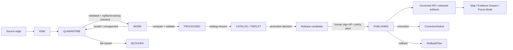

<!-- [KFM_META_BLOCK_V2]
doc_id: kfm://doc/TODO-governed-ci-patterns
title: Governed CI/CD Patterns (KFM)
type: standard
version: v1
status: draft
owners: TODO: verify owner
created: TODO: YYYY-MM-DD
updated: 2026-04-30
policy_label: TODO: verify policy label
related:
  - docs/architecture/CONTROL_PLANE_INDEX.md
  - TODO: verify source registry path
  - TODO: verify policy registry path
  - TODO: verify release/promotion docs path
tags: [kfm, ci, cd, governance, policy, evidence, publication]
notes:
  - Placement inferred; verify owners, dates, related links, CI provider, schema home, policy engine, signing toolchain, and workflow names.
  - Repo implementation depth is not asserted by this document.
[/KFM_META_BLOCK_V2] -->

# Governed CI/CD Patterns (KFM)

<p align="center">
  <strong>Evidence-first CI/CD for controlled, auditable, policy-enforced publication.</strong>
</p>

<p align="center">
  
  
  
  
  
</p>

<p align="center">
  <a href="#purpose">Purpose</a> ·
  <a href="#operating-law">Operating law</a> ·
  <a href="#core-patterns">Core patterns</a> ·
  <a href="#lifecycle-enforcement">Lifecycle</a> ·
  <a href="#policy-gates">Policy gates</a> ·
  <a href="#reference-workflows">Workflows</a> ·
  <a href="#validation">Validation</a> ·
  <a href="#rollback-and-correction">Rollback</a>
</p>

> [!IMPORTANT]
> This document is repo-ready guidance, not proof of current implementation. Claims about actual files, tests, workflows, routes, badges, policy tooling, signing, dashboards, or runtime behavior remain `UNKNOWN` until verified from current repository evidence.

---

## Status

| Field | Value |
|---|---|
| Status | `draft` |
| Scope | Cross-domain; applies to all governed KFM lanes unless a lane-specific policy is stricter |
| Authority | Architectural guidance; not itself an executable pipeline |
| Owners | `TODO: verify owner` |
| Evidence mode | `CORPUS_ONLY / NO_LOCAL_REPO_EVIDENCE` until a mounted repo is inspected |
| Policy label | `TODO: verify policy label` |
| Proposed repo path | `docs/architecture/GOVERNED_CI_PATTERNS.md` |
| Upstream | `docs/architecture/CONTROL_PLANE_INDEX.md` — `TODO: verify link target` |
| Downstream | `TODO: verify policy registry, schema registry, workflow, release, and runbook links` |
| Public posture | Cite-or-abstain; fail closed on unresolved rights, sensitivity, policy, review, or release state |

---

## What this document does

| This document defines | This document does **not** do |
|---|---|
| CI/CD patterns for evidence-bearing KFM pipelines. | Prove that any workflow is already implemented. |
| Required receipts, gates, review states, and release controls. | Authorize public release by itself. |
| Example policy and workflow shapes for later implementation. | Replace source registry, schema registry, policy registry, or promotion records. |
| A validation and rollback posture for governed publication. | Permit autonomous publication to `PUBLISHED`. |

---

## Purpose

Kansas Frontier Matrix CI/CD is a governed control system.

It is designed to make every consequential build, intake, validation, transformation, promotion, and release inspectable after the fact.

KFM pipelines must produce more than outputs. They must produce evidence that explains:

- what changed;
- what sources were used;
- what policies were evaluated;
- what validations passed or failed;
- what artifacts were generated;
- what review state applies;
- what release state applies;
- what rollback or correction path exists.

The durable goal is not “green CI.” The goal is a release candidate whose claims can be traced to admissible evidence, policy posture, provenance, review, and correction lineage.

---

## Operating law

KFM CI/CD preserves this lifecycle by default:

```text
RAW → WORK / QUARANTINE → PROCESSED → CATALOG / TRIPLET → PUBLISHED
```

Core rules:

1. `RAW`, `WORK`, and `QUARANTINE` are not public release states.
2. Promotion is a governed state transition, not a file move.
3. Derived artifacts do not replace canonical truth.
4. EvidenceBundle resolution outranks generated language, summaries, map styling, search hits, vector indexes, tiles, or scenes.
5. Any public or semi-public output must pass evidence, rights, sensitivity, validation, policy, review, catalog, and release checks appropriate to risk.
6. AI may assist review and anomaly detection, but AI output must not bypass policy, evidence, stewardship, or release gates.
7. Any `deny` from policy-as-code fails the relevant transition.
8. Autonomous promotion to `PUBLISHED` is forbidden.

> [!CAUTION]
> KFM may be locally hosted and exposed through a firewall, reverse proxy, or VPN for trusted access. CI/CD must assume exposure risk: deny by default, preserve auditability, avoid secrets in code or fixtures, and keep public clients away from internal lifecycle states.

<p align="right"><a href="#governed-cicd-patterns-kfm">Back to top ↑</a></p>

---

## Scope

This standard applies to CI/CD workflows that touch any of the following:

| Surface | Applies? | Notes |
|---|---:|---|
| Source intake | Yes | New or changed source objects enter through controlled intake. |
| Schema and contract validation | Yes | Schemas, contracts, DTOs, and fixtures are implementation surfaces. |
| Policy checks | Yes | Policy must be enforceable, not merely documented. |
| Data transformation | Yes | Transformations must produce provenance and run receipts. |
| Catalog / triplet registration | Yes | Catalog closure is required before publication. |
| Tile, layer, graph, search, summary, scene, or AI outputs | Yes | These are downstream carriers, not root truth. |
| Release bundles | Yes | Release manifests and proof packs must be explicit. |
| Rollback / correction | Yes | Publication must have a reversible or corrigible path. |

---

## Accepted inputs

A governed CI/CD workflow may accept:

- source snapshots with a `SourceDescriptor`;
- source intake records with source role, rights, sensitivity, cadence, and retrieval evidence;
- schema-validated fixtures;
- policy bundles and policy tests;
- generated validation reports;
- deterministic build inputs;
- EvidenceRefs resolvable to EvidenceBundles;
- review decisions and promotion records;
- release candidate manifests;
- correction or rollback requests.

## Exclusions

A governed CI/CD workflow must not accept the following as sufficient for publication:

- unreviewed raw source payloads;
- unverifiable scraped material;
- direct model output;
- vector/search/summary results without evidence closure;
- map tile or scene rendering as proof;
- data with unknown rights or unresolved sensitivity;
- exact sensitive locations without required review and public-safe transform;
- release candidates missing receipts, policy results, or rollback references;
- generated artifacts placed into canonical paths without verified repo convention.

---

## Core patterns

### 1. Scheduled deterministic rebuilds

Periodic rebuilds verify that derived outputs remain reproducible.

A rebuild should confirm:

- stable content identity where practical;
- stable `spec_hash` or equivalent deterministic input hash;
- stable artifact digests for deterministic outputs;
- validation behavior across repeated runs;
- catalog and release-manifest consistency.

**Constraint:** scheduled rebuilds stage outputs to `WORK` or a release-candidate area. They do not publish directly.

---

### 2. Event-driven intake, quarantine first

All new source material enters through intake.

```text
SOURCE EDGE → RAW → QUARANTINE → validation → WORK
```

Rules:

- unknown inputs are never trusted;
- failed inputs are retained with failure disposition unless policy requires removal;
- every intake produces a receipt;
- every source role is explicit;
- rights and sensitivity are resolved before public release;
- live connectors are not activated until source terms, cadence, credentials, and release class are verified.

---

### 3. PR-first automation

Automation may propose change.

Automation must not silently publish change.

A safe automation path:

```text
source event
  → snapshot
  → receipt
  → validation
  → policy decision
  → diff
  → pull request
  → human review
  → promotion decision
  → release candidate
```

> [!IMPORTANT]
> Automation may open a PR with evidence. It must not merge, promote, or publish policy-significant release artifacts without the required review path.

---

### 4. LLM-assisted QA, advisory only

AI systems may:

- suggest structured patches;
- identify suspicious diffs;
- summarize validation failures;
- propose source-role or sensitivity questions;
- help reviewers navigate evidence;
- draft non-authoritative explanations.

AI systems must not:

- assert truth without EvidenceBundle support;
- receive direct public client traffic;
- read `RAW`, `WORK`, `QUARANTINE`, or unpublished candidate stores directly;
- bypass citation validation;
- publish outputs;
- convert model output into proof.

AI-related workflow outcomes should be finite:

```text
ANSWER | ABSTAIN | DENY | ERROR
```

---

### 5. Proof-bearing release candidates

A release candidate is not just a folder of artifacts.

It should include, at minimum:

- artifact list and digests;
- source and evidence references;
- validation report references;
- policy decision references;
- review or steward decision references;
- catalog / triplet registration references;
- sensitivity and redaction receipts where applicable;
- rollback or correction reference.

---

### 6. Rollback and correction rehearsal

Every release path should define how to recover.

CI/CD should support:

- rollback to a prior release manifest;
- withdrawal of a public artifact;
- correction notices;
- invalidation of derived artifacts;
- regeneration of public-safe layers;
- preservation of receipts for audit.

<p align="right"><a href="#governed-cicd-patterns-kfm">Back to top ↑</a></p>

---

## Lifecycle enforcement



---

## Artifact families

> [!NOTE]
> Names below are expected KFM object families for this standard. Treat them as `PROPOSED` for this repository until current repo evidence confirms canonical schema names and paths.

| Object family | CI/CD role | Required before publication? |
|---|---|---:|
| `SourceDescriptor` | Identifies source role, rights posture, cadence, authority, and allowed uses. | Yes |
| `SourceIntakeRecord` | Records source snapshot, retrieval context, and intake disposition. | Yes |
| `EvidenceRef` | Stable reference to evidence used by claims or artifacts. | Yes |
| `EvidenceBundle` | Resolved evidence set supporting claim, layer, output, or release. | Yes |
| `ValidationReport` | Schema, contract, data, and fixture validation results. | Yes |
| `PolicyDecision` | Machine-readable allow/deny/warn decision with reasons. | Yes |
| `RunReceipt` | Execution record for a pipeline run. | Yes |
| `AIReceipt` | AI interaction trace where model assistance was used. | Conditional |
| `RedactionReceipt` | Records geoprivacy, masking, generalization, or suppression transforms. | Conditional |
| `PromotionDecision` | Steward or reviewer approval record. | Yes for `PUBLISHED` |
| `ReleaseManifest` | Published artifact index, digests, evidence refs, and release metadata. | Yes |
| `ProofPack` | Bundle of receipts, attestations, validation, policy, and provenance references. | Yes |
| `CatalogMatrix` | Catalog / triplet closure record across datasets, distributions, layers, and claims. | Yes |
| `CorrectionNotice` | Public or internal correction lineage when an output changes meaning. | Conditional |
| `RollbackPlan` | Recovery target, invalidation scope, and restoration steps. | Yes |

---

## Policy gates

All state transitions that matter must be controlled by policy-as-code or an equivalent enforceable gate.

### Gate classes

| Gate | Purpose | Typical deny condition |
|---|---|---|
| Source gate | Admit source into controlled lifecycle. | Unknown rights, unknown source role, unsafe endpoint, missing descriptor. |
| Schema gate | Validate shape and required fields. | Invalid contract, missing required evidence or state field. |
| Evidence gate | Resolve EvidenceRef to EvidenceBundle. | Unresolved evidence, stale evidence, unsupported claim. |
| Sensitivity gate | Prevent unsafe exposure. | Exact sensitive geometry, restricted data in public scope. |
| Policy gate | Apply release rules. | Any deny from policy-as-code. |
| Catalog gate | Ensure discoverability and provenance closure. | Missing STAC/DCAT/PROV or KFM catalog record where required. |
| Review gate | Confirm steward approval. | Missing or invalid PromotionDecision. |
| Release gate | Ensure release manifest and proof pack are complete. | Missing digest, receipt, rollback ref, or correction path. |

### Example policy shape

```rego
package kfm.publish

default allow = false

blocked_states := {
  "RAW",
  "WORK",
  "QUARANTINE"
}

deny[msg] {
  blocked_states[input.source_state]
  msg := sprintf("%s cannot be published directly", [input.source_state])
}

deny[msg] {
  input.sensitivity == "restricted"
  input.output_scope == "public"
  msg := "Restricted data cannot be released to public scope"
}

deny[msg] {
  input.rights.status == "unknown"
  msg := "Unknown rights block publication"
}

deny[msg] {
  not input.evidence_bundle.resolved
  msg := "EvidenceBundle must resolve before publication"
}

deny[msg] {
  input.target_state == "PUBLISHED"
  not input.promotion_decision.approved
  msg := "PUBLISHED requires approved PromotionDecision"
}

deny[msg] {
  input.target_state == "PUBLISHED"
  not input.release_manifest.digest
  msg := "PUBLISHED requires release manifest digest"
}

allow {
  count(deny) == 0
}
```

**Rule:** any `deny` fails the transition.

---

## Promotion rules

| Stage | Allowed action | Minimum requirement | Public exposure |
|---|---|---|---:|
| `RAW` | Record source arrival | Intake metadata | No |
| `QUARANTINE` | Validate / classify / hold | Receipt + failure disposition | No |
| `WORK` | Compute / inspect / repair | Tests + policy precheck | No |
| `PROCESSED` | Transform / normalize / derive | Provenance + validation report | No |
| `CATALOG / TRIPLET` | Register / index / relate | Catalog closure + evidence refs | Limited, if released |
| Release candidate | Assemble proof-bearing bundle | Manifest + proof pack + rollback ref | No |
| `PUBLISHED` | Release | Human sign-off + policy pass + manifest | Yes, through governed surfaces only |

### Critical constraint

> [!CAUTION]
> Autonomous promotion to `PUBLISHED` is forbidden. Publication requires an approved PromotionDecision and policy-safe release manifest.

---

## Reference workflows

> [!NOTE]
> The examples below are illustrative. Adapt names, tools, paths, permissions, runners, and commands to the verified repository and CI provider.

### Nightly deterministic rebuild

```yaml
name: kfm-recompute-spec

on:
  schedule:
    - cron: "0 02 * * *"
  workflow_dispatch: {}

permissions:
  contents: read

jobs:
  rebuild:
    name: Recompute deterministic artifacts
    runs-on: ubuntu-latest

    steps:
      - name: Checkout
        uses: actions/checkout@v4

      - name: Compute spec hash
        run: |
          ./tools/spec_hash.sh input.json > work/spec_hash.txt

      - name: Validate schemas
        run: |
          ./tools/validators/validate_schemas.sh

      - name: Run policy checks
        run: |
          conftest test .

      - name: Emit run receipt
        run: |
          ./tools/evidence/emit_run_receipt.sh

      - name: Assemble proof pack
        run: |
          ./tools/proofs/assemble_proof_pack.sh

      - name: Upload run evidence
        uses: actions/upload-artifact@v4
        with:
          name: kfm-rebuild-evidence
          path: |
            work/spec_hash.txt
            data/receipts/
            data/proofs/
```

### Event-driven intake

```yaml
name: kfm-source-intake

on:
  repository_dispatch:
    types: [source_object_new]
  workflow_dispatch: {}

permissions:
  contents: read
  pull-requests: write

jobs:
  intake:
    name: Intake source object through quarantine
    runs-on: ubuntu-latest

    steps:
      - name: Checkout
        uses: actions/checkout@v4

      - name: Snapshot source
        run: |
          ./connectors/snapshot.sh

      - name: Emit intake receipt
        run: |
          ./tools/evidence/emit_source_intake_record.sh

      - name: Validate source descriptor
        run: |
          ./tools/validators/validate_source_descriptor.sh

      - name: Run policy precheck
        run: |
          conftest test policy/intake

      - name: Compute governed diff
        run: |
          ./tools/diff.sh

      - name: Open review PR
        run: |
          ./tools/open_pr.sh
```

### Release candidate dry run

```yaml
name: kfm-release-dry-run

on:
  workflow_dispatch:
    inputs:
      release_candidate:
        description: "Release candidate identifier"
        required: true

permissions:
  contents: read

jobs:
  dry-run:
    name: Validate release candidate without publishing
    runs-on: ubuntu-latest

    steps:
      - uses: actions/checkout@v4

      - name: Validate release manifest
        run: |
          ./tools/validators/validate_release_manifest.sh "${{ inputs.release_candidate }}"

      - name: Resolve EvidenceBundles
        run: |
          ./tools/evidence/resolve_release_evidence.sh "${{ inputs.release_candidate }}"

      - name: Evaluate release policy
        run: |
          conftest test "release/${{ inputs.release_candidate }}"

      - name: Verify rollback reference
        run: |
          ./tools/validators/validate_rollback_ref.sh "${{ inputs.release_candidate }}"

      - name: Emit dry-run report
        run: |
          ./tools/release/emit_dry_run_report.sh "${{ inputs.release_candidate }}"
```

<p align="right"><a href="#governed-cicd-patterns-kfm">Back to top ↑</a></p>

---

## CI job matrix

| Job | Trigger | Blocks merge? | Blocks publication? | Evidence emitted |
|---|---|---:|---:|---|
| Metadata lint | PR | Yes | Yes | ValidationReport |
| Schema validation | PR / release candidate | Yes | Yes | ValidationReport |
| Fixture validation | PR | Yes | Yes | ValidationReport |
| Policy tests | PR / release candidate | Yes | Yes | PolicyDecision |
| Negative-path tests | PR | Yes | Yes | ValidationReport |
| Source descriptor validation | Intake / PR | Yes | Yes | SourceIntakeRecord |
| Evidence resolution | PR / release candidate | Yes | Yes | EvidenceBundle resolution report |
| Catalog closure | Release candidate | No by default | Yes | CatalogMatrix |
| Proof pack assembly | Release candidate | No by default | Yes | ProofPack |
| Signing / attestation | Release candidate | No by default | Yes when release policy requires | Signature / attestation ref |
| Rollback drill | Release candidate / scheduled | No by default | Yes for high-risk release | RollbackPlan validation |
| AI citation validation | PR / runtime fixture | Yes when AI output is release-relevant | Yes | CitationValidationReport + AIReceipt |

---

## Validation

Minimum validation expectations:

- [ ] Required metadata fields are present.
- [ ] SourceDescriptor exists for every source-backed artifact.
- [ ] EvidenceRef resolves to EvidenceBundle.
- [ ] Schema fixtures include valid and invalid examples.
- [ ] Policy tests include allow and deny cases.
- [ ] Rights and sensitivity fields are explicit.
- [ ] Public release candidates include PromotionDecision.
- [ ] ReleaseManifest includes artifact digests.
- [ ] ProofPack references receipts and validation results.
- [ ] RollbackPlan or correction path is recorded.
- [ ] AI-assisted outputs include citation validation and receipt where relevant.
- [ ] No public path reads `RAW`, `WORK`, or `QUARANTINE`.
- [ ] No public UI calls a model runtime directly.
- [ ] No generated artifact is treated as canonical truth without a documented promotion path.

### Negative-path coverage

Prefer explicit failing fixtures for:

- unresolved EvidenceRef;
- stale evidence;
- unknown source role;
- unknown rights;
- unclear sensitivity;
- exact sensitive geometry in public scope;
- missing review state;
- missing release state;
- invalid `spec_hash`;
- missing run receipt;
- missing release manifest digest;
- rollback/correction mismatch;
- direct model-client bypass;
- public `RAW`, `WORK`, or `QUARANTINE` access;
- missing citation;
- unsupported policy posture;
- expired operational context;
- publication before promotion.

---

## Rollback and correction

Rollback and correction are part of the release design, not afterthoughts.

| Scenario | Required action |
|---|---|
| Bad release manifest | Block publication; keep candidate in release-candidate state. |
| Invalid published artifact | Withdraw or supersede artifact; emit CorrectionNotice. |
| Source rights change | Freeze affected release path; re-evaluate rights; issue correction if public meaning changes. |
| Sensitivity issue discovered | Remove or generalize public artifact; emit RedactionReceipt and CorrectionNotice. |
| Broken derived layer | Invalidate derivative; preserve canonical evidence; rebuild from prior valid inputs. |
| Failed model-assisted answer | Preserve AIReceipt if required; emit `ABSTAIN`, `DENY`, or `ERROR`; do not publish unsupported answer. |
| Pipeline regression | Roll back workflow change; preserve failed run receipts for diagnosis. |

---

## Security posture

KFM CI/CD should default to a least-privilege posture.

Required defaults:

- keep secrets out of code, docs, prompts, examples, fixtures, logs, screenshots, and generated artifacts;
- do not expose direct model runtime endpoints to public clients;
- do not expose `RAW`, `WORK`, or `QUARANTINE` through public API or UI paths;
- separate public, steward, admin, and maintenance permissions;
- keep release credentials isolated from intake and validation jobs;
- prefer read-only permissions for validation jobs;
- require explicit elevated permissions for release assembly or publication;
- preserve audit logs and receipts without leaking sensitive source data.

---

## Repository placement

### Proposed canonical path

```text
docs/architecture/GOVERNED_CI_PATTERNS.md
```

### Rationale

This standard belongs in the control-plane architecture set because it governs cross-domain behavior:

- intake;
- validation;
- policy;
- promotion;
- release;
- proof objects;
- rollback and correction;
- AI-assisted QA boundaries;
- public-surface safety.

### Related files to verify

| Relationship | Target |
|---|---|
| Control-plane index | `docs/architecture/CONTROL_PLANE_INDEX.md` |
| Policy registry | `TODO: verify policy registry path` |
| Schema registry | `TODO: verify schema registry path` |
| Source registry | `TODO: verify source registry path` |
| Release runbook | `TODO: verify release runbook path` |
| Rollback runbook | `TODO: verify rollback runbook path` |
| Evidence object schemas | `TODO: verify EvidenceBundle / receipt schema path` |
| CI workflows | `TODO: verify .github/workflows or actual CI provider path` |

---

## Anti-patterns

Avoid or reject:

- publishing from `RAW`, `WORK`, or `QUARANTINE`;
- live connector activation before source rights and endpoint verification;
- public layers before source role, sensitivity, review, and release state are resolved;
- direct public client traffic to a model runtime;
- model output treated as proof;
- vector/search/summary/tile/scene output treated as sovereign truth;
- unverified CI, release, coverage, security, or deployment badges;
- fake owners, fake workflow names, fake passing checks, or fabricated route names;
- generated artifacts placed into canonical source paths without repo convention;
- map polish used as a substitute for evidence, policy, review, or publication controls;
- hidden correction or rollback requirements;
- treating documentation alone as implementation proof.

---

## Definition of Done

A governed CI/CD change is done when:

- [ ] Evidence basis and repo access mode are stated.
- [ ] Affected lifecycle stages are identified.
- [ ] New or changed artifacts have schemas or contract notes.
- [ ] Required fixtures exist, including negative-path fixtures.
- [ ] Policy gates cover the relevant transition.
- [ ] Validation commands are documented.
- [ ] Receipts are emitted or explicitly marked `TODO`.
- [ ] Release candidates include ReleaseManifest and rollback reference.
- [ ] Human sign-off is required before `PUBLISHED`.
- [ ] Documentation reflects behavior changes.
- [ ] Rollback and correction paths are documented.
- [ ] No unsupported implementation claims appear.

---

## Checklist

- [ ] Deterministic `spec_hash` generation is implemented or explicitly marked `TODO`.
- [ ] SourceDescriptor exists for every source family.
- [ ] EvidenceBundle is emitted or resolvable for consequential outputs.
- [ ] RunReceipt is stored for pipeline runs.
- [ ] ValidationReport is produced for schema and data checks.
- [ ] PolicyDecision is produced for state transitions.
- [ ] RedactionReceipt is produced for geoprivacy or sensitivity transforms.
- [ ] PromotionDecision is required for publication.
- [ ] ReleaseManifest is assembled before publication.
- [ ] ProofPack references validation, policy, receipts, and artifact digests.
- [ ] Signing or attestation posture is verified where required.
- [ ] Public access is blocked without steward approval.
- [ ] Audit trail is preserved.
- [ ] RollbackPlan and CorrectionNotice paths are defined.
- [ ] Workflow examples are adapted to verified repo conventions.

---

## Appendix A — Spec hash example

<details>
<summary>Illustrative spec hash shell snippet</summary>

> [!WARNING]
> This snippet is illustrative. The repository should use the accepted KFM canonicalization method once verified. A simple `jq --sort-keys` pipeline may not be sufficient for all JSON canonicalization requirements.

```bash
#!/usr/bin/env bash
set -euo pipefail

input="${1:?usage: spec_hash.sh <input.json>}"

jq --sort-keys -c . "$input" | sha256sum | awk '{print $1}'
```

</details>

---

## Appendix B — Minimal release candidate shape

<details>
<summary>Illustrative release manifest fields</summary>

```json
{
  "release_id": "TODO",
  "release_state": "release_candidate",
  "created_at": "TODO",
  "spec_hash": "TODO",
  "artifacts": [
    {
      "artifact_id": "TODO",
      "path": "TODO",
      "digest": "TODO",
      "media_type": "TODO"
    }
  ],
  "evidence_refs": ["TODO"],
  "validation_reports": ["TODO"],
  "policy_decisions": ["TODO"],
  "promotion_decision": "TODO",
  "proof_pack": "TODO",
  "rollback_ref": "TODO",
  "correction_policy": "TODO"
}
```

</details>

---

## Appendix C — Maintainer handoff

Before this file is promoted from `draft`:

- [ ] Verify actual owner.
- [ ] Verify policy label.
- [ ] Verify repo path.
- [ ] Verify related links.
- [ ] Verify CI provider and workflow path.
- [ ] Verify schema home.
- [ ] Verify policy engine and Rego compatibility.
- [ ] Verify signing / attestation toolchain.
- [ ] Verify release and rollback runbooks.
- [ ] Replace illustrative command names with real repo commands.
- [ ] Add or link actual fixtures once available.

---

[Back to top](#governed-cicd-patterns-kfm)
