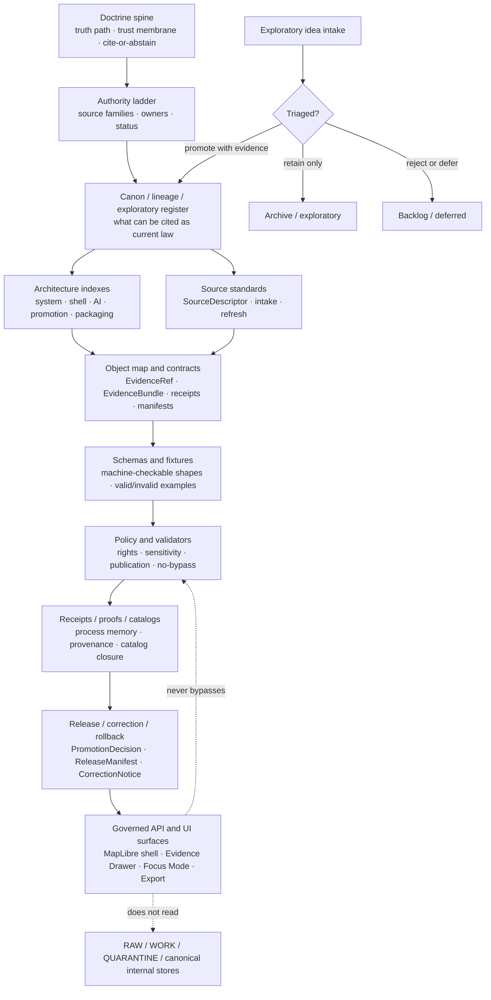

<!-- [KFM_META_BLOCK_V2]
doc_id: TODO-VERIFY-doc-id
title: Control Plane Index
type: standard
version: v1
status: draft
owners: TODO-VERIFY-documentation-owner
created: TODO-VERIFY-created-date
updated: 2026-04-30
policy_label: TODO-VERIFY-public-or-restricted
related: [TODO-VERIFY:docs/registers/AUTHORITY_LADDER.md, TODO-VERIFY:docs/registers/CANONICAL_LINEAGE_EXPLORATORY.md, TODO-VERIFY:docs/doctrine/DOCUMENTATION_LAW.md, TODO-VERIFY:contracts/OBJECT_MAP.md]
tags: [kfm, control-plane, documentation-architecture, governance]
notes: [Authored from corpus-only evidence; mounted repo state, owners, UUID, policy label, and adjacent links require verification before merge.]
[/KFM_META_BLOCK_V2] -->

# Control Plane Index

A navigation and governance index for the KFM documentation, contract, schema, policy, proof, release, and trust-surface control plane.


> [!IMPORTANT]
> **Impact block**
>
> | Field | Value |
> | --- | --- |
> | Status | `experimental` — repo placement and adjacent links are **NEEDS VERIFICATION** |
> | Owners | `TODO-VERIFY-documentation-owner` |
> | Target path | `docs/architecture/CONTROL_PLANE_INDEX.md` |
> | Document role | README-like architecture index + standard control-plane doc |
> | Evidence posture | **CONFIRMED** KFM doctrine from attached corpus; **UNKNOWN** current mounted implementation depth |
> | Quick jumps | [Scope](#scope) · [Repo fit](#repo-fit) · [Inputs](#accepted-inputs) · [Exclusions](#exclusions) · [Directory tree](#directory-tree) · [Diagram](#control-plane-diagram) · [Surface index](#surface-index) · [Rules](#operating-rules) · [Quickstart](#maintainer-quickstart) · [Gates](#merge-and-review-gates) · [Backlog](#open-verification-backlog) |

---

## Scope

This file is the control-plane entry point for KFM maintainers who need to answer:

- Which documentation surfaces are canonical, lineage-bearing, exploratory, or implementation-facing?
- Where do source authority, object families, schemas, fixtures, policies, receipts, proofs, releases, and rollback records belong?
- What must be updated when a source, schema, policy gate, release model, UI trust surface, or governed-AI surface changes?
- Which claims are **CONFIRMED**, **INFERRED**, **PROPOSED**, **UNKNOWN**, or **NEEDS VERIFICATION**?

**CONFIRMED doctrine:** KFM is a governed, evidence-first, map-first, time-aware spatial evidence and publication system. The public unit of value is the inspectable claim, not a tile, graph edge, dashboard, model output, renderer state, or narrative by itself.

**UNKNOWN implementation depth:** This authoring pass did not inspect a mounted KFM Git checkout. Current route names, package manager, workflow YAML, emitted proof objects, runtime behavior, deployed services, branch protections, and actual adjacent files remain **UNKNOWN**.

[Back to top](#control-plane-index)

---

## Repo fit

| Item | Value |
| --- | --- |
| Current file | `docs/architecture/CONTROL_PLANE_INDEX.md` |
| Upstream landing candidate | [`../README.md`](../README.md) — **NEEDS VERIFICATION** |
| Peer architecture candidate | [`README.md`](README.md) — **NEEDS VERIFICATION** |
| Primary register candidates | [`../registers/AUTHORITY_LADDER.md`](../registers/AUTHORITY_LADDER.md), [`../registers/CANONICAL_LINEAGE_EXPLORATORY.md`](../registers/CANONICAL_LINEAGE_EXPLORATORY.md) — **NEEDS VERIFICATION** |
| Doctrine candidate | [`../doctrine/DOCUMENTATION_LAW.md`](../doctrine/DOCUMENTATION_LAW.md) — **NEEDS VERIFICATION** |
| Object-map candidate | [`../../contracts/OBJECT_MAP.md`](../../contracts/OBJECT_MAP.md) — **NEEDS VERIFICATION** |
| Schema-home candidate | [`../../schemas/README.md`](../../schemas/README.md) — **NEEDS VERIFICATION** |
| Policy-home candidate | [`../../policy/README.md`](../../policy/README.md) — **NEEDS VERIFICATION** |
| Downstream consumers | domain docs, source registries, schema authors, policy authors, validators, CI gates, release stewards, MapLibre shell, Evidence Drawer, Focus Mode, review/export surfaces |

> [!NOTE]
> Link targets are intentionally marked **NEEDS VERIFICATION** because this session did not expose the mounted repo tree. If the real repo uses different canonical homes, update this file through an ADR and migration note rather than creating parallel authorities.

[Back to top](#control-plane-index)

---

## Accepted inputs

The control-plane index accepts only material that helps maintainers route authority, evidence, contracts, review, or release state.

| Input | Belongs here when it... | Truth posture |
| --- | --- | --- |
| Documentation authority notes | Clarifies canon, lineage, exploratory, superseded, or current-support status | **CONFIRMED** when verified in repo or corpus |
| Source authority decisions | Identifies source family, role, rights posture, source status, or verification requirement | **PROPOSED** until source registry proves it |
| Object-family routing | Locates `SourceDescriptor`, `EvidenceRef`, `EvidenceBundle`, receipts, manifests, envelopes, reviews, releases, and corrections | **PROPOSED** until object map/schema exists |
| Schema-home decisions | Resolves `contracts/` vs `schemas/` authority without dual drift | **NEEDS VERIFICATION** until ADR accepted |
| Policy and gate routing | Shows where rights, sensitivity, publication, no-bypass, source-role, and citation gates live | **PROPOSED** until policy files/tests exist |
| Release and rollback routing | Shows where promotion, withdrawal, correction, rollback, and stale-artifact logic is documented | **PROPOSED** until release objects are inspected |
| Trust-surface routing | Connects governed UI, Evidence Drawer, Focus Mode, Review, Export, and MapLibre shell docs to proof objects | **PROPOSED** until app contracts/tests exist |

[Back to top](#control-plane-index)

---

## Exclusions

| Does **not** belong here | Goes instead | Why |
| --- | --- | --- |
| Raw source data, unpublished candidate data, restricted records | `data/raw/`, `data/work/`, `data/quarantine/`, or repo-native lifecycle homes | This file must not become a data store or bypass the lifecycle. |
| Machine schema definitions | `schemas/contracts/v1/` or accepted schema home | This file routes schema authority; it does not define executable schemas. |
| Policy-as-code bodies | `policy/` and policy tests | Policy must remain executable and testable, not buried in prose. |
| Generated receipts, proofs, releases, catalogs | `data/receipts/`, `data/proofs/`, `data/catalog/`, `release/`, or repo-native equivalent | Emitted artifacts are evidence instances, not index content. |
| Domain-specific architecture details | `docs/domains/<domain>/` or `docs/architecture/<domain>/` | This index governs cross-cutting control-plane placement. |
| Free-form AI prompts or model outputs | governed-AI docs, runtime contracts, evaluator fixtures, and receipts | AI is interpretive and subordinate to EvidenceBundle, policy, and review. |
| Renderer-specific runtime state | MapLibre/Cesium architecture docs and runtime adapter tests | Renderers are downstream carriers, not source authority. |
| Exploratory packet content copied as canon | `docs/intake/` and `docs/archive/exploratory/` | Exploratory material must be triaged before promotion. |

[Back to top](#control-plane-index)

---

## Directory tree

**PROPOSED / NEEDS VERIFICATION** until a mounted repo scan confirms actual homes.

```text
docs/
  README.md                                # canonical docs landing candidate
  architecture/
    CONTROL_PLANE_INDEX.md                 # this file
    README.md                              # architecture landing candidate
    REPO_MAP.md                            # repo topology and boundary map
    SYSTEM_CONTEXT.md                      # whole-system architecture context
    shell/
      README.md                            # MapLibre / governed shell boundary
    ai/
      README.md                            # governed AI / Focus boundary
    promotion/
      README.md                            # promotion and release architecture
    packaging/
      README.md                            # release/package/export architecture
  doctrine/
    DOCUMENTATION_LAW.md                   # truth labels, authority, citation posture
    MASTER_DOCTRINE.md                     # repo-native doctrine spine candidate
    TERMINOLOGY.md                         # stable KFM vocabulary
  registers/
    AUTHORITY_LADDER.md                    # source hierarchy and authority rules
    CANONICAL_LINEAGE_EXPLORATORY.md       # canon/lineage/exploratory register
    DRIFT_REGISTER.md                      # contradiction and drift tracker
    VERIFICATION_BACKLOG.md                # repo/runtime proof backlog
  intake/
    IDEA_INTAKE.md                         # exploratory packet intake rules
    NEW_IDEAS_INDEX.md                     # packet inventory without promotion
  sources/
    SOURCE_DESCRIPTOR_STANDARD.md          # source-role and source-intake standard
    SOURCE_REFRESH_RULES.md                # refresh, cadence, and verification rules
  runbooks/
    PROMOTION_GATE.md                      # operator-facing promotion flow
    CORRECTION_AND_ROLLBACK.md             # correction, withdrawal, rollback flow
    SOURCE_REFRESH.md                      # source-refresh operator flow
  archive/
    lineage/
      README.md                            # retained prior doctrine and passes
    exploratory/
      README.md                            # retained unpromoted idea packets

contracts/
  OBJECT_MAP.md                            # proof-object and contract-family map

schemas/
  README.md                                # schema-home status and ADR link

policy/
  README.md                                # policy-home status and gate taxonomy
```

[Back to top](#control-plane-index)

---

## Control-plane diagram

**PROPOSED, doctrine-grounded.** This diagram expresses responsibility boundaries; it does not assert that every target file already exists.



[Back to top](#control-plane-index)

---

## Surface index

| Surface | Target home | Truth role | Update trigger | Owner / authority | Missing-risk if absent |
| --- | --- | --- | --- | --- | --- |
| Authority ladder | `docs/registers/AUTHORITY_LADDER.md` | Canon routing | New source family, new baseline, supersession decision | `TODO-VERIFY` | Strong documents compete as peers; source authority becomes tone-based. |
| Canon / lineage / exploratory register | `docs/registers/CANONICAL_LINEAGE_EXPLORATORY.md` | Canon boundary | New doc, archived doc, promoted packet, superseded pass | `TODO-VERIFY` | Exploratory packets can become accidental law. |
| Documentation law | `docs/doctrine/DOCUMENTATION_LAW.md` | Truth-label and documentation behavior | Truth-label change, citation posture change, doc policy change | `TODO-VERIFY` | Docs drift into persuasive but unverified claims. |
| Object map | `contracts/OBJECT_MAP.md` | Contract-family map | New object family, renamed envelope, release/proof model change | `TODO-VERIFY` | Lanes improvise incompatible receipts, bundles, and manifests. |
| Source descriptor standard | `docs/sources/SOURCE_DESCRIPTOR_STANDARD.md` | Source-role discipline | New source role, rights posture, cadence, or source-intake gate | `TODO-VERIFY` | Source authority collapses into “data source” without role and rights posture. |
| Schema home | `schemas/README.md` + schema-home ADR | Machine-shape routing | Any schema-bearing PR or contracts/schemas conflict | `TODO-VERIFY` | Dual schema authorities drift silently. |
| Policy home | `policy/README.md` | Gate and rule routing | New release rule, sensitivity rule, rights rule, no-bypass rule | `TODO-VERIFY` | Policy bodies hide in prose or UI behavior instead of executable checks. |
| Fixture taxonomy | `tests/fixtures/README.md` or repo-native equivalent | Verification examples | New schema, policy gate, invalid case, regression fixture | `TODO-VERIFY` | Validators can pass without representative negative cases. |
| Promotion runbook | `docs/runbooks/PROMOTION_GATE.md` | Operator flow | New release gate, proof-pack requirement, review requirement | `TODO-VERIFY` | Publication becomes a folder move or layer toggle. |
| Correction and rollback runbook | `docs/runbooks/CORRECTION_AND_ROLLBACK.md` | Reversibility flow | Withdrawal, correction, supersession, rollback drill | `TODO-VERIFY` | Release lineage can disappear or become unauditable. |
| Verification backlog | `docs/registers/VERIFICATION_BACKLOG.md` | Unknowns register | New blocked claim, missing repo proof, missing runtime artifact | `TODO-VERIFY` | UNKNOWNs are smoothed into false confidence. |
| Drift register | `docs/registers/DRIFT_REGISTER.md` | Contradiction tracker | Conflicting docs, stale implementation claim, renamed path family | `TODO-VERIFY` | Contradictions are hidden until implementation pressure exposes them. |

[Back to top](#control-plane-index)

---

## Object families the control plane must keep separate

| Object family | Minimum role | Must not be confused with |
| --- | --- | --- |
| `SourceDescriptor` | Declares source identity, role, cadence, rights posture, citation policy, and verification needs | Dataset record, citation text, or source convenience alias |
| `SourceIntakeRecord` | Records admission decision, source review, unresolved obligations, and activation posture | SourceDescriptor itself or public publication approval |
| `EvidenceRef` | Stable pointer from claim/layer/runtime output to evidence bundle | Evidence text, UI popup, or generated summary |
| `EvidenceBundle` | Resolved, inspectable support package for claims and outputs | Model context alone, tile metadata, or search result |
| `ValidationReport` | Records validation pass/fail/quarantine outcomes | Promotion approval |
| `PolicyDecision` / `DecisionEnvelope` | Machine-readable policy result and rationale | Human review note or model explanation |
| `RuntimeResponseEnvelope` | Finite runtime response shape for UI/AI flows | Raw model text or ad hoc API payload |
| `RunReceipt` / `AIReceipt` | Process memory for executed run/model-assisted output | Published proof or claim authority |
| `ReviewRecord` | Human or steward review state and obligations | ReleaseManifest or policy decision |
| `CatalogMatrix` / `CatalogClosure` | STAC/DCAT/PROV-style outward catalog closure and linkage | Internal truth source |
| `LayerManifest` / `StyleManifest` | Released visual/delivery artifact contract | Publication authority or evidence authority |
| `PromotionDecision` | Governed state transition decision | File move, deployment event, or UI toggle |
| `ReleaseManifest` / `ReleaseProofPack` | Release-bearing artifact and proof assembly | Receipt folder, source registry, or dashboard |
| `CorrectionNotice` | Visible correction, supersession, withdrawal, or rollback lineage | Deletion or silent replacement |

> [!WARNING]
> Do not let one convenient artifact carry too many meanings. KFM’s trust model depends on separating source identity, evidence support, policy decision, review state, released artifact, runtime response, and correction lineage.

[Back to top](#control-plane-index)

---

## Operating rules

1. **Authority before fluency.** A clear source-status label outranks polished prose.
2. **Cite or abstain.** If a claim cannot resolve to admissible evidence, mark the failure state instead of smoothing it.
3. **Lifecycle stays visible.** `RAW -> WORK / QUARANTINE -> PROCESSED -> CATALOG / TRIPLET -> PUBLISHED` remains the default path.
4. **Promotion is a governed state transition.** It is not a file move, style toggle, UI publish button, or data copy.
5. **Derived products are downstream.** Tiles, PMTiles, search indexes, graph projections, summaries, scenes, and AI outputs are carriers, not sovereign truth.
6. **Exploratory packets are intake, not canon.** They may become proposals, backlog, schemas, or docs only after triage and evidence routing.
7. **Public clients use governed paths.** Normal UI and public clients must not read RAW, WORK, QUARANTINE, canonical/internal stores, restricted records, or direct model runtimes.
8. **AI is interpretive only.** EvidenceBundle, source role, policy, review, and release state outrank generated language.
9. **Rights and sensitivity fail closed.** Unclear rights, source terms, sovereignty, cultural sensitivity, precise sensitive locations, living-person, DNA, private-land, or critical-infrastructure exposure blocks or restricts release.
10. **Rollback preserves lineage.** Withdrawal, correction, supersession, and rollback must remain queryable and reviewable.

[Back to top](#control-plane-index)

---

## Maintainer quickstart

Use this when adding or revising a control-plane doc.

### 1. Verify repo state first

```bash
git status --short
git branch --show-current
find docs contracts schemas policy data tools tests apps packages infra release -maxdepth 2 -type f 2>/dev/null | sort | sed -n '1,200p'
```

Record whether the target path is **CONFIRMED**, **PROPOSED**, **UNKNOWN**, or **NEEDS VERIFICATION** before editing.

### 2. Classify the material

| Question | Route |
| --- | --- |
| Is it stable doctrine or documentation law? | `docs/doctrine/` |
| Does it decide source authority or canon status? | `docs/registers/` |
| Is it exploratory packet material? | `docs/intake/` or `docs/archive/exploratory/` |
| Is it a human-readable object contract? | `contracts/` |
| Is it executable shape? | `schemas/` or repo-native schema home |
| Is it an executable rule or denial gate? | `policy/` |
| Is it an emitted evidence instance? | `data/receipts/`, `data/proofs/`, `data/catalog/`, or `release/` |
| Is it an operator procedure? | `docs/runbooks/` |
| Is it domain-specific? | `docs/domains/<domain>/` or lane architecture home |

### 3. Update the control-plane cross-references

At minimum, update:

- this file when a new cross-cutting surface is created;
- the authority ladder when source hierarchy changes;
- the canon/lineage/exploratory register when source status changes;
- the object map when an object family, envelope, manifest, or receipt changes;
- the verification backlog when a claim is blocked by missing repo/runtime evidence.

### 4. Run lightweight checks

```bash
# Replace with repo-native commands when verified.
python -m json.tool < /dev/null >/dev/null 2>&1 || true
git diff --check
```

Add repo-native Markdown link checks, schema validation, policy tests, fixture tests, and CI smoke tests once their homes are **CONFIRMED**.

[Back to top](#control-plane-index)

---

## Change triggers

| Event | Required control-plane update |
| --- | --- |
| New source family admitted | `AUTHORITY_LADDER.md`, source descriptor standard, source registry, verification backlog |
| New exploratory packet | `IDEA_INTAKE.md`, `NEW_IDEAS_INDEX.md`, canon register if promoted |
| New object family | `OBJECT_MAP.md`, schema registry, fixture taxonomy, policy docs if gated |
| New schema version | schema-home ADR/status doc, object map, valid/invalid fixtures, validators |
| New policy gate | policy README, runbook, fixtures, CI gate matrix, review docs |
| New domain lane | domain README, lane architecture, source registry, lifecycle docs, control-plane backlink |
| New MapLibre / UI trust surface | shell architecture, LayerManifest/Drawer/Focus payload contracts, policy/no-bypass tests |
| New governed-AI behavior | AI architecture, runtime envelope, citation validation, AIReceipt, no-direct-model-client policy |
| New release path | promotion runbook, ReleaseManifest shape, proof-pack expectations, rollback target |
| Correction, withdrawal, rollback | correction runbook, release lineage, catalog closure, affected layer/export docs |
| Repo topology change | repo map, this index, impacted landing pages, ADR if authority moves |

[Back to top](#control-plane-index)

---

## Merge and review gates

Before this file or any adjacent control-plane file is merged:

- [ ] Metadata block fields are either grounded or explicitly marked `TODO-VERIFY`.
- [ ] Owners are confirmed or intentionally left as `TODO-VERIFY`.
- [ ] Status is visible in the impact block.
- [ ] Quick jumps work inside this file.
- [ ] Accepted inputs and exclusions are present.
- [ ] Relative links are checked or labelled **NEEDS VERIFICATION**.
- [ ] No claim says an implementation, route, workflow, schema, proof object, dashboard, or runtime exists unless direct repo/runtime evidence supports it.
- [ ] Any proposed path is labelled **PROPOSED** or **NEEDS VERIFICATION** until confirmed.
- [ ] Exploratory packet material is not cited as current implementation authority.
- [ ] Control-plane changes update affected registers, object maps, runbooks, and verification backlog.
- [ ] Rollback path is obvious: reverting docs must not require data or runtime rollback unless a behavior PR is coupled to it.
- [ ] Long appendices are wrapped in `<details>`.
- [ ] Code fences are language-tagged.
- [ ] Mermaid diagram renders in GitHub.

[Back to top](#control-plane-index)

---

## Open verification backlog

| Item | Status | Why it matters | How to close |
| --- | --- | --- | --- |
| Actual file existence at `docs/architecture/CONTROL_PLANE_INDEX.md` | **UNKNOWN** | Determines whether this is a create or revise operation | Mount repo and inspect target path |
| Document owner | **NEEDS VERIFICATION** | Required for impact block and meta block | Confirm with repo maintainers or CODEOWNERS |
| `doc_id` UUID | **NEEDS VERIFICATION** | Required for stable doc identity | Generate or assign through repo-native doc registry |
| Created date | **NEEDS VERIFICATION** | Avoids fabricated metadata | Use commit history or set on first accepted commit |
| Policy label | **NEEDS VERIFICATION** | Determines public/restricted handling | Confirm doc classification policy |
| Adjacent links | **NEEDS VERIFICATION** | Prevents broken navigation | Run repo-native link checker after files exist |
| Schema home | **CONFLICTED / NEEDS VERIFICATION** | Prevents `contracts/` vs `schemas/` drift | Resolve through schema-home ADR |
| CI gates | **UNKNOWN** | Determines whether checks are advisory or enforced | Inspect `.github/workflows/` or repo-native CI |
| Emitted proof examples | **UNKNOWN** | Blocks implementation maturity claims | Inspect release artifacts, receipts, proofs, dashboards, logs |
| Public UI/app homes | **UNKNOWN** | Blocks route/component claims | Inspect `apps/`, `ui/`, `web/`, `packages/` |
| Release and rollback implementation | **UNKNOWN** | Blocks publication-readiness claims | Inspect release manifests, proof packs, correction records |
| Source registry implementation | **UNKNOWN** | Blocks source-activation claims | Inspect `data/registry/` or repo-native equivalent |

[Back to top](#control-plane-index)

---

<details>
<summary>Appendix A — Source-code register for this index</summary>

These source codes describe the evidence basis used to design this file. They are not citations embedded for runtime use; they are maintainers’ trace labels for repo adaptation.

| Code | Source family | Role in this file |
| --- | --- | --- |
| `SRC-DOC-ARCH` | KFM documentation architecture pass family | Governs authority ladder, canon/lineage/exploratory split, documentation control-plane need, first-PR shape |
| `SRC-PIPE-V0.2` | Pipeline Living Implementation Manual v0.2 | Governs lifecycle, pipeline-first proof lane, source authority register, schema/control-plane first wave |
| `SRC-PASS-24` | Components Pass 24 | Governs inspectable-claim center of gravity, artifactization, object-family convergence, current UNKNOWN implementation boundary |
| `SRC-MAPLIBRE-REV` | Revised MapLibre operating architecture | Governs renderer boundary, trust membrane, Evidence Drawer, Focus Mode, public-client rule, shell trust cues |
| `SRC-GAI` | Governed AI source-ledger architecture report | Governs source ledger, provider-neutral AI, citation validation, runtime envelopes, no-direct-model-client posture |
| `SRC-OLLAMA` | Ollama / Ubuntu KFM integration guide | Governs local/private LLM placement behind governed API and finite runtime outcomes |
| `SRC-DOMAIN-LANES` | Domain-lane reports | Provides repeated control-plane pattern: lane README, architecture, lifecycle, source registry, validation/gates, release/rollback, changelog |
| `SRC-GIS-REF` | GIS and spatial reference corpus | Supports spatial representation discipline but does not override KFM doctrine |

</details>

<details>
<summary>Appendix B — Minimal update record template</summary>

Use this lightweight record when a control-plane file changes and no richer ADR is required.

| Field | Value |
| --- | --- |
| Change date | `YYYY-MM-DD` |
| Changed file(s) | `TODO` |
| Trigger | `new source / schema / policy / release / correction / doc status / other` |
| Truth-label impact | `CONFIRMED / INFERRED / PROPOSED / UNKNOWN / NEEDS VERIFICATION` |
| Object families affected | `TODO` |
| Source families affected | `TODO` |
| Policy impact | `none / rights / sensitivity / publication / source-role / no-bypass / other` |
| Validation run | `TODO` |
| Rollback note | `TODO` |
| Follow-up backlog item | `TODO` |

</details>

[Back to top](#control-plane-index)
