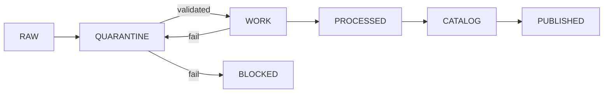

<!-- [KFM_META_BLOCK_V2]
doc_id: kfm://doc/TODO-governed-ci-patterns
title: Governed CI/CD Patterns (KFM)
type: standard
version: v1
status: draft
owners: TODO
created: TODO
updated: TODO
policy_label: TODO
related: [docs/architecture/CONTROL_PLANE_INDEX.md]
tags: [kfm, ci, governance]
notes: [Placement inferred; verify owners, dates, and related links]
[/KFM_META_BLOCK_V2] -->

# Governed CI/CD Patterns (KFM)

> Evidence-first CI/CD architecture for controlled, auditable, policy-enforced data publication.

---

## Status

- **Status:** draft  
- **Scope:** cross-domain (all KFM lanes)  
- **Authority:** architectural guidance (not executable pipeline)

---

## Quick Navigation

- [Purpose](#purpose)
- [Core Patterns](#core-patterns)
- [Lifecycle Enforcement](#lifecycle-enforcement)
- [Artifacts](#artifacts)
- [Policy Gates](#policy-gates)
- [Promotion Rules](#promotion-rules)
- [Reference Workflow](#reference-workflow)
- [Repository Placement](#repository-placement)
- [Checklist](#checklist)

---

## Purpose

This document defines how CI/CD operates inside the Kansas Frontier Matrix:

- Pipelines **produce evidence**, not just outputs  
- Every artifact is **traceable and reproducible**  
- Policy is **enforced at every stage**  
- Publication requires **explicit stewardship**

This is a **governed control system**, not a standard CI pipeline.

---

## Core Patterns

### 1. Scheduled Deterministic Rebuilds

Periodic recomputation ensures:

- stable `spec_hash`
- reproducibility of derived outputs
- validation of determinism

**Constraint:**  
Outputs are staged to `WORK`, never directly published.

---

### 2. Event-Driven Intake (Quarantine First)

All new data enters through:

```
RAW → QUARANTINE → validation → WORK
```

Rules:

- unknown inputs are **never trusted**
- failures are **retained**, not dropped
- every intake produces a **receipt**

---

### 3. LLM-Assisted QA (Advisory Only)

AI systems may:

- propose structured patches
- highlight anomalies
- assist validation

AI systems must NOT:

- assert truth
- bypass policy
- publish outputs

---

## Lifecycle Enforcement



---

## Artifacts

| Object | Description |
|-------|------------|
| EvidenceBundle | Full traceable evidence set |
| run_receipt | Execution record of pipeline |
| spec_hash | Deterministic identity hash |
| ReleaseManifest | Published artifact index |
| PromotionDecision | Steward approval record |
| ai_receipt | AI interaction trace |
| redaction_receipt | Proof of geoprivacy transforms |

---

## Policy Gates

All transitions are controlled by policy-as-code.

### Example (Rego)

```rego
package kfm.publish

default allow = false

deny[msg] {
  input.state == "RAW"
  msg := "RAW cannot be published"
}

deny[msg] {
  input.sensitivity == "restricted"
  input.output_scope == "public"
  msg := "Restricted data cannot be public"
}
```

**Rule:**  
Any `deny` = pipeline failure.

---

## Promotion Rules

| Stage | Allowed | Requirement |
|------|--------|------------|
| RAW | ingest | none |
| QUARANTINE | validate | receipt |
| WORK | compute | tests + policy pass |
| PROCESSED | transform | provenance complete |
| CATALOG | register | schema closure |
| PUBLISHED | release | **human sign-off required** |

---

### Critical Constraint

> ❗ Autonomous promotion to **PUBLISHED is forbidden**

---

## Reference Workflow

### Nightly Rebuild

```yaml
name: Recompute Spec

on:
  schedule:
    - cron: '0 02 * * *'

jobs:
  rebuild:
    runs-on: ubuntu-latest

    steps:
      - uses: actions/checkout@v4

      - name: Compute spec hash
        run: ./tools/spec_hash.sh input.json

      - name: Run policy checks
        run: conftest test .

      - name: Emit evidence
        run: ./tools/evidence/emit.sh

      - name: Sign artifacts
        run: ./tools/sign.sh
```

---

### Intake Workflow

```yaml
name: Intake

on:
  repository_dispatch:
    types: [source_object_new]

jobs:
  intake:
    runs-on: ubuntu-latest

    steps:
      - run: ./connectors/snapshot.sh
      - run: conftest test .
      - run: ./tools/diff.sh
      - run: ./tools/open_pr.sh
```

---

## Repository Placement

**Canonical path:**

```
docs/architecture/GOVERNED_CI_PATTERNS.md
```

### Rationale

- belongs to control-plane architecture
- governs all domains
- defines system-wide behavior

---

## Checklist

- [ ] deterministic spec_hash generation
- [ ] EvidenceBundle emitted
- [ ] run_receipt stored
- [ ] policy gates enforced
- [ ] signing applied
- [ ] promotion blocked without steward
- [ ] audit trail preserved

---

## Appendix

<details>
<summary>Spec Hash Example</summary>

```bash
jq --sort-keys -c . input.json | sha256sum
```

</details>

---

[Back to top](#governed-cicd-patterns-kfm)
