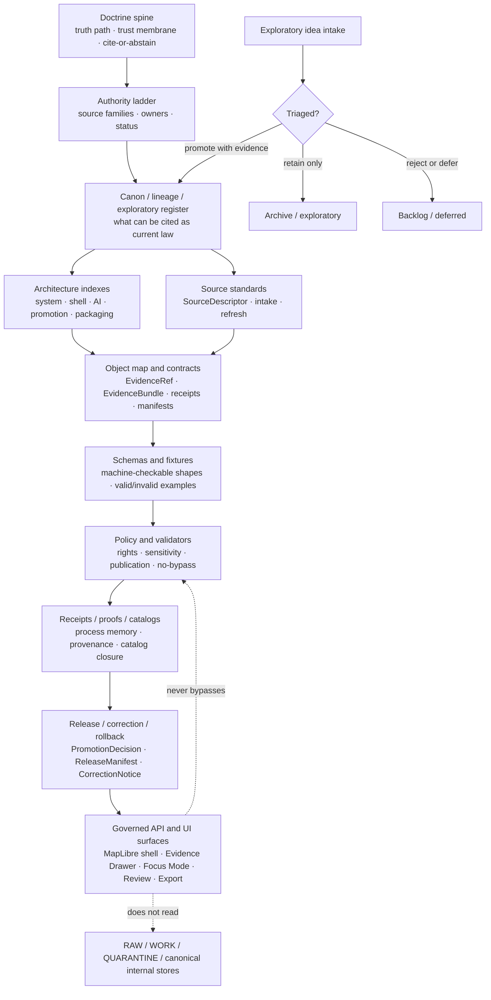

<!-- [KFM_META_BLOCK_V2]
doc_id: TODO-VERIFY-doc-id
title: Control Plane Index
type: standard
version: v1
status: draft
owners: TODO-VERIFY-documentation-owner
created: TODO-VERIFY-created-date
updated: 2026-05-03
policy_label: TODO-VERIFY-public-or-restricted
related: [TODO-VERIFY:docs/registers/AUTHORITY_LADDER.md, TODO-VERIFY:docs/registers/CANONICAL_LINEAGE_EXPLORATORY.md, TODO-VERIFY:docs/doctrine/DOCUMENTATION_LAW.md, TODO-VERIFY:contracts/OBJECT_MAP.md, TODO-VERIFY:docs/registers/VERIFICATION_BACKLOG.md]
tags: [kfm, control-plane, documentation-architecture, governance]
notes: [Revised from attached Markdown using attached KFM doctrine and planning corpus; mounted local repo state, owner, UUID, policy label, current adjacent links, CI enforcement, emitted artifacts, and runtime behavior remain NEEDS VERIFICATION before merge.]
[/KFM_META_BLOCK_V2] -->

# Control Plane Index

A navigation and governance index for KFM documentation, contracts, schemas, policies, proofs, releases, and trust-bearing surfaces.


> [!IMPORTANT]
> **Impact block**
>
> | Field | Value |
> | --- | --- |
> | Status | `experimental` — target placement, adjacent links, owners, and enforcement remain **NEEDS VERIFICATION** |
> | Owners | `TODO-VERIFY-documentation-owner` |
> | Target path | `docs/architecture/CONTROL_PLANE_INDEX.md` — **PROPOSED / NEEDS VERIFICATION** until checked in the real repo |
> | Document role | README-like architecture index + standard control-plane doc |
> | Evidence posture | **CONFIRMED** KFM doctrine from attached corpus; **LINEAGE** public-repo reports; **UNKNOWN** current mounted implementation depth |
> | Quick jumps | [Scope](#scope) · [Evidence boundary](#evidence-boundary) · [Repo fit](#repo-fit) · [Inputs](#accepted-inputs) · [Exclusions](#exclusions) · [Directory tree](#directory-tree) · [Diagram](#control-plane-diagram) · [Surface index](#surface-index) · [Object families](#object-families-the-control-plane-must-keep-separate) · [Rules](#operating-rules) · [Quickstart](#maintainer-quickstart) · [Gates](#merge-and-review-gates) · [Backlog](#open-verification-backlog) |

---

## Scope

This file is the control-plane entry point for KFM maintainers who need to answer:

- Which documentation surfaces are canonical, lineage-bearing, exploratory, implementation-facing, or superseded?
- Where do source authority, object families, schemas, fixtures, policies, receipts, proofs, releases, and rollback records belong?
- What must be updated when a source, schema, policy gate, release model, UI trust surface, or governed-AI surface changes?
- Which claims are **CONFIRMED**, **INFERRED**, **PROPOSED**, **UNKNOWN**, **CONFLICTED**, or **NEEDS VERIFICATION**?

**CONFIRMED doctrine:** KFM is a governed, evidence-first, map-first, time-aware spatial evidence and publication system. The public unit of value is the inspectable claim, not a tile, graph edge, dashboard, model output, renderer state, search hit, summary, scene, or narrative by itself.

**Control-plane purpose:** keep authority, evidence, policy, validation, release state, and correction lineage visible enough that maintainers can safely extend the system without turning strong prior reports, exploratory packets, UI polish, or generated language into accidental truth.

[Back to top](#control-plane-index)

---

## Evidence boundary

| Evidence class | Status in this revision | What it supports | What it does **not** prove |
| --- | --- | --- | --- |
| Attached Markdown being revised | **CONFIRMED** | Existing document structure, target concept, current placeholders, current directory assumptions, object-family language, and review gates | Current repo file existence or merged status |
| Attached KFM doctrine and architecture corpus | **CONFIRMED doctrine / LINEAGE implementation** | KFM invariants, terminology, trust membrane, evidence-first posture, MapLibre/UI/AI boundaries, source-ledger discipline | Current route names, package manager, CI behavior, active policies, emitted proof objects, or deployed runtime |
| Attached public-repo / implementation-reference reports | **LINEAGE / NEEDS VERIFICATION** | Prior repo-facing observations and likely path families to inspect | Current mounted checkout state in this session |
| Mounted local KFM repo | **UNKNOWN** | Nothing in this revision was directly verified from a mounted checkout | Branch, dirty state, exact file paths, tests, workflows, manifests, dashboards, logs, owners, and branch protections |
| External current sources | **NOT USED IN THIS REVISION** | N/A | Version-sensitive package, API, legal, rights, security, or endpoint claims |

> [!NOTE]
> This document states KFM doctrine where supported by project sources. Current implementation depth remains **UNKNOWN** where repo files, tests, workflows, dashboards, logs, platform settings, or emitted artifacts were not directly inspected in this session.

[Back to top](#control-plane-index)

---

## Repo fit

| Item | Value |
| --- | --- |
| Current file | `docs/architecture/CONTROL_PLANE_INDEX.md` — **PROPOSED / NEEDS VERIFICATION** |
| Upstream landing candidate | [`../README.md`](../README.md) — **NEEDS VERIFICATION** |
| Peer architecture candidate | [`README.md`](README.md) — **NEEDS VERIFICATION** |
| Primary register candidates | [`../registers/AUTHORITY_LADDER.md`](../registers/AUTHORITY_LADDER.md), [`../registers/CANONICAL_LINEAGE_EXPLORATORY.md`](../registers/CANONICAL_LINEAGE_EXPLORATORY.md), [`../registers/VERIFICATION_BACKLOG.md`](../registers/VERIFICATION_BACKLOG.md) — **NEEDS VERIFICATION** |
| Doctrine candidate | [`../doctrine/DOCUMENTATION_LAW.md`](../doctrine/DOCUMENTATION_LAW.md) — **NEEDS VERIFICATION** |
| Object-map candidate | [`../../contracts/OBJECT_MAP.md`](../../contracts/OBJECT_MAP.md) — **NEEDS VERIFICATION** |
| Schema-home candidate | [`../../schemas/README.md`](../../schemas/README.md) — **NEEDS VERIFICATION** |
| Policy-home candidate | [`../../policy/README.md`](../../policy/README.md) — **NEEDS VERIFICATION** |
| Downstream consumers | domain docs, source registries, schema authors, policy authors, validators, CI gates, release stewards, MapLibre shell, Evidence Drawer, Focus Mode, Review, Export, and governed-AI surfaces |

> [!CAUTION]
> Link targets are intentionally marked **NEEDS VERIFICATION**. If the real repo uses different canonical homes, update this file through an ADR or migration note rather than creating parallel authorities.

[Back to top](#control-plane-index)

---

## Accepted inputs

The control-plane index accepts only material that helps maintainers route authority, evidence, contracts, review, validation, or release state.

| Input | Belongs here when it... | Truth posture |
| --- | --- | --- |
| Documentation authority notes | Clarifies canon, lineage, exploratory, superseded, or current-support status | **CONFIRMED** only when verified in repo or governing corpus |
| Source authority decisions | Identifies source family, source role, rights posture, source status, cadence, or verification requirement | **PROPOSED** until source registry and policy support are verified |
| Object-family routing | Locates `SourceDescriptor`, `EvidenceRef`, `EvidenceBundle`, receipts, manifests, envelopes, reviews, releases, corrections, and rollback references | **PROPOSED** until object map/schema exists |
| Schema-home decisions | Resolves `contracts/` vs `schemas/` authority without dual drift | **CONFLICTED / NEEDS VERIFICATION** until ADR accepted |
| Policy and gate routing | Shows where rights, sensitivity, publication, no-bypass, source-role, citation, and release gates live | **PROPOSED** until policy files/tests exist |
| Release and rollback routing | Shows where promotion, withdrawal, correction, rollback, stale-artifact, and release-lineage logic is documented | **PROPOSED** until release objects are inspected |
| Trust-surface routing | Connects governed UI, Evidence Drawer, Focus Mode, Review, Export, MapLibre/Cesium docs, and runtime payload contracts to proof objects | **PROPOSED** until app contracts/tests exist |
| Verification backlog entries | Records claims blocked by missing repo, runtime, source, policy, rights, owner, or artifact evidence | **CONFIRMED gap** when the missing evidence is directly known |

[Back to top](#control-plane-index)

---

## Exclusions

| Does **not** belong here | Goes instead | Why |
| --- | --- | --- |
| Raw source data, unpublished candidate data, restricted records | `data/raw/`, `data/work/`, `data/quarantine/`, or repo-native lifecycle homes | This file must not become a data store or lifecycle bypass. |
| Machine schema definitions | `schemas/contracts/v1/`, `contracts/`, or accepted schema home | This file routes schema authority; it does not define executable schemas. |
| Policy-as-code bodies | `policy/` and policy tests | Policy must remain executable and testable, not buried in prose. |
| Generated receipts, proofs, releases, catalogs | `data/receipts/`, `data/proofs/`, `data/catalog/`, `release/`, or repo-native equivalent | Emitted artifacts are evidence instances, not index content. |
| Domain-specific architecture details | `docs/domains/<domain>/` or `docs/architecture/<domain>/` | This index governs cross-cutting control-plane placement. |
| Free-form AI prompts or model outputs | governed-AI docs, runtime contracts, evaluator fixtures, and receipts | AI is interpretive and subordinate to EvidenceBundle, policy, review, and release state. |
| Renderer-specific runtime state | MapLibre/Cesium architecture docs, manifests, and adapter tests | Renderers are downstream carriers, not source or publication authority. |
| Exploratory packet content copied as canon | `docs/intake/`, `docs/archive/exploratory/`, or canon register after triage | Exploratory material must be triaged before promotion. |
| Sensitive public-release decisions | policy, steward review, source registry, and promotion runbooks | Public release must not be decided by index wording alone. |

[Back to top](#control-plane-index)

---

## Directory tree

**PROPOSED / NEEDS VERIFICATION** until a mounted repo scan confirms actual homes.

```text
docs/
  README.md                                # docs landing candidate
  architecture/
    CONTROL_PLANE_INDEX.md                 # this file
    README.md                              # architecture landing candidate
    REPO_MAP.md                            # repo topology and boundary map
    SYSTEM_CONTEXT.md                      # whole-system architecture context
    shell/
      README.md                            # MapLibre / governed shell boundary
    ai/
      README.md                            # governed AI / Focus boundary
    promotion/
      README.md                            # promotion and release architecture
    packaging/
      README.md                            # release/package/export architecture
  doctrine/
    DOCUMENTATION_LAW.md                   # truth labels, authority, citation posture
    MASTER_DOCTRINE.md                     # repo-native doctrine spine candidate
    TERMINOLOGY.md                         # stable KFM vocabulary
  registers/
    AUTHORITY_LADDER.md                    # source hierarchy and authority rules
    CANONICAL_LINEAGE_EXPLORATORY.md       # canon/lineage/exploratory register
    DRIFT_REGISTER.md                      # contradiction and drift tracker
    VERIFICATION_BACKLOG.md                # repo/runtime proof backlog
  intake/
    IDEA_INTAKE.md                         # exploratory packet intake rules
    NEW_IDEAS_INDEX.md                     # packet inventory without promotion
  sources/
    SOURCE_DESCRIPTOR_STANDARD.md          # source-role and source-intake standard
    SOURCE_REFRESH_RULES.md                # refresh, cadence, and verification rules
  runbooks/
    PROMOTION_GATE.md                      # operator-facing promotion flow
    CORRECTION_AND_ROLLBACK.md             # correction, withdrawal, rollback flow
    SOURCE_REFRESH.md                      # source-refresh operator flow
  archive/
    lineage/
      README.md                            # retained prior doctrine and passes
    exploratory/
      README.md                            # retained unpromoted idea packets

contracts/
  OBJECT_MAP.md                            # proof-object and contract-family map

schemas/
  README.md                                # schema-home status and ADR link

policy/
  README.md                                # policy-home status and gate taxonomy

tests/
  fixtures/
    README.md                              # valid/invalid object examples and regression intent
```

[Back to top](#control-plane-index)

---

## Control-plane diagram

**PROPOSED, doctrine-grounded.** This diagram expresses responsibility boundaries; it does not assert that every target file already exists.



[Back to top](#control-plane-index)

---

## Surface index

| Surface | Target home | Truth role | Update trigger | Owner / authority | Missing-risk if absent |
| --- | --- | --- | --- | --- | --- |
| Authority ladder | `docs/registers/AUTHORITY_LADDER.md` | Canon routing | New source family, baseline, source role, or supersession decision | `TODO-VERIFY` | Strong documents compete as peers; source authority becomes tone-based. |
| Canon / lineage / exploratory register | `docs/registers/CANONICAL_LINEAGE_EXPLORATORY.md` | Canon boundary | New doc, archived doc, promoted packet, superseded pass | `TODO-VERIFY` | Exploratory packets can become accidental law. |
| Documentation law | `docs/doctrine/DOCUMENTATION_LAW.md` | Truth-label and documentation behavior | Truth-label change, citation posture change, doc policy change | `TODO-VERIFY` | Docs drift into persuasive but unverified claims. |
| Object map | `contracts/OBJECT_MAP.md` | Contract-family map | New object family, renamed envelope, release/proof model change | `TODO-VERIFY` | Lanes improvise incompatible receipts, bundles, and manifests. |
| Source descriptor standard | `docs/sources/SOURCE_DESCRIPTOR_STANDARD.md` | Source-role discipline | New source role, rights posture, cadence, source-intake gate, or source activation rule | `TODO-VERIFY` | Source authority collapses into “data source” without role and rights posture. |
| Schema-home ADR/status | `schemas/README.md` + schema-home ADR | Machine-shape routing | Any schema-bearing PR or contracts/schemas conflict | `TODO-VERIFY` | Dual schema authorities drift silently. |
| Policy home | `policy/README.md` | Gate and rule routing | New release rule, sensitivity rule, rights rule, no-bypass rule, citation rule, or denial state | `TODO-VERIFY` | Policy hides in prose or UI behavior instead of executable checks. |
| Fixture taxonomy | `tests/fixtures/README.md` or repo-native equivalent | Verification examples | New schema, policy gate, invalid case, golden fixture, or regression fixture | `TODO-VERIFY` | Validators can pass without representative negative cases. |
| Promotion runbook | `docs/runbooks/PROMOTION_GATE.md` | Operator flow | New release gate, proof-pack requirement, review requirement, or promotion state | `TODO-VERIFY` | Publication becomes a folder move or layer toggle. |
| Correction and rollback runbook | `docs/runbooks/CORRECTION_AND_ROLLBACK.md` | Reversibility flow | Withdrawal, correction, supersession, rollback drill | `TODO-VERIFY` | Release lineage can disappear or become unauditable. |
| Verification backlog | `docs/registers/VERIFICATION_BACKLOG.md` | Unknowns register | New blocked claim, missing repo proof, missing runtime artifact, missing owner, missing rights review | `TODO-VERIFY` | UNKNOWNs are smoothed into false confidence. |
| Drift register | `docs/registers/DRIFT_REGISTER.md` | Contradiction tracker | Conflicting docs, stale implementation claim, renamed path family, schema-home drift | `TODO-VERIFY` | Contradictions are hidden until implementation pressure exposes them. |

[Back to top](#control-plane-index)

---

## Object families the control plane must keep separate

| Object family | Minimum role | Must not be confused with |
| --- | --- | --- |
| `SourceDescriptor` | Declares source identity, role, cadence, rights posture, citation policy, and verification needs | Dataset record, citation text, or source convenience alias |
| `SourceIntakeRecord` | Records admission decision, source review, unresolved obligations, and activation posture | SourceDescriptor itself or public publication approval |
| `EvidenceRef` | Stable pointer from claim/layer/runtime output to evidence bundle | Evidence text, UI popup, or generated summary |
| `EvidenceBundle` | Resolved, inspectable support package for claims and outputs | Model context alone, tile metadata, search result, or layer popup |
| `ValidationReport` | Records validation pass/fail/quarantine outcomes | Promotion approval |
| `PolicyDecision` / `DecisionEnvelope` | Machine-readable policy result and rationale | Human review note or model explanation |
| `RuntimeResponseEnvelope` | Finite runtime response shape for UI/AI flows | Raw model text or ad hoc API payload |
| `RunReceipt` / `AIReceipt` | Process memory for executed run/model-assisted output | Published proof or claim authority |
| `ReviewRecord` | Human, steward, or policy-significant review state and obligations | ReleaseManifest or policy decision |
| `CatalogMatrix` / `CatalogClosure` | STAC/DCAT/PROV-style outward catalog closure and linkage | Internal truth source |
| `LayerManifest` / `StyleManifest` | Released visual/delivery artifact contract | Publication authority or evidence authority |
| `PromotionDecision` | Governed state transition decision | File move, deployment event, UI toggle, or generated recommendation |
| `ReleaseManifest` / `ReleaseProofPack` | Release-bearing artifact and proof assembly | Receipt folder, source registry, dashboard, or raw catalog entry |
| `CorrectionNotice` | Visible correction, supersession, withdrawal, or rollback lineage | Deletion or silent replacement |

> [!WARNING]
> Do not let one convenient artifact carry too many meanings. KFM’s trust model depends on separating source identity, evidence support, policy decision, review state, released artifact, runtime response, and correction lineage.

[Back to top](#control-plane-index)

---

## Operating rules

1. **Authority before fluency.** A clear source-status label outranks polished prose.
2. **Cite or abstain.** If a claim cannot resolve to admissible evidence, mark the failure state instead of smoothing it.
3. **Lifecycle stays visible.** `RAW -> WORK / QUARANTINE -> PROCESSED -> CATALOG / TRIPLET -> PUBLISHED` remains the default path.
4. **Promotion is a governed state transition.** It is not a file move, style toggle, UI publish button, deployment event, or data copy.
5. **Derived products are downstream.** Tiles, PMTiles, search indexes, graph projections, summaries, scenes, screenshots, dashboards, and AI outputs are carriers, not sovereign truth.
6. **Exploratory packets are intake, not canon.** They may become proposals, backlog, schemas, docs, tests, or source descriptors only after triage and evidence routing.
7. **Public clients use governed paths.** Normal UI and public clients must not read RAW, WORK, QUARANTINE, canonical/internal stores, restricted records, or direct model runtimes.
8. **AI is interpretive only.** EvidenceBundle, source role, policy, review, and release state outrank generated language.
9. **Rights and sensitivity fail closed.** Unclear rights, source terms, sovereignty, cultural sensitivity, precise sensitive locations, living-person, DNA, private-land, archaeological, ecological, or critical-infrastructure exposure blocks or restricts release.
10. **Rollback preserves lineage.** Withdrawal, correction, supersession, and rollback must remain queryable and reviewable.
11. **Repo-like paths are not repo facts.** A path proposed in a report remains **PROPOSED** until direct repo evidence confirms it.
12. **One accepted idea gets one canonical home.** Duplicate homes require an ADR, alias, migration note, or supersession record.

[Back to top](#control-plane-index)

---

## Maintainer quickstart

Use this when adding or revising a control-plane doc.

### 1. Verify repo state first

```bash
git status --short
git branch --show-current
git rev-parse --show-toplevel

find .github docs contracts schemas policy data tools tests apps packages infra release \
  -maxdepth 2 -type f 2>/dev/null | sort | sed -n '1,240p'
```

Record whether the target path is **CONFIRMED**, **PROPOSED**, **UNKNOWN**, **CONFLICTED**, or **NEEDS VERIFICATION** before editing.

### 2. Classify the material

| Question | Route |
| --- | --- |
| Is it stable doctrine or documentation law? | `docs/doctrine/` or repo-native doctrine home |
| Does it decide source authority or canon status? | `docs/registers/` |
| Is it exploratory packet material? | `docs/intake/`, `docs/archive/exploratory/`, or repo-native equivalent |
| Is it a human-readable object contract? | `contracts/` or accepted contract home |
| Is it executable shape? | `schemas/` or accepted schema home |
| Is it an executable rule or denial gate? | `policy/` |
| Is it an emitted evidence instance? | `data/receipts/`, `data/proofs/`, `data/catalog/`, `release/`, or repo-native equivalent |
| Is it an operator procedure? | `docs/runbooks/` |
| Is it domain-specific? | `docs/domains/<domain>/` or lane architecture home |
| Is it a trust-bearing UI/runtime payload? | shell/UI/AI architecture docs, object map, schemas, fixtures, and policy tests |

### 3. Update control-plane cross-references

At minimum, update:

- this file when a new cross-cutting surface is created;
- the authority ladder when source hierarchy changes;
- the canon/lineage/exploratory register when source status changes;
- the object map when an object family, envelope, manifest, receipt, or correction object changes;
- the verification backlog when a claim is blocked by missing repo/runtime/source evidence;
- the drift register when docs, paths, object homes, or implementation evidence conflict.

### 4. Run lightweight checks

```bash
# Baseline checks only. Replace or extend with repo-native commands after verification.
git diff --check

# Optional: list broken-looking local Markdown links for manual review.
python - <<'PY'
from pathlib import Path
import re

target = Path("docs/architecture/CONTROL_PLANE_INDEX.md")
if not target.exists():
    print(f"NEEDS VERIFICATION: {target} does not exist in this checkout.")
    raise SystemExit(0)

text = target.read_text(encoding="utf-8")
links = re.findall(r"\[[^\]]+\]\((?!https?://|#)([^)]+)\)", text)
for link in links:
    print(link)
PY
```

Add repo-native Markdown link checks, schema validation, policy tests, fixture tests, and CI smoke tests once their homes are **CONFIRMED**.

[Back to top](#control-plane-index)

---

## Change triggers

| Event | Required control-plane update |
| --- | --- |
| New source family admitted | `AUTHORITY_LADDER.md`, source descriptor standard, source registry, verification backlog |
| New exploratory packet | `IDEA_INTAKE.md`, `NEW_IDEAS_INDEX.md`, canon register if promoted |
| New object family | `OBJECT_MAP.md`, schema registry, fixture taxonomy, policy docs if gated |
| New schema version | schema-home ADR/status doc, object map, valid/invalid fixtures, validators |
| New policy gate | policy README, runbook, fixtures, CI gate matrix, review docs |
| New domain lane | domain README, lane architecture, source registry, lifecycle docs, control-plane backlink |
| New MapLibre / UI trust surface | shell architecture, LayerManifest/Drawer/Focus payload contracts, policy/no-bypass tests |
| New Cesium / 3D trust surface | 3D admission docs, scene/manifest contracts, policy/generalization tests |
| New governed-AI behavior | AI architecture, runtime envelope, citation validation, AIReceipt, no-direct-model-client policy |
| New release path | promotion runbook, ReleaseManifest shape, proof-pack expectations, rollback target |
| Correction, withdrawal, rollback | correction runbook, release lineage, catalog closure, affected layer/export docs |
| Repo topology change | repo map, this index, impacted landing pages, ADR if authority moves |
| Owner, status, or policy-label change | meta block, impact block, related register, and review notes |

[Back to top](#control-plane-index)

---

## Merge and review gates

Before this file or any adjacent control-plane file is merged:

- [ ] Metadata block fields are either grounded or explicitly marked `TODO-VERIFY`.
- [ ] Owners are confirmed or intentionally left as `TODO-VERIFY`.
- [ ] Status is visible in the impact block.
- [ ] Quick jumps work inside this file.
- [ ] Accepted inputs and exclusions are present.
- [ ] Relative links are checked or labelled **NEEDS VERIFICATION**.
- [ ] No claim says an implementation, route, workflow, schema, proof object, dashboard, runtime, deployment, or branch protection exists unless direct repo/runtime evidence supports it.
- [ ] Any proposed path is labelled **PROPOSED** or **NEEDS VERIFICATION** until confirmed.
- [ ] Exploratory packet material is not cited as current implementation authority.
- [ ] Control-plane changes update affected registers, object maps, runbooks, and verification backlog.
- [ ] Schema-home ambiguity is either resolved or explicitly carried forward as **CONFLICTED / NEEDS VERIFICATION**.
- [ ] Rollback path is obvious: reverting docs must not require data or runtime rollback unless a behavior PR is coupled to it.
- [ ] Long appendices are wrapped in `<details>`.
- [ ] Code fences are language-tagged.
- [ ] Mermaid diagram renders in GitHub.
- [ ] No visual polish weakens evidence, policy, review, validation, or rollback posture.

[Back to top](#control-plane-index)

---

## Rollback

Rollback is required if this document weakens the trust membrane, normalizes direct public access to internal stores, treats exploratory material as canon, creates schema-home conflict, hides uncertainty, breaks stable navigation without migration notes, or publishes unsupported implementation claims.

Rollback target: `ROLLBACK_TARGET_TBD_AFTER_REPO_INSPECTION`

Safe rollback path for this document alone:

1. Revert the Markdown file.
2. Restore prior links from affected landing pages.
3. Record the reason in the drift register or change log.
4. Leave any coupled behavior, schema, policy, or release rollback to the relevant runbook.

[Back to top](#control-plane-index)

---

## Open verification backlog

| Item | Status | Why it matters | How to close |
| --- | --- | --- | --- |
| Actual file existence at `docs/architecture/CONTROL_PLANE_INDEX.md` | **UNKNOWN** | Determines whether this is create, replace, or revise operation | Mount repo and inspect target path |
| Document owner | **NEEDS VERIFICATION** | Required for impact block and meta block | Confirm with repo maintainers or CODEOWNERS |
| `doc_id` UUID | **NEEDS VERIFICATION** | Required for stable doc identity | Generate or assign through repo-native doc registry |
| Created date | **NEEDS VERIFICATION** | Avoids fabricated metadata | Use commit history or set on first accepted commit |
| Policy label | **NEEDS VERIFICATION** | Determines public/restricted handling | Confirm doc classification policy |
| Adjacent links | **NEEDS VERIFICATION** | Prevents broken navigation | Run repo-native link checker after files exist |
| Schema home | **CONFLICTED / NEEDS VERIFICATION** | Prevents `contracts/` vs `schemas/` drift | Resolve through schema-home ADR |
| Contract home | **CONFLICTED / NEEDS VERIFICATION** | Prevents object semantics and executable shape from competing | Confirm accepted ownership split |
| CI gates | **UNKNOWN** | Determines whether checks are advisory or enforced | Inspect `.github/workflows/` or repo-native CI |
| Markdown/link checker | **UNKNOWN** | Determines merge-readiness automation | Inspect repo tooling and workflow expectations |
| Emitted proof examples | **UNKNOWN** | Blocks implementation maturity claims | Inspect release artifacts, receipts, proofs, dashboards, logs |
| Public UI/app homes | **UNKNOWN** | Blocks route/component claims | Inspect `apps/`, `ui/`, `web/`, `packages/` |
| Release and rollback implementation | **UNKNOWN** | Blocks publication-readiness claims | Inspect release manifests, proof packs, correction records |
| Source registry implementation | **UNKNOWN** | Blocks source-activation claims | Inspect `data/registry/` or repo-native equivalent |
| Public-repo implementation reference reconciliation | **NEEDS VERIFICATION** | Attached reports suggest repo surface area, but this session did not mount the repo | Re-run direct repo scan and update this index, repo map, and registers |

[Back to top](#control-plane-index)

---

<details>
<summary>Appendix A — Source-code register for this index</summary>

These source codes describe the evidence basis used to design this file. They are maintainers’ trace labels for repo adaptation, not proof that a repo file, route, test, or runtime already exists.

| Code | Source family | Status | Role in this file |
| --- | --- | --- | --- |
| `SRC-MD-ATTACHED` | Attached `Pasted markdown.md` | **CONFIRMED source document** | Baseline structure, target role, object-family table, quickstart, gates, backlog, and appendices |
| `SRC-DOC-ARCH` | KFM documentation architecture pass family | **CONFIRMED doctrine / LINEAGE repo observations** | Authority ladder, canon/lineage/exploratory split, documentation control-plane need, first-PR shape |
| `SRC-PIPE-V0.3` | Pipeline Living Implementation Manual v0.3 | **CONFIRMED doctrine / PROPOSED loop architecture** | Lifecycle, pipeline-first proof lane, query-save-validate-compile-review-promote-recompile loop, source authority register |
| `SRC-PASS-24` | Components Pass 24 | **CONFIRMED corpus synthesis / PROPOSED implementation guide** | Inspectable-claim center of gravity, artifactization, object-family convergence, current implementation-boundary caution |
| `SRC-IMPLEMENTATION-REF` | KFM Implementation Reference | **LINEAGE / NEEDS VERIFICATION** | Public-repo topology and implementation-surface observations to re-check in the real checkout |
| `SRC-MAPLIBRE-REV` | Revised MapLibre operating architecture | **CONFIRMED doctrine / PROPOSED implementation** | Renderer boundary, trust membrane, Evidence Drawer, Focus Mode, public-client rule, shell trust cues |
| `SRC-CESIUM-REV` | Revised Cesium architecture manual | **CONFIRMED doctrine / PROPOSED implementation** | Conditional 3D admission, downstream scene surfaces, 3D not truth authority |
| `SRC-GAI` | Governed AI source-ledger architecture report | **CONFIRMED doctrine / PROPOSED implementation** | Source ledger, provider-neutral AI, citation validation, runtime envelopes, no-direct-model-client posture |
| `SRC-OLLAMA` | Ollama / Ubuntu KFM integration guide | **CONFIRMED doctrine / PROPOSED implementation** | Local/private LLM placement behind governed API and finite runtime outcomes |
| `SRC-DOMAIN-LANES` | Domain-lane reports | **LINEAGE / PROPOSED implementation patterns** | Repeated control-plane pattern: lane README, architecture, lifecycle, source registry, validation/gates, release/rollback, changelog |
| `SRC-GIS-REF` | GIS and spatial reference corpus | **REFERENCE** | Spatial representation discipline; does not override KFM governance doctrine |

</details>

<details>
<summary>Appendix B — Minimal update record template</summary>

Use this lightweight record when a control-plane file changes and no richer ADR is required.

| Field | Value |
| --- | --- |
| Change date | `TODO(date): YYYY-MM-DD` |
| Changed file(s) | `TODO(owner): list changed paths` |
| Trigger | `new source / schema / policy / release / correction / doc status / topology change / other` |
| Truth-label impact | `CONFIRMED / INFERRED / PROPOSED / UNKNOWN / CONFLICTED / NEEDS VERIFICATION` |
| Object families affected | `TODO(owner): object families or none` |
| Source families affected | `TODO(owner): source families or none` |
| Policy impact | `none / rights / sensitivity / publication / source-role / no-bypass / AI / other` |
| Validation run | `TODO(owner): command or manual check` |
| Rollback note | `TODO(owner): exact rollback target` |
| Follow-up backlog item | `TODO(owner): backlog link or reason none` |

</details>

<details>
<summary>Appendix C — No-loss preservation assessment for this revision</summary>

| Existing element | Disposition | Reason |
| --- | --- | --- |
| KFM Meta Block v2 | **KEEP + UPDATE** | Preserves repo metadata pattern; updated date and notes to match this revision boundary. |
| README-like impact block | **KEEP + CLARIFY** | Required for orientation; clarified target path and evidence posture. |
| Core scope statement | **KEEP** | Strongly matches KFM doctrine and document purpose. |
| Unknown implementation-depth warning | **KEEP + SHARPEN** | Prevents overclaiming; clarified mounted repo vs attached public-repo report distinction. |
| Repo fit table | **KEEP + LABEL** | Useful navigation; labels remain NEEDS VERIFICATION. |
| Accepted inputs and exclusions | **KEEP + CLARIFY** | Maintains control-plane boundaries and prevents index sprawl. |
| Directory tree | **KEEP + ADD FIXTURE HOME** | Useful proposed map; added fixture taxonomy because validation examples are a recurring KFM gate. |
| Mermaid diagram | **KEEP** | Explains real responsibility boundaries rather than decorating the page. |
| Surface index | **KEEP + TIGHTEN** | Preserves cross-cutting registry map; tightened triggers and missing-risk language. |
| Object-family separation | **KEEP + TIGHTEN** | Central trust rule; clarified what each family must not become. |
| Operating rules | **KEEP + EXTEND** | Preserves doctrine; added repo-like path caution and one-canonical-home anti-sprawl rule. |
| Maintainer quickstart | **KEEP + IMPROVE** | Added `git rev-parse` and a small link-review snippet without implying repo tooling exists. |
| Change triggers | **KEEP + EXPAND** | Added Cesium/3D, owner/status/policy-label triggers. |
| Merge gates | **KEEP + TIGHTEN** | Adds schema-home and visual-polish checks. |
| Verification backlog | **KEEP + EXPAND** | Adds contract-home, checker, and public-repo-report reconciliation gaps. |
| Appendices | **KEEP + UPDATE** | Preserves source-code register and update template while making statuses more precise. |

</details>

[Back to top](#control-plane-index)
