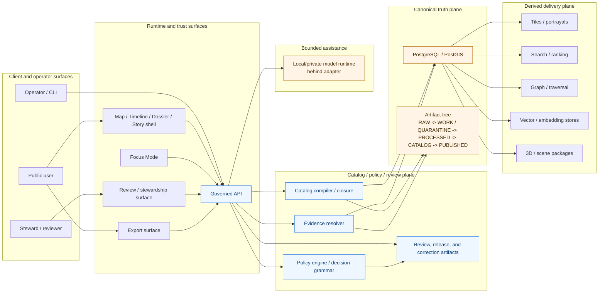
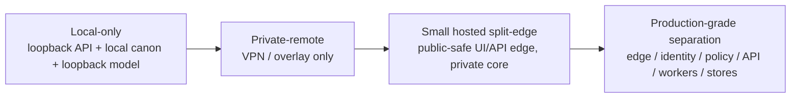

<!-- [KFM_META_BLOCK_V2]
doc_id: kfm://doc/<uuid:fill-at-commit-time>
title: Deployment Topology
type: standard
version: v1
status: draft
owners: @bartytime4life
created: YYYY-MM-DD
updated: YYYY-MM-DD
policy_label: NEEDS_VERIFICATION
related: [docs/architecture/README.md, infra/README.md, apps/README.md, packages/README.md, policy/README.md, contracts/README.md, .github/workflows/README.md]
tags: [kfm]
notes: [Replaces a scaffold placeholder on current public main; fill doc_id and dates at commit time; mounted manifests, workflow YAML, and live runtime evidence were not directly verified in this session.]
[/KFM_META_BLOCK_V2] -->

# Deployment Topology

Placement, exposure, and progression rules for how KFM runs without weakening the truth path, trust membrane, or evidence-bounded public surfaces.

> **Status:** draft  
> **Owners:** @bartytime4life  
> **Repo fit:** `docs/architecture/DEPLOYMENT_TOPOLOGY.md`  
> **Upstream / adjacent:** [`./README.md`](./README.md) · [`../../infra/README.md`](../../infra/README.md) · [`../../apps/README.md`](../../apps/README.md) · [`../../packages/README.md`](../../packages/README.md) · [`../../policy/README.md`](../../policy/README.md) · [`../../contracts/README.md`](../../contracts/README.md) · [`../../.github/workflows/README.md`](../../.github/workflows/README.md)  
> **Compact badges:**      
> **Quick jump:** [Scope](#scope) · [Repo fit](#repo-fit) · [Current repo-grounded snapshot](#current-repo-grounded-snapshot) · [Topology law](#topology-law) · [Deployment profiles](#deployment-profiles) · [Diagram](#diagram) · [Exposure and bind rules](#exposure-and-bind-rules) · [Verification quickstart](#verification-quickstart) · [Definition of done](#definition-of-done)

> [!IMPORTANT]
> This document is intentionally **evidence-bounded**.
>
> It separates:
>
> 1. **CONFIRMED doctrine** from the attached KFM architecture corpus,
> 2. **CONFIRMED repo-grounded public-main evidence** from attached repo summary artifacts, and
> 3. **PROPOSED realization guidance** where manifests, units, bind addresses, workflow YAML, or live runtime behavior were **not** directly reverified in this session.
>
> It does **not** claim direct verification of mounted deployment manifests, live ports, runtime logs, or current production wiring.

## Scope

This document defines the deployment topology KFM should preserve across local, private-remote, hosted, and more separated runtime profiles.

It covers:

- runtime placement by responsibility
- exposure and bind discipline
- progression from the smallest credible governed slice to stronger separation
- mapping between KFM's operational planes and deployable surfaces
- verification checkpoints for turning doctrine into mounted implementation fact

It does **not** redefine:

- source admission law
- contract-family contents
- policy-bundle semantics
- detailed UI choreography
- lane-specific publication rules in full
- vendor-by-vendor infrastructure implementation

Use adjacent architecture, policy, contract, and infrastructure docs for those.

[Back to top](#deployment-topology)

## Repo fit

| Topic | Lives here | Why this file exists |
|---|---|---|
| Deployment placement and exposure | `docs/architecture/DEPLOYMENT_TOPOLOGY.md` | Names the runtime shape, hard boundaries, and progression rules |
| Architecture index and neighboring doctrine | [`./README.md`](./README.md) | Nearby entry point for architecture docs |
| Infrastructure lanes | [`../../infra/README.md`](../../infra/README.md) | Environment wiring, ops surfaces, and deployable lanes |
| Application surfaces | [`../../apps/README.md`](../../apps/README.md) | User, review, API, CLI, and worker-facing runtime roles |
| Shared package boundaries | [`../../packages/README.md`](../../packages/README.md) | Shared law, adapters, and reusable seams |
| Policy runtime surfaces | [`../../policy/README.md`](../../policy/README.md) | Deny-by-default posture, reason/obligation grammar, and policy packages |
| Contract surfaces | [`../../contracts/README.md`](../../contracts/README.md) | Contract families, schemas, and outward trust objects |
| Workflow evidence boundary | [`../../.github/workflows/README.md`](../../.github/workflows/README.md) | Current public-tree workflow visibility and gate posture |

### Accepted inputs

This file should accept material such as:

- deployment profiles and progression rules
- plane-to-runtime placement guidance
- bind / ingress / egress discipline
- exposure prohibitions
- topology diagrams
- phase-one local runtime guidance
- hosted separation guidance
- verification commands and review checklists

### Exclusions

This file should **not** become the dumping ground for:

- full Kubernetes manifests
- full Terraform module documentation
- host hardening runbooks in full
- route-by-route OpenAPI detail
- detailed policy bundle logic
- lane-specific source atlases
- speculative “current production” claims not backed by direct evidence

Those belong in `infra/`, `policy/`, `contracts/`, `docs/runbooks/`, and the relevant lane or app docs instead.

[Back to top](#deployment-topology)

## Current repo-grounded snapshot

The attached repo-grounded materials confirm broad public-repo shape and several documentation/control surfaces, but they do **not** prove mounted runtime wiring.

| Surface | Current evidence in hand | Deployment consequence | Confidence |
|---|---|---|---|
| Repo-root structure | `apps/`, `packages/`, `contracts/`, `policy/`, `data/`, `infra/`, `docs/`, `tools/`, `tests/`, `configs/`, `scripts/`, `migrations/`, and `examples/` are described in repo-grounded inventory | This topology doc can safely speak about **root responsibility bands** | **CONFIRMED** at repo root |
| Governance scaffolding | `.github/CODEOWNERS` and `.github/PULL_REQUEST_TEMPLATE.md` are reported present | Deployment must preserve review and trust checks, not just service reachability | **CONFIRMED** |
| Workflow visibility | `.github/workflows/README.md` is reported present, and repo-grounded review warns against claiming active workflow YAML merge gates from the visible tree | Do **not** claim mounted merge-blocking workflow YAML as current fact | **CONFIRMED** visibility; **UNKNOWN** executable gate inventory |
| Contract / schema / policy docs | `contracts/README.md`, `schemas/README.md`, `policy/README.md`, `tests/README.md`, `tools/README.md`, and `scripts/README.md` are reported present | Control surfaces are documented; exact executable coverage remains separate verification work | **CONFIRMED** docs; **UNKNOWN** full implementation depth |
| Runtime proof objects | Repo-grounded materials do **not** confirm real proof packs, mounted response envelopes, live Rego bundles, or checked-in policy tests as implemented runtime fact | Keep release proof, negative-path runtime behavior, and mounted policy execution visibly unverified | **UNKNOWN** |
| Public-main freshness | The freshest repo-grounded summary in hand is dated **2026-03-22 UTC** | Prefer it over older repo summaries when describing visible current-state limits | **CONFIRMED** |

> [!NOTE]
> This section is intentionally narrower than a real tree walk.
>
> It is grounded in attached **repo-grounded summaries**, not in a directly mounted checkout of the repository at response time.

### Working interpretation

- **CONFIRMED from doctrine:** KFM expects topology to preserve the truth path, trust membrane, evidence resolution, fail-closed behavior, and correction visibility.
- **CONFIRMED from repo-grounded evidence:** public-main includes the expected root responsibility zones and governance/documentation scaffolding.
- **NEEDS VERIFICATION:** exact app internals, bind addresses, reverse proxies, systemd units, compose files, Kubernetes overlays, workflow YAML, listening ports, and current deployment maturity.

[Back to top](#deployment-topology)

## Topology law

Deployment topology is part of the **trust model**, not a late infrastructure appendix.

### Governing rules

| Rule | Meaning | Consequence |
|---|---|---|
| Governed APIs are the normal edge | Clients read through governed interfaces, not raw canonical stores | No standard browser or public client path to PostgreSQL / PostGIS, artifact zones, or model runtime |
| Reachability is not publication | A service being reachable is not the same thing as an object being releasable | Review, policy, evidence resolution, and release state still govern outward use |
| Derived delivery stays downstream | Tiles, search, graph, vector, scene, export, and summary layers remain rebuildable by default | Fast layers must not quietly become authority |
| Smallest credible runtime first | KFM should prove one governed slice before multiplying infra complexity | Local-first and thin-slice deployment is the default starting posture |
| Exposure is phase-aware | Bind as narrowly as the current deployment phase allows | Loopback and private bindings come before public ingress |
| Correction is topology-relevant | Correction, supersession, narrowing, and withdrawal must stay visible after deployment changes | Public-safe surfaces still need lineage and status cues |
| Focus stays behind the membrane | Governed assistance is bounded by scope, evidence, policy, and citations | Public clients never talk to model serving directly |
| 2D stays default | Deployment should not force 3D-first product behavior | 3D remains conditional, burden-bearing, and subject to the same evidence rules |

### Non-negotiable posture

- **Truth path stays explicit:** `Source edge -> RAW -> WORK / QUARANTINE -> PROCESSED -> CATALOG -> PUBLISHED`
- **Trust membrane stays explicit:** no convenience bypass from UI or public clients into stores, policy engines, or model serving
- **Authoritative-vs-derived split stays explicit:** graph, search, tiles, scenes, summaries, and caches remain rebuildable unless explicitly promoted
- **Negative outcomes stay first-class:** hold, quarantine, abstain, deny, stale-visible, withdrawn, superseded, and error are valid runtime states
- **Promotion stays governed:** deployment success does not equal trusted publication

[Back to top](#deployment-topology)

## Deployment profiles

The corpus points to a progression, not a single mandatory final form.

| Profile | Public exposure | Governed API | Canonical truth + artifact zones | Model runtime | Best fit |
|---|---|---|---|---|---|
| **Local-only** | None | Loopback only | Local only; explicit lifecycle zones | Loopback only | Thin-slice proof, doctrine-to-runtime validation, single-host development |
| **Private-remote** | No public edge; trusted VPN / overlay only | Private address only | Private only | Private only | Trusted collaborator or steward access without public ingress |
| **Small hosted split-edge** | Public UI and/or public-safe API edge | Public-safe edge for approved scope | Private or more tightly controlled | Usually private | First meaningful hosted public surface without exposing canon |
| **More separated production** | Intentional public edge | Edge/API separation by responsibility | Separate stores/services by plane where justified | Separate where burden warrants | Stronger blast-radius control, operational ownership, and scale |

### Profile selection rule

Choose the **smallest profile that preserves the trust membrane and meets the actual burden**.

Do not jump to orchestration, public ingress, or service multiplication merely because infrastructure lanes exist in the repo.

### Home-to-hosted progression

| Step | Expected bind posture | What changes | What must stay true |
|---|---|---|---|
| Local-only | `localhost` / private container network | Single-host proof slice | Plane boundaries still visible |
| Private-remote | VPN / overlay addresses | Trusted off-host access | No public direct path into canon or model serving |
| Small hosted | Public-safe UI/API edge + private core | First public entry point | Sensitive lanes stay private; release law unchanged |
| Production-grade separation | Edge, identity, policy, API, workers, stores, model serving separated | Stronger scale + blast-radius control | Same truth path, same trust membrane, same correction discipline |

[Back to top](#deployment-topology)

## Diagram

> [!NOTE]
> The diagram below shows **doctrinal component families and placement rules**. It is not a claim that every box is already a mounted service in the current repo.

### Plane-aware deployment topology



### Progression ladder



[Back to top](#deployment-topology)

## Plane-to-runtime mapping

| KFM plane | Main responsibility | Likely runtime placement | Must not bypass |
|---|---|---|---|
| Source and intake plane | source descriptors, raw capture, ingest receipts, validation, quarantine routing | connectors, ingest jobs, admission tooling | public browser paths; canonical writes from UI |
| Canonical truth plane | canonical entities, observations, features, claims, immutable dataset versions, processed artifacts | PostgreSQL / PostGIS plus controlled builders and approved repair lanes | direct client reads; derived write-back |
| Catalog / policy / review plane | closure, rights, sensitivity, review, release, correction | catalog compiler, policy runtime, stewardship surfaces, decision stores | public publication without gates; policy-significant self-approval |
| Derived delivery plane | maps, tiles, search, graph, vector, exports, scenes | projection workers, caches, portrayal bundles, rebuildable delivery services | silent authority promotion |
| Runtime and trust-surfaces plane | governed API, evidence resolution, shell, Focus coordination, review console, ops/status | governed API plus public/steward/operator surfaces | store bypass, uncited answer path, hidden correction state |

### Route-family exposure matrix

| Route family | Normal exposure | Trust obligation |
|---|---|---|
| Catalog and discovery | Public-safe after release | Catalog closure and identifier consistency must resolve cleanly |
| Feature or subject read | Public-safe after release | Stable subject ID, support/time semantics, rights posture, and release scope are mandatory |
| Map / tile / portrayal | Public-safe after release | Must inherit release linkage, policy posture, freshness, and correction state |
| Evidence resolution | Governed API only | Every EvidenceRef must resolve to admissible published scope with audit linkage |
| Story / dossier / compare | Governed API only | Must preserve spatial anchor, temporal anchor, and drill-through to evidence |
| Export and report | Governed API only | Exports may not outrun release state, policy posture, or correction linkage |
| Focus / governed assistance | Governed API only | Scope, citations, policy, and audit linkage must stay visible in the same pane |
| Review / stewardship | Internal / private only | No hidden approvals; every action emits review and decision artifacts |
| Ops / status | Internal only | Must not become a second truth surface |

[Back to top](#deployment-topology)

## Exposure and bind rules

### Default bind philosophy

Bind every service to the **narrowest scope** that still satisfies the current deployment phase.

| Surface | Preferred bind in phase one | Public exposure stance | Why |
|---|---|---|---|
| Governed API | Loopback | Not public in phase one | Keeps the normal truth boundary explicit while local |
| PostgreSQL / PostGIS | Unix socket or loopback | Must not be public | Canonical truth store is not a client surface |
| Artifact tree | Filesystem only | Must not be public | Lifecycle zones are not outward truth surfaces |
| Model runtime | Loopback only | Must not be public | Assistance stays subordinate to evidence and policy |
| Policy / review stores | Local or private only | Must not be public | Control-plane state is not a casual admin surface |
| Review / stewardship UI | Private only unless deliberately split and strongly gated | Not public by default | Stewardship is not a convenience mirror of public UX |
| Public reverse proxy / edge | None in phase one | Added only when public edge is intentional | Public ingress is a later burden, not a starting assumption |

### Must-never-be-directly-internet-exposed

- canonical PostgreSQL / PostGIS
- RAW / WORK / QUARANTINE artifact stages
- direct filesystem access to lifecycle zones
- local/private model runtime
- policy bundles and review-state stores
- steward-only moderation or approval internals
- any direct path that allows public clients to skip evidence resolution or policy evaluation

> [!WARNING]
> “It is only on the LAN” is not a topology argument.
>
> KFM treats convenience exposure that weakens the trust membrane as architectural debt.

### Public edge rule

When a public edge exists, it should expose only:

- the intended user-facing UI
- the public-safe governed API surface
- TLS termination and request forwarding
- traceable request identifiers needed for audit joining

It should **not** create a hidden convenience path into canonical truth, unpublished artifacts, or direct model serving.

[Back to top](#deployment-topology)

## Current repo-aligned topology map

This section translates current attached repo-grounded evidence into a deployment-reading aid.

| Repo-adjacent surface | Current evidence basis | Topology role | Confidence |
|---|---|---|---|
| `apps/` | Reported present at repo root | Runnable surfaces: UI, API, CLI, workers, or comparable app-family boundaries | **CONFIRMED** at root; internals **NEEDS VERIFICATION** |
| `packages/` | Reported present at repo root | Shared law, adapters, catalogs, evidence, domain, policy, or other reusable modules | **CONFIRMED** at root; internals **NEEDS VERIFICATION** |
| `contracts/` + `schemas/` | Reported as doc surfaces; schema inventory not confirmed as live `.json` files in reviewed tree | Contract/control surface, not proof of mounted execution by itself | **CONFIRMED** docs; executable depth **UNKNOWN** |
| `policy/` | `policy/README.md` reported present | First-class deny-by-default policy surface | **CONFIRMED** doc surface |
| `data/` | Reported present at repo root | Lifecycle zones, sample artifacts, catalogs, or manifests may live nearby | **CONFIRMED** root path; exact substructure **NEEDS VERIFICATION** |
| `infra/` | Reported present at repo root | Environment wiring, deployment lanes, and ops assets | **CONFIRMED** root path; exact manifests **NEEDS VERIFICATION** |
| `tools/` + `scripts/` | README surfaces reported present | Validators and automation entrypoints are intended, but current mounted executability was not proved in this session | **CONFIRMED** doc surface; runtime depth **UNKNOWN** |
| `tests/` | README surface reported present | Test taxonomy exists as documentation; runnable harness coverage remains unverified | **CONFIRMED** doc surface; harness coverage **UNKNOWN** |
| `.github/CODEOWNERS` + `.github/PULL_REQUEST_TEMPLATE.md` | Reported present | Review and governance scaffolding | **CONFIRMED** |
| `.github/workflows/README.md` | Reported present; active workflow YAML merge gates not confirmed in reviewed tree | Workflow evidence boundary and honesty constraint | **CONFIRMED** visibility; gate inventory **UNKNOWN** |

### Reading rule for maintainers

Use this file to answer **where responsibilities should run** and **what may be exposed**.

Use the actual manifests, units, overlays, route definitions, and workflow files to answer **how the repo currently does it**.

If those disagree, fix the disagreement openly. Do not smooth it away in prose.

[Back to top](#deployment-topology)

## Verification quickstart

Use these checks before upgrading any statement here from **PROPOSED** to **implementation-confirmed**.

### 1) Inventory the visible repo shape

```bash
git rev-parse --show-toplevel
find apps packages contracts schemas policy data infra docs tools tests configs scripts migrations examples .github \
  -maxdepth 3 -print | sort
```

### 2) Surface manifests, units, workflows, and overlays

```bash
find infra .github/workflows -type f \( \
  -name '*.service' -o \
  -name '*.timer' -o \
  -name '*.socket' -o \
  -name '*.tf' -o \
  -name '*.yaml' -o \
  -name '*.yml' -o \
  -name 'compose*.yml' -o \
  -name 'docker-compose*.yml' \
\) | sort
```

### 3) Find bind / ingress / exposure clues

```bash
grep -RInE 'localhost|127\.0\.0\.1|0\.0\.0\.0|listen|port|ingress|LoadBalancer|NodePort|proxy_pass|wireguard|wg-quick' \
  apps infra configs scripts packages policy 2>/dev/null
```

### 4) Check trust-membrane vocabulary against mounted implementation

```bash
grep -RInE 'EvidenceBundle|EvidenceRef|RuntimeResponseEnvelope|CorrectionNotice|governed-api|governed API|abstain|deny|release_manifest|catalog_closure|proof_pack' \
  apps packages contracts schemas policy docs tests 2>/dev/null
```

### 5) Confirm workflow reality instead of assuming it

```bash
find .github/workflows -maxdepth 2 -type f | sort
```

### 6) Check whether contract and policy starter artifacts are real or still documentary

```bash
find contracts schemas policy tests -maxdepth 4 -type f | sort
```

> [!TIP]
> Treat these as **verification commands**, not refactor prompts.
>
> Inventory first. Promote confidence later.

[Back to top](#deployment-topology)

## Definition of done

A deployment-topology doc is in good shape when all of the following are true:

- [ ] doctrine and repo-grounded current-state evidence are separated cleanly
- [ ] at least one meaningful Mermaid diagram explains real boundary logic
- [ ] bind and exposure rules are explicit
- [ ] phase progression is smallest-first
- [ ] public-edge and never-expose rules are named clearly
- [ ] repo-adjacent surfaces are mapped without overstating unverified internals
- [ ] workflow visibility limits are stated honestly
- [ ] no claim implies mounted manifests or production wiring that were not directly reverified
- [ ] verification commands are present
- [ ] unknowns remain visible instead of being polished away

[Back to top](#deployment-topology)

## FAQ

### Why start local-first instead of orchestration-first?

Because KFM's first burden is proving governed behavior, not proving infrastructure ambition. A single-host governed slice can preserve the trust membrane more honestly than a prematurely elaborate stack.

### Does this rule out Kubernetes, Terraform, GitOps, or multi-service deployment?

No. It says they should be introduced when they carry real operational value and still preserve the same trust law.

### Why is deployment topology in `docs/architecture/` instead of only `infra/`?

Because placement and exposure decisions change trust behavior. In KFM, that is architecture, not just ops plumbing.

### Why is model runtime placement treated so strictly?

Because governed assistance is subordinate to released evidence and policy. Public clients should not talk to model serving directly, and model runtime must not become a hidden shortcut around evidence resolution.

[Back to top](#deployment-topology)

## Appendix

<details>
<summary><strong>Open verification backlog</strong></summary>

| Item | Why it matters | What resolves it |
|---|---|---|
| Actual service units / manifests | Converts profile guidance into mounted runtime fact | Surface real `systemd`, `compose`, `kubernetes`, `terraform`, or hosted overlays now in use |
| Exact bind addresses and ports | Determines whether exposure discipline is truly enforced | Inspect configs, unit files, reverse proxies, and listening sockets |
| Current workflow YAML | Determines whether topology checks are machine-enforced | Surface checked-in workflow files and recent run evidence |
| Real contract inventory | Determines how much trust behavior is executable vs documentary | Surface actual schema files, fixtures, validators, and policy tests |
| Release proof packs / manifests | Determines whether promotion is operational rather than rhetorical | Surface one real release receipt, proof pack, or release manifest |
| Runtime response envelope examples | Needed before claiming answer / abstain / deny / error as mounted runtime behavior | Surface one contract plus one evaluated sample |
| Rights / sensitivity workflow samples | Needed before strong claims about review-safe public release for sensitive lanes | Surface public/generalized vs restricted/steward examples |
| Exact owners / doc_id / dates | Needed for metadata hygiene | Fill at commit time from repo conventions and review outcome |

</details>

<details>
<summary><strong>Authoring note</strong></summary>

This document intentionally upgrades a scaffold placeholder into a doctrine-led topology standard without pretending that live deployment evidence was fully reverified. It should help maintainers reason about placement, exposure, and progression **while keeping current mounted implementation gaps visible**.

</details>
