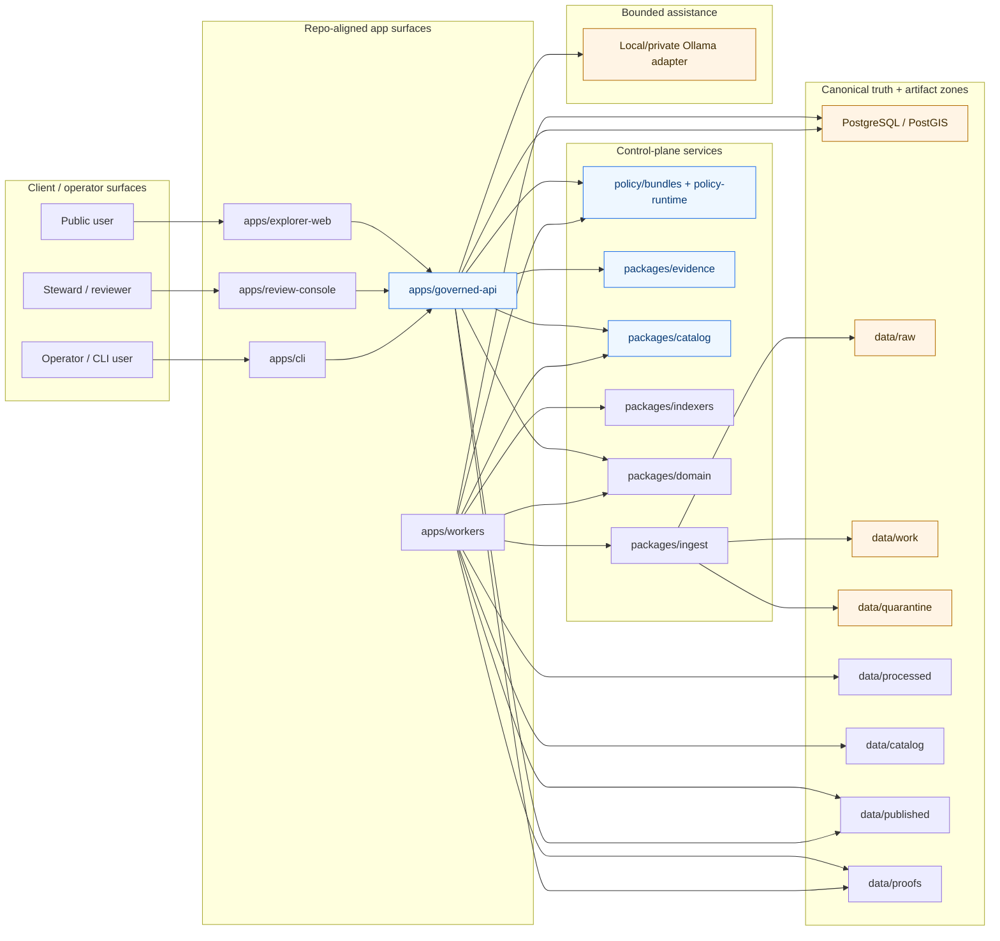
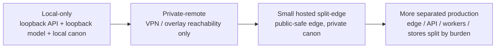

<!-- [KFM_META_BLOCK_V2]
doc_id: kfm://doc/<uuid:fill-at-commit-time>
title: Deployment Topology
type: standard
version: v1
status: draft
owners: @bartytime4life
created: YYYY-MM-DD
updated: YYYY-MM-DD
policy_label: NEEDS_VERIFICATION
related: [docs/architecture/README.md, infra/README.md, apps/README.md, packages/README.md, policy/README.md, contracts/README.md, .github/workflows/README.md]
tags: [kfm]
notes: [Replaces a scaffold placeholder on current public main; fill doc_id and dates at commit time; mounted manifests, workflow YAML, and live runtime evidence were not directly verified in this session.]
[/KFM_META_BLOCK_V2] -->

# Deployment Topology

Placement, exposure, and progression rules for how KFM runs without weakening the truth path, trust membrane, or evidence-bounded public surfaces.

> **Status:** draft  
> **Owners:** @bartytime4life  
> **Repo fit:** `docs/architecture/DEPLOYMENT_TOPOLOGY.md`  
> **Upstream / adjacent:** [`./README.md`](./README.md) · [`../../infra/README.md`](../../infra/README.md) · [`../../apps/README.md`](../../apps/README.md) · [`../../packages/README.md`](../../packages/README.md) · [`../../policy/README.md`](../../policy/README.md) · [`../../contracts/README.md`](../../contracts/README.md) · [`../../.github/workflows/README.md`](../../.github/workflows/README.md)  
> **Compact badges:**      
> **Quick jump:** [Scope](#scope) · [Current public-main snapshot](#current-public-main-snapshot) · [Topology law](#topology-law) · [Deployment profiles](#deployment-profiles) · [Diagram](#diagram) · [Exposure rules](#exposure-and-bind-rules) · [Verification quickstart](#verification-quickstart) · [Definition of done](#definition-of-done)

> [!IMPORTANT]
> This document is intentionally **repo-aware** and **evidence-bounded**. It combines:
> 1. **CONFIRMED** public-repo structure visible on current public `main`, and
> 2. **CONFIRMED doctrine / PROPOSED realization** from the attached KFM architecture corpus.
>
> It does **not** claim that mounted manifests, live ports, workflow YAML, or current production wiring were directly verified.

## Scope

This document defines the deployment topology KFM should preserve across local, private-remote, hosted, and more separated runtime profiles.

It covers:

- runtime placement by responsibility
- exposure and bind discipline
- topology progression from smallest credible local slice to stronger separation
- mapping between KFM's architectural planes and repo/runtime surfaces
- verification checkpoints for converting doctrine into mounted implementation guidance

It does **not** redefine:

- truth-path semantics
- contract family contents
- policy rule language
- UI choreography
- data modeling specifics
- infrastructure vendor selection in full detail

For those, use the adjacent architecture and surface docs first.

[Back to top](#deployment-topology)

## Repo fit

| Topic | Lives here | Why this file exists |
|---|---|---|
| Deployment placement and exposure | `docs/architecture/DEPLOYMENT_TOPOLOGY.md` | Names the runtime shape, boundaries, and progression rules |
| Infra inventory and environment surfaces | [`../../infra/README.md`](../../infra/README.md) | Repo-facing entry point for infra directories and environment lanes |
| App surfaces and shell responsibilities | [`../../apps/README.md`](../../apps/README.md) | Defines user/operator-facing runtimes and shell expectations |
| Shared package boundaries | [`../../packages/README.md`](../../packages/README.md) | Defines reusable law and internal responsibility seams |
| Policy runtime surfaces | [`../../policy/README.md`](../../policy/README.md) | Defines deny-by-default policy posture and policy package scope |
| Contract surfaces | [`../../contracts/README.md`](../../contracts/README.md) | Defines contract intent and warns against overstating live schema inventory |
| Workflow evidence | [`../../.github/workflows/README.md`](../../.github/workflows/README.md) | Current public-main workflow visibility boundary |

### Accepted inputs

This file should accept material such as:

- deployment profiles and progression rules
- service placement by plane or trust obligation
- bind/exposure rules
- ingress / egress notes
- local-first vs hosted split guidance
- topology diagrams
- verification checklists for manifests, services, and overlays
- environment-class distinctions that affect placement but not doctrine

### Exclusions

This file should **not** become the dumping ground for:

- full Kubernetes manifests
- full Terraform module docs
- runbook step-by-step recovery procedures
- deep package API docs
- route-by-route OpenAPI detail
- policy bundle semantics
- speculative production claims not backed by mounted evidence

Those belong in `infra/`, `docs/runbooks/`, `contracts/`, `policy/`, or the relevant app/package docs instead.

[Back to top](#deployment-topology)

## Current public-main snapshot

The current public repository surface confirms the broad shape of the project, but not the mounted runtime wiring.

| Area | Current public-main evidence | Deployment consequence |
|---|---|---|
| Target file | This file was a scaffold placeholder before this revision | A topology doc was expected, but not yet developed |
| `apps/` | `cli/`, `explorer-web/`, `governed-api/`, `review-console/`, `workers/` | App-facing topology should distinguish user, review, API, and worker roles |
| `packages/` | `catalog/`, `domain/`, `evidence/`, `indexers/`, `ingest/`, `policy/` | Shared logic already groups around trust-bearing seams |
| `infra/` | `backup/`, `compose/`, `dashboards/`, `gitops/`, `hosted/`, `kubernetes/`, `local/`, `monitoring/`, `systemd-or-compose/`, `systemd/`, `terraform/` | The repo deliberately keeps multiple deployment lanes visible |
| `policy/` | `bundles/`, `fixtures/`, `policy-runtime/`, `tests/` | Policy is intended as a first-class runtime/deployment concern |
| `contracts/` | Public main currently shows `README.md` only | Do not overclaim live schema inventory from repo layout alone |
| `.github/workflows/` | Public main currently shows `README.md` only | Do not claim active checked-in workflow YAML on public main without re-verification |

> [!NOTE]
> The public repo shows the **shape of responsibility** clearly enough to ground a topology doc. It does **not** by itself prove active service graphs, open ports, ingress methods, or deployment maturity.

### Working interpretation

- **CONFIRMED from repo:** top-level app/package/infra/policy responsibility zones exist.
- **CONFIRMED from doctrine:** KFM expects deployment to preserve the truth path, trust membrane, EvidenceBundle-centered inspectability, and bounded AI.
- **NEEDS VERIFICATION:** exact manifests, bind addresses, ingress controllers, timers/services, workflow gates, and live environment classes.

[Back to top](#deployment-topology)

## Topology law

Deployment topology is part of the **trust model**, not a late infra appendix.

### Governing rules

| Rule | Meaning | Consequence |
|---|---|---|
| Governed API is the normal truth boundary | Clients read through governed interfaces, not raw stores | No direct browser/client path to canonical DB, artifact roots, or local model runtime |
| Deployment does not replace promotion | A service being reachable is not the same as an artifact being publishable | Release state, policy, evidence resolution, and correction still govern outward use |
| Derived delivery stays downstream | Maps, tiles, search, graph, vector, scene, and exports remain subordinate unless explicitly promoted | Delivery caches and projections must not silently become authority |
| Smallest credible runtime first | KFM should prove one governed slice before scaling deployment complexity | Local-first phase-one topology is preferred before full hosted separation |
| Exposure is phase-aware | Bind to the narrowest scope that satisfies the current deployment phase | Loopback and private bindings are preferred until public edge behavior is justified |
| Correction is topology-relevant | Correction visibility must survive runtime placement changes | Public surfaces must still show stale, superseded, withdrawn, narrowed, or denied states visibly |

### Non-negotiable posture

- **Truth path stays explicit:** `Source edge -> RAW -> WORK / QUARANTINE -> PROCESSED -> CATALOG -> PUBLISHED`
- **Trust membrane stays explicit:** no convenience bypass from UI or clients into stores or model runtimes
- **Map-first shell stays explicit:** deployment should support Explorer/Timeline/Dossier/Evidence Drawer/Focus without splitting trust cues into disconnected products
- **2D remains default:** topology must not bias the product toward spectacle-first 3D deployment
- **Negative outcomes remain first-class:** abstain, deny, stale-visible, withdrawn, and error are valid runtime states

[Back to top](#deployment-topology)

## Deployment profiles

The corpus points to a progression, not a single mandatory final form.

| Profile | Public exposure | Governed API | Canonical DB + artifact tree | Model runtime | Best use |
|---|---|---|---|---|---|
| **Local-only** | None | Loopback only | Local only; explicit lifecycle zones | Loopback only | Thin-slice proof, development, doctrine-to-runtime validation |
| **Private-remote** | No public edge; VPN / overlay only | Private address only | Private only | Private only | Small trusted review/operator access before public exposure |
| **Small hosted split-edge** | Public UI and/or public-safe API edge | Public-safe edge for approved scope | Private or more tightly controlled | Usually private | First meaningful hosted public surface without exposing canon |
| **More separated production** | Intentional public edge | Edge/API separation by responsibility | Separate stores/services by plane where warranted | Separate only when justified | Stronger blast-radius control, scale, operational ownership, SLOs |

### Profile selection rule

Choose the **smallest profile that preserves the trust membrane and meets the current operational burden**.

Do not jump to orchestration, public ingress, or service multiplication merely because those tools are available in `infra/`.

[Back to top](#deployment-topology)

## Diagram

### Plane-aware deployment topology



### Progression ladder



[Back to top](#deployment-topology)

## Plane-to-runtime mapping

| KFM plane | Main responsibility | Likely runtime placement | Must not bypass |
|---|---|---|---|
| Source and intake plane | source descriptors, raw capture, ingest receipts, validation, quarantine routing | worker jobs, ingest services, source connectors | public browser paths; canonical writes from UI |
| Canonical truth plane | canonical entities, observations, claims, immutable versions, processed artifacts | PostgreSQL/PostGIS plus controlled builders and approved repair lanes | direct client reads; derived write-back |
| Catalog / policy / review plane | closure, rights, sensitivity, review, release, correction | catalog compiler, policy runtime, review-facing services | public publication without gates; policy-significant self-approval |
| Derived delivery plane | maps, tiles, search, graph, vector, exports, scenes | projection/build workers, caches, delivery services | silent authority promotion |
| Runtime and trust-surfaces plane | governed API, evidence resolution, shell, Focus coordination, review console | governed API plus app surfaces | store bypass, uncited answer path, hidden correction state |

### Repo-aligned reading

A repo-aligned topology for current public `main` maps cleanly to:

- `apps/governed-api/` → runtime and trust-surfaces plane
- `apps/workers/` → intake, canonical build, projection, and packaging execution
- `apps/explorer-web/` and `apps/review-console/` → trust-visible shell surfaces
- `packages/ingest/`, `packages/domain/`, `packages/catalog/`, `packages/evidence/`, `packages/policy/`, `packages/indexers/` → reusable control/data-plane law
- `policy/` and `contracts/` → cross-cutting control surfaces
- `infra/` → environment wiring, not business meaning

[Back to top](#deployment-topology)

## Exposure and bind rules

### Default bind philosophy

Bind every service to the **narrowest scope** that still satisfies the current deployment phase.

| Surface | Preferred bind in phase one | Public exposure stance | Why |
|---|---|---|---|
| Governed API | Loopback | Not public in phase one | Keeps the normal truth boundary explicit while local |
| PostgreSQL / PostGIS | Unix socket or loopback | Must not be public | Canonical truth store is not a client surface |
| Artifact roots / lifecycle zones | Filesystem only | Must not be public | Lifecycle stages are not outward truth surfaces |
| Ollama / model runtime | Loopback only | Must not be public | Bounded assistance stays behind the membrane |
| Policy bundles / contract registries | Local/private only | Must not be public | Trust grammar should not be casually exposed as an admin surface |
| Review / stewardship internals | Private only unless intentionally split and strongly gated | Not public by default | Stewardship is not a convenience mirror of public UX |
| Public reverse proxy | None in phase one | Only when a public edge is intentional | Public edge is a later stage, not a starting assumption |

### Must-never-be-directly-internet-exposed

- canonical PostgreSQL / PostGIS
- RAW / WORK / QUARANTINE artifact stages
- direct filesystem access to artifact roots
- local Ollama runtime
- graph / vector / search admin surfaces
- policy bundles and contract registries
- review/steward-only internals unless deliberately separated and strongly gated

> [!WARNING]
> A home router, NAT, or “it’s only on the LAN” posture is not enough to weaken these boundaries. KFM's topology rules treat convenience exposure as architectural debt.

### Public edge rule

When a public edge exists, it should expose only:

- the public-safe governed API
- the intended user-facing UI
- public TLS termination and request forwarding
- structured request identifiers needed for audit joining

It should **not** create a hidden convenience path into canon, unpublished artifacts, or model serving.

[Back to top](#deployment-topology)

## Current repo-aligned topology map

This section translates current public repo structure into a deployment-reading aid.

| Repo surface | Current public evidence | Topology role | Confidence |
|---|---|---|---|
| `apps/explorer-web/` | present | public shell surface | CONFIRMED path, PROPOSED runtime wiring |
| `apps/governed-api/` | present | governed truth boundary | CONFIRMED path, PROPOSED bind/exposure |
| `apps/review-console/` | present | steward/review shell variation | CONFIRMED path, PROPOSED separation level |
| `apps/workers/` | present | ingestion/build/projection execution | CONFIRMED path, PROPOSED job topology |
| `apps/cli/` | present | operator / local admin entry | CONFIRMED path, PROPOSED commands and privileges |
| `packages/catalog/` | present | closure / outward metadata logic | CONFIRMED path |
| `packages/domain/` | present | canonical/domain law | CONFIRMED path |
| `packages/evidence/` | present | evidence resolution / trust linkage | CONFIRMED path |
| `packages/indexers/` | present | derived search/indexing | CONFIRMED path |
| `packages/ingest/` | present | intake and source-landed movement | CONFIRMED path |
| `packages/policy/` | present | policy runtime support | CONFIRMED path |
| `policy/` | present with bundles/fixtures/policy-runtime/tests | first-class policy surface | CONFIRMED path family |
| `infra/` | present with local/systemd/compose/kubernetes/terraform etc. | environment-specific wiring lanes | CONFIRMED path family |
| `.github/workflows/` | README visible; no workflow YAML publicly visible at review time | workflow evidence boundary | CONFIRMED public-tree visibility only |
| `contracts/` | README visible publicly | contract-intent surface | CONFIRMED path, NEEDS VERIFICATION for live inventory |

### Reading rule for maintainers

Use this file to answer **where** responsibilities should run and **what may be exposed**.

Use the runtime inventory, manifests, units, overlays, and workflow files to answer **how this repo currently does it**.

If those two disagree, fix the disagreement openly. Do not paper over it in prose.

[Back to top](#deployment-topology)

## Verification quickstart

Use these checks before upgrading any statement in this file from **PROPOSED** to **implementation-confirmed**.

### 1) Inventory actual runtime artifacts

```bash
git rev-parse --show-toplevel
find infra apps packages policy .github/workflows -maxdepth 3 -print | sort
```

### 2) Surface manifests, units, and overlays

```bash
find infra -type f \( \
  -name '*.service' -o \
  -name '*.timer' -o \
  -name '*.socket' -o \
  -name '*.tf' -o \
  -name '*.yaml' -o \
  -name '*.yml' -o \
  -name 'compose*.yml' -o \
  -name 'docker-compose*.yml' \
\) | sort
```

### 3) Find bind / port / exposure clues

```bash
grep -RInE 'localhost|127\.0\.0\.1|0\.0\.0\.0|listen|port|ingress|LoadBalancer|NodePort|proxy_pass|wg-quick|wireguard' \
  apps infra configs scripts packages 2>/dev/null
```

### 4) Check trust-membrane vocabulary against runtime

```bash
grep -RInE 'EvidenceBundle|EvidenceRef|governed-api|policy|abstain|deny|withdrawn|stale|release_manifest|catalog_closure' \
  apps packages contracts policy docs tests 2>/dev/null
```

### 5) Confirm workflow reality

```bash
find .github/workflows -maxdepth 2 -type f | sort
```

> [!TIP]
> Treat these as **verification** commands, not blind refactor prompts. Inventory first. Rename and move later.

[Back to top](#deployment-topology)

## Definition of done

A deployment-topology doc is in good shape when all of the following are true:

- [ ] current public repo structure and doctrine are separated cleanly
- [ ] at least one meaningful Mermaid diagram explains real boundary logic
- [ ] bind and exposure rules are explicit
- [ ] deployment profiles are phase-aware and smallest-first
- [ ] direct-public exposure prohibitions are named clearly
- [ ] current repo surfaces (`apps/`, `packages/`, `infra/`, `policy/`, `contracts/`) are mapped to topology roles
- [ ] `.github/workflows/` visibility limits are stated honestly
- [ ] no claim implies live manifests or production wiring that were not directly verified
- [ ] verification commands are provided
- [ ] open unknowns remain visible instead of being smoothed away

[Back to top](#deployment-topology)

## FAQ

### Why start local-first instead of orchestrated-first?

Because KFM's first burden is proving governed behavior, not demonstrating infrastructure fashion. A single-host governed slice can preserve the trust membrane more honestly than a prematurely elaborate stack.

### Does this document rule out Kubernetes, Terraform, or GitOps?

No. It says they should be introduced when their operational value exceeds their governance burden, not before.

### Why is deployment topology in `docs/architecture/` instead of only `infra/`?

Because placement and exposure decisions change trust behavior. In KFM, that is architecture, not merely ops plumbing.

### Why are model runtimes treated so strictly?

Because bounded synthesis is admitted only as a subordinate method. Public clients should not talk to model serving directly, and assistance should not gain a hidden path around policy or evidence resolution.

[Back to top](#deployment-topology)

## Appendix

<details>
<summary><strong>Open verification backlog</strong></summary>

| Item | Why it matters | What resolves it |
|---|---|---|
| Actual service units / manifests | Converts profile guidance into mounted runtime fact | Surface `systemd`, `compose`, `kubernetes`, `terraform`, or hosted overlays now in use |
| Actual bind addresses and ports | Determines whether exposure discipline is truly enforced | Inspect configs, unit files, ingress/proxy config, and listening sockets |
| Current workflow YAML | Determines whether topology checks are machine-enforced | Surface checked-in workflow files and recent run evidence |
| Current contract inventory | Determines how much runtime trust behavior is already executable | Surface real schemas, fixtures, and validation entrypoints |
| Exact owners / document dates / UUID | Needed for final metadata hygiene | Fill at commit time from repo conventions and review outcome |
| Public edge behavior | Needed before claiming hosted/public-safe route maturity | Verify reverse proxy, TLS, auth, policy, and audit joining behavior |

</details>

<details>
<summary><strong>Authoring note</strong></summary>

This document is intentionally stronger than the old scaffold but still conservative about implementation certainty. Its job is to make topology legible without pretending the mounted runtime has already been audited.

</details>
