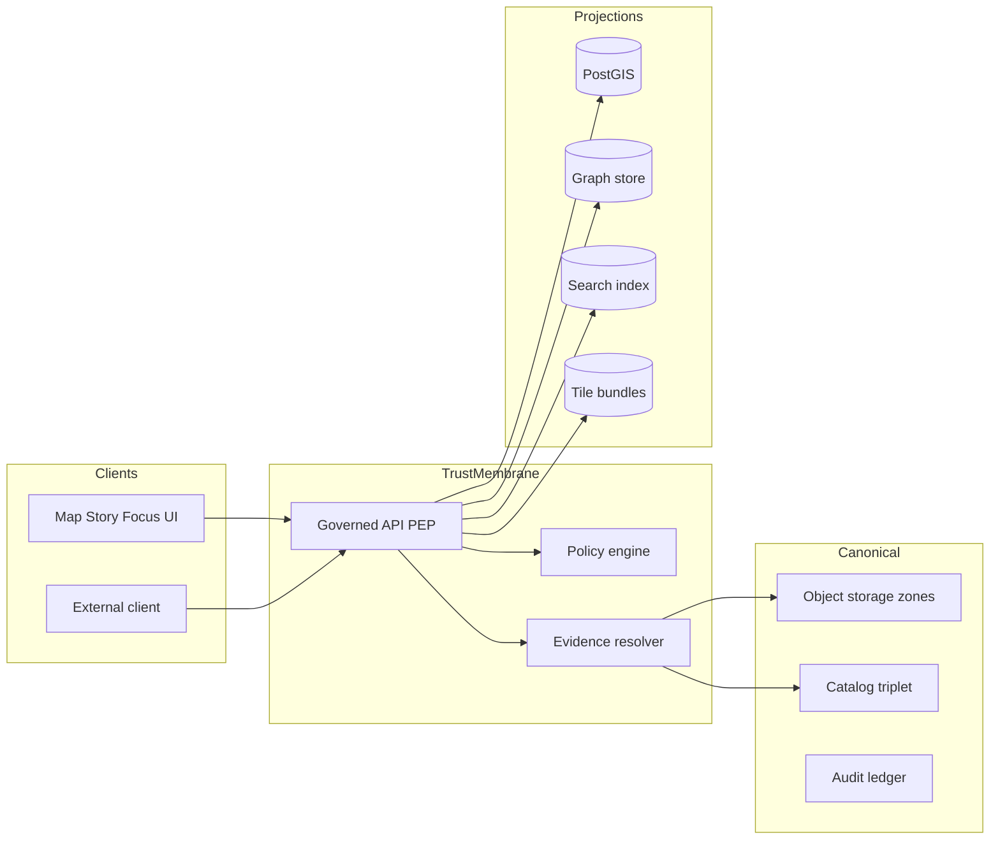
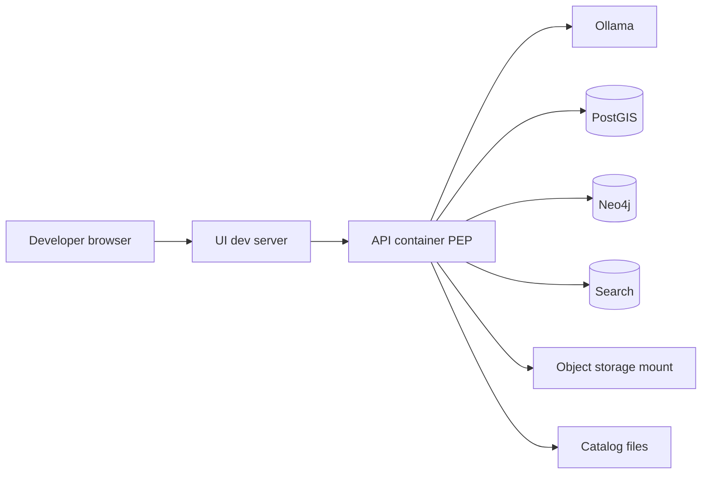
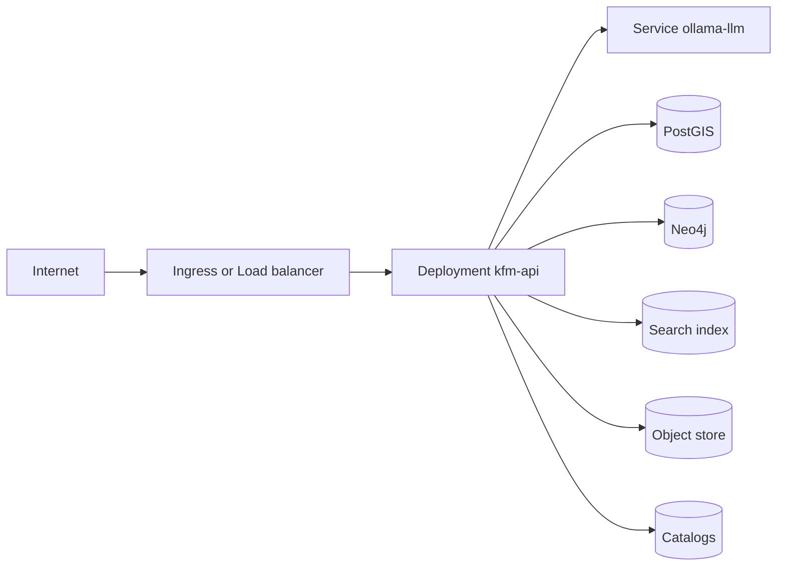

<!-- [KFM_META_BLOCK_V2]
doc_id: kfm://doc/8b6c8d7a-6df4-4b50-9f52-4ce8d4d3b3f4
title: Deployment topology
type: standard
version: v1
status: draft
owners: [TBD]
created: 2026-03-04
updated: 2026-03-04
policy_label: restricted
related:
  - docs/architecture/README.md
  - docs/architecture/TRUST_MEMBRANE.md
  - docs/architecture/DATA_LIFECYCLE_ZONES.md
  - docs/ops/README.md
  - infra/
tags: [kfm, architecture, deployment, ops]
notes:
  - "This is a topology reference and promotion-safety document, not a runbook. Concrete manifests live under infra/."
[/KFM_META_BLOCK_V2] -->

# Deployment topology

Define the supported deployment topologies for KFM (local dev → single-host → Kubernetes), and the non‑negotiable governance boundaries each topology must enforce.

> **Status:** draft  
> **Owners:** TBD (Architecture + Ops)  
> **Policy label:** restricted  
> **Where it fits:** `docs/architecture/` → constrains `infra/` and ops runbooks  
>
> 
> 
> 

## Quick navigation

- [Scope](#scope)
- [Claim status legend](#claim-status-legend)
- [Non-negotiable invariants](#non-negotiable-invariants)
- [Topology overview](#topology-overview)
- [Canonical stores and rebuildable projections](#canonical-stores-and-rebuildable-projections)
- [Topology A Local development](#topology-a-local-development)
- [Topology B Single host](#topology-b-single-host)
- [Topology C Kubernetes](#topology-c-kubernetes)
- [Security boundaries](#security-boundaries)
- [CI CD and rollout](#ci-cd-and-rollout)
- [Verification steps](#verification-steps)
- [Definition of done](#definition-of-done)

## Scope

**This document covers:**
- Network boundaries and “who can talk to what”
- Runtime surfaces versus data stores
- Service decomposition guidance (monolith-first, split later)
- Storage placement and persistence expectations (high level)
- Minimum operational expectations (health, rollback posture)

**This document does not cover:**
- Exact Terraform, Helm, or Compose files (those belong in `infra/`)
- Vendor-specific guidance (AWS/GCP/Azure) beyond topology patterns
- Dataset-specific pipeline schedules or QA thresholds (those belong to dataset specs)

## Claim status legend

KFM uses **CITE-OR-ABSTAIN** discipline for architecture claims.

- **CONFIRMED** — required invariant / posture that must be enforced (tests + policy gates).
- **PROPOSED** — recommended default build plan that may evolve with scale.
- **UNKNOWN** — not specified here; includes the smallest verification steps to confirm.

## Non-negotiable invariants

- **CONFIRMED:** KFM enforces a **truth path** across lifecycle zones (Upstream → RAW → WORK/Quarantine → PROCESSED → CATALOG/Triplet → PUBLISHED).  
- **CONFIRMED:** **No PUBLISHED surface** exists unless promotion gates pass (fail-closed).  
- **CONFIRMED:** A **trust membrane** exists: clients and UI **must not** access stores directly; reads/writes must go through governed interfaces with policy enforcement.  
- **CONFIRMED:** Focus and Story publishing must verify citations resolve and are policy-allowed; otherwise abstain or reduce scope.  

## Topology overview

At runtime, users only touch governed surfaces; storage is behind the trust membrane.



### Service decomposition posture

- **PROPOSED:** For early stability, prefer a **modular monolith backend** with separate modules:
  - `api` (governed endpoints)
  - `policy` (OPA adapter + fixtures)
  - `evidence` (resolver)
  - `catalog` (parsers/validators)
  - `ingest` (connectors + runner)
  - `indexers` (build projections)

- **PROPOSED:** Split modules into distinct services only when scale and failure domains require it.

## Canonical stores and rebuildable projections

This topology uses a strict “canonical vs projection” separation.

### Canonical stores

- **PROPOSED baseline:** object storage for RAW/WORK/PROCESSED artifacts  
- **PROPOSED baseline:** catalogs triplet (DCAT/STAC/PROV) as contract surfaces  
- **PROPOSED baseline:** audit ledger as append-only log

### Rebuildable projections

- **PROPOSED baseline:** PostGIS tables derived from processed artifacts  
- **PROPOSED baseline:** search index derived from processed text and metadata  
- **PROPOSED baseline:** graph edges derived from catalogs + entity resolution  
- **PROPOSED baseline:** tile bundles derived from processed features  

**Operational rule:** if projections drift or are corrupted, they must be rebuildable from canonical stores.

## Topology A Local development

A single-machine developer topology, typically Docker Compose.

**Goals**
- Fast onboarding
- Repeatable service wiring
- Explicit boundaries that match production

**PROPOSED shape**
- `kfm-api` as one container (modular monolith internally)
- `policy` running as side service or embedded adapter (implementation choice)
- `ollama` as a separate container or host process, called via `OLLAMA_API_URL`
- Postgres/PostGIS, Neo4j, and search index are local containers
- Object storage is either local filesystem mount or MinIO (if needed to mimic S3)



### Configuration essentials

- **PROPOSED:** API calls Ollama via `OLLAMA_API_URL` (example: `http://ollama:11434` in Compose).  
- **PROPOSED:** Use `depends_on` to reduce cold-start ordering issues.

Example environment snippet:

```bash
export OLLAMA_API_URL="http://ollama:11434"
```

## Topology B Single host

A single Linux server hosting KFM for “small production” or lab environments.

**PROPOSED**
- Same as local dev, but:
  - persistent volumes are mandatory for canonical storage and key projections
  - network segmentation is enforced at host firewall level
  - backups are scheduled and tested

**UNKNOWN**
- Exact backup retention targets and RPO/RTO.  
  - Verification steps: check `docs/ops/` for backup/restore runbook; if missing, create it and define targets.

## Topology C Kubernetes

Baseline for production-scale deployment.

**PROPOSED**
- Each major component runs in its own Deployment.
- Use an isolated namespace.
- Expose only the governed API externally.
- Ollama is internal-only (ClusterIP) and called by service DNS.



### Example namespace layout

- `Deployment/kfm-api` with 2+ replicas
- `Deployment/ollama-llm` with 1 replica initially
- `Service/kfm-api` exposed via Ingress or LoadBalancer
- `Service/ollama-llm` ClusterIP internal-only

### Persistence notes

- **PROPOSED:** Ollama uses a PersistentVolume to keep models cached.
- **PROPOSED:** Datastores use PersistentVolumes (or managed equivalents).

### Multi-region and high availability

- **PROPOSED:** Span availability zones and use managed Postgres where appropriate; replicate where needed.
- **UNKNOWN:** exact HA topology for each datastore (depends on chosen products and budget).  
  - Verification steps: decide whether Postgres is managed; choose Neo4j cluster mode; define failover tests.

## Security boundaries

### Trust membrane enforcement

- **CONFIRMED:** Clients and UI must not access DB/object storage directly.  
- **CONFIRMED:** Policy must be evaluated uniformly at the PEP, and evidence must be policy-checked before disclosure.

### Network segmentation

- **PROPOSED:** isolate database services from public ingress using:
  - Kubernetes NetworkPolicies or host firewalls
  - least-privilege service accounts
  - no store ports exposed outside the cluster/VPC

### Secrets handling

- **PROPOSED:** no secrets in repo; use Docker/K8s secrets mechanisms.
- **UNKNOWN:** exact secret rotation policy.  
  - Verification steps: create `docs/ops/SECRETS_AND_ROTATION.md` and implement CI guardrails for leaks.

## CI CD and rollout

- **PROPOSED:** Containerize all services and deploy via GitOps for consistent promotion across environments.
- **PROPOSED:** CI runs lint/test/contract validation and builds images; CD applies manifests.
- **PROPOSED:** Rollback uses versioned manifests/helm releases and readiness/liveness gates.

## Verification steps

Smallest steps to turn UNKNOWN into CONFIRMED:

1. Confirm the repo contains an `infra/` directory with either Helm or raw manifests for:
   - API deployment
   - Ollama deployment
   - at least one datastore
2. Confirm a policy test harness exists and runs in CI (OPA fixtures + fail-closed).
3. Confirm no UI/client code path bypasses the API for data reads:
   - network: stores not exposed publicly
   - code: adapters/repositories are the only storage access path
4. Confirm canonical storage layout exists for RAW/WORK/PROCESSED/CATALOG and that promotion is gated.

## Definition of done

- [ ] Topology A Compose wiring exists under `infra/compose/` (or equivalent) and matches the trust membrane.
- [ ] Topology C Kubernetes manifests exist under `infra/k8s/` (or equivalent) with:
  - namespace isolation
  - internal-only services for datastores and Ollama
  - external-only ingress for governed API
- [ ] Evidence resolver + policy enforcement points are documented and test-enforced.
- [ ] Backup and restore runbook exists and is validated by a fire-drill exercise.
- [ ] Observability basics exist: structured logs, metrics, health checks, alerts.
- [ ] A rollback procedure exists and is practiced on staging.

---

Back to top: [Deployment topology](#deployment-topology)
