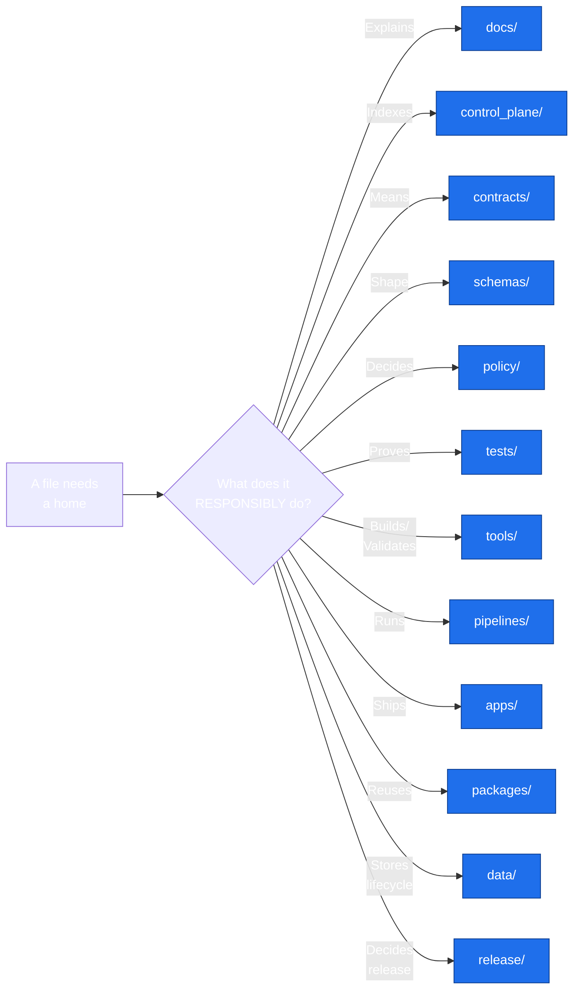
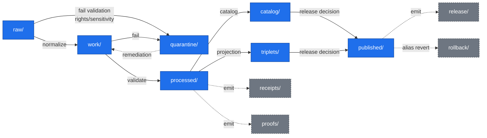

<!-- [KFM_META_BLOCK_V2]
doc_id: kfm://doc/directory-rules
title: Directory Rules
type: standard
version: v1
status: draft
owners: Docs steward
created: 2026-05-14
updated: 2026-05-14
policy_label: public
related:
  - docs/doctrine/directory-rules.md   # PROPOSED CANONICAL HOME (see §0)
  - docs/doctrine/authority-ladder.md
  - docs/doctrine/truth-posture.md
  - docs/doctrine/trust-membrane.md
  - docs/doctrine/lifecycle-law.md
  - docs/architecture/contract-schema-policy-split.md
  - docs/adr/ADR-0001-schema-home.md
  - docs/registers/DRIFT_REGISTER.md
  - docs/registers/VERIFICATION_BACKLOG.md
tags: [kfm, doctrine, architecture, placement, governance]
notes:
  - "Placement of THIS file is itself an open Directory Rules question: see §0 and the NOTE callout below. The doctrine's own §0 names docs/doctrine/directory-rules.md as the canonical home; the present file at docs/architecture/DIRECTORY_RULES.md is PROPOSED and should be resolved by ADR or migration."
[/KFM_META_BLOCK_V2] -->

# Directory Rules

> **Where a file lives encodes who owns it, what governance it answers to, and what lifecycle it belongs to. Topic does not justify a root folder; responsibility does.**

<p align="center">
  
  
  
  
  
  
</p>

**Status:** `draft` · **Authority:** `Docs steward` + subsystem owners · **Last updated:** `2026-05-14` · **Path placement:** `PROPOSED — see §0`

> [!IMPORTANT]
> **Placement of this very file is an open Directory Rules question.** The doctrine's own §0 lists **`docs/doctrine/directory-rules.md`** as the **PROPOSED canonical home** for these rules. The present file sits at **`docs/architecture/DIRECTORY_RULES.md`**. Per §2.5, do not silently treat the second location as canon — either (a) move this file to `docs/doctrine/directory-rules.md`, (b) open an ADR amending the canonical-home rule, or (c) keep this path as an explicit compatibility surface (`mirror`) per §8, with a README declaring the class. Until resolved, all references to "this file" remain `PROPOSED / CONFLICTED`.

---

## Quick navigation

- [§0 Status & Authority](#0-status--authority)
- [§1 Purpose](#1-purpose)
- [§2 Authority, Conformance, and Conflict Resolution](#2-authority-conformance-and-conflict-resolution)
- [§3 The Deeper Rule](#3-the-deeper-rule)
- [§4 Where Does This File Go? — Placement Protocol](#4-where-does-this-file-go--placement-protocol)
- [§5 Canonical Root Tree](#5-canonical-root-tree)
- [§6 Governance and Authority Roots](#6-governance-and-authority-roots)
- [§7 Implementation Roots](#7-implementation-roots)
- [§8 Compatibility Roots](#8-compatibility-roots)
- [§9 Data and Release Roots](#9-data-and-release-roots)
- [§10 Runtime, Infrastructure, and Configuration Roots](#10-runtime-infrastructure-and-configuration-roots)
- [§11 UI and Map Roots](#11-ui-and-map-roots)
- [§12 Domain Placement Law](#12-domain-placement-law)
- [§13 Anti-Patterns and Drift Prevention](#13-anti-patterns-and-drift-prevention)
- [§14 Migration Discipline](#14-migration-discipline)
- [§15 Required README Contract](#15-required-readme-contract)
- [§16 Path-Validation Checklist (for reviewers)](#16-path-validation-checklist-for-reviewers)
- [§17 Document Change Discipline](#17-document-change-discipline)
- [§18 Open Questions and NEEDS VERIFICATION](#18-open-questions-and-needs-verification)
- [§19 Glossary](#19-glossary)
- [§20 Practical Final Recommendation](#20-practical-final-recommendation)

---

## 0. Status & Authority

| Field | Value |
|---|---|
| **Document type** | Governance doctrine |
| **Authority of these rules** | **CONFIRMED** — canonical placement rules |
| **Authority of any specific path quoted here** | **PROPOSED** until verified against mounted-repo evidence |
| **Proposed canonical home for the doctrine** | `docs/doctrine/directory-rules.md` |
| **Path placement of this file** | `docs/architecture/DIRECTORY_RULES.md` — **PROPOSED / CONFLICTED** (see callout above) |
| **Casing note** | Existing siblings in `docs/architecture/` use **lowercase-hyphenated** names (e.g., `system-context.md`, `governed-api.md`); this file's `UPPER_SNAKE` form is non-conforming and should be normalized when the placement question is resolved. |
| **Owner** | Docs steward |
| **Reviewers required for change** | Docs steward + at least one subsystem owner; ADR required for §2.4 changes |
| **Supersedes** | Prior `Directory_Rules.pdf` (initial form). Replaces root-folder commentary in earlier dossiers where it conflicts. |
| **Related doctrine** | `docs/doctrine/authority-ladder.md`, `docs/doctrine/truth-posture.md`, `docs/doctrine/trust-membrane.md`, `docs/doctrine/lifecycle-law.md`, `docs/architecture/contract-schema-policy-split.md` |
| **Schema-home convention** | `schemas/contracts/v1/<…>` as default per **ADR-0001** (schema home). See §6.4 and §7.4. |
| **Lifecycle invariant** | RAW → WORK / QUARANTINE → PROCESSED → CATALOG / TRIPLET → PUBLISHED. Promotion is a **governed state transition, not a file move.** |
| **Last reviewed** | `2026-05-14` |

[⬆ Back to top](#directory-rules)

---

## 1. Purpose

Directory Rules govern **where** files belong in the Kansas Frontier Matrix (KFM) repository. They guarantee four properties:

1. **Authority is visible.** A file's location encodes its responsibility root, lifecycle phase, and governance posture.
2. **The root stays boring.** Repo-root folders are stable, governance-bearing, and few. Topic, complexity, and domain depth live inside lanes.
3. **Drift is recognizable.** The document names common drift patterns so reviewers can call them out before they harden into authority.
4. **Changes are reversible.** Moves and renames follow a migration discipline that preserves history, ADR linkage, and rollback paths.

Directory Rules **do not decide** whether a file *should* exist. Existence is decided by `contracts/`, `schemas/`, `policy/`, source descriptors, ADRs, and reviews. Directory Rules decide **where it goes** once it exists.



> [!NOTE]
> The diagram above is the **single mental model**: pick the responsibility, then the root. Topic names — *hydrology*, *fauna*, *roads*, *archaeology* — never sit at the root; they live as **lanes inside** the responsibility roots.

[⬆ Back to top](#directory-rules)

---

## 2. Authority, Conformance, and Conflict Resolution

### 2.1 Authority order

When sources disagree about placement, resolve in this order:

1. **KFM core invariants and doctrine.** Lifecycle law, truth posture (cite-or-abstain), trust membrane, authority ladder, watcher-as-non-publisher.
2. **Accepted ADRs that explicitly amend Directory Rules,** by ADR number. Superseded ADRs do not count.
3. **This document.**
4. **Per-root `README.md` files** in the repo. These refine but cannot contradict.
5. **Domain dossiers and prior architecture reports.** Lineage / proposed only.
6. **Convention from the current mounted repo state.** When it conflicts with the Rules, raise it as a `docs/registers/DRIFT_REGISTER.md` entry, not as new authority.

### 2.2 Conformance language (RFC 2119-style)

- **MUST / MUST NOT** — non-negotiable. PRs that violate MUST are not merged absent an approved ADR.
- **SHOULD / SHOULD NOT** — strong default. Deviation requires brief justification in the PR body or in the affected per-root README.
- **MAY** — permitted; no justification required, but stay consistent within the lane.

### 2.3 Out of scope

Directory Rules do **not** cover:

- Object-family meaning. (`contracts/`)
- Field-level shape. (`schemas/`)
- Admissibility / release decisions. (`policy/`, `release/`)
- Source identity, rights, sensitivity. (`data/registry/`, `policy/sensitivity/`)
- Code style, in-file naming, or public-facing prose.

### 2.4 Changes that require an ADR

A new ADR is **required** before:

1. Adding, removing, or renaming a **canonical root** (§5).
2. Promoting a **compatibility root** to canonical, or deprecating a canonical root.
3. Changing the **schema-home rule** (`schemas/` vs `contracts/` authority).
4. Splitting or merging a lifecycle phase (`data/raw`, `work`, `quarantine`, `processed`, `catalog`, `triplets`, `published`, `receipts`, `proofs`, `registry`).
5. Creating a parallel home for any of: schemas, contracts, policy, sources, registries, releases, proofs, receipts.
6. Bending an invariant from §3.

> [!IMPORTANT]
> **ADR template fields:** `id`, `title`, `status` (proposed | accepted | superseded | rejected), `date`, `context`, `decision`, `consequences`, `alternatives`. Superseded ADRs **MUST** be retained with `status: superseded` and a forward link to the replacing ADR.

### 2.5 What to do when this file conflicts with the repo

If the mounted repo shows a structure that contradicts the Rules:

1. **Do not silently conform** to the repo and call it canon. The Rules are doctrine; the repo may have drifted.
2. **Open a drift entry** in `docs/registers/DRIFT_REGISTER.md` describing the conflict and the affected paths.
3. **Propose a resolution** — ADR amending the Rules, or migration plan bringing the repo into conformance.
4. **Until resolved,** mark affected paths `PROPOSED / CONFLICTED` and avoid creating divergent siblings.

[⬆ Back to top](#directory-rules)

---

## 3. The Deeper Rule

A folder **MUST** appear at repo root **only if** it carries one or more of these repo-wide responsibilities:

| # | Responsibility | Roots |
|---|---|---|
| 1 | Governs truth, evidence, release, or policy | `docs/`, `control_plane/`, `contracts/`, `schemas/`, `policy/`, `release/` |
| 2 | Deployable systems or shared implementation packages | `apps/`, `packages/`, `connectors/`, `pipelines/`, `tools/` |
| 3 | Stores lifecycle data or emitted proof objects | `data/` |
| 4 | Supports validation, tests, infrastructure, or runtime | `tests/`, `fixtures/`, `infra/`, `runtime/`, `configs/`, `migrations/` |
| 5 | Genuinely cross-domain (not a topic with one or two adjacent files) | (case-by-case; needs §3 justification) |

A folder **MUST NOT** appear at repo root if it is:

- A **domain name** — hydrology, soil, fauna, flora, archaeology, roads, hazards, settlements, atmosphere, agriculture, geology, habitat, transport, people, etc. Domains live as lanes inside responsibility roots.
- A **convenience grouping** — `misc/`, `stuff/`, `kfm/`, `core/` (scope-free), `shared/` (without `packages/`).
- A **topic with an existing home** — e.g., `models/` when `runtime/model_adapters/` exists; `validators/` when `tools/validators/` exists.
- A **renamed mirror of another root** — e.g., `policies/` mirroring `policy/`. (See §8 for compatibility handling.)
- A **single file's parent** — if exactly one file lives in it, the file probably belongs in a sibling.

> [!TIP]
> **When in doubt, the responsibility root wins over the topic name.**

[⬆ Back to top](#directory-rules)

---

## 4. Where Does This File Go? — Placement Protocol

Use this protocol every time before proposing, creating, moving, or renaming a path. It **SHOULD** appear in the PR description for any path-bearing change.

### Step 1 — Identify the responsibility

Pick **exactly one** primary responsibility. If a file legitimately has more than one, split it.

| If the file's primary responsibility is… | …it belongs under |
|---|---|
| Explains something to humans | `docs/` |
| Indexes "what governs what" (machine-readable) | `control_plane/` |
| Defines an object's **meaning** | `contracts/` |
| Defines an object's **machine shape** | `schemas/` |
| Decides allow / deny / restrict / abstain | `policy/` |
| Proves a rule is enforceable | `tests/` |
| Holds golden, valid, or invalid sample data for tests | `fixtures/` |
| Repo-wide validator, generator, builder, checker | `tools/` |
| Small operational helper, one-off | `scripts/` |
| Deployable application | `apps/` |
| Shared library used by multiple deployables | `packages/` |
| Source-specific fetcher / admitter | `connectors/` |
| Executable pipeline logic | `pipelines/` |
| Declarative pipeline configuration | `pipeline_specs/` |
| Lifecycle data (raw, work, processed, etc.) | `data/` |
| Release decision, manifest, rollback, correction | `release/` |
| Local runtime adapter / harness | `runtime/` |
| Deployment, host, network, exposure posture | `infra/` |
| Non-secret config defaults / templates | `configs/` |
| Database / schema / graph migration | `migrations/` |
| Worked, runnable example | `examples/` |

### Step 2 — Identify the lifecycle phase (data only)

For files under `data/`, name the phase explicitly: **raw, work, quarantine, processed, catalog, triplets, published, receipts, proofs, registry, rollback.** Receipts, proofs, registry, and rollback are emitted *alongside* lifecycle directories; they do not replace them.

### Step 3 — Identify the domain

If the file is domain-specific, the domain appears as a **segment** inside the responsibility root, never as a **root itself**:

```text
docs/domains/<domain>/
contracts/domains/<domain>/
schemas/contracts/v1/domains/<domain>/
policy/domains/<domain>/
tests/domains/<domain>/
fixtures/domains/<domain>/
packages/domains/<domain>/
pipelines/domains/<domain>/
pipeline_specs/<domain>/
data/<phase>/<domain>/
data/catalog/domain/<domain>/
data/published/layers/<domain>/
data/registry/<domain>/  or  data/registry/sources/<domain>/
release/candidates/<domain>/
```

### Step 4 — Confirm authority

The owning root **MUST** already exist, or be created in the same change with a per-root README (§15). If the proposed location requires a new canonical root, a new compatibility root, or a new sibling under `data/`, an ADR (§2.4) is required.

### Step 5 — Cite the rule

In the PR description, name the Rules section that justifies the placement. If no section justifies it, mark the path **PROPOSED** or **NEEDS VERIFICATION** and open an entry in `docs/registers/DRIFT_REGISTER.md` or `docs/registers/VERIFICATION_BACKLOG.md`.

> [!TIP]
> **Reviewer's one-line check:** *"Does the path encode the right responsibility, the right lifecycle phase (if data), and the right domain segment — and does this PR cite a rule for it?"*

[⬆ Back to top](#directory-rules)

---

## 5. Canonical Root Tree

- **Status of the rules below:** **CONFIRMED**.
- **Status of any specific repo's presence of these roots:** **PROPOSED** until verified.

```text
Kansas-Frontier-Matrix/
├── README.md
├── CHANGELOG.md
├── CONTRIBUTING.md
├── SECURITY.md
├── LICENSE
├── CODEOWNERS                # may live in .github/CODEOWNERS instead
├── .github/                  # workflows, issue/PR templates, governance hooks
├── docs/                     # human-facing control plane
├── control_plane/            # machine-readable governance maps and registers
├── contracts/                # object-family meaning
├── schemas/                  # machine-checkable shape
├── policy/                   # admissibility and release policy
├── tests/                    # enforceability proof
├── fixtures/                 # golden / valid / invalid test inputs
├── tools/                    # repo-wide validators, generators, builders
├── scripts/                  # small operational helpers
├── apps/                     # deployable applications
├── packages/                 # shared libraries
├── connectors/               # source-specific fetchers / admitters
├── pipelines/                # executable pipeline logic
├── pipeline_specs/           # declarative pipeline configuration
├── data/                     # lifecycle data and emitted proof
├── release/                  # release decisions, manifests, rollback, correction
├── runtime/                  # local runtime adapters and harnesses
├── infra/                    # deployment, host, network, exposure
├── configs/                  # non-secret config defaults / templates
├── migrations/               # database / schema / graph migrations
├── examples/                 # worked, runnable examples
└── artifacts/                # OPTIONAL / compatibility; tightly scoped
```

### Per-root authority status

| Root | Authority | Notes |
|---|---|---|
| `docs/` | **Canonical** | Human-facing control plane; the authority surface for doctrine, registers, runbooks, ADRs. |
| `control_plane/` | **Canonical** | Machine-readable governance maps. Indexes; does not store source data. |
| `contracts/` | **Canonical** | Owns object **meaning**. Pairs with `schemas/`; never the only place validation lives. |
| `schemas/` | **Canonical** | Owns machine-checkable **shape**. Default home: `schemas/contracts/v1/…` per ADR-0001. |
| `policy/` | **Canonical (singular)** | If `policies/` exists, treat it as compatibility / mirror until ADR resolves. |
| `tests/`, `fixtures/` | **Canonical** | Prove the doctrine is enforceable. Avoid two competing fixture homes. |
| `tools/`, `scripts/` | **Canonical** | Long-lived, trust-bearing logic graduates from `scripts/` to `tools/`, `pipelines/`, or `packages/`. |
| `apps/` | **Canonical** | Deployable. The public trust path is `apps/governed-api/`. |
| `packages/` | **Canonical** | Shared, reusable. One-off workflow steps belong in `tools/` or `pipelines/`. |
| `connectors/` | **Canonical** | Output goes to `data/raw/` or `data/quarantine/`. Connectors do not publish. |
| `pipelines/`, `pipeline_specs/` | **Canonical** | `_specs/` says *what* should run; `pipelines/` is *how* it runs. |
| `data/` | **Canonical** | The lifecycle invariant lives here. Most consequential structural decisions are inside. |
| `release/` | **Canonical** | Release **decisions**. Distinct from `data/published/` (released **artifacts**). |
| `runtime/` | **Canonical** | Adapters and harnesses behind the governed API. Never a public surface. |
| `infra/` | **Canonical** | Deny-by-default, least privilege, audit. |
| `configs/` | **Canonical** | No real secrets. Templates and defaults only. |
| `migrations/` | **Canonical** | Includes a `rollback/` subtree by default. |
| `examples/` | **Canonical** | Runnable, kept current. Stale examples are deletion candidates. |
| `artifacts/` | **Compatibility** | Optional; tightly scoped (build, docs, qa, temporary). Not a home for trust-bearing receipts/proofs/manifests. |
| `ui/`, `web/`, `styles/`, `viewer_templates/` | **Compatibility** | Migration targets: `apps/explorer-web/`, `packages/ui/`, `packages/maplibre/`. See §8. |
| `jsonschema/`, `policies/` | **Compatibility** | Mirrors of canonical `schemas/`, `policy/`. README must declare class. See §8. |

[⬆ Back to top](#directory-rules)

---

## 6. Governance and Authority Roots

### 6.1 `docs/` — the human-facing control plane

```text
docs/
├── README.md
├── doctrine/
│   ├── README.md
│   ├── authority-ladder.md
│   ├── truth-posture.md
│   ├── trust-membrane.md
│   ├── lifecycle-law.md
│   └── directory-rules.md       # this file (PROPOSED canonical home)
├── architecture/
│   ├── README.md
│   ├── system-context.md
│   ├── deployment-topology.md
│   ├── governed-api.md
│   ├── map-shell.md
│   └── contract-schema-policy-split.md
├── adr/
│   ├── README.md
│   └── ADR-0001-schema-home.md
├── domains/
│   ├── README.md
│   ├── hydrology/   soil/   fauna/   flora/   habitat/
│   ├── geology/     atmosphere/   roads-rail-trade/
│   ├── settlements-infrastructure/   archaeology/
│   ├── hazards/     agriculture/    people-dna-land/
├── sources/                # source-descriptor standards, source families
├── standards/              # external standards KFM conforms to (STAC, DCAT, PROV, etc.)
├── runbooks/               # ops procedures, rollback drills, validation runs
├── security/               # threat model, exposure posture, incident response
├── governance/             # roles, review burden, separation of duties
├── registers/              # AUTHORITY_LADDER, CANONICAL_LINEAGE_EXPLORATORY,
│                           # DRIFT_REGISTER, VERIFICATION_BACKLOG, OBJECT_FAMILY_MAP
├── intake/                 # IDEA_INTAKE, NEW_IDEAS_INDEX
├── archive/                # lineage/, exploratory/, deprecated/
├── reports/                # generated review/release reports (read-only)
└── brand/                  # style guides, logo, voice — only if not in packages/ui/
```

> [!NOTE]
> `docs/` **explains**; `control_plane/` **indexes**; `contracts/` **defines meaning**; `schemas/` **defines shape**. These four are different layers of the same governance function and **MUST NOT** collapse into one another.

### 6.2 `control_plane/` — machine-readable governance maps

```text
control_plane/
├── README.md
├── document_registry.yaml
├── source_authority_register.yaml
├── object_family_register.yaml
├── domain_lane_register.yaml
├── policy_gate_register.yaml
├── release_state_register.yaml
├── verification_backlog.yaml
├── contradiction_register.yaml
└── deprecation_register.yaml
```

`control_plane/` is for the *operational* "what governs what" layer: registers and crosswalks too structured for prose, too governance-y for `data/` or `schemas/`.

### 6.3 `contracts/` — object meaning

```text
contracts/
├── README.md
├── source/             # source_descriptor, ingest_receipt
├── evidence/           # evidence_bundle, evidence_ref, proof_pack
├── release/            # release_manifest, promotion_decision, rollback_card
├── correction/         # correction_notice
├── governance/         # review_record
└── domains/
    ├── hydrology/   soil/   …
```

`contracts/` files are usually `.md` describing what an object means, what its fields intend, and what invariants it carries. Executable validation does not live here; it lives in `schemas/` (shape), `policy/` (admissibility), and `tests/` (proof).

### 6.4 `schemas/` — machine-checkable shape

```text
schemas/
├── README.md
├── contracts/
│   └── v1/
│       ├── common/     source/     evidence/    data/
│       ├── runtime/    policy/     release/     correction/
│       └── domains/
│           ├── hydrology/   soil/   fauna/   …
└── tests/
    ├── valid/
    └── invalid/
```

> [!WARNING]
> **Schema-home rule (ADR-0001):** the default machine-schema home is `schemas/contracts/v1/…`. If a domain blueprint shows `contracts/<domain>/<x>.schema.json`, that is **lineage / CONFLICTED** and **MUST** be migrated under ADR-0001 before any new schema lands. **MUST NOT** maintain divergent definitions in both `schemas/` and `contracts/`.

The clean split is:

- `contracts/` → semantic meaning (Markdown).
- `schemas/` → machine validation (JSON Schema, JSON-LD context, etc.).
- `policy/` → admissibility, allow / deny / restrict / abstain.
- `tests/fixtures/` → proof the rules are enforceable.

### 6.5 `policy/` — admissibility and release

```text
policy/
├── README.md
├── bundles/         # Rego/OPA bundles or equivalents
├── fixtures/        # policy fixtures distinct from tests/fixtures/
├── tests/           # policy tests
├── runtime/         # runtime gate policy (Focus Mode, evidence resolution, abstain)
├── promotion/       # promotion gate policy
├── sensitivity/     # sensitivity classes, redaction rules
├── rights/          # rights status, license enforcement
├── domains/
│   ├── fauna/   archaeology/   people-dna-land/   …
└── release/         # release-gate policy
```

`policy/` is the **canonical** singular. If `policies/` exists, treat it as legacy / mirror / deprecated / external-export per §8.

### 6.6 `tests/` and `fixtures/`

```text
tests/
├── README.md
├── contracts/      schemas/        policy/         validators/
├── pipelines/      api/            ui/             e2e/
├── runtime_proof/                                  # finite-outcome and abstain proof
└── domains/
    ├── hydrology/   …

fixtures/
├── README.md
├── valid/          invalid/        golden/         synthetic/
└── domains/
    ├── hydrology/   …
```

You **MAY** keep fixtures under `tests/fixtures/` instead of root `fixtures/`. You **MUST NOT** have two competing fixture homes unless the README states the difference (e.g., `tests/fixtures/` for unit-test-scoped, `fixtures/` for cross-cutting golden/synthetic data).

[⬆ Back to top](#directory-rules)

---

## 7. Implementation Roots

### 7.1 `apps/` — deployable applications

```text
apps/
├── README.md
├── governed-api/     # main trust membrane; public clients land here
├── explorer-web/     # map-first public/semi-public interface
├── review-console/   # steward review, promotion, correction, sensitivity
├── cli/              # maintainer commands, validation, release dry-runs
├── workers/          # ingestion, validation, cataloging, tiling, receipts
└── admin/            # restricted admin; not a normal public path
```

| App | Role |
|---|---|
| `apps/governed-api/` | Trust membrane in executable form. Returns `RuntimeResponseEnvelope` with finite outcomes (`ANSWER`, `ABSTAIN`, `DENY`, `ERROR`). **MUST** be the public trust path. |
| `apps/explorer-web/` | Map-first public UI. Reads via `governed-api/`; never directly from `data/raw|work|quarantine`. |
| `apps/review-console/` | Steward / reviewer surface. Role-gated and audited. |
| `apps/cli/` | Operator CLI. Validation, release dry-runs, reports. |
| `apps/workers/` | Background pipeline workers. Watcher-as-non-publisher applies: workers emit receipts and candidate decisions, **never** publish or rewrite catalog. |
| `apps/admin/` | Restricted admin. **MUST NOT** become the normal public path. Justified, constrained, documented, audited. |

> [!CAUTION]
> If both `apps/api/` and `apps/governed-api/` exist, the canonical boundary **MUST** be explicit. `apps/governed-api/` is the public trust path; `apps/api/` is either deprecated, internal-only, or a narrowly documented service.

### 7.2 `packages/` — shared libraries

```text
packages/
├── README.md
├── evidence-resolver/      policy-runtime/        schema-registry/
├── source-registry/        hashing/               geo/
├── temporal/               catalog/               release/
├── ui/                     maplibre/              cesium/
└── domains/
    ├── hydrology/   …
```

A package **MUST** be reusable. If it runs once as a workflow step, it belongs in `tools/` or `pipelines/`.

### 7.3 `connectors/` — source-specific fetch and admission

```text
connectors/
├── README.md
├── usgs/    fema/    noaa/    nrcs/    kansas/
├── gbif/    inaturalist/      census/   local_upload/
└── README per connector with source descriptor reference
```

Connector output **MUST** go to `data/raw/<domain>/<source_id>/<run_id>/` or `data/quarantine/…`, with source descriptors, checksums, and ingest receipts. Connectors **MUST NOT** publish, mutate canonical truth, or write under `data/processed/`, `data/catalog/`, or `data/published/`.

### 7.4 `pipelines/` and `pipeline_specs/`

```text
pipelines/
├── README.md
├── ingest/    normalize/    validate/    catalog/
├── triplets/  publish/      rollback/
└── domains/

pipeline_specs/
├── README.md
├── hydrology/   soil/   fauna/   habitat/   …
```

Split: `pipeline_specs/` says **what** should run (declarative); `pipelines/` says **how** it runs (executable).

### 7.5 `tools/` and `scripts/`

```text
tools/
├── README.md
├── validators/
│   ├── connector_gate/    promotion_gate/
│   ├── evidence_bundle/   source_descriptor/
│   └── domains/
├── generators/    catalog_builders/
├── proof_pack/    release/         qa/

scripts/
├── README.md
├── dev/           maintenance/     one_off/
```

Long-lived, trust-bearing scripts **MUST** graduate to `tools/`, `pipelines/`, or `packages/`. `scripts/one_off/` is a holding pen, not a permanent home.

[⬆ Back to top](#directory-rules)

---

## 8. Compatibility Roots

A **compatibility root** exists for one of these reasons: (a) entrenched repo convention, (b) generated/mirrored content, (c) external-export, (d) awaiting migration.

Each compatibility root **MUST** have a `README.md` that declares its class:

- `legacy` — was canonical, now superseded; new files **SHOULD NOT** land here.
- `mirror` — generated or copied from a canonical home; not edited directly.
- `deprecated` — slated for removal; migration plan referenced.
- `external-export` — exists for downstream consumers; canonical home is elsewhere.
- `transitional` — mid-migration; ADR or migration note pinned.

### 8.1 Common compatibility roots and their canonical homes

| Compatibility root | Canonical home | Class default | Recommended action |
|---|---|---|---|
| `policies/` | `policy/` | `mirror` or `legacy` | Pick canonical `policy/`; freeze writes to `policies/` and migrate. |
| `jsonschema/` | `schemas/contracts/v1/…` | `mirror` or `deprecated` | If only for IDE convenience, keep as `mirror`; otherwise migrate. |
| `ui/` | `apps/explorer-web/`, `packages/ui/` | `legacy` or `transitional` | Migrate shared components to `packages/ui/`; surface code to `apps/explorer-web/`. |
| `web/` | `apps/explorer-web/` | `legacy` or `transitional` | Migrate. |
| `styles/` | `packages/ui/`, `apps/explorer-web/`, or `docs/brand/` | `legacy` | Migrate by usage class. |
| `viewer_templates/` | `apps/explorer-web/`, `examples/`, or `packages/maplibre/` | `legacy` | Migrate. |
| `artifacts/` | `data/receipts/`, `data/proofs/`, `release/`, `data/published/` for trust content | `transitional` | Restrict `artifacts/` to build/docs/qa/temporary; keep trust-bearing material out. |

### 8.2 The `artifacts/` rule

`artifacts/` **MAY** exist, but **MUST** be tightly scoped. Recommended substructure:

```text
artifacts/
├── README.md       # declares class and what does NOT belong
├── build/          # compiled outputs, distributables
├── docs/           # generated documentation (mkdocs site, API ref)
├── qa/             # QA reports, lint output, test coverage
└── temporary/      # ephemeral; gitignored or pruned regularly
```

> [!CAUTION]
> `artifacts/` **MUST NOT** be the canonical home for: receipts, proofs, evidence bundles, release manifests, promotion decisions, rollback cards, correction notices, catalog records, or published layers. Those belong in `data/receipts/`, `data/proofs/`, `release/`, `data/catalog/`, and `data/published/`.

### 8.3 Compatibility roots are not parallel authority

Two homes for the same authority is the most common drift in KFM. If both exist, the compatibility root **MUST NOT** evolve independently. New rules, fields, and policy updates land in canonical first; mirrors regenerate or migrate.

[⬆ Back to top](#directory-rules)

---

## 9. Data and Release Roots

### 9.1 `data/` — the lifecycle invariant

```text
data/
├── README.md
├── raw/
│   └── <domain>/<source_id>/<run_id>/
├── work/
│   └── <domain>/<run_id>/
├── quarantine/
│   └── <domain>/<reason>/<run_id>/
├── processed/
│   └── <domain>/<dataset_id>/<version>/
├── catalog/
│   ├── stac/    dcat/    prov/    domain/
├── triplets/
│   ├── graph_deltas/    exports/
├── receipts/
│   ├── ingest/   validation/   pipeline/   ai/   release/
├── proofs/
│   ├── evidence_bundle/    proof_pack/    validation_report/    citation_validation/
├── published/
│   ├── api_payloads/       layers/         pmtiles/         geoparquet/
│   ├── reports/            stories/
├── rollback/
│   └── <domain>/<release_id>/
└── registry/
    ├── sources/             source_descriptors/
    ├── layers/              datasets/
    ├── domains/             rights/
    ├── sensitivity/         crosswalks/
```

The KFM lifecycle invariant is **governance, not storage organization**:



> [!IMPORTANT]
> **Promotion is a governed state transition, not a file move.** A path-level move that bypasses validators, policy gates, evidence-bundle creation, catalog closure, and release-decision recording is a violation of the invariant *regardless* of which directory the bytes ended up in.

#### Lifecycle phase rules (summary)

| Phase | Allowed | MUST NOT |
|---|---|---|
| `raw/` | Source-edge captures, immutable, with retrieval metadata and checksums | Public clients, AI context, UI layers, normalized records |
| `work/` | Normalized intermediates, candidate assertions | Public API/UI, release aliases |
| `quarantine/` | Failed validation, unresolved rights/sensitivity, schema drift, over-precise geometry | Promotion candidates without remediation |
| `processed/` | Validated canonical records | Assumption of public/release status |
| `catalog/` | STAC/DCAT/PROV records, domain catalog | Uncited claims, unclosed identifiers |
| `triplets/` | Relationship projections and graph-compatible triples | Canonical replacement semantics |
| `published/` | Released public-safe artifacts | Raw, work, quarantine, exact restricted geometry |
| `receipts/` | Process memory: run, validation, AI, ingest, release | Proof of release by themselves |
| `proofs/` | EvidenceBundle, ProofPack, integrity bundle | Process-only receipts without release context |
| `rollback/` | Rollback cards, alias revert receipts | Deleting prior meanings |
| `registry/` | Append-only source/layer/dataset/rights/sensitivity records | Canonical domain truth |

### 9.2 `release/` — release decisions

```text
release/
├── README.md
├── candidates/           # release candidate dossiers
├── manifests/            # ReleaseManifest by release_id
├── promotion_decisions/  # PromotionDecision records
├── rollback_cards/       # rollback artifacts
├── correction_notices/   # public correction notices
├── withdrawal_notices/   # withdrawal records
├── signatures/           # DSSE / Sigstore artifacts
└── changelog/            # release-level changelog
```

**Distinguish carefully:**

| Folder | Owns |
|---|---|
| `data/published/` | Released **artifacts** — public-safe outputs consumers read. |
| `release/` | Release **decisions** — the manifest, proof closure, rollback/correction path, signatures. |

> [!WARNING]
> Mixing `data/published/` and `release/` is one of the four foundational drift patterns in §13. A release manifest does **not** live in `data/published/`; a published PMTiles file does **not** live in `release/`.

[⬆ Back to top](#directory-rules)

---

## 10. Runtime, Infrastructure, and Configuration Roots

### 10.1 `runtime/`

```text
runtime/
├── README.md
├── local/             # local runtime wiring
├── model_adapters/    # adapter interfaces; provider-agnostic
├── ollama/            # local LLM runtime
├── mock/              # MockAdapter for deterministic tests
├── service_configs/   # runtime service config
└── envelopes/         # finite-outcome envelope helpers
```

> [!IMPORTANT]
> Local AI runtimes (Ollama, etc.) **MUST** stay **behind the governed API** and **MUST** remain subordinate to evidence, policy, review, and release state. They **MUST NOT** receive direct public client traffic and **MUST NOT** read canonical or raw stores directly.

### 10.2 `infra/`

```text
infra/
├── README.md
├── docker/    compose/        reverse_proxy/
├── vpn/       firewall/       systemd/
├── kubernetes/   terraform/   hardening/
```

For a local system exposed through a home firewall, reverse proxy, or VPN, this folder **MUST** be explicit about: **deny-by-default, least privilege, no direct model endpoint exposure, no raw data exposure, audit logs.** Admin shortcuts **MUST** be justified, constrained, documented, and kept out of the normal public path.

### 10.3 `configs/`

```text
configs/
├── README.md
├── dev/   test/   local/
├── templates/
└── examples/
```

> [!CAUTION]
> `configs/` **MUST NOT** store real secrets — ever, even for "test" or "local." Real secrets live in environment-specific secret stores referenced by name. If a real secret lands here, treat it as a security incident: rotate, audit, and write a runbook entry in `docs/runbooks/`.

### 10.4 `migrations/`

```text
migrations/
├── README.md
├── database/    schema/   data/   graph/
└── rollback/
```

Every migration **MUST** have a corresponding entry under `rollback/`, even if the rollback is "not safe to roll back; forward fix only" with reason.

[⬆ Back to top](#directory-rules)

---

## 11. UI and Map Roots

The clean modern layout is:

```text
apps/explorer-web/
packages/ui/
packages/maplibre/
packages/cesium/
docs/architecture/map-shell.md
data/registry/layers/
```

> [!NOTE]
> MapLibre is the disciplined 2D renderer and interaction runtime. It is **not** the truth store, publication authority, policy authority, citation authority, or AI authority. Cesium / 3D, where present, **MUST** consume the same `EvidenceBundle` and `DecisionEnvelope` as 2D — it is an alternate renderer, not an alternate truth path.

Avoid making root `ui/` and `web/` long-term canonical homes. The recommendation is the migration table in §8.1.

[⬆ Back to top](#directory-rules)

---

## 12. Domain Placement Law

A domain **MUST NOT** become a root folder. Hydrology should not look like:

```text
hydrology/
├── data/    schemas/   policy/   docs/
```

It **MUST** look like the lane pattern:

```text
docs/domains/hydrology/
contracts/domains/hydrology/
schemas/contracts/v1/domains/hydrology/
policy/domains/hydrology/
tests/domains/hydrology/
fixtures/domains/hydrology/
packages/domains/hydrology/
pipelines/domains/hydrology/
pipeline_specs/hydrology/
data/raw/hydrology/
data/work/hydrology/
data/quarantine/hydrology/
data/processed/hydrology/
data/catalog/domain/hydrology/
data/published/layers/hydrology/
data/registry/sources/hydrology/
release/candidates/hydrology/
```

This pattern applies uniformly to: hydrology, soil, fauna, flora, habitat, geology, atmosphere, roads-rail-trade, settlements-infrastructure, archaeology, hazards, agriculture, people-dna-land, and any new domain.

The pattern keeps the root **stable and boring** while letting every domain lane grow without fragmenting the lifecycle. Cross-domain files (e.g., a shared geometry validator) live in non-domain segments of the same responsibility roots.

### Multi-domain and cross-cutting files

When a file legitimately spans domains (e.g., a habitat × fauna × hydrology validator), place it under the **lowest common responsibility root** that owns the file's responsibility, *without* a domain segment. Examples:

- Shared validator → `tools/validators/<topic>/…`, not `tools/validators/domains/<picked-one>/…`
- Cross-domain schema → `schemas/contracts/v1/<topic>/…`, not under a single domain folder.
- Cross-domain doctrine → `docs/architecture/<topic>.md`, not under `docs/domains/<picked-one>/`.

[⬆ Back to top](#directory-rules)

---

## 13. Anti-Patterns and Drift Prevention

The original four drift patterns, retained, with concrete fixes.

### 13.1 `contracts/` and `schemas/` both claiming the same authority

**Symptom:** Both `contracts/<domain>/<x>.schema.json` and `schemas/contracts/v1/domains/<domain>/<x>.schema.json` exist and diverge.

**Fix:** Per ADR-0001, `schemas/contracts/v1/…` is canonical. Migrate, freeze old paths to mirror, and add a drift entry. `contracts/` retains semantic Markdown only.

### 13.2 `artifacts/`, `data/proofs/`, `data/receipts/`, and `release/` mixing proof, process memory, build output, and release decisions

**Symptom:** Release manifests in `artifacts/`; build outputs in `data/proofs/`; receipts in `release/`.

**Fix:** Apply the sharp split — `artifacts/` is build/docs/qa/temporary only (§8.2); proof and receipt content moves to `data/proofs/` and `data/receipts/`; release decisions move to `release/`. Run a one-pass migration with rollback cards.

### 13.3 `ui/`, `web/`, `apps/explorer-web/`, and `packages/ui/` becoming competing shell homes

**Symptom:** Three or four directories all claim to host the map shell, with overlapping components and styles.

**Fix:** Canonical is `apps/explorer-web/` (deployable shell) + `packages/ui/` (shared components) + `packages/maplibre/` (renderer) + `packages/cesium/` (3D, optional). `ui/` and `web/` become compatibility roots per §8.1 with a migration plan.

### 13.4 Domain folders becoming root folders and fragmenting the lifecycle

**Symptom:** `hydrology/` at root with its own `data/`, `schemas/`, `policy/`, `docs/` subtree.

**Fix:** Apply Domain Placement Law (§12). Migrate piece by piece into the responsibility-root lane pattern. Preserve the domain README in `docs/domains/<domain>/`.

### 13.5 Additional anti-patterns

| Anti-pattern | Symptom | Fix |
|---|---|---|
| **Convenience root** | `misc/`, `stuff/`, `kfm/`, `core/` at root | Each file moves to its actual responsibility root; convenience root is removed. |
| **Single-file root** | A root folder with one file inside | Move file to the proper sibling; remove empty folder. |
| **Trust content in `artifacts/`** | Release manifests, evidence bundles, signed receipts in `artifacts/` | Migrate per §8.2; add `artifacts/` README forbidding it. |
| **Public route reads canonical store** | `apps/explorer-web/` reading `data/processed/` directly | Route reads **MUST** go through `apps/governed-api/`. Trust membrane (§7.1). |
| **Connector publishes** | A connector writes to `data/processed/` or `data/published/` | Connectors emit to `data/raw/` or `data/quarantine/`; pipelines promote. |
| **Watcher publishes** | A worker writes to `data/catalog/` or `data/published/` | Watcher-as-non-publisher invariant: workers emit receipts and candidate decisions only. |
| **Schema mirror divergence** | `schemas/` and `contracts/` (or `policies/` and `policy/`) evolve separately | One canonical, the other is a generated mirror or frozen legacy. ADR if unclear. |
| **Lifecycle skip** | A pipeline writes directly to `data/published/` from `data/raw/` | All lifecycle phases run; promotion is a governed state transition. |
| **Documentation as truth** | A `docs/` page is cited as the source of canonical decision | Promote to ADR or `control_plane/` register. `docs/` explains; it doesn't decide alone. |
| **Test-only validator** | A validator lives only in a test file, not in `tools/validators/` | Extract validator to `tools/`; tests call into it. |
| **Fixture sprawl** | Fixtures duplicated in `tests/fixtures/`, `fixtures/`, and per-domain folders | Choose one authority (root `fixtures/` or `tests/fixtures/`); document the rule in both READMEs. |

[⬆ Back to top](#directory-rules)

---

## 14. Migration Discipline

When a path moves, renames, or is split, follow this discipline (proportional to scope).

### 14.1 For routine moves (one or a few files within a lane)

1. **Move under git** with `git mv` so history is preserved.
2. **Update references** in code, docs, schemas, fixtures, tests, workflows.
3. **Add a one-line note** in the relevant root README or `docs/registers/CANONICAL_LINEAGE_EXPLORATORY.md`.
4. **Run the validator suite** and verify no drift entries opened.

### 14.2 For structural moves (changing a root, splitting a phase, schema-home migration)

1. **Open an ADR** per §2.4 covering: context, decision, consequences, alternatives, migration plan, rollback plan.
2. **Update Directory Rules** if the move generalizes.
3. **Add a migration manifest** under `migrations/data/` or `migrations/schema/` listing every old → new mapping with `git_sha_before`, `git_sha_after`.
4. **Mirror temporarily** if downstream consumers depend on the old path. Mirrors **MUST** be marked `mirror` per §8.
5. **Add a deprecation entry** in `control_plane/deprecation_register.yaml` with sunset date.
6. **Verify rollback** with a dry-run rollback card.
7. **Close the migration** by removing the mirror only after verification window passes.

### 14.3 For renames that change object identity

A rename that changes what an object *means* is a content change, not a placement change. It requires:

- ADR.
- Schema version bump (per ADR-0001 conventions).
- Compatibility map for old fixtures.
- Old-fixture parity tests.
- Correction notices for any released artifacts that referenced the old identity.

[⬆ Back to top](#directory-rules)

---

## 15. Required README Contract

Every canonical root and every compatibility root **MUST** have a `README.md` with these sections, in this order:

```markdown
# <folder-name>

## Purpose
What this folder owns, in one or two sentences.

## Authority level
Canonical | implementation-bearing | generated | compatibility | archive | exploratory.
For compatibility roots: legacy | mirror | deprecated | external-export | transitional.

## Status
CONFIRMED | PROPOSED | UNKNOWN | LEGACY | DEPRECATED.

## What belongs here
Accepted file types and object families. Explicit list, not vibes.

## What does NOT belong here
Common mistakes, prohibited content. The "do not put X here" list is as important as the "do put Y here" list.

## Inputs
Where files in this folder come from (tools, pipelines, manual authoring, generation).

## Outputs
What this folder emits or supports downstream.

## Validation
How this folder is checked. Names of validators, tests, workflows.

## Review burden
Who must review changes. CODEOWNERS reference if applicable.

## Related folders
Links to contracts, schemas, policy, tests, data, release, or docs counterparts.

## ADRs
Any ADRs that govern this folder.

## Last reviewed
ISO date of last review. Older than 6 months → flag for review.
```

A folder without a README that meets this contract is a drift candidate. The drift register **MAY** auto-populate from a missing-README scan.

[⬆ Back to top](#directory-rules)

---

## 16. Path-Validation Checklist (for reviewers)

When reviewing a PR that adds, moves, or renames a path, work through this list.

- [ ] **Responsibility identified.** The file's primary responsibility maps to exactly one of the §4 Step 1 categories.
- [ ] **Right root.** The chosen root matches that responsibility.
- [ ] **Lifecycle phase correct** (data only). The file is in the right phase, and not skipping phases.
- [ ] **Domain segment correct.** The domain appears as a segment, not as a root or as the wrong root's domain folder.
- [ ] **No new root without ADR.** If a new canonical or compatibility root appears, an ADR is referenced and accepted.
- [ ] **No parallel authority.** No new home is created for schemas, contracts, policy, sources, registries, releases, proofs, or receipts without ADR.
- [ ] **README present.** Affected folders have READMEs that meet §15.
- [ ] **Trust content placement.** If the file is a receipt, proof, manifest, or release decision, it lives in `data/receipts/`, `data/proofs/`, or `release/` — not in `artifacts/`.
- [ ] **Public path discipline.** If the file is a route, it goes through `apps/governed-api/`, not directly to canonical stores.
- [ ] **Compatibility root not evolving independently.** If this is `policies/`, `jsonschema/`, `ui/`, `web/`, etc., changes mirror canonical; not divergent.
- [ ] **Migration discipline followed** (§14) for moves and renames.
- [ ] **Rule cited in PR description.** The PR names the Rules section that justifies the placement.

> [!TIP]
> A reviewer who cannot tick every applicable box **SHOULD** request changes or open a drift entry in `docs/registers/DRIFT_REGISTER.md`.

[⬆ Back to top](#directory-rules)

---

## 17. Document Change Discipline

This document itself is governance. Changes follow the same discipline it imposes.

| Change type | What's required |
|---|---|
| Typo, clarification, dead-link fix | Routine PR. |
| New compatibility root, new anti-pattern, new placement example | PR + reviewer sign-off; no ADR. |
| Adding a canonical root, removing a canonical root, renaming a canonical root, changing the schema-home rule, changing the lifecycle phases | **ADR required.** Update §0 to reference the new ADR. |
| Reversing a previously canonical rule | ADR + supersession notice + drift register entry. |
| Major restructure | ADR + migration plan in `migrations/` + transition window. |

> [!IMPORTANT]
> Every PR touching this file **MUST** update §0's "Last reviewed" / version metadata, and **MUST** cite the ADR if §2.4 applies.

[⬆ Back to top](#directory-rules)

---

## 18. Open Questions and NEEDS VERIFICATION

These items are explicitly **not resolved** by this document and **SHOULD** be tracked in `docs/registers/VERIFICATION_BACKLOG.md` and addressed via ADR or per-root README.

<details>
<summary><strong>Open items (click to expand)</strong></summary>

- **NEEDS VERIFICATION** — Whether the current mounted repo state actually matches the canonical tree in §5. Per-root presence is **PROPOSED** until a `git ls-tree`-equivalent inspection confirms it.
- **NEEDS VERIFICATION** — Whether `contracts/` or `schemas/contracts/v1/` is the live machine-schema authority in the current repo. Default per ADR-0001 is `schemas/contracts/v1/`; resolve by inspection.
- **NEEDS VERIFICATION** — Whether `policies/` or `policy/` is canonical. Default is `policy/`; resolve by inspection.
- **NEEDS VERIFICATION** — Whether `ui/`, `web/`, `styles/`, `viewer_templates/` exist in the repo and at what entrenchment level — affects migration scope.
- **NEEDS VERIFICATION** — Whether **this file's** placement (`docs/architecture/DIRECTORY_RULES.md`) should be the canonical home, or whether `docs/doctrine/directory-rules.md` (per §0) remains canonical and this path is `mirror` / `legacy` / to be removed.
- **OPEN** — Treatment of `artifacts/` — kept as compatibility, or fully retired in favor of `data/receipts/`, `data/proofs/`, `release/`, and `data/published/`?
- **OPEN** — Whether `triplets/` (plural) or `triplet/` (singular) is the chosen form in `data/`. This document uses **`triplets/`** (plural) consistently with the original Directory Rules; a one-line ADR is recommended to freeze it.
- **OPEN** — Whether `data/rollback/` belongs as a sibling to lifecycle phases or under `release/rollback_cards/`. This document keeps `data/rollback/` for alias-revert receipts (data plane) and `release/rollback_cards/` for the decision (release plane). An ADR can confirm or merge.
- **OPEN** — Whether `data/manifests/` is a real sibling of `data/proofs/` and `data/receipts/`, or whether all manifests live under `release/manifests/`. This document treats `release/manifests/` as canonical for release manifests; lane-internal manifests (e.g., layer manifests) **MAY** live within `data/published/` per layer.
- **OPEN** — Whether `apps/api/` and `apps/governed-api/` co-exist in the current repo and what the boundary is.

</details>

These questions are healthy; they are the kinds of questions ADRs resolve. They are not blockers for everyday placement decisions — every other rule in this document continues to apply.

[⬆ Back to top](#directory-rules)

---

## 19. Glossary

Terms used throughout this document, defined here for placement disambiguation. Full definitions live in `docs/doctrine/` and `contracts/`.

<details>
<summary><strong>Glossary (click to expand)</strong></summary>

| Term | Short definition relevant to placement |
|---|---|
| **Authority root** | A repo-root folder that carries one of the §3 responsibilities. |
| **Compatibility root** | A root that exists for legacy, mirror, deprecated, external-export, or transitional reasons. |
| **Lane** | A domain or topic segment inside a responsibility root (e.g., `data/processed/hydrology/`). |
| **Lifecycle invariant** | RAW → WORK / QUARANTINE → PROCESSED → CATALOG / TRIPLET → PUBLISHED. |
| **Promotion** | A governed state transition between lifecycle phases. Not a file move. |
| **Trust membrane** | The boundary that prevents raw / unreviewed / model-generated / internal state from becoming public truth. Operational form: `apps/governed-api/`. |
| **EvidenceBundle / EvidenceRef** | Resolved support package for claims; lives in `data/proofs/`. References resolve via `packages/evidence-resolver/`. |
| **ReleaseManifest** | The release decision artifact; lives in `release/manifests/`. |
| **CorrectionNotice** | Public notice of a corrected claim; lives in `release/correction_notices/`. |
| **RollbackCard** | Rollback decision artifact; lives in `release/rollback_cards/`. |
| **RuntimeResponseEnvelope** | Finite-outcome wrapper (`ANSWER`, `ABSTAIN`, `DENY`, `ERROR`) returned by the governed API; schema in `schemas/contracts/v1/runtime/`. |
| **Watcher-as-non-publisher** | The invariant that workers emit receipts and candidates only — they do not publish, mutate canonical records, or bypass review. |

</details>

[⬆ Back to top](#directory-rules)

---

## 20. Practical Final Recommendation

Use this as the normalized root policy.

**Canonical roots:**

```text
.github/   docs/   control_plane/   contracts/   schemas/   policy/
tests/     fixtures/    tools/   scripts/    apps/    packages/
connectors/   pipelines/   pipeline_specs/   data/    release/
runtime/   infra/    configs/    migrations/    examples/
```

**Compatibility roots needing README + class declaration:**

```text
artifacts/   jsonschema/   policies/   ui/   web/   styles/   viewer_templates/
```

The four drifts to prevent (§13.1–13.4):

1. `contracts/` and `schemas/` both claiming machine-schema authority.
2. `artifacts/`, `data/proofs/`, `data/receipts/`, and `release/` mixing proof, process memory, build output, and release decisions.
3. `ui/`, `web/`, `apps/explorer-web/`, and `packages/ui/` becoming competing shell homes.
4. Domain folders becoming root folders and fragmenting the lifecycle.

> [!IMPORTANT]
> **KFM's root MUST be boring, stable, and governed.** The complexity belongs inside the lanes — registries, contracts, schemas, policies, tests, release objects — not scattered across root-level topic folders.

[⬆ Back to top](#directory-rules)

---

## Related docs

- `docs/doctrine/directory-rules.md` — **PROPOSED canonical home** for this doctrine (see §0).
- `docs/doctrine/authority-ladder.md` — `TODO` — how Directory Rules sit inside the broader authority order.
- `docs/doctrine/truth-posture.md` — `TODO` — cite-or-abstain rule referenced throughout.
- `docs/doctrine/trust-membrane.md` — `TODO` — the public-path invariant operationalized in `apps/governed-api/`.
- `docs/doctrine/lifecycle-law.md` — `TODO` — the RAW → PUBLISHED invariant in full.
- `docs/architecture/contract-schema-policy-split.md` — `TODO` — the split between meaning, shape, and admissibility.
- `docs/adr/ADR-0001-schema-home.md` — `TODO` — the schema-home decision Directory Rules defers to.
- `docs/registers/DRIFT_REGISTER.md` — `TODO` — where placement conflicts are logged.
- `docs/registers/VERIFICATION_BACKLOG.md` — `TODO` — open NEEDS VERIFICATION items.

---

**Last updated:** `2026-05-14` · **Status:** `draft` · **Authority:** doctrine · [⬆ Back to top](#directory-rules)
