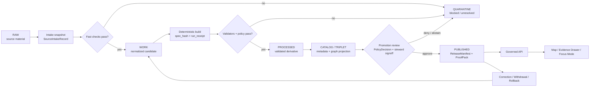
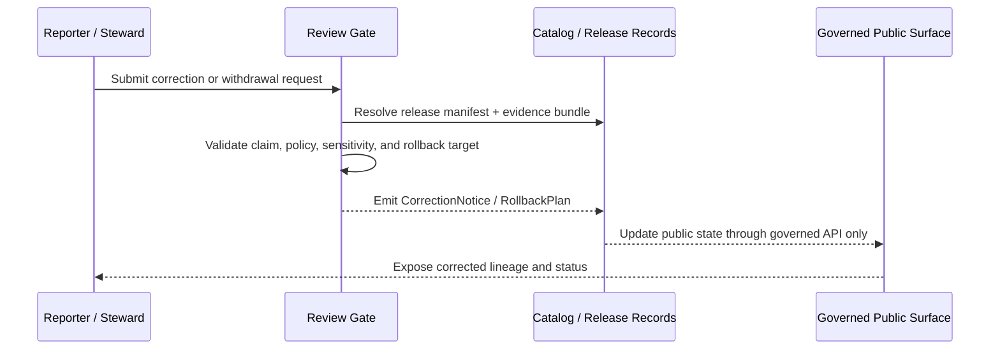

<!-- [KFM_META_BLOCK_V2]
doc_id: TODO: assign stable kfm://doc/governed-ci-cd-patterns
title: Governed CI/CD Patterns (KFM)
type: standard
version: v1
status: draft
owners: TODO: verify owner
created: TODO: verify original creation date
updated: 2026-04-30
policy_label: TODO: verify policy label
related: [TODO: verify docs/architecture/CONTROL_PLANE_INDEX.md, TODO: verify policy/, TODO: verify tools/, TODO: verify .github/workflows/]
tags: [kfm, ci, cd, governance, evidence, promotion, policy, provenance, receipts, rollback]
notes: [Repo paths and workflow names remain NEEDS VERIFICATION until mounted repository evidence confirms them; this revision preserves the uploaded draft and expands it into a GitHub-ready governed standard]
[/KFM_META_BLOCK_V2] -->

# Governed CI/CD Patterns (KFM)

<p align="center">
  <strong>Evidence-first pipelines that validate, attest, gate, and record every artifact before it can become a public claim.</strong>
</p>

<p align="center">
  
  
  
  
  
</p>

<p align="center">
  <a href="#purpose">Purpose</a> ·
  <a href="#operating-law">Operating Law</a> ·
  <a href="#pipeline-flow">Pipeline Flow</a> ·
  <a href="#control-objects">Control Objects</a> ·
  <a href="#policy-gates">Policy Gates</a> ·
  <a href="#promotion-rules">Promotion</a> ·
  <a href="#example-workflows-proposed">Examples</a> ·
  <a href="#definition-of-done">Done</a>
</p>

> [!IMPORTANT]
> This document is a **governed CI/CD standard**, not proof that the target repository already contains these workflows, files, tools, schemas, or enforcement gates. Until a mounted KFM checkout is inspected, implementation paths, workflow names, route names, and commands are `PROPOSED` / `NEEDS VERIFICATION`.

| Field | Value |
|---|---|
| Document posture | `draft standard` |
| Evidence mode | `CORPUS_ONLY / NO_LOCAL_REPO_EVIDENCE` until repo inspection confirms otherwise |
| Current purpose | Define the CI/CD trust pattern KFM should use for source intake, deterministic rebuilds, validation, promotion, release, correction, and rollback |
| Core invariant | `RAW → WORK / QUARANTINE → PROCESSED → CATALOG / TRIPLET → PUBLISHED` |
| Publication posture | `human-gated · policy-checked · evidence-bounded · rollback-capable` |
| AI posture | `interpretive only · never proof · never direct public model path` |

---

## Purpose

KFM CI/CD is not just automation. It is the operational trust membrane between candidate material and public-facing claims.

This standard defines how pipelines should:

- compute deterministic identity where practical;
- validate schemas, source roles, rights, sensitivity, temporal scope, geometry, evidence closure, and release state;
- emit receipts and proof objects without collapsing them into one artifact;
- block unsafe or unsupported publication by default;
- require human stewardship before public release; and
- preserve correction and rollback paths for every consequential release.

This is not generic CI. This is a controlled evidence pipeline for a map-first, time-aware, policy-conscious spatial knowledge system.

---

## What This Is / Is Not

| This document is | This document is not |
|---|---|
| A KFM CI/CD governance pattern | A claim that these workflows already exist in the repository |
| A reusable standard for source intake, validation, promotion, release, and rollback | A generic DevOps tutorial |
| A contract for fail-closed publication behavior | A replacement for source registries, schemas, policy files, validators, tests, or release manifests |
| A guide for creating small, reviewable PRs | Permission to publish from CI without steward approval |
| A place to define negative-path expectations | A place to expose secrets, private endpoints, RAW data, model endpoints, or unpublished stores |

---

## Operating Law

KFM CI/CD must preserve these rules by default:

1. **Promotion is a governed state transition, not a file move.**
2. **Public clients use governed APIs, released artifacts, catalog records, and EvidenceBundle resolution.**
3. **RAW, WORK, QUARANTINE, unpublished candidates, canonical/internal stores, and direct model runtime output are not public surfaces.**
4. **Cite-or-abstain is the default truth posture.**
5. **EvidenceBundle outranks generated language.**
6. **Policy checks belong in backend gates and contracts, not only in UI copy.**
7. **Receipts, proof packs, catalog records, release manifests, review artifacts, correction notices, and rollback references remain distinct object families unless current repo evidence proves a different accepted model.**
8. **Fail closed when source rights, sensitivity, exact-location exposure, living-person exposure, cultural context, critical infrastructure, credentials, or deployment exposure are unclear.**

> [!CAUTION]
> A successful build is not a publication decision. A green CI run can make a candidate *eligible for review*; it must not silently make the candidate public.

---

## Pipeline Flow



### Trust boundary

| Boundary | Allowed | Denied |
|---|---|---|
| Source intake | Snapshot, classify, validate, receipt | Direct publication |
| Work build | Normalize, hash, test, emit run receipts | Treat generated output as truth |
| Catalog | Register evidence-aware metadata and graph projections | Let catalog records substitute for proof |
| Promotion | Human review, policy decision, signed release candidate | Autonomous promotion to `PUBLISHED` |
| Public runtime | Governed API, released artifacts, EvidenceBundle references | Direct RAW/WORK/QUARANTINE/canonical/model access |

---

## Core Patterns

### 1. Scheduled deterministic rebuilds

Periodic recomputation keeps KFM honest about reproducibility.

Required behavior:

- recompute `spec_hash` or equivalent deterministic identity;
- compare against prior run state;
- validate determinism or explain drift;
- regenerate derived artifacts from admissible inputs;
- emit `RunReceipt`, `ValidationReport`, and updated candidate metadata; and
- stage results to `WORK` or `PROCESSED`, not directly to `PUBLISHED`.

**Never publishes automatically.**

### 2. Event-driven intake, quarantine first

Every new source object starts untrusted.

Required behavior:

- snapshot the source object;
- create a `SourceIntakeRecord`;
- classify source role, rights posture, sensitivity posture, temporal scope, and geometry posture;
- run fast schema and policy checks;
- emit a receipt and diff summary; and
- open a steward PR or queue a review action.

Default outcome is `QUARANTINE` when rights, source role, sensitivity, or identity is unclear.

### 3. Contract-first validation

Schemas, contracts, policies, validators, fixtures, and receipts are implementation surfaces, not paperwork.

A CI lane should fail when a release candidate lacks:

- schema version;
- source references;
- deterministic identity or hash explanation;
- temporal basis;
- spatial basis;
- evidence references;
- rights posture;
- sensitivity posture;
- validation result;
- policy decision;
- review state; or
- rollback target.

### 4. Policy-as-code gates

Policy gates should evaluate structured release candidates and receipts. They should not depend on a reviewer noticing unsafe text in a README.

Policy must fail closed for:

- public access to `RAW`, `WORK`, or `QUARANTINE`;
- unknown source role;
- unclear rights;
- unclear sensitivity;
- missing EvidenceBundle closure;
- exact sensitive geometry without transform receipt;
- missing review state;
- missing release state;
- unsupported policy posture;
- direct public model endpoint;
- missing citation validation where generated language is used; and
- publication before promotion.

### 5. LLM-assisted QA, non-authoritative

AI may help CI by proposing patches, flagging anomalies, drafting review notes, or generating structured diffs.

AI must not:

- assert truth;
- publish data;
- override policy;
- bypass citation validation;
- read RAW/WORK/QUARANTINE directly through a public path;
- become the source of canonical evidence; or
- convert vector/search/summary layers into sovereign truth.

### 6. Release, correction, and rollback as first-class workflows

Every release needs a planned escape path.

A release candidate should carry enough information to:

- identify exactly what was released;
- verify why it was eligible;
- inspect who or what approved it;
- reconstruct evidence and policy state;
- withdraw unsafe claims;
- publish a correction notice; and
- roll back to a known prior release target.

---

## Control Objects

> [!NOTE]
> Object homes, schema names, and field names are `PROPOSED` until repository contracts are inspected. Use current repo conventions if they differ, and record the mapping in an ADR.

| Object family | Role in CI/CD | Minimum expectation |
|---|---|---|
| `SourceDescriptor` | Defines source role, authority, rights, cadence, and sensitivity expectations | Must exist before live connector activation |
| `SourceIntakeRecord` | Records a candidate source object entering the pipeline | Must include source ref, retrieval time, hash, and intake disposition |
| `EvidenceRef` | Stable pointer to evidence used by a claim or artifact | Must resolve or the pipeline abstains/blocks |
| `EvidenceBundle` | Reconstructable evidence set for claims and outputs | Must outrank summaries, tiles, graphs, maps, and model output |
| `RunReceipt` | Execution record for a pipeline run | Must include command/tool identity, inputs, outputs, hashes, and outcome |
| `ValidationReport` | Structured validator results | Must include positive and negative checks |
| `PolicyDecision` | Policy evaluation result | Must include allow/deny, reasons, input hash, and policy version |
| `PromotionDecision` | Steward or governance approval/denial | Must include reviewer identity class, timestamp, risk class, and decision |
| `ReleaseManifest` | Published artifact index | Must include artifacts, hashes, evidence refs, policy state, and rollback target |
| `ProofPack` | Integrity and provenance bundle for release candidates | Must include attestations or explicit `NEEDS VERIFICATION` until signing is implemented |
| `AIReceipt` | Trace of model-assisted CI/review action | Must not include private chain-of-thought as proof |
| `CitationValidationReport` | Confirms generated claims resolve to evidence | Required when generated text is released or shown as an answer |
| `RedactionReceipt` | Records geoprivacy or sensitivity transform | Required for public-safe generalized or redacted outputs |
| `CorrectionNotice` | Public or steward-facing correction record | Required when released claims are corrected or withdrawn |
| `RollbackPlan` | Revert path to known prior state | Required for significant releases |

---

## Stage Gates

| Stage | CI action | Required evidence | Allowed outcome |
|---|---|---|---|
| `RAW` | snapshot only | source ref, retrieval time, raw hash | `SourceIntakeRecord` |
| `QUARANTINE` | isolate and diagnose | deny reason, unresolved fields, receipt | blocked candidate or steward review |
| `WORK` | normalize and build | schema version, source role, `spec_hash`, run receipt | candidate artifact |
| `PROCESSED` | validate and transform | validation report, transform receipt, policy precheck | catalog-ready artifact |
| `CATALOG` | register metadata and evidence links | catalog record, EvidenceBundle refs, provenance | promotion candidate |
| `TRIPLET` | generate graph projection | graph provenance, source refs, projection metadata | query/reasoning derivative |
| `PUBLISHED` | release only after approval | `PromotionDecision`, `ReleaseManifest`, `ProofPack`, rollback target | governed public artifact |

> [!WARNING]
> `CATALOG` and `TRIPLET` are not publication by themselves. They are structured discovery and reasoning surfaces that still require release state before public use.

---

## Policy Gates

Policy gates should be small, explicit, testable, and mirrored by negative-path fixtures.

### Gate map

| Gate | Blocks when | Typical output |
|---|---|---|
| Schema gate | required fields, enums, or formats are invalid | `ValidationReport` |
| Source-role gate | source is unknown or used outside allowed authority | `PolicyDecision: DENY` |
| Rights gate | license, terms, redistribution, or attribution is unclear | `PolicyDecision: DENY` or `ABSTAIN` |
| Sensitivity gate | exact sensitive geometry or restricted content would be public | `DENY` plus required redaction path |
| Evidence closure gate | EvidenceRefs do not resolve to EvidenceBundles | `ABSTAIN` / blocked promotion |
| Citation gate | generated claim lacks evidence support | `ABSTAIN` |
| Release gate | review, manifest, proof, or rollback target is missing | `DENY` |
| Public-boundary gate | public path touches RAW/WORK/QUARANTINE/canonical/model runtime | `DENY` |

### Example Rego policy fragment

```rego
package kfm.publish

default allow := false

allow {
  not deny[_]
  input.lifecycle_state == "PUBLISHED"
  input.release_manifest.present == true
  input.promotion_decision.status == "approved"
}

deny[msg] {
  input.lifecycle_state == "RAW"
  msg := "RAW cannot be published"
}

deny[msg] {
  input.lifecycle_state == "WORK"
  input.output_scope == "public"
  msg := "WORK candidates cannot be public"
}

deny[msg] {
  input.lifecycle_state == "QUARANTINE"
  input.output_scope == "public"
  msg := "QUARANTINE candidates cannot be public"
}

deny[msg] {
  input.rights.status == "unknown"
  input.output_scope == "public"
  msg := "Unknown rights block public release"
}

deny[msg] {
  input.sensitivity == "restricted"
  input.output_scope == "public"
  not input.redaction_receipt.present
  msg := "Restricted data requires a redaction receipt before public output"
}

deny[msg] {
  count(input.evidence_refs.unresolved) > 0
  msg := "Unresolved EvidenceRef blocks publication"
}

deny[msg] {
  input.ai.direct_public_model_client == true
  msg := "Direct public model-client path is forbidden"
}
```

---

## Signing & Attestation

> [!NOTE]
> Signing toolchain, key management, and exact attestation format are `NEEDS VERIFICATION` until the mounted repo and operational environment are inspected.

Required release-candidate properties:

- artifact hash;
- content/spec hash or explicit hash rationale;
- source refs;
- schema version;
- build/run identity;
- policy version and decision;
- review/promotion decision;
- timestamp;
- rollback target; and
- attestation or explicit `NEEDS VERIFICATION` marker.

Recommended posture:

| Area | Default |
|---|---|
| Envelope | `PROPOSED`: DSSE or equivalent |
| Signing | `PROPOSED`: Sigstore/Cosign or internal signing toolchain |
| Verification | CI verifies manifest hashes, attestation presence, and policy decision before release |
| Public release | no public publication without human sign-off and release manifest closure |
| Rollback | prior release target must be inspectable before current alias changes |

---

## Promotion Rules

| Stage | Allowed action | Requirement | Public? |
|---|---|---|---|
| `RAW` | ingest/snapshot only | source ref and raw hash | No |
| `QUARANTINE` | isolate, diagnose, steward review | deny or unresolved reason | No |
| `WORK` | normalize/build/test | full CI pass for candidate | No |
| `PROCESSED` | transform/validate | provenance and validation complete | No |
| `CATALOG` | register metadata and EvidenceRefs | catalog closure and evidence resolution | Not by itself |
| `TRIPLET` | generate derived graph projection | projection provenance and policy state | Not by itself |
| `PUBLISHED` | release public-safe artifact | human approval, ReleaseManifest, ProofPack, rollback target | Yes, through governed surfaces |

> [!CAUTION]
> Autonomous promotion to `PUBLISHED` is forbidden. CI may prepare and verify a release candidate, but policy-significant publication requires steward approval appropriate to risk.

---

## Proposed Repo Layout

> [!NOTE]
> This layout is a working target. Adapt it to actual repo conventions after inspection and record deviations in an ADR.

```text
.github/
  workflows/
    TODO: verify governed-ci workflow home
policy/
  TODO: verify policy home
schemas/
  contracts/
    v1/
      TODO: verify schema authority home
tools/
  validators/
    TODO: verify validator home
  evidence/
    TODO: verify evidence tooling home
data/
  raw/
  quarantine/
  work/
  processed/
  catalog/
  published/
  receipts/
  proofs/
release/
  manifests/
  rollback/
docs/
  architecture/
  runbooks/
  adr/
tests/
  fixtures/
    valid/
    invalid/
```

### Layout rules

- Keep generated artifacts out of canonical source paths unless repo convention explicitly allows them.
- Keep fixtures small, synthetic, public-safe, and no-network by default.
- Keep receipts, proofs, catalog records, release manifests, corrections, and rollback plans separate.
- Do not store secrets, credentials, private endpoints, or sensitive source payloads in docs or fixtures.
- Do not create duplicate schema homes without a schema-home ADR.

---

## Example Workflows (`PROPOSED`)

> [!IMPORTANT]
> The examples below are illustrative and must be adapted to actual repository paths, package manager, validator commands, policy tooling, signing toolchain, and branch protection rules.

### Nightly deterministic rebuild

```yaml
name: governed-nightly-rebuild

on:
  schedule:
    - cron: "0 2 * * *"
  workflow_dispatch: {}

jobs:
  rebuild:
    runs-on: ubuntu-latest
    permissions:
      contents: read
      pull-requests: write

    steps:
      - name: Checkout
        uses: actions/checkout@v4

      - name: Compute deterministic identity
        run: |
          # NEEDS VERIFICATION: replace with repo canonical hashing tool.
          ./tools/spec_hash.sh input.json > run/spec_hash.txt

      - name: Validate schemas
        run: |
          # NEEDS VERIFICATION: replace with repo validator command.
          ./tools/validators/validate_schemas.sh

      - name: Run policy gates
        run: |
          # NEEDS VERIFICATION: conftest/OPA path and policy package are not confirmed.
          conftest test --policy policy/ .

      - name: Emit run receipt
        run: |
          # NEEDS VERIFICATION: replace with repo receipt emitter.
          ./tools/evidence/emit_run_receipt.sh

      - name: Prepare steward PR
        run: |
          # CI prepares review material only; it does not publish.
          ./tools/open_steward_pr.sh
```

### Event-driven intake

```yaml
name: governed-intake

on:
  repository_dispatch:
    types: [source_object_new]
  workflow_dispatch: {}

jobs:
  intake:
    runs-on: ubuntu-latest
    permissions:
      contents: read
      pull-requests: write

    steps:
      - name: Checkout
        uses: actions/checkout@v4

      - name: Snapshot source object
        run: |
          # NEEDS VERIFICATION: connector path and source descriptor registry are not confirmed.
          ./connectors/snapshot.sh

      - name: Create SourceIntakeRecord
        run: |
          ./tools/evidence/emit_source_intake_record.sh

      - name: Fast validation
        run: |
          ./tools/validators/fast_intake_checks.sh

      - name: Policy precheck
        run: |
          conftest test --policy policy/intake/ .

      - name: Open steward review PR
        run: |
          ./tools/open_pr.sh
```

### Promotion dry run

```yaml
name: governed-promotion-dry-run

on:
  pull_request:
    paths:
      - "release/**"
      - "data/catalog/**"
      - "data/proofs/**"
      - "policy/**"
      - "schemas/**"
      - "tools/validators/**"

jobs:
  promotion-dry-run:
    runs-on: ubuntu-latest

    steps:
      - name: Checkout
        uses: actions/checkout@v4

      - name: Verify release manifest closure
        run: |
          ./tools/validators/check_release_manifest.sh release/manifests/TODO.json

      - name: Resolve EvidenceRefs
        run: |
          ./tools/validators/check_evidence_closure.sh release/manifests/TODO.json

      - name: Run publish policy
        run: |
          conftest test --policy policy/publish/ release/manifests/TODO.json

      - name: Verify rollback target
        run: |
          ./tools/validators/check_rollback_target.sh release/manifests/TODO.json

      - name: Refuse automatic publication
        run: |
          echo "Promotion dry run complete. Human steward approval required for PUBLISHED."
```

---

## Validation Matrix

| Area | Positive test | Negative-path fixture |
|---|---|---|
| Schema | valid release candidate passes | missing `schema_version` fails |
| Source role | known source role used within allowed purpose | unknown source role fails |
| Rights | public release allowed only with clear rights | `rights.status=unknown` blocks public release |
| Sensitivity | redacted public-safe geometry passes | exact sensitive geometry without receipt fails |
| Evidence closure | all EvidenceRefs resolve | unresolved EvidenceRef causes abstain/block |
| Citation | generated answer cites supported evidence | uncited generated claim fails |
| Policy | allowed candidate reaches review | RAW/WORK/QUARANTINE public path fails |
| AI boundary | model output remains draft/QA | direct public model-client path fails |
| Promotion | approved release has manifest/proof/rollback | missing steward decision fails |
| Rollback | rollback target exists and verifies | rollback/correction mismatch fails |

---

## Rollback and Correction

A governed release must be reversible enough to protect trust.

### Minimum rollback card

```yaml
rollback_card:
  schema_version: TODO: verify
  release_id: TODO
  current_spec_hash: TODO
  prior_spec_hash: TODO
  release_manifest_ref: TODO
  proof_pack_ref: TODO
  rollback_reason: TODO
  policy_decision_ref: TODO
  reviewer: TODO: verify steward identity convention
  created_at: TODO
  status: proposed
```

### Correction flow



---

## Security and Local Exposure Posture

KFM may run locally while being exposed through a firewall, reverse proxy, or VPN for trusted access. CI/CD should assume this is security-relevant.

Required posture:

- deny by default;
- least privilege for CI tokens and deploy keys;
- no secrets in code, prompts, docs, fixtures, screenshots, or example payloads;
- no public admin path by default;
- no public direct model endpoint;
- no public RAW/WORK/QUARANTINE access;
- auditable ingress, release, and rollback boundaries;
- separate public, steward, admin, and maintenance paths; and
- fail closed when authentication, authorization, source rights, or policy state is unclear.

---

## Definition of Done

A governed CI/CD lane is not done until:

- [ ] Evidence mode is stated and repository assumptions are marked.
- [ ] SourceDescriptor requirements are defined for every live connector.
- [ ] SourceIntakeRecord is emitted for candidate intake.
- [ ] Deterministic identity or hash rationale is recorded.
- [ ] Schemas/contracts validate positive fixtures.
- [ ] Negative-path fixtures cover trust failures.
- [ ] Policy gates block RAW/WORK/QUARANTINE public exposure.
- [ ] Policy gates block unknown rights and unknown sensitivity public release.
- [ ] EvidenceRefs resolve to EvidenceBundles before publication.
- [ ] Generated language has citation validation or abstains.
- [ ] AI is prevented from direct public model-client operation.
- [ ] PromotionDecision is required before `PUBLISHED`.
- [ ] ReleaseManifest and ProofPack are emitted or explicitly marked `NEEDS VERIFICATION`.
- [ ] CorrectionNotice and RollbackPlan paths are defined.
- [ ] Documentation updates match behavior changes.
- [ ] No badge, link, workflow, owner, route, schema, or runtime claim implies unverified implementation.

---

## Recommended PR Sequence

| PR | Focus | Why first |
|---|---|---|
| PR-0001 | Documentation control plane, schema-home ADR, source ledger skeleton | Prevents authority drift before machine files expand |
| PR-0002 | Core governance schemas and tiny valid/invalid fixtures | Makes contracts reviewable without live data |
| PR-0003 | Offline validators and policy stubs | Adds fail-closed behavior before connectors |
| PR-0004 | No-network proof slice with `RunReceipt`, `ValidationReport`, `PolicyDecision` | Proves the flow without source-rights risk |
| PR-0005 | Release dry run with `ReleaseManifest`, `ProofPack`, rollback card | Tests promotion without publishing |
| PR-0006 | Governed API envelope and Evidence Drawer payload contract | Keeps public UI downstream of trust |
| PR-0007 | Live connector pilot after source rights and endpoint verification | Activates ingestion only after gates exist |

---

## Open Questions

| Area | Status | Action |
|---|---|---|
| Schema authority location | `NEEDS VERIFICATION` | Inspect repo conventions; add schema-home ADR before adding duplicate homes |
| Policy engine | `NEEDS VERIFICATION` | Confirm OPA/Conftest or repo-native policy tool |
| Signing standard | `NEEDS VERIFICATION` | Decide DSSE/Cosign/internal signing and key posture |
| Workflow paths | `UNKNOWN` | Inspect `.github/workflows/` or equivalent CI system |
| Owner/steward identity convention | `UNKNOWN` | Confirm CODEOWNERS/team convention before assigning owners |
| Release manifest home | `UNKNOWN` | Confirm release/cat/proof directories in mounted repo |
| Branch protection | `UNKNOWN` | Confirm required checks and review rules from platform settings |
| Public exposure model | `NEEDS VERIFICATION` | Confirm firewall/reverse proxy/VPN and auth boundaries |
| AI receipt policy | `PROPOSED` | Confirm what model traces are recorded without storing private chain-of-thought as proof |
| Rollback object name | `PROPOSED` | Align `RollbackPlan`, `RollbackReference`, or repo-native equivalent |

---

## Appendix A — Spec Hash Examples

> [!WARNING]
> These examples are illustrative. Use the repository's canonical hashing implementation once verified. For JSON, prefer a documented canonicalization standard or repo-approved equivalent rather than ad hoc formatting.

```bash
# Simple illustrative hash for stable-key JSON only.
jq --sort-keys -c . input.json | sha256sum
```

```bash
# Example shape for a repo-native canonical hash tool.
# NEEDS VERIFICATION: command and path are placeholders.
python tools/hash/canonical_hash.py \
  --input data/work/example.json \
  --algorithm sha256 \
  --output data/receipts/example.spec_hash
```

---

## Appendix B — Minimal Release Candidate Shape (`PROPOSED`)

```json
{
  "schema_version": "TODO",
  "lifecycle_state": "CATALOG",
  "output_scope": "public_candidate",
  "source_refs": ["TODO"],
  "evidence_refs": ["TODO"],
  "spec_hash": "TODO",
  "rights": {
    "status": "TODO: clear | restricted | unknown"
  },
  "sensitivity": "TODO: public | restricted | sensitive_exact_location",
  "validation_report_ref": "TODO",
  "policy_decision_ref": "TODO",
  "promotion_decision": {
    "status": "pending"
  },
  "release_manifest": {
    "present": false
  },
  "rollback_target": "TODO"
}
```

---

## Appendix C — Copy-Extraction Check

- [ ] Meta block is inside the file content.
- [ ] Badges are static and do not imply verified CI/release status.
- [ ] All unverified paths are marked `TODO` or `NEEDS VERIFICATION`.
- [ ] Code fences are language-tagged.
- [ ] No assistant commentary, citations, or diagnostics are embedded in the repository file content.
- [ ] The document can be copied into the repository as Markdown without needing the chat wrapper.

---

[Back to top](#governed-cicd-patterns-kfm)
