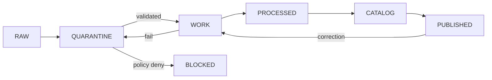

<!-- [KFM_META_BLOCK_V2]
doc_id: kfm://doc/TODO-ci-governed-patterns
title: Governed CI/CD Patterns (KFM)
type: standard
version: v1
status: draft
owners: TODO
created: TODO
updated: TODO
policy_label: TODO
related: [docs/architecture/CONTROL_PLANE_INDEX.md, policy/, tools/, .github/workflows/]
tags: [kfm, ci, governance]
notes: [Placeholders require verification against repo state]
[/KFM_META_BLOCK_V2] -->

# Governed CI/CD Patterns (KFM)

> Evidence-first CI pipelines that **prove, attest, and gate** every artifact before it can become a public claim.

---

## ⬆️ Quick Jump

- [Purpose](#purpose)
- [Core Patterns](#core-patterns)
- [Pipeline Flow](#pipeline-flow)
- [Artifacts & Objects](#artifacts--objects)
- [Policy Gates (OPA)](#policy-gates-opa)
- [Signing & Attestation](#signing--attestation)
- [Promotion Rules](#promotion-rules)
- [Repo Layout](#repo-layout)
- [Example Workflows](#example-workflows)
- [Task Checklist](#task-checklist)
- [Open Questions](#open-questions)

---

## Purpose

This document defines how CI/CD operates under KFM governance:

- **Deterministic outputs**
- **Verifiable provenance**
- **Policy-enforced promotion**
- **Human stewardship before publication**

This is not generic CI.  
This is a **controlled evidence pipeline**.

---

## Core Patterns

### 1) Scheduled Deterministic Rebuilds

Periodic recomputation ensures reproducibility:

- recompute `spec_hash`
- validate determinism
- regenerate derived artifacts
- emit full evidence bundle
- stage to `WORK` only

**Never publishes automatically.**

---

### 2) Event-Driven Intake (Quarantine First)

Every new input is treated as untrusted:

- snapshot → `QUARANTINE`
- run fast validation + policy
- produce diff + receipt
- open steward PR

**Default: fail-closed**

---

### 3) LLM-Assisted QA (Non-Authoritative)

AI may:

- propose patches
- suggest anomalies
- generate structured diffs

AI may NOT:

- assert truth
- publish data
- override policy

---

## Pipeline Flow



---

## Artifacts & Objects

| Object | Role |
|------|------|
| `EvidenceBundle` | Full traceable proof set |
| `run_receipt` | Execution record |
| `spec_hash` | Deterministic identity |
| `ReleaseManifest` | Published artifact index |
| `PromotionDecision` | Governance approval |
| `ai_receipt` | AI interaction trace |
| `redaction_receipt` | Geoprivacy transform proof |

---

## Policy Gates (OPA)

All CI stages must pass policy checks.

### Example Rules

```rego
package kfm.publish

default allow = false

deny[msg] {
  input.state == "RAW"
  msg := "RAW cannot be published"
}

deny[msg] {
  input.sensitivity == "restricted"
  input.output_scope == "public"
  msg := "Restricted data cannot be public"
}
```

---

## Signing & Attestation

All outputs must be cryptographically verifiable.

### Required

- DSSE envelope or equivalent
- artifact hash (includes `spec_hash`)
- signer identity (human or CI identity)
- timestamp

### Tools (PROPOSED)

- Cosign / Sigstore
- internal signing toolchain

---

## Promotion Rules

| Stage | Allowed Action | Requirement |
|------|--------------|------------|
| RAW | ingest only | none |
| QUARANTINE | validate | receipt required |
| WORK | build/test | full CI pass |
| PROCESSED | transform | provenance complete |
| CATALOG | register | schema + closure |
| PUBLISHED | release | **human sign-off required** |

> ⚠️ Autonomous promotion to PUBLISHED is **forbidden**

---

## Repo Layout

```
.github/workflows/
policy/
tools/
data/
  raw/
  quarantine/
  work/
  processed/
  catalog/
  published/
data/receipts/
docs/
```

---

## Example Workflows

### Nightly Rebuild

```yaml
name: Recompute Spec
on:
  schedule:
    - cron: '0 02 * * *'

jobs:
  rebuild:
    runs-on: ubuntu-latest
    steps:
      - uses: actions/checkout@v4

      - name: Compute spec_hash
        run: ./tools/spec_hash.sh input.json

      - name: Run policy
        run: conftest test .

      - name: Emit evidence
        run: ./tools/evidence/emit.sh

      - name: Sign
        run: ./tools/sign.sh
```

---

### Intake Workflow

```yaml
name: Intake
on:
  repository_dispatch:
    types: [source_object_new]

jobs:
  intake:
    runs-on: ubuntu-latest
    steps:
      - run: ./connectors/snapshot.sh
      - run: conftest test .
      - run: ./tools/diff.sh
      - run: ./tools/open_pr.sh
```

---

## Task Checklist

- [ ] spec_hash computation deterministic
- [ ] EvidenceBundle emitted
- [ ] run_receipt stored
- [ ] policy gates enforced
- [ ] signing applied
- [ ] promotion blocked without steward
- [ ] audit log recorded

---

## Open Questions

| Area | Status |
|------|--------|
| Signing standard (DSSE vs alt) | NEEDS VERIFICATION |
| Schema authority location | NEEDS VERIFICATION |
| Policy coverage completeness | UNKNOWN |
| Promotion workflow integration | INFERRED |

---

## Appendix

<details>
<summary>Spec Hash Example</summary>

```bash
jq --sort-keys -c . input.json | sha256sum
```

</details>

---

[Back to top](#governed-cicd-patterns-kfm)
