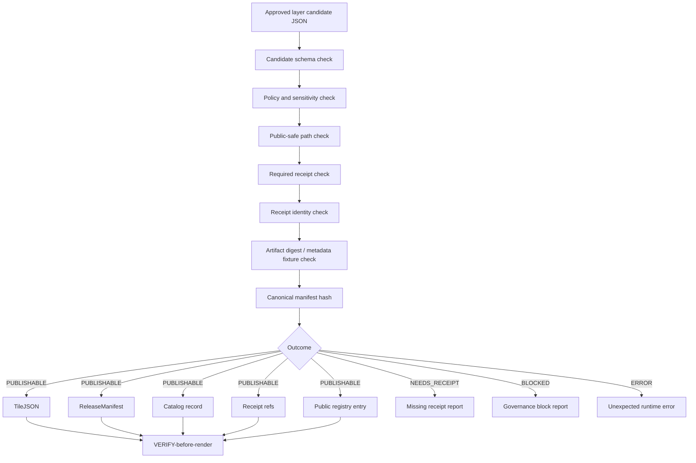

<!-- [KFM_META_BLOCK_V2]
doc_id: kfm://doc/TODO-governed-tile-release-publisher-uuid
title: Governed Tile Release Publisher
type: standard
version: v1
status: draft
owners: TODO-OWNER
created: TODO-YYYY-MM-DD
updated: 2026-05-01
policy_label: public
related: [docs/architecture/NEEDS_VERIFICATION, scripts/publish_kfm_tile_layer.mjs, tests/fixtures/tile_release/valid/veg.layer.json]
tags: [kfm, tiles, release, publication, governance, map, tilejson, pmtiles]
notes: [Repo path, owner, UUID, script path, and fixture path require mounted-repo verification; source draft names scripts/publish_kfm_tile_layer.mjs and tests/fixtures/tile_release/valid/veg.layer.json; generated from supplied draft plus KFM doctrine.]
[/KFM_META_BLOCK_V2] -->

# Governed Tile Release Publisher

> Deterministic, no-network publishing slice for approved map-layer candidates. It emits governed release references without turning TileJSON, MVT, PMTiles, or rendered pixels into truth sources.

<p>
  
  
  
  
</p>

## Quick navigation

- [Purpose](#purpose)
- [Repo fit](#repo-fit)
- [Doctrine lock](#doctrine-lock)
- [Release flow](#release-flow)
- [Accepted inputs](#accepted-inputs)
- [Exclusions](#exclusions)
- [Object separation](#object-separation)
- [Deterministic hashing](#deterministic-hashing)
- [Receipt requirements](#receipt-requirements)
- [Public-safe path policy](#public-safe-path-policy)
- [Outputs](#outputs)
- [Failure outcomes](#failure-outcomes)
- [VERIFY-before-render relationship](#verify-before-render-relationship)
- [Validation checklist](#validation-checklist)
- [Open verification items](#open-verification-items)

---

## Purpose

The **Governed Tile Release Publisher** validates an already approved map-layer candidate and emits the governed references needed for public rendering and later verification:

- `TileJSON`
- `ReleaseManifest`
- catalog record
- receipt references
- proof references where supplied
- public registry entry

The publisher is intentionally narrow. It does **not** ingest raw sources, decide source authority, approve evidence, generate canonical truth, or bypass promotion review. Its job is to turn a policy-safe release candidate into a small set of separately inspectable release objects.

> [!IMPORTANT]
> `spec_hash` remains the deterministic identity anchor. Render artifacts are downstream carriers. They are not evidence, policy, review, catalog, proof, or publication authority.

---

## Repo fit

| Field | Status | Value |
|---|---:|---|
| Likely document path | `PROPOSED` | `docs/architecture/governed-tile-release-publisher.md` |
| Publisher script named by source draft | `NEEDS VERIFICATION` | `scripts/publish_kfm_tile_layer.mjs` |
| Valid fixture named by source draft | `NEEDS VERIFICATION` | `tests/fixtures/tile_release/valid/veg.layer.json` |
| Upstream | `PROPOSED` | promotion decision, source/candidate validation, receipt generation, catalog/proof preparation |
| Downstream | `PROPOSED` | public registry, governed API, MapLibre layer loading, Evidence Drawer, VERIFY-before-render gates |
| Runtime posture | `PROPOSED` | no-network, deterministic, fail-closed |

**Current evidence boundary:** this document is repo-ready, but the target repository was not mounted in the current session. Path names above are retained because they were named in the supplied draft, not because they were verified in a checkout.

---

## Doctrine lock

| Doctrine | Publisher rule |
|---|---|
| `spec_hash_is_deterministic_identity` | The release candidate must declare a `spec_hash`. Manifest hashing uses canonical JSON and excludes non-identity runtime fields such as `published_at`. |
| `render_artifacts_are_not_truth_sources` | PMTiles, MVT, TileJSON, style fragments, screenshots, and map tiles are render artifacts only. They may point to evidence but do not replace it. |
| `receipts_proofs_manifests_catalog_records_remain_separate` | The publisher emits or references each object family separately. A receipt cannot become a proof. A manifest cannot become a catalog record. |
| `public_ui_uses_released_governed_artifacts_only` | Public clients receive governed release references and public registry entries, not RAW, WORK, QUARANTINE, canonical-private, draft, or staging paths. |

---

## Release flow



The publisher is upstream of rendering. Renderers and client VERIFY gates consume release references after this slice finishes.

---

## Accepted inputs

A release candidate belongs here when it is already promotion-ready and public-safe.

| Input | Required posture | Notes |
|---|---|---|
| Layer candidate JSON | `REQUIRED` | Must include `layer_id`, `spec_hash`, public policy/sensitivity, artifact refs, and receipt requirements. |
| Receipt declarations | `REQUIRED` | `receipts.required_types` defines the receipt types that must be present before release. |
| Receipt references | `REQUIRED WHEN DECLARED` | Each required receipt must resolve to the same `layer_id` and `spec_hash` as the candidate. |
| Render artifact metadata | `REQUIRED` | PMTiles/MVT/TileJSON metadata or a fixture byte hash for no-network tests. |
| Catalog/proof references | `RECOMMENDED` | The publisher can reference prepared catalog/proof objects; it should not collapse them into the manifest. |
| Public registry target | `REQUIRED` | The registry entry is public-facing release memory, not canonical truth. |

### Candidate field sketch

The exact schema home is `NEEDS VERIFICATION`. This field sketch documents the expected shape without claiming an implemented schema file.

```json
{
  "schema_version": "v1",
  "object_type": "TileReleaseCandidate",
  "layer_id": "kfm.layer.vegetation.public",
  "spec_hash": "sha256:...",
  "review_state": "approved",
  "policy_label": "public",
  "sensitivity": "public",
  "source_paths": ["data/published/..."],
  "render_artifacts": [
    {
      "artifact_type": "pmtiles",
      "uri": "public://tiles/vegetation.pmtiles",
      "sha256": "sha256:...",
      "media_type": "application/vnd.pmtiles"
    }
  ],
  "tilejson": {
    "scheme": "xyz",
    "minzoom": 6,
    "maxzoom": 12,
    "bounds": [-102.1, 36.9, -94.5, 40.1]
  },
  "receipts": {
    "required_types": ["candidate_validation", "policy_decision", "artifact_digest"],
    "refs": ["kfm://receipt/tile-release/example"]
  },
  "evidence_bundle_ref": "kfm://evidence/...",
  "catalog_record_ref": "kfm://catalog/...",
  "proof_ref": "kfm://proof/..."
}
```

---

## Exclusions

The publisher must reject or ignore anything that tries to make the release slice do upstream trust work.

| Exclusion | Outcome | Where it belongs instead |
|---|---:|---|
| RAW, WORK, QUARANTINE, private, restricted, draft, staging, or unreleased source paths | `BLOCKED` | lifecycle pipeline, quarantine review, or promotion gate |
| Non-public `policy_label` or `sensitivity` | `BLOCKED` | restricted-access lane or steward review |
| Missing required receipt references | `NEEDS_RECEIPT` | receipt generation / validation lane |
| Receipt identity mismatch on `layer_id` or `spec_hash` | `BLOCKED` | correction flow before release |
| Direct canonical/private store references in public registry entries | `BLOCKED` | governed API reference or public release artifact |
| AI-generated claims without EvidenceBundle support | `BLOCKED` | governed AI citation validation and review |
| Treating PMTiles/MVT/TileJSON as evidence truth | `BLOCKED` | EvidenceBundle / catalog / proof surfaces |

---

## Object separation

The object families below stay separate even when one publisher run emits several of them.

| Object family | Role | Not allowed to do |
|---|---|---|
| `TileJSON` | Render descriptor for clients | Prove evidence, rights, review, or release state |
| PMTiles / MVT | Render payloads | Become canonical truth or policy authority |
| `ReleaseManifest` | Declares released artifacts, hashes, refs, and release identity | Replace catalog, proof, receipt, or review records |
| Catalog record | Discovery and metadata closure | Prove that the release process happened |
| Receipts | Process memory for validation, policy, artifact checks, and publish steps | Substitute for proof or EvidenceBundle |
| Proof references | Release-significant evidence and attestations | Become the public UI payload by themselves |
| Public registry entry | Public pointer to governed release refs | Point to raw/private/canonical stores |

---

## Deterministic hashing

The publisher uses deterministic identity rules so the same semantic release input yields the same release identity.

### Canonical JSON rule

- Serialize JSON with lexicographic key ordering.
- Normalize primitive values consistently.
- Exclude runtime-only or event-time fields from deterministic hash inputs.
- Hash canonical bytes with SHA-256.

### Manifest hash material

| Included in deterministic manifest hash | Excluded from deterministic manifest hash |
|---|---|
| `layer_id` | `published_at` |
| `spec_hash` | local temp paths |
| artifact IDs, URIs, media types, and digests | CI job URL unless declared as identity material |
| TileJSON identity fields | runner ID / worker hostname |
| catalog/proof/evidence/receipt refs | human-only summary text |
| policy decision ref | transient log paths |

> [!NOTE]
> PMTiles metadata fixture hashing may use fixture bytes when the no-network test path explicitly declares fixture mode. Fixture hashing is a test support mechanism, not permission to skip artifact integrity checks in release mode.

---

## Receipt requirements

The candidate controls its receipt burden through `receipts.required_types`.

| Case | Outcome | Reason |
|---|---:|---|
| Every required receipt is present and identity-matched | Continue | The candidate has enough process memory to attempt publication. |
| One or more required receipt types are absent | `NEEDS_RECEIPT` | The publisher must not invent receipts. |
| Receipt `layer_id` differs from candidate `layer_id` | `BLOCKED` | The receipt belongs to another layer. |
| Receipt `spec_hash` differs from candidate `spec_hash` | `BLOCKED` | The receipt belongs to another candidate identity. |
| Receipt exists but points to private or unreleased objects | `BLOCKED` | Release memory would leak or normalize unsafe paths. |

Receipts remain process memory. A successful receipt check does not prove source truth; it proves that named required checks were performed for the same candidate identity.

---

## Public-safe path policy

The publisher must fail closed on path markers that indicate unpublished, internal, or restricted lifecycle stages.

### Blocked source-path markers

```text
RAW
WORK
QUARANTINE
canonical-private
private
restricted
draft
staging
unreleased
```

The check should apply case-insensitively to source paths, artifact paths, registry targets, and any URI that will be written into public-facing release objects.

### Required public posture

| Field | Required value |
|---|---|
| `policy_label` | `public` |
| `sensitivity` | `public` |
| `review_state` | `approved` |
| `provisional` | `false` or absent |
| public registry path | released governed artifact refs only |

---

## Outputs

When the outcome is `PUBLISHABLE`, the publisher emits a coherent release set.

| Output | Status | Purpose |
|---|---:|---|
| `release_manifest.json` | `REQUIRED` | Release artifact identity, artifact digests, and governed refs. |
| `tilejson.json` | `REQUIRED` | Public render descriptor derived from the candidate. |
| catalog record | `REQUIRED` | Public discovery/metadata closure where policy allows. |
| receipt reference list | `REQUIRED` | Declares which process-memory objects support this release action. |
| public registry entry | `REQUIRED` | Public pointer that clients and APIs use to discover released governed artifacts. |
| proof refs | `WHEN SUPPLIED` | Keeps release-significant attestations available without merging them into receipts or TileJSON. |

### Output envelope sketch

```json
{
  "schema_version": "v1",
  "object_type": "TileReleasePublisherResult",
  "outcome": "PUBLISHABLE",
  "layer_id": "kfm.layer.vegetation.public",
  "spec_hash": "sha256:...",
  "release_manifest_ref": "kfm://release-manifest/...",
  "tilejson_ref": "kfm://tilejson/...",
  "catalog_record_ref": "kfm://catalog/...",
  "receipt_refs": ["kfm://receipt/..."],
  "public_registry_ref": "kfm://registry/public/layers/..."
}
```

---

## Failure outcomes

| Outcome | Meaning | Public release allowed? |
|---|---|---:|
| `PUBLISHABLE` | All publisher checks passed and output objects were generated. | Yes, through governed release refs only. |
| `NEEDS_RECEIPT` | Required receipt references are missing. | No. |
| `BLOCKED` | Governance policy failed, identity mismatched, path was unsafe, or public posture was invalid. | No. |
| `ERROR` | Unexpected runtime failure. | No. |

> [!WARNING]
> `ERROR` is not a weaker form of approval. Any unexpected runtime failure denies publication until rerun or review resolves it.

---

## VERIFY-before-render relationship

This publisher is **upstream** from client and API VERIFY gates.

The intended relationship is:

1. The publisher emits release references for a public-safe layer.
2. A governed API or registry exposes those references to the UI.
3. VERIFY-before-render checks release state, manifest identity, artifact digest expectations, catalog/evidence availability, and policy posture.
4. Only then may MapLibre or another renderer load the released artifact.

Render clients must not bypass the registry to fetch raw PMTiles, MVT, or TileJSON from ungoverned source paths.

---

## Validation checklist

Use this as the pre-publish gate checklist for the script or test fixture.

| Check | Required result | Failure outcome |
|---|---:|---:|
| Candidate JSON parses | pass | `ERROR` |
| Candidate schema validates | pass | `BLOCKED` |
| `review_state` is approved | pass | `BLOCKED` |
| `policy_label` is public | pass | `BLOCKED` |
| `sensitivity` is public | pass | `BLOCKED` |
| Source and artifact paths are public-safe | pass | `BLOCKED` |
| `spec_hash` is present and well-formed | pass | `BLOCKED` |
| Required receipts are present | pass | `NEEDS_RECEIPT` |
| Receipt `layer_id` matches | pass | `BLOCKED` |
| Receipt `spec_hash` matches | pass | `BLOCKED` |
| Render artifact digest or fixture hash validates | pass | `BLOCKED` |
| Manifest canonical hash excludes `published_at` | pass | `BLOCKED` |
| Output object families remain separate | pass | `BLOCKED` |
| Public registry points only to governed release refs | pass | `BLOCKED` |

---

## Open verification items

| Item | Status | Why it remains open |
|---|---:|---|
| Confirm final repo path for this document | `NEEDS VERIFICATION` | No mounted repository was available in the current session. |
| Confirm script existence and CLI flags | `NEEDS VERIFICATION` | `scripts/publish_kfm_tile_layer.mjs` was named in the supplied draft but not inspected. |
| Confirm fixture existence and exact schema | `NEEDS VERIFICATION` | `tests/fixtures/tile_release/valid/veg.layer.json` was named in the supplied draft but not inspected. |
| Confirm schema home | `NEEDS VERIFICATION` | The broader KFM corpus frequently marks schema-home authority as unresolved without repo evidence. |
| Confirm public registry file/API home | `NEEDS VERIFICATION` | Registry implementation was not available for inspection. |
| Confirm signing/proof policy | `NEEDS VERIFICATION` | This slice preserves proof refs but does not define signing implementation. |

---

## Appendix: supplied source meta snapshot

The following source meta was supplied with the draft and preserved here as source context. The repo-standard meta block at the top of this file remains the active document metadata wrapper.

```yaml
kfm_meta:
  block_version: 2
  artifact_type: architecture_doc
  title: Governed Tile Release Publisher
  doctrine:
    - spec_hash_is_deterministic_identity
    - render_artifacts_are_not_truth_sources
    - receipts_proofs_manifests_catalog_records_remain_separate
    - public_ui_uses_released_governed_artifacts_only
  review_state: draft
  sensitivity: public
```
