<!-- File: docs/architecture/KFM_NEXT_STAGES_BLUEPRINT.md -->


# 🧭 KFM Next Stages Blueprint
**Last updated:** 2026-01-20  
**Applies to:** KFM v13+ (post-redesign direction)  
**This doc is:** an execution-ready blueprint (what we build next, in what order, and the contracts we must lock).

> [!IMPORTANT]
> This blueprint assumes KFM remains **policy-gated, provenance-first, and standards-aligned**. If a feature cannot be governed, audited, and reproduced, it does not ship.

---

## 🧩 Why this exists
KFM is already designed as a modular geospatial + knowledge graph + narrative + AI platform. The “next stages” are about turning that design into a **repeatable factory**:
- ✅ deterministic ingestion → ✅ governed catalogs → ✅ graph sync → ✅ API contracts → ✅ UI experiences → ✅ AI with citations → ✅ simulation & real-time feeds → ✅ federation.

---

## 🎯 North Star Outcomes
1. **Evidence-first publishing** is automatic (metadata + lineage is not optional).
2. **Every visible thing is traceable** (“the map behind the map”).
3. **Focus Mode is safe-by-design** (citations required; refusal is normal).
4. **Performance is baked in** (packaging like GeoParquet/COG/PMTiles, tiling, caching).
5. **Upgrades don’t erase history** (append-only, signed snapshots, rollback).
6. **The platform can federate** into a network of “Frontier Matrices” 🌎.

---

## 🧠 Non‑Negotiables
### ✅ Evidence Triplet (hard gate)
A dataset is “real” in KFM only when all of these exist and cross-link:
- **STAC** (spatiotemporal + assets)
- **DCAT** (catalog metadata / discovery)
- **PROV** (lineage: Entity → Activity → Agent)

### ✅ Policy gates “fail closed”
If a gate fails (missing license, missing provenance, invalid geometry, sovereignty label mismatch, missing citations), the artifact **does not publish**.

### ✅ API-only access
UI does **not** bypass the API layer to touch PostGIS/Neo4j directly.

### ✅ Deterministic by default
- Stable IDs where possible
- Canonical JSON (sorted keys) to keep diffs stable
- Seeds recorded for runs
- Containers pinned (repeatability + supply chain integrity)

---

## 🏗️ Baseline Architecture Snapshot
KFM is a **hybrid platform**:
- 🗺️ **Spatial store**: PostGIS for spatial indexing/queries & serving subsets/tiles  
- 🕸️ **Knowledge graph**: Neo4j for semantic linking across domains (places, events, datasets, docs)  
- 🔌 **API layer**: FastAPI + GraphQL (governed data access + AI access)  
- 🖥️ **UI layer**: React + MapLibre (2D) + Cesium (3D), Story Nodes, Timeline  
- 🤖 **AI**: Focus Mode (evidence-backed, explainable, refusal-first when needed)

---

## 🗺️ The Canonical Flow (the system’s “spine”)

```mermaid
flowchart LR
  A[📥 Raw Inputs] --> B[🧪 Deterministic ETL]
  B --> C[🧾 Evidence Triplet<br/>STAC + DCAT + PROV]
  C --> D[🕸️ Graph Ingest<br/>Neo4j Nodes/Edges]
  D --> E[🔌 API Layer<br/>FastAPI + GraphQL]
  E --> F[🗺️ UI Layer<br/>Map + Timeline + Stories]
  E --> G[🤖 Focus Mode<br/>RAG + Citations]
  C --> H[📦 Signed Snapshots<br/>Rollback-safe]
```


---

## 🧭 Roadmap Overview
> [!NOTE]
> Stages are ordered by **dependency**, not by “coolness.” We build the control plane and contracts first so everything else can ship safely.

| Stage | Theme 🧱 | What “done” means ✅ |
|------:|----------|----------------------|
| 0 | Foundations & Contracts | Schemas + policies + artifact signing + repo scaffolding are locked |
| 1 | Evidence Factory | Any new dataset can be onboarded via repeatable pipeline templates |
| 2 | Graph + Search | Catalog ↔ graph sync + query contracts work end-to-end |
| 3 | UI Experiences | Timeline + Story Nodes + provenance drawers feel cohesive |
| 4 | Focus Mode v1 | Evidence-backed Q&A with strict citations + audit panel |
| 5 | Real-time Watchers | GTFS-RT + sensor feeds become STAC/DCAT/PROV first-class citizens |
| 6 | Modeling & Simulation | Deterministic sim runs produce PR-ready evidence artifacts |
| 7 | 3D/AR + Field Mode | 2D→3D story transitions + offline packs + AR groundwork |
| 8 | Federation + Community | Multi-region interoperability + governance maturity |

---

# 0) 🧱 Foundations & Contracts
## Goals
- Establish the **minimum viable governance kernel** that everything else plugs into.
- Prevent schema drift, “mystery nodes,” silent rewrites, and uncitable AI output.

## Deliverables
- 📄 **Contracts repo layout** (schemas, policies, templates)
- ✅ **CI gates** running on every PR:
  - JSON Schema validation for contracts (views, stories, run manifests)
  - STAC/DCAT/PROV validation
  - Graph import integrity checks (node/edge constraints)
  - Security: secret scan + dependency scan + container pin checks
- 🔐 **Artifact signing & attestations** for promoted snapshots (keyless is fine, but verify)

## “Hardening” checklist
- [ ] Define **canonical dataset_id** and naming rules
- [ ] Define **run_id** and run manifest schema
- [ ] Define **policy bundle** structure (OPA/Rego + tests)
- [ ] Define **View Registry** schema + CI validator (AJV)
- [ ] Define **Story Node** schema + CI validator
- [ ] Define “promote” workflow (PR-first publishing)

---

# 1) 🏭 Evidence Factory
## Goals
Turn ingestion into a **repeatable factory**: every pipeline emits the same kinds of artifacts.

## Deliverables
- 🧰 **Pipeline templates** (cookiecutter-style) for:
  - Static datasets (vector/raster/tabular)
  - Streaming datasets (real-time polls)
  - Document ingestion (OCR + NLP + graph linking)
- 📦 **Data packaging patterns**:
  - Analytics format: **GeoParquet / Parquet**
  - Raster format: **COG**
  - UI performance format: **PMTiles** (vector tiles)
- 🧾 Automatic “evidence triplet” generation:
  - STAC Collection + Items
  - DCAT Dataset record
  - PROV JSON-LD for lineage

## Definition of Done (Stage 1)
A brand-new dataset can be added with:
1) deterministic run output  
2) policy-validated STAC/DCAT/PROV  
3) signed snapshot artifact  
4) PR opened automatically with provenance summary  
5) merge triggers publish step

---

# 2) 🕸️ Graph + Search
## Goals
Make the graph the **semantic router** for discovery, linking, and AI retrieval.

## Deliverables
- 🕸️ Catalog → Graph ingest that is:
  - deterministic
  - replayable
  - idempotent
- 🔎 Search endpoints:
  - keyword search (DCAT + docs)
  - spatial/temporal search (STAC)
  - semantic expansion (graph neighbors)
- 🧭 A governed ontology strategy:
  - GeoSPARQL / CIDOC-CRM style patterns where relevant
  - KFM-specific extensions in a controlled namespace

## “No mystery nodes” rule ✅
Every node/edge in Neo4j must have:
- a reference to catalog IDs (STAC/DCAT)
- provenance reference (PROV activity/entity)
- classification/sensitivity labels where required

---

# 3) 🗺️ UI Experiences
## Goals
Ship a cohesive “KFM feel”:
- map + timeline + stories + provenance always visible (when needed)
- performance is good even with heavy layers

## Deliverables
- 🗺️ **2D Map MVP** (MapLibre) + layer toggles + legend + popups
- 🌍 **3D mode** (Cesium) with a clean 2D→3D transition path
- 🕰️ **Timeline slider** that:
  - controls map layer time filters
  - drives Story Node step playback
- 📖 **Story Nodes** (Markdown narrative + JSON config) with:
  - transitions (camera, layer sets, time window)
  - citations in narrative content
  - preview tooling for maintainers

### UI “evidence drawer” (must exist)
Every layer/story step should be able to reveal:
- STAC/DCAT/PROV links
- source attribution
- snapshot hash / version
- last validated policy set

---

# 4) 🤖 Focus Mode v1 (Evidence‑Backed AI)
## Goals
Make Focus Mode reliable, governed, and useful in the map context.

## Deliverables
- 🔎 Hybrid retrieval:
  - unstructured docs + structured graph + catalog metadata
- 🧾 Citations required:
  - If the model cannot cite → it must refuse or ask for more scope
- 🧪 Audit panel:
  - “why this answer” explanation: retrieved artifacts, graph paths, policies checked
- 🧠 Context awareness:
  - map viewport + active layers + selected features become part of query context

## Policy “hard gates” for AI
- [ ] No answer without citations
- [ ] No sensitive data leakage (classification-aware retrieval)
- [ ] Response metadata includes evidence coverage score (how much was grounded)

---

# 5) 📡 Real-Time Watchers (Transit + Sensors)
## Goals
Make streaming feeds first-class citizens in KFM without breaking provenance guarantees.

## Deliverables
- 🚌 **GTFS-RT Watcher** (prototype):
  - polls with ETag/Last-Modified
  - emits STAC Item per observation
  - produces DCAT Dataset for the feed
  - records PROV for retrieval + transform
- 📈 Live layers in UI:
  - real-time points with refresh cycle
  - provenance panel shows “retrieved at / source at / watcher run_id”
- 🧰 Watcher–Planner–Executor (W‑P‑E) pattern:
  - Watcher records immutable event
  - Planner proposes PR patch
  - Executor applies only after policy + human review (unless explicitly allowed)

---

# 6) 🧪 Modeling & Deterministic Simulation
## Goals
Turn “what-if” and analytics into **PR-ready evidence artifacts**.

## Deliverables
- 🧪 `kfm-sim-run` style runner:
  - takes a structured change request
  - runs in a sandbox with a fixed seed + virtual clock
  - emits diff patches + updated STAC/DCAT/PROV
  - opens a draft PR automatically
- 🌫️ Example domain pipeline:
  - air-quality correction / nowcasting module pattern
  - quality flags as governed outputs
- 📊 UI scenario viewer:
  - compare “baseline vs scenario”
  - show provenance for both runs

---

# 7) 🌍 3D / AR + Field Mode
## Goals
Move from “maps” to “immersive context” without sacrificing trust.

## Deliverables
- 🛰️ “Kansas From Above” demo story:
  - Story Nodes that transition 2D historic maps → 3D terrain views
- 🧱 3D Tiles pipeline pattern:
  - 3D assets cataloged via STAC/DCAT and governed like everything else
- 📦 Offline packs:
  - region-based download bundles for field use
  - capture field notes/photos as contributions (sync later)
- 📱 AR groundwork:
  - AR overlays treated as a visualization mode, not a new data plane
  - same governed APIs and provenance requirements

---

# 8) 🌐 Federation + Community Maturity
## Goals
Make KFM a reusable blueprint for other regions and a durable community project.

## Deliverables
- 🔁 Export/import tooling:
  - datasets + catalogs + graph slices (where allowed)
- 🧭 Federation contracts:
  - standardized API endpoints
  - shared ontology mapping guidelines
  - cross-region query routing design
- 🧑‍🤝‍🧑 Governance maturity:
  - SOPs, glossary, issue templates
  - moderation workflows (content + data)
  - advisory board / steering structure (optional)

---

## 🧬 Contracts to Lock Early
> [!TIP]
> Locking contracts early makes everything else faster. Contract drift is the silent killer.

### 1) Dataset Identity
- `dataset_id`: stable human-meaningful identifier  
- `dataset_version`: semantic or digest-based  
- `artifact_digest`: sha256 for packaged outputs

### 2) Run Manifest
A run must emit a manifest with:
- inputs (URIs + digests)
- outputs (paths + digests + media types)
- environment (container digest, deps)
- policy results summary
- timestamps + seed

### 3) Story Node Contract
Stories are **machine-ingestible storytelling**:
- Markdown narrative (human readable)
- JSON config (map/time/story steps)

### 4) View Registry Contract
A registry describing allowed UI views/screens:
- view id
- route
- required permissions/policies
- feature flags
- dependencies (APIs, layers)

### 5) Policy Bundle Contract
- small, fast Rego rules
- unit tests for each rule
- policies apply consistently to:
  - ingestion outputs
  - AI outputs
  - publishing actions

---

## 📦 Proposed Repo Scaffolding
```text
📦 Kansas-Frontier-Matrix/
├─ 🗂️ docs/
│  ├─ 🧱 architecture/
│  │  ├─ ✅ KFM_NEXT_STAGES_BLUEPRINT.md
│  │  ├─ 📘 KFM_REDESIGN_BLUEPRINT_v13.md
│  │  └─ 🗺️ KFM_VISION_FULL_ARCHITECTURE.md
│  ├─ 🧪 templates/
│  │  ├─ TEMPLATE__KFM_UNIVERSAL_DOC.md
│  │  ├─ TEMPLATE__STORY_NODE_V3.md
│  │  └─ TEMPLATE__API_CONTRACT_EXTENSION.md
│  └─ ⚖️ governance/
│     ├─ ROOT_GOVERNANCE.md
│     ├─ ETHICS.md
│     └─ SOVEREIGNTY.md
├─ 🗃️ data/
│  ├─ 📥 raw/
│  ├─ 🧪 processed/
│  ├─ 🧾 stac/
│  ├─ 🧾 catalogs/        # DCAT
│  ├─ 🧾 prov/
│  └─ 🕸️ graph/
│     └─ csv/
├─ 🔌 api/
│  ├─ src/
│  └─ scripts/
│     └─ policy/
├─ 🖥️ web/
│  ├─ components/
│  ├─ views/
│  ├─ viewers/
│  └─ story_nodes/
└─ 🔐 policy/
   └─ rego/
```

---

## 📚 “Use all project files” mapping (what each source feeds)
| Project file 📄 | How it informs this blueprint 🧭 |
|---|---|
| **KFM – Comprehensive Technical Documentation (PDF)** | Baseline architecture, repo structure, security/perf patterns, standards posture |
| **KFM – Comprehensive Architecture, Features, and Design (PDF)** | Policy gates, W‑P‑E automation concept, roadmap themes, mobile/offline priorities |
| **KFM – AI System Overview (PDF)** | Focus Mode principles (transparency, reproducibility, federation) |
| **KFM – Comprehensive UI System Overview (PDF)** | UI modules: 2D/3D, timeline, story nodes, collaboration, offline, AR direction |
| **KFM Data Intake – Technical & Design Guide (PDF)** | Evidence triplet mechanics, graph ingest staging, append-only publishing philosophy |
| **Latest Ideas & Future Proposals (PDF)** | GTFS‑RT watcher, Kansas From Above story, GeoParquet+PMTiles packaging pattern, deterministic sim-run, domain pipeline ideas |
| **Pulse Ideas (PDF)** | Concrete policy-gated watcher workflow + snapshot signing + CI/CD skeleton ideas |
| **Innovative Concepts to Evolve KFM (PDF)** | Future-forward: community verification, expanded domains, ethical governance, federation mindset |
| **Maps / WebGL / Geospatial portfolio (PDF)** | Technical depth for projections, map design, WebGL performance, GIS basics, GEE |
| **AI Concepts portfolio (PDF)** | ML theory + neural nets + symbolic computation references for AI roadmap |
| **Data Mgmt + Bayesian portfolio (PDF)** | Data architecture, lakehouse thinking, CI/CD for data, statistical modeling references |
| **Programming languages & resources portfolio (PDF)** | Practical engineering references: Docker, Spark, security, React/TS, SQL/Postgres |

---

## ✅ Operational “Definition of Done” (for any stage)
A stage is complete when:
- [ ] its **contracts** are written + validated in CI
- [ ] its **policies** exist + have unit tests
- [ ] its **artifacts** are reproducible (seed + container digest)
- [ ] its **UI surfaces provenance** when a user asks “where did this come from?”
- [ ] its **rollback** story is documented and tested (at least one drill)

---

## 🧾 Glossary (starter)
- **Evidence Triplet:** STAC + DCAT + PROV required for publishing
- **Story Node:** narrative Markdown + map/timeline JSON config
- **Watcher:** automated monitor that records events and proposes PRs
- **Policy Gate:** automated rule enforcement (schema, license, provenance, sovereignty, citations)
- **Snapshot:** a packaged, hashed, signed bundle of outputs for promotion/rollback
- **Federation:** interoperable network of regional “Frontier Matrices”

---

## 🛠️ Next actions (practical)
1) 🔒 Lock contracts (run manifest, story schema, view registry, dataset_id rules)  
2) 🧪 Wire CI gates + policy bundle tests  
3) 🏭 Ship one “golden pipeline” end-to-end as reference (packaging + evidence triplet + graph ingest + UI layer + Focus Mode citations)  
4) 🚌 Implement the GTFS‑RT watcher as the first real-time “proof” 
5) 🧪 Implement deterministic sim-run skeleton and prove PR-first scenario promotion

