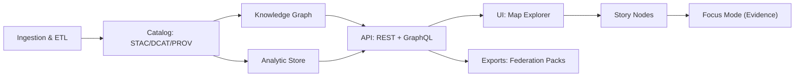

<a id="top"></a>

# 🏗️ KFM Redesign Blueprint v13 🧭🌾


> [!IMPORTANT]
> **v13 is not a rewrite.** It is a **re-architecture by invariants**: keep what is already structurally correct (clean layers, standards, evidence-first), and harden what is missing (runtime orchestration, UI maturity, contracts, governance automation).  [oai_citation:0‡Kansas Frontier Matrix (KFM) – Comprehensive Technical Documentation.docx](file-service://file-PaBDqECcJe7NbC8hvXNGDS)  [oai_citation:1‡Audit of the Kansas Frontier Matrix (KFM) Repository.pdf](file-service://file-1RwSrWXaDb5fnJ5gZX5kS3)

---

## 🧾 Quick Links

- 📘 Master Guide (v13): `docs/MASTER_GUIDE_v13.md`  [oai_citation:2‡MARKDOWN_GUIDE_v13.md.gdoc](file-service://file-UYVruFXfueR8veHMUKeugU)  
- 🧭 Next Stages Blueprint: `docs/architecture/KFM_NEXT_STAGES_BLUEPRINT.md`  [oai_citation:3‡MARKDOWN_GUIDE_v13.md.gdoc](file-service://file-UYVruFXfueR8veHMUKeugU)  
- 🧱 Full Architecture & Vision: `docs/architecture/KFM_VISION_FULL_ARCHITECTURE.md`  [oai_citation:4‡MARKDOWN_GUIDE_v13.md.gdoc](file-service://file-UYVruFXfueR8veHMUKeugU)  
- 🌟 Future Proposals: `docs/ideas/` (source doc: “Latest Ideas & Future Proposals”)  [oai_citation:5‡🌟 Kansas Frontier Matrix – Latest Ideas & Future Proposals.docx](file-service://file-QrXwct2pX9kFpqgjtBiijR)  

---

## 📌 Purpose

This blueprint defines the **v13 target architecture** (systems + contracts + governance), plus a **phased migration** from today’s repo state into a v13-ready platform—without breaking public API expectations or evidence integrity.

It is designed to be:
- ✅ **Commit-ready** (clear milestones & “definition of done”)
- ✅ **Contract-first** (schemas & API contracts define interfaces)
- ✅ **Provenance-first** (STAC/DCAT/PROV are non-negotiable outputs)
- ✅ **Governance-enforced** (policy gates + reproducibility + traceability)

---

## 🎯 Scope

**In scope**
- Architecture decisions & target subsystem boundaries
- Contracts: STAC/DCAT/PROV + API/GraphQL + schema “shape”
- Orchestration model for pipelines (batch + event-ish)
- UI hardening plan (Timeline + Story editor + Focus Mode)
- Migration strategy & milestones (v12→v13)
- Observability/telemetry baseline and governance automation

**Out of scope**
- Domain dataset specifics (they get their own domain READMEs)
- Final infrastructure vendor picks (we define interfaces + profiles)
- Full UI design system spec (lives in web/ docs)

---

## ✅ Definition of Done (for *this document*)

This blueprint is “done” when:
- Architecture invariants are explicit and testable
- v13 milestone list maps directly to repo paths
- Contracts are enumerated (even if still “draft schemas”)
- Migration steps are safe, incremental, and reversible
- CI gates for v13 are listed (minimum baseline)

---

## 🧠 Inputs (Evidence & Project Truth)

Primary project architecture + roadmap:
- Kansas Frontier Matrix (KFM) — Comprehensive Technical Documentation  [oai_citation:6‡Kansas Frontier Matrix (KFM) – Comprehensive Technical Documentation.docx](file-service://file-PaBDqECcJe7NbC8hvXNGDS)  
- Audit of the Kansas Frontier Matrix (KFM) Repository (gaps + recommendations)  [oai_citation:7‡Audit of the Kansas Frontier Matrix (KFM) Repository.pdf](file-service://file-1RwSrWXaDb5fnJ5gZX5kS3)  
- 🌟 Kansas Frontier Matrix — Latest Ideas & Future Proposals (roadmap expansion)  [oai_citation:8‡🌟 Kansas Frontier Matrix – Latest Ideas & Future Proposals.docx](file-service://file-QrXwct2pX9kFpqgjtBiijR)  
- Master Guide v13 scaffold (references v13 blueprint as canonical artifact)  [oai_citation:9‡MARKDOWN_GUIDE_v13.md.gdoc](file-service://file-UYVruFXfueR8veHMUKeugU)  

Supporting conceptual references used for principles (not implementation claims):
- NASA-grade modeling & simulation credibility framing (V&V mindset)  [oai_citation:10‡Scientific Modeling and Simulation_ A Comprehensive NASA-Grade Guide.pdf](file-service://file-LuWF23hffNAZJaZm2Gzvcd)  
- Digital Humanism (human agency, accountability framing)  [oai_citation:11‡Introduction to Digital Humanism.pdf](file-service://file-HC311tLjkcn1yRbyTBLJQQ)  
- Data Spaces (federation + governance patterns)  [oai_citation:12‡Data Spaces.pdf](file-service://file-7UnZyJ7eCK1egnsyuYJaFq)  

---

# 🧭 The Non-Negotiable Invariants

These **must not regress** under v13.

## 1) 🧾 The Canonical Pipeline Ordering (Hard Rule)

```text
Ingest → Normalize/QA → Package → Catalog (STAC/DCAT/PROV) → Graph → API → UI → Story Nodes → Focus Mode
```

> [!NOTE]
> The audit confirms the architecture is already **clean-layered & modular** (Domain/Service/Integration/Infrastructure) and should be preserved—not replaced.  [oai_citation:13‡Audit of the Kansas Frontier Matrix (KFM) Repository.pdf](file-service://file-1RwSrWXaDb5fnJ5gZX5kS3)  [oai_citation:14‡Kansas Frontier Matrix (KFM) – Comprehensive Technical Documentation.docx](file-service://file-PaBDqECcJe7NbC8hvXNGDS)

## 2) 🛰️ Evidence Artifacts Are First-Class Outputs

Every publishable unit produces:
- 🛰️ **STAC** Item/Collection (assets + spatiotemporal metadata)
- 🗂️ **DCAT** Dataset (discovery + licensing + distribution)
- 🧬 **PROV** (lineage: inputs → transforms → outputs)

## 3) ⚖ Governance Is a Gate, Not a “Nice-to-Have”

- FAIR+CARE + Sovereignty review triggers are enforced via CI gates where possible.
- Sensitive data and ethics must be documented as policy, not folklore.  [oai_citation:15‡Audit of the Kansas Frontier Matrix (KFM) Repository.pdf](file-service://file-1RwSrWXaDb5fnJ5gZX5kS3)

## 4) 🧠 AI Is Advisory-Only + Citation-Required

Focus Mode:
- must be evidence-backed (citations)
- must be non-autonomous (no “silent” actions)
- must emit traceable references into provenance where outputs become artifacts  [oai_citation:16‡Kansas Frontier Matrix (KFM) – Comprehensive Technical Documentation.docx](file-service://file-PaBDqECcJe7NbC8hvXNGDS)

---

# 🧩 What v13 Changes (High-Level)

v13 is a **hardening + enabling** release focused on these gaps and opportunities:

## 🧱 A) “Architecture Exists” → “Architecture Runs”
The audit notes architecture is strong in design, but **implementation maturity varies** (orchestration details, UI features, process docs). v13 makes these operational.  [oai_citation:17‡Audit of the Kansas Frontier Matrix (KFM) Repository.pdf](file-service://file-1RwSrWXaDb5fnJ5gZX5kS3)

## 🚌 B) Add Orchestration + Optional Event Backbone
The audit highlights a missing/unspecified **message broker/task queue** as a growth need. v13 defines a standard interface so pipelines can be scheduled and/or evented safely.  [oai_citation:18‡Audit of the Kansas Frontier Matrix (KFM) Repository.pdf](file-service://file-1RwSrWXaDb5fnJ5gZX5kS3)

## 🗺️ C) Make “Time” First-Class in UI + API
Timeline slider is critical for 4D exploration and is noted as underdeveloped. v13 treats temporal filtering as a core product capability.  [oai_citation:19‡Audit of the Kansas Frontier Matrix (KFM) Repository.pdf](file-service://file-1RwSrWXaDb5fnJ5gZX5kS3)

## 🧵 D) Story Node Authoring Becomes a Product Feature
Story Nodes exist as a framework but need tooling for non-dev authors. v13 defines story authoring contract + editor plan.  [oai_citation:20‡Audit of the Kansas Frontier Matrix (KFM) Repository.pdf](file-service://file-1RwSrWXaDb5fnJ5gZX5kS3)

## 🌐 E) Federation & Data-Space Readiness
Future proposals include federation with neighboring “Frontier Matrix” instances. v13 adds federation-ready contracts and export/import boundaries.  [oai_citation:21‡🌟 Kansas Frontier Matrix – Latest Ideas & Future Proposals.docx](file-service://file-QrXwct2pX9kFpqgjtBiijR)  [oai_citation:22‡Data Spaces.pdf](file-service://file-7UnZyJ7eCK1egnsyuYJaFq)

---

# 🏛️ Target Architecture (v13)

## 🗺️ System Map (Conceptual)



> [!TIP]
> This keeps the documented subsystems intact (API + UI + pipelines + graph) while adding explicit federation and the “analytic store” boundary for performance and reproducibility.  [oai_citation:23‡Audit of the Kansas Frontier Matrix (KFM) Repository.pdf](file-service://file-1RwSrWXaDb5fnJ5gZX5kS3)  [oai_citation:24‡Kansas Frontier Matrix (KFM) – Comprehensive Technical Documentation.docx](file-service://file-PaBDqECcJe7NbC8hvXNGDS)

---

## 🧱 Clean Architecture Layers (v13 Guardrails)

KFM’s existing layering is the backbone:

- **Domain**: core entities (places, events, datasets, sensors, maps)
- **Service**: use-cases (ingest, validate, package, publish, query, story)
- **Integration**: ports/interfaces (repositories, graph, earth engine, storage)
- **Infrastructure**: implementations (PostGIS, Neo4j, object store, FastAPI, etc.)  [oai_citation:25‡Kansas Frontier Matrix (KFM) – Comprehensive Technical Documentation.docx](file-service://file-PaBDqECcJe7NbC8hvXNGDS)  [oai_citation:26‡Audit of the Kansas Frontier Matrix (KFM) Repository.pdf](file-service://file-1RwSrWXaDb5fnJ5gZX5kS3)

### 🔒 v13 rule
**No direct infrastructure dependencies** are allowed to leak inward (domain/service).

---

# 📦 v13 Data Product Model (The “Unit of Value”)

A **Data Product** is a versioned, governed bundle with:
- data assets
- contracts/schemas
- provenance
- validation results
- publication metadata

## ✅ Required Files (Data Product Skeleton)

```text
data/products/<domain>/<product_slug>/<version>/
├─ README.md                         🧾 product overview
├─ manifest.yaml                      📦 files + hashes
├─ license.txt                        ⚖ license
├─ stac/                              🛰️ STAC artifacts
│  ├─ collection.json
│  └─ items/
│     └─ <item_id>.json
├─ dcat/                              🗂️ DCAT artifacts
│  └─ dataset.json
├─ prov/                              🧬 provenance artifacts
│  ├─ prov.jsonld
│  └─ lineage.md
├─ schemas/                           🧾 contract-shaped schemas
│  └─ *.schema.json
├─ qa/                                ✅ validation outputs
│  ├─ checks.json
│  └─ report.md
└─ assets/                            🧱 data
   ├─ *.parquet / *.geojson / *.tif
   └─ tiles/ (optional)
```

> [!IMPORTANT]
> This structure ensures “evidence-first” packaging and aligns with KFM’s standards-based catalog design (STAC/DCAT/PROV).  [oai_citation:27‡Audit of the Kansas Frontier Matrix (KFM) Repository.pdf](file-service://file-1RwSrWXaDb5fnJ5gZX5kS3)

---

# 🧵 Orchestration Model (Batch + Event-Ready)

## 🎛️ The Minimal Orchestrator Contract (v13)

v13 standardizes an orchestration interface without forcing a specific tool:

### Required behaviors
- idempotent runs (safe replays)
- deterministic config snapshots
- structured logs + trace IDs
- artifact directory output
- policy gates before publish

### Optional behaviors
- event triggers (webhooks, queue topics)
- incremental refresh (ETag/Last-Modified patterns)

> [!NOTE]
> The roadmap includes real-time feeds (e.g., GTFS-RT watcher). v13 treats “pollers” as first-class pipeline nodes that produce STAC Items per observation.  [oai_citation:28‡🌟 Kansas Frontier Matrix – Latest Ideas & Future Proposals.docx](file-service://file-QrXwct2pX9kFpqgjtBiijR)

## 🚌 Message Bus / Task Queue (Pluggable)

The audit explicitly calls out that queueing/messaging isn’t deeply specified yet. v13 defines a **port**:

- `TaskQueue.enqueue(job_spec)`
- `TaskQueue.get_status(job_id)`
- `EventBus.publish(topic, envelope)`
- `EventBus.subscribe(topic, handler)`

Implementation options (examples, not commitments):
- Redis/Sidekiq/Celery-style queue
- NATS/Kafka-style event bus

 [oai_citation:29‡Audit of the Kansas Frontier Matrix (KFM) Repository.pdf](file-service://file-1RwSrWXaDb5fnJ5gZX5kS3)

---

# 🧠 Knowledge Plane (Graph + Semantics + Search)

## 🕸️ Graph as Context, Not Storage Replacement

Graph connects: people ↔ places ↔ events ↔ datasets ↔ citations.

- Ontology alignment is planned/used (CIDOC-CRM / GeoSPARQL / OWL-Time)  [oai_citation:30‡Audit of the Kansas Frontier Matrix (KFM) Repository.pdf](file-service://file-1RwSrWXaDb5fnJ5gZX5kS3)
- v13 adds **graph ingest contracts**: what an ETL run must emit to populate nodes/edges.

## 🔎 Search/Index Boundary (v13)
For “document & narrative discovery,” v13 establishes a boundary that can be backed by:
- a full-text index
- vector embeddings index
- hybrid search

> [!IMPORTANT]
> v13 must preserve **citation-first** behavior: search results must resolve back to citable sources and be traceable via PROV.  [oai_citation:31‡Kansas Frontier Matrix (KFM) – Comprehensive Technical Documentation.docx](file-service://file-PaBDqECcJe7NbC8hvXNGDS)

---

# 🌐 API Plane (Contract-First)

## 🧾 API Contracts are the Source of Truth

- REST: OpenAPI
- GraphQL: SDL schema
- Schema “shapes” used in payloads must be versioned & changelogged

> [!NOTE]
> The audit notes existing REST + OpenAPI and GraphQL plans and emphasizes interoperability via standard formats (GeoJSON/COG/etc.).  [oai_citation:32‡Audit of the Kansas Frontier Matrix (KFM) Repository.pdf](file-service://file-1RwSrWXaDb5fnJ5gZX5kS3)

## 🔁 Backwards Compatibility Strategy (v13)
- New endpoints are additive
- Breaking changes require:
  - version bump
  - changelog entry
  - migration guide
  - dual-read/dual-write window when feasible

---

# 🗺️ UI Plane (Map + Time + Stories)

## ⏳ Timeline First-Class (v13)
v13 defines:
- API query shape for time filtering (ISO 8601 range)
- UI contract: a time slider that drives layer filtering
- caching & tile invalidation patterns for “time slices”

The audit calls out timeline slider as a key UI work item.  [oai_citation:33‡Audit of the Kansas Frontier Matrix (KFM) Repository.pdf](file-service://file-1RwSrWXaDb5fnJ5gZX5kS3)

## 🎬 Story Nodes as “Executable Narratives”
Story Nodes already exist as:
- markdown narrative
- JSON configuration for map steps
- media assets  [oai_citation:34‡Audit of the Kansas Frontier Matrix (KFM) Repository.pdf](file-service://file-1RwSrWXaDb5fnJ5gZX5kS3)

v13 adds:
- Story schema contract (validated JSON)
- Story authoring UI plan (non-dev friendly)
- “Story → Evidence” linking rules:
  - each step references datasets/layers by stable IDs
  - steps can cite STAC/DCAT entries

---

# ⚖ Governance + Safety Plane (v13)

## 🧑‍⚖️ Policy Gates (Minimum Set)

v13 requires a policy gate layer that can fail closed:

- ✅ schema validation
- ✅ STAC/DCAT/PROV lint
- ✅ license presence
- ✅ sensitivity classification check
- ✅ provenance completeness (inputs declared)
- ✅ “Focus Mode outputs” must cite sources

> [!IMPORTANT]
> The audit recommends strengthening documentation around ethics and threat modeling; v13 adds governance deliverables alongside features.  [oai_citation:35‡Audit of the Kansas Frontier Matrix (KFM) Repository.pdf](file-service://file-1RwSrWXaDb5fnJ5gZX5kS3)

## 🧾 Threat Model (Deliverable)
v13 creates:
- `docs/security/THREAT_MODEL.md`
- `docs/security/DATA_ETHICS_POLICY.md`

(These are blueprint requirements; implement alongside CI gates.)

---

# 📈 Observability Plane (v13)

## 🛰️ Telemetry Baseline
Every pipeline run emits:
- run_id
- config snapshot hash
- inputs/outputs hashes
- timing metrics
- errors + classification
- provenance file pointer

## 🧪 Reproducibility Baseline
- deterministic seeds where relevant
- pinned environments
- artifact retention rules

> [!NOTE]
> NASA-grade modeling guidance emphasizes credibility and disciplined V&V; v13 uses that mindset for simulation and analytics outputs.  [oai_citation:36‡Scientific Modeling and Simulation_ A Comprehensive NASA-Grade Guide.pdf](file-service://file-LuWF23hffNAZJaZm2Gzvcd)

---

# 🧰 Target Repository Layout (v13)

> [!NOTE]
> This is a **target** layout. Use it to shape PRs and migrations incrementally.

```text
📦 repo-root/
├─ docs/ 🧭
│  ├─ architecture/ 🏗️
│  │  ├─ KFM_REDESIGN_BLUEPRINT_v13.md        ✅ (this file)
│  │  ├─ KFM_NEXT_STAGES_BLUEPRINT.md         🧩
│  │  └─ KFM_VISION_FULL_ARCHITECTURE.md      🌌
│  ├─ governance/ ⚖
│  ├─ security/ 🛡️
│  ├─ specs/ 📘
│  └─ templates/ 🧰
├─ api/ 🧠
│  ├─ contracts/ 🧾
│  ├─ src/ 🧱
│  └─ scripts/ 🛠️
├─ web/ 🗺️
├─ pipelines/ 🔁
├─ data/ 🧺
│  ├─ products/ 📦
│  └─ work/ 🧪
├─ mcp/ 🧪
└─ tools/ 🧰
```

---

# 🗺️ v13 Delivery Plan (Milestones)

## 🧩 Milestone 0 — “Blueprint to Backlog”
**Goal:** convert this blueprint into actionable epics + issues.
- Create v13 epic labels
- Add ownership per subsystem
- Define “done” checklists per epic

## 🧱 Milestone 1 — Contracts & Catalog Gates
**Goal:** lock contract-first foundations.
- STAC/DCAT/PROV validators in CI
- Contract changelog discipline for API/schema
- Data Product skeleton enforced

(Anchors: standards-first approach described in docs + audit)  [oai_citation:37‡Audit of the Kansas Frontier Matrix (KFM) Repository.pdf](file-service://file-1RwSrWXaDb5fnJ5gZX5kS3)

## 🔁 Milestone 2 — Orchestration Spine
**Goal:** runnable, repeatable pipelines.
- Orchestrator interface module
- Standard run directory output
- Optional queue integration boundary

(Audit recommends adding queue/worker clarity as scale grows)  [oai_citation:38‡Audit of the Kansas Frontier Matrix (KFM) Repository.pdf](file-service://file-1RwSrWXaDb5fnJ5gZX5kS3)

## 🗺️ Milestone 3 — Time & Story UX
**Goal:** timeline slider + story authoring improvements.
- Temporal API filtering guaranteed
- Timeline UI MVP
- Story Node schema validation
- Story editor plan (MVP scope)

(Audit highlights story editor + timeline as underdeveloped UX features)  [oai_citation:39‡Audit of the Kansas Frontier Matrix (KFM) Repository.pdf](file-service://file-1RwSrWXaDb5fnJ5gZX5kS3)

## 🧠 Milestone 4 — Focus Mode Evidence Enforcement
**Goal:** enforce citation-first at runtime + artifact outputs.
- “Answer must cite” gate
- “Export as evidence artifact” flow produces STAC/DCAT/PROV

(Aligned to KFM’s “advisory-only, evidence-backed” design)  [oai_citation:40‡Kansas Frontier Matrix (KFM) – Comprehensive Technical Documentation.docx](file-service://file-PaBDqECcJe7NbC8hvXNGDS)

## 🌐 Milestone 5 — Federation Readiness
**Goal:** export/import packs and schema stability for multi-region growth.
- Export pack contract
- Import pack validation
- Cross-instance dataset namespace rules

(Future proposals explicitly describe a network of regional matrices)  [oai_citation:41‡🌟 Kansas Frontier Matrix – Latest Ideas & Future Proposals.docx](file-service://file-QrXwct2pX9kFpqgjtBiijR)  [oai_citation:42‡Data Spaces.pdf](file-service://file-7UnZyJ7eCK1egnsyuYJaFq)

---

# 🔥 Risks & Mitigations

## Risk: “Everything is a priority”
**Mitigation:** v13 focuses on **spines**: contracts, orchestration, time/story UX, evidence gates.

## Risk: Hidden breaking changes
**Mitigation:** contract-first + changelog + dual-read windows.

## Risk: UI becomes ungoverned input surface
**Mitigation:** introduce roles + moderation + provenance on edits before enabling map edits/crowdsourcing.  [oai_citation:43‡🌟 Kansas Frontier Matrix – Latest Ideas & Future Proposals.docx](file-service://file-QrXwct2pX9kFpqgjtBiijR)

## Risk: Performance regression as data grows
**Mitigation:** keep tiling + caching boundaries explicit; scale via stateless services; add CDNs/tiling improvements when needed.  [oai_citation:44‡Audit of the Kansas Frontier Matrix (KFM) Repository.pdf](file-service://file-1RwSrWXaDb5fnJ5gZX5kS3)

---

# 📚 Appendix A — v13 Architecture “Rules of Addition” (How to Add New Capability)

When adding a new feature:
1) Define the contract (schema/API) 🧾  
2) Define required evidence artifacts (STAC/DCAT/PROV) 🛰️🗂️🧬  
3) Add governance hooks (policy checks) ⚖  
4) Implement service-layer logic 🧠  
5) Implement infrastructure adapters 🔌  
6) Add UI last 🗺️  
7) Add tests + CI gates 🧪  

---

# 📚 Appendix B — Reference Footer

- ⬅️ Back to top: [↑](#top)  
- 📘 Master Guide v13: `docs/MASTER_GUIDE_v13.md`  [oai_citation:45‡MARKDOWN_GUIDE_v13.md.gdoc](file-service://file-UYVruFXfueR8veHMUKeugU)  
- ⚖ Governance: `docs/governance/ROOT_GOVERNANCE.md`  
