# 🧭 Kansas Frontier Matrix (KFM) — Redesign Blueprint v13

[](#)
[](#)
[](#)
[](#)
[](#)

> ⚠️ **Normative intent:** This file is the *implementation blueprint* for the v13 redesign.  
> If anything here conflicts with `docs/MASTER_GUIDE_v13.md`, the **Master Guide wins**.  
> (This blueprint exists to reduce ambiguity, define subsystem seams, and make v13 shippable.)

---

## 🧩 Quick Index

- [1. What v13 is solving](#1-what-v13-is-solving)
- [2. Non‑negotiable invariants](#2-non-negotiable-invariants)
- [3. Target architecture](#3-target-architecture)
- [4. v13 repository layout](#4-v13-repository-layout)
- [5. Data lifecycle + metadata contracts](#5-data-lifecycle--metadata-contracts)
- [6. Pipelines + orchestration](#6-pipelines--orchestration)
- [7. Knowledge graph + ontology strategy](#7-knowledge-graph--ontology-strategy)
- [8. API layer](#8-api-layer)
- [9. UI layer](#9-ui-layer)
- [10. AI system](#10-ai-system)
- [11. Governance, security, supply chain](#11-governance-security-supply-chain)
- [12. Observability + quality](#12-observability--quality)
- [13. Roadmap](#13-roadmap)
- [Appendix A: Checklists](#appendix-a-checklists)
- [Appendix B: Templates](#appendix-b-templates)
- [Appendix C: Source corpus](#appendix-c-source-corpus)

---

## 1) What v13 is solving

### 🎯 The v13 “North Star”
KFM is a **traceable knowledge + mapping platform** that can ingest heterogeneous datasets (historical, environmental, administrative, scientific), publish them as standard catalogs (STAC/DCAT/PROV), connect meaning through a knowledge graph, and present narratives via a map-first UI with **Story Nodes** and **Focus Mode**—without ever losing provenance.

KFM’s documented stack supports:
- **Back end:** Python + FastAPI (REST + OpenAPI), background jobs, pipeline tooling  
- **Data:** PostGIS for geospatial + Neo4j for semantic relationships + search index for full-text  
- **Front end:** React/TypeScript + MapLibre GL JS (2D) + CesiumJS (3D)  
<!-- :contentReference[oaicite:0]{index=0} -->

### 🧨 Primary pain points v13 addresses
1. **Repository drift**: duplicated “system truth” across docs and directories → hard to maintain.
2. **Contract gaps**: data/metadata policies exist, but aren’t fully enforced “fail-closed”.
3. **Unclear seams**: where pipelines end and APIs begin (and what is allowed to bypass).
4. **AI trust**: Focus Mode must remain provenance-driven and citation-bound.
5. **Scale + federation**: pathways to multi-region / peer-matrix federation need clearer patterns.

---

## 2) Non‑negotiable invariants

> 🚨 If any redesign breaks these, it’s **not v13**.

### 2.1 Pipeline order (always)
**ETL → STAC/DCAT/PROV → Graph → API → UI → Story Nodes → Focus Mode**  
*(No skipping layers. No direct UI-to-DB. No “temporary hacks” that become permanent.)*  
<!-- :contentReference[oaicite:1]{index=1} -->

### 2.2 Provenance-first publishing
- Any dataset surfaced by API/UI **must** have at least stub provenance + catalog records.  
- Streaming/real-time is allowed, but still must produce provenance and catalog artifacts (even “on-the-fly”).  
<!-- :contentReference[oaicite:2]{index=2} -->

### 2.3 AI must cite or refuse
Focus Mode is not a creative writer; it’s a **traceable query-and-explain interface**.  
If it cannot cite, it must abstain or request more evidence.  
<!-- :contentReference[oaicite:3]{index=3} -->

### 2.4 Governance is a hard gate, not a guideline
FAIR+CARE, sensitivity/classification, indigenous rights signals, and jurisdiction constraints are part of the **data contract**, enforced in policy gates.  
<!-- :contentReference[oaicite:4]{index=4} -->

### 2.5 “No bypass” enforcement
- UI does not query PostGIS/Neo4j directly.
- API is the gatekeeper and must enforce policies, validation, and access.  
<!-- :contentReference[oaicite:5]{index=5} -->

---

## 3) Target architecture

### 🧱 High-level: “Six Planes”
1. **Data Plane** (raw/work/processed + object store + DBs)
2. **Catalog Plane** (STAC/DCAT + distribution descriptors)
3. **Provenance Plane** (PROV-O, lineage, run context)
4. **Knowledge Plane** (Neo4j + ontology + entity resolution)
5. **Service Plane** (FastAPI + workers + policy + search)
6. **Experience Plane** (React UI + MapLibre/Cesium + Story/Focus)

### 🗺️ Architecture map (Mermaid)

```mermaid
flowchart LR
  subgraph DP["🗄️ Data Plane"]
    RAW["📥 data/raw"]
    WORK["🧪 data/work"]
    PROC["📦 data/processed"]
    OBJ["🪣 Object Store - S3 / MinIO"]
    PG["🗃️ PostGIS"]
    N4J["🕸️ Neo4j"]
    SRCH["🔎 Search Index"]
    VEC["🧠 Vector Store"]
  end

  subgraph GOV["🛡️ Governance Plane"]
    POLICY["🧰 OPA Policy Pack + ✅ CI Gates"]
    AUDIT["🧾 Audit Log"]
    KEY["🔏 Signing / Attestation"]
  end

  subgraph META["📚 Catalog + Provenance"]
    STAC["🛰️ STAC"]
    DCAT["🗂️ DCAT"]
    PROV["🧬 PROV-O"]
  end

  subgraph SVC["⚙️ Service Plane"]
    PIPE["🏗️ Pipeline Runner - W->P->E"]
    API["🔌 API - FastAPI + GraphQL"]
    FOCUS["🧠 Focus Mode Service"]
    TILES["🧱 Tile / Geo Services"]
  end

  subgraph EXP["🖥️ Experience Plane"]
    WEB["🌐 React UI"]
    MAP2D["🗺️ MapLibre"]
    MAP3D["🌍 Cesium"]
    STORY["📖 Story Nodes Engine"]
  end

  RAW --> PIPE
  PIPE --> WORK
  WORK --> PIPE
  PIPE --> PROC

  PROC --> OBJ
  PROC --> PG
  PROC --> STAC
  STAC --> DCAT
  PIPE --> PROV

  PG <--> API
  N4J <--> API
  SRCH <--> API
  TILES <--> API
  VEC <--> FOCUS

  API --> WEB
  WEB --> MAP2D
  WEB --> MAP3D
  WEB --> STORY
  FOCUS --> WEB

  POLICY -.-> PIPE
  POLICY -.-> API
  POLICY -.-> FOCUS
  API --> AUDIT
  PIPE --> AUDIT
  KEY -.-> STAC
  KEY -.-> DCAT
  KEY -.-> PROV
```



---

## 4) v13 repository layout

> 🧠 v13 preference: **one canonical directory per subsystem**, and predictable homes for schemas, releases, provenance, and docs.  
<!-- :contentReference[oaicite:6]{index=6} -->

### 📦 Proposed top-level tree

```text
🗂️ repo-root/
├─ 📁 docs/
│  ├─ 📁 architecture/
│  │  ├─ 📄 KFM_REDESIGN_BLUEPRINT_v13.md   👈 you are here
│  │  └─ 📄 system_overview.md
│  ├─ 📁 guides/
│  ├─ 📁 governance/
│  ├─ 📁 templates/
│  └─ 📁 runbooks/
├─ 📁 schemas/                ✅ JSON Schema + Profiles (STAC/DCAT/PROV + domain)
├─ 📁 src/
│  ├─ 📁 server/              ✅ FastAPI + GraphQL + policy middleware
│  ├─ 📁 pipelines/           ✅ ingest/validate/transform/publish
│  ├─ 📁 graph/               ✅ ontology + loaders + migrations
│  ├─ 📁 catalog/             ✅ STAC/DCAT builders + validators
│  └─ 📁 ai/                  ✅ Focus Mode + embeddings + eval harness
├─ 📁 web/                    ✅ React + MapLibre + Cesium + Story/Focus UI
├─ 📁 policy/                 ✅ Rego + conftest + gate configs
├─ 📁 tests/                  ✅ contract tests + schema tests + integration tests
├─ 📁 tools/                  ✅ CLI tooling, scripts, dev utilities
├─ 📁 releases/               ✅ immutable release bundles + manifests
├─ 📁 data/
│  ├─ 📁 raw/                 ⚠️ untrusted inputs (immutable)
│  ├─ 📁 work/                🧪 transient workspace
│  ├─ 📁 processed/           ✅ curated datasets (versioned)
│  ├─ 📁 catalog/             ✅ published STAC/DCAT artifacts
│  └─ 📁 prov/                ✅ provenance + run lineage
└─ 📄 README.md
```

### 🧩 Canonical subsystem homes (v13)
| Subsystem | Canonical home | “Contract output” |
|---|---|---|
| ETL + ingestion pipelines | `src/pipelines/` | processed data + validation reports |
| Catalog builders | `src/catalog/` | STAC + DCAT + distributions |
| Provenance | `data/prov/` + `src/catalog/prov/` | PROV-O activities + run context |
| Knowledge graph | `src/graph/` | Neo4j load plans + constraints + exports |
| API | `src/server/` | OpenAPI + GraphQL schema + policy middleware |
| UI | `web/` | Map UI, Story Nodes, Focus Mode panels |
| Policy pack | `policy/` | OPA rules + conftest gates |
| Schemas & profiles | `schemas/` | JSON schema registry |

---

## 5) Data lifecycle + metadata contracts

### 5.1 Lifecycle lanes
- `data/raw/` = immutable originals (as-received)  
- `data/work/` = scratch + intermediate  
- `data/processed/` = curated, query-ready, versioned datasets  
- `data/catalog/` = **published** STAC/DCAT  
- `data/prov/` = PROV-O, run logs, “who/what/when/how” 
<!-- :contentReference[oaicite:7]{index=7} -->

### 5.2 Metadata is *not optional*
KFM supports **STAC and DCAT**, and uses **PROV-O** for lineage; these are the publish contracts and federation bridge.  
<!-- :contentReference[oaicite:8]{index=8} -->

### 5.3 “Evidence artifacts” are first-class
Any analysis output (maps, models, charts, ML results) is treated as a dataset:
- lives in `data/processed/...`
- gets STAC/DCAT entries
- gets PROV lineage and run context
- can be promoted to graph/API/UI only after validation  
<!-- :contentReference[oaicite:9]{index=9} -->

### 5.4 Linkage expectations (the “triangle”)
- **STAC items** point to actual assets (COG, GeoParquet, PMTiles, etc.)
- **DCAT** points to STAC and distributions
- **PROV** points to inputs, transforms, and outputs (including catalog IDs)  
<!-- :contentReference[oaicite:10]{index=10} -->

---

## 6) Pipelines + orchestration

### 6.1 The W→P→E automation pattern
**Watcher → Planner → Executor** enables safe automation:
- **Watcher** detects source changes (new files, feed updates)
- **Planner** builds a deterministic plan (what will change, why, what policies apply)
- **Executor** applies the plan, produces artifacts, and records provenance  

```mermaid
sequenceDiagram
  autonumber
  participant W as 👀 Watcher
  participant P as 🧠 Planner
  participant E as 🛠️ Executor
  participant G as 🛡️ Policy Gates
  participant D as 🗄️ Data/Catalog/Prov

  W->>P: Source changed (delta, feed tick, upload)
  P->>G: Validate plan (schemas, FAIR+CARE, sensitivity)
  G-->>P: Approve/deny + required checks
  P->>E: Execute approved plan
  E->>D: Write outputs (processed + STAC/DCAT + PROV)
  E->>G: Post-run verification (integrity, checksums)
  G-->>E: Promote/hold/quarantine
```

<!-- :contentReference[oaicite:11]{index=11} -->



### 6.2 Orchestrator choice (v13 recommendation)
Use an **asset-first** orchestration style (strong lineage, clear dependencies). Dagster is explicitly proposed in v13 ideation as a good fit for “asset + provenance + promotion” workflows.  
<!-- :contentReference[oaicite:12]{index=12} -->

> ✅ v13 goal is not “pick a single orchestrator forever” — it’s to **standardize contracts** so orchestration is swappable.

### 6.3 Promotion gates (a.k.a. “Detect → Validate → Promote”)
Every pipeline must output:
- ✅ **Validation report**
- ✅ **Catalog records**
- ✅ **Provenance record**
- ✅ **Checksums / integrity**
- ✅ **Policy gate result** (pass/hold/quarantine)
<!-- :contentReference[oaicite:13]{index=13} -->

### 6.4 Real-time / streaming data (pattern)
Streaming data (e.g., river gauges) is treated as **many small datasets** over time. UI pulls real-time layer from the API, which queries PostGIS, while provenance and catalog constraints still apply.  
<!-- :contentReference[oaicite:14]{index=14} -->

---

## 7) Knowledge graph + ontology strategy

### 7.1 Why both PostGIS and Neo4j
- PostGIS: “rows + geometry + time-series” (fast spatial queries and indexing)
- Neo4j: “meaning + relationships + context” (entity-event-place networks)  
<!-- :contentReference[oaicite:15]{index=15} -->

### 7.2 Graph contract (v13)
1. **Graph stores references, not blobs**  
2. Every node/edge has stable IDs and back-links to catalog + provenance  
3. Graph updates happen via controlled loaders (no manual DB pokes)  
4. Graph migrations are versioned, tested, and reversible  
<!-- :contentReference[oaicite:16]{index=16} -->

### 7.3 Ontology alignment (pragmatic)
Start with a thin “KFM Core Ontology” for:
- Place, Event, Person/Org, Asset, Dataset, Observation, Claim, Narrative
- Then map to well-known standards when needed (GeoSPARQL, PROV-O, time vocabularies)
<!-- :contentReference[oaicite:17]{index=17} -->

### 7.4 Graph health checks (minimum set)
- Orphan checks (no node without provenance reference)
- Broken catalog links
- Constraint validation (types, required fields)
- Graph drift test (schema version vs deployed)
<!-- :contentReference[oaicite:18]{index=18} -->

---

## 8) API layer

### 8.1 API principles
- Stateless, containerizable, horizontally scalable  
- Exposes REST + GraphQL for core operations  
- Enforces validation and policy (auth, sensitivity, governance)  
<!-- :contentReference[oaicite:19]{index=19} -->

### 8.2 API “product surfaces” (v13)
| Surface | Purpose | Notes |
|---|---|---|
| `/catalog/*` | STAC/DCAT distribution and discovery | federation-ready |
| `/layers/*` | map-ready layers (tiles/geojson) | backed by PostGIS/object store |
| `/graph/*` | graph traversal + entity lookup | Neo4j; policy guarded |
| `/story/*` | Story Nodes CRUD + playback | versioned narratives |
| `/focus/*` | Focus Mode Q&A | must cite; logs provenance |
| `/ingest/*` | controlled contributor ingestion | W→P→E flows |

### 8.3 External integration
KFM is designed for interoperability: OGC-like capabilities (WMS/WFS or modern equivalents), STAC/DCAT harvesting, and PROV publishing for lineage.  
<!-- :contentReference[oaicite:20]{index=20} -->

---

## 9) UI layer

### 9.1 UI pillars
- **Map-first** experience with layers + search + timeline
- **Story Nodes** for guided tours and contextual narratives
- **Focus Mode** for evidence-bound question answering and explainability
<!-- :contentReference[oaicite:21]{index=21} -->

### 9.2 Core UI components (v13)
| Component | Purpose | Must integrate with |
|---|---|---|
| 🗺️ Map Canvas (2D) | vector/raster overlays | MapLibre + layer pipeline |
| 🌍 3D Mode | terrain/3D Tiles | Cesium |
| 🧩 Layer Manager | toggle, opacity, legends | catalogs + policy flags |
| ⏳ Timeline | temporal filtering | time-indexed layers |
| 🔎 Search | place/entity/dataset | API + graph + search index |
| 📍 Feature Inspector | click to inspect provenance | catalog + PROV |
| 📖 Story Player | narrative steps | story schema + citations |
| 🧠 Focus Panel | Q&A + citations | Focus service + provenance |

### 9.3 Offline packs (field mode)
MapLibre is capable of offline operation if map data is self-hosted / packaged; v13 should define “offline packs” as immutable bundles (PMTiles/COGs + metadata + story presets).  
<!-- :contentReference[oaicite:22]{index=22} -->

### 9.4 Visual/UX guardrails
- Provenance is always accessible from the UI (layer → dataset → provenance)
- Clear distinctions between **observed data**, **derived analysis**, and **simulated outputs**
<!-- :contentReference[oaicite:23]{index=23} -->

---

## 10) AI system

### 10.1 Focus Mode is a *service*, not a widget
Focus Mode should:
1. Interpret the query (intent + scope + time)
2. Retrieve evidence (catalog + graph + spatial queries + docs)
3. Compose an answer **with citations**
4. Log provenance of the answer (inputs, timestamps, model config)
<!-- :contentReference[oaicite:24]{index=24} -->

### 10.2 Vector search + embeddings (bounded)
Embedding-based search is allowed **only if**:
- every retrieval chunk maps back to a source artifact
- policy gates confirm the retrieved sources are permitted to be shown
<!-- :contentReference[oaicite:25]{index=25} -->

### 10.3 Model governance (v13 minimum)
- Evaluation harness (regression tests for common prompts)
- Drift monitoring on retrieval quality and citation correctness
- Bias/harms review for sensitive domains
<!-- :contentReference[oaicite:26]{index=26} -->

### 10.4 Privacy-aware analytics patterns
When queries could leak sensitive attributes, employ:
- anonymization strategies (k-anonymity family, l-diversity, t-closeness)
- **query auditing / inference control** for risky outputs
<!-- :contentReference[oaicite:27]{index=27} -->

> ✅ v13 goal: **Focus Mode never becomes a “data leak oracle.”**

---

## 11) Governance, security, supply chain

### 11.1 Policy-as-code “fail closed”
Policy gates should run in:
- CI (PR checks)
- pipeline promotion steps
- API runtime middleware  
<!-- :contentReference[oaicite:28]{index=28} -->

### 11.2 Supply chain security (artifact signing)
v13 proposals explicitly call for:
- SBOM generation
- artifact signing and attestations (e.g., cosign)
- publishable provenance for builds and data bundles (OCI/ORAS patterns)  
<!-- :contentReference[oaicite:29]{index=29} -->

### 11.3 Research-grade reproducibility
All environments and experiments should be reproducible via:
- pinned deps and environment docs
- containerization
- peer review / replication processes for major outputs  
<!-- :contentReference[oaicite:30]{index=30} -->

---

## 12) Observability + quality

### 12.1 System health and integrity
v13 emphasizes maintainers/auditors being able to confirm:
- policy compliance
- performance targets
- catalog integrity
- provenance completeness  
<!-- :contentReference[oaicite:31]{index=31} -->

### 12.2 Provenance scorecard (quality metric)
Define a score (0–100) based on:
- completeness of STAC/DCAT/PROV
- checksum coverage
- validation reports present
- governance fields populated
- reproducible run context attached  
<!-- :contentReference[oaicite:32]{index=32} -->

### 12.3 Energy / carbon awareness
Where feasible, store compute/energy telemetry for heavy jobs and make promotion contingent on declared budgets (especially for repeated simulations or model runs).  
<!-- :contentReference[oaicite:33]{index=33} -->

---

## 13) Roadmap

> 🧠 Keep phases small; ship value each phase. ✅

### Phase 0 — Foundation (Repo + Contracts)
- [ ] Enforce v13 folder canon
- [ ] Establish schema registry (`schemas/`)
- [ ] CI gates for docs + metadata
- [ ] Add ADR process + baseline architecture diagrams  
<!-- :contentReference[oaicite:34]{index=34} -->

### Phase 1 — Pipeline hardening
- [ ] W→P→E skeleton runner
- [ ] Standard “Detect → Validate → Promote”
- [ ] Produce STAC/DCAT/PROV for 2–3 domains end-to-end  
<!-- :contentReference[oaicite:35]{index=35} -->

### Phase 2 — Graph + API seam clarity
- [ ] Graph loader contracts + migrations
- [ ] API policy middleware and audit logging
- [ ] Search index integration (documents + narrative)  
<!-- :contentReference[oaicite:36]{index=36} -->

### Phase 3 — UI modernization (Story + Focus)
- [ ] Layer provenance UX
- [ ] Story Nodes player + authoring workflow
- [ ] Focus Mode integration with “cite or refuse” enforcement  
<!-- :contentReference[oaicite:37]{index=37} -->

### Phase 4 — Federation
- [ ] DCAT harvesting + peer registry
- [ ] Cross-instance query routing
- [ ] Shared ontology alignment strategy  
<!-- :contentReference[oaicite:38]{index=38} -->

---

# Appendix A: Checklists

## ✅ v13 “Promotion Gate” checklist
- [ ] Raw input immutable + checksummed
- [ ] Schema validation passed (domain + core)
- [ ] STAC item(s) built + validated
- [ ] DCAT dataset/distributions built + validated
- [ ] PROV activity created (inputs + outputs + agent + time)
- [ ] Policy pack passed (FAIR+CARE, classification)
- [ ] Graph load plan produced (if applicable)
- [ ] API exposure approved (route policy)
- [ ] UI layer registered with provenance link

## ✅ Focus Mode answer checklist
- [ ] Query classified (public vs restricted)
- [ ] Evidence retrieved via catalog/graph/API
- [ ] Citations attached to each key claim
- [ ] Dynamic queries logged (timestamped provenance)
- [ ] Output passes disclosure safeguards  
<!-- :contentReference[oaicite:39]{index=39} -->

---

# Appendix B: Templates

## B.1 Dataset manifest (example)
```yaml
dataset_id: "kfm.env.river_gauges.usgs"
dataset_version: "2026.01.20.0"
title: "USGS Real-time Water Data — Kansas (snapshot)"
domain: "environment"
sources:
  - name: "USGS NWIS"
    type: "api"
    uri: "TBD"
artifacts:
  raw:
    - path: "data/raw/environment/river_gauges/usgs/2026-01-20/raw.json"
      sha256: "TBD"
  processed:
    - path: "data/processed/environment/river_gauges/usgs/2026-01-20/points.parquet"
      format: "GeoParquet"
      sha256: "TBD"
catalog:
  stac_item: "data/catalog/stac/environment/river_gauges/usgs/2026-01-20/item.json"
  dcat: "data/catalog/dcat/environment/river_gauges/usgs/2026-01-20/dataset.json"
provenance:
  prov: "data/prov/environment/river_gauges/usgs/2026-01-20/prov.jsonld"
governance:
  classification: "public"
  sensitivity: "low"
  indigenous_rights_flag: false
  fair_care_review: "passed"
```

## B.2 Story Node skeleton (example)
```yaml
story_id: "kfm.story.flint_hills_water_history"
version: "1.0.0"
status: "draft"
title: "Flint Hills: Water, Land, and Change"
steps:
  - id: "s1"
    camera:
      mode: "2d"
      bbox: [-97.5, 38.5, -95.0, 39.5]
    layers:
      - layer_id: "kfm.env.river_gauges.usgs"
        visible: true
    narrative:
      markdown: |
        This step highlights real-time gauge stations and historical context.
    citations:
      - catalog_ref: "dcat:kfm.env.river_gauges.usgs"
        note: "Dataset source + lineage"
```

---

# Appendix C: Source corpus

> 🗃️ These are the project files used to derive v13 assumptions, invariants, and feature direction.  
> (Citations are included as HTML comments so they don’t clutter rendered docs.)

## Core KFM docs (system truth)
- 📚 **Data Intake – Technical & Design Guide** <!-- :contentReference[oaicite:40]{index=40} -->
- 🧭 **AI System Overview** <!-- :contentReference[oaicite:41]{index=41} -->
- 🖥️ **UI System Overview** <!-- :contentReference[oaicite:42]{index=42} -->
- 🏗️ **Comprehensive Architecture, Features, and Design** <!-- :contentReference[oaicite:43]{index=43} -->
- 🧰 **Comprehensive Technical Documentation** <!-- :contentReference[oaicite:44]{index=44} -->
- 🌟 **Latest Ideas & Future Proposals** <!-- :contentReference[oaicite:45]{index=45} -->
- 💡 **Innovative Concepts to Evolve KFM** <!-- :contentReference[oaicite:46]{index=46} -->
- 💓 **Pulse Ideas** <!-- :contentReference[oaicite:47]{index=47} -->

## Documentation protocol + structure standards
- 🧾 **MARKDOWN_GUIDE_v13 (protocol + folder canon)** <!-- :contentReference[oaicite:48]{index=48} -->
- 📘 **Comprehensive Markdown Guide (Full)** <!-- :contentReference[oaicite:49]{index=49} -->

## Reference libraries (PDF portfolios / deep background)
- 🤖 **AI Concepts & more (PDF portfolio)** <!-- :contentReference[oaicite:50]{index=50} -->
- 🧠 **Data Management / Bayesian / Architectures (PDF portfolio)** <!-- :contentReference[oaicite:51]{index=51} -->
- 🗺️ **Maps / GoogleMaps / Virtual Worlds / WebGL (PDF portfolio)** <!-- :contentReference[oaicite:52]{index=52} -->
- 💻 **Programming Languages & Resources (PDF portfolio)** <!-- :contentReference[oaicite:53]{index=53} -->

## Practical engineering references pulled into design decisions
- 🧩 **Python Geospatial Analysis Cookbook** (tiles + 3D + PostGIS recipes) <!-- :contentReference[oaicite:54]{index=54} -->
- 🕵️ **Data Mining Concepts & Applications** (privacy-preserving patterns) <!-- :contentReference[oaicite:55]{index=55} -->
- 🧪 **Scientific Method / Master Coder Protocol** (reproducibility + peer review) <!-- :contentReference[oaicite:56]{index=56} -->

---

## 🧾 Changelog
- **v13.0.0 (2026-01-20):** Initial consolidated redesign blueprint aligned to Master Guide v13.

