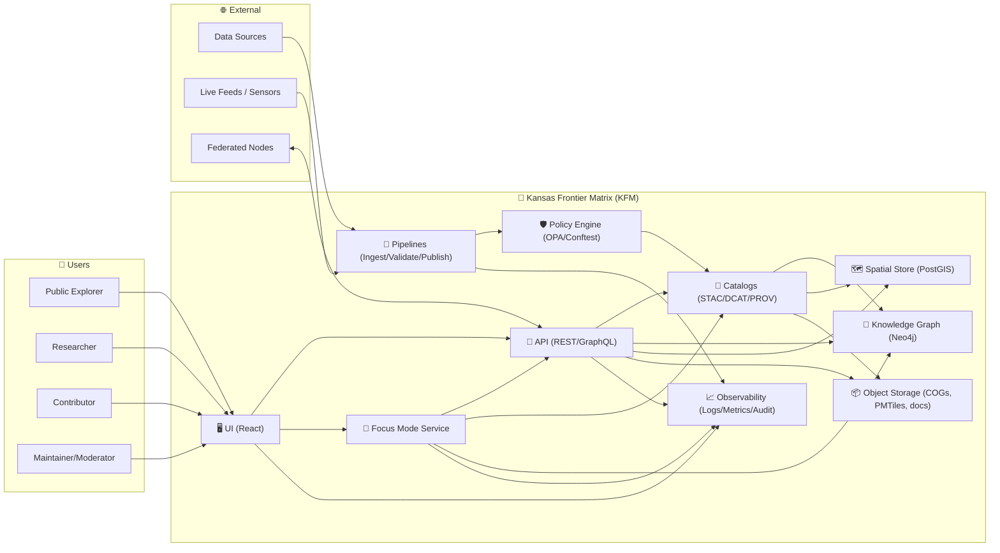
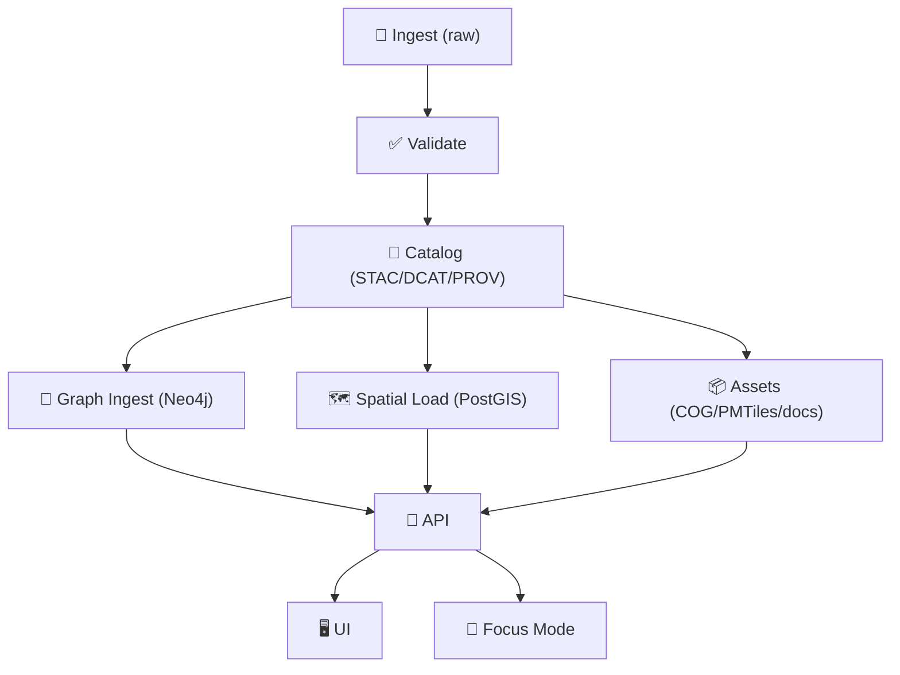
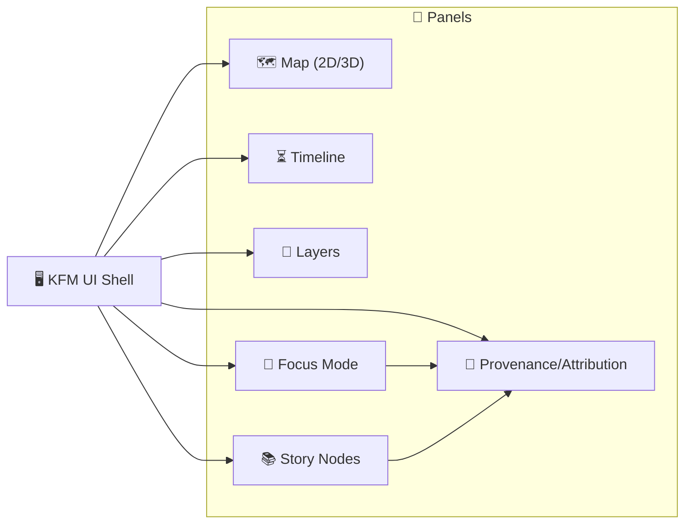
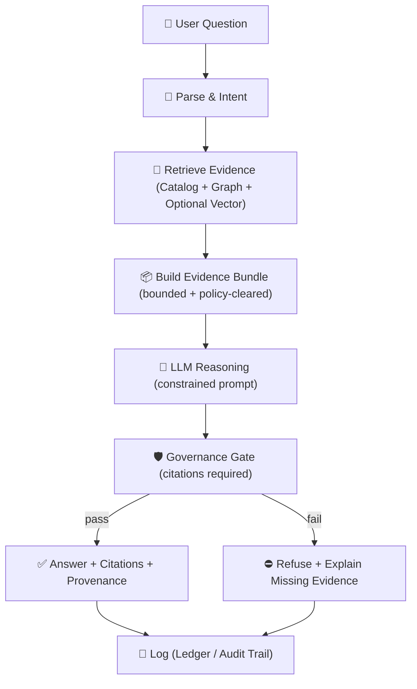

# 🌾 Kansas Frontier Matrix (KFM) — Vision & Full Architecture

> [!NOTE]
> This document is the **north star + full-system architecture** for KFM v13.  
> If you need “what we build first” and “exact repo wiring,” pair this with **`docs/architecture/KFM_REDESIGN_BLUEPRINT_v13.md`** (implementation blueprint) and **`docs/architecture/system_overview.md`** (runtime overview).

---

## 🧭 Table of Contents
- [🎯 What This Document Is](#-what-this-document-is)
- [🌟 Vision](#-vision)
- [🧱 Architectural Tenets](#-architectural-tenets)
- [🔒 Non‑Negotiable Invariants](#-non-negotiable-invariants)
- [🗺️ System Context](#️-system-context)
- [🏗️ Layered Architecture](#️-layered-architecture)
- [🧬 Data Lifecycle](#-data-lifecycle)
- [📦 Core Subsystems](#-core-subsystems)
  - [🧾 Catalogs & Evidence](#-catalogs--evidence)
  - [🧠 Knowledge Graph](#-knowledge-graph)
  - [🧩 APIs](#-apis)
  - [🖥️ UI System](#️-ui-system)
  - [🤖 Focus Mode AI](#-focus-mode-ai)
  - [🛡️ Governance, Policy & Safety](#️-governance-policy--safety)
  - [📈 Observability & Telemetry](#-observability--telemetry)
- [🚀 Deployment & Ops](#-deployment--ops)
- [🌐 Federation](#-federation)
- [🧩 Extensibility & Plugin Model](#-extensibility--plugin-model)
- [🗂️ Repository & Docs Layout](#️-repository--docs-layout)
- [🧭 Roadmap View](#-roadmap-view)
- [📎 Appendix](#-appendix)
  - [A. ✅ Definition of Done](#a--definition-of-done)
  - [B. 🧾 Canonical ID Patterns](#b--canonical-id-patterns)
  - [C. 📦 Evidence Bundle Example](#c--evidence-bundle-example)
  - [D. 🧪 Policy Gate Examples](#d--policy-gate-examples)
  - [E. 📚 Source Index](#e--source-index)

---

## 🎯 What This Document Is

### ✅ This *is*:
- A **single reference** for how KFM fits together end-to-end 🧠🗺️
- A **contract** between ingest → catalog → graph → API → UI → AI 🔁
- A **design system** for trust: provenance, policy, auditability, reproducibility 🧾🔍

### 🚫 This is *not*:
- A sprint plan
- A set of implementation tickets
- A replacement for module-level READMEs (those live next to code/data)

---

## 🌟 Vision

KFM is a **living, evidence-backed digital twin + atlas** of Kansas (and beyond via federation), where people can:

- Explore **2D + 3D maps** across time 🗺️⏳
- Follow **Story Nodes** (interactive narratives) that bind evidence to meaning 📚✨
- Ask **Focus Mode** questions that **must cite sources** and **refuse** when evidence is missing 🤖✅
- Trace every result back to **data + metadata + provenance + review** 🔍🧾

KFM’s long arc is bigger than one application:
- It’s a **pattern** for open, collaborative, policy-driven geospatial knowledge systems 🌐
- It’s a federation-ready blueprint for other “Frontier Matrices” (regions/domains) 🧭🧩

---

## 🧱 Architectural Tenets

1. **Evidence-First** ✅  
   If it cannot be traced, it cannot be published.

2. **Provenance-First** 🧾  
   Every dataset, transform, AI response, and UI view has lineage.

3. **Policy-as-Code** 🛡️  
   Governance is executable (CI checks, OPA/Conftest, gating rules).

4. **No Mystery Layers** 🚫🕳️  
   Anything in the platform must have a declared contract: schema + license + provenance.

5. **Human-Centered + Human-in-the-Loop** 🧑‍🤝‍🧑  
   Automation assists, but humans approve publication, merges, and sensitive releases.

6. **Modular + Replaceable** 🧩  
   UI can change without rewriting data logic; pipelines can evolve without breaking contracts.

7. **Standards-First Interop** 🌐  
   STAC / DCAT / PROV-O, plus ontology alignment (GeoSPARQL / CIDOC-CRM / OWL-Time).

8. **Safety & Respect** 🔒  
   Sensitive location handling, indigenous data sovereignty considerations, and license compliance.

9. **Sustainability-Aware** 🌱  
   Track and reduce compute waste; measure energy/carbon where feasible.

---

## 🔒 Non‑Negotiable Invariants

> [!IMPORTANT]
> These invariants define “what KFM *is*.” If a feature violates them, it’s not KFM.

### 🔁 Pipeline Ordering Is Law
KFM follows a strict order: **Ingest → Validate → Catalog → Graph → API → UI/AI**.  
- Focus Mode **must only use** ingested + cataloged + policy-cleared data.
- UI **must only use** API outputs (no bypass DB/graph reads from the client).

### 🧾 Evidence Triplet Required
Every publishable data product must ship with:
- **STAC** (spatiotemporal assets)
- **DCAT** (dataset discovery metadata)
- **PROV-O** (lineage: inputs, transforms, agents)

### ✅ “Fail Closed”
If a gate fails (schema, license, sensitivity, provenance), publish is blocked.

### 🤖 AI Must Cite or Refuse
Any AI output that cannot cite an approved source is a policy violation.

### 🧭 Provenance Must Be Queryable
Users must be able to answer:  
**“Where did this come from, who touched it, what changed, and how can I reproduce it?”**

---

## 🗺️ System Context

### 👥 Primary Actors
- **Public explorers**: map + stories + citations, exportable views
- **Researchers**: deeper datasets, notebooks, provenance, model runs
- **Contributors**: story authors, data submitters, QA helpers
- **Maintainers / Moderators**: review, approve, publish, govern
- **Automations**: W‑P‑E agents (Watcher–Planner–Executor) that propose changes via PRs

### 🧭 External Systems
- Data providers (agencies, archives, sensors, public APIs)
- Compute providers (cloud/local)
- Partner “Frontier Matrix” nodes (federation)



---

## 🏗️ Layered Architecture

KFM uses a **clean, layered architecture** to keep the system maintainable and federation-ready.

### 🧩 Logical Layers
| Layer | Responsibility | Examples |
|---|---|---|
| 🖥️ Experience | Interaction + visualization | Map, timeline, story playback, focus dashboards |
| 🧩 API & Orchestration | Contracts + queries + exports | REST/GraphQL, tile endpoints, snapshot exports |
| 🧠 Domain Services | Core use-cases | Publish dataset, generate tiles, answer question, create story |
| 🔌 Adapters | Connect domain to infrastructure | PostGIS adapter, Neo4j adapter, object store adapter |
| 🧰 Pipelines | Data movement + transforms | ingestion, OCR, georef, QA, publication |
| 📦 Storage | Persistence | Object store, catalogs, DBs, indexes |
| 🛡️ Governance | Policy + review | OPA rules, CI checks, approvals |
| 📈 Observability | Measure + audit | telemetry, energy/carbon, audit logs |

> [!TIP]
> Design rule: **UI is replaceable**, pipelines are **idempotent**, contracts are **versioned**, and governance is **enforced in CI**.

---

## 🧬 Data Lifecycle

### 1) 🧲 Intake (Raw → Staging)
- Pull from external APIs, uploads, partner drops
- Preserve originals under **`data/raw/`** (or object storage equivalent)
- Generate preliminary metadata (source, time, bbox, license hints)

### 2) ✅ Validation (Schema + Sanity)
- Validate formats, geometry, CRS, temporal ranges
- QA checks: completeness, outliers, topology validity, dedupe fingerprints

### 3) 🧾 Catalog (Evidence Triplet)
- Write STAC Item/Collection
- Write DCAT Dataset entry
- Write PROV bundle linking:
  - upstream source
  - transform activities
  - responsible agents
  - outputs

### 4) 🧠 Graph Ingest (Semantic Layer)
- Convert evidence to graph nodes/edges
- Align to ontology mappings
- Store: “dataset X derivedFrom source Y”, “event mentions place Z”, etc.

### 5) 🧩 API Exposure (Contracts)
- API reads **catalog + graph + spatial store**
- Applies policy redaction + sensitivity rules

### 6) 🖥️ UI + 🤖 AI Consumption
- UI queries API for layers, story nodes, and “explain my view”
- Focus Mode retrieves only policy-cleared evidence, then answers w/ citations



---

## 📦 Core Subsystems

### 🧾 Catalogs & Evidence

**Role:** KFM’s truth source for what exists and how it came to be.

#### ✅ Canonical Outputs (Per Data Product)
- **STAC**: assets + spatial + temporal + standardized properties
- **DCAT**: discoverability + distributions + licensing + publisher/steward
- **PROV-O**: lineage (entities, activities, agents)

#### 🧩 Why this matters
- UI can show “map behind the map” 🗺️🔍
- Focus Mode can cite exact sources 🤖📌
- Federation can share catalogs without sharing raw DBs 🌐

---

### 🧠 Knowledge Graph

**Role:** semantic glue across time, space, narratives, and datasets.

#### 🧱 Canonical Node Families
- **Datasets** (DCAT + KFM profile)
- **Assets** (STAC assets; rasters, vectors, tiles, docs)
- **Places** (gazetteer-aligned; polygons/points; historical variants)
- **Events** (historical, environmental, sensor, operational)
- **People / Orgs** (agents, publishers, authors, communities)
- **Documents** (OCR’d PDFs, letters, reports; linked to places/events)
- **Story Nodes** (narratives that link to evidence + map states)

#### 🔗 Canonical Relationship Families
- `prov:used`, `prov:wasGeneratedBy`, `prov:wasAssociatedWith`
- `mentions`, `located_in`, `occurred_at`, `derived_from`
- `has_version`, `supersedes`, `same_as` (entity resolution)
- `supports_claim` (narrative-to-evidence binding)

> [!NOTE]
> Neo4j is treated as the **authoritative semantic layer**, but it is fed by catalogs (not the other way around).

---

### 🧩 APIs

**Role:** enforce contracts, policy, and stable access patterns.

#### API Responsibilities
- Catalog queries (STAC search, DCAT discovery, PROV lineage)
- Spatial queries (bbox intersects, feature lookup, stats)
- Tile serving (vector/raster where appropriate)
- Story Node rendering & export (shareable, reproducible snapshots)
- Focus Mode question endpoint (returns answer + citations + provenance)

#### 🔒 API Safety Requirements
- Applies **redaction** + sensitivity logic
- Blocks access to restricted distributions
- Signs/records audit trails for high-risk queries

---

### 🖥️ UI System

**Role:** a single coherent experience that merges maps, time, narrative, and AI.

#### 🧱 UI Pillars
- **2D Map Viewer** (MapLibre-class rendering) 🗺️
- **3D Globe/Terrain** (Cesium-class rendering) 🌍
- **Timeline Slider** (time filtering, playback) ⏳
- **Story Nodes** (guided tours with map state transitions) 📚
- **Layer Manager + Legends + Popups** 🧩
- **Focus Mode Panel** (answer + citations + explainability) 🤖🔍
- **Collaboration** (annotations, comments, moderation flows) 🤝
- **Offline Packs + Mobile** (field use) 📱📦
- **AR Overlay (future)** (camera + geospatial layers) 🪄

#### 🧠 “Map Behind the Map”
UI must always be able to show:
- dataset attribution + license
- STAC/DCAT metadata
- PROV lineage (“how generated”)
- confidence / uncertainty where applicable



---

### 🤖 Focus Mode AI

**Role:** evidence-backed assistant that turns KFM’s catalogs + graph into answers, recommendations, and guided exploration.

#### ✅ Core Requirements
- **Cite or refuse** (never hallucinate)
- Only use **policy-cleared**, **cataloged** sources
- Surface an **explainability panel** (why this answer, what sources, what uncertainty)
- Log a **governance/audit record** (query, retrieval set, answer hash)

#### 🔍 Retrieval Strategy
“Hybrid retrieval” is the design target:
- Catalog search (STAC/DCAT filters: time, bbox, keywords)
- Graph traversal (events ↔ places ↔ documents ↔ datasets)
- Optional embedding index (vector search) for text-heavy corpora
- Evidence packing into a **bounded context** (token budgets + relevance)



#### 🧠 Focus Mode Capabilities (Vision)
- Answer questions with citations
- Suggest datasets, layers, story nodes
- Propose “next best exploration” paths (“If you care about X, look at Y”) 🧭
- In federated mode, optionally dispatch sub-queries to partner nodes 🌐

---

### 🛡️ Governance, Policy & Safety

**Role:** make trust enforceable, not aspirational.

#### ✅ Automated Policy Gates
Minimum gates:
- schema validation
- STAC/DCAT/PROV completeness
- license presence
- sensitivity classification + handling
- provenance completeness
- AI output citation enforcement

#### 🧑‍⚖️ Human Governance
- Maintainer review for publish/merge
- Moderation workflows for community content
- FAIR+CARE stewardship for ethical alignment

#### 🧿 Sensitive Data Handling (Examples)
- Location generalization (hex bins / fuzzed coords) for protected sites
- Restricted distributions require auth + justification
- Cultural protocols require explicit community approval

> [!IMPORTANT]
> KFM is built to be open **and** safe: “open by default” is not the same as “publish everything.”

---

### 📈 Observability & Telemetry

**Role:** keep the system measurable, debuggable, and accountable.

#### What we measure
- Pipeline runs: durations, failures, idempotency keys
- Data quality: QA metrics, drift, gap counts
- API: latency, error rates, cache hit rates
- Focus Mode: retrieval stats, refusal rates, citation coverage
- Sustainability: energy/carbon proxies for heavy jobs (where feasible)

#### 🧾 Audit Trail (Minimum)
- Who published what
- Which inputs were used
- What policies were applied
- What code version produced outputs (PR → PROV integration)

---

## 🚀 Deployment & Ops

### 🧰 Environments
- **Local dev**: Docker Compose / dev containers 🐳
- **Staging**: safe publish previews (policy runs + review UI)
- **Prod**: stable endpoints, immutable releases, backups

### 🔁 CI/CD (Policy-Driven)
- PR checks run:
  - schema lint
  - STAC/DCAT/PROV validation
  - license checks
  - secret scanning
  - policy pack evaluation (OPA/Conftest)
  - regression tests for pipelines and API

### ♻️ Reproducibility & Recovery
Because transforms are scripted + recorded, KFM can:
- rebuild indexes
- re-derive tiles
- validate historical consistency
- replicate to new regions

---

## 🌐 Federation

KFM is designed to become a node in a federation of compatible systems:
- Standardized APIs + ontologies
- Catalog exchange
- Cross-node query dispatch (future Focus Mode feature)
- Shared policy vocabulary with local overrides

> [!TIP]
> Federation ≠ one giant database. Federation is **interoperable contracts + shared semantics**.

---

## 🧩 Extensibility & Plugin Model

### 🔌 Extension Points
- **Data source plugins** (new agencies/APIs)
- **Pipeline modules** (new ETL DAGs)
- **Ontology fragments** (new domain vocab)
- **UI modules** (new dashboards, story templates, AR overlays)
- **Policy packs** (new rules without code rewrites)

### 🧠 W‑P‑E Agents (Automation, Safely)
- **Watcher** emits immutable facts (no actions)
- **Planner** proposes deterministic plan
- **Executor** opens PR (never auto-merges)
- Kill-switch supported 🧯

---

## 🗂️ Repository & Docs Layout

> [!NOTE]
> This is the **recommended** layout consistent with the v13 vision.  
> Actual repo may vary; treat this as the target state.

```text
📁 docs/
  📁 architecture/
    📄 KFM_VISION_FULL_ARCHITECTURE.md   ✅ (this file)
    📄 KFM_REDESIGN_BLUEPRINT_v13.md
    📄 system_overview.md
  📁 standards/
    📄 FAIRCARE-GUIDE.md
    📄 INDIGENOUS-DATA-PROTECTION.md
    📄 ROOT-GOVERNANCE.md
  📁 design/
    📄 STORY_NODE_SPEC.md
    📄 UI_COMPONENT_GUIDE.md

📁 data/
  📁 raw/                🧲 immutable-ish source drops
  📁 staging/            🧪 intermediate transforms
  📁 processed/           ✅ publishable canonical outputs
  📁 stac/               🛰️ STAC Items/Collections
  📁 dcat/               🧾 DCAT datasets
  📁 prov/               🧬 PROV bundles (JSON-LD)
  📁 graph/              🧠 graph ingest artifacts (CSV/JSON)

📁 src/
  📁 api/                🧩 FastAPI/GraphQL (contracts, policy)
  📁 pipelines/          🧰 ingestion + QA + publish DAGs
  📁 graph/              🧠 mapping rules + ingest tools
  📁 ui/                 🖥️ React app (MapLibre/Cesium)
  📁 policy/             🛡️ OPA/Conftest rules
  📁 telemetry/          📈 schemas + emitters
```

---

## 🧭 Roadmap View

### 🟢 Near-Term (Foundation)
- Lock down contracts (STAC/DCAT/PROV profiles + validation)
- API as single access plane
- UI map + timeline + provenance panel
- Focus Mode v1: cite-or-refuse on cataloged data
- Policy pack + CI gates
- Story Nodes format + playback

### 🟡 Mid-Term (Depth + Scale)
- Bulk document ingestion (OCR + entity linking)
- Real-time feeds watchers (idempotent STAC Items)
- Collaboration features + moderation workflows
- Reproducible research integration (JupyterHub/Binder)
- PR → PROV graph integration for end-to-end lineage

### 🔵 Long-Term (Frontier)
- AR overlays + field workflows
- 4D digital twin-style scenario exploration
- Federation across states/domains
- Advanced explainability + uncertainty visualization

---

# 📎 Appendix

## A. ✅ Definition of Done

This architecture is “done” when:
- [ ] **Invariants** are explicitly enforced (policy pack + CI)
- [ ] Data lifecycle is implemented: ingest → validate → catalog → graph → API → UI/AI
- [ ] Every published dataset has **STAC/DCAT/PROV**
- [ ] Focus Mode **cannot answer without citations**
- [ ] UI surfaces provenance (“map behind the map”) for every layer
- [ ] Sensitive data policies exist and are testable
- [ ] Federation contract is specified (API + ontology alignment)
- [ ] Repo layout supports modular growth + reproducibility

---

## B. 🧾 Canonical ID Patterns

> Keep IDs stable, boring, and machine-friendly ✅

- `urn:kfm:dataset:<domain>:<slug>:<version>`
- `urn:kfm:asset:<dataset-slug>:<asset-kind>:<hash>`
- `urn:kfm:place:<gazetteer>:<id>`
- `urn:kfm:event:<domain>:YYYY-MM-DD:<slug>`
- `urn:kfm:story:<slug>:<version>`
- `urn:kfm:prov:<activity-id>`

---

## C. 📦 Evidence Bundle Example

A Focus Mode “evidence bundle” is a bounded package like:
- top-k catalog hits (STAC/DCAT)
- graph path explanations (“why relevant”)
- PROV bundle pointers
- a citation map the LLM must use

```json
{
  "question_id": "focusq_2026_01_20_00017",
  "timebox": "1854-01-01/1865-12-31",
  "aoi": "Kansas",
  "sources": [
    { "type": "dcat_dataset", "id": "urn:kfm:dataset:history:boundary_changes:v1" },
    { "type": "stac_item", "id": "ks_historic_map_1861_sheet_04" },
    { "type": "prov_bundle", "ref": "data/prov/bundles/ks_historic_map_1861_sheet_04.jsonld" }
  ],
  "policy": { "sensitivity": "public", "license_ok": true },
  "citation_style": "KFM-inline"
}
```

---

## D. 🧪 Policy Gate Examples

> These are **illustrative** patterns; keep canonical rules in `src/policy/`.

### ✅ Gate: “No dataset without license”
- FAIL if DCAT entry lacks license field
- FAIL if unknown / ambiguous license strings

### ✅ Gate: “AI must cite”
- FAIL if Focus Mode answer references a claim without a citation
- FAIL if citation points to non-existent catalog id

### ✅ Gate: “Sensitive locations are generalized”
- FAIL if dataset is tagged sensitive and geometry precision exceeds threshold

---

## E. 📚 Source Index

This architecture is synthesized from the project’s KFM-specific design docs + future proposals + pipeline guides + curated technical libraries:

### 🌾 KFM Core Architecture & System Docs
- **Kansas Frontier Matrix (KFM) – Comprehensive Architecture, Features, and Design.pdf**
- **Kansas Frontier Matrix (KFM) – Comprehensive Technical Documentation.pdf**
- **Kansas Frontier Matrix (KFM) – AI System Overview 🧭🤖.pdf**
- **Kansas Frontier Matrix – Comprehensive UI System Overview.pdf**
- **📚 Kansas Frontier Matrix (KFM) Data Intake – Technical & Design Guide.pdf**
- **🌟 Kansas Frontier Matrix – Latest Ideas & Future Proposals.docx.pdf**
- **Innovative Concepts to Evolve the Kansas Frontier Matrix (KFM).pdf**
- **Pulse Ideas.pdf**

### 📦 Curated Reference Libraries (PDF Portfolios)
- **AI Concepts & more.pdf** (AI methods + responsible AI references)
- **Data Managment-Theories-Architures-Data Science-Baysian Methods-Some Programming Ideas.pdf** (data architecture + governance)
- **Maps-GoogleMaps-VirtualWorlds-Archaeological-Computer Graphics-Geospatial-webgl.pdf** (geospatial/WebGL/3D mapping references)
- **Various programming langurages & resources 1.pdf** (stack references: Docker/React/TS/Postgres/etc.)

---

> [!END]
> If you’re implementing: start by enforcing invariants (policy pack), then stabilize contracts (STAC/DCAT/PROV), then wire API → UI → Focus Mode. ✅

