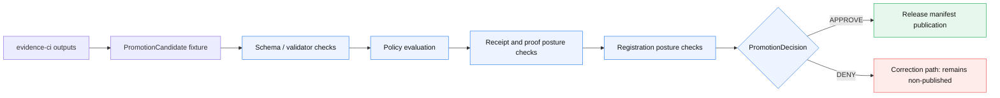
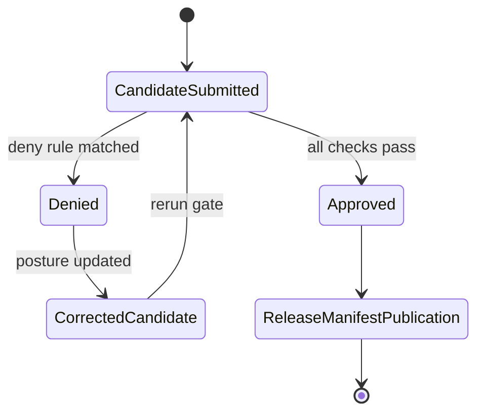

<!-- [KFM_META_BLOCK_V2]
doc_id: kfm://doc/NEEDS-VERIFICATION/promotion-gate
title: Promotion Gate
type: standard
version: v1
status: PROPOSED
layer: Promotion Gate
scope: Fixture-backed, no-network validation + policy checks in CI
owners: OWNER_TBD
created: NEEDS VERIFICATION
updated: 2026-05-01
policy_label: NEEDS VERIFICATION
related:
  - docs/control-plane/promotion-gate.md
  - .github/workflows/promotion-gate.yml
  - schemas/contracts/v1/promotion/promotion_candidate.schema.json
  - schemas/contracts/v1/promotion/promotion_decision.schema.json
tags:
  - kfm
  - promotion
  - evidence-ci
  - policy
  - release
  - receipts
  - gatehouse
notes:
  - Source status is PROPOSED.
  - Related paths are PROPOSED until verified in the mounted repository.
  - Static badges summarize intended posture; they do not prove implementation.
[/KFM_META_BLOCK_V2] -->

# Promotion Gate

<p align="center">
  
  
  
  
  
</p>

<p align="center">
  
  
  
  
  
  
</p>

<!--
Enable this live workflow badge only after the workflow path is verified in the real repository:

[](https://github.com/OWNER/REPO/actions/workflows/promotion-gate.yml)
-->

A fixture-backed, no-network release gate that denies publication unless evidence, receipts, policy posture, rights posture, sensitivity posture, review posture, and registration posture pass together.

> [!IMPORTANT]
> **Status:** PROPOSED  
> **Layer:** Promotion Gate, after `evidence-ci` and before release manifest publication  
> **Target path:** PROPOSED `docs/control-plane/promotion-gate.md`  
> **Workflow path:** PROPOSED `.github/workflows/promotion-gate.yml`  
> **Truth posture:** CONFIRMED doctrine / PROPOSED implementation / UNKNOWN repo execution depth

---

## Quick links

| Area | Link |
| --- | --- |
| Purpose | [Purpose](#purpose) |
| Operating law | [Operating law](#operating-law) |
| Lifecycle placement | [Lifecycle placement](#lifecycle-placement) |
| Inputs | [Inputs](#inputs) |
| Outputs | [Outputs](#outputs) |
| Deny rules | [Deny rules](#deny-rules) |
| CI behavior | [CI behavior](#ci-behavior) |
| Fixture plan | [Fixture plan](#fixture-plan) |
| Artifact separation | [Artifact separation](#artifact-separation) |
| Rollback and correction | [Rollback and correction](#rollback-and-correction) |
| Verification checklist | [Verification checklist](#verification-checklist) |
| Open questions | [Open questions](#open-questions) |

---

## At a glance

| Field | Value |
| --- | --- |
| **Gate name** | `Promotion Gate` |
| **Primary decision artifact** | `PromotionDecision` |
| **Candidate artifact** | `PromotionCandidate` |
| **Default posture** | Deny unless all required posture checks pass |
| **Network posture** | No-network fixture-backed CI |
| **Public release posture** | Requires reviewer, rights clarity, evidence hash, receipts, Cosign verification, and Gatehouse registration |
| **Release effect** | Allows release manifest publication only after `APPROVE` |
| **Correction effect** | Denied candidates remain non-published and require rerun after correction |

---

## Purpose

Promotion is a governed state transition.

The Promotion Gate prevents a candidate artifact, claim, layer, bundle, or release package from reaching `PUBLISHED` unless the candidate has enough evidence, receipts, policy support, rights posture, sensitivity posture, review posture, and registration posture for the requested release intent.

This gate is intentionally conservative. A candidate that cannot prove its release posture is denied, not silently promoted.

> [!CAUTION]
> A `PromotionDecision` is not a receipt, manifest, catalog record, proof pack, source registry entry, or published object. It is a separate decision artifact.

---

## Operating law

Promotion is not a file move, copy operation, visual publish action, or UI convenience step.

```text
RAW -> WORK / QUARANTINE -> PROCESSED -> CATALOG / TRIPLET -> PUBLISHED
```

The Promotion Gate sits at the trust boundary between prepared evidence-ci outputs and public or semi-public release publication.



> [!NOTE]
> This diagram describes the intended gate flow. Current repository workflow execution, route names, validator names, and emitted artifact locations remain **UNKNOWN** until verified against the mounted repo.

---

## Lifecycle placement

The Promotion Gate runs after evidence-ci has produced candidate evidence, receipts, and validation outputs, and before release manifest publication.

| Stage | Public release posture |
| --- | --- |
| `RAW` | Denied |
| `WORK` | Denied |
| `QUARANTINE` | Denied |
| `PROCESSED` | Evaluatable, but not automatically publishable |
| `CATALOG / TRIPLET` | Potentially release-ready if evidence, policy, review, receipts, and registration pass |
| `PUBLISHED` | Allowed only after an `APPROVE` `PromotionDecision` |

---

## Inputs

The gate evaluates `PromotionCandidate` JSON fixtures.

### Required candidate posture

| Requirement | Expected candidate support |
| --- | --- |
| Candidate lifecycle state | `candidate_state` or equivalent field. Exact field name: NEEDS VERIFICATION. |
| Release target | `target_state`, including whether the request targets `PUBLISHED`. |
| Release intent | `release_intent`, including whether `public_release=true`. |
| Evidence support | One or more `evidence_bundle_refs`. |
| Evidence contract identity | `evidencebundle_spec_hash`. |
| Run receipt support | `run_receipt_ref`. |
| Receipt bundle support | `run_receipt_bundle_ref`. |
| Rights posture | `rights_status`. |
| Sensitivity posture | `sensitivity`. |
| Reviewer posture | `reviewer` or `reviewer_ref`. Exact field name: NEEDS VERIFICATION. |
| Cosign receipt verification | `cosign_receipt_verification` or equivalent verification adapter output. |
| Gatehouse registration posture | `gatehouse_registration_posture`. |

<details>
<summary><strong>PROPOSED minimal <code>PromotionCandidate</code> fixture</strong></summary>

```json
{
  "candidate_id": "promotion-candidate.example",
  "candidate_state": "PROCESSED",
  "target_state": "PUBLISHED",
  "public_release": true,
  "release_intent": "public",
  "evidence_bundle_refs": [
    "kfm://evidence-bundle/example"
  ],
  "evidencebundle_spec_hash": "sha256:EXAMPLE",
  "run_receipt_ref": "kfm://receipt/run/example",
  "run_receipt_bundle_ref": "kfm://receipt-bundle/example",
  "rights_status": "cleared",
  "sensitivity": "public",
  "reviewer_ref": "kfm://reviewer/OWNER_TBD",
  "cosign_receipt_verification": {
    "verified": true,
    "verification_ref": "kfm://verification/cosign/example"
  },
  "gatehouse_registration_posture": "registered"
}
```

</details>

> [!NOTE]
> The JSON above is an illustrative fixture shape, not proof of an existing schema. Field names should be aligned to the repository’s canonical promotion contract when that contract is verified.

---

## Outputs

The gate emits a separate `PromotionDecision` JSON artifact.

A `PromotionDecision` must not replace, merge into, or masquerade as a receipt, release manifest, catalog record, proof pack, published object, or source registry entry.

### Decision outcomes

| Outcome | Meaning |
| --- | --- |
| `APPROVE` | Candidate passed all required checks for the stated release intent. |
| `DENY` | Candidate failed one or more checks and remains non-published. |

<details>
<summary><strong>PROPOSED minimal <code>PromotionDecision</code> artifact</strong></summary>

```json
{
  "decision_id": "promotion-decision.example",
  "candidate_id": "promotion-candidate.example",
  "decision": "DENY",
  "reason_codes": [
    "DENY_RIGHTS_UNKNOWN"
  ],
  "evaluated_at": "NEEDS VERIFICATION",
  "policy_ref": "kfm://policy/promotion-gate/v1",
  "validator_ref": "kfm://validator/promotion-gate/v1",
  "notes": [
    "Illustrative decision only. Timestamp, policy ref, and validator ref require repo verification."
  ]
}
```

</details>

---

## Deny rules

The gate fails closed. Any rule below is sufficient to deny promotion.

| Rule | PROPOSED reason code | Deny condition |
| --- | --- | --- |
| No public release from pre-public lifecycle states | `DENY_PUBLIC_RELEASE_FROM_UNPUBLISHED_STATE` | `public_release=true` while candidate state is `RAW`, `WORK`, or `QUARANTINE`. |
| Published target requires reviewer | `DENY_PUBLISHED_WITHOUT_REVIEWER` | `target_state=PUBLISHED` and no reviewer or reviewer reference is present. |
| Unknown rights block release | `DENY_RIGHTS_UNKNOWN` | `rights_status=unknown`. |
| Restricted sensitivity blocks public release | `DENY_RESTRICTED_PUBLIC_RELEASE` | `sensitivity=restricted` and `public_release=true`. |
| EvidenceBundle spec hash required | `DENY_MISSING_EVIDENCEBUNDLE_SPEC_HASH` | `evidencebundle_spec_hash` is missing or empty. |
| Run receipt reference required | `DENY_MISSING_RUN_RECEIPT_REF` | `run_receipt_ref` is missing or empty. |
| Run receipt bundle reference required | `DENY_MISSING_RUN_RECEIPT_BUNDLE_REF` | `run_receipt_bundle_ref` is missing or empty. |
| Public release requires Cosign receipt verification | `DENY_PUBLIC_RELEASE_WITHOUT_COSIGN_VERIFICATION` | `public_release=true` and Cosign receipt verification is absent, false, or unresolved. |
| Public release requires Gatehouse registration | `DENY_GATEHOUSE_NOT_REGISTERED` | `public_release=true` and `gatehouse_registration_posture` is not `registered`. |

> [!WARNING]
> Deny rules should be mirrored in both validator behavior and policy-as-code. UI badges alone must not become policy enforcement.

---

## Reason-code registry

| Reason code | Severity | Public-release effect | Correction path |
| --- | --- | --- | --- |
| `DENY_PUBLIC_RELEASE_FROM_UNPUBLISHED_STATE` | High | Blocks public release | Move through governed lifecycle and rerun. |
| `DENY_PUBLISHED_WITHOUT_REVIEWER` | High | Blocks `PUBLISHED` target | Attach reviewer posture and rerun. |
| `DENY_RIGHTS_UNKNOWN` | High | Blocks release | Resolve rights or keep non-public. |
| `DENY_RESTRICTED_PUBLIC_RELEASE` | High | Blocks public release | Redact, generalize, stage access, or deny public release. |
| `DENY_MISSING_EVIDENCEBUNDLE_SPEC_HASH` | High | Blocks release | Add or repair contract hash and rerun. |
| `DENY_MISSING_RUN_RECEIPT_REF` | High | Blocks release | Add run receipt ref and rerun. |
| `DENY_MISSING_RUN_RECEIPT_BUNDLE_REF` | High | Blocks release | Add receipt bundle ref and rerun. |
| `DENY_PUBLIC_RELEASE_WITHOUT_COSIGN_VERIFICATION` | High | Blocks public release | Repair receipt verification support and rerun. |
| `DENY_GATEHOUSE_NOT_REGISTERED` | High | Blocks public release | Register candidate posture or deny public release. |

---

## Registration posture

Current accepted Gatehouse posture vocabulary:

```text
registered | pending | unknown
```

| Posture | Promotion effect |
| --- | --- |
| `registered` | May pass this rule if all other checks pass. |
| `pending` | Deny public release. |
| `unknown` | Deny public release. |

> [!TIP]
> Keep Gatehouse vocabulary intentionally small until policy, fixtures, and UI display behavior are updated together.

---

## CI behavior

PROPOSED workflow home:

```text
.github/workflows/promotion-gate.yml
```

The workflow should run the promotion validator and Conftest against fixture inputs, then fail closed on invalid schema, invalid evidence posture, invalid receipt posture, invalid policy posture, invalid registration posture, or missing public-release verification support.

### CI requirements

| Requirement | Expected behavior |
| --- | --- |
| No-network fixtures | CI validates promotion posture using checked-in fixtures, not live source calls. |
| Validator pass | Candidate JSON matches the promotion candidate contract. |
| Policy pass | Conftest policy checks pass. |
| Deny fixture coverage | Each deny rule has at least one negative fixture. |
| Approval fixture coverage | At least one positive fixture proves the happy path without network access. |
| Fail-closed behavior | Invalid or missing posture fails CI. |
| Artifact separation | Decision output remains separate from receipts, manifests, catalogs, and published objects. |

<details>
<summary><strong>PROPOSED workflow badge block</strong></summary>

```markdown
<!-- Enable after workflow exists and repository path is verified. -->
[](https://github.com/OWNER/REPO/actions/workflows/promotion-gate.yml)
```

</details>

> [!NOTE]
> The workflow path and toolchain behavior are **PROPOSED** until repository inspection confirms the workflow exists and shows successful execution evidence.

---

## Fixture plan

| Fixture family | Purpose |
| --- | --- |
| `valid/public_registered_reviewed_candidate.json` | Proves the public-release approval path. |
| `invalid/raw_public_release.json` | Proves public release from `RAW` is denied. |
| `invalid/work_public_release.json` | Proves public release from `WORK` is denied. |
| `invalid/quarantine_public_release.json` | Proves public release from `QUARANTINE` is denied. |
| `invalid/published_without_reviewer.json` | Proves reviewer requirement for `PUBLISHED`. |
| `invalid/rights_unknown.json` | Proves unknown rights fail closed. |
| `invalid/restricted_public_release.json` | Proves restricted sensitivity blocks public release. |
| `invalid/missing_evidencebundle_spec_hash.json` | Proves spec hash requirement. |
| `invalid/missing_run_receipt_ref.json` | Proves run receipt reference requirement. |
| `invalid/missing_run_receipt_bundle_ref.json` | Proves receipt bundle reference requirement. |
| `invalid/public_without_cosign_verification.json` | Proves Cosign receipt verification requirement. |
| `invalid/public_gatehouse_pending.json` | Proves `pending` registration denies public release. |
| `invalid/public_gatehouse_unknown.json` | Proves `unknown` registration denies public release. |

---

## Artifact separation

Promotion decisions are decision artifacts only.

They must remain separate from:

```text
run receipts
receipt bundles
proof packs
release manifests
catalog records
source descriptors
published objects
correction notices
rollback records
UI layer manifests
AI or runtime response envelopes
```

This separation preserves auditability. A denied promotion candidate should remain inspectable without being treated as released.

---

## Rollback and correction

Denied candidates remain non-published.

Correction requires an updated candidate posture and a fresh gate run. A corrected candidate should not mutate the previous decision artifact in place.

| Situation | Required correction path |
| --- | --- |
| Missing evidence hash | Add or repair the EvidenceBundle contract hash, then rerun. |
| Missing receipt reference | Add the run receipt reference, then rerun. |
| Unknown rights | Resolve rights posture or keep candidate non-public. |
| Restricted sensitivity | Redact, generalize, stage access, or deny public release. |
| Missing reviewer | Attach reviewer posture before requesting `PUBLISHED`. |
| Gatehouse not registered | Register candidate posture or deny public release. |
| Failed Cosign verification | Repair verification support or deny public release. |



---

## Verification checklist

- [ ] Confirm target document path.
- [ ] Confirm canonical schema home for promotion contracts.
- [ ] Confirm `PromotionCandidate` schema exists or create it through the agreed schema-home convention.
- [ ] Confirm `PromotionDecision` schema exists or create it through the agreed schema-home convention.
- [ ] Confirm validator runtime and command.
- [ ] Confirm Conftest/OPA policy location and invocation.
- [ ] Confirm Cosign verification adapter shape.
- [ ] Confirm Gatehouse posture source and vocabulary.
- [ ] Confirm workflow path and CI behavior.
- [ ] Confirm positive and negative fixture coverage.
- [ ] Confirm promotion decisions are emitted as separate artifacts.
- [ ] Confirm denied candidates cannot reach release manifest publication.
- [ ] Confirm rollback and correction records remain separate.
- [ ] Confirm static badges are not mistaken for live workflow evidence.
- [ ] Enable live workflow badge only after `.github/workflows/promotion-gate.yml` is verified.

---

## Markdown niceties included

| Feature | Purpose |
| --- | --- |
| Badge rail | Makes status, layer, network posture, and policy posture visible at the top. |
| Commented workflow badge | Provides a safe live-badge placeholder without claiming workflow existence. |
| Quick links | Improves navigation in GitHub-rendered docs. |
| GitHub callouts | Highlights important trust, caution, warning, and note sections. |
| Mermaid diagrams | Shows gate flow and correction loop. |
| Collapsible details | Keeps JSON examples available without overwhelming the page. |
| Task checklist | Makes verification work trackable. |
| Reason-code registry | Turns policy outcomes into maintainable vocabulary. |
| Glossary | Reduces ambiguity for future maintainers. |

---

## Glossary

| Term | Meaning |
| --- | --- |
| `PromotionCandidate` | Candidate release object evaluated by the gate. |
| `PromotionDecision` | Separate decision artifact emitted by the gate. |
| `EvidenceBundle` | Evidence support object that outranks generated language or UI presentation. |
| `evidencebundle_spec_hash` | Contract identity hash required to prove the candidate’s evidence contract posture. |
| `run_receipt_ref` | Reference to the run receipt supporting the candidate. |
| `run_receipt_bundle_ref` | Reference to the bundled run receipt support. |
| `Cosign receipt verification` | Verification posture required for public release in this draft. |
| `Gatehouse registration posture` | Registration state required before public release. |
| `fail closed` | Default denial when required posture is missing, unknown, false, or unresolved. |

---

## Changelog

| Date | Change |
| --- | --- |
| 2026-05-01 | Initial PROPOSED Promotion Gate draft. |
| 2026-05-01 | Added badges, quick links, callouts, collapsible JSON examples, diagrams, reason-code registry, Markdown niceties, and badge safety notes. |

---

## Open questions

- Canonical EvidenceBundle signature and verification adapter shape for future strict cryptographic checks.
- Standard Gatehouse posture vocabulary beyond `registered | pending | unknown`.
- Whether schema validation is required inside the validator runtime once shared contract tooling is centralized.
- Exact `PromotionCandidate` field names.
- Exact `PromotionDecision` field names and required metadata.
- Canonical policy path for promotion Rego.
- Canonical fixture path for promotion-gate positive and negative cases.
- Whether Cosign verification is the only accepted public-release receipt verification mechanism or one implementation of a broader verification adapter.
