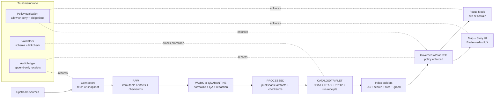
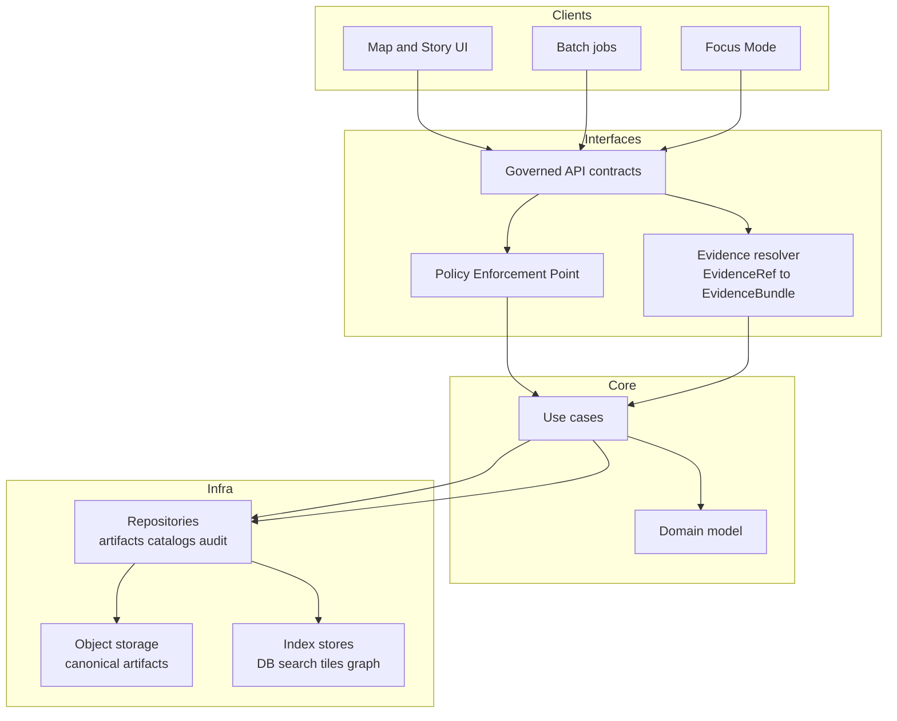

<!-- [KFM_META_BLOCK_V2]
doc_id: kfm://doc/a8e9c2e8-7a89-4b0c-9f4c-1e9d4a0f1c6d
title: Architecture
type: standard
version: v1
status: draft
owners: KFM Maintainers
created: 2026-02-24
updated: 2026-03-01
policy_label: restricted
related:
  - TODO: docs/governance/README.md
  - TODO: docs/apis/README.md
  - TODO: docs/data/README.md
  - TODO: docs/ui/README.md
tags: [kfm, architecture, trust-membrane, truth-path, promotion-contract]
notes:
  - Defines the trust membrane, truth path lifecycle, and promotion contract expectations for architecture changes.
  - Directory layouts include CONFIRMED-at-root items and PROPOSED target expansions; do not treat PROPOSED subtrees as repo fact without verification.
[/KFM_META_BLOCK_V2] -->

<a id="top"></a>

# Architecture
Governed, end-to-end system architecture + **trust membrane** rules for Kansas-Matrix-System.

**Map-first • Time-aware • Evidence-first • Governed • Cite-or-abstain**


 <!-- TODO: replace with real workflow badge -->

> [!WARNING]
> This directory documents production constraints.
>
> If a change alters **data lifecycle**, **policy enforcement**, **API boundaries**, **claim traceability**, or **sensitive-location handling**, treat it as a **governed change** and update:
> 1) the relevant contracts, 2) the enforcement docs, and 3) the merge-blocking CI checks.
>
> Docs are not enforcement. If an invariant matters, it must be **runtime enforced** and **merge-blocking in CI**.

---

## Quick navigation

- [System at a glance](#system-at-a-glance)
- [Truth discipline labels](#truth-discipline-labels)
- [Layering model](#layering-model)
- [Trust membrane invariants](#trust-membrane-invariants)
- [Truth path lifecycle zones](#truth-path-lifecycle-zones)
- [Promotion contract and audit](#promotion-contract-and-audit)
- [Interfaces and contracts](#interfaces-and-contracts)
- [Security ethics and location handling](#security-ethics-and-location-handling)
- [How to change architecture](#how-to-change-architecture)
- [Directory guide](#directory-guide)
- [Appendix](#appendix)

---

## System at a glance

Kansas-Matrix-System connects:

**upstream → connectors → RAW → WORK/QUARANTINE → PROCESSED → CATALOG/TRIPLET → index builders → governed API (PEP) → Map/Story UI + Focus Mode**

Key architectural idea: **catalogs + provenance are contract surfaces**, not “nice metadata”.



> [!NOTE]
> “Published” is not just a folder. It is the **governed runtime**: API responses, tiles, story pages, and Focus Mode outputs—each backed by promoted artifacts + receipts.

[(back to top)](#top)

---

## Truth discipline labels

To keep docs actionable (and prevent accidental invention), we tag statements:

- **[CONFIRMED]** backed by governed docs / validated artifacts.
- **[PROPOSED]** an option or recommended design pattern.
- **[UNKNOWN]** requires verification in the live repo (and must not be assumed true).

> [!TIP]
> When adding a new architectural claim: include (1) evidence, (2) policy decision path, (3) the CI/runtime enforcement point.

[(back to top)](#top)

---

## Layering model

We enforce layering so governance is testable and bypass is hard.



### Practical meaning

- **Domain**: datasets, dataset versions, artifacts, catalogs, claims, evidence refs, policy decisions, receipts, story nodes.
- **Use cases**: ingest, validate, promote, resolve evidence, query slices, publish story nodes, run focus queries.
- **Interfaces**: API + evidence resolver + policy boundary (enforcement, not “helper lib”).
- **Infrastructure**: artifact stores + catalog store + audit ledger + projection stores (indexes, tiles, DB).

[(back to top)](#top)

---

## Trust membrane invariants

These are **non-negotiable**. Encode them as tests and enforce them in CI.

### Hard rules (normative)

- **Clients MUST NOT access DB/object storage directly.** UI/clients MUST use governed APIs only.
- **Core logic MUST NOT bypass repositories.** Use cases talk to repos; repos talk to storage/indexes.
- **All access MUST be policy-evaluated.** Policy evaluation returns **decision + obligations** (e.g., generalize geometry, remove fields).
- **Gates MUST fail closed.** Missing license, missing policy label, missing catalogs, or missing receipts MUST block promotion and release.
- **Citations MUST be EvidenceRefs, not URLs.** Every user-facing claim MUST cite resolvable evidence or abstain.
- **Runtime MUST only serve promoted versions.** Runtime services read only promoted dataset versions with DCAT/STAC/PROV + receipts.
- **Deterministic identity is mandatory.** `dataset_id` + `dataset_version_id` + `spec_hash` + content digests prevent silent drift.

### Architectural smells (block on sight)

- New endpoint reads from DB/object store without policy evaluation.
- Client code contains database credentials.
- “Temporary bypass” around promotion gates for demos.
- Broken evidence links or non-resolvable citations in Story/Focus outputs.
- Index/data-store treated as canonical truth (it is a projection unless explicitly promoted as canonical).

> [!TIP]
> If you need performance: optimize **inside** the membrane (cache, precompute, better indexing), not by bypassing governance.

[(back to top)](#top)

---

## Truth path lifecycle zones

Promotion is not a copy operation. It is a governed decision supported by artifacts and tests.

| Zone | Purpose | Typical contents | Mutability | Typical readers | Promotion out requires |
|---|---|---|---|---|---|
| Upstream | External source-of-record | Remote APIs, files, portals, feeds | Out of our control | Connectors | Capture terms snapshot + acquisition manifest |
| RAW | Immutable acquisition | Raw artifacts + checksums + acquisition/terms snapshot + fetch logs | Append-only | Pipeline maintainers | Identity + digests + license snapshot |
| WORK / QUARANTINE | Isolation + QA | Normalization outputs, reprojections, tiling jobs, QA reports, redaction candidates | Rewrite allowed | Data engineers, reviewers | Validation reports + policy label + redaction plan |
| PROCESSED | Publishable artifacts | Standard formats (GeoParquet, COG, PMTiles, etc.), stable IDs, checksums | Immutable per version | API/index builders | Meets QA thresholds + stable digests |
| CATALOG / TRIPLET | Contract surfaces | Cross-linked DCAT + STAC + PROV + run receipts + link maps | Immutable per version | Validators, resolvers | Validators pass + links resolve |
| PUBLISHED | Governed runtime surfaces | Policy-filtered API responses, tiles, story pages, Focus outputs (with receipts) | Mutable at runtime, but backed by immutable versions | End users | Only serve promoted versions; audit every request/run |

### Minimum metadata (fail closed)

For any dataset version eligible for promotion, we require at least:

- `dataset_id`, `dataset_version_id` (stable IDs)
- `spec_ref` + `spec_hash` (deterministic definition of transforms + thresholds)
- License/rights + upstream terms snapshot
- Policy label + obligations/redaction plan (when needed)
- Spatial + temporal extents
- Checksums/digests for every artifact
- Catalog triplet + resolvable EvidenceRefs

[(back to top)](#top)

---

## Promotion contract and audit

Promotion to PUBLISHED is blocked unless **all** minimum gates pass (fail closed).

### Promotion Contract v1 (minimum gates)

| Gate | What must be present | Example CI check |
|---|---|---|
| A — Identity & versioning | dataset_id + dataset_version_id; deterministic spec_hash; content digests | Spec/schema validation; spec_hash golden tests; digest verification |
| B — Licensing & rights | License/rights fields + snapshot of upstream terms | Fail if license missing/unknown; terms snapshot exists |
| C — Sensitivity & redaction plan | policy_label + obligations (generalize geometry, remove fields, etc.) | Policy tests default-deny; verify obligations applied |
| D — Catalog triplet validation | DCAT/STAC/PROV validate and cross-link; EvidenceRefs resolve | Validators + linkcheck; fail on broken links |
| E — QA & thresholds | Dataset-specific checks + thresholds documented and met | QA report exists; quarantine failures |
| F — Run receipt & audit record | Receipt capturing inputs, tooling, hashes, policy decisions; audit ledger append-only | Receipt schema validation; attestation/signature checks (if enabled) |
| G — Release manifest | Promotion recorded as a manifest referencing artifacts + digests | Manifest exists; references match objects |

### Run receipt template (machine-verifiable)

```yaml
run_id: "kfm://run/YYYY-MM-DDTHH:MM:SSZ.<suffix>"
created_at: "YYYY-MM-DDTHH:MM:SSZ"
actor:
  principal: "svc:pipeline|user:<id>"
  role: "pipeline|steward|admin"
operation: "ingest+publish|index_build|focus_query|story_publish"
dataset_version_id: "YYYY-MM.<hash>"
spec_hash: "sha256:..."
inputs:
  - uri: "raw/<path-or-uri>"
    digest: "sha256:..."
outputs:
  - uri: "processed/<path-or-uri>"
    digest: "sha256:..."
environment:
  container_digest: "sha256:..."
  git_commit: "<sha>"
  params_digest: "sha256:..."
validation:
  status: "pass|fail"
  report_digest: "sha256:..."
policy:
  decision_id: "kfm://policy_decision/<id>"
notes:
  - "Short explanation of what changed"
```

> [!NOTE]
> If sensitivity is unclear, **default to deny** and route to governance review.

[(back to top)](#top)

---

## Interfaces and contracts

### Contract registry

| Contract | Purpose | Location (recommended) |
|---|---|---|
| API contract | Endpoints, auth, error model, audit_ref in errors | `contracts/openapi/` (machine) + `docs/apis/` (human) |
| Evidence resolver contract | EvidenceRef → EvidenceBundle; policy enforced | `contracts/schemas/` + `docs/apis/` |
| Policy contract | policy_label, obligations, default-deny tests | `policy/` + `docs/governance/` |
| Catalog triplet profiles | DCAT/STAC/PROV required fields + cross-link rules | `contracts/schemas/` + `docs/data/` |
| Receipt + manifest schemas | run receipt schema + promotion manifest schema | `contracts/schemas/` |
| UI trust surfaces | Evidence drawer requirements, accessibility targets | `docs/ui/` |

> [!IMPORTANT]
> Keep contracts versioned and test them. The fastest way to break the trust membrane is to change behavior without updating the contract.

### EvidenceRef schemes (minimum)

Prefer explicit schemes so resolution is deterministic:

- `dcat://...` dataset/distribution metadata
- `stac://...` collection/item/asset metadata
- `prov://...` lineage + run receipts
- `doc://...` governed docs + story citations
- `graph://...` entity relations (if enabled)

### Evidence resolver contract (why this replaces “LLM citations”)

A “citation” is not a pasted URL. A citation is an **EvidenceRef** that resolves (via the resolver) into an **EvidenceBundle** containing inspectable metadata, provenance, digests, and policy results.

**Resolver requirements:**
- MUST apply policy and obligations.
- MUST return machine + human views.
- SHOULD be usable by the UI in **≤ 2 calls**.
- MUST fail closed if unresolvable or unauthorized.

[(back to top)](#top)

---

## Security ethics and location handling

### Default-deny when unclear

If permission, sensitivity, or community constraints are unclear:

- **redact or generalize**
- flag for governance review
- do not promote or publish

### Vulnerable sites and sensitive locations

- Do not store or expose exact coordinates for vulnerable/private/culturally restricted locations.
- Prefer coarse geography and controlled access.
- Ensure obligations like geometry generalization are testable and enforced.

### Focus Mode safety posture

Focus Mode is a governed workflow:

- policy pre-check → retrieval → evidence bundling → synthesis → hard citation verification → receipt  
- MUST cite resolvable evidence or abstain

[(back to top)](#top)

---

## How to change architecture

### Change types

| Change | Examples | Required updates |
|---|---|---|
| Interface change | new endpoint, auth change, error model change | API contract + tests + migration notes |
| Governance change | new policy_label, new obligation type | Policy contract + fixtures + review sign-off |
| Lifecycle change | new gate, new zone definition | Gate definitions + receipt/manifest schemas + CI checks |
| Catalog change | new DCAT/STAC/PROV profile field | Validators + linkcheck updates + fixtures |
| Storage/index change | new index type, partitioning | Repo adapters + rebuild/runbook + rollback plan |

### Definition of done (architecture changes)

- [ ] Updated this README if trust membrane, truth path, or contract surfaces changed
- [ ] ADR added/updated with decision + consequences + rollback
- [ ] Tests added to enforce invariants (merge-blocking)
- [ ] Migration plan exists and is reversible
- [ ] Security/privacy review complete (especially for sensitive locations)
- [ ] Evidence resolution still works end-to-end (Map/Story/Focus)

### Minimum verification steps (convert UNKNOWN → CONFIRMED)

Attach outputs of these checks to the next revision when architecture is changing:

- [ ] Capture repo commit hash + root tree (e.g., `git rev-parse HEAD`, `tree -L 3`)
- [ ] Enumerate CI gates from workflow config and document what blocks merges
- [ ] Confirm presence of validators, policy pack/tests, evidence resolver route, and receipt schemas
- [ ] Promote one MVP dataset end-to-end through all gates and store receipts + catalogs
- [ ] Confirm UI cannot bypass PEP (static + network policy checks)
- [ ] For Focus Mode: run evaluation harness and store golden outputs + diffs

[(back to top)](#top)

---

## Directory guide

### Purpose

`docs/architecture/` is the **system-level** documentation for:

- trust membrane + boundary rules
- layering model
- truth path lifecycle + promotion contract
- cross-cutting concerns: audit, policy, catalogs, evidence resolution, security

### Where it fits

This directory is the top of the documentation tree for architecture. Detailed docs should live in their domain directories and be linked from here.

### Acceptable inputs

- System diagrams that explain boundaries and flows
- ADRs for architecture decisions
- Contract pointers and versioning conventions
- Threat models and risk assessments
- Receipt/manifest schemas and examples

### Exclusions

- Product roadmaps and user stories
- Implementation tutorials for a single service
- Secrets, credentials, or production access instructions
- Exact coordinates for sensitive sites

---

## Directory layout (fully expanded)

This section answers: “Where does everything go?” while staying honest about what is **repo fact** vs **target design**.

### 1) Repo root layout

#### Repo root (CONFIRMED at repo root)
The following top-level directories are treated as **present at repo root** in internal inventory notes; deeper contents must be verified before being treated as fact.

```text
.github/
apps/
packages/
contracts/
policy/
data/
infra/
docs/
tools/
tests/
configs/
scripts/
migrations/
examples/
```

> [!IMPORTANT]
> Do not claim the presence of deeper modules (e.g., `apps/api` or `packages/ingest`) until verified with a commit hash + `tree`. Treat the deeper structure below as **PROPOSED target layout** unless you have repo evidence.

#### Target expansion (PROPOSED)
This is a buildable target layout that supports the trust membrane + truth path + contract surfaces:

```text
repo-root/
├─ README.md
├─ CHANGELOG.md
├─ LICENSE
│
├─ .github/
│  ├─ workflows/                              # CI: lint, test, policy, linkcheck, contracts, promotion gates
│  ├─ ISSUE_TEMPLATE/
│  ├─ PULL_REQUEST_TEMPLATE.md
│  └─ CODEOWNERS
│
├─ docs/                                      # Human-readable docs (governed)
│  ├─ README.md                               # Docs index + link map (required)
│  ├─ architecture/                           # This directory (trust membrane + truth path)
│  ├─ governance/                             # Policy labels, review workflows, steward playbooks
│  ├─ data/                                   # Data contracts, zone semantics, dataset specs, catalog profiles
│  ├─ apis/                                   # Human API docs, auth model, error model, examples
│  ├─ ui/                                     # Map/Story/Focus UX contracts + accessibility targets
│  ├─ ops/                                    # Runtime posture, environments, observability (no secrets)
│  ├─ runbooks/                               # Rebuild, incident response, promotion troubleshooting
│  ├─ dev/                                    # Contributing, local dev, testing, release process
│  └─ templates/                              # MetaBlock + ADR + contract doc templates
│
├─ contracts/                                 # Canonical machine contracts
│  ├─ openapi/                                # OpenAPI specs (versioned)
│  ├─ schemas/                                # JSON Schemas (EvidenceRef, receipts, manifests, registry entries)
│  ├─ vocab/                                  # Controlled vocabularies (policy labels, obligations, themes)
│  ├─ examples/                               # Golden fixtures for CI (small + stable)
│  └─ README.md
│
├─ policy/                                    # Policy packs (OPA/Rego or equivalent) + tests
│  ├─ rego/
│  ├─ fixtures/
│  ├─ tests/
│  └─ README.md
│
├─ data/                                      # Data registry + governed zone manifests (not “random data dumps”)
│  ├─ README.md
│  ├─ registry/
│  │  ├─ datasets/                            # Dataset entries (YAML) w/ license, cadence, extents, sensitivity
│  │  ├─ sources/                             # Upstream source descriptors + terms snapshots pointers
│  │  ├─ specs/                               # Transform + QA thresholds specs (spec_hash inputs)
│  │  ├─ schemas/                             # Registry schemas (mirror/link to contracts/)
│  │  └─ fixtures/
│  │
│  ├─ zones/                                  # Local/dev zone structure (paths are environment-specific)
│  │  ├─ raw/                                 # Immutable acquisitions (append-only per version)
│  │  ├─ work/                                # Quarantine + QA reports
│  │  ├─ processed/                           # Publishable artifacts + digests
│  │  ├─ catalog/                             # DCAT + STAC + PROV artifacts
│  │  └─ published/                           # Release manifests + published pointers (not canonical truth)
│  │
│  ├─ catalogs/                               # Optional: checked-in examples or small static catalogs
│  │  ├─ dcat/
│  │  ├─ stac/
│  │  └─ prov/
│  │
│  └─ manifests/
│     ├─ runs/                                # Run receipts (golden + examples; full receipts stored in ledger)
│     └─ promotions/                          # Promotion manifests (golden + examples)
│
├─ apps/                                      # Runnable services (deployable units)
│  ├─ api/                                    # Governed API service (PEP)
│  ├─ ui/                                     # Map/Story/Focus web app
│  ├─ workers/                                # Pipeline runners, index builders, async jobs
│  └─ cli/                                    # Steward/dev CLI tools (promotion, validation, rebuild)
│
├─ packages/                                  # Shared libraries (domain + use cases + adapters)
│  ├─ domain/                                 # Core types: Dataset, EvidenceRef, EvidenceBundle, Receipt, PolicyDecision
│  ├─ usecases/                               # Orchestrations: ingest, validate, promote, resolve evidence, focus runs
│  ├─ repositories/                           # Interfaces + infra adapters (object store, db, search, graph)
│  ├─ ingest/
│  ├─ catalog/
│  ├─ evidence/
│  ├─ indexers/
│  ├─ policy/
│  └─ shared/
│
├─ infra/                                     # Deployment and ops (no secrets in repo)
│  ├─ k8s/
│  ├─ helm/
│  ├─ terraform/
│  ├─ gitops/
│  └─ dashboards/
│
├─ tools/                                     # Validators + doc tooling used in CI and locally
│  ├─ validators/                             # STAC/DCAT/PROV validators, schema validators
│  ├─ linkcheck/                              # EvidenceRef and doc link verification
│  ├─ spec-hash/                              # Deterministic spec hashing tooling
│  └─ README.md
│
├─ configs/                                   # Configuration templates (environment-specific values live outside repo)
│  ├─ env/
│  ├─ pipelines/
│  ├─ api/
│  └─ ui/
│
├─ scripts/                                   # Build/release scripts (thin wrappers; prefer tooling in /tools)
├─ migrations/                                # DB migration scripts (PostGIS/Postgres)
├─ examples/                                  # Example datasets/stories/policies (safe + small)
└─ tests/                                     # Unit + integration + e2e + fixtures (merge-blocking)
```

[(back to top)](#top)

---

### 2) `docs/architecture/` layout (PROPOSED, expanded)

```text
docs/architecture/
├─ README.md                                  # This file (normative invariants + index)
│
├─ overview/
│  ├─ README.md
│  ├─ system-context.md
│  ├─ actors-and-trust-surfaces.md
│  ├─ layering.md
│  ├─ component-decomposition.md
│  ├─ deployment-topology.md
│  ├─ trust-membrane.md
│  ├─ policy-boundary.md
│  ├─ evidence-and-claims.md
│  ├─ focus-mode-constraints.md
│  ├─ truth-path.md
│  ├─ promotion-contract.md
│  ├─ provenance-and-audit.md
│  ├─ canonical-vs-rebuildable.md
│  ├─ identity-and-hashing.md
│  ├─ time-model.md
│  ├─ time-queries-and-snapshots.md
│  ├─ security-and-privacy.md
│  ├─ sensitive-locations.md
│  ├─ observability.md
│  └─ glossary.md
│
├─ decisions/
│  ├─ README.md
│  ├─ adr-0000-template.md
│  ├─ adr-0001-example.md
│  └─ adr-index.yml
│
├─ diagrams/
│  ├─ README.md
│  ├─ system-context.mmd
│  ├─ layering.mmd
│  ├─ truth-path.mmd
│  ├─ contracts.mmd
│  ├─ pep-pdp-obligations.mmd
│  ├─ evidence-flow.mmd
│  ├─ time-model.mmd
│  ├─ deployment.mmd
│  └─ exports/
│     ├─ .gitkeep
│     └─ README.md
│
├─ enforcement/
│  ├─ README.md
│  ├─ invariants.md
│  ├─ policy-enforcement-points.md
│  ├─ contract-testing.md
│  ├─ data-promotion-gates.md
│  ├─ redaction-and-generalization-tests.md
│  └─ ci-checks.md
│
├─ registries/
│  ├─ README.md
│  ├─ boundary-surface-registry.yml
│  ├─ service-catalog.yml
│  ├─ contract-index.yml
│  ├─ pep-registry.yml
│  └─ policy-label-registry.yml
│
├─ templates/
│  ├─ README.md
│  ├─ kfm-meta-block-v2.txt
│  ├─ standard-doc.template.md
│  ├─ adr.template.md
│  ├─ contract-doc.template.md
│  ├─ diagram.template.mmd
│  └─ review-checklist.md
│
└─ threat-model/
   ├─ README.md
   ├─ scope-and-assets.md
   ├─ actors-and-entrypoints.md
   ├─ data-classification-and-handling.md
   ├─ abuse-cases.md
   ├─ control-mapping.md
   ├─ risk-register.md
   └─ residual-risk.md
```

---

## Appendix

<details>
<summary>ADR template</summary>

```markdown
<!-- [KFM_META_BLOCK_V2]
doc_id: kfm://doc/TODO-UUID
title: ADR XXXX: Short title
type: standard
version: v1
status: draft
owners: TODO
created: YYYY-MM-DD
updated: YYYY-MM-DD
policy_label: restricted
related:
  - docs/architecture/README.md
tags: [kfm, adr]
notes:
  - One sentence summary.
[/KFM_META_BLOCK_V2] -->

# ADR XXXX: Short title

## Context

## Decision

## Consequences

## Alternatives considered

## Verification

- Tests:
- Migration:
- Rollback:
```

</details>

<details>
<summary>Architecture review checklist</summary>

- Boundary: Is every data access behind policy (PEP + resolver)?
- Traceability: Can a claim link to EvidenceRef → EvidenceBundle → receipts?
- Reproducibility: Can we rebuild PUBLISHED projections from PROCESSED + catalogs?
- Safety: Are sensitive locations protected (generalized/redacted) by obligations + tests?
- Licensing: Are rights + terms snapshots captured and enforced?
- Reversibility: Is rollback cheap and documented?
- CI: Do validators, linkcheck, policy tests, and schema checks block merges?

</details>

[(back to top)](#top)
