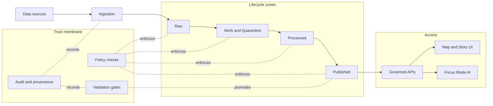
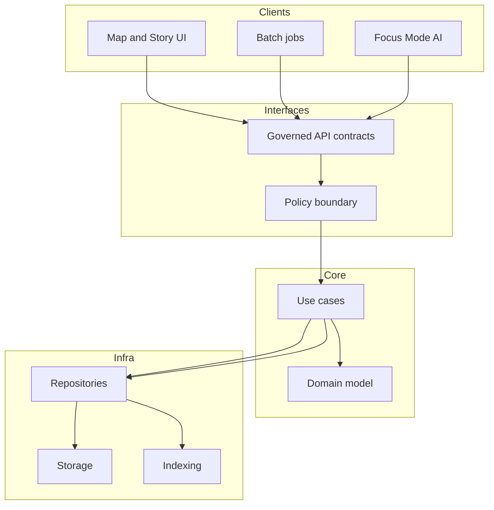

<!-- [KFM_META_BLOCK_V2]
doc_id: kfm://doc/a8e9c2e8-7a89-4b0c-9f4c-1e9d4a0f1c6d
title: Architecture
type: standard
version: v1
status: draft
owners: KFM Maintainers
created: 2026-02-24
updated: 2026-02-24
policy_label: restricted
related:
  - TODO: docs/governance/README.md
  - TODO: docs/apis/README.md
  - TODO: docs/data/README.md
  - TODO: docs/ui/README.md
tags: [kfm, architecture]
notes:
  - This README defines the trust membrane and the minimum documentation set for architecture changes.
  - Update the TODO links once the repo paths are confirmed.
[/KFM_META_BLOCK_V2] -->

<a id="top"></a>

# Architecture

Governed, end-to-end system architecture and **trust membrane** rules for Kansas-Matrix-System.


> [!WARNING]
> This directory documents production constraints. If a change alters data lifecycle, policy enforcement, API boundaries, or claim traceability, treat it as a **governed change** and update the relevant sections and checklists below.

## Navigation

- [System at a glance](#system-at-a-glance)
- [Layering model](#layering-model)
- [Trust membrane invariants](#trust-membrane-invariants)
- [Data lifecycle zones](#data-lifecycle-zones)
- [Promotion gates and audit](#promotion-gates-and-audit)
- [Interfaces and contracts](#interfaces-and-contracts)
- [Security, ethics, and location handling](#security-ethics-and-location-handling)
- [How to change architecture](#how-to-change-architecture)
- [Directory guide](#directory-guide)
- [Appendix](#appendix)

---

## System at a glance

The Kansas-Matrix-System connects:

**data → pipelines → catalogs and provenance → storage and indexing → governed APIs → Map and Story UI → Focus Mode AI**



[(back to top)](#top)

---

## Layering model

We enforce a layered design to keep governance testable and prevent accidental bypass of policy.



### Practical meaning

- **Domain**: concepts like datasets, spatial features, story nodes, claims, evidence, and policies.
- **Use cases**: ingestion, validation, promotion, search, retrieval, redaction, and narrative composition.
- **Interfaces**: API and policy contracts that clients must go through.
- **Infrastructure**: databases, object stores, queues, indexes, and compute.

[(back to top)](#top)

---

## Trust membrane invariants

These are non-negotiable rules. Encode them as tests and enforce them in CI.

### Hard rules

- **Clients never access storage directly.** UI and other clients must use governed APIs.
- **Policy is a boundary, not a library.** Any data access that can affect exposure must pass through a policy decision.
- **Core logic does not bypass repositories.** Use cases talk to repositories; repositories talk to storage and indexing.
- **Gates fail closed.** Missing metadata, missing audit receipts, or unclear sensitivity must block promotion or release.
- **Every user-facing claim is traceable.** A claim must be backed by evidence and a policy decision path.

### Architectural smells

- New endpoint that reads from a database without calling policy evaluation.
- Any client code that contains database credentials.
- Data promoted to Published without a reproducible run receipt.
- “Temporary” bypasses for speed or demos.

> [!TIP]
> If you need performance, optimize inside the boundary: caching, precomputed indexes, or better batch promotion. Do not bypass governance.

[(back to top)](#top)

---

## Data lifecycle zones

Promotion is not a copy operation. It is a governed decision supported by artifacts.

| Zone | Purpose | Allowed contents | Typical readers | Promotion out requires |
|---|---|---|---|---|
| Raw | Immutable intake | Source data as received, minimal normalization | Pipeline maintainers | Identity metadata, licensing notes, checksums |
| Work and Quarantine | Cleaning and risk containment | Derived working tables, QA outputs, redaction candidates | Data engineers, reviewers | Validation results, provenance links, sensitivity label |
| Processed | Standardized products | Cleaned and standardized datasets, model-ready tables | Analysts, API backends | Schema documentation, quality thresholds met, reproducible transform |
| Published | Governed products | Only approved datasets and indexes | Governed APIs, end users | Audit receipt, policy decision record, release criteria |

### Minimum metadata for any zone

- Identity: name, version, source, license
- Schema: fields, types, units
- Extents: spatial and temporal coverage
- Sensitivity: policy label and handling requirements

[(back to top)](#top)

---

## Promotion gates and audit

### Promotion gate checklist

- [ ] Metadata complete: identity, schema, extents, license, sensitivity
- [ ] Validation complete: QA checks run and stored
- [ ] License checks complete: permitted usage confirmed
- [ ] Provenance complete: input refs, transforms, tool versions
- [ ] Integrity complete: checksums recorded
- [ ] Audit receipt emitted: who, what, when, why, inputs, outputs, policy decisions

### Run receipt template

Store receipts as machine-readable JSON or YAML so they can be verified in CI.

```yaml
run_id: "TODO"
started_at: "YYYY-MM-DDTHH:MM:SSZ"
ended_at: "YYYY-MM-DDTHH:MM:SSZ"
actor: "human_or_service"
pipeline:
  name: "TODO"
  version: "TODO"
inputs:
  - ref: "raw://path-or-id"
    checksum: "sha256:..."
outputs:
  - ref: "processed://path-or-id"
    checksum: "sha256:..."
quality:
  checks:
    - name: "TODO"
      status: "pass"
policy:
  label: "public|restricted|culturally_restricted|..."
  decisions:
    - rule: "TODO"
      outcome: "allow|deny|redact"
notes:
  - "Short explanation of what changed"
```

> [!NOTE]
> If sensitivity is unclear, default to **deny** and route to governance review.

[(back to top)](#top)

---

## Interfaces and contracts

This directory should point to the canonical contracts that define what clients may do.

### Contract registry

| Contract | Purpose | Location |
|---|---|---|
| API contract | Endpoints, auth, error model | `docs/architecture/contracts/` or `docs/apis/` |
| Policy contract | Sensitivity labels, redaction rules, decision procedures | `docs/architecture/contracts/` or `docs/governance/` |
| Data contracts | Dataset schemas and catalog metadata | `docs/data/` |
| UI interaction model | Map and story behaviors, accessibility targets | `docs/ui/` |

> [!IMPORTANT]
> Keep contracts versioned and test them. The fastest way to break the trust membrane is to change behavior without updating the contract.

[(back to top)](#top)

---

## Security, ethics, and location handling

### Default-deny when unclear

- If permission, sensitivity, or community constraints are unclear: **redact or generalize**, and flag for governance review.

### Vulnerable sites

- Do not store or expose exact coordinates for vulnerable, private, or culturally restricted locations.
- Prefer coarse geography and controlled access.

### Safety posture for outputs

Any output that affects datasets, public narratives, compliance posture, access control, or Focus Mode reasoning is a governed artifact:

- evidence-bound
- policy-aware
- auditable

[(back to top)](#top)

---

## How to change architecture

### Change types

| Change | Examples | Required updates |
|---|---|---|
| Interface change | new endpoint, auth change, error model change | Contract + tests + migration notes |
| Governance change | new sensitivity label, new redaction rule | Policy contract + fixtures + review sign-off |
| Data lifecycle change | new zone, promotion criteria change | Pipeline gates + run receipt schema + CI checks |
| Storage or indexing change | new index type, partitioning | Repository adapters + migration runbooks |

### Definition of done for architecture changes

- [ ] Updated this README if the trust membrane, lifecycle, or boundary rules changed
- [ ] Updated or added an ADR documenting the decision
- [ ] Tests added to enforce invariants
- [ ] Migration plan exists and is reversible
- [ ] Security and privacy review complete

> [!TIP]
> Prefer small, additive increments. If the change cannot be rolled back cheaply, split it.

[(back to top)](#top)

---

## Directory guide

### Purpose

`docs/architecture/` is the **system-level** documentation for:

- the trust membrane and boundary rules
- the layering model
- data lifecycle and promotion gates
- cross-cutting concerns: audit, policy, security

### Where it fits

This directory is the top of the documentation tree for architecture. More detailed docs should live in their domain directories and be linked from here.

### Acceptable inputs

- System diagrams that explain boundaries and flows
- ADRs for architecture decisions
- Contract pointers and versioning conventions
- Threat models and risk assessments
- Run receipt schemas and examples

### Exclusions

- Product requirements, user stories, and roadmaps
- Implementation tutorials for a single service
- Secrets, credentials, or production access instructions
- Exact coordinates for sensitive sites

### Recommended structure

**Current contents**

- `README.md` (this file)

**Suggested layout**

The rest is a suggested layout; create folders as the repo matures.

```text
docs/architecture/
  README.md
  overview/
    system-context.md
    trust-membrane.md
    lifecycle.md
  decisions/
    adr-0000-template.md
    adr-0001-example.md
  diagrams/
    system-context.mmd
    layering.mmd
    lifecycle.mmd
  contracts/
    api-contract.md
    policy-contract.md
    run-receipt.schema.json
  threat-model/
    README.md
```

| Path | Purpose |
|---|---|
| `overview/` | System context, trust membrane narrative, lifecycle notes |
| `decisions/` | Architecture Decision Records |
| `diagrams/` | Diagram sources for review and reuse |
| `contracts/` | Stable contracts: API, policy, schemas |
| `threat-model/` | Threat modeling and security posture |

[(back to top)](#top)

---

## Appendix

<details>
<summary>ADR template</summary>

```markdown
<!-- [KFM_META_BLOCK_V2]
doc_id: kfm://doc/TODO-UUID
title: ADR XXXX: Short title
type: standard
version: v1
status: draft
owners: TODO
created: YYYY-MM-DD
updated: YYYY-MM-DD
policy_label: restricted
related:
  - docs/architecture/README.md
tags: [kfm, adr]
notes:
  - One sentence summary.
[/KFM_META_BLOCK_V2] -->

# ADR XXXX: Short title

## Context

## Decision

## Consequences

## Alternatives considered

## Verification

- Tests:
- Migration:
- Rollback:
```

</details>

<details>
<summary>Architecture review checklist</summary>

- Boundary: Is every data access behind policy?
- Traceability: Can a claim link to evidence and receipts?
- Reproducibility: Can we rebuild Published from Raw plus receipts?
- Safety: Are sensitive locations protected and generalized?
- Reversibility: Is rollback cheap and documented?

</details>

[(back to top)](#top)
