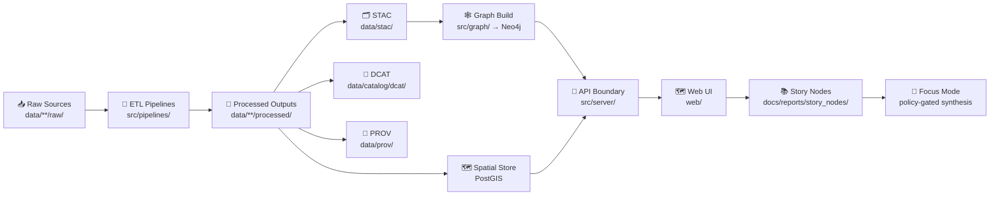
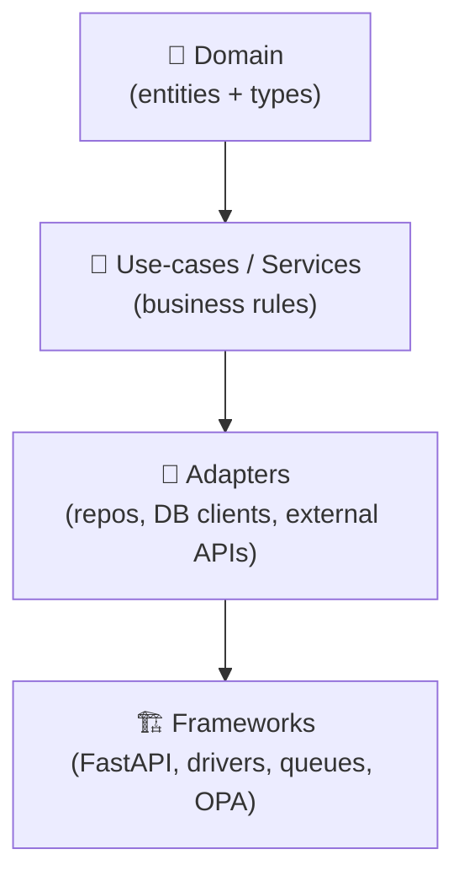

# 🏛️ Architecture (docs/architecture)

> [!NOTE]
> This folder is the **canonical home** for system design docs, blueprints, and ADRs (Architecture Decision Records).  
> If you’re looking for where to add code/data, jump to **🧩 Subsystem map**.

---

## 🚀 Start here (recommended reading order)

1. 📘 `../MASTER_GUIDE_v13.md` — repo-wide invariants, canonical pipeline ordering, canonical subsystem “homes”
2. 🧱 `./KFM_REDESIGN_BLUEPRINT_v13.md` — v13 restructure plan (contract-first + evidence-first)
3. 🧭 `./KFM_VISION_FULL_ARCHITECTURE.md` — long-term end-to-end vision (north star)
4. 🛣️ `./KFM_NEXT_STAGES_BLUEPRINT.md` — roadmap beyond v13
5. 🧾 `./adr/` — decision records (tradeoffs, constraints, and “why we chose this”)

> [!TIP]
> New here? Read **Master Guide → Redesign Blueprint → ADRs**. That order prevents “architecture drift” 🧲

---

## 🧠 The mental model

KFM is a **pipeline → catalogs → graph/databases → API → UI → narrative** system.

- **Pipelines** transform raw sources into processed datasets.
- **Catalogs + lineage** (STAC / DCAT / PROV) make every dataset discoverable and auditable.
- **Storage** (PostGIS + graph store like Neo4j) supports fast spatial queries + rich relationships.
- **Server boundary** (FastAPI + optional GraphQL) is the only “door” into the knowledge base.
- **UI** (React + MapLibre + optional Cesium) visualizes maps, timelines, and story-driven experiences.
- **Story Nodes + Focus Mode** deliver governed narrative + policy-gated AI synthesis.

---

## 🧭 “Truth path” (canonical flow)

> [!IMPORTANT]
> **No shortcuts.** If something is shown in the UI, it must have **processed data + catalogs + provenance** and must be reachable **through the API boundary** ✅

---

## 🧱 Non‑negotiable architecture invariants

- ✅ **Canonical pipeline order**: Raw → Processed → Catalog/Prov → (DB/Graph) → API → UI  
- ✅ **UI never talks to databases directly** (no direct PostGIS/Neo4j connections from `web/`)
- ✅ **Contract-first**: schemas + API contracts are first-class artifacts; changes require compatibility checks
- ✅ **Deterministic pipelines**: idempotent, config-driven, fully logged (re-run = same results)
- ✅ **Fail-closed governance**: if checks fail (license/policy/validation), the default is **block**
- ✅ **Separation of concerns**: each subsystem owns one job; integration happens at defined boundaries
- ✅ **FAIR + CARE by design**: discoverability, reuse, sovereignty, and ethics are enforced by architecture

---

## 🧩 Subsystem map (where things live)

| Subsystem | Canonical home 📁 | Owns ✅ | Never does 🚫 |
|---|---|---|---|
| Data staging | `data/**/{raw,work,processed}/` | Immutable sources, intermediates, final outputs | Hide data inside UI/server folders |
| Metadata catalogs | `data/stac/`, `data/catalog/dcat/` | Discovery + structure | “Publish” without catalog entries |
| Lineage | `data/prov/` | Inputs → activities → outputs audit trail | Allow “mystery data” in UI |
| Pipelines | `src/pipelines/` | ETL jobs + dataset build logic | Manual click-ops; non-repeatable transforms |
| Graph | `src/graph/` (+ `data/graph/` exports) | Ontology bindings, ingest, migrations | Duplicate graph logic elsewhere |
| Server boundary | `src/server/` | REST/GraphQL, contracts, redaction, policy checks | Leak DB details to clients |
| UI frontend | `web/` | Maps, timelines, UX | Ship raw data bundles; bypass API |
| Policy | `policy/` | OPA rules, Focus Mode gating, classification | “Trust the prompt” as enforcement |
| Docs & narrative | `docs/` + `docs/reports/story_nodes/` | Governed docs + Story Nodes | Treat narrative as untracked blobs |
| Tools | `tools/` | Validators, utilities, devops helpers | Become a second “pipelines” folder |
| Tests | `tests/` | Unit + integration tests | Be optional for boundary changes |

> [!TIP]
> If you’re unsure where something belongs, ask: **Is it data, a contract, code, policy, or narrative?**  
> Put it in the subsystem that **owns** that category—*not* where it’s convenient 🧭

---

## 🧼 Clean Architecture (keep core logic portable)

KFM favors a layered “Clean Architecture” so domain logic stays testable and framework-agnostic.

### Practical rules of thumb 🧷
- Domain models: **no DB, no HTTP, no file I/O** — just the “what”
- Services: orchestrate domain objects + enforce rules — the “how/why”
- Adapters: translate to/from PostGIS/Neo4j/files — the “plumbing”
- Frameworks: routes, wiring, middleware, background jobs — the “runtime”

---

## 🧾 Architecture Decision Records (ADRs)

**Write an ADR when you change:**
- Data stores (e.g., adding search index / new DB)
- A boundary contract (schemas, OpenAPI, GraphQL SDL)
- Governance/policy rules that block/permit classes of actions
- Anything “expensive to reverse” later 💸

**Where**
- `docs/architecture/adr/NNNN-short-title.md`

**Minimum ADR contents**
- Context → Decision → Alternatives → Consequences → Rollout/compat notes

---

## 🔁 Common change flows

### Add a new dataset / domain 🗺️
1. Add raw sources under `data/<domain>/raw/`
2. Implement/extend pipeline under `src/pipelines/`
3. Output final assets to `data/<domain>/processed/`
4. Generate boundary artifacts: **STAC + DCAT + PROV**
5. (Optional) load/sync into PostGIS + Neo4j
6. Expose via API contracts in `src/server/`
7. Render in UI (`web/`) and/or Story Nodes (`docs/reports/story_nodes/`)

### Add an AI/analysis “evidence artifact” 🤖
Treat it like a real dataset:
- stored as processed output
- cataloged (STAC/DCAT)
- traced (PROV)
- exposed via API with policy-aware labeling/redaction
- only then referenced by narratives or Focus Mode

---

## 🧭 Related docs (cross-cutting)

- ⚖️ Governance: `../governance/ROOT_GOVERNANCE.md`
- 🧠 Ethics: `../governance/ETHICS.md`
- 🪶 Sovereignty: `../governance/SOVEREIGNTY.md`
- 📚 Glossary: `../glossary.md`

---

## ✅ Definition of done for architecture updates

- [ ] Diagram(s) updated (or added) to match reality 🗺️  
- [ ] Any new boundary contract documented + validated 🧾  
- [ ] Governance/policy implications explicitly stated ⚖️  
- [ ] ADR added for non-trivial design decisions 🧠  
- [ ] “No shortcuts” rule preserved (provenance + API boundary) 🚪  