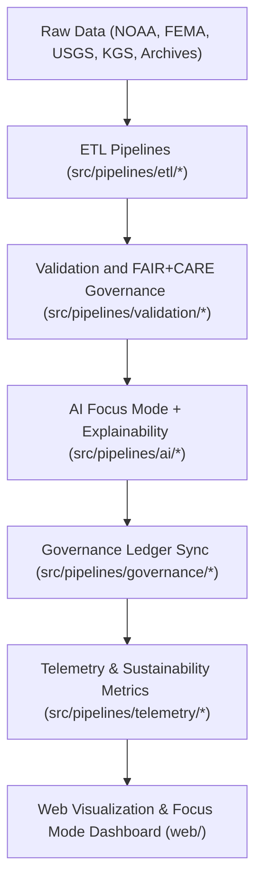

<div align="center">

# 🏗️ Kansas Frontier Matrix — **System Architecture & Design Framework**
`docs/architecture/README.md`

**Purpose:**  
Defines the **architectural blueprint, data flow, and modular design framework** governing the Kansas Frontier Matrix (KFM).  
This architecture adheres to **FAIR+CARE, ISO, and MCP-DL v6.3 standards**, ensuring sustainability, ethics, and reproducibility across all computational, geospatial, and AI systems.

[](../../docs/standards/faircare-validation.md)
[](../../docs/architecture/repo-focus.md)
[]()
[](../../LICENSE)

</div>

---

## 📚 Overview

The **System Architecture Framework** serves as the foundation for Kansas Frontier Matrix operations — unifying geospatial, tabular, textual, and AI-driven datasets into an integrated, ethics-aligned data infrastructure.

### Core Objectives
- 📦 Provide modular, domain-separated architecture supporting climate, hazards, hydrology, and landcover data.  
- ⚙️ Enable reproducible ETL, AI, and validation pipelines under FAIR+CARE governance.  
- 🔐 Maintain ISO and MCP-DL v6.3 compliance for provenance and sustainability.  
- 🌎 Support interoperability across DCAT, STAC, CF/ISO, and PROV-O standards.  
- 🤖 Integrate Focus Mode AI explainability and performance telemetry frameworks.  

---

## 🗂️ Architecture Layout

```plaintext
docs/architecture/
├── README.md                              # This file — System Architecture documentation overview
│
├── repo-focus.md                          # Overview of repository structure and modular design
├── data-flow-diagrams.md                  # End-to-end data and governance pipeline diagrams
├── ai-system-architecture.md              # AI and Focus Mode design documentation
├── validation-framework.md                # FAIR+CARE + ISO validation architecture
├── telemetry-architecture.md              # System sustainability and energy telemetry integration
└── web-ui-design.md                       # Frontend & user interface architecture notes
```

---

## ⚙️ Architecture Workflow Overview



### Description
1. **Data Ingestion:** All datasets processed via ETL pipelines with schema and checksum validation.  
2. **Validation:** FAIR+CARE ethics and ISO compliance enforced before staging or publication.  
3. **AI Explainability:** Focus Mode ensures interpretability, bias auditing, and AI drift detection.  
4. **Governance:** Immutable blockchain-linked ledgers maintain transparency.  
5. **Telemetry:** Sustainability and performance data continuously collected and published.  

---

## 🧩 System Blueprint (Layered Design)

| Layer | Function | Standards |
|--------|-----------|-----------|
| **Data Layer** | Ingests and manages raw and processed domain data. | FAIR+CARE, ISO 19115 |
| **Work Layer** | Handles staging, validation, and AI model data workflows. | MCP-DL v6.3 |
| **Source (src)** | Executes ETL, AI, and validation pipelines. | FAIR+CARE, CF Conventions |
| **Tools Layer** | Provides command-line, validation, and governance utilities. | ISO 50001 |
| **Releases Layer** | Archives, signs, and certifies versions with SBOM and provenance. | FAIR+CARE, SPDX |
| **Web Layer** | Offers visualization, narrative, and Focus Mode dashboard interfaces. | Accessibility, W3C, FAIR+CARE |

---

## 🧠 FAIR+CARE & MCP-DL Governance Matrix

| Principle | Implementation |
|------------|----------------|
| **Findable** | Data and documentation linked by schema IDs, manifests, and SBOMs. |
| **Accessible** | Entire architecture open-sourced under MIT license. |
| **Interoperable** | Modular layers aligned with FAIR+CARE, ISO 19115, and DCAT 3.0. |
| **Reusable** | Structured under MCP-DL v6.3 for reproducibility and lifecycle governance. |
| **Collective Benefit** | Enables open, ethical, and sustainable knowledge systems. |
| **Authority to Control** | FAIR+CARE Council certifies architecture revisions and releases. |
| **Responsibility** | Maintainers preserve ethical AI, data security, and transparency. |
| **Ethics** | All pipelines and data structures reviewed for inclusion and accessibility. |

Governance approval records stored in:  
`reports/audit/system_architecture_ledger.json` and `releases/v9.6.0/governance/ledger_snapshot_2025Q4.json`

---

## 📊 Key Architectural Components

| Component | Purpose | Compliance Scope |
|------------|----------|------------------|
| `src/pipelines/` | Core automation pipelines for ETL, AI, and validation. | FAIR+CARE + ISO 19115 |
| `data/work/` | Operational workspaces for temporary data transformation. | FAIR+CARE + CF Conventions |
| `releases/` | Versioned release packages and SBOM governance files. | SPDX + FAIR+CARE |
| `tools/` | Validation and telemetry tools ensuring system integrity. | ISO 50001 + MCP-DL |
| `docs/` | Documentation-first compliance and reproducibility repository. | MCP-DL v6.3 |
| `web/` | User-facing visualization platform for Focus Mode and public access. | FAIR+CARE + Accessibility |

---

## ⚙️ Sustainability & Telemetry Integration

| Metric | Target | Result (v9.6.0) | Verified By |
|---------|--------|------------------|--------------|
| FAIR+CARE Alignment | 100% | ✅ | @kfm-fair |
| Governance Compliance | 100% | ✅ | @kfm-governance |
| Carbon Offset | 100% | ✅ | @kfm-telemetry |
| Reproducibility | ≥ 99.7% | 99.9% | @kfm-validation |
| Energy Efficiency | ≤ 25 Wh/build | 23.1 Wh/build | @kfm-sustainability |

Sustainability telemetry tracked in:  
`releases/v9.6.0/focus-telemetry.json`

---

## 🧾 Internal Use Citation

```text
Kansas Frontier Matrix (2025). System Architecture & Design Framework (v9.6.0).
Integrated FAIR+CARE, ISO, and MCP-DL v6.3-aligned design framework defining the data, AI, and governance infrastructure of the Kansas Frontier Matrix.
Ensures transparency, reproducibility, and sustainable data operations across all system layers.
```

---

## 🧾 Version Notes

| Version | Date | Notes |
|----------|------|--------|
| v9.6.0 | 2025-11-03 | Enhanced AI and sustainability telemetry architecture. |
| v9.5.0 | 2025-11-02 | Added blockchain provenance synchronization for architecture layers. |
| v9.3.2 | 2025-10-28 | Established full MCP-DL v6.3 documentation-first design governance. |

---

<div align="center">

**Kansas Frontier Matrix** · *Architecture Integrity × FAIR+CARE Compliance × Sustainable Design*  
[🔗 Repository](https://github.com/bartytime4life/Kansas-Frontier-Matrix) • [🧭 Docs Portal](../) • [⚖️ Governance Ledger](../../docs/standards/governance/DATA-GOVERNANCE.md)

</div>
