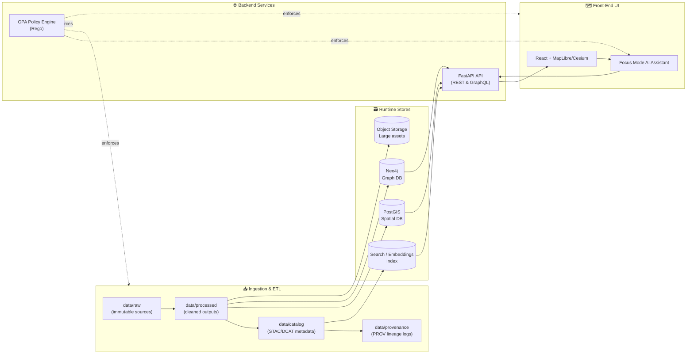
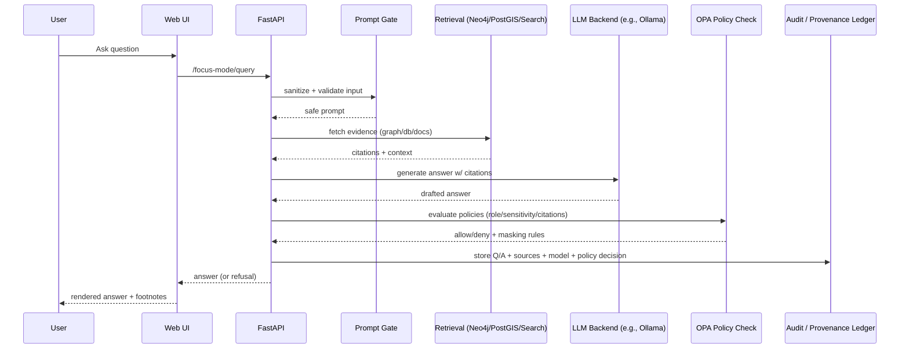

# 🏛️ Architecture


**Kansas Frontier Matrix (KFM)** is a geospatial knowledge & modeling platform that integrates **maps, data, narratives, and AI** in a **provenance-first** workflow—where “the map behind the map” (sources + lineage) is always traceable.  [oai_citation:0‡Kansas Frontier Matrix (KFM) – Comprehensive Technical Blueprint.pdf](sediment://file_000000006dbc71f89a5094ce310a452d)

KFM is explicitly designed as a **pipeline → catalog → database → API → UI** system—turning raw files into trustworthy, explorable knowledge with reproducibility and auditability.  [oai_citation:1‡Kansas Frontier Matrix (KFM) – Comprehensive Technical Blueprint.pdf](sediment://file_000000006dbc71f89a5094ce310a452d)

> 🔒 **Non‑negotiable:** the **UI never touches databases directly**; everything is mediated by the backend API + governance rules, and the AI assistant (“Focus Mode”) is constrained by policy.  [oai_citation:2‡Kansas Frontier Matrix (KFM) – Comprehensive Technical Blueprint.pdf](sediment://file_000000006dbc71f89a5094ce310a452d)

---

## 🧭 Quick Navigation

- 📌 **Start here:** `system_overview.md` (end-to-end “truth path” + major components)
- 🤖 **AI / Focus Mode:** `ai/AI_SYSTEM_OVERVIEW.md` and `ai/OLLAMA_INTEGRATION.md`
- 🌐 **Backend API contract:** `../../src/server/api/README.md`
- 🧾 **Policy-as-code:** `../../policy/` (OPA/Rego)
- 🧱 **ADRs:** `adr/` (Architecture Decision Records)

---

## 🗂️ Folder Map

```text
docs/architecture/
├── README.md              👈 you are here
├── system_overview.md     🧭 end-to-end architecture + truth path
├── ai/
│   ├── AI_SYSTEM_OVERVIEW.md   🤖 Focus Mode overview
│   └── OLLAMA_INTEGRATION.md   🧠 LLM backend + RAG + safety
├── adr/                   🧾 architecture decisions (one per change)
└── diagrams/              📈 exported diagrams / images (optional)
```

---

## 🧠 Architectural Principles

### 1) ⛓️ Provenance‑First (“map behind the map”)
Every layer/dataset/story/AI output is traceable back to original sources.  [oai_citation:3‡Kansas Frontier Matrix (KFM) – Comprehensive Technical Blueprint.pdf](sediment://file_000000006dbc71f89a5094ce310a452d)

### 2) 🛣️ The “Truth Path” (canonical data flow)
KFM’s data moves through a strict pipeline (no bypassing):  
**Raw inputs → ETL pipelines → Processed data (+ metadata + provenance) → Runtime stores → API → UI**.  [oai_citation:4‡Kansas Frontier Matrix (KFM) – Comprehensive Technical Blueprint.pdf](sediment://file_000000006dbc71f89a5094ce310a452d)

Concretely, raw data lands in `data/raw/`, is standardized into `data/processed/`, and generates **STAC/DCAT** metadata (`data/catalog/`) plus **PROV** lineage logs (`data/provenance/`).  [oai_citation:5‡Kansas Frontier Matrix (KFM) – Comprehensive Technical Blueprint.pdf](sediment://file_000000006dbc71f89a5094ce310a452d)

### 3) 🛡️ Fail‑Closed Governance
If metadata is missing, policy isn’t satisfied, or provenance isn’t present, the system **blocks by default** (“fail closed”).  [oai_citation:6‡Kansas Frontier Matrix Comprehensive System Documentation.pdf](sediment://file_00000000ef40722faf17987b69730695)

### 4) 🧩 Clean Architecture + modularity
KFM follows a layered **Clean Architecture** (domain → services/use-cases → adapters → infrastructure), keeping core logic decoupled from frameworks and external systems.  [oai_citation:7‡Kansas Frontier Matrix (KFM) – Comprehensive Technical Blueprint.pdf](sediment://file_000000006dbc71f89a5094ce310a452d)

---

## 🏗️ System at a Glance

### 🧱 High‑Level Components
KFM uses a multi-tier architecture:

- **Ingest:** raw sources → immutable storage
- **Process:** deterministic ETL → cleaned/normalized outputs
- **Describe:** catalog metadata + provenance
- **Store:** runtime databases + indexes + object storage
- **Serve:** FastAPI service layer (REST/GraphQL)
- **Protect:** policy enforcement via OPA middleware
- **Experience:** React UI (MapLibre + Cesium) + Focus Mode AI assistant [oai_citation:8‡Kansas Frontier Matrix Comprehensive System Documentation.pdf](sediment://file_00000000ef40722faf17987b69730695)

---

## 🔁 End‑to‑End Architecture Diagram (Truth Path)



**Interpretation:** raw data is ingested and transformed into processed outputs **with machine‑readable metadata (STAC/DCAT) and provenance (PROV)**, loaded into runtime stores (PostGIS/Neo4j/search/object storage), and served exclusively through the API. Governance is enforced at boundaries via OPA, and the UI never bypasses the API (“truth path”).  [oai_citation:9‡Kansas Frontier Matrix (KFM) – Comprehensive Technical Blueprint.pdf](sediment://file_000000006dbc71f89a5094ce310a452d)

---

## 🧰 Core Subsystems

### 📥 Data Plane (Ingestion + ETL)
- Raw inputs (CSV/APIs/sensor feeds/etc.) land in immutable raw storage, then become cleaned **processed** datasets with catalog metadata + provenance records.  [oai_citation:10‡Kansas Frontier Matrix Comprehensive System Documentation.pdf](sediment://file_00000000ef40722faf17987b69730695)
- Provenance is mandatory: datasets without PROV are treated as not publishable.  [oai_citation:11‡Kansas Frontier Matrix Comprehensive System Documentation.pdf](sediment://file_00000000ef40722faf17987b69730695)

**Design rule:** if it can’t be traced, it can’t ship.

---

### 🗃️ Storage Plane (Runtime Stores)
KFM’s runtime stores are optimized for different query modes:

- **PostGIS** for geospatial queries (vector/raster, spatial joins, distance, etc.) [oai_citation:12‡Kansas Frontier Matrix (KFM) – Comprehensive Technical Blueprint.pdf](sediment://file_000000006dbc71f89a5094ce310a452d)
- **Neo4j** for semantic relationships (entities, places, events, sources, narrative links) [oai_citation:13‡Kansas Frontier Matrix (KFM) – Comprehensive Technical Blueprint.pdf](sediment://file_000000006dbc71f89a5094ce310a452d)
- **Search / embeddings index** for full-text + semantic similarity retrieval (documents, narratives) [oai_citation:14‡Kansas Frontier Matrix Comprehensive System Documentation.pdf](sediment://file_00000000ef40722faf17987b69730695)
- **Object storage** for large assets (imagery, big rasters, files) [oai_citation:15‡Kansas Frontier Matrix Comprehensive System Documentation.pdf](sediment://file_00000000ef40722faf17987b69730695)

---

### 🌐 Service Plane (API + Policy)
A centralized **FastAPI** service layer exposes everything through **REST/GraphQL**, and enforces policies via **OPA** middleware.  [oai_citation:16‡Kansas Frontier Matrix Comprehensive System Documentation.pdf](sediment://file_00000000ef40722faf17987b69730695)

**Key idea:** the API is the gatekeeper between data stores and presentation.  [oai_citation:17‡Kansas Frontier Matrix (KFM) – Comprehensive Technical Blueprint.pdf](sediment://file_000000006dbc71f89a5094ce310a452d)

---

### 🗺️ Experience Plane (UI + Focus Mode)
- UI: React web app with MapLibre maps + Cesium 3D globe (and potential other clients) consuming the API.  [oai_citation:18‡Kansas Frontier Matrix Comprehensive System Documentation.pdf](sediment://file_00000000ef40722faf17987b69730695)
- AI: Focus Mode assistant operates *through the same API & policy gates*, never directly querying databases.  [oai_citation:19‡Kansas Frontier Matrix (KFM) – Comprehensive Technical Blueprint.pdf](sediment://file_000000006dbc71f89a5094ce310a452d)

---

## 🤖 Focus Mode AI Architecture (Evidence‑First RAG)

### 🎯 What “Evidence‑First” means
Every answer must be backed by sources; prompts instruct the model to emit citations, and policy checks validate that citations exist and content is allowed.  [oai_citation:20‡Kansas Frontier Matrix Comprehensive System Documentation.pdf](sediment://file_00000000ef40722faf17987b69730695)

### 🧪 How Focus Mode grounds answers
- Uses **Neo4j knowledge graph grounding** so responses are constrained to what graph + documents support, reducing hallucinations.  [oai_citation:21‡Kansas Frontier Matrix Comprehensive System Documentation.pdf](sediment://file_00000000ef40722faf17987b69730695)
- Implements **RAG**: graph/database fact-finding + embedding-powered document retrieval + LLM synthesis.  [oai_citation:22‡Kansas Frontier Matrix Comprehensive System Documentation.pdf](sediment://file_00000000ef40722faf17987b69730695)

### 🧼 Prompt Gate (input safety)
Before any prompt reaches the LLM backend, user input goes through a **Prompt Gate** that sanitizes/filters prompt injection and disallowed requests.  [oai_citation:23‡Kansas Frontier Matrix Comprehensive System Documentation.pdf](sediment://file_00000000ef40722faf17987b69730695)

### 🧾 Output gates (citation + policy enforcement)
Policy gates check that AI outputs include citations and do not contain disallowed/sensitive content; “better to block than allow something ungoverned.”  [oai_citation:24‡Kansas Frontier Matrix Comprehensive System Documentation.pdf](sediment://file_00000000ef40722faf17987b69730695)

### 🧠 Modular AI implementation (suggested layout)
The Ollama integration documentation proposes a cleanly separated AI module (pipeline, retrieval, prompt templates, policy checks), enabling pluggability if the LLM backend changes later.  [oai_citation:25‡Kansas Frontier Matrix Comprehensive System Documentation.pdf](sediment://file_00000000ef40722faf17987b69730695)



---

## 🔐 Governance, Security, and Compliance

### 👥 RBAC + OPA runtime enforcement
KFM defines user roles (Public Viewer / Contributor / Maintainer / Admin) and checks each request against roles + data sensitivity. Policies are enforced at runtime through an **Open Policy Agent (OPA)** “policy pack.”  [oai_citation:26‡Kansas Frontier Matrix Comprehensive System Documentation.pdf](sediment://file_00000000ef40722faf17987b69730695)

### 🧾 Policy-as-code in Git + CI enforcement
Governance rules live in the repo under `policy/` (OPA/Rego), making governance versioned and reviewable like code. CI can run policy tests (e.g., **Conftest**) to prevent merging non-compliant data/code (missing license, missing metadata, etc.).  [oai_citation:27‡Kansas Frontier Matrix (KFM) – Comprehensive Technical Blueprint.pdf](sediment://file_000000006dbc71f89a5094ce310a452d)

### 🔎 Auditability
KFM logs provenance for datasets and maintains an immutable ledger of AI queries/outputs, storing the question, sources used, model version, and policy decision.  [oai_citation:28‡Kansas Frontier Matrix Comprehensive System Documentation.pdf](sediment://file_00000000ef40722faf17987b69730695)

---

## 🚀 Deployment Topologies

### 🐳 Local Dev (Docker Compose)
The blueprint describes a dev stack orchestrated with Docker Compose that commonly includes:
- PostGIS (`db`)
- Neo4j (`graph`)
- FastAPI backend (`api`)
- React frontend (`web`)
- Optional OPA sidecar (`opa`) and other services like search/Jupyter [oai_citation:29‡Kansas Frontier Matrix (KFM) – Comprehensive Technical Blueprint.pdf](sediment://file_000000006dbc71f89a5094ce310a452d)

### ☁️ Cloud-native deployment
KFM is designed for AWS or Azure with object storage (e.g., S3), containerized services (Docker) orchestrated via Kubernetes/ECS, and pipeline orchestration (e.g., Airflow/Step Functions; Kafka/Kinesis for streaming).  [oai_citation:30‡Kansas Frontier Matrix Comprehensive System Documentation.pdf](sediment://file_00000000ef40722faf17987b69730695)

---

## 🧱 Clean Architecture (How to keep KFM maintainable)

KFM follows Clean Architecture to preserve modularity and testability:

- **Domain layer:** pure entities/models (framework-agnostic)
- **Service / use-case layer:** business logic + workflows
- **Adapters layer:** PostGIS/Neo4j/search integrations behind interfaces
- **Infrastructure layer:** FastAPI app wiring, routers, DI, startup config [oai_citation:31‡Kansas Frontier Matrix (KFM) – Comprehensive Technical Blueprint.pdf](sediment://file_000000006dbc71f89a5094ce310a452d)

> ✅ Rule of thumb: **external systems are details**; business logic should survive a database swap or framework upgrade.

---

## 🧩 Extending the System

### ➕ Adding a new dataset (minimum checklist)
- [ ] Place inputs in `data/raw/` (immutable source)
- [ ] Write deterministic ETL → output to `data/processed/`
- [ ] Generate **STAC/DCAT** metadata → `data/catalog/`
- [ ] Generate **PROV** lineage logs → `data/provenance/` [oai_citation:32‡Kansas Frontier Matrix (KFM) – Comprehensive Technical Blueprint.pdf](sediment://file_000000006dbc71f89a5094ce310a452d)
- [ ] Ensure policy gates pass (license, sensitivity, provenance) [oai_citation:33‡Kansas Frontier Matrix Comprehensive System Documentation.pdf](sediment://file_00000000ef40722faf17987b69730695)
- [ ] Load into runtime stores as appropriate (PostGIS / Neo4j / search index)

### ➕ Adding a new API capability
- [ ] Add a use-case/service in the service layer
- [ ] Implement adapters (repositories/clients) for PostGIS/Neo4j/search
- [ ] Expose a controller/route in FastAPI (thin controller, delegate to services) [oai_citation:34‡Kansas Frontier Matrix (KFM) – Comprehensive Technical Blueprint.pdf](sediment://file_000000006dbc71f89a5094ce310a452d)
- [ ] Add/adjust OPA policies + CI tests if access rules change [oai_citation:35‡Kansas Frontier Matrix (KFM) – Comprehensive Technical Blueprint.pdf](sediment://file_000000006dbc71f89a5094ce310a452d)

### ➕ Adding a new Focus Mode tool/retrieval path
- [ ] Update retrieval module (graph/db/search)
- [ ] Update prompt templates to keep citations stable
- [ ] Add policy checks for new output types (deny/mask if sensitive)
- [ ] Log provenance (sources + policy decision) for auditability [oai_citation:36‡Kansas Frontier Matrix Comprehensive System Documentation.pdf](sediment://file_00000000ef40722faf17987b69730695)

---

## 📚 Primary Architecture References (Project Files)

-  [oai_citation:37‡Kansas Frontier Matrix (KFM) – Comprehensive Technical Blueprint.pdf](sediment://file_000000006dbc71f89a5094ce310a452d) **KFM – Comprehensive Technical Blueprint (PDF)**
-  [oai_citation:38‡Kansas Frontier Matrix Comprehensive System Documentation.pdf](sediment://file_00000000ef40722faf17987b69730695) **KFM – Comprehensive System Documentation (PDF)**
-  [oai_citation:39‡Data Spaces.pdf](sediment://file_0000000053c071f5a9733b1b09cc9f76) **Data Spaces (PDF)** (architecture/governance reference material)

---

## 📝 Notes

- This README is intended to be the **index + system overview** for `docs/architecture/`.
- If you add new architecture docs, link them in **Quick Navigation** and update the **Folder Map**.