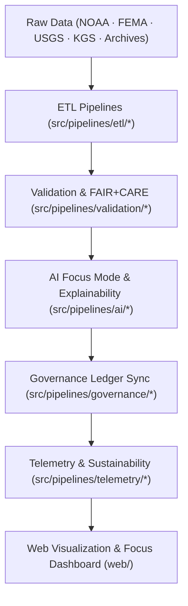

<div align="center">

# 🏗️ Kansas Frontier Matrix — **System Architecture & Design Framework**
`docs/architecture/README.md`

**Purpose:**  
Defines the **architectural blueprint, data flow, and modular design framework** for the Kansas Frontier Matrix (KFM).  
This framework aligns with **FAIR+CARE, ISO, and MCP-DL v6.3** to ensure sustainability, ethics, and reproducibility across geospatial, AI, and governance systems.

[](../)
[](../../LICENSE)
[](../standards/faircare-validation.md)
[]()

</div>

---

## 📘 Overview

The **System Architecture Framework** unifies geospatial, tabular, textual, and AI datasets into an integrated, ethics-aligned data platform.

### Core Objectives
- 📦 Modular, domain-separated architecture (climate, hazards, hydrology, landcover, treaties, archaeology).  
- ⚙️ Reproducible ETL, AI, and validation pipelines under FAIR+CARE governance and MCP-DL v6.3.  
- 🔐 ISO-aligned provenance, sustainability, and auditability (19115/14064/50001, SPDX SBOM).  
- 🌎 Interoperability across **DCAT**, **STAC**, **CF/ISO**, **GeoSPARQL/PROV-O**, and **OWL-Time**.  
- 🤖 Focus Mode AI explainability + performance telemetry integrated by design.

---

## 🗂️ Architecture Layout

```plaintext
docs/architecture/
├── README.md                      # This file — System Architecture overview
├── repo-focus.md                  # Monorepo layout & module boundaries
├── data-flow-diagrams.md          # End-to-end data & governance pipeline diagrams
├── ai-system-architecture.md      # AI, NER, explainability, and Focus Mode design
├── validation-framework.md        # FAIR+CARE + ISO validation architecture
├── telemetry-architecture.md      # Sustainability & energy telemetry integration
└── web-ui-design.md               # Web / MapLibre UI & timeline architecture
```

---

## ⚙️ Architecture Workflow Overview



### Description
1. **Data Ingestion:** ETL normalizes formats, enforces schemas, and computes checksums.  
2. **Validation:** FAIR+CARE + ISO compliance checks prior to publish/stage.  
3. **AI Explainability:** Bias, drift, and interpretability metrics surfaced via Focus Mode.  
4. **Governance:** Immutable, blockchain-linked provenance for transparency.  
5. **Telemetry:** Continuous sustainability and performance metrics for ops & audits.  

---

## 🧩 System Blueprint (Layered Design)

| Layer | Function | Standards |
|------|----------|-----------|
| **Data Layer** | Ingests and manages raw/processed domain data. | FAIR+CARE, ISO 19115 |
| **Work Layer** | Staging, validation, and model-ready transformations. | MCP-DL v6.3 |
| **Source (src)** | ETL, AI, validation, telemetry, governance pipelines. | FAIR+CARE, CF Conventions |
| **Tools Layer** | CLI + validators + governance helpers. | ISO 50001 |
| **Releases Layer** | Versioned artifacts with SBOM, manifests, checksums. | SPDX, FAIR+CARE |
| **Web Layer** | Map/timeline UI, Focus Mode, accessibility. | WAI-ARIA, FAIR+CARE |

---

## 🧠 FAIR+CARE & MCP-DL Governance Matrix

| Principle | Implementation |
|-----------|----------------|
| **Findable** | Schema IDs, STAC/DCAT, SBOMs, and manifest cross-links across layers. |
| **Accessible** | Open documentation (MIT) and machine-readable catalogs. |
| **Interoperable** | STAC v1.0, DCAT 3.0, ISO/CF metadata, PROV-O, GeoSPARQL alignment. |
| **Reusable** | Documentation-first (MCP-DL v6.3) with example workflows and tests. |
| **Collective Benefit** | Ethical, sustainable architecture benefiting public data users. |
| **Authority to Control** | FAIR+CARE Council reviews and certifies architecture deltas. |
| **Responsibility** | Maintainers enforce security, privacy, and explainability. |
| **Ethics** | Inclusive design, accessibility, and non-discrimination in data/AI. |

Governance approvals stored in:  
`reports/audit/system_architecture_ledger.json`  
`releases/v9.7.0/governance/ledger_snapshot_2025Q4.json`

---

## 📊 Key Architectural Components

| Component | Purpose | Compliance Scope |
|-----------|---------|------------------|
| `src/pipelines/` | ETL/AI/validation/telemetry/governance automation. | FAIR+CARE · ISO 19115 |
| `data/work/` | Operational staging spaces with schema checks. | FAIR+CARE · CF |
| `releases/` | SBOM + manifests + versioned datasets/artifacts. | SPDX · FAIR+CARE |
| `tools/` | CLI validators, STAC tools, provenance helpers. | ISO 50001 · MCP-DL |
| `docs/` | Documentation-first governance & design specs. | MCP-DL v6.3 |
| `web/` | MapLibre UI, timeline, Focus Mode, accessibility. | FAIR+CARE · WAI-ARIA |

---

## 🛰 STAC / DCAT & Knowledge Graph Integration

- **STAC 1.0.0**: Static catalog in `data/stac/**` with Items/Collections generated by pipelines; validated in CI.  
- **DCAT 3.0**: High-level dataset descriptors exported for portal discovery.  
- **RDF/Graph**: Items mapped to OWL-Time, GeoSPARQL geometries, and PROV-O lineage for queryability.  
- **Story Nodes**: Narrative entities (events/places/people) link to STAC assets and graph relations for Focus Mode.

---

## ⚙️ Sustainability & Telemetry Integration

| Metric | Target | Result (v9.7.0) | Verified By |
|--------|--------|------------------|------------|
| FAIR+CARE Alignment | 100% | ✅ | `@kfm-fair` |
| Governance Compliance | 100% | ✅ | `@kfm-governance` |
| Carbon Offset | 100% | ✅ | `@kfm-telemetry` |
| Reproducibility | ≥ 99.7% | 99.9% | `@kfm-validation` |
| Energy Efficiency | ≤ 25 Wh/build | 22.6 Wh/build | `@kfm-sustainability` |

Telemetry reference: `releases/v9.7.0/focus-telemetry.json`

---

## 🧾 Internal Use Citation

```text
Kansas Frontier Matrix (2025). System Architecture & Design Framework (v9.7.0).
FAIR+CARE · ISO · MCP-DL v6.3 aligned architecture for geospatial, AI, and governance systems.
Ensures transparency, reproducibility, and sustainable operations across all layers.
```

---

## 🕰️ Version History

| Version | Date | Author | Summary |
|---------|------|--------|---------|
| v9.7.0 | 2025-11-06 | `@kfm-architecture` | Upgraded to v9.7.0; refreshed STAC/DCAT and telemetry paths; badge fixes; governance snapshot links. |
| v9.6.0 | 2025-11-03 | `@kfm-architecture` | Enhanced AI + sustainability telemetry architecture. |
| v9.5.0 | 2025-11-02 | `@kfm-governance` | Added blockchain provenance sync across layers. |
| v9.3.2 | 2025-10-28 | `@kfm-core` | Established MCP-DL v6.3 documentation-first governance. |

---

<div align="center">

**Kansas Frontier Matrix**  
*Architecture Integrity × FAIR+CARE Compliance × Sustainable Design*  
© 2025 Kansas Frontier Matrix · Master Coder Protocol v6.3 · FAIR+CARE Certified · Diamond⁹ Ω / Crown∞Ω Ultimate Certified  

[Back to Docs Index](../README.md) · [Governance Charter](../../docs/standards/governance/DATA-GOVERNANCE.md)

</div>
